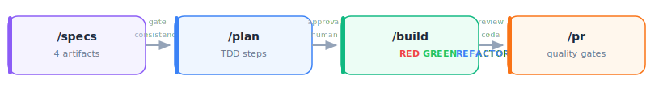
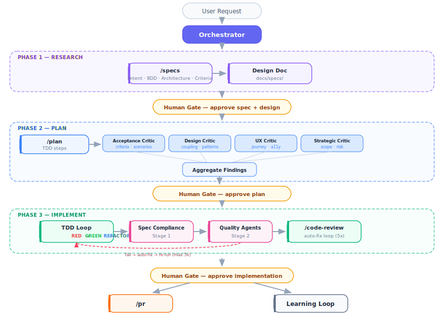

# Agentic Dev Team

A Claude Code plugin that adds a full persona-driven AI development team to any project. The Orchestrator routes tasks to specialized agents, inline review checkpoints catch quality issues during implementation, and skills provide reusable knowledge modules that any agent can draw on.

## Workflow

Four commands drive feature development from idea to pull request:

```
/specs  →  /plan  →  /build  →  /pr
```

| Step | Command | What it does |
| --- | --- | --- |
| **1. Specify** | `/specs` | Collaborate on four artifacts: Intent, BDD/Gherkin scenarios, Architecture notes, Acceptance Criteria. A consistency gate must pass before moving on. Skip for bug fixes, refactors, or trivial changes. |
| **2. Plan** | `/plan` | Create a step-by-step TDD implementation plan. Four plan review personas (Acceptance Test, Design, UX, Strategic critics) challenge the plan before the human sees it. Human approves before any code is written. |
| **3. Build** | `/build` | Execute the approved plan. Each step follows RED-GREEN-REFACTOR with inline review checkpoints (spec-compliance first, then quality agents). Produces verification evidence. |
| **4. Ship** | `/pr` | Run quality gates (tests, typecheck, lint, code review) and create a pull request. |

Each step produces artifacts the next step consumes. Human review gates sit between each transition.



For bug fixes or simple tasks, skip `/specs` and start at `/plan` or go straight to implementation. The orchestrator routes trivially when the full workflow isn't needed.

### Supporting commands

| Command | When to use |
| --- | --- |
| `/code-review` | Run all review agents, auto-fix actionable issues, and re-run until clean (up to 5 iterations) |
| `/continue` | Resume an in-progress build or plan across sessions |
| `/browse` | Visual QA via Playwright |
| `/benchmark` | Runtime performance metrics (Core Web Vitals, resource sizes) against baselines |
| `/careful` / `/freeze` / `/guard` | Safety modes for production-critical sessions |

### Automated pre-commit review

Every `git commit` is automatically gated by `/code-review`. A `PreToolUse` hook detects commit attempts and blocks them until a passing review exists for the exact set of staged files.

**Flow**: attempt commit → hook blocks → Claude runs `/code-review` (auto-scopes to uncommitted changes) → if pass/warn, a `.review-passed` gate file is written → next commit attempt succeeds.

**Bypass**: `git commit --no-verify` skips the review gate.

## How It Works

**Team agents** define roles (persona, behavior, collaboration). **Review agents** check work quality in real time. **Skills** define knowledge (patterns, guidelines, procedures). **Slash commands** invoke agents and skills directly. The **Orchestrator** controls task routing, model selection, and the inline review feedback loop.

### Three-Phase Workflow (Orchestrator-Driven)

For complex tasks where the orchestrator manages the full lifecycle, every non-trivial task follows **Research → Plan → Implement** with human review gates between phases:

- **Research** produces a **design document** (`docs/specs/`) with problem statement, alternatives, and scope boundaries
- **Plan** is critically reviewed by **four plan review personas** (Acceptance Test, Design & Architecture, UX, and Strategic critics) running in parallel before the human sees it
- **Implement** enforces strict **TDD** (RED-GREEN-REFACTOR with hard gates), uses **worktree isolation** for parallel units, and runs a **three-stage inline review**: spec-compliance first ("does code match spec?"), then quality agents ("is code good?"), then browser verification for UI changes. Actionable issues (error/warning severity with high/medium confidence) are **auto-fixed and re-reviewed** in a loop (up to 5 iterations) — only issues requiring human judgment are escalated. All agents must provide **verification evidence** (fresh test output) before claiming completion. After the human gate, a **branch workflow** handles PR creation and merge strategy.



## Install

This repository ships **two plugins**. Install instructions, tool prerequisites, and verification steps live in each plugin's README:

| Plugin | Purpose | Install guide |
| --- | --- | --- |
| **agentic-dev-team** | Full persona-driven development team — orchestrator, 12 team agents, 19 review agents, 31 skills, 56 commands | [plugins/agentic-dev-team/README.md](plugins/agentic-dev-team/README.md) |
| **agentic-security-review** | Deep security assessment + adversarial ML red-team harness. Companion to agentic-dev-team. | [plugins/agentic-security-review/README.md](plugins/agentic-security-review/README.md) |

**First time here?** Start with `agentic-dev-team`. Add `agentic-security-review` only if you run full `/security-assessment` pipelines against target repos.

## What's Included

The plugin ships with **12 team agents**, **19 review agents**, **31 skills**, **8 subagent prompt templates**, and **56 slash commands**. For the full catalogs:

- [Agents](docs/agent_info.md) — team agent roster, review agent roster, persona template, how to add/remove/customize
- [Skills & Commands](docs/skills.md) — skills catalog (by category), slash commands catalog, how to add new ones

## Repository Structure

```text
.claude-plugin/marketplace.json         # Marketplace catalog (points at both plugins)

plugins/agentic-dev-team/                # Plugin source (ships to users)
├── README.md                            # Install + prerequisites for this plugin
├── .claude-plugin/plugin.json           # Plugin manifest + version
├── agents/                              # Team agents (12) + review agents (19)
├── commands/                            # Slash commands
├── skills/                              # Reusable knowledge modules (31 skills)
├── hooks/                               # PreToolUse guards + PostToolUse advisory hooks
├── knowledge/                           # Progressive disclosure reference files
├── templates/                           # Language-specific agent templates
├── settings.json                        # Hook registrations
├── install.sh                           # Prerequisite check
└── CLAUDE.md                            # Orchestration pipeline config (auto-loaded)

plugins/agentic-security-review/         # Companion plugin — /security-assessment
├── README.md                            # Install + prerequisites for this plugin
├── install-macos.sh                     # One-command tool installer (macOS)
├── install.sh                           # Prerequisite verifier
├── agents/ commands/ skills/ harness/   # Assessment + red-team pipeline
└── CLAUDE.md                            # Pipeline config (auto-loaded)

docs/                                    # Dev documentation (not shipped)
plans/                                   # Implementation plans (not shipped)
evals/                                   # Agent eval fixtures (not shipped)
scripts/                                 # Zero-install assessment runner + helpers
```

---

## Local Development

### Testing locally

Install the plugin from the local path into a test project:

```bash
claude plugin install --scope project /path/to/agentic-dev-team/plugins/agentic-dev-team
```

### Testing agents and hooks

**Eval suite** — run against a single agent or the full set:

```
/agent-eval
/agent-eval plugins/agentic-dev-team/agents/naming-review.md
```

**Structural compliance** — verify all agents and commands:

```
/agent-audit
```

### Hook paths

Hooks are registered in `plugins/agentic-dev-team/settings.json` and ship with the plugin. When developing locally, hooks run from `plugins/agentic-dev-team/hooks/`.

### Adding an agent or skill

```
/agent-add <description or URL to a coding standard>
```

This scaffolds the agent file, adds it to the registry in `CLAUDE.md`, and creates eval fixtures. Run `/agent-audit` and `/agent-eval` to verify compliance.

### Documentation

| Guide | Description |
| --- | --- |
| [Getting Started](GETTING-STARTED.md) | Hands-on tutorial: invoke agents, skills, and common workflows |
| [Architecture](docs/architecture.md) | Context management, quality assurance, governance, multi-LLM routing |
| [Agents](docs/agent_info.md) | Agent roster, persona template, adding/removing/customizing agents |
| [Skills & Commands](docs/skills.md) | Skills catalog, slash commands catalog |
| [Eval System](docs/eval-system.md) | How review agent accuracy is measured and graded |
