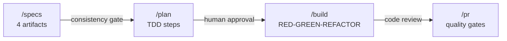
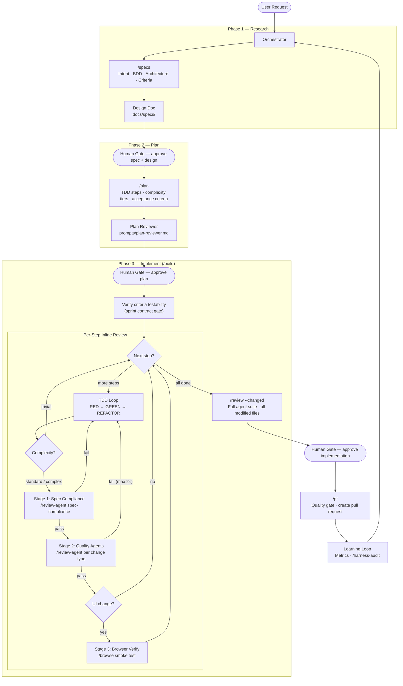

# Agentic Dev Team

A Claude Code plugin that adds a full persona-driven AI development team to any project. The Orchestrator routes tasks to specialized agents, inline review checkpoints catch quality issues during implementation, and skills provide reusable knowledge modules that any agent can draw on.

## Workflow

Four commands drive feature development from idea to pull request:

```
/specs  →  /plan  →  /build  →  /pr
```

| Step | Command | What it does |
| --- | --- | --- |
| **1. Specify** | `/specs` | Collaborate on four artifacts: Intent, BDD/Gherkin scenarios, Architecture notes, Acceptance Criteria. A consistency gate must pass before moving on. Skip for bug fixes, refactors, or trivial changes. |
| **2. Plan** | `/plan` | Create a step-by-step TDD implementation plan. Checks for spec artifacts first — if none exist, asks whether to continue or run `/specs`. Human approves before any code is written. |
| **3. Build** | `/build` | Execute the approved plan. Each step follows RED-GREEN-REFACTOR with inline review checkpoints (spec-compliance first, then quality agents). Produces verification evidence. |
| **4. Ship** | `/pr` | Run quality gates (tests, typecheck, lint, code review) and create a pull request. |

Each step produces artifacts the next step consumes. Human review gates sit between each transition.



For bug fixes or simple tasks, skip `/specs` and start at `/plan` or go straight to implementation. The orchestrator routes trivially when the full workflow isn't needed.

### Supporting commands

| Command | When to use |
| --- | --- |
| `/code-review` | Run all review agents against changed files (also runs as part of `/build`) |
| `/continue` | Resume an in-progress build or plan across sessions |
| `/browse` | Visual QA via Playwright |
| `/careful` / `/freeze` / `/guard` | Safety modes for production-critical sessions |

## How It Works

**Team agents** define roles (persona, behavior, collaboration). **Review agents** check work quality in real time. **Skills** define knowledge (patterns, guidelines, procedures). **Slash commands** invoke agents and skills directly. The **Orchestrator** controls task routing, model selection, and the inline review feedback loop.

### Three-Phase Workflow (Orchestrator-Driven)

For complex tasks where the orchestrator manages the full lifecycle, every non-trivial task follows **Research → Plan → Implement** with human review gates between phases:

- **Research** produces a **design document** (`docs/specs/`) with problem statement, alternatives, and scope boundaries
- **Plan** is pre-checked by an automated **plan reviewer** before the human sees it
- **Implement** enforces strict **TDD** (RED-GREEN-REFACTOR with hard gates), uses **worktree isolation** for parallel units, and runs a **three-stage inline review**: spec-compliance first ("does code match spec?"), then quality agents ("is code good?"), then browser verification for UI changes. All agents must provide **verification evidence** (fresh test output) before claiming completion. After the human gate, a **branch workflow** handles PR creation and merge strategy.



## Install

### Prerequisites

**Required:**

- [Claude Code](https://docs.anthropic.com/en/docs/claude-code) installed and authenticated
- `jq` — used by PostToolUse hooks for JSON parsing
  - macOS: `brew install jq`
  - Linux: `apt install jq` or `yum install jq`

**Recommended:**

- [Beads](https://github.com/gastownhall/beads) (`bd`) — git-backed issue tracker designed for AI agents. If `bd` is not installed, agents fall back to `memory/` progress files.

  AI agents start each session with a fresh context window — they don't remember what happened last time. Beads solves this "fresh context" problem by giving agents a structured, queryable task graph they can read at session start instead of reconstructing state from prose summaries.

  How agents use it across the three-phase workflow:

  - **Session start** — Agents run `bd ready --json` to find their next unblocked task
  - **Research** — Discovered problems are filed as Beads issues so they survive context compaction
  - **Plan** — The implementation plan is decomposed into Beads issues with dependency links (`bd dep add`)
  - **Implement** — Agents work one issue per session, mark it `done`, then end the session. The next session picks up the next unblocked item
  - **Crash recovery** — If a session dies mid-task, the issue stays `in-progress` with a checkpoint in the body, so the next session can resume

  Beads and `memory/` progress files are complementary: Beads is the source of truth for *what work remains* (structured task graph), while `memory/` captures *why decisions were made* (prose context).

  ```bash
  npm install -g @beads/bd
  # or: brew install beads
  ```

  Initialize in your project:

  ```bash
  bd init
  git add .beads && git commit -m "Initialize Beads task tracker"
  ```

**Optional:**

- `semgrep` — required only for `/semgrep-analyze`

  ```bash
  pip install semgrep
  # or: brew install semgrep
  ```

- `playwright` — required only for `/browse` (browser-based QA)

  ```bash
  npx playwright install chromium
  ```

### Plugin install (recommended)

Installation is two steps: add the marketplace source, then install the plugin.

**From GitHub:**

```bash
claude plugin marketplace add https://github.com/bdfinst/agentic-dev-team
claude plugin install agentic-dev-team
```

**From a local clone:**

```bash
claude plugin marketplace add /path/to/agentic-dev-team
claude plugin install agentic-dev-team
```

By default the marketplace is registered at user scope (available in all projects). To scope it to a single project:

```bash
claude plugin marketplace add --scope project https://github.com/bdfinst/agentic-dev-team
claude plugin install --scope project agentic-dev-team
```

After installing, run the prerequisite check:

```bash
./install.sh
```

Then add the Beads session-start hook to your global `~/.claude/CLAUDE.md`:

```markdown
## Session Start
At the beginning of every session, run `bd prime` to load Beads context before any other work.
```

### Verify

After starting Claude Code, confirm the system is working:

```
> What agents are available on this team?
```

## Team Agents

| Agent | Purpose |
| --- | --- |
| [**Orchestrator**](agents/orchestrator.md) | Routes tasks, selects models, coordinates inline review feedback loop |
| [**Software Engineer**](agents/software-engineer.md) | Code generation, implementation, applies review corrections |
| [**Data Scientist**](agents/data-scientist.md) | ML models, data analysis, statistical validation |
| [**QA/SQA Engineer**](agents/qa-engineer.md) | Testing, quality gates, peer validation |
| [**UI/UX Designer**](agents/ui-ux-designer.md) | Interface design, accessibility compliance |
| [**Architect**](agents/architect.md) | System design, tech decisions, scalability |
| [**Product Manager**](agents/product-manager.md) | Requirements, prioritization, stakeholder alignment |
| [**Technical Writer**](agents/tech-writer.md) | Documentation, terminology consistency |
| [**Security Engineer**](agents/security-engineer.md) | Security analysis, threat modeling |
| [**DevOps/SRE Engineer**](agents/devops-sre-engineer.md) | Pipeline, deployment, reliability |

## Review Agents

19 specialized review agents run as sub-agents during Phase 3 checkpoints and full `/code-review` runs. The **three-stage review pattern** runs spec-compliance first (does code match spec?), then quality agents (is code good?), then browser verification for UI changes. Heavyweight agents (security, domain, architecture) load detection knowledge from `knowledge/` files at runtime for progressive disclosure.

| Agent | Focus | Model |
| --- | --- | --- |
| [`spec-compliance-review`](agents/spec-compliance-review.md) | **First gate** — spec-to-code matching before quality review | sonnet |
| [`test-review`](agents/test-review.md) | Coverage gaps, assertion quality, test hygiene (QA Engineer delegates here) | sonnet |
| [`security-review`](agents/security-review.md) | Injection, auth/authz, data exposure | opus |
| [`domain-review`](agents/domain-review.md) | Abstraction leaks, boundary violations | opus |
| [`arch-review`](agents/arch-review.md) | ADR compliance, layer violations, dependency direction | opus |
| [`structure-review`](agents/structure-review.md) | SRP, DRY, coupling, organization | sonnet |
| [`complexity-review`](agents/complexity-review.md) | Function size, cyclomatic complexity, nesting | haiku |
| [`naming-review`](agents/naming-review.md) | Intent-revealing names, magic values | haiku |
| [`js-fp-review`](agents/js-fp-review.md) | Array mutations, impure patterns | sonnet |
| [`concurrency-review`](agents/concurrency-review.md) | Race conditions, async pitfalls | sonnet |
| [`a11y-review`](agents/a11y-review.md) | WCAG 2.1 AA, ARIA, keyboard nav | sonnet |
| [`performance-review`](agents/performance-review.md) | Resource leaks, N+1 queries | haiku |
| [`token-efficiency-review`](agents/token-efficiency-review.md) | File size, LLM anti-patterns | haiku |
| [`claude-setup-review`](agents/claude-setup-review.md) | CLAUDE.md completeness and accuracy | haiku |
| [`doc-review`](agents/doc-review.md) | README accuracy, API doc alignment, comment drift | sonnet |
| [`svelte-review`](agents/svelte-review.md) | Svelte reactivity, closure state leaks | sonnet |
| [`progress-guardian`](agents/progress-guardian.md) | Plan adherence, commit discipline, scope creep | sonnet |
| [`refactoring-review`](agents/refactor-scan.md) | Post-GREEN refactoring opportunities | sonnet |
| [`data-flow-tracer`](agents/use-case-data-patterns.md) | Data flow tracing through architecture layers (analysis-only) | sonnet |

## Slash Commands

| Command | What It Does |
| --- | --- |
| [`/code-review`](commands/code-review.md) | Run all review agents with pre-flight gates, scope validation, and MCP probing |
| [`/review`](commands/review.md) | Alias for `/code-review` |
| [`/review-agent <name>`](commands/review-agent.md) | Run a single review agent |
| [`/agent-audit`](commands/agent-audit.md) | Audit agents and commands for structural compliance |
| [`/agent-eval`](commands/agent-eval.md) | Run eval fixtures and grade review agent accuracy |
| [`/agent-add`](commands/agent-add.md) | Scaffold a new review agent |
| [`/agent-remove`](commands/agent-remove.md) | Remove an agent and all registry entries |
| [`/add-plugin`](commands/add-plugin.md) | Install a plugin and register it in settings.json |
| [`/apply-fixes`](commands/apply-fixes.md) | Apply correction prompts from `/code-review` |
| [`/review-summary`](commands/review-summary.md) | Generate compact session summary |
| [`/semgrep-analyze`](commands/semgrep-analyze.md) | Run Semgrep SAST |
| [`/domain-analysis`](commands/domain-analysis.md) | Assess DDD health: bounded contexts, context map, friction report |
| [`/mutation-testing`](commands/mutation-testing.md) | Run mutation testing tool and triage surviving mutants |
| [`/browse`](commands/browse.md) | Browser-based QA: navigate, screenshot, click, fill forms via Playwright |
| [`/careful`](commands/careful.md) | Toggle destructive command blocking (rm -rf, force-push, DROP TABLE) |
| [`/freeze <glob>`](commands/freeze.md) | Scope-lock editing to a glob pattern |
| [`/unfreeze`](commands/unfreeze.md) | Lift the scope lock set by `/freeze` |
| [`/guard <glob>`](commands/guard.md) | Combined `/careful` + `/freeze` for production-critical sessions |
| [`/upgrade`](commands/upgrade.md) | Check for and apply plugin updates from within a session |
| [`/help`](commands/help.md) | List all available slash commands with descriptions |
| [`/plan`](commands/plan.md) | Create a structured implementation plan with TDD steps |
| [`/build`](commands/build.md) | Execute an approved plan with TDD, inline reviews, and verification evidence |
| [`/pr`](commands/pr.md) | Run quality gates and create a pull request |
| [`/setup`](commands/setup.md) | Detect tech stack, generate project-level config and hooks |
| [`/continue`](commands/continue.md) | Resume work from a prior session using phase progress files |
| [`/specs`](commands/specs.md) | Collaborative specification workflow |
| [`/triage`](commands/triage.md) | Investigate a bug and file a GitHub issue with TDD fix plan |
| [`/issues-from-plan`](commands/issues-from-plan.md) | Break a plan into independently-grabbable GitHub issues |
| [`/harness-audit`](commands/harness-audit.md) | Analyze harness effectiveness and flag stale components |
| [`/competitive-analysis`](commands/competitive-analysis.md) | Compare plugin against others to find gaps |

## Skills

Reusable knowledge modules that any agent can draw on. Skills define patterns, procedures, and guidelines — not personas.

| Skill | Purpose |
| --- | --- |
| [Context Loading Protocol](skills/context-loading-protocol.md) | Decide what to load and when; stay below 40% context ceiling |
| [Context Summarization](skills/context-summarization.md) | Compress conversation history to structured summaries in `memory/` |
| [Feedback & Learning](skills/feedback-learning.md) | Process `amend`/`learn`/`remember`/`forget` trigger keywords |
| [Human Oversight Protocol](skills/human-oversight-protocol.md) | Approval gates, intervention commands, transparency requirements |
| [Performance Metrics](skills/performance-metrics.md) | Log task completion data to `metrics/` in JSONL format |
| [Quality Gate Pipeline](skills/quality-gate-pipeline.md) | Self-validation, verification evidence, review-correction loops |
| [Governance & Compliance](skills/governance-compliance.md) | Audit logging, quality gates, ethics procedures |
| [Agent & Skill Authoring](skills/agent-skill-authoring.md) | Create and maintain agent and skill files |
| [Specs](skills/specs.md) | Collaborative spec workflow: Intent, BDD, Architecture, Acceptance Criteria |
| [API Design](skills/api-design.md) | Contract-first API design for stable, evolvable interfaces |
| [Hexagonal Architecture](skills/hexagonal-architecture.md) | Ports and adapters to separate business logic from infrastructure |
| [Domain-Driven Design](skills/domain-driven-design.md) | Bounded contexts, aggregates, context mapping |
| [Domain Analysis](skills/domain-analysis.md) | Assess existing system DDD health |
| [Threat Modeling](skills/threat-modeling.md) | Structured STRIDE security analysis |
| [Legacy Code](skills/legacy-code.md) | Characterization tests and dependency-breaking before behavioral changes |
| [Test-Driven Development](skills/test-driven-development.md) | RED-GREEN-REFACTOR with hard gates |
| [Mutation Testing](skills/mutation-testing.md) | Run Stryker/pitest/mutmut and triage surviving mutants |
| [Systematic Debugging](skills/systematic-debugging.md) | Structured root cause analysis |
| [Browser Testing](skills/browser-testing.md) | Playwright-based visual QA |
| [Test Design Reviewer](skills/test-design-reviewer.md) | Evaluate test quality and design |
| [CI Debugging](skills/ci-debugging.md) | Diagnose CI pipeline failures |
| [Design Doc](skills/design-doc.md) | Problem statement, approach, alternatives, scope boundaries |
| [Design Interrogation](skills/design-interrogation.md) | Stress-test designs and surface unresolved decisions |
| [Design It Twice](skills/design-it-twice.md) | Generate parallel alternative interfaces via sub-agents |
| [Branch Workflow](skills/branch-workflow.md) | PR creation, merge strategy, branch cleanup |
| [Beads Task Tracking](skills/beads.md) | Git-backed issue graphs for multi-agent coordination |
| [Competitive Analysis](skills/competitive-analysis.md) | Compare against external tools to find gaps and weaknesses |
| [JS Project Init](skills/js-project-init/SKILL.md) | Scaffold a new JS project with ESM, vitest, eslint, prettier |

## Plugin Structure

```text
agents/                # Team agents (12) + review agents (19)
skills/                # Reusable knowledge modules (24 skills)
knowledge/             # Progressive disclosure reference files for heavyweight agents
prompts/               # Subagent prompt templates (4) for reproducible dispatch
commands/              # Slash commands (23 user-invocable + agent/skill invokers)
hooks/                 # PreToolUse guards (sensitive paths + destructive commands + freeze) + PostToolUse advisory hooks
plans/                 # Implementation plans created by /plan
evals/                 # Review agent accuracy fixtures
docs/                  # Architecture and reference documentation
docs/specs/            # Design documents produced during Research phase
CLAUDE.md              # Orchestration pipeline configuration (auto-loaded)
REVIEW-CONTEXT.md      # (optional, user-created) Institutional context for reviews
install.sh             # Prerequisite check
```

---

## Local Development

### Setup

Clone the repo, then run `dev-setup.sh` to symlink root-level plugin files into `.claude/` so Claude Code can load them while you develop:

```bash
git clone <repo-url> agentic-dev-team
cd agentic-dev-team
./dev-setup.sh
```

This creates symlinks:

```
.claude/agents   -> ../agents
.claude/skills   -> ../skills
.claude/commands -> ../commands
.claude/hooks    -> ../hooks
```

To remove the symlinks:

```bash
./dev-setup.sh --clean
```

### Testing changes

**Unit testing agents and skills** — run the eval suite against a single agent or the full set:

```
/agent-eval
/agent-eval agents/naming-review.md
```

**Testing a hook change** — hooks fire automatically on every file write/edit while Claude is running in this repo. Trigger one manually to confirm behavior:

```bash
echo '{"tool_input":{"file_path":"test.js"}}' | bash hooks/js-fp-review.sh
```

**Testing in a real project** — the most reliable test is installing the plugin into a scratch project:

```bash
mkdir /tmp/plugin-test && cd /tmp/plugin-test
git init && claude
# inside claude:
# claude plugin marketplace add --scope project /path/to/agentic-dev-team
# claude plugin install --scope project agentic-dev-team
```

**Running the eval audit** — verify all agents and commands meet structural compliance:

```
/agent-audit
```

### Hook paths

When running Claude Code in this repo, hooks are loaded from `hooks/` at the project root via `.claude/settings.json`. The hook path references in `settings.json` match the plugin structure (`hooks/X.sh`, not `.claude/hooks/X.sh`).

### Adding an agent or skill

```
/agent-add <description or URL to a coding standard>
```

This scaffolds the agent file, adds it to the registry in `CLAUDE.md`, and creates eval fixtures. Run `/agent-audit` and `/agent-eval` after to verify compliance.

### Documentation

| Guide | Description |
| --- | --- |
| [Getting Started](GETTING-STARTED.md) | Hands-on tutorial: invoke agents, skills, and common workflows |
| [Architecture](docs/architecture.md) | Context management, quality assurance, governance, multi-LLM routing |
| [Agents](docs/agent_info.md) | Agent roster, persona template, adding/removing/customizing agents |
| [Skills & Commands](docs/skills.md) | Skills catalog, slash commands catalog |
| [Eval System](docs/eval-system.md) | How review agent accuracy is measured and graded |
