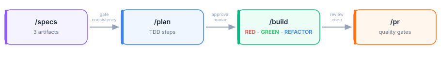

# Agentic Dev Team

[](https://github.com/bdfinst/agentic-dev-team/actions/workflows/plugin-tests.yml)
[](https://github.com/bdfinst/agentic-dev-team/actions/workflows/link-check.yml)
[](https://github.com/bdfinst/agentic-dev-team/actions/workflows/docs.yml)

📖 **[Documentation](https://docs.bryanfinster.com/)**

Three Claude Code plugins for engineering workflows. Install one or all.

- **`dev-team`** gives Claude Code a full persona-driven development team: an Orchestrator that routes tasks, specialist agents (engineer, QA, architect, reviewers…), skills that encode reusable knowledge, and the four-command feature workflow `/specs → /plan → /build → /pr`.
- **`security-assessment`** is the security companion. It adds a tool-first `/security-assessment` pipeline (SAST + AI judgment + false-positive filtering + executive report), a `/cross-repo-analysis` command for multi-repo attack chains, and an adversarial ML red-team harness (`/redteam-model`) for self-owned model endpoints.
- **`marketplace-dev`** is the plugin-author's toolkit. It scaffolds new plugins and marketplaces (`/scaffold-plugin`, `/scaffold-marketplace`, `/init-plugin-eval`), audits any plugin for structural compliance (`/plugin-audit`), advises on the markdown-vs-script agent decision (`/agent-type-advisor`), and ships the migrated agent/skill authoring toolkit (`/agent-create`, `/agent-add`, `/agent-remove`).

`dev-team` is the foundation: it owns the shared data contract (`codebase-recon`, `ACCEPTED-RISKS.md`, unified finding format) that `security-assessment` builds on, so install `dev-team` first and add `security-assessment` when you need it. `marketplace-dev` is independent — it has no hard dependency on `dev-team` and can be installed on its own to build or maintain plugins.

## Plugins

| Plugin | What it does | Key commands | Required tools | Optional tools |
| --- | --- | --- | --- | --- |
| **[dev-team](plugins/dev-team/README.md)** | Persona-driven development team, reviewer swarm, TDD-gated build loop | `/specs`, `/plan`, `/build`, `/pr`, `/code-review`, `/triage` | `jq`, `gh` | `semgrep`, `playwright`, `hadolint`/`trivy`/`grype`; auto-detected formatters and test/type/lint runners |
| **[security-assessment](plugins/security-assessment/README.md)** | Tool-first security assessment + red-team pipeline | `/security-assessment`, `/cross-repo-analysis`, `/redteam-model`, `/export-pdf` | `dev-team`, Python ≥ 3.10, tier-1 SAST (`semgrep`, `gitleaks`, `trivy`, `hadolint`, `actionlint`) | `grype`, PDF-export deps |
| **[marketplace-dev](plugins/marketplace-dev/CLAUDE.md)** | Scaffold, audit, and maintain Claude Code plugins and marketplaces | `/scaffold-plugin`, `/scaffold-marketplace`, `/plugin-audit`, `/agent-type-advisor`, `/agent-create` | `jq` | `git` |

Plugin names link to each plugin's README (or, for `marketplace-dev`, its `CLAUDE.md` guide), where the full tool list and per-tool install commands live. Claude Code itself is assumed. **First time here?** Start with `dev-team`; add `security-assessment` only when you run full `/security-assessment` pipelines against target repos, and `marketplace-dev` when you're building or maintaining plugins.

## Getting Started

New here? The **[Getting Started guide](GETTING-STARTED.md)** is the full walkthrough — installing each plugin, configuring a project, the day-to-day workflow, and the diagnostic commands.

Quick install of the core plugin:

```bash
claude plugin marketplace add bdfinst/agentic-dev-team
claude plugin install dev-team@bfinster
```

Then run `/init-dev-team` and `/setup` in your project. Optional plugins (`security-assessment`, `marketplace-dev`), self-hosted git hosts, install scopes, and the `/upgrade` flow are all covered in the [Getting Started guide](GETTING-STARTED.md).

## Dev team workflow

Four commands drive feature development from idea to pull request:

```text
/specs  →  /plan  →  /build  →  /pr
```

| Step | Command | What it does |
| --- | --- | --- |
| **1. Specify** | `/specs` | Describe the change and its goals — Intent, Architecture notes, Acceptance Criteria. A consistency gate must pass before moving on. Skip for bug fixes, refactors, or trivial changes. |
| **2. Plan** | `/plan` | Decompose the feature into vertical slices, author each slice's Gherkin scenarios, and lay out the TDD steps that satisfy them. Four plan-review personas (Acceptance Test, Design, UX, Strategic critics) challenge the plan before the human sees it. Human approves before any code is written. |
| **3. Build** | `/build` | Execute the approved plan slice by slice. Each step follows RED-GREEN-REFACTOR with inline review checkpoints (spec-compliance first, then quality agents). Produces verification evidence. |
| **4. Ship** | `/pr` | Run quality gates (tests, typecheck, lint, code review) and open a pull request. |

Each step produces artifacts the next step consumes. The spec describes *what* and *why*; the plan turns that into per-slice behavioral contracts (Gherkin) and *how*. Human review gates sit between transitions.



For bug fixes or simple tasks, skip `/specs` and start at `/plan` — or go straight to implementation.

### Supporting commands

| Command | When to use |
| --- | --- |
| `/code-review` | Run review agents, auto-fix actionable issues, re-run until clean (up to 5 iterations) |
| `/continue` | Resume an in-progress build or plan across sessions |
| `/test-improve` | Consolidated analyze-then-improve test orchestrator. Seven phases with human gates; lightweight by default, opts into Gherkin / mutation / refactor-for-testability on demand |
| `/browse` | Visual QA via Playwright |
| `/benchmark` | Runtime performance metrics (Core Web Vitals, resource sizes) against baselines |
| `/careful` / `/freeze` / `/guard` | Safety modes for production-critical sessions |
| `/triage` | Investigate a bug and file a GitHub issue with a TDD fix plan |

### Automated pre-commit review

Every `git commit` is automatically gated by `/code-review`. A `PreToolUse` hook detects commit attempts and blocks them until a passing review exists for the exact set of staged files.

**Flow**: attempt commit → hook blocks → Claude runs `/code-review` → if pass/warn, a `.review-passed` gate file is written → next commit attempt succeeds.

**Bypass**: `git commit --no-verify` skips the review gate.

## Security assessment pipeline

`/security-assessment <path>` runs a six-phase pipeline against one or more target repos. Deterministic tools do the detection; LLM agents handle the judgment stages.

| Phase | Runs | Output |
| --- | --- | --- |
| **0. Recon** | `codebase-recon` agent | `memory/recon-<slug>.{json,md}` |
| **1. Tool-first detection** | semgrep, gitleaks, trivy, hadolint, actionlint, custom rulesets | unified findings stream |
| **1b. Judgment** | `security-review`, `business-logic-domain-review` agents | appended findings |
| **1c. Suppression** | `ACCEPTED-RISKS.md` gate (deterministic) | filtered stream + audit log |
| **2. False-positive filter** | 5-stage check (reachability, environment, controls, dedup, severity) | decisions log |
| **2b. Severity floors** | deterministic domain-class calibration | floor-adjusted scores |
| **3. Narrative + compliance** | `tool-finding-narrative-annotator`, compliance-mapping skill | 4-domain narrative + compliance JSON |
| **4. Cross-repo** | service-comm parser, shared-cred hash match (multi-target only) | mermaid diagram + SARIF |
| **5. Exec report** | `exec-report-generator` agent | publication-ready 7-section markdown |

**Zero-install flow**: `scripts/run-assessment-local.sh` runs the same pipeline from the repo checkout without installing the plugin. Auto-detects the `claude` CLI; degrades to deterministic-only when absent. See [the user guide](plugins/security-assessment/docs/user-guide-security-assessment.md) for the full runbook.

**Adversarial ML red-team**: `/redteam-model` probes a self-owned model endpoint (localhost / private network by default; public targets require a signed `authorization.md`). Eight probes covering discovery, evasion, data extraction, and report synthesis.

---

## Contributing

Developing, testing, or releasing the plugins? See **[CONTRIBUTING.md](CONTRIBUTING.md)** — local-dev setup (including live installs via symlinks), the `/agent-eval` and `/agent-audit` test commands, the security comparative-testing harness, how to add agents and skills, and the release process.

## Documentation

The full documentation — architecture, model routing, eval system, telemetry, ADRs, and experiment reports — lives at **[docs.bryanfinster.com](https://docs.bryanfinster.com/)**, with search and complete navigation.

Start here:

| Doc | Covers |
| --- | --- |
| [Getting Started](GETTING-STARTED.md) | Install, the workflow, suggested skills, worked examples |
| [Contributing](CONTRIBUTING.md) | Local development, testing, adding agents/skills, releasing |
| [Plugin Development Guide](CLAUDE.md) | Project North Star, repo structure, working rules |

Per-plugin docs: **[dev-team](plugins/dev-team/README.md)** · **[security-assessment](plugins/security-assessment/README.md)** · **[marketplace-dev](plugins/marketplace-dev/CLAUDE.md)** — each plugin's README is the entry point to its architecture, commands, and deeper guides.

Adapting model selection to your environment? See [Model Routing](plugins/dev-team/docs/model-routing.md) and its [override guide](plugins/dev-team/docs/model-routing-overrides.md).

## CodeGraph

This repository uses [CodeGraph](https://github.com/colbymchenry/codegraph) for semantic code intelligence.
