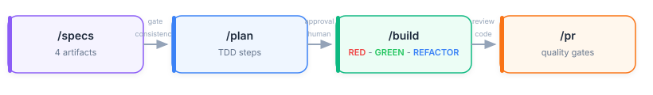

# Agentic Dev Team

Two Claude Code plugins for engineering workflows. Install one or both.

- **`agentic-dev-team`** gives Claude Code a full persona-driven development team: an Orchestrator that routes tasks, specialist agents (engineer, QA, architect, reviewers…), skills that encode reusable knowledge, and the four-command feature workflow `/specs → /plan → /build → /pr`.
- **`agentic-security-assessment`** is the security companion. It adds a deterministic-first `/security-assessment` pipeline (SAST + LLM judgment + FP-reduction + exec report), a `/cross-repo-analysis` command for multi-repo attack chains, and an adversarial ML red-team harness (`/redteam-model`) for self-owned model endpoints.

The two plugins share a primitives contract (`codebase-recon`, `ACCEPTED-RISKS.md`, unified finding envelope) that lives in `agentic-dev-team`. Install that plugin first; add the security companion when you need it.

## Plugins

| Plugin | What it does | Key commands | Install |
| --- | --- | --- | --- |
| **agentic-dev-team** | Persona-driven development team, reviewer swarm, TDD-gated build loop | `/specs`, `/plan`, `/build`, `/pr`, `/code-review`, `/triage` | [plugins/agentic-dev-team/README.md](plugins/agentic-dev-team/README.md) |
| **agentic-security-assessment** | Tool-first security assessment + red-team pipeline | `/security-assessment`, `/cross-repo-analysis`, `/redteam-model`, `/export-pdf` | [plugins/agentic-security-assessment/README.md](plugins/agentic-security-assessment/README.md) |

**First time here?** Start with `agentic-dev-team`. Add `agentic-security-assessment` only when you run full `/security-assessment` pipelines against target repos.

## Quick Start

Requires [Claude Code](https://docs.anthropic.com/en/docs/claude-code), `jq`, and `gh` (GitHub CLI). See [full prerequisites](plugins/agentic-dev-team/README.md#prerequisites).

```bash
claude plugin marketplace add https://github.com/bdfinst/agentic-dev-team
claude plugin install agentic-dev-team@bfinster
```

Then open Claude Code in your project and initialize:

```
/setup
```

`/setup` detects your stack and generates project-level config and hooks. After that, run `/specs` to start a feature, or ask a question and let the Orchestrator route it.

## Getting Started

### Prerequisites

`agentic-dev-team` requires `jq` and `gh` (GitHub CLI). `agentic-security-assessment` additionally requires Python ≥ 3.10 and a tier-1 static-analysis toolchain. Full details: [agentic-dev-team prerequisites](plugins/agentic-dev-team/README.md#prerequisites) · [agentic-security-assessment prerequisites](plugins/agentic-security-assessment/README.md).

### Install `agentic-dev-team`

Start here. Most users install only this plugin.

```bash
# From this marketplace (recommended)
claude plugin marketplace add bdfinst/agentic-dev-team
claude plugin install agentic-dev-team@bfinster
# or
claude plugin install --scope project agentic-dev-team@bfinster

# From a local clone (for plugin development)
claude plugin install --scope project /path/to/agentic-dev-team/plugins/agentic-dev-team
```

For Azure DevOps or another git host, see [Marketplace sources](plugins/agentic-dev-team/README.md#marketplace-sources) in the plugin README.

### Install `agentic-security-assessment` (optional)

Add this plugin only if you want the `/security-assessment` pipeline. Install `agentic-dev-team` first.

```bash
claude plugin install agentic-security-assessment@bfinster
# Or from a local clone:
claude plugin install --scope project /path/to/agentic-dev-team/plugins/agentic-security-assessment
```

Then install the tier-1 static-analysis tools:

```bash
# macOS
./plugins/agentic-security-assessment/install-macos.sh           # tier-1 only
./plugins/agentic-security-assessment/install-macos.sh --all     # tier-1 + optional + PDF deps
./plugins/agentic-security-assessment/install-macos.sh --dry-run # preview without running

# Windows (requires Scoop)
.\plugins\agentic-security-assessment\install-windows.ps1
```

Verify: `./plugins/agentic-security-assessment/install.sh`

## Dev team workflow

Four commands drive feature development from idea to pull request:

```
/specs  →  /plan  →  /build  →  /pr
```

| Step | Command | What it does |
| --- | --- | --- |
| **1. Specify** | `/specs` | Produce Intent, BDD/Gherkin scenarios, Architecture notes, Acceptance Criteria. A consistency gate must pass before moving on. Skip for bug fixes, refactors, or trivial changes. |
| **2. Plan** | `/plan` | Create a TDD step-plan. Four plan-review personas (Acceptance Test, Design, UX, Strategic critics) challenge the plan before the human sees it. Human approves before any code is written. |
| **3. Build** | `/build` | Execute the approved plan. Each step follows RED-GREEN-REFACTOR with inline review checkpoints (spec-compliance first, then quality agents). Produces verification evidence. |
| **4. Ship** | `/pr` | Run quality gates (tests, typecheck, lint, code review) and open a pull request. |

Each step produces artifacts the next step consumes. Human review gates sit between transitions.



For bug fixes or simple tasks, skip `/specs` and start at `/plan` — or go straight to implementation.

### Supporting commands

| Command | When to use |
| --- | --- |
| `/code-review` | Run review agents, auto-fix actionable issues, re-run until clean (up to 5 iterations) |
| `/continue` | Resume an in-progress build or plan across sessions |
| `/browse` | Visual QA via Playwright |
| `/benchmark` | Runtime performance metrics (Core Web Vitals, resource sizes) against baselines |
| `/careful` / `/freeze` / `/guard` | Safety modes for production-critical sessions |
| `/triage` | Investigate a bug and file a GitHub issue with a TDD fix plan |

### Automated pre-commit review

Every `git commit` is automatically gated by `/code-review`. A `PreToolUse` hook detects commit attempts and blocks them until a passing review exists for the exact set of staged files.

**Flow**: attempt commit → hook blocks → Claude runs `/code-review` → if pass/warn, a `.review-passed` gate file is written → next commit attempt succeeds.

**Bypass**: `git commit --no-verify` skips the review gate.

## Security assessment pipeline

`/security-assessment <path>` runs a six-phase pipeline against one or more target repos. Deterministic tools do the detection; LLM agents handle the judgment stages.

| Phase | Runs | Output |
| --- | --- | --- |
| **0. Recon** | `codebase-recon` agent | `memory/recon-<slug>.{json,md}` |
| **1. Tool-first detection** | semgrep, gitleaks, trivy, hadolint, actionlint, custom rulesets | unified findings stream |
| **1b. Judgment** | `security-review`, `business-logic-domain-review` agents | appended findings |
| **1c. Suppression** | `ACCEPTED-RISKS.md` gate (deterministic) | filtered stream + audit log |
| **2. FP-reduction** | 5-stage rubric (reachability, environment, controls, dedup, severity) | disposition register |
| **2b. Severity floors** | deterministic domain-class calibration | floor-adjusted scores |
| **3. Narrative + compliance** | `tool-finding-narrative-annotator`, compliance-mapping skill | 4-domain narrative + compliance JSON |
| **4. Cross-repo** | service-comm parser, shared-cred hash match (multi-target only) | mermaid diagram + SARIF |
| **5. Exec report** | `exec-report-generator` agent | publication-ready 7-section markdown |

**Zero-install flow**: `scripts/run-assessment-local.sh` runs the same pipeline from the repo checkout without installing the plugin. Auto-detects the `claude` CLI; degrades to deterministic-only when absent. See [the user guide](plugins/agentic-security-assessment/docs/user-guide-security-assessment.md) for the full runbook.

**Adversarial ML red-team**: `/redteam-model` probes a self-owned model endpoint (localhost / RFC1918 by default; public targets require a signed `authorization.md`). Eight probes covering recon, evasion, extraction, and report synthesis.

---

## Local development

### Testing locally

Install either plugin from the local path into a test project:

```bash
claude plugin install --scope project /path/to/agentic-dev-team/plugins/agentic-dev-team
claude plugin install --scope project /path/to/agentic-dev-team/plugins/agentic-security-assessment
```

### Testing agents and hooks (dev-team plugin)

```
/agent-eval                                                # full eval suite
/agent-eval plugins/agentic-dev-team/agents/naming-review.md   # one agent
/agent-audit                                               # structural compliance
```

### Comparative-testing harness (security plugin)

Regression-test the `/security-assessment` pipeline against a seeded fixture + reference baseline:

```bash
python3 evals/comparative/score.py \
  --reference evals/comparative/reference-baseline/2026-04-21 \
  --ours memory
```

See [docs/comparative-testing.md](plugins/agentic-security-assessment/docs/comparative-testing.md) for the scoring methodology.

### Adding an agent or skill

```
/agent-add <description or URL to a coding standard>
```

This scaffolds the agent file, adds it to the registry, and creates eval fixtures. Run `/agent-audit` and `/agent-eval` to verify compliance.

### Documentation

| Guide | Description |
| --- | --- |
| [Tutorial: Invoking Agents](GETTING-STARTED.md) | Hands-on tutorial: invoke agents, skills, and common workflows |
| [Architecture](plugins/agentic-dev-team/docs/agent-architecture.md) | Context management, quality assurance, governance, multi-LLM routing |
| [Agents](plugins/agentic-dev-team/docs/agent_info.md) | Agent roster, persona template, adding/removing/customizing |
| [Skills & Commands](plugins/agentic-dev-team/docs/skills.md) | Skills catalog, slash-commands catalog |
| [Eval System](plugins/agentic-dev-team/docs/eval-system.md) | How review-agent accuracy is measured and graded |
| [Security Assessment User Guide](plugins/agentic-security-assessment/docs/user-guide-security-assessment.md) | Path-A (plugin) vs. Path-B (zero-install) runbook, tool install matrix |
| [Comparative Testing](plugins/agentic-security-assessment/docs/comparative-testing.md) | Fixture repo, ground truth, scoring methodology |

## CodeGraph

This repository uses [CodeGraph](https://github.com/colbymchenry/codegraph) for semantic code intelligence.
