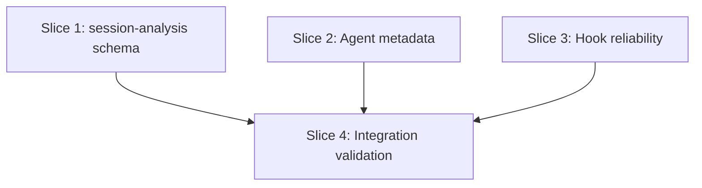

# Plan: Agent Audit Compliance Fixes

**Created**: 2026-06-26
**Spec**: docs/specs/agent-audit-compliance-fixes.md
**Branch**: feature/agent-audit-fixes
**Status**: implemented

## Goal

Fix the seven structural compliance gaps identified by `/agent-audit`: add a standard review-agent output schema to `session-analysis.md`, add or correct `Context needs:` on two agents, add a persona sentence to `orchestrator.md`, and apply two shell reliability fixes to hooks. A re-run of `/agent-audit` reports clean for all seven items.

## Approach Stances

- **Replace vs. merge**: Edit in place — preserve all existing content, insert or replace only the specific missing/incorrect values. No wholesale rewrites.
- **Scope**: Touch only the six named files plus their associated new test files. Nothing adjacent.

## Acceptance Criteria

- [x] `session-analysis.md` body contains a JSON output block (in a fenced code block after `Output JSON:`) with `"status": "pass|warn|fail|skip"`, an `issues` array, and a `summary` field
- [x] `session-analysis.md` defines severity criteria for `error` (high-severity recurring pattern requiring agent-level fix), `warning` (moderate pattern with a concrete suggested fix), and `suggestion` (minor optimization)
- [x] `session-analysis.md` has a `## Skip` section that (a) describes when the agent returns skip and (b) shows the skip JSON `{"status": "skip", "issues": [], "summary": "<reason>"}`
- [x] `session-analysis.md` has the line `Context needs: full-file`
- [x] `claude-setup-review.md` body has the line `Context needs: project-structure`
- [x] `test-modernization-review.md` `Context needs:` value is exactly `full-file` (not prose)
- [x] `orchestrator.md` first non-blank body line after the `# Orchestrator Agent` H1 begins with `You are`
- [x] `mutation-gate.sh` `set` flags line reads `set -uo pipefail` — the `-e` (errexit) flag is removed because hooks must be advisory (always reach `exit 0`); `-e` can kill the script if an intermediate command fails before the fail-open advisory path, which is a latent reliability risk shared by no other hook in the project
- [x] All `printf "$FAILS"` and `printf "$WARNINGS"` calls in `eval-compliance-check.sh` are replaced with `printf '%b' "$FAILS"` and `printf '%b' "$WARNINGS"` — this fixes shellcheck SC2059 (don't use a variable as the printf format string) while preserving existing output behavior: the variables contain `\n` escape sequences that `%b` correctly renders as newlines, identical to what `printf "$FAILS"` currently produces
- [x] `shellcheck` exits 0 on both modified hook files
- [x] Running `/agent-audit` after all slices are merged reports PASS for: session-analysis OutFmt/Sev/Skip/CtxNeeds; claude-setup-review CtxNeeds; test-modernization-review CtxNeeds; orchestrator Persona; both hooks Advisory

## Slices

### Slice 1: session-analysis.md standard schema

**Depends-on:** none
**Files:** `plugins/dev-team/agents/session-analysis.md`, `tests/agents/session_analysis_schema_tests.bats`
**Behavior:**

```gherkin
Feature: session-analysis agent standard schema compliance

  Scenario: agent has standard JSON output schema
    Given the session-analysis agent file
    When its body is read
    Then it contains a fenced JSON block after "Output JSON:" with "status", "issues", and "summary" keys

  Scenario: agent defines severity criteria
    Given the session-analysis agent file
    When its body is read
    Then it defines error, warning, and suggestion severity levels with criteria

  Scenario: agent has a Skip section with skip JSON format
    Given the session-analysis agent file
    When its body is read
    Then it contains a "## Skip" section
    And that section includes a JSON example with status "skip"

  Scenario: agent declares Context needs with canonical value
    Given the session-analysis agent file
    When its body is read
    Then it has the line "Context needs: full-file"
```

**Steps:**

#### Step 1.1: Add JSON output schema block

**Complexity**: standard
**RED**: Create `tests/agents/session_analysis_schema_tests.bats`. Write one test: grep session-analysis.md for `"status": "pass|warn|fail|skip"` inside a fenced JSON block after `Output JSON:`. Test fails — block is absent.
**GREEN**: Insert after the frontmatter block in `session-analysis.md`:

```
Output JSON:
```json
{"status": "pass|warn|fail|skip", "issues": [{"severity": "error|warning|suggestion", "confidence": "high|medium|none", "file": "", "line": 0, "message": "", "suggestedFix": ""}], "summary": ""}
```

```
**REFACTOR**: None needed
**Files**: `plugins/dev-team/agents/session-analysis.md`, `tests/agents/session_analysis_schema_tests.bats`
**Commit**: `fix: add JSON output schema block to session-analysis`

#### Step 1.2: Add severity definitions

**Complexity**: standard
**RED**: Add one test to `session_analysis_schema_tests.bats`: grep for a `Severity:` line defining `error`, `warning`, and `suggestion`. Test fails.
**GREEN**: Add to session-analysis.md (after the JSON block): `Severity: error=high-severity recurring pattern (e.g., consistent rework across 3+ sessions in one skill area); warning=moderate pattern with a concrete fix available; suggestion=minor optimization opportunity`
**REFACTOR**: None needed
**Files**: `plugins/dev-team/agents/session-analysis.md`, `tests/agents/session_analysis_schema_tests.bats`
**Commit**: `fix: add severity definitions to session-analysis`

#### Step 1.3: Add ## Skip section

**Complexity**: standard
**RED**: Add one test: grep for `## Skip` in session-analysis.md. Test fails.
**GREEN**: Add `## Skip` section to session-analysis.md: return `{"status": "skip", "issues": [], "summary": "No session digest provided or digest contains no signal data."}` when the input digest is absent, empty, or all signal classes are zero.
**REFACTOR**: None needed
**Files**: `plugins/dev-team/agents/session-analysis.md`, `tests/agents/session_analysis_schema_tests.bats`
**Commit**: `fix: add Skip section to session-analysis`

#### Step 1.4: Add Context needs declaration

**Complexity**: standard
**RED**: Add one test: grep for `Context needs: full-file` in session-analysis.md. Test fails.
**GREEN**: Add `Context needs: full-file` line to session-analysis.md body.
**REFACTOR**: None needed
**Files**: `plugins/dev-team/agents/session-analysis.md`, `tests/agents/session_analysis_schema_tests.bats`
**Commit**: `fix: add Context needs to session-analysis`

---

### Slice 2: Agent metadata fixes (Context needs + persona)

**Depends-on:** none
**Files:** `plugins/dev-team/agents/claude-setup-review.md`, `plugins/dev-team/agents/test-modernization-review.md`, `plugins/dev-team/agents/orchestrator.md`, `tests/agents/agent_audit_metadata_tests.bats`
**Behavior:**

```gherkin
Feature: agent metadata compliance

  Scenario: claude-setup-review has Context needs declared
    Given the claude-setup-review agent file
    When its body is read
    Then it contains the line "Context needs: project-structure"

  Scenario: test-modernization-review has canonical Context needs value
    Given the test-modernization-review agent file
    When its Context needs line is read
    Then the value is exactly "full-file"

  Scenario: orchestrator has a You are persona sentence
    Given the orchestrator agent file
    When the content between the H1 and the first ## section is read
    Then a line beginning with "You are" is present
```

**Steps:**

#### Step 2.1: Fix Context needs and add orchestrator persona

**Complexity**: trivial
**RED**: Create `tests/agents/agent_audit_metadata_tests.bats`. Write three grep tests: (1) `Context needs: project-structure` in claude-setup-review.md, (2) `Context needs: full-file` in test-modernization-review.md, (3) `^You are` appearing before the first `^##` in orchestrator.md. All three fail.
**GREEN**:

- `claude-setup-review.md`: add `Context needs: project-structure` after the output schema block
- `test-modernization-review.md`: replace the non-canonical prose on the `Context needs:` line with `full-file`
- `orchestrator.md`: insert `You are the coordination center for this dev team — a neutral dispatcher who classifies requests, routes them to the appropriate pipeline branch, and coordinates concurrent persona dispatch without absorbing domain logic.` as the first body line after the `# Orchestrator Agent` H1
**REFACTOR**: None needed
**Files**: `plugins/dev-team/agents/claude-setup-review.md`, `plugins/dev-team/agents/test-modernization-review.md`, `plugins/dev-team/agents/orchestrator.md`, `tests/agents/agent_audit_metadata_tests.bats`
**Commit**: `fix: add Context needs lines and orchestrator persona sentence`

---

### Slice 3: Hook shell reliability fixes

**Depends-on:** none
**Files:** `plugins/dev-team/hooks/mutation-gate.sh`, `plugins/dev-team/hooks/eval-compliance-check.sh`, `tests/hooks/hook_reliability_tests.bats`
**Behavior:**

```gherkin
Feature: hook shell reliability

  Scenario: mutation-gate set flags do not include errexit
    Given the mutation-gate.sh hook file
    When its set flags declaration is read
    Then it reads "set -uo pipefail" without the -e flag

  Scenario: mutation-gate completes its advisory path even when an internal command fails
    Given mutation-gate.sh is modified to remove errexit
    When an internal command within the hook exits non-zero
    Then the hook continues executing and reaches its advisory exit

  Scenario: eval-compliance-check uses portable printf format for newline rendering
    Given the eval-compliance-check.sh hook file
    When its printf calls for FAILS and WARNINGS variables are read
    Then every such call uses "printf '%b'" as the format
    And no "printf "$FAILS"" bare-variable calls remain

  Scenario: both hooks pass shellcheck
    Given the modified hook files
    When shellcheck runs on each
    Then shellcheck exits 0
```

**Steps:**

#### Step 3.1: Fix mutation-gate.sh errexit and eval-compliance-check.sh printf

**Complexity**: trivial
**RED**: Create `tests/hooks/hook_reliability_tests.bats`. Write four tests: (1) grep mutation-gate.sh: `set -uo pipefail` matches and `set -euo` does not; (2) verify mutation-gate.sh reaches its final exit even when a subcommand in the file fails (run with a fake environment that causes an early command to fail and assert exit 0); (3) grep eval-compliance-check.sh: no remaining `printf "\$FAILS"` or `printf "\$WARNINGS"` bare-variable calls; (4) `shellcheck plugins/dev-team/hooks/mutation-gate.sh` exits 0 and `shellcheck plugins/dev-team/hooks/eval-compliance-check.sh` exits 0. All fail.
**GREEN**:

- `mutation-gate.sh`: change the `set -euo pipefail` line to `set -uo pipefail` (remove the `-e` errexit flag, aligning with every other hook in the project)
- `eval-compliance-check.sh`: replace every `printf "$FAILS"` with `printf '%b' "$FAILS"` and every `printf "$WARNINGS"` with `printf '%b' "$WARNINGS"` (fixes shellcheck SC2059; `%b` renders the `\n` escape sequences in these variables as newlines, identical to current behavior)
**REFACTOR**: None needed
**Files**: `plugins/dev-team/hooks/mutation-gate.sh`, `plugins/dev-team/hooks/eval-compliance-check.sh`, `tests/hooks/hook_reliability_tests.bats`
**Commit**: `fix: remove errexit from mutation-gate; fix printf format in eval-compliance-check`

---

### Slice 4: /agent-audit integration validation

**Depends-on:** 1, 2, 3
**Files:** `tests/agents/agent_audit_integration_validation_tests.bats`
**Behavior:**

```gherkin
Feature: agent audit reports clean after all fixes

  Scenario: all previously-failing agent audit items pass
    Given all six agent and hook files have been updated
    When python3 scripts/claude_setup_review.py --plugin-root plugins/dev-team --skip-llm runs
    Then it exits 0 or 2 with no structural error findings
    And session-analysis.md passes the JSON schema check
    And both hook files pass shellcheck
```

**Steps:**

#### Step 4.1: Write and run integration validation tests

**Complexity**: standard
**RED**: Create `tests/agents/agent_audit_integration_validation_tests.bats`. Write tests: (1) grep all 7 fixed locations for their expected content (JSON block in session-analysis, Context needs in each agent, persona in orchestrator, no `set -euo` in mutation-gate, no bare `printf "$FAILS"` in eval-compliance-check); (2) `shellcheck` exits 0 on both hooks; (3) `python3 scripts/claude_setup_review.py --plugin-root plugins/dev-team --skip-llm` exits 0 or 2 (no error findings). Tests fail before slices 1–3 are merged.
**GREEN**: Slices 1–3 provide the GREEN — this step only verifies the aggregate. If any sub-check fails, identify which slice is incomplete and fix it.
**REFACTOR**: None needed
**Files**: `tests/agents/agent_audit_integration_validation_tests.bats`
**Commit**: `test: add agent-audit integration validation tests`

---

## Parallelization



| Wave | Slices (parallel) |
|------|-------------------|
| 1 | 1, 2, 3 |
| 2 | 4 |

No same-wave file collisions.

## Complexity Classification

| Steps | Rating |
|---|---|
| 1.1–1.4 | standard |
| 2.1 | trivial |
| 3.1 | trivial |
| 4.1 | standard |

## Pre-PR Quality Gate

- [x] All bats tests pass (`bash scripts/ci-local.sh`)
- [x] `shellcheck` exits 0 on `mutation-gate.sh` and `eval-compliance-check.sh`
- [x] Integration validation tests (Slice 4) pass

## Risks & Open Questions

- `session-analysis.md` currently has no dispatch from `/code-review`. Adopting the standard schema makes it eligible. After this PR, `/code-review` orchestration may need to include it if previously excluded.

## Plan Review Summary

**Plan tier: standard** — 4 slices, 2 waves, all trivial/standard steps. Reviewers: Acceptance, Design, Parallelization (UX skipped — no user-facing surface).
**Iterations:** 2 (first pass: needs-revision; second pass: all approve).

**First-pass blockers resolved:**

- AC #8 now has explicit rationale for `-e` removal (hooks must be advisory; `-e` kills before fail-open path; no other hook uses it)
- AC #9 now documents SC2059 fix and confirms `%b` preserves existing `\n`→newline behavior
- Slice 1 atomized into 4 steps (one per property)
- Regression scenario added for mutation-gate advisory path
- Slice 4 added for AC #11 integration validation (wave 2)

**Remaining advisory warnings (non-blocking):**

- `test-modernization-review.md` Context needs is prose — must be replaced, not appended; note this in Step 2.1
- `orchestrator.md` persona sentence text should be specified in the step (exact text: "You are the coordination center for this dev team — a neutral dispatcher who classifies requests, routes them to the appropriate pipeline branch, and coordinates concurrent persona dispatch without absorbing domain logic.")
- Slice 4 integration tests should verify the fenced JSON block after "Output JSON:" (not just the header line) for AC #1

## Build Progress

### Slices (grouped by wave)

#### Wave 1

- [x] Slice 1: session-analysis.md standard schema
  - [x] Step 1.1: Add JSON output schema block
  - [x] Step 1.2: Add severity definitions
  - [x] Step 1.3: Add ## Skip section
  - [x] Step 1.4: Add Context needs declaration
- [x] Slice 2: Agent metadata fixes
  - [x] Step 2.1: Fix Context needs and add orchestrator persona
- [x] Slice 3: Hook shell reliability fixes
  - [x] Step 3.1: Fix mutation-gate.sh errexit and eval-compliance-check.sh printf

#### Wave 2

- [x] Slice 4: /agent-audit integration validation
  - [x] Step 4.1: Write and run integration validation tests

### Acceptance Criteria

- [x] session-analysis.md has JSON output block with status/issues/summary
- [x] session-analysis.md defines severity criteria (error/warning/suggestion)
- [x] session-analysis.md has ## Skip section with skip JSON format
- [x] session-analysis.md has Context needs: full-file
- [x] claude-setup-review.md has Context needs: project-structure
- [x] test-modernization-review.md Context needs value is full-file
- [x] orchestrator.md first body line after H1 begins with "You are"
- [x] mutation-gate.sh set flags are set -uo pipefail (no -e; see rationale in AC)
- [x] eval-compliance-check.sh printf calls all use %b format specifier (fixes SC2059)
- [x] shellcheck exits 0 on both modified hook files
- [x] /agent-audit integration validation tests pass for all 7 items
