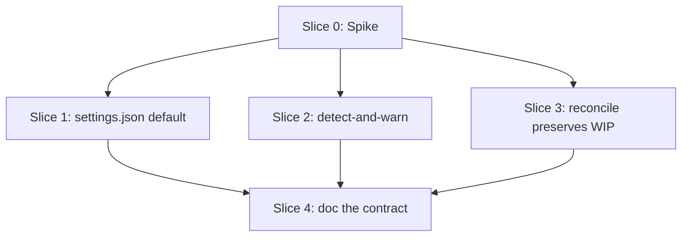

# Plan: /build worktree agents inherit caller's HEAD

**Created**: 2026-07-01
**Branch**: fixes
**Status**: approved
**Spec**: `docs/specs/build-worktree-inherits-caller-head.md`
**Closes**: #553

## Goal

Make every worktree spawned by `/build` branch from the caller's local HEAD
instead of `origin/<default>`, so the `docs/specs/<slug>.md` and
`plans/<slug>.md` files `/ship` produces immediately before `/build` are
visible in the child worktrees. Primary fix is a plugin-scoped default
(`plugins/dev-team/settings.json`). A **detect-and-warn** runtime check in
`/build` surfaces user-level overrides loudly; a `DEV_TEAM_WORKTREE_BASE_FRESH=1`
env var lets a user opt out of the warning when they want fresh-from-origin
worktrees deliberately. Also verify the wave reconciler carries the caller's
pre-fanout commits (the spec+plan) into the reconciled integration branch.

## What changed from the initial draft (review iteration 1)

The initial plan proposed a stateful **force/restore** fallback that would
mutate a scoped settings file for the duration of a build and restore it
afterwards. Four of the five plan reviewers (acceptance, design, UX,
strategic) converged on the same failure mode: **the mechanism's own tests
could not prove it worked** (there is no confirmed way to introspect the
CLI's effective `worktree.baseRef` from a shell, nor to know whether a
mid-session settings write actually changes the next Agent-tool worktree
spawn), and a crash before restore would leak a silent, persistent override
into unrelated commands. That mechanism is dropped. This revised plan:

1. **Adds Slice 0** — a non-TDD, timeboxed spike that verifies
   `worktree.baseRef=head` actually changes real Agent-tool worktree
   behavior before any implementation slice is built on top of it. If the
   spike fails, the plan halts and the strategy is rethought.
2. **Descopes Slice 2 to detect-and-warn only** — no settings mutation,
   no sidecar state, no restore, no crash-recovery surface. If the
   effective `worktree.baseRef` is not `head`, `/build` prints a loud
   warning naming the fix (edit your settings) and the opt-out env var.
3. **Adds a manual verification step** to the Pre-PR gate for the spec's
   AC4 (worktree actually sees caller WIP). bats cannot dispatch a real
   `isolation:"worktree"` agent from a fixture; a documented manual
   verification stays in the gate as the honest signal.
4. **Adds a scenario for the `unknown` detect sentinel** — fail safe: warn
   loudly, proceed.
5. **Fixes `Files:` to one physical line per slice** so `plan-waves.sh`'s
   parser sees the full declared surface (per the Parallelization Critic
   finding that continuation lines were being silently dropped).

## Decision-axis stances

- **Replace-vs-merge**: **merge**. `plugins/dev-team/settings.json` gains
  one top-level key (`worktree.baseRef`); the existing hooks/permissions
  block is untouched. No file replaced.
- **Scope**: bounded to the four affected files plus their tests. The two
  side observations in issue #553 (async agent output path,
  `plan-waves.sh` parenthetical parsing) remain out of scope per the
  issue's Not-in-scope section.

## Acceptance Criteria

- [ ] Slice 0 spike confirms that `worktree.baseRef=head` in a plugin's
      settings.json changes a real Agent-tool `isolation:"worktree"`
      subagent's base ref from `origin/<default>` to the caller's HEAD.
      Result recorded in Slice 0's evidence note (branch-visible file).
- [ ] `plugins/dev-team/settings.json` contains
      `"worktree": {"baseRef": "head"}` at top level.
- [ ] `/build` emits a loud warning at pre-dispatch when the effective
      `worktree.baseRef` resolves to anything other than `head` (or when
      detection returns `unknown`) — unless `DEV_TEAM_WORKTREE_BASE_FRESH=1`.
- [ ] `DEV_TEAM_WORKTREE_BASE_FRESH=1` silences the warning; the user's
      setting is honored.
- [ ] Manual verification (documented in Pre-PR Quality Gate) confirms a
      real `/build` run under the plugin's default settings sees a file
      committed on the caller's branch but not on origin/main.
- [ ] After `build-wave-reconcile.sh` merges the wave's slice branches
      back into the integration branch, the caller's pre-fanout WIP
      commits remain in the reconciled branch's ancestry.
- [ ] `plugins/dev-team/skills/build/SKILL.md` and
      `plugins/dev-team/agents/orchestrator.md` document the base-ref
      contract in their wave dispatch sections.
- [ ] `scripts/ci-local.sh` remains green.

## Slices

### Slice 0: Spike — verify `worktree.baseRef=head` works

**Depends-on:** none
**Files:** `docs/spikes/worktree-baseref-head-spike.md`

**Behavior:**

```gherkin
Feature: Spike proves worktree.baseRef=head has the intended effect

  Scenario: Agent-tool worktree branches from caller HEAD, not origin
    Given a fixture repo with a commit on the current branch that is not
      on origin/main
    And a scratch settings.json setting worktree.baseRef=head
    When an Agent-tool subagent is dispatched with isolation: "worktree"
    Then the child worktree's HEAD ancestry contains the caller's commit
    And the file added by that commit is present at its expected path
    And no `git checkout <sha> -- …` workaround is needed
```

**Steps:**

#### Step 0.1: Run the spike, write the evidence note

**Complexity**: complex
**RED**: N/A — spikes are non-TDD. The check *is* the test.
**GREEN**: (a) Create a scratch fixture repo (or use an existing one)
with a commit adding `docs/specs/spike.md` on the current branch and
nothing on origin/main. (b) Configure the plugin (or a project settings
tree) with `worktree.baseRef: "head"`. (c) Dispatch an
`isolation: "worktree"` subagent whose task is simply
`test -f docs/specs/spike.md && echo PRESENT || echo ABSENT`. (d) Record
the observed result in `docs/spikes/worktree-baseref-head-spike.md`
along with the Claude Code CLI version tested, exact settings tree used,
and the subagent's output. (e) **If the file is ABSENT (spike fails):
halt the plan and escalate to the human** — the strategy needs
rethinking (a different mechanism may be required, or the CLI's
behavior may have shifted).
**REFACTOR**: N/A
**Files**: `docs/spikes/worktree-baseref-head-spike.md`
**Commit**: `chore(build): spike verifies worktree.baseRef=head changes Agent-tool base ref`

### Slice 1: Plugin default (`worktree.baseRef: "head"`)

**Depends-on:** 0
**Files:** `plugins/dev-team/settings.json`, `tests/plugin/settings_worktree_baseref_test.bats`

**Behavior:**

```gherkin
Feature: Plugin ships a HEAD-based worktree base-ref default

  Scenario: settings.json declares worktree.baseRef=head
    Given the dev-team plugin's settings.json
    When I read it as JSON
    Then the top-level "worktree" object exists
    And "worktree.baseRef" equals "head"

  Scenario: settings.json is still valid JSON with all prior keys intact
    Given the dev-team plugin's settings.json after the change
    When I parse it with jq
    Then parsing succeeds
    And the "permissions.allow" list, "permissions.deny" list, and every
      top-level "hooks" key present before the change are still present
```

**Steps:**

#### Step 1.1: Assert new default in settings.json

**Complexity**: standard
**RED**: Add a bats test that reads `plugins/dev-team/settings.json` with
`jq` and asserts `worktree.baseRef == "head"` AND that `permissions.allow`,
`permissions.deny`, and every top-level `hooks` key still exist
(structural regression guard). Run — must fail.
**GREEN**: Add `"worktree": {"baseRef": "head"}` at the top level of
`plugins/dev-team/settings.json`. Run — passes.
**REFACTOR**: None.
**Files**: `plugins/dev-team/settings.json`, `tests/plugin/settings_worktree_baseref_test.bats`
**Commit**: `feat(build): default plugin worktree.baseRef to head so subagents inherit caller HEAD`

### Slice 2: `/build` detect-and-warn (no mutation)

**Depends-on:** 0
**Files:** `plugins/dev-team/skills/build/SKILL.md`, `plugins/dev-team/scripts/build-worktree-baseref.sh`, `tests/skills/build_worktree_baseref_detect_tests.bats`

**Behavior:**

```gherkin
Feature: /build detects and warns on non-head worktree.baseRef

  Scenario: user setting resolves to fresh, /build warns loudly
    Given the effective worktree.baseRef resolves to "fresh"
    And DEV_TEAM_WORKTREE_BASE_FRESH is not set
    When /build reaches its pre-dispatch base-ref check
    Then it emits a warning mentioning "fresh", "head", and
      "DEV_TEAM_WORKTREE_BASE_FRESH"
    And it does not mutate any settings file
    And the build continues

  Scenario: user setting resolves to head, no warning
    Given the effective worktree.baseRef resolves to "head"
    When /build reaches its pre-dispatch base-ref check
    Then no warning is emitted
    And no settings file is read for write

  Scenario: user opts out with the env var
    Given the effective worktree.baseRef resolves to "fresh"
    And DEV_TEAM_WORKTREE_BASE_FRESH=1
    When /build reaches its pre-dispatch base-ref check
    Then no warning is emitted
    And the build continues

  Scenario: detection is unreliable, /build fails safe
    Given build-worktree-baseref.sh detect prints "unknown"
    And DEV_TEAM_WORKTREE_BASE_FRESH is not set
    When /build reaches its pre-dispatch base-ref check
    Then it emits a warning mentioning "worktree.baseRef could not be
      detected" and the DEV_TEAM_WORKTREE_BASE_FRESH opt-out
    And the build continues

  Scenario: user opts out while detection is unknown
    Given build-worktree-baseref.sh detect prints "unknown"
    And DEV_TEAM_WORKTREE_BASE_FRESH=1
    When /build reaches its pre-dispatch base-ref check
    Then no warning is emitted
    And the build continues
```

**Steps:**

#### Step 2.1: `detect` subcommand with settings-path env-var seam

**Complexity**: standard
**RED**: Add bats tests for `build-worktree-baseref.sh detect` that
assert it prints one of `head`, `fresh`, or `unknown` and exits 0. Use a
`BASEREF_SETTINGS_PATHS` env-var seam (colon-separated list of settings
files, highest precedence first — following `hooks/lib/model-resolve.sh`'s
`MODEL_ROUTING_JSON`/`MODEL_LADDER_JSON` convention) to point the detect
at fixture files. Cover: (a) explicit `head` in a fixture file, (b)
explicit `fresh`, (c) key absent from every file → `unknown`, (d)
malformed JSON in one file → still returns a value from a valid lower
file rather than crashing. Fails — script does not exist.
**GREEN**: Add `plugins/dev-team/scripts/build-worktree-baseref.sh` with
a `detect` subcommand. bash-3.2 safe, uses `jq`. Reads settings files in
precedence order (via `BASEREF_SETTINGS_PATHS` if set, else the standard
Claude Code precedence: `.claude/settings.local.json`,
`.claude/settings.json`, `~/.claude/settings.json`, then plugin's own
`settings.json`). Prints `unknown` and exits 0 on any lookup failure —
degrade-never-abort, per the `model-resolve.sh` precedent. Passes.
**REFACTOR**: Extract settings-file walk into a helper function reusable
by future subcommands.
**Files**: `plugins/dev-team/scripts/build-worktree-baseref.sh`, `tests/skills/build_worktree_baseref_detect_tests.bats`
**Commit**: `feat(build): add worktree.baseRef detect helper (degrade-never-abort)`

#### Step 2.2: Wire detect-and-warn into `/build` Step 4

**Complexity**: standard
**RED**: Add a bats test asserting `plugins/dev-team/skills/build/SKILL.md`
Step 4 documents: (a) a pre-dispatch call to
`build-worktree-baseref.sh detect`, (b) the exact warning behavior for
`fresh` / `unknown` / opt-out cases (assert on substantive tokens —
mentions of "fresh"/"head"/"DEV_TEAM_WORKTREE_BASE_FRESH" for the
fresh case; "could not be detected" for the unknown case — not exact
string equality), (c) the base-ref check runs **in the top-level
`/build` session, before any subagent dispatch**, so the warning is
visible in the human-facing transcript (per UX Critic warning). Also
assert the section says `/build` never mutates a settings file. Fails
until docs land.
**GREEN**: Edit `plugins/dev-team/skills/build/SKILL.md` Step 4 with a
"Base-ref check" sub-step before "Dispatch each independent slice…":
runs detect in the top-level session; on `fresh` or `unknown` (and
without the opt-out env var), prints a warning naming the exact fix
(edit user/project settings) and the opt-out env var; then dispatches
regardless. **No settings mutation, no restore.** Passes.
**REFACTOR**: None.
**Files**: `plugins/dev-team/skills/build/SKILL.md`, `tests/skills/build_worktree_baseref_detect_tests.bats`
**Commit**: `feat(build): warn loudly on non-head worktree.baseRef before dispatch`

### Slice 3: Reconciler preserves caller's WIP commits

**Depends-on:** 0
**Files:** `plugins/dev-team/scripts/build-wave-reconcile.sh`, `tests/skills/build_wave_reconcile_wip_preservation_tests.bats`

**Behavior:**

```gherkin
Feature: build-wave-reconcile.sh carries caller WIP commits into the
  integration branch

  Scenario: WIP commit on integration branch is preserved
    Given an integration branch with a WIP commit (spec+plan) not on
      origin/main
    And two slice branches created from that integration branch
    When I run build-wave-reconcile.sh
      --into <integration> --base origin/main
      --test-cmd "true" <slice-1> <slice-2>
    Then the merge succeeds
    And "git log --format=%H <integration>" contains the WIP commit's sha
    And the reconciled tip's tree contains the WIP commit's files

  Scenario: WIP commit is preserved even when a slice adds a sibling file
    Given the WIP commit added docs/specs/foo.md
    And slice 1 adds an unrelated file docs/specs/bar.md
    When reconcile runs
    Then both files are present at the reconciled tip
    And no manual conflict resolution was required

  Scenario: same-file conflict resolution is unchanged
    Given the WIP commit modified plans/foo.md
    And slice 1 also modified plans/foo.md at conflicting lines
    When reconcile runs
    Then the pre-existing conflict-resolution behavior applies unchanged
      (out of scope for this fix)
```

**Steps:**

#### Step 3.1: Failing test proves the WIP-preservation contract

**Complexity**: complex
**RED**: Add hermetic bats tests (`load '../lib/hermetic'`) that: (a)
build a fake repo with `main` and `integration`, (b) commit
`docs/specs/foo.md` on `integration` after slice branches diverged,
(c) invoke `build-wave-reconcile.sh` with two slice branches, (d)
assert the WIP sha and file are in the reconciled tip. If the current
script already preserves this behavior, the RED gate escalates: add a
second WIP commit made **between wave dispatches** and assert it is
still preserved.
**GREEN**: If tests already pass on today's script, mark this step
`no-op` in Build Progress and note in the commit message. Otherwise,
adjust `build-wave-reconcile.sh` to base the reconciled merge off the
current integration branch's HEAD (not `--base`), so any commits made
on integration between wave dispatches remain in the ancestry.
**REFACTOR**: Preserve bash-3.2 safety and macOS `sed -i` portability;
keep the script's log output naming base and integration branches
clearly.
**Files**: `plugins/dev-team/scripts/build-wave-reconcile.sh`, `tests/skills/build_wave_reconcile_wip_preservation_tests.bats`
**Commit**: `fix(build): wave reconcile preserves caller WIP commits on the integration branch`

### Slice 4: Document the contract

**Depends-on:** 1, 2, 3
**Files:** `plugins/dev-team/agents/orchestrator.md`, `plugins/dev-team/knowledge/request-processing-flow.md`, `tests/agents/orchestrator_worktree_baseref_doc_tests.bats`

**Behavior:**

```gherkin
Feature: The base-ref contract is discoverable in the docs

  Scenario: orchestrator agent describes the base-ref contract
    Given plugins/dev-team/agents/orchestrator.md
    When I read the Wave-Aware Build Dispatch section
    Then it names "worktree.baseRef=head" and states the reason (caller
      WIP is visible in subagent worktrees)

  Scenario: request-processing-flow references the contract
    Given plugins/dev-team/knowledge/request-processing-flow.md
    When I read the Implement step
    Then it references the worktree.baseRef=head default
```

**Steps:**

#### Step 4.1: Add the contract to orchestrator + request-processing-flow

**Complexity**: trivial
**RED**: Add a bats test asserting both files contain the phrase
`worktree.baseRef` (case-sensitive substring). Fails.
**GREEN**: Insert a short paragraph in each file describing the base-ref
default (single mention per file; no repetition risk).
**REFACTOR**: None.
**Files**: `plugins/dev-team/agents/orchestrator.md`, `plugins/dev-team/knowledge/request-processing-flow.md`, `tests/agents/orchestrator_worktree_baseref_doc_tests.bats`
**Commit**: `docs(build): document worktree.baseRef=head contract in orchestrator and processing flow`

## Parallelization

Slice 0 (spike) gates everything. Slices 1, 2, 3 depend only on the spike
passing, touch disjoint files, and can build concurrently. Slice 4 depends
on all three.



| Wave | Slices (parallel) |
|------|-------------------|
| 1 | 0 |
| 2 | 1, 2, 3 |
| 3 | 4 |

**Note on `plan-waves.sh` `Files:` parsing.** The Parallelization Critic
found the tool's `Files:` extractor only reads the first physical line —
multi-line declarations are silently truncated. This plan puts every
slice's `Files:` list on **one physical comma-separated line** so the
parser sees the full declared surface.

**Note on `Depends-on:` parenthetical parsing.** #553 also called out
that `plan-waves.sh` mis-parses `Depends-on: 1 (annotation)`. Every
`Depends-on:` value in this file is either `none` or a bare
comma-separated list of slice ids. No parentheticals.

## Complexity Classification

| Step | Complexity | Rationale |
|------|------------|-----------|
| 0.1  | complex | Spike gates the entire plan; result determines whether Slices 1–4 proceed at all |
| 1.1  | standard | Config change with structural regression guard |
| 2.1  | standard | New shell helper, degrade-never-abort, aligned with `model-resolve.sh` precedent |
| 2.2  | standard | Skill-file edit + wire-up test |
| 3.1  | complex | Touches the wave reconciler — behavior change on a script that gates every parallel-build merge |
| 4.1  | trivial | Documentation only |

## Pre-PR Quality Gate

- [ ] All bats tests pass (`scripts/ci-local.sh`)
- [ ] `jq` parses `plugins/dev-team/settings.json` cleanly
- [ ] `shellcheck plugins/dev-team/scripts/build-worktree-baseref.sh` passes
- [ ] `/code-review` passes
- [ ] `plugins/dev-team/CLAUDE.md`'s no-drift bats checks pass
- [ ] **Manual verification of AC4**: on a scratch branch with a commit
      that adds `docs/specs/e2e-check.md` unpushed to origin, run a real
      `/build` with a `--jobs 2` plan. Confirm at least one subagent's
      worktree contains `docs/specs/e2e-check.md` at dispatch time
      (`test -f docs/specs/e2e-check.md && echo PRESENT` from the child
      worktree). Record the result in the PR description. This is the
      spec's AC4 signal that no unit test can produce.

## Skipped (low value)

No `LOW_VALUE` findings were identified during `/specs`.

## Risks & Open Questions

- **Slice 0 spike may fail.** If `worktree.baseRef=head` does not change
  Agent-tool worktree base-ref behavior in the environments we support,
  the whole plan halts and needs rethinking. This is the primary risk;
  gating Slices 1–3 on Slice 0 keeps the blast radius bounded.
- **Slice 3 may already pass.** If `build-wave-reconcile.sh` already
  preserves WIP commits, Step 3.1's GREEN becomes a no-op. Do not skip
  the slice — the test hardens against regression. The RED spec adds a
  stricter probe (second WIP commit made between waves) if the first
  assertion passes.
- **Detect can be `unknown`.** On platforms where Claude Code's settings
  precedence differs or `jq` is unavailable, detect returns `unknown`.
  Slice 2 treats `unknown` as fail-safe: warn loudly, proceed. No
  mutation, no state, no restore.
- **User deliberately wants fresh worktrees.** `DEV_TEAM_WORKTREE_BASE_FRESH=1`
  silences the warning. Documented in the audit line itself,
  `SKILL.md` Step 4, and `orchestrator.md`.

## Build Progress

### Wave 1

- [ ] Slice 0: Spike — verify `worktree.baseRef=head` works
  - [ ] Step 0.1: Run the spike, write the evidence note

### Wave 2

- [ ] Slice 1: Plugin default (`worktree.baseRef: "head"`)
  - [ ] Step 1.1: Assert new default in settings.json
- [ ] Slice 2: `/build` detect-and-warn (no mutation)
  - [ ] Step 2.1: `detect` subcommand with settings-path env-var seam
  - [ ] Step 2.2: Wire detect-and-warn into `/build` Step 4
- [ ] Slice 3: Reconciler preserves caller's WIP commits
  - [ ] Step 3.1: Failing test proves the WIP-preservation contract

### Wave 3

- [ ] Slice 4: Document the contract
  - [ ] Step 4.1: Add the contract to orchestrator + request-processing-flow

## Plan Review Summary

Plan tier: **complex** — reviewers: Acceptance, Design, UX, Strategic, Parallelization (all 5).

### Iteration 1 verdicts

| Reviewer | Verdict | Blockers |
|---|---|---|
| Acceptance Test Critic | needs-revision | No plan step tests spec AC4 (worktree actually sees caller WIP); `unknown` sentinel behavior undefined |
| Design & Architecture Critic | needs-revision | Slice 2's force/restore mechanism unverifiable by its own tests; no confirmed mid-session settings reload |
| UX Critic | needs-revision | No crash/interruption recovery for force→restore leaves silent, persistent override |
| Strategic Critic | needs-revision | Entire plan rests on unverified premise (`worktree.baseRef` is a real, working setting); Slice 2 is speculative defense-in-depth |
| Parallelization Critic | approve (1 warning) | `plan-waves.sh` Files: parser only reads first physical line; multi-line declarations were silently truncated |

### Revisions applied

- **Added Slice 0 spike** (per Strategic + Design blockers) — confirms
  `worktree.baseRef=head` actually changes Agent-tool worktree behavior
  before any other slice is built on top of it. If the spike fails, the
  plan halts and escalates to the human.
- **Descoped Slice 2 to detect-and-warn only** (per Design + UX + Strategic
  blockers). Removed `force`/`restore` subcommands, sidecar state,
  cleanup-on-exit trap logic, and the "must survive crash" surface. If the
  effective `worktree.baseRef` is not `head`, `/build` prints a loud
  warning naming the exact fix and the opt-out env var and proceeds. The
  user's settings win; the plugin never mutates anything on disk at build
  time.
- **Added manual verification of AC4** (per Acceptance + Strategic blockers)
  to the Pre-PR Quality Gate. bats cannot dispatch an Agent-tool
  `isolation:"worktree"` from a fixture; a documented manual check is the
  honest signal.
- **Added `unknown` scenario** (per Acceptance blocker) — detect returning
  `unknown` triggers a fail-safe warning naming the undetected state, not
  a factually wrong "fresh detected" line.
- **Fixed `Files:` to one physical line per slice** (per Parallelization
  warning) so `plan-waves.sh`'s single-line parser sees the full declared
  surface, not a truncated first entry.
- **Added `hooks/lib/model-resolve.sh` alignment** (per Design warning) —
  Slice 2.1 explicitly models `detect` on the existing degrade-never-abort
  precedent, with a `BASEREF_SETTINGS_PATHS` env seam for test injection.
- **Added same-file-conflict scenario in Slice 3** (per Acceptance warning)
  documenting that pre-existing reconciler conflict-resolution behavior
  is out of scope for this fix.
- **Documented that the base-ref check runs in the top-level `/build`
  session** (per UX warning) so the warning is guaranteed visible in the
  main transcript rather than buried in a subagent's tool output.

### Iteration 2 verdicts

| Reviewer | Verdict | Notes |
|---|---|---|
| Acceptance Test Critic | approve | 1 non-blocking warning (spec AC2/AC3 stale — addressed inline before approval); 1 missing `unknown` + opt-out scenario (added) |
| Design & Architecture Critic | approve | 2 non-blocking warnings: (a) spike wording could pin down "test via plugin's own settings.json" specifically; (b) spec AC2/AC3 stale (addressed) |
| UX Critic | approve | 1 non-blocking warning: opt-out env var also silences the `unknown` warning — accepted (documented in Slice 2 scenarios; user chose fresh explicitly, so the two-signal collapse is intentional) |
| Strategic Critic | approve | 1 non-blocking warning: plugin-wide `worktree.baseRef=head` default affects every `isolation:"worktree"` dispatch, not just `/build`. Reviewer's own spot-check found no conflicting use — noted here |
| Parallelization Critic | approve | (iteration 1 already approved; not re-run) |

### Iteration 2 revisions applied inline

- Amended `docs/specs/build-worktree-inherits-caller-head.md`'s Intent
  Description, AC2, AC3, Constraints, and Data-flow diagram to describe
  the detect-and-warn contract (dropping stale force/restore language).
- Added Slice 2 scenario "user opts out while detection is unknown"
  covering the missing `{unknown, opt-out}` cell of the state table.

### Iteration 2 warnings deliberately accepted

- **Spike wording** — the plan already reads "Configure the plugin (or
  a project settings tree)". The `(or a project settings tree)` clause
  is retained as a legitimate fallback: if the plugin-scoped settings
  path turns out not to be honored by the CLI's merger, the spike
  should still empirically verify the setting works at project scope
  and record that scoping constraint as a spike finding — which then
  informs Slice 1's target file. Halting the spike because it worked
  at project but not plugin scope would delete useful signal.
- **Env-var double duty for fresh vs unknown** — a user who
  deliberately wants fresh worktrees has already accepted the base-ref
  contract; silencing the also-not-head-detectable case is consistent
  with their intent, and adding a second env var would add complexity
  for a distinction no user has requested.
- **Plugin-wide default's blast radius** — per Strategic reviewer's
  own spot-check, no other `isolation:"worktree"` call site in the
  plugin needs fresh-from-origin semantics. Documenting this in Slice
  4's docs update is sufficient — enumerating call sites in a bats
  assertion is deferred to a follow-up issue if it recurs.
