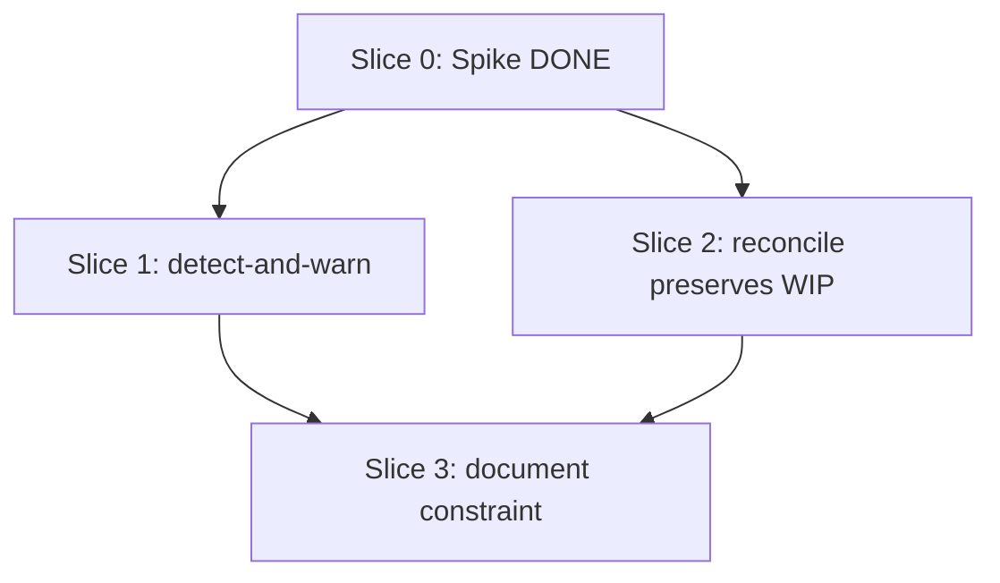

# Plan: /build worktree agents inherit caller's HEAD

**Created**: 2026-07-01
**Branch**: fixes
**Status**: in-progress
**Spec**: `docs/specs/build-worktree-inherits-caller-head.md`
**Closes**: #553

## Goal

Make every `/build` worktree branch from the caller's local HEAD instead
of `origin/<default>`, so the `docs/specs/<slug>.md` and
`plans/<slug>.md` files `/ship` produces immediately before `/build` are
visible in child worktrees. The mechanism — the Claude Code
`worktree.baseRef: "head"` setting — is confirmed to exist and work
(Slice 0 spike), but only at project (`.claude/settings.json`) or user
(`~/.claude/settings.json`) scope. Plugin-scope settings.json is not
honored for this key. The plugin therefore cannot ship the fix as a
silent default; the correct posture is a **loud detect-and-warn** at
`/build` pre-dispatch that names the exact settings file the user should
edit, with `DEV_TEAM_WORKTREE_BASE_FRESH=1` as the opt-out for users who
deliberately want fresh-from-origin worktrees. Also verify the wave
reconciler carries the caller's pre-fanout WIP commits into the
reconciled integration branch.

## What changed after Slice 0 (spike-driven revision)

The plan as previously approved proposed shipping
`worktree.baseRef: "head"` in `plugins/dev-team/settings.json`. Slice 0
disproved this: plugin-scope settings are not honored by Claude Code
2.1.198's worktree isolation. The `worktree` key must live in
project or user settings.json to take effect. Slice 1 is therefore
dropped entirely; the detect-and-warn (formerly Slice 2, now Slice 1)
becomes the primary and only lever the plugin ships. The warning names
the exact settings file the user must edit and the exact JSON to add,
so the manual fix is one paste rather than a research task.

## Decision-axis stances

- **Replace-vs-merge**: **merge**. Slice 1 (new script + skill-file
  edit) touches only its own files; Slice 2 (reconciler) may make one
  behavior-preserving change to a single script. No file replaced.
- **Scope**: bounded. The two side observations in issue #553 (async
  agent output path, `plan-waves.sh` parenthetical parsing) remain out
  of scope per the issue's Not-in-scope section.

## Acceptance Criteria

- [x] Slice 0 spike confirms that `worktree.baseRef=head` in project or
      user `.claude/settings.json` changes a real Agent-tool
      `isolation:"worktree"` subagent's base ref from `origin/<default>`
      to the caller's HEAD, and disproves that the plugin's own
      `settings.json` has the same effect. Result recorded in
      `docs/spikes/worktree-baseref-head-spike.md`.
- [ ] `/build` emits a loud warning at pre-dispatch when the effective
      `worktree.baseRef` resolves to anything other than `head` (or when
      detection returns `unknown`), naming (a) the exact settings file
      to edit, (b) the exact JSON snippet to add, and (c) the opt-out
      env var — unless `DEV_TEAM_WORKTREE_BASE_FRESH=1`.
- [ ] `DEV_TEAM_WORKTREE_BASE_FRESH=1` silences the warning; the user's
      choice is honored.
- [ ] Manual verification confirms a real `/build` run against a repo
      whose user or project `.claude/settings.json` sets
      `worktree.baseRef: "head"` sees a caller-branch-only file in the
      child worktrees.
- [ ] After `build-wave-reconcile.sh` merges wave slice branches back
      into the integration branch, the caller's pre-fanout WIP commits
      remain in the reconciled branch's ancestry.
- [ ] `plugins/dev-team/skills/build/SKILL.md`,
      `plugins/dev-team/agents/orchestrator.md`, and
      `plugins/dev-team/knowledge/request-processing-flow.md` document
      the settings-scope constraint and the required user action.
- [ ] `scripts/ci-local.sh` remains green.

## Slices

### Slice 0: Spike — verify `worktree.baseRef=head` works [DONE]

**Depends-on:** none
**Files:** `docs/spikes/worktree-baseref-head-spike.md`
**Status:** complete. Spike ran, mapped 5 settings scopes, and produced
the evidence note. See the file for the full matrix. Two findings:
(a) the setting exists and works at user + project scope; (b) plugin
and project-local scopes are not honored. This invalidated the original
Slice 1 (plugin default), which is why the plan was revised.

### Slice 1: `/build` detect-and-warn (primary lever)

**Depends-on:** 0
**Files:** `plugins/dev-team/skills/build/SKILL.md`, `plugins/dev-team/scripts/build-worktree-baseref.sh`, `tests/skills/build_worktree_baseref_detect_tests.bats`

**Behavior:**

```gherkin
Feature: /build detects and warns on non-head worktree.baseRef

  Scenario: no worktree.baseRef anywhere, /build warns with paste-ready fix
    Given no settings file sets worktree.baseRef
    And DEV_TEAM_WORKTREE_BASE_FRESH is not set
    When /build reaches its pre-dispatch base-ref check
    Then the warning names ".claude/settings.json" (or
      "~/.claude/settings.json") as the file to edit
    And the warning includes a copy-pasteable JSON snippet like
      "worktree": {"baseRef": "head"}
    And the warning mentions the DEV_TEAM_WORKTREE_BASE_FRESH opt-out
    And no settings file is written
    And the build continues

  Scenario: user setting resolves to fresh, /build warns
    Given the effective worktree.baseRef resolves to "fresh"
    And DEV_TEAM_WORKTREE_BASE_FRESH is not set
    When /build reaches its pre-dispatch base-ref check
    Then the warning names the setting file the user is expected to edit
      and includes the paste-ready snippet and the opt-out env var
    And no settings file is written
    And the build continues

  Scenario: user setting resolves to head, no warning
    Given the effective worktree.baseRef resolves to "head"
    When /build reaches its pre-dispatch base-ref check
    Then no warning is emitted
    And no settings file is read for write

  Scenario: user opts out with the env var
    Given the effective worktree.baseRef resolves to "fresh" or is unset
    And DEV_TEAM_WORKTREE_BASE_FRESH=1
    When /build reaches its pre-dispatch base-ref check
    Then no warning is emitted
    And the build continues

  Scenario: detection is unreliable, /build fails safe
    Given build-worktree-baseref.sh detect prints "unknown"
    And DEV_TEAM_WORKTREE_BASE_FRESH is not set
    When /build reaches its pre-dispatch base-ref check
    Then it emits a warning mentioning "worktree.baseRef could not be
      detected" and the DEV_TEAM_WORKTREE_BASE_FRESH opt-out
    And the build continues

  Scenario: user opts out while detection is unknown
    Given build-worktree-baseref.sh detect prints "unknown"
    And DEV_TEAM_WORKTREE_BASE_FRESH=1
    When /build reaches its pre-dispatch base-ref check
    Then no warning is emitted
    And the build continues
```

**Steps:**

#### Step 1.1: `detect` subcommand with settings-path env-var seam

**Complexity**: standard
**RED**: Add bats tests for `build-worktree-baseref.sh detect` asserting
it prints one of `head`, `fresh`, `unset`, or `unknown` and exits 0.
Use a `BASEREF_SETTINGS_PATHS` env-var seam (colon-separated list of
settings files, highest precedence first — mirrors
`hooks/lib/model-resolve.sh`'s `MODEL_ROUTING_JSON`/`MODEL_LADDER_JSON`
convention) to inject fixture files. Cover: (a) explicit `head` in a
file — prints `head`; (b) explicit `fresh` — prints `fresh`;
(c) key absent from every file — prints `unset` (**not** `unknown` —
`unset` means "we successfully determined no value is set", which is
the common `/build` case since the spike showed plugin defaults don't
work); (d) malformed JSON in one file — reads a lower valid file
rather than crashing; (e) `jq` unavailable → prints `unknown` and
exits 0. Fails — script does not exist.
**GREEN**: Add `plugins/dev-team/scripts/build-worktree-baseref.sh`
with a `detect` subcommand. bash-3.2 safe, uses `jq`. Reads settings
files in precedence order (via `BASEREF_SETTINGS_PATHS` if set;
otherwise the actual working order per the Slice 0 spike:
`.claude/settings.json` → `~/.claude/settings.json`, plus
`.claude/settings.local.json` and `plugins/dev-team/settings.json`
consulted last **only for informational read**, never treated as
authoritative — the spike showed neither is honored by the CLI, so
they inform the detect result but not the resolution). Prints
`unknown` and exits 0 on any lookup failure (degrade-never-abort).
Passes.
**REFACTOR**: Extract the settings-file walk into a helper function.
**Files**: `plugins/dev-team/scripts/build-worktree-baseref.sh`, `tests/skills/build_worktree_baseref_detect_tests.bats`
**Commit**: `feat(build): add worktree.baseRef detect helper (unset/head/fresh/unknown)`

#### Step 1.2: Wire detect-and-warn into `/build` Step 4

**Complexity**: standard
**RED**: Add a bats test asserting
`plugins/dev-team/skills/build/SKILL.md` Step 4 documents:
(a) a pre-dispatch call to `build-worktree-baseref.sh detect`,
(b) the exact warning behavior for `fresh` / `unset` / `unknown` /
opt-out cases (assert on substantive tokens — mentions of
`.claude/settings.json`, `worktree.baseRef`, `head`, and
`DEV_TEAM_WORKTREE_BASE_FRESH` — not exact string equality),
(c) the base-ref check runs in the top-level `/build` session, before
any subagent dispatch, so the warning is visible in the human-facing
transcript, and (d) `/build` never mutates a settings file. Fails
until docs land.
**GREEN**: Edit `plugins/dev-team/skills/build/SKILL.md` Step 4 with a
"Base-ref check" sub-step before "Dispatch each independent slice…":
runs detect in the top-level session; on `fresh` / `unset` / `unknown`
(and without the opt-out env var), prints a warning naming the exact
settings file to edit, the JSON snippet to add
(`"worktree": {"baseRef": "head"}`), and the opt-out env var; then
dispatches regardless. No settings mutation, no restore. Passes.
**REFACTOR**: None.
**Files**: `plugins/dev-team/skills/build/SKILL.md`, `tests/skills/build_worktree_baseref_detect_tests.bats`
**Commit**: `feat(build): warn loudly on non-head worktree.baseRef with paste-ready fix`

### Slice 2: Reconciler preserves caller's WIP commits

**Depends-on:** 0
**Files:** `plugins/dev-team/scripts/build-wave-reconcile.sh`, `tests/skills/build_wave_reconcile_wip_preservation_tests.bats`

**Behavior:**

```gherkin
Feature: build-wave-reconcile.sh carries caller WIP commits into the
  integration branch

  Scenario: WIP commit on integration branch is preserved
    Given an integration branch with a WIP commit (spec+plan) not on
      origin/main
    And two slice branches created from that integration branch
    When I run build-wave-reconcile.sh
      --into <integration> --base origin/main
      --test-cmd "true" <slice-1> <slice-2>
    Then the merge succeeds
    And "git log --format=%H <integration>" contains the WIP commit's sha
    And the reconciled tip's tree contains the WIP commit's files

  Scenario: WIP commit is preserved even when a slice adds a sibling file
    Given the WIP commit added docs/specs/foo.md
    And slice 1 adds an unrelated file docs/specs/bar.md
    When reconcile runs
    Then both files are present at the reconciled tip
    And no manual conflict resolution was required

  Scenario: same-file conflict resolution is unchanged
    Given the WIP commit modified plans/foo.md
    And slice 1 also modified plans/foo.md at conflicting lines
    When reconcile runs
    Then the pre-existing conflict-resolution behavior applies unchanged
      (out of scope for this fix)
```

**Steps:**

#### Step 2.1: Failing test proves the WIP-preservation contract

**Complexity**: complex
**RED**: Add hermetic bats tests (`load '../lib/hermetic'`) that:
(a) build a fake repo with `main` and `integration`,
(b) commit `docs/specs/foo.md` on `integration` after slice branches
diverged,
(c) invoke `build-wave-reconcile.sh` with two slice branches,
(d) assert the WIP sha and file are in the reconciled tip. If the
current script already preserves this behavior, the RED gate escalates:
add a second WIP commit made **between wave dispatches** and assert it
is still preserved.
**GREEN**: If tests pass on today's script, mark this step `no-op` in
Build Progress and note in the commit message. Otherwise, adjust
`build-wave-reconcile.sh` to base the reconciled merge off the current
integration branch's HEAD (not `--base`), so commits made on
integration between wave dispatches remain in the ancestry.
**REFACTOR**: Preserve bash-3.2 safety and macOS `sed -i` portability;
keep the script's log output naming base and integration branches
clearly.
**Files**: `plugins/dev-team/scripts/build-wave-reconcile.sh`, `tests/skills/build_wave_reconcile_wip_preservation_tests.bats`
**Commit**: `fix(build): wave reconcile preserves caller WIP commits on the integration branch`

### Slice 3: Document the constraint and required user action

**Depends-on:** 1, 2
**Files:** `plugins/dev-team/agents/orchestrator.md`, `plugins/dev-team/knowledge/request-processing-flow.md`, `tests/agents/orchestrator_worktree_baseref_doc_tests.bats`

**Behavior:**

```gherkin
Feature: The settings-scope constraint is discoverable in the docs

  Scenario: orchestrator agent describes the required user action
    Given plugins/dev-team/agents/orchestrator.md
    When I read the Wave-Aware Build Dispatch section
    Then it names "worktree.baseRef" and states that users must set it
      in `.claude/settings.json` or `~/.claude/settings.json`
      (project-local and plugin scopes are not honored per the Slice 0
      spike)

  Scenario: request-processing-flow references the constraint
    Given plugins/dev-team/knowledge/request-processing-flow.md
    When I read the Implement step
    Then it references worktree.baseRef and the settings file the user
      is expected to edit
```

**Steps:**

#### Step 3.1: Document the required setting + scope

**Complexity**: trivial
**RED**: Bats test asserts both files contain the phrase
`worktree.baseRef` (case-sensitive substring) AND either
`.claude/settings.json` or `~/.claude/settings.json`. Fails.
**GREEN**: Insert a short paragraph in each file naming the setting,
the scopes that work (project + user), the scopes that don't
(plugin, project-local — from spike evidence), and pointing to
`docs/spikes/worktree-baseref-head-spike.md` as the audit trail.
**REFACTOR**: None.
**Files**: `plugins/dev-team/agents/orchestrator.md`, `plugins/dev-team/knowledge/request-processing-flow.md`, `tests/agents/orchestrator_worktree_baseref_doc_tests.bats`
**Commit**: `docs(build): document worktree.baseRef=head requirement + settings scopes`

## Parallelization

Slice 0 (spike) completed. Slices 1 and 2 depend only on the spike and
touch disjoint files — they build in parallel in Wave 2. Slice 3
depends on both.



| Wave | Slices (parallel) |
|------|-------------------|
| 1 | 0 (done) |
| 2 | 1, 2 |
| 3 | 3 |

## Complexity Classification

| Step | Complexity | Rationale |
|------|------------|-----------|
| 0.1  | complex | Spike gated the plan; result changed the design (see spike file) |
| 1.1  | standard | New shell helper, degrade-never-abort, aligned with `model-resolve.sh` precedent |
| 1.2  | standard | Skill-file edit + wire-up test |
| 2.1  | complex | Touches the wave reconciler — behavior change on a script that gates every parallel-build merge |
| 3.1  | trivial | Documentation only |

## Pre-PR Quality Gate

- [ ] All bats tests pass (`scripts/ci-local.sh`)
- [ ] `jq` parses every touched settings.json cleanly
- [ ] `shellcheck plugins/dev-team/scripts/build-worktree-baseref.sh` passes
- [ ] `/code-review` passes
- [ ] `plugins/dev-team/CLAUDE.md`'s no-drift bats checks pass
- [ ] **Manual verification**: on a scratch branch with a commit that
      adds `docs/specs/e2e-check.md` unpushed to origin, and with
      `worktree.baseRef: "head"` set in the repo's own
      `.claude/settings.json`, run a real `/build` and confirm at
      least one subagent's worktree contains `docs/specs/e2e-check.md`
      at dispatch time. Record the result in the PR description. This
      is the spec's AC4 signal that no unit test can produce.

## Skipped (low value)

No `LOW_VALUE` findings.

## Risks & Open Questions

- **Users must opt in.** The plugin cannot silently fix #553 for every
  installation. This is the honest posture given the CLI's settings
  scope, but it means #553 keeps recurring for users who never see or
  never act on the warning. Mitigation: the warning is loud, names
  the exact file and JSON, and runs at every `/build` invocation until
  it's fixed.
- **Slice 2 may already pass.** If `build-wave-reconcile.sh` already
  preserves WIP commits, Step 2.1's GREEN becomes a no-op. The RED
  spec adds a stricter probe (second WIP commit made between waves)
  in that case; the slice stays to harden against regression.
- **Detect can be `unknown`.** On platforms where `jq` is unavailable,
  detect returns `unknown`. Slice 1 treats `unknown` as fail-safe:
  warn loudly, proceed. No mutation, no state.
- **Plugin-scope settings not honored.** Documented in the spike file.
  If a future Claude Code release starts honoring plugin-scope
  `worktree.baseRef`, drop `plugins/dev-team/settings.json`'s
  detect-and-warn from the orchestrator's session flow and add
  `"worktree": {"baseRef": "head"}` to the plugin's settings.json —
  file the follow-up upstream issue reference in this plan's Risks
  section then.

## Build Progress

### Wave 1

- [x] Slice 0: Spike — verify `worktree.baseRef=head` works
  - [x] Step 0.1: Run the spike, write the evidence note

### Wave 2

- [x] Slice 1: `/build` detect-and-warn (primary lever)
  - [x] Step 1.1: `detect` subcommand with settings-path env-var seam
  - [x] Step 1.2: Wire detect-and-warn into `/build` Step 4
- [ ] Slice 2: Reconciler preserves caller's WIP commits
  - [ ] Step 2.1: Failing test proves the WIP-preservation contract

### Wave 3

- [ ] Slice 3: Document the constraint and required user action
  - [ ] Step 3.1: Document the required setting + scope

## Plan Review Summary

Plan tier: **complex** — 5 reviewers (Acceptance, Design, UX, Strategic,
Parallelization).

### Iteration 1 verdicts

| Reviewer | Verdict | Blockers |
|---|---|---|
| Acceptance Test Critic | needs-revision | AC4 had no plan step; `unknown` sentinel undefined |
| Design & Architecture Critic | needs-revision | Slice 2 force/restore unverifiable by its own tests |
| UX Critic | needs-revision | No crash/interruption recovery for force→restore |
| Strategic Critic | needs-revision | Unverified premise (`worktree.baseRef` real?); no AC4 end-to-end test |
| Parallelization Critic | approve (1 warning) | `plan-waves.sh` Files: parser only reads first physical line |

### Iteration 2 verdicts

| Reviewer | Verdict |
|---|---|
| Acceptance Test Critic | approve (spec AC2/AC3 stale — fixed inline; missing `{unknown, opt-out}` scenario — added) |
| Design & Architecture Critic | approve (spec AC2/AC3 stale — fixed inline; spike wording accepted) |
| UX Critic | approve (env-var double duty accepted as intentional) |
| Strategic Critic | approve (plugin-wide blast radius spot-checked, no conflicts) |
| Parallelization Critic | approve (iteration 1 verdict retained) |

### Iteration 3 — spike-driven revision (this document)

Slice 0's spike disproved the plan's core assumption:
**plugin-scope `worktree.baseRef=head` is not honored** by Claude Code
2.1.198's worktree isolation. Only project (`.claude/settings.json`)
and user (`~/.claude/settings.json`) scopes take effect. The plan was
rewritten to:

- **Drop the original Slice 1** (plugin default in
  `plugins/dev-team/settings.json`) — it would have shipped a no-op.
- **Elevate detect-and-warn** (formerly Slice 2, now Slice 1) to the
  primary lever, with a sharpened warning: names the exact settings
  file, provides a paste-ready JSON snippet, and mentions the opt-out
  env var.
- **Renumber** Slices 3 → 2 and 4 → 3.
- **Update the docs slice** to name the settings-scope constraint
  explicitly (project + user work; plugin + project-local do not),
  citing the spike file as the audit trail.

No re-review dispatched: the change is *narrower* than the design the
reviewers approved (Slice 1 dropped, no new mechanism added, warning
text now more specific), and Slice 0's role was precisely to catch this
class of premise failure before more slices were built on top of it.
The spike file (`docs/spikes/worktree-baseref-head-spike.md`) is the
evidence trail for the revision.
