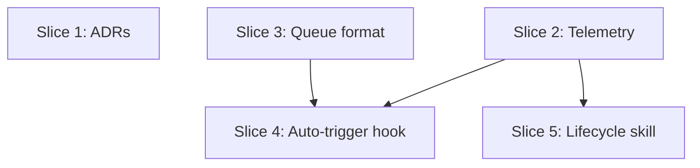

# Plan: Closed Learning Loop — Issues #391–#397

**Created**: 2026-06-23
**Branch**: main
**Status**: draft

## Goal

Implement the closed learning loop for the dev-team plugin — five feature additions
plus two decision records derived from the hermes-agent competitive analysis. The
feature additions close the gap between passive telemetry collection and active loop
closure: a per-artifact usage index, a pending-review queue bridging background
analysis to the human gate, an opt-in auto-trigger hook that runs session analysis
automatically, and a skill lifecycle skill that surfaces stale/archived artifacts.
The decision records lock in the human-gate and per-session-granularity choices as
ADRs so future contributors don't reopen those decisions.

## Approach Stances

| Axis | Stance | Why |
|------|--------|-----|
| Replace vs. merge | **Merge** for all existing files (`telemetry.sh`, `session-model-banner.sh`, `settings.json`, `session-review/SKILL.md`, `feedback-learning/SKILL.md`, `harness-audit/SKILL.md`) | Existing content must be preserved; each change adds behavior without removing prior behavior |
| Format fidelity | Preserve SKILL.md frontmatter schema and bats test patterns verbatim | Deviate and the agent-audit and pre-commit gates fail |
| Scope | Contained to learning-loop artifacts only — no unrelated cleanup folded in | Explicit decision-defaults.md guidance |
| Integration | PR per slice; auto-merge for the two documentation-only slices; human merge for code slices | CLAUDE.md: docs-only PRs auto-merge |

## Acceptance Criteria

**Slice 1 — Decision Records**

- [ ] `docs/adr/0009-human-consent-gate-for-learning-loop.md` exists, has `## Status` set to "Accepted", and contains `## Context`, `## Decision`, and `## Consequences` sections
- [ ] `docs/adr/0010-per-session-analysis-granularity.md` exists, has `## Status` set to "Accepted", and its `## Decision` section states that the trigger fires on SessionStop, not per conversation turn
- [ ] Both ADR files pass a bats structural test in `tests/docs/learning_loop_adr_tests.bats`

**Slice 2 — Per-Artifact Telemetry**

- [ ] When `DEV_TEAM_TELEMETRY=on` and a `PreToolUse Skill` event arrives with a valid skill name matching `[a-zA-Z][a-zA-Z0-9_:-]*`, `metrics/artifact-usage.json` is created if absent or upserted if present; `use_count` increments by 1, `last_used_at` is set to the current UTC ISO-8601 timestamp, and `lifecycle` is `"active"` on first write or preserved on subsequent writes
- [ ] When the skill name in a `PreToolUse Skill` event does not match `[a-zA-Z][a-zA-Z0-9_:-]*`, `metrics/artifact-usage.json` is not modified and the hook exits 0
- [ ] When telemetry is disabled (neither `DEV_TEAM_TELEMETRY=on` nor `.claude/telemetry.json` with `enabled:true`), `metrics/artifact-usage.json` is not created or modified
- [ ] When both `DEV_TEAM_TELEMETRY=on` and `.claude/telemetry.json` with `enabled:false` are present, the file-based opt-out wins — `artifact-usage.json` is not written (file-based opt-out overrides env-var opt-in, consistent with existing `telemetry.jsonl` behavior)
- [ ] When `metrics/artifact-usage.json` already contains malformed JSON, the hook discards the corrupt file, writes a fresh single-entry JSON object, and emits one `WARN` line to stderr before exiting 0
- [ ] When the `metrics/` directory is not writable, the hook exits 0 without crashing and no file is written
- [ ] `knowledge/artifact-lifecycle.md` defines three lifecycle states (`active`, `stale`, `archived`), the `pinned` exemption, the stale threshold (>30 days since `last_used_at`), and the archived threshold (>90 days since `last_used_at`)

**Slice 3 — Pending-Review Queue**

- [ ] When `metrics/pending-review.jsonl` contains at least one entry where `reviewed_at` is absent, `/session-review` displays a "Queued Findings" section listing those entries before running fresh analysis
- [ ] When `metrics/pending-review.jsonl` does not exist or contains only entries where `reviewed_at` is present, `/session-review` skips the "Queued Findings" section
- [ ] When `metrics/pending-review.jsonl` contains malformed JSON lines, those specific lines are skipped and a one-line warning is emitted; valid entries are displayed normally
- [ ] When the user approves a queued finding via `/feedback-learning`, the entry gains `reviewed_at` (ISO-8601 UTC) and `approved_by` fields, and the applied change is recorded in `metrics/config-changelog.jsonl`
- [ ] When the user rejects a queued finding via `/feedback-learning`, the entry gains `rejected_at` (ISO-8601 UTC) and `rejected_by` fields (where `rejected_by` contains the user identifier in the same format as `approved_by`), and the finding is NOT written to `metrics/config-changelog.jsonl`
- [ ] On `SessionStart`, if `metrics/pending-review.jsonl` contains at least one entry where `reviewed_at` is absent, `session-model-banner.sh` emits a one-line notification of the form `"📋 N queued finding(s) from background analysis — run /session-review to review"` before the session begins
- [ ] The `pending-review.jsonl` schema is documented in `session-review/SKILL.md`: each line is a JSON object with fields `queued_at` (ISO-8601), `source` (string), `session_id` (string), and `findings` (array of objects with `lever`, `evidence`, `target_artifact`, `proposed_change`, `route`)

**Slice 4 — Auto-Trigger Hook**

- [ ] `hooks/session-learning-trigger.sh` exits 0 without spawning any subprocess when `DEV_TEAM_AUTO_REVIEW` is unset or set to any value other than `"on"`
- [ ] When `DEV_TEAM_AUTO_REVIEW=on`, the hook increments the `counter` field in `metrics/learning-loop-state.json` on each `SessionStop` event
- [ ] When `metrics/learning-loop-state.json` is absent, the hook creates it with `counter: 1` and exits 0 without dispatching analysis
- [ ] When `metrics/learning-loop-state.json` contains malformed JSON, the hook reinitializes it with `counter: 1` and exits 0 without dispatching analysis
- [ ] When `counter` reaches the threshold (configurable via `DEV_TEAM_AUTO_REVIEW_THRESHOLD`, default 5), the hook resets `counter` to 0, runs `session_extract.py --since last` to produce an incremental digest, and spawns a background `claude` subprocess that dispatches the `session-analysis` agent
- [ ] The background subprocess writes findings as JSONL entries to `metrics/pending-review.jsonl`; no files in `plugins/dev-team/**/*` or the project `CLAUDE.md` are modified during or after hook execution
- [ ] When the background `claude` subprocess exits non-zero, `metrics/pending-review.jsonl` is not created or modified with partial output, and the hook exits 0
- [ ] When the `SessionStop` hook's stdin JSON payload contains a non-empty `session_id` field, the spawned `claude` command includes `--session-id <session_id>`; when `session_id` is absent or empty in the payload, the flag is omitted and the hook proceeds normally
- [ ] `hooks/session-learning-trigger.sh` is registered in the `hooks.SessionStop` section of `plugins/dev-team/settings.json`

**Slice 5 — Skill Lifecycle Management**

- [ ] When `metrics/artifact-usage.json` does not exist, `/artifact-lifecycle` outputs `"No usage data available — enable telemetry to begin tracking (see /telemetry)"` and exits without error
- [ ] When `metrics/artifact-usage.json` contains an entry whose `last_used_at` is **30 or more days** before the current date (i.e., `days_since_used >= 30`), that entry appears in a "Stale Skills" section of the report with a proposal to add it to `## Disabled Skills` in `CLAUDE.md`
- [ ] When `metrics/artifact-usage.json` contains an entry whose `last_used_at` is **90 or more days** before the current date (i.e., `days_since_used >= 90`), that entry appears in an "Archive Candidates" section (and not in the Stale Skills section)
- [ ] When `CLAUDE.md` lists a skill name under `## Pinned Skills`, that skill is excluded from all lifecycle transitions regardless of `last_used_at`
- [ ] No files matching `plugins/dev-team/**/*` (the plugin cache) are removed or modified during or after `/artifact-lifecycle` execution; changes land exclusively in the project `CLAUDE.md`
- [ ] When all `artifact-usage.json` entries have `last_used_at` within the last 30 days, the output states `"All tracked artifacts are active — no lifecycle changes needed"`
- [ ] `plugins/dev-team/skills/artifact-lifecycle/SKILL.md` has `user-invocable: true` in its frontmatter
- [ ] `plugins/dev-team/skills/harness-audit/SKILL.md` references `metrics/artifact-usage.json` in its data-input section
- [ ] `artifact-lifecycle` is listed in `plugins/dev-team/knowledge/agent-registry.md` with no MISSING or ORPHAN discrepancy (verified by `scripts/check_registry_sync.py` or equivalent gate)

### Quality

- [ ] All bats tests pass (`bats tests/`)
- [ ] `shellcheck` clean on `telemetry.sh` and `session-learning-trigger.sh`
- [ ] `jq .` validates on modified `settings.json`
- [ ] `/agent-audit` passes on new and modified skills

## Slices

### Slice 1: Decision Records (ADR 0009 + ADR 0010)

**Depends-on:** none
**Files:** `docs/adr/0009-human-consent-gate-for-learning-loop.md`, `docs/adr/0010-per-session-analysis-granularity.md`, `tests/docs/learning_loop_adr_tests.bats`

**Behavior:**

```gherkin
Feature: Learning loop decision records

  Scenario: Human consent gate ADR documents the queued-not-applied design
    Given the repository has a docs/adr/ directory
    When the ADR 0009 file is read
    Then docs/adr/0009-human-consent-gate-for-learning-loop.md exists
    And the file contains a "## Status" section with the text "Accepted"
    And the file contains "## Context", "## Decision", and "## Consequences" sections
    And the "## Decision" section contains the phrase "queued" and does not contain "auto-applied"

  Scenario: Per-session granularity ADR documents the SessionStop trigger
    Given the repository has a docs/adr/ directory
    When the ADR 0010 file is read
    Then docs/adr/0010-per-session-analysis-granularity.md exists
    And the file contains a "## Status" section with the text "Accepted"
    And the "## Decision" section contains "SessionStop" and does not contain "per turn"
```

**Steps:**

#### Step 1.1: Bats tests and ADR files

**Complexity**: trivial
**RED**: Write `tests/docs/learning_loop_adr_tests.bats` with four tests: (1) ADR 0009 file exists; (2) ADR 0009 has `## Status` section containing "Accepted" and `## Decision` section containing "queued"; (3) ADR 0010 file exists; (4) ADR 0010 has `## Status` containing "Accepted" and `## Decision` containing "SessionStop"
**GREEN**: Create both ADR files following the format in `docs/adr/0001-record-architecture-decisions.md` — status "Accepted", three required sections each
**REFACTOR**: None needed
**Files**: `tests/docs/learning_loop_adr_tests.bats`, `docs/adr/0009-human-consent-gate-for-learning-loop.md`, `docs/adr/0010-per-session-analysis-granularity.md`
**Commit**: `docs: add ADRs 0009 and 0010 for learning loop design decisions`

---

### Slice 2: Per-Artifact Telemetry

**Depends-on:** none
**Files:** `plugins/dev-team/hooks/telemetry.sh`, `plugins/dev-team/knowledge/artifact-lifecycle.md`, `tests/hooks/artifact_usage_telemetry_tests.bats`

**Behavior:**

```gherkin
Feature: Per-artifact usage telemetry

  Scenario: Cold-start creates artifact-usage.json when file and directory are absent
    Given DEV_TEAM_TELEMETRY is set to "on"
    And metrics/artifact-usage.json does not exist
    And the metrics/ directory does not exist
    When a PreToolUse Skill event arrives with skill name "session-review"
    Then the metrics/ directory is created
    And metrics/artifact-usage.json is created as a valid JSON object
    And the "session-review" entry has use_count of 1
    And the "session-review" entry has a last_used_at ISO-8601 UTC timestamp
    And the "session-review" entry has lifecycle set to "active"

  Scenario: Repeat invocation increments use_count without changing lifecycle
    Given DEV_TEAM_TELEMETRY is set to "on"
    And metrics/artifact-usage.json contains a "session-review" entry with use_count 3 and lifecycle "stale"
    When a PreToolUse Skill event arrives for "session-review"
    Then the use_count for "session-review" becomes 4
    And the lifecycle value remains "stale" (preserved on upsert)

  Scenario: Invalid skill name is not recorded
    Given DEV_TEAM_TELEMETRY is set to "on"
    When a PreToolUse Skill event arrives with skill name "" (empty string)
    Then metrics/artifact-usage.json is not created or modified
    And the hook exits 0

  Scenario: Artifact-usage.json is not written when env-var telemetry is disabled
    Given DEV_TEAM_TELEMETRY is unset
    And .claude/telemetry.json does not exist
    When a PreToolUse Skill event arrives for "session-review"
    Then metrics/artifact-usage.json is not created or modified

  Scenario: File-based opt-out overrides env-var opt-in
    Given DEV_TEAM_TELEMETRY is set to "on"
    And .claude/telemetry.json contains {"enabled": false}
    When a PreToolUse Skill event arrives for "session-review"
    Then metrics/artifact-usage.json is not created or modified

  Scenario: Concurrent writes do not corrupt artifact-usage.json
    Given DEV_TEAM_TELEMETRY is set to "on"
    And metrics/artifact-usage.json contains "session-review" with use_count 2
    When two PreToolUse Skill events for "session-review" are processed sequentially by the same hook process
    Then metrics/artifact-usage.json is valid JSON
    And the use_count for "session-review" is 4 (incremented twice)

  Scenario: Malformed artifact-usage.json is discarded and rewritten
    Given DEV_TEAM_TELEMETRY is set to "on"
    And metrics/artifact-usage.json contains invalid JSON ("{{broken")
    When a PreToolUse Skill event arrives for "session-review"
    Then metrics/artifact-usage.json is valid JSON containing a "session-review" entry
    And a WARN message was emitted to stderr
    And the hook exits 0

  Scenario: Unwritable metrics directory causes graceful exit
    Given DEV_TEAM_TELEMETRY is set to "on"
    And metrics/ exists but is not writable by the current user
    When a PreToolUse Skill event arrives for "session-review"
    Then the hook exits 0 without crashing
    And metrics/artifact-usage.json is not modified

  Scenario: Knowledge file defines lifecycle states and thresholds
    Given the plugins/dev-team/knowledge/ directory
    When artifact-lifecycle.md is read
    Then the file defines three states: active, stale, and archived
    And the stale threshold is stated as "more than 30 days" since last_used_at
    And the archived threshold is stated as "more than 90 days" since last_used_at
    And the file documents that pinned skills bypass all transitions
```

**Steps:**

#### Step 2.1: Knowledge file for lifecycle states

**Complexity**: trivial
**RED**: Write bats tests in `tests/hooks/artifact_usage_telemetry_tests.bats` asserting: (a) `knowledge/artifact-lifecycle.md` exists; (b) the file contains the strings "active", "stale", "archived", "30", "90", and "pinned"
**GREEN**: Create `plugins/dev-team/knowledge/artifact-lifecycle.md` documenting the three lifecycle states, both numeric thresholds, and the `pinned` exemption
**REFACTOR**: None needed
**Files**: `plugins/dev-team/knowledge/artifact-lifecycle.md`, `tests/hooks/artifact_usage_telemetry_tests.bats`
**Commit**: `docs: add artifact-lifecycle knowledge file defining usage lifecycle states`

#### Step 2.2: Extend telemetry.sh to write artifact-usage.json

**Complexity**: standard
**RED**: Add bats tests to `tests/hooks/artifact_usage_telemetry_tests.bats` for: (a) cold-start creates directory and file with correct entry; (b) repeat invocation increments `use_count` while preserving `lifecycle`; (c) empty/invalid skill name writes nothing; (d) disabled telemetry writes nothing; (e) file-based opt-out overrides env-var opt-in; (f) malformed existing file is discarded, fresh entry written, WARN emitted to stderr; (g) unwritable directory causes graceful exit 0. Use the fake-bin pattern from `tests/hooks/fake-bin/` for any subprocess stubs needed
**GREEN**: Extend the `PreToolUse → Skill` branch in `telemetry.sh` to: (1) check consent (same gate as existing `_emit` — exit early when disabled); (2) validate skill name against the existing grammar regex; (3) call `_upsert_artifact_usage <skill_name>` which reads `metrics/artifact-usage.json` into a temp var, applies jq upsert logic, and atomically moves a temp file to the target path. Initialise `lifecycle` to `"active"` on first write; preserve existing `lifecycle` value on subsequent writes. Any I/O error in `_upsert_artifact_usage` emits one WARN to stderr and returns 0 (fail-open)
**REFACTOR**: Extract the upsert logic into `_upsert_artifact_usage` as a clearly separated helper function below `_emit`, so the two concerns (event recording vs. usage accounting) are readable as distinct operations
**Files**: `plugins/dev-team/hooks/telemetry.sh`, `tests/hooks/artifact_usage_telemetry_tests.bats`
**Commit**: `feat: extend telemetry hook to write per-artifact usage index (artifact-usage.json)`

---

### Slice 3: Pending-Review Queue

**Depends-on:** none
**Files:** `plugins/dev-team/skills/session-review/SKILL.md`, `plugins/dev-team/skills/feedback-learning/SKILL.md`, `plugins/dev-team/hooks/session-model-banner.sh`, `tests/skills/pending_review_queue_tests.bats`

**Behavior:**

```gherkin
Feature: Pending-review queue bridging auto-trigger to human gate

  Scenario: session-review surfaces queued findings with schema-conformant entries
    Given metrics/pending-review.jsonl contains one entry with no reviewed_at field
    And the entry has fields: queued_at, source, session_id, and a findings array
    When the user runs /session-review
    Then the skill displays a "Queued Findings" section before running fresh analysis
    And the section shows the queued_at timestamp and the count of findings

  Scenario: session-review skips queue section when no unreviewed entries exist
    Given metrics/pending-review.jsonl exists but all entries have a reviewed_at field
    When the user runs /session-review
    Then the skill proceeds directly to fresh analysis with no "Queued Findings" section

  Scenario: session-review skips queue section when file is absent
    Given metrics/pending-review.jsonl does not exist
    When the user runs /session-review
    Then the skill proceeds directly to fresh analysis with no "Queued Findings" section

  Scenario: Malformed JSONL lines are skipped with a warning
    Given metrics/pending-review.jsonl contains one valid entry and one malformed line ("{{invalid")
    When the user runs /session-review
    Then the valid entry is displayed in the "Queued Findings" section
    And a one-line warning notes that one malformed entry was skipped

  Scenario: feedback-learning marks an approved queue entry as reviewed
    Given metrics/pending-review.jsonl contains an entry with no reviewed_at field
    And the entry has a findings array with one item whose route is "feedback-learning"
    When the user approves the finding via /feedback-learning
    Then the entry in pending-review.jsonl gains a reviewed_at ISO-8601 UTC field
    And the entry gains an approved_by field containing the user identifier
    And the applied change is appended to metrics/config-changelog.jsonl

  Scenario: feedback-learning marks a rejected queue entry without writing changelog
    Given metrics/pending-review.jsonl contains an entry with no reviewed_at field
    When the user rejects the finding via /feedback-learning
    Then the entry in pending-review.jsonl gains a rejected_at ISO-8601 UTC field
    And the entry gains a rejected_by field
    And no entry is appended to metrics/config-changelog.jsonl for this finding

  Scenario: SessionStart banner notifies user of unreviewed pending findings
    Given metrics/pending-review.jsonl contains 3 entries with no reviewed_at field
    When a new Claude Code session starts and session-model-banner.sh runs
    Then the banner output contains the text "3 queued finding(s)"
    And the banner output contains the instruction to run /session-review

  Scenario: SessionStart banner is silent when no pending entries exist
    Given metrics/pending-review.jsonl does not exist
    When a new Claude Code session starts and session-model-banner.sh runs
    Then the banner does not contain any reference to pending findings or /session-review
```

**Steps:**

#### Step 3.1: Bats tests for queue format contract

**Complexity**: trivial
**RED**: Write `tests/skills/pending_review_queue_tests.bats` with tests asserting: (a) `session-review/SKILL.md` contains the string `pending-review.jsonl` AND the string `queued_at`; (b) `feedback-learning/SKILL.md` contains the strings `reviewed_at`, `approved_by`, `rejected_at`, and `rejected_by`; (c) `session-model-banner.sh` contains the string `pending-review.jsonl`. These tests will fail until Steps 3.2–3.4 add the content
**GREEN**: Test stubs only — these tests are expected to fail at this point
**REFACTOR**: None
**Files**: `tests/skills/pending_review_queue_tests.bats`
**Commit**: `test: add bats tests for pending-review queue contract`

#### Step 3.2: Extend session-review SKILL.md with queue consumption step and schema

**Complexity**: standard
**RED**: Step 3.1 test (a) fails — `session-review/SKILL.md` does not yet reference `pending-review.jsonl` or `queued_at`
**GREEN**: Prepend a new "Step 0: Queued Findings" section to `session-review/SKILL.md` before the existing Step 0 (telemetry sync check). The new step: (1) checks whether `metrics/pending-review.jsonl` exists and has unreviewed entries (any entry lacking `reviewed_at`); (2) if found, display a "Queued Findings" section with count and `queued_at` timestamps before proceeding; (3) skip-quiet if file absent or all reviewed. Also document the `pending-review.jsonl` schema in this section: `{ queued_at, source, session_id, findings: [{ lever, evidence, target_artifact, proposed_change, route }] }`
**REFACTOR**: None
**Files**: `plugins/dev-team/skills/session-review/SKILL.md`
**Commit**: `feat: session-review surfaces pending-review queue and documents queue schema`

#### Step 3.3: Extend feedback-learning SKILL.md with reviewed/rejected entry marking

**Complexity**: standard
**RED**: Step 3.1 test (b) fails — `feedback-learning/SKILL.md` does not yet reference `reviewed_at`, `approved_by`, `rejected_at`, `rejected_by`
**GREEN**: Add a "Pending-Review Queue Disposition" section to `feedback-learning/SKILL.md` describing: (1) approval path — write `reviewed_at` and `approved_by` into the matching queue entry, then proceed to apply the change and log to `config-changelog.jsonl` as usual; (2) rejection path — write `rejected_at` and `rejected_by` into the entry, do NOT write to `config-changelog.jsonl`; (3) matching logic — match by `source` + `queued_at` combination to handle duplicate-content entries
**REFACTOR**: None
**Files**: `plugins/dev-team/skills/feedback-learning/SKILL.md`
**Commit**: `feat: feedback-learning disposition path for pending-review queue entries`

#### Step 3.4: Extend session-model-banner.sh with pending-findings notification

**Complexity**: standard
**RED**: Step 3.1 test (c) fails — `session-model-banner.sh` does not yet reference `pending-review.jsonl`
**GREEN**: Extend `plugins/dev-team/hooks/session-model-banner.sh` to: after the existing banner logic, check `metrics/pending-review.jsonl` for entries lacking `reviewed_at`; if N > 0, emit `"📋 N queued finding(s) from background analysis — run /session-review to review"` to stdout; if 0 or file absent, emit nothing
**REFACTOR**: None
**Files**: `plugins/dev-team/hooks/session-model-banner.sh`
**Commit**: `feat: session-model-banner notifies user of pending-review findings`

---

### Slice 4: Auto-Trigger Hook (Issues #391 + #395)

**Depends-on:** 2, 3
**Files:** `plugins/dev-team/hooks/session-learning-trigger.sh`, `plugins/dev-team/settings.json`, `tests/hooks/session_learning_trigger_tests.bats`, `tests/hooks/settings_registration_test.bats`

**Behavior:**

```gherkin
Feature: Auto-trigger hook for closed learning loop

  Scenario: Hook exits without analysis when DEV_TEAM_AUTO_REVIEW is unset
    Given DEV_TEAM_AUTO_REVIEW is not set in the environment
    When the SessionStop hook fires
    Then the hook exits 0
    And no subprocess is spawned
    And metrics/learning-loop-state.json is not created or modified

  Scenario: Hook exits without analysis when DEV_TEAM_AUTO_REVIEW is set to a non-"on" value
    Given DEV_TEAM_AUTO_REVIEW is set to "off"
    When the SessionStop hook fires
    Then the hook exits 0 without spawning any subprocess

  Scenario: Hook creates state file and initializes counter on first run
    Given DEV_TEAM_AUTO_REVIEW is set to "on"
    And metrics/learning-loop-state.json does not exist
    When the SessionStop hook fires
    Then metrics/learning-loop-state.json is created with {"counter": 1}
    And no background analysis is dispatched

  Scenario: Hook recovers from corrupt state file
    Given DEV_TEAM_AUTO_REVIEW is set to "on"
    And metrics/learning-loop-state.json contains invalid JSON ("{{broken")
    When the SessionStop hook fires
    Then metrics/learning-loop-state.json is rewritten with {"counter": 1}
    And no background analysis is dispatched
    And the hook exits 0

  Scenario: Hook increments counter without dispatching below threshold
    Given DEV_TEAM_AUTO_REVIEW is set to "on"
    And metrics/learning-loop-state.json contains {"counter": 3}
    When the SessionStop hook fires
    Then metrics/learning-loop-state.json contains {"counter": 4}
    And no subprocess is spawned

  Scenario: Hook dispatches background analysis when counter reaches default threshold
    Given DEV_TEAM_AUTO_REVIEW is set to "on"
    And metrics/learning-loop-state.json contains {"counter": 4}
    And DEV_TEAM_AUTO_REVIEW_THRESHOLD is unset (default 5)
    When the SessionStop hook fires
    Then metrics/learning-loop-state.json contains {"counter": 0}
    And a python3 subprocess is invoked with arguments matching "session_extract.py" and "--since" and "last"
    And a claude subprocess is spawned in the background with an argument matching "session-analysis"

  Scenario: Hook respects a custom threshold when DEV_TEAM_AUTO_REVIEW_THRESHOLD is set
    Given DEV_TEAM_AUTO_REVIEW is set to "on"
    And DEV_TEAM_AUTO_REVIEW_THRESHOLD is set to "3"
    And metrics/learning-loop-state.json contains {"counter": 2}
    When the SessionStop hook fires
    Then metrics/learning-loop-state.json contains {"counter": 0}
    And a claude subprocess is spawned in the background

  Scenario: Background subprocess failure leaves pending-review.jsonl unchanged
    Given DEV_TEAM_AUTO_REVIEW is set to "on"
    And the threshold has been reached
    And the fake claude subprocess exits 1
    When the SessionStop hook completes
    Then metrics/pending-review.jsonl is not created or modified with partial output
    And the hook exits 0

  Scenario: Hook passes session-id when the hook payload contains a session_id
    Given DEV_TEAM_AUTO_REVIEW is set to "on"
    And metrics/learning-loop-state.json contains {"counter": 4}
    And DEV_TEAM_AUTO_REVIEW_THRESHOLD is unset (default 5)
    And the SessionStop hook stdin JSON contains {"session_id": "abc-123", ...}
    When the SessionStop hook fires
    Then metrics/learning-loop-state.json contains {"counter": 0}
    And the claude invocation includes "--session-id" and "abc-123" as arguments

  Scenario: Hook omits session-id when the hook payload has no session_id
    Given DEV_TEAM_AUTO_REVIEW is set to "on"
    And metrics/learning-loop-state.json contains {"counter": 4}
    And DEV_TEAM_AUTO_REVIEW_THRESHOLD is unset (default 5)
    And the SessionStop hook stdin JSON does not contain a session_id field
    When the SessionStop hook fires
    Then the claude invocation does not include "--session-id"
    And the hook exits 0
```

**Steps:**

#### Step 4.1: Consent gate and session counter

**Complexity**: standard
**RED**: Write `tests/hooks/session_learning_trigger_tests.bats` asserting: (a) hook exits 0 with no subprocess when `DEV_TEAM_AUTO_REVIEW` is unset; (b) hook exits 0 when set to `"off"`; (c) when enabled and state file absent, creates `{"counter": 1}` and exits without dispatch; (d) when enabled and state file contains corrupt JSON, reinitializes `{"counter": 1}` and exits 0; (e) when enabled and `{"counter": 3}`, writes `{"counter": 4}` and spawns nothing. Use `tests/hooks/fake-bin/` stubs for `python3` and `claude` that record invocation arguments to a temp file — tests assert the temp file is empty (no subprocess invoked)
**GREEN**: Create `plugins/dev-team/hooks/session-learning-trigger.sh` with: consent gate (`DEV_TEAM_AUTO_REVIEW=on` check), state-file read with corruption recovery, counter increment via jq + temp-file-and-move, threshold comparison
**REFACTOR**: None
**Files**: `plugins/dev-team/hooks/session-learning-trigger.sh`, `tests/hooks/session_learning_trigger_tests.bats`, `tests/hooks/fake-bin/claude` (new shim), `tests/hooks/fake-bin/python3` (new shim addition)
**Commit**: `feat: session-learning-trigger hook — consent gate and session counter`

#### Step 4.2: Register hook in settings.json

**Complexity**: trivial
**RED**: Add bats test to `tests/hooks/settings_registration_test.bats` asserting `session-learning-trigger.sh` is registered under `hooks.SessionStop` via `jq -e '.hooks.SessionStop[]...select(.command | contains("session-learning-trigger.sh"))'`
**GREEN**: Add `SessionStop` entry to `plugins/dev-team/settings.json`: `{ "type": "command", "command": "bash hooks/session-learning-trigger.sh" }`
**REFACTOR**: None
**Files**: `plugins/dev-team/settings.json`, `tests/hooks/settings_registration_test.bats`
**Commit**: `feat: register session-learning-trigger in SessionStop hooks`

#### Step 4.3: Background dispatch at threshold

**Complexity**: complex
**RED**: Extend `tests/hooks/session_learning_trigger_tests.bats` with: (a) when counter=4 (threshold-1), after hook: counter=0, `python3` shim was called with path containing `session_extract.py` + `--since` + `last`, `claude` shim was called with arg matching `session-analysis`; (b) when the `claude` shim exits 1, `pending-review.jsonl` is absent and hook exits 0. Shim contract: fake `python3` exits 0 and writes nothing; fake `claude` records its argv to `$BATS_TMPDIR/claude-args.txt` and exits per `FAKE_CLAUDE_EXIT` (default 0). Shims live in `tests/hooks/fake-bin/` and are prepended to `PATH` in the bats `setup()` function
**GREEN**: Implement threshold check (`[ "$counter" -ge "$threshold" ]`), `session_extract.py` invocation, and background `claude` subprocess dispatch. Wrap the dispatch in a subshell: `( run_analysis & )`. If the background process exits non-zero, the state file is not modified again (the reset already happened before dispatch)
**REFACTOR**: Extract `_should_dispatch` and `_dispatch_background_analysis` as named helper functions
**Files**: `plugins/dev-team/hooks/session-learning-trigger.sh`, `tests/hooks/session_learning_trigger_tests.bats`, `tests/hooks/fake-bin/claude`, `tests/hooks/fake-bin/python3`
**Commit**: `feat: session-learning-trigger dispatches background session-analysis at threshold`

#### Step 4.4: Prompt-cache reuse via session-id

**Complexity**: standard
**Note**: `session_id` is a standard field in the Claude Code hook JSON payload (confirmed present in existing hooks: `verify-guard.sh`, `bash-retry-guard.sh`). No pre-condition verification needed — this is reliably available.
**RED**: Add bats tests that supply hook input JSON via stdin: (a) when stdin JSON contains `{"session_id": "abc-123", ...}` and threshold is reached, the claude shim's recorded argv contains `--session-id` and `abc-123`; (b) when stdin JSON omits `session_id` (or it is empty), argv does not contain `--session-id` and hook exits 0
**GREEN**: At hook startup, extract `SESSION_ID=$(echo "$INPUT" | jq -r '.session_id // empty')` (the hook already reads stdin into `$INPUT` for other fields). In `_dispatch_background_analysis`, conditionally append `--session-id "$SESSION_ID"` when `[ -n "$SESSION_ID" ]`
**REFACTOR**: Add one-line comment: `# --session-id shares the parent's prompt-cache prefix, reducing background API cost ~26%`
**Files**: `plugins/dev-team/hooks/session-learning-trigger.sh`, `tests/hooks/session_learning_trigger_tests.bats`
**Commit**: `feat: pass session-id to background analysis for prompt-cache reuse (#395)`

---

### Slice 5: Skill Lifecycle Management

**Depends-on:** 2
**Files:** `plugins/dev-team/skills/artifact-lifecycle/SKILL.md`, `plugins/dev-team/skills/harness-audit/SKILL.md`, `plugins/dev-team/knowledge/agent-registry.md`, `tests/skills/artifact_lifecycle_skill_tests.bats`

**Behavior:**

```gherkin
Feature: Skill lifecycle management

  Scenario: Skill reports no-data state when artifact-usage.json is absent
    Given metrics/artifact-usage.json does not exist
    When the user runs /artifact-lifecycle
    Then the output contains "No usage data available"
    And the output contains a suggestion to run /telemetry or enable DEV_TEAM_TELEMETRY
    And no error is thrown

  Scenario: Skill classifies a skill unused for 45 days as stale (reference date 2026-05-15)
    Given metrics/artifact-usage.json contains "old-skill" with last_used_at "2026-04-01T00:00:00Z"
    And the reference date for threshold calculation is 2026-05-15
    When the user runs /artifact-lifecycle
    Then "old-skill" appears in the "Stale Skills" section
    And the report proposes adding "old-skill" to "## Disabled Skills" in CLAUDE.md

  Scenario: Skill classifies a skill unused for 100 days as an archive candidate (reference date 2026-05-15)
    Given metrics/artifact-usage.json contains "ancient-skill" with last_used_at "2026-02-04T00:00:00Z"
    And the reference date for threshold calculation is 2026-05-15
    When the user runs /artifact-lifecycle
    Then "ancient-skill" appears in the "Archive Candidates" section
    And "ancient-skill" does not appear in the "Stale Skills" section

  Scenario: Boundary at exactly 30 days is treated as stale (threshold is >= 30 days)
    Given metrics/artifact-usage.json contains "boundary-skill" with last_used_at "2026-04-15T00:00:00Z"
    And the reference date is 2026-05-15 (exactly 30 days later, days_since_used = 30)
    When the user runs /artifact-lifecycle
    Then "boundary-skill" appears in the "Stale Skills" section
    And the skill's SKILL.md documents the ">= 30 days" (inclusive) stale definition

  Scenario: Boundary at exactly 90 days is treated as an archive candidate (threshold is >= 90 days)
    Given metrics/artifact-usage.json contains "old-skill" with last_used_at "2026-02-14T00:00:00Z"
    And the reference date is 2026-05-15 (exactly 90 days later, days_since_used = 90)
    When the user runs /artifact-lifecycle
    Then "old-skill" appears in the "Archive Candidates" section
    And "old-skill" does not appear in the "Stale Skills" section

  Scenario: Pinned skills are excluded from all lifecycle transitions
    Given metrics/artifact-usage.json contains "pinned-skill" with last_used_at "2025-01-01T00:00:00Z"
    And CLAUDE.md contains "pinned-skill" under a "## Pinned Skills" section
    When the user runs /artifact-lifecycle
    Then "pinned-skill" does not appear in Stale Skills or Archive Candidates
    And the report notes that "pinned-skill" is pinned and excluded

  Scenario: Skill never modifies plugin cache files
    Given /artifact-lifecycle produces a list of stale and archive-candidate skills
    When the user confirms applying CLAUDE.md overrides
    Then no files under plugins/dev-team/ are created, modified, or deleted
    And the only file written is the project CLAUDE.md

  Scenario: All-active report when no skills exceed the threshold
    Given all entries in artifact-usage.json have last_used_at within 29 days of today
    When the user runs /artifact-lifecycle
    Then the output contains "All tracked artifacts are active"
    And no CLAUDE.md changes are proposed
```

**Steps:**

#### Step 5.1: SKILL.md and structural bats tests

**Complexity**: trivial
**RED**: Write `tests/skills/artifact_lifecycle_skill_tests.bats` asserting: (a) `skills/artifact-lifecycle/SKILL.md` exists; (b) frontmatter contains `user-invocable: true`; (c) body references `metrics/artifact-usage.json`; (d) body contains language about never deleting or modifying files in the plugin cache (e.g., "plugins/dev-team"); (e) body references "Pinned Skills"; (f) body defines the `>=` boundary for the 30-day stale threshold; (g) `knowledge/agent-registry.md` contains "artifact-lifecycle" (registry sync check)
**GREEN**: Create `plugins/dev-team/skills/artifact-lifecycle/SKILL.md` covering: the seven behavior scenarios above; the zero-data exit with suggestion; date comparison using the system date as the reference; explicit `>= 30 days → stale`, `>= 90 days → archive-candidate` threshold definitions; pinned skill exclusion logic; plugin-cache immutability constraint; proposed `## Disabled Skills` CLAUDE.md override format. Register the skill in `knowledge/agent-registry.md`
**REFACTOR**: None
**Files**: `plugins/dev-team/skills/artifact-lifecycle/SKILL.md`, `plugins/dev-team/knowledge/agent-registry.md`, `tests/skills/artifact_lifecycle_skill_tests.bats`
**Commit**: `feat: add /artifact-lifecycle skill for skill lifecycle management`

#### Step 5.2: Harness-audit integration

**Complexity**: standard
**RED**: Add a bats test asserting `skills/harness-audit/SKILL.md` contains the string `artifact-usage.json`
**GREEN**: Extend `plugins/dev-team/skills/harness-audit/SKILL.md` to include `metrics/artifact-usage.json` in its data-input section alongside the existing `session-digest.jsonl`, with a note that it uses `last_used_at` to identify never-observed and stale artifacts
**REFACTOR**: None
**Files**: `plugins/dev-team/skills/harness-audit/SKILL.md`, `tests/skills/artifact_lifecycle_skill_tests.bats`
**Commit**: `feat: harness-audit consumes artifact-usage.json for stale-artifact detection`

---

## Parallelization

Each slice declares `Depends-on`. Waves derived by `scripts/plan-waves.sh`.



| Wave | Slices (parallel) |
|------|-------------------|
| 1 | 1, 2, 3 |
| 2 | 4, 5 |

**File collision check — Wave 1 (verified by plan-waves.sh: no collisions):**

- Slice 1: `docs/adr/0009-*.md`, `docs/adr/0010-*.md`, `tests/docs/learning_loop_adr_tests.bats`
- Slice 2: `plugins/dev-team/hooks/telemetry.sh`, `plugins/dev-team/knowledge/artifact-lifecycle.md`, `tests/hooks/artifact_usage_telemetry_tests.bats`
- Slice 3: `plugins/dev-team/skills/session-review/SKILL.md`, `plugins/dev-team/skills/feedback-learning/SKILL.md`, `plugins/dev-team/hooks/session-model-banner.sh`, `tests/skills/pending_review_queue_tests.bats`
- **No collisions.**

**File collision check — Wave 2:**

- Slice 4: `plugins/dev-team/hooks/session-learning-trigger.sh`, `plugins/dev-team/settings.json`, `tests/hooks/session_learning_trigger_tests.bats`, `tests/hooks/settings_registration_test.bats`
- Slice 5: `plugins/dev-team/skills/artifact-lifecycle/SKILL.md`, `plugins/dev-team/skills/harness-audit/SKILL.md`, `plugins/dev-team/knowledge/agent-registry.md`, `tests/skills/artifact_lifecycle_skill_tests.bats`
- **No collisions.**

**Cross-wave contract note**: `pending-review.jsonl`'s schema is defined as a deliverable of Slice 3 (Wave 1) inside `session-review/SKILL.md`. Slice 4 (Wave 2) writes to this schema. Slice 4 implementers must read the schema definition from the merged Slice 3 PR before building Step 4.3. `settings.json` is written only by Slice 4 in Wave 2 — no intra-wave conflict.

## Complexity Classification

| Step | Rating | Reason |
|------|--------|--------|
| 1.1 | trivial | Two new markdown ADR files + bats assertions |
| 2.1 | trivial | New knowledge file; bats assertion on content |
| 2.2 | standard | Behavioral extension to existing shell hook; jq upsert; multiple error paths |
| 3.1 | trivial | Bats test stubs only |
| 3.2 | standard | Extending SKILL.md with new workflow step and schema |
| 3.3 | standard | Extending SKILL.md with rejection/approval disposition |
| 3.4 | standard | Extending existing banner hook with queue check |
| 4.1 | standard | New shell hook; consent gate + counter; state file recovery |
| 4.2 | trivial | JSON settings entry + single bats assertion |
| 4.3 | complex | Background process dispatch, subprocess failure handling, test shims with recorded argv |
| 4.4 | standard | Conditional flag passthrough; pre-condition verification gate |
| 5.1 | trivial | New SKILL.md + structural bats tests + registry entry |
| 5.2 | standard | Extending existing SKILL.md |

## Pre-PR Quality Gate

- [ ] All bats tests pass (`bats tests/`)
- [ ] `shellcheck` clean on `telemetry.sh`, `session-learning-trigger.sh`, and `session-model-banner.sh`
- [ ] `jq .` validates on modified `settings.json`
- [ ] `/agent-audit` passes on new and modified skills
- [ ] `/code-review` passes

## Risks & Open Questions

- **`--dangerously-skip-permissions` for background dispatch**: This is the known non-interactive flag for the `claude` CLI. Verify it suppresses the permission prompt for a background `claude` process in Step 4.3. If unavailable, the dispatch may need to write a script to a temp file and use `nohup bash <script> &`.
- **`session_id` in hook payload**: Confirmed available — Claude Code's hook JSON payload includes `session_id` for all hook events. Existing hooks (`verify-guard.sh`, `bash-retry-guard.sh`) already extract it via `jq -r '.session_id // empty'`. No risk.
- **`pending-review.jsonl` schema must finalize in Wave 1**: Slice 3 defines the schema in `session-review/SKILL.md`. Slice 4 builds against it in Wave 2. The schema must be merged and stable before Slice 4 implementation begins.
- **Slice 5 data maturity**: `/artifact-lifecycle` operates on real data only after `artifact-usage.json` has accumulated usage. The zero-data exit path ensures no errors on cold start, but meaningful findings require weeks of telemetry.
- **`session-model-banner.sh` parsing of JSONL**: The banner hook is a shell script; counting unreviewed entries in JSONL requires a `jq` one-liner. Confirm `jq` is a declared prerequisite (it already is per `install.sh` and `dev-setup.sh`).

## Build Progress

### Slices (grouped by wave)

#### Wave 1

- [ ] Slice 1: Decision Records
  - [ ] Step 1.1: Bats tests and ADR files
- [ ] Slice 2: Per-Artifact Telemetry
  - [ ] Step 2.1: Knowledge file for lifecycle states
  - [ ] Step 2.2: Extend telemetry.sh to write artifact-usage.json
- [ ] Slice 3: Pending-Review Queue
  - [ ] Step 3.1: Bats tests for queue format contract
  - [ ] Step 3.2: Extend session-review SKILL.md with queue consumption and schema
  - [ ] Step 3.3: Extend feedback-learning SKILL.md with reviewed/rejected disposition
  - [ ] Step 3.4: Extend session-model-banner.sh with pending-findings notification

#### Wave 2

- [ ] Slice 4: Auto-Trigger Hook
  - [ ] Step 4.1: Consent gate and session counter
  - [ ] Step 4.2: Register hook in settings.json
  - [ ] Step 4.3: Background dispatch at threshold
  - [ ] Step 4.4: Prompt-cache reuse via session-id
- [ ] Slice 5: Skill Lifecycle Management
  - [ ] Step 5.1: SKILL.md, registry entry, and structural bats tests
  - [ ] Step 5.2: Harness-audit integration

### Acceptance Criteria

- [ ] docs/adr/0009 exists, status Accepted, Decision section contains "queued"
- [ ] docs/adr/0010 exists, status Accepted, Decision section contains "SessionStop"
- [ ] Both ADR bats tests pass
- [ ] artifact-usage.json written on valid Skill event when telemetry enabled
- [ ] Invalid skill name: no write, exit 0
- [ ] Telemetry disabled: no write
- [ ] File-based opt-out overrides env-var opt-in
- [ ] Malformed artifact-usage.json: discarded, fresh write, WARN stderr
- [ ] Unwritable metrics/: exit 0, no crash
- [ ] artifact-lifecycle.md defines states, thresholds, pinned exemption
- [ ] session-review surfaces pending entries before fresh analysis
- [ ] session-review skips section when no unreviewed entries exist
- [ ] Malformed JSONL lines skipped with warning
- [ ] feedback-learning approval: reviewed_at, approved_by, changelog entry
- [ ] feedback-learning rejection: rejected_at, rejected_by, no changelog entry
- [ ] SessionStart banner shows count when pending entries exist
- [ ] pending-review.jsonl schema documented in session-review/SKILL.md
- [ ] Hook exits 0 without subprocess when DEV_TEAM_AUTO_REVIEW unset or non-"on"
- [ ] Counter increments on SessionStop when enabled
- [ ] Missing state file initializes counter to 1, no dispatch
- [ ] Corrupt state file reinitializes to 1, no dispatch
- [ ] Counter at threshold: resets to 0, dispatches session_extract.py + claude subprocess
- [ ] Background subprocess failure: pending-review.jsonl not partially written
- [ ] When stdin JSON contains non-empty session_id: --session-id passed to claude invocation
- [ ] When stdin JSON has absent or empty session_id: flag omitted, hook exits 0
- [ ] session-learning-trigger.sh registered in hooks.SessionStop
- [ ] artifact-lifecycle zero-data exit with suggestion
- [ ] Stale classification: >= 30 days since last_used_at
- [ ] Archive classification: >= 90 days since last_used_at
- [ ] Pinned skills excluded from all transitions
- [ ] No files in plugins/dev-team/**/* modified or deleted
- [ ] All-active message when no skills exceed threshold
- [ ] artifact-lifecycle in agent-registry.md
- [ ] harness-audit/SKILL.md references artifact-usage.json
- [ ] All bats tests pass; shellcheck clean; settings.json valid JSON; agent-audit passes

## Plan Review Summary

**Plan tier: complex** — Reviewers: Acceptance Test Critic, Design & Architecture Critic, Strategic Critic, UX Critic, Parallelization Critic (all 5)

### Parallelization Critic

**Verdict: approve.** No file collisions in either wave. Wave 1 has genuine 3-way parallelism (ADRs / telemetry hook / skills are fully disjoint). Wave 2 has 2-way parallelism. One coordination note: `pending-review.jsonl` schema must be stable from Wave 1 Slice 3 before Wave 2 Slice 4 implements the writer — documented as a cross-wave contract note in the Parallelization section.

### Design & Architecture Critic

**Verdict: needs-revision (warnings only).** No blockers. Key observations acted on: (1) session counter persistence mechanism now explicitly named (`metrics/learning-loop-state.json`) in Step 4.1; (2) `pending-review.jsonl` schema is a committed deliverable of Slice 3 Step 3.2 (documented in `session-review/SKILL.md`), not a coordination footnote; (3) `_upsert_artifact_usage` is extracted as a separate helper to keep event-recording and usage-accounting concerns readable as distinct operations. Remaining observations: telemetry.sh read-modify-write coupling is an acceptable trade-off given the fail-open design; `artifact-lifecycle.md` is human-readable reference (not machine-readable config) — thresholds are embedded in the skill logic.

### Strategic Critic

**Verdict: needs-revision (warnings only).** No blockers. Key observations acted on: (1) zero-data exit path for Slice 5 is now an acceptance criterion and a named scenario, not just a risk note; (2) `CLAUDE_SESSION_ID` AC now written in terms of observable env-var behavior (not CLI capability), with a pre-condition verification gate in Step 4.4. Scope at the upper boundary for a single plan but wave structure and per-PR delivery make it manageable. Opportunity cost: "extend existing without new files" alternative was considered and rejected because the auto-trigger specifically requires a new hook registration and the queue requires a persistent schema contract — extension-only would recreate the same surface area inside existing files.

### UX Critic

**Verdict: needs-revision (warnings only).** No blockers. Observations recorded for implementation: (1) async feedback for telemetry sync and Tier-2 sub-agent fan-out is a pre-existing session-review UX concern, not in scope for this plan — logged as a follow-up; (2) `/artifact-lifecycle` description frontmatter must clearly distinguish the skill from the `artifact-lifecycle.md` knowledge file (noted in Step 5.1 GREEN); (3) `session-learning-trigger.sh` hook accumulates state visibly only via the `session-model-banner.sh` notification (Slice 3 Step 3.4) — this bridges the invisible-state gap; (4) `/artifact-lifecycle` reports queue length and proposes CLAUDE.md overrides, satisfying the state-visibility concern.

### Acceptance Test Critic (2 passes)

**Pass 1 verdict: needs-revision** — 8 AC blockers, 8 scenario blockers, 4 step blockers. All addressed in the plan revision.
**Pass 2 verdict: needs-revision** — 3 remaining blockers, all addressed:

1. `rejected_by` field now specifies "containing the user identifier in the same format as `approved_by`"
2. Stale/archive thresholds now consistently `>= 30 days` / `>= 90 days` (inclusive) in both AC and scenarios
3. "Hook omits session-id" scenario now has complete preconditions (`DEV_TEAM_AUTO_REVIEW=on`, counter at threshold-1)
Four warnings from pass 2 addressed: archive-threshold boundary scenario added; custom-threshold configurability scenario added; concurrent-writes scenario note kept (tests sequential double-increment; true concurrency safety guaranteed by temp-file-and-move pattern, not bats-testable without subshells — noted in Step 2.2); Step 4.4 RED phase now explicitly covers both present and absent `CLAUDE_SESSION_ID` cases.
