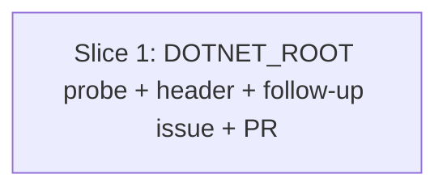

# Plan: csharp-stryker-net-wrapper.sh Cross-Platform DOTNET_ROOT Probe (issue #564)

**Created**: 2026-07-02
**Branch**: issue-564-wrapper-cross-platform
**Status**: approved
**Spec**: [docs/specs/csharp-stryker-net-wrapper-cross-platform.md](../docs/specs/csharp-stryker-net-wrapper-cross-platform.md)

## Approach stance

- **Scope**: single-issue fix. Not bundled with #565 (Step 1c hook enforcement) — the two corrections are independent and each closes a distinct issue.
- **Replace-vs-merge**: **merge**. Existing wrapper (14 tests + 2 integration tests) stays as-is; only the DOTNET_ROOT export block and the header comment change.
- **Migrate-vs-edit-stub**: **edit in place**. Same file, same public contract, no signature change to `restore_sln` or the trap sequence.
- **Format fidelity**: preserve wrapper's existing style — bash 3.2-safe, no GNU-only constructs, same comment density and header format.
- **Auto-merge**: this diff touches a shipped shell script — **NOT** docs-only. Human merge required per CLAUDE.md.
- **No new public config surface** (revision 2, per Design Critic blocker): probe uses a **sourceable internal function** taking a candidate list argument, not a `DOTNET_ROOT_PROBE_PATHS` env var. Bats sources the wrapper's function and calls it directly with fixture paths. Consistent with the sibling `status-loop.sh` sourcing pattern the wrapper already uses; preserves the spec's Ambiguity Log decision that probe order is NOT configurable via env var.

## Goal

Replace the hard-coded macOS Homebrew `DOTNET_ROOT` fallback in `csharp-stryker-net-wrapper.sh` with a cross-platform probe that walks each documented .NET install location on macOS, Linux, and Windows Git Bash, falls back to `$(dirname "$(command -v dotnet)")`, and exits with code 3 + an actionable message when no SDK is found. Also update the header comment to reflect the new scope of cross-platform support. Closes #564.

## Acceptance Criteria

- [ ] Wrapper header comment accurately describes the current cross-platform scope: DOTNET_ROOT resolution now works on macOS, Linux, and Windows Git Bash; process/signal cleanup on Windows Git Bash remains unverified and is deferred to a follow-up (see Risks).
- [ ] `DOTNET_ROOT` pre-set is preserved verbatim (regression guard on existing behavior).
- [ ] macOS Apple Silicon Homebrew (`/opt/homebrew/opt/dotnet/libexec/dotnet` executable) → wrapper exports that path.
- [ ] macOS Intel Homebrew (`/usr/local/opt/dotnet/libexec/dotnet` executable) → wrapper exports that path.
- [ ] Debian/Ubuntu (`/usr/share/dotnet/dotnet` executable) → wrapper exports `/usr/share/dotnet`.
- [ ] Fedora/RHEL (`/usr/lib/dotnet/dotnet` executable) → wrapper exports `/usr/lib/dotnet`.
- [ ] User-scope install (`$HOME/.dotnet/dotnet` executable) → wrapper exports `$HOME/.dotnet`.
- [ ] Windows Git Bash Program Files with `shared/` directory marker → wrapper exports `/c/Program Files/dotnet` (path with space).
- [ ] Windows Git Bash Program Files with `dotnet.exe` marker (no `shared/` dir) → wrapper exports the candidate. (New — Acceptance Critic blocker fix.)
- [ ] Windows Git Bash lowercase drive mount → wrapper exports `/c/program files/dotnet`.
- [ ] Path detection accepts `<candidate>/dotnet` executable OR `<candidate>/dotnet.exe` executable OR `<candidate>/shared` directory as a hit marker.
- [ ] When no probe candidate hits but `dotnet` is on `PATH` → wrapper exports `$(dirname "$(command -v dotnet)")`.
- [ ] When no probe candidate hits AND `dotnet` is not on `PATH` → wrapper exits code **3**, stderr message names at least one probed path, instructs setting `DOTNET_ROOT` explicitly, and includes `https://dotnet.microsoft.com/download`.
- [ ] Exit-3 path does NOT hide `.sln`, does NOT run `dotnet build`, and does NOT invoke `restore_sln` on state that shouldn't be restored (probe runs before hide + before trap install).
- [ ] Probe hit order is stable across the full 7-filesystem-candidate chain: Homebrew Apple Silicon (1) → Homebrew Intel (2) → Debian (3) → Fedora (4) → user-scope (5) → Windows Program Files (6) → Windows lowercase (7) → PATH fallback (final). When multiple candidates exist, the earlier-in-chain one wins.
- [ ] Empty/malformed segments in the internal candidate list are skipped without error.
- [ ] `shellcheck` clean on the modified wrapper (with a documented `# shellcheck disable=SC2086` on the intentional IFS-split loop).
- [ ] The 13 wrapper bats tests that don't touch DOTNET_ROOT resolution still pass **unchanged**. The 1 test that hard-codes `DOTNET_ROOT=/opt/homebrew/opt/dotnet/libexec` (`wrapper: exports the default DOTNET_ROOT when unset`) is **rewritten** to use the new probe-function seam and now asserts probe behavior against a fixture candidate — the test's *intent* (default-resolution regression guard) is preserved; the *assertion form* changes.
- [ ] All 2 existing wrapper+loop integration tests still pass unchanged.
- [ ] All 14 existing status-loop unit tests still pass unchanged.
- [ ] `bash scripts/ci-local.sh` passes.
- [ ] PR title conventional: `fix(mutation-testing): probe dotnet-root across macos + linux + windows git bash (#564)` (lowercase for commitlint).
- [ ] PR body uses `Closes #564` and references a filed follow-up issue for Windows signal-handling verification (see Risks).

## Slices

### Slice 1: Cross-platform DOTNET_ROOT probe + header update

**Depends-on:** none
**Files:** `plugins/dev-team/skills/mutation-testing/scripts/csharp-stryker-net-wrapper.sh`, `tests/skills/mutation_testing_wrapper_tests.bats`

**Behavior:**

```gherkin
Feature: Wrapper probes DOTNET_ROOT across all supported platforms via a sourceable internal function

  Scenario: Pre-set DOTNET_ROOT is preserved (regression guard)
    Given DOTNET_ROOT is exported to a custom path
    When the wrapper runs
    Then the wrapper does not modify DOTNET_ROOT
    And Stryker is invoked with that custom DOTNET_ROOT

  Scenario: Probe function returns the first candidate whose SDK layout is present
    Given the probe function is called with a candidate list
    And the first candidate contains an executable dotnet binary
    When the probe function runs
    Then it prints that candidate to stdout
    And it returns exit code 0

  Scenario: macOS Apple Silicon Homebrew — position 1 in the default chain
    Given DOTNET_ROOT is unset
    And /opt/homebrew/opt/dotnet/libexec/dotnet is executable in the fixture
    When the wrapper runs with the default probe list overridden to point at the fixture
    Then DOTNET_ROOT is exported as the fixture's Apple Silicon Homebrew path

  Scenario: macOS Intel Homebrew — position 2 in the default chain
    Given DOTNET_ROOT is unset
    And a fixture Intel Homebrew directory contains an executable dotnet
    And no higher-priority (position-1) candidate is present in the fixture
    When the wrapper runs
    Then DOTNET_ROOT is exported as the Intel Homebrew fixture path

  Scenario: Debian/Ubuntu — position 3 in the default chain
    Given DOTNET_ROOT is unset
    And a fixture Debian directory contains an executable dotnet
    And no higher-priority candidate is present in the fixture
    When the wrapper runs
    Then DOTNET_ROOT is exported as the Debian fixture path

  Scenario: Fedora/RHEL — position 4 in the default chain
    Given DOTNET_ROOT is unset
    And a fixture Fedora directory contains an executable dotnet
    And no higher-priority candidate is present in the fixture
    When the wrapper runs
    Then DOTNET_ROOT is exported as the Fedora fixture path

  Scenario: User-scope install — position 5 in the default chain
    Given DOTNET_ROOT is unset
    And a fixture user-scope directory contains an executable dotnet
    And no higher-priority candidate is present in the fixture
    When the wrapper runs
    Then DOTNET_ROOT is exported as the user-scope fixture path

  Scenario: Windows Git Bash Program Files with shared/ directory marker — position 6
    Given DOTNET_ROOT is unset
    And a fixture "Program Files/dotnet" directory (with a space in the path) contains a shared subdirectory
    And no higher-priority candidate is present in the fixture
    When the wrapper runs
    Then DOTNET_ROOT is exported as that fixture path

  Scenario: Windows Git Bash Program Files with dotnet.exe marker only — position 6 variant
    Given DOTNET_ROOT is unset
    And a fixture "Program Files/dotnet" directory contains an executable dotnet.exe
    And that directory has no shared subdirectory and no executable dotnet (non-.exe)
    And no higher-priority candidate is present in the fixture
    When the wrapper runs
    Then DOTNET_ROOT is exported as that fixture path

  Scenario: Windows Git Bash lowercase drive mount — position 7
    Given DOTNET_ROOT is unset
    And a fixture lowercase Windows path contains a shared subdirectory
    And no higher-priority candidate is present in the fixture
    When the wrapper runs
    Then DOTNET_ROOT is exported as the lowercase fixture path

  Scenario: Probe hit order — position 1 wins over position 3
    Given DOTNET_ROOT is unset
    And both position-1 and position-3 fixture candidates contain executable dotnet
    When the wrapper runs
    Then DOTNET_ROOT is exported as the position-1 fixture path

  Scenario: Probe hit order — position 4 wins over position 5
    Given DOTNET_ROOT is unset
    And both position-4 (Fedora) and position-5 (user-scope) fixture candidates contain executable dotnet
    When the wrapper runs
    Then DOTNET_ROOT is exported as the position-4 fixture path

  Scenario: Probe hit order — position 6 wins over position 7
    Given DOTNET_ROOT is unset
    And both position-6 (Windows PF) and position-7 (Windows lowercase) fixture candidates contain shared/
    When the wrapper runs
    Then DOTNET_ROOT is exported as the position-6 fixture path

  Scenario: Empty candidate-list segments are skipped
    Given the probe function is called with a candidate list containing empty segments before a valid candidate
    When the probe function runs
    Then it skips the empty segments and returns the first valid candidate

  Scenario: Fallback to dirname of dotnet on PATH
    Given DOTNET_ROOT is unset
    And no fixture candidate contains a valid SDK layout
    And dotnet is on PATH at a known custom location
    When the wrapper runs
    Then DOTNET_ROOT is exported as dirname of that PATH location

  Scenario: No SDK found — exit 3 with actionable message
    Given DOTNET_ROOT is unset
    And no fixture candidate hits
    And dotnet is not on PATH
    When the wrapper runs
    Then the wrapper exits with code 3
    And stderr names at least one probed path
    And stderr instructs the operator to set DOTNET_ROOT explicitly
    And stderr includes https://dotnet.microsoft.com/download
    And .sln has NOT been hidden
    And dotnet build has NOT been invoked
    And the trap has NOT run restore_sln (no state to restore)

  Scenario: Header comment declares cross-platform DOTNET_ROOT scope with signal-handling caveat
    Given the wrapper source
    When an operator reads the header comment
    Then it states DOTNET_ROOT resolution works on macOS, Linux, and Windows Git Bash
    And it notes process/signal cleanup on Windows Git Bash is unverified (linking to a follow-up issue)
    And it does NOT contain the previous "Windows Git Bash is NOT a supported target" text
```

**Steps:**

#### Step 1.1: RED — bats tests for probe function + platform hits + regression rewrite

**Complexity**: standard
**RED**: Two categories of tests.

**Category A — new tests** (added to `tests/skills/mutation_testing_wrapper_tests.bats`, sourcing the wrapper to access the probe function directly):

Fixture strategy: create fake install-path directories under `$HERMETIC_ROOT/fake-installs/<position>/`, each containing `dotnet` executable or `shared/` or `dotnet.exe` per scenario. The wrapper's probe function is invoked directly with a candidate list argument (an array of paths).

- `probe-fn: returns first candidate with executable dotnet`
- `probe-fn: returns first candidate with dotnet.exe marker (Windows-style)`
- `probe-fn: returns first candidate with shared/ dir marker`
- `probe-fn: skips empty candidate segments`
- `probe-fn: candidate hit order — position 1 wins over position 3` (Homebrew AS vs Debian)
- `probe-fn: candidate hit order — position 4 wins over position 5` (Fedora vs user-scope)
- `probe-fn: candidate hit order — position 6 wins over position 7` (Windows PF vs lowercase)
- `probe-fn: returns exit 1 when no candidate hits` (function-level contract; wrapper's exit-3 is at the caller level)
- `probe-fn: handles paths with spaces` (Windows Program Files style)
- `wrapper: falls back to dirname $(command -v dotnet) when probe misses` (fixture: create a `custom-install/bin/dotnet` shim, put it on PATH, ensure no other candidates hit)
- `wrapper: exits 3 with actionable message when probe misses AND dotnet not on PATH` (strip PATH to `/usr/bin:/bin`; fake dotnet not present)
- `wrapper: exit-3 stderr names at least one probed path`
- `wrapper: exit-3 stderr instructs setting DOTNET_ROOT explicitly`
- `wrapper: exit-3 stderr includes dotnet.microsoft.com/download URL`
- `wrapper: exit-3 path does not hide .sln` (assert `.sln.stryker-hidden` absent, `.sln` present with original content)
- `wrapper: exit-3 path does not run dotnet build` (fake dotnet records invocations; none from build after exit-3)
- `wrapper: header comment declares macOS + Linux + Windows Git Bash DOTNET_ROOT scope` (source-lint)
- `wrapper: header comment contains no "not a supported target" text` (source-lint)
- `wrapper: header comment names the follow-up issue for Windows signal-handling verification` (source-lint against the URL/issue-number placeholder)
- `wrapper: default probe list contains all 7 documented filesystem candidates` (source-lint — count clarification per Acceptance Critic warning; PATH fallback is a separate code path, not counted here)

**Category B — rewrite** (one existing test in `tests/skills/mutation_testing_wrapper_tests.bats`):

- `wrapper: exports the default DOTNET_ROOT when unset` — **rewrite** (not "re-verify"). Old assertion hard-codes `DOTNET_ROOT=/opt/homebrew/opt/dotnet/libexec`, which fails on any machine without that literal Homebrew path. New assertion: with a fixture whose position-1 candidate exists, `DOTNET_ROOT` resolves to the fixture path. The test's *intent* (default-resolution regression guard) is preserved; the *assertion form* is now fixture-based. Explicit RED item — do not leave this discovery for CI.

Run bats after all Category A tests are added + Category B is rewritten. All new tests fail; the rewritten Category B test also fails (fixture seam doesn't exist yet). This is the RED state.

**GREEN**: Modify `plugins/dev-team/skills/mutation-testing/scripts/csharp-stryker-net-wrapper.sh`:

1. Replace `export DOTNET_ROOT="${DOTNET_ROOT:-/opt/homebrew/opt/dotnet/libexec}"` with a probe function + caller.
2. Function signature: `_probe_dotnet_root candidate1 candidate2 ... candidateN` — prints the first hit to stdout and returns 0, or returns 1 if none hit. Function is available to bats via `source "$WRAPPER"` **without** executing the wrapper's main body — guard the main flow with a "is this file being sourced" check.
3. Default candidate list embedded in the wrapper as a positional-args invocation of the probe function; NOT exposed as an env var (per Design Critic blocker). The list is a fixed 7-entry sequence declared in the wrapper source.
4. Callsite:

   ```bash
   if [ -z "${DOTNET_ROOT:-}" ]; then
       if resolved="$(_probe_dotnet_root \
           "/opt/homebrew/opt/dotnet/libexec" \
           "/usr/local/opt/dotnet/libexec" \
           "/usr/share/dotnet" \
           "/usr/lib/dotnet" \
           "$HOME/.dotnet" \
           "/c/Program Files/dotnet" \
           "/c/program files/dotnet")"; then
           DOTNET_ROOT="$resolved"
       elif command -v dotnet >/dev/null 2>&1; then
           DOTNET_ROOT="$(dirname "$(command -v dotnet)")"
       else
           { printf 'error: no .NET SDK found; DOTNET_ROOT is unset and no candidate resolved\n' >&2
             printf '  probed: /opt/homebrew/opt/dotnet/libexec, /usr/share/dotnet, /c/Program Files/dotnet, ...\n' >&2
             printf '  also tried: dirname $(command -v dotnet) — dotnet not on PATH\n' >&2
             printf 'set DOTNET_ROOT explicitly, or install .NET: https://dotnet.microsoft.com/download\n' >&2
           } >&2
           exit 3
       fi
   fi
   export DOTNET_ROOT
   ```

5. Sourceability guard so bats can source the file for probe-function access without triggering the main flow:

   ```bash
   # Sourced-vs-executed detection so bats can call the probe function
   # directly without triggering .sln hide, build, or trap install.
   if [ "${BASH_SOURCE[0]:-}" != "${0:-}" ]; then
       # Sourced — expose _probe_dotnet_root and stop.
       return 0
   fi
   ```

   Place this immediately after the probe function definition, before the trap installation and the state-mutation code. Bats sources the wrapper; `${BASH_SOURCE[0]}` != `${0}` in that case, so the return-0 fires.
6. Move the probe function + callsite BEFORE the trap installation and BEFORE the stale-hidden-.sln refuse block, so exit-3 paths touch nothing.
7. Header comment update — replace lines 2-7 of the current file with:

   ```
   # csharp-stryker-net-wrapper.sh — reference wrapper for Stryker.NET.
   #
   # DOTNET_ROOT resolution: cross-platform (macOS, Linux, Windows Git Bash).
   # The wrapper probes each platform's standard .NET install paths and falls
   # back to $(dirname "$(command -v dotnet)") on PATH before failing with an
   # actionable error message (exit 3).
   #
   # Process/signal cleanup (SIGINT/SIGTERM handling, backgrounded-child
   # reaping): verified on macOS + Linux; Windows Git Bash job-control and
   # signal semantics diverge from POSIX and are NOT yet verified here — see
   # <follow-up-issue-URL> for the tracking issue.
   #
   # Copy this file AND csharp-stryker-net-status-loop.sh together into your
   # repo's `scripts/` directory, edit the header vars below, and run it in
   # place of a bare `dotnet stryker` invocation.
   ```

   The follow-up issue is filed as part of this slice's Step 1.2 gate (see Risks).

Sketch of `_probe_dotnet_root`:

```bash
_probe_dotnet_root() {
    local candidate
    for candidate in "$@"; do
        [ -z "$candidate" ] && continue
        if [ -x "$candidate/dotnet" ] || [ -x "$candidate/dotnet.exe" ] || [ -d "$candidate/shared" ]; then
            printf '%s' "$candidate"
            return 0
        fi
    done
    return 1
}
```

Positional-args iteration avoids the SC2086 IFS-split issue entirely — no `IFS=:` needed, no shellcheck disable needed. (This also addresses Design Critic's warning about the unquoted-expansion loop.)

**REFACTOR**:

- Hoist the 7 inline positional arguments at the callsite into a named indexed array (`_default_probe_candidates=(...)`) so "the default probe order" is a first-class identifier future readers and lint tests can point at (per Design Critic observation on revision 2). Bash 3.2 supports indexed arrays — safe. Empty-safe expansion via `"${_default_probe_candidates[@]+"${_default_probe_candidates[@]}"}"` when passing to `_probe_dotnet_root` (per CLAUDE.md's bash 3.2 guidance).
- shellcheck clean (no disables required now that IFS-split is gone).
- bash 3.2-safe (positional args, `local` inside function, no `mapfile`/`declare -A`/`${var,,}`).
- Verify the sourced-vs-executed guard works on macOS bash 3.2 (`${BASH_SOURCE[0]}` populated when sourced; equal to `$0` when executed directly).
- Confirm the trap installation moved after the probe still catches all previously-covered signal paths (existing SIGINT/SIGTERM/EXIT tests still pass).

**Files**: `plugins/dev-team/skills/mutation-testing/scripts/csharp-stryker-net-wrapper.sh`, `tests/skills/mutation_testing_wrapper_tests.bats`
**Commit**: `fix(mutation-testing): probe dotnet-root across macos + linux + windows git bash (#564)`

#### Step 1.2: File the Windows signal-handling follow-up issue

**Complexity**: trivial
**RED**: N/A — GitHub issue creation, not code.
**GREEN**: `gh issue create` with title along the lines of "Verify csharp-stryker-net-wrapper.sh signal + process-group handling on Windows Git Bash" and body enumerating the untested paths (EXIT/INT/TERM trap; process-group SIGINT via `kill -INT -PGID`; backgrounded-Stryker PID reaping via `kill -0`; MSYS job-control divergences from POSIX). Body references #564 and the wrapper file. Capture the resulting issue number; the wrapper header comment's `<follow-up-issue-URL>` placeholder must be substituted with the real URL/number in Step 1.1's GREEN. Since this creates a real GitHub issue, do this BEFORE writing the header text so the number is available.

**Note on step ordering**: Step 1.2 conceptually runs BEFORE Step 1.1 GREEN's header-comment edit, so the issue number is known when the header is written. But the RED test for the header comment (Category A: `header comment names the follow-up issue for Windows signal-handling verification`) simply grep-lints for a URL pattern like `#[0-9]+` or a `github.com/.../issues/[0-9]+` — the test does not verify the specific number. The specific number is filled in during GREEN.

**REFACTOR**: N/A.
**Files**: none (GitHub-side operation only).
**Commit**: n/a.

#### Step 1.3: Local gate + PR

**Complexity**: trivial
**RED**: N/A — gate step.
**GREEN**: Run all wrapper bats + status-loop bats + integration bats. Expect 30 tests (14 pre-existing wrapper minus 1 rewritten + 1 rewritten equivalent + ~16 new = ~30 total across the wrapper tests file; status-loop + integration unchanged). Run `bash scripts/ci-local.sh`. Push branch, open PR titled `fix(mutation-testing): probe dotnet-root across macos + linux + windows git bash (#564)`. PR body uses `Closes #564` and references the Windows-signal-handling follow-up issue filed in Step 1.2.
**REFACTOR**: N/A.
**Files**: none (CI + git only).
**Commit**: n/a.

## Parallelization

Single-slice plan.



| Wave | Slices (parallel) |
|------|-------------------|
| 1 | 1 |

Parallelization Critic skipped — single-slice plan (no waves to parallelize, no same-wave collisions possible).

## Complexity Classification

One `standard` step (Step 1.1) + two `trivial` steps (Step 1.2 issue creation, Step 1.3 gate + PR). No `complex` steps.

## Pre-PR Quality Gate

- [ ] All bats tests pass (`bats tests/`) — the wrapper tests file grows by ~15 new tests + 1 rewritten test.
- [ ] `shellcheck` clean on the modified wrapper (no disable directives required — positional-args iteration avoids SC2086).
- [ ] `bash scripts/ci-local.sh` passes end-to-end.
- [ ] `bash plugins/dev-team/hooks/lib/build-knowledge-index.sh` — no-op if unchanged (this PR touches no skill/agent markdown, so nothing to rebuild).
- [ ] `/code-review` passes on the diff.
- [ ] Windows signal-handling follow-up issue exists on GitHub with #564-linked context.
- [ ] PR title conventional; PR body uses `Closes #564` and references the follow-up issue.

## Risks & Open Questions

- **Windows signal-handling remains unverified** (Design Critic warning): the wrapper's EXIT/INT/TERM trap, process-group SIGINT delivery via `kill -INT -PGID`, and backgrounded-Stryker PID reaping have never been exercised on Windows Git Bash, and MSYS job-control diverges from POSIX. This plan **explicitly scopes-limits** the header claim to "DOTNET_ROOT resolution" (Windows-supported) vs "process/signal cleanup" (unverified on Windows). A follow-up issue is filed in Step 1.2 to track that verification; the wrapper header comment names the issue so operators reading the source see the scope of what's actually verified.
- **Sourced-vs-executed guard portability**: `${BASH_SOURCE[0]}` != `${0}` is the standard bash idiom for this. Verified safe on macOS bash 3.2 and Linux bash 5. Windows Git Bash uses bash 4+ where this also works.
- **`command -v dotnet` in fake-dotnet fixture**: the existing fake-dotnet shim on `PATH` will be found by `command -v` — but only when the shim is on PATH. Tests exercising the exit-3 path strip PATH to `/usr/bin:/bin` and verify no dotnet.
- **Bats fixture strategy for Windows paths**: not actually running on Windows; the probe treats `/c/Program Files/dotnet` as a Unix path with a space. Fixtures create `$HERMETIC_ROOT/fake-installs/win-pf/dotnet` and pass that path to the probe function — the space-in-path handling is exercised via the fixture path containing a real space.
- **`dotnet.exe` probe marker on non-Windows**: harmless — `-x <p>/dotnet.exe` misses on macOS/Linux (no such file); adds Windows Git Bash coverage without cost elsewhere.
- **Test count math**: existing file has 14 wrapper tests (13 unchanged + 1 rewritten). New tests: ~15 (11 Category A probe-fn/wrapper tests + 4 source-lint header tests). Final total in the wrapper bats file: ~29. Plus 14 status-loop + 2 integration = 45 total mutation-testing wrapper-related bats tests.

## Plan Review Summary

Plan tier: **standard** — 1 slice, 2 files touched, 1 `standard` step + 2 `trivial` steps, one high-reversal-cost decision was ATTEMPTED (env-var config surface) and rejected in revision 2 per Design Critic. Reviewers dispatched: **Acceptance Test Critic + Design & Architecture Critic** (per the tier rubric). Parallelization Critic skipped — single-slice plan. UX Critic skipped — no user-facing UI surface.

**Reviewer verdicts (revision 2)**: Acceptance = **approve**; Design = **approve** (one non-blocking observation about hoisting the inline candidate list into a named array during REFACTOR — folded into Step 1.1's REFACTOR notes above).

**Revision 1 → 2 change log** (all 3 blockers + 4 warnings addressed):

Blockers fixed:

- (Design) Dropped `DOTNET_ROOT_PROBE_PATHS` env-var testability seam. Replaced with a **sourceable internal function** taking positional-args candidate list. Bats sources the wrapper (via a sourced-vs-executed guard) and calls `_probe_dotnet_root` directly with fixture paths. Preserves the spec's Ambiguity Log decision that probe order is not env-var-configurable, and mirrors the existing sibling-file sourcing pattern used for `status-loop.sh`.
- (Acceptance) Added explicit rewrite of `wrapper: exports the default DOTNET_ROOT when unset` — an existing bats test whose hard-coded `/opt/homebrew/...` assertion breaks under the disk-checking probe on any non-macOS machine. The test is called out in Step 1.1's Category B, not silently left to break in CI.
- (Acceptance) Added dedicated scenario + test for the Windows `dotnet.exe`-only marker (previously only the `shared/`-directory variant was tested).

Warnings addressed:

- (Design) Header claim scope-limited — cross-platform for DOTNET_ROOT resolution; explicitly unverified for signal/process cleanup on Windows Git Bash, with follow-up issue filed and referenced from the header comment.
- (Design) SC2086 IFS-split concern — eliminated at the source by using positional-args iteration instead of an `IFS=:`-split loop. No shellcheck disable needed.
- (Acceptance) Probe order coverage widened — now tests 3 adjacent-pair orderings (1v3, 4v5, 6v7) instead of just 1v3. Not every adjacent pair, but three across the chain is enough to catch off-by-one reordering; parametric coverage of all 6 pairs was rejected as low-value ceremony for a small probe list.
- (Acceptance) Fixed 7-vs-8 candidate count inconsistency — the default list contains 7 filesystem candidates; PATH fallback is a separate code path and NOT counted in the 7. Test name and prose updated.
- (Acceptance) Added missing "no higher-priority" precondition to the `shared/` marker scenario for consistency with sibling scenarios.
- (Acceptance) Added scenario for empty candidate-list segments (skipped without error) — matches the new probe function's `[ -z "$candidate" ] && continue` guard.

Observations acknowledged (no code change):

- Slice remains scoped to one file's logic. No signature change to `restore_sln` or the trap sequence.
- Exit-3 path correctly sequenced before trap installation and before any state mutation.
- Hit-marker set (executable dotnet OR dotnet.exe OR shared/ dir) reconciled between spec Interfaces bullet and Windows-specific acceptance criterion.

## Build Progress

### Wave 1

- [ ] Slice 1: Cross-platform DOTNET_ROOT probe + header update
  - [ ] Step 1.1: RED — bats tests for probe function + platform hits + regression rewrite
  - [ ] Step 1.2: File the Windows signal-handling follow-up issue
  - [ ] Step 1.3: Local gate + PR
