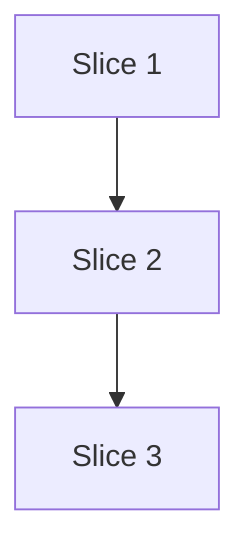

# Plan: Fix defects #777 and #778 (items 2 & 3)

**Created**: 2026-07-03
**Branch**: claude/defects-777-778-pq6vo7
**Status**: in-progress

## Goal

Fix three documentation defects surfaced by a live `/ship` run: (1) shipped skill/agent
docs still invoke Python scripts with `bash` after the .sh→.py migration (#777), causing
every invocation to fail and require manual `python3` retry; (2) `/plan`'s tier
classification wording over-triggers `complex` because it treats *stating the
`/ship`-required default stance* the same as *taking an unusual stance*, defeating the
tier system's own review-scaling goal (#778 item 2); (3) `/plan` step 5b tells the
orchestrator to pass a resolved **model id** as the `Agent` tool's `model` override, but
that param only accepts tier names (`sonnet|opus|haiku|fable`), so the instruction is
silently unfollowable as written (#778 item 3). #778 item 1 is the same defect as #777
and is not double-fixed here.

## Acceptance Criteria

- [ ] No shipped skill or agent doc (`plugins/dev-team/skills/**/SKILL.md`,
      `plugins/dev-team/agents/**/*.md`) invokes a `.py` script with a `bash` prefix.
- [ ] A regression test fails if a future PR reintroduces `bash ... foo.py` in a shipped
      skill/agent doc.
- [x] `skills/plan/SKILL.md` step 5a's `complex` tier trigger no longer fires solely
      because a plan states the default stance required by `/ship`'s gate — it fires
      only for a *non-default* or *contested* stance.
- [x] `skills/plan/SKILL.md` step 5b documents the id→tier mapping so the orchestrator
      has an explicit, followable rule instead of a silent mismatch when dispatching
      plan-review personas via the `Agent` tool.

## Slices

### Slice 1: Fix bash-invokes-python defects + regression test (#777)

**Depends-on:** none
**Files:** `plugins/dev-team/skills/plan/SKILL.md`, `plugins/dev-team/skills/code-review/SKILL.md`, `plugins/dev-team/skills/build/SKILL.md`, `plugins/dev-team/skills/issues-from-plan/SKILL.md`, `plugins/dev-team/agents/orchestrator.md`, `tests/repo/test_bash_invokes_python_docs.py`

**Behavior:**

```gherkin
Feature: Shipped docs invoke Python scripts with python3, not bash

  Scenario: Regression test scans shipped skill and agent docs
    Given the plugin's skills/ and agents/ directories
    When the doc-scan test runs
    Then no line in a shipped .md file invokes a ".py" script with a "bash" prefix

  Scenario: A fixed doc snippet is copy-pasteable and runs correctly
    Given a code fence in skills/plan/SKILL.md that previously read
      "bash ${CLAUDE_PLUGIN_ROOT}/scripts/plan_waves.py <plan-file>"
    When an operator copies and runs the snippet verbatim
    Then it invokes python3, not bash, and the script runs without a shell parse error

  Scenario: Correctly-invoked scripts are not flagged
    Given a shipped doc line "python3 ${CLAUDE_PLUGIN_ROOT}/scripts/plan_waves.py <plan-file>"
    And a shipped doc line "bash ${CLAUDE_PLUGIN_ROOT}/install.sh" (a genuine .sh script)
    When the doc-scan test runs
    Then neither line is reported as a violation

  Scenario: Scanner detects a synthetically reintroduced violation
    Given a temporary fixture .md file under the scanned tree containing
      "bash ${CLAUDE_PLUGIN_ROOT}/scripts/whatever.py"
    When the doc-scan test's detector function runs against that fixture
    Then it reports the fixture file:line as a violation
```

**Steps:**

#### Step 1.1: Add regression test for bash-invokes-python in shipped docs

**Complexity**: standard
**RED**: Add `tests/repo/test_bash_invokes_python_docs.py` (repo-root `tests/repo/`,
matching the location and `REPO_ROOT = Path(__file__).resolve().parents[2]` convention of
the sibling doc-drift guard `tests/repo/test_bash_removal_stale_sh_refs.py`, which this
test's docstring cross-references — same ADR 0014/0015 bash-removal doc-drift concern,
different shape: a generic regex scan rather than an itemized `StaleRef` table, so it
catches any future occurrence rather than only hand-listed ones). It walks
`plugins/dev-team/skills/**/SKILL.md` and `plugins/dev-team/agents/**/*.md`, regex-matches
`bash\s+\S*\.py\b` per line, and asserts no matches (failure lists file:line). Also add:
(a) a case asserting a `python3 ...foo.py` line and a `bash ...install.sh` line are both
*not* flagged (true-negative coverage), and (b) a case that runs the detector function
directly against a `tmp_path` fixture file containing a synthetic violation and asserts
it is caught (proves the regex itself works, independent of today's known matches). Run
the suite — the "no matches" test must fail against the current tree (7 known matches
across 4 files); the true-negative and fixture-detection cases must pass immediately.
**GREEN**: (the "no matches" test stays RED until the docs are fixed in Step 1.2)
**REFACTOR**: None needed.
**Files**: `tests/repo/test_bash_invokes_python_docs.py`
**Commit**: `test: add regression guard for bash-invoked python in shipped docs (#777)`

#### Step 1.2: Fix the 7 bash-invokes-python occurrences

**Complexity**: trivial
**RED**: (inherited from Step 1.1 — test still failing)
**GREEN**: Replace `bash ${CLAUDE_PLUGIN_ROOT}/...py` with `python3 ${CLAUDE_PLUGIN_ROOT}/...py`
(and the equivalent literal form) at:
  - `skills/plan/SKILL.md:78` (`scripts/plan_waves.py`)
  - `skills/plan/SKILL.md:109` (`hooks/lib/model_resolve.py`)
  - `skills/plan/SKILL.md:142` (`scripts/git_origin_host.py`)
  - `skills/code-review/SKILL.md:266` (`hooks/lib/review_gate_hash.py`)
  - `skills/build/SKILL.md:91` (`scripts/build_worktree_baseref.py`)
  - `skills/issues-from-plan/SKILL.md:43` (`scripts/issue_deps.py`)
  - `agents/orchestrator.md:173` (`hooks/lib/build_knowledge_index.py --check`)
  Run the regression test from Step 1.1 — it must pass.
**REFACTOR**: None needed.
**Files**: `plugins/dev-team/skills/plan/SKILL.md`, `plugins/dev-team/skills/code-review/SKILL.md`, `plugins/dev-team/skills/build/SKILL.md`, `plugins/dev-team/skills/issues-from-plan/SKILL.md`, `plugins/dev-team/agents/orchestrator.md`
**Commit**: `fix: invoke shipped python scripts with python3, not bash (#777)`

### Slice 2: Tighten `/plan` tier-classification wording (#778 item 2)

**Depends-on:** 1
**Files:** `plugins/dev-team/skills/plan/SKILL.md`

**Behavior:**

```gherkin
Feature: Plan tier classification does not over-trigger on the required default stance

  Scenario: A plan stating only the /ship-required default stance
    Given a plan with 1 slice, no "complex" step, and an "Integration: auto-merge vs.
      direct-to-trunk" stance of "open a PR and use auto-merge gated on green checks"
      (the documented default in knowledge/decision-defaults.md)
    When the plan tier is classified per skills/plan/SKILL.md step 5a
    Then the plan does not classify as "complex" on the decision-axis signal alone

  Scenario: A plan taking a non-default stance
    Given a plan whose "Integration" stance is "merge directly to trunk, bypassing the
      PR gate" (diverging from the documented default)
    When the plan tier is classified
    Then the decision-axis signal contributes to a "complex" classification

  Scenario: A plan whose default stance was contested at the /ship gate
    Given a plan stating the default Integration stance, and a recorded objection to
      that stance in the plan's "## Risks & Open Questions" section from the /ship gate
    When the plan tier is classified
    Then the decision-axis signal contributes to a "complex" classification
```

**Steps:**

#### Step 2.1: Reword the `complex` tier decision-axis trigger

**Complexity**: trivial
**RED**: No automated test exists for this skill-doc prose (an LLM-consumed policy
statement, not executable code) — verification is manual re-read against the three
Gherkin scenarios above.
**GREEN**: In `skills/plan/SKILL.md` step 5a's tier table (the `complex` row), change
the decision-axis trigger from "a stance on a high-reversal-cost decision axis" to "a
**non-default** stance on a high-reversal-cost decision axis, or the axis was
**contested** at the `/ship` gate" — matching the fix suggested in #778. Add one sentence
clarifying that merely stating the default stance `/ship` already requires does not, by
itself, count as a `complex` signal, and that "contested" means a recorded objection in
the plan's `## Risks & Open Questions` section, not an unrecorded verbal disagreement.
Add a one-row worked example directly under the tier table using the "Integration:
auto-merge vs. direct-to-trunk" axis from `knowledge/decision-defaults.md` (default
stance → does not trigger `complex`; non-default stance → triggers `complex`) so the
rule has a concrete instance a reviewer can check by inspection, not just abstract prose.
**REFACTOR**: None needed.
**Files**: `plugins/dev-team/skills/plan/SKILL.md`
**Commit**: `fix: tier classification no longer over-triggers on the /ship-required default stance (#778)`

### Slice 3: Document id→tier mapping for plan-review persona dispatch (#778 item 3)

**Depends-on:** 2
**Files:** `plugins/dev-team/skills/plan/SKILL.md`

**Behavior:**

```gherkin
Feature: Plan-review persona dispatch has a followable model-routing rule

  Scenario: Orchestrator resolves a model id for persona dispatch
    Given model_resolve.py returns a concrete model id (e.g. "claude-sonnet-4-6")
    When the orchestrator dispatches a plan-review persona via the Agent tool
    Then skills/plan/SKILL.md states the explicit id→tier mapping rule to use for the
      "model" override, so no step is silently unfollowable

  Scenario: Resolved id matches no known tier substring
    Given model_resolve.py returns an id containing none of "sonnet", "opus", "haiku",
      or "fable" (e.g. a future, unrecognized model family name)
    When the orchestrator maps the id to a tier for dispatch
    Then skills/plan/SKILL.md states an explicit fallback tier to use, and that the
      mismatch is noted rather than passed through as an unrecognized string
```

**Steps:**

#### Step 3.1: Document the id→tier mapping rule at the dispatch site

**Complexity**: trivial
**RED**: No automated test exists for this skill-doc prose — verification is manual
re-read against the two Gherkin scenarios above.
**GREEN**: In `skills/plan/SKILL.md` step 5b, replace "Pass the resolved model id as the
`model` override on each persona dispatch" with explicit guidance: the `Agent` tool's
`model` param only accepts tier names (`sonnet|opus|haiku|fable`); map the resolved
model id to the nearest tier by name substring (`*sonnet*` → `sonnet`, `*opus*` →
`opus`, `*haiku*` → `haiku`, `*fable*` → `fable`), falling back to `sonnet` and noting
the mismatch in the dispatch output if the id matches none of the four substrings, and
pass the resulting tier name as the override. State that this mapping is a known
precision loss versus the ladder's exact id, and that per-environment ladder overrides
still influence which model backs each tier at Anthropic's end, even though the tier
name is what crosses the dispatch boundary.
**REFACTOR**: None needed.
**Files**: `plugins/dev-team/skills/plan/SKILL.md`
**Commit**: `docs: document model id-to-tier mapping for plan-review persona dispatch (#778)`

## Parallelization



| Wave | Slices (parallel) |
|------|-------------------|
| 1 | 1 |
| 2 | 2 |
| 3 | 3 |

## Complexity Classification

| Rating | Criteria | Review depth |
|--------|----------|--------------|
| `trivial` | Single-file rename, config change, typo fix, documentation-only | Skip inline review; covered by final `/code-review` |
| `standard` | New function, test, module, or behavioral change within existing patterns | Spec-compliance + relevant quality agents |
| `complex` | Architectural change, security-sensitive, cross-cutting concern, new abstraction | Full agent suite including opus-tier agents |

## Pre-PR Quality Gate

- [ ] All tests pass
- [ ] Type check passes (if applicable)
- [ ] Linter passes
- [ ] `/code-review` passes
- [ ] Documentation updated (if applicable)

## Skipped (low value)

None.

## Approval

Auto-approved (non-interactive) at 2026-07-03 — no human review gate. Trigger: this
plan was authored and reviewed within an automated GitHub-issue-driven `/build`
invocation (no usable TTY). All dispatched plan-review personas returned `approve`.

## Risks & Open Questions

- Slices 2 and 3 are prose-only skill-doc edits with no automated test target; correctness
  relies on manual re-read against the acceptance criteria and the human/`/code-review`
  gate rather than a RED/GREEN cycle.
- Slice 3's id→tier substring-mapping rule is a documented heuristic, not a code change to
  `model_resolve.py` — a future `--tier` output mode (suggested as an alternative fix in
  #778) is out of scope for this defect-fix plan.

## Build Progress

### Slices (grouped by wave)

#### Wave 1
- [x] Slice 1: Fix bash-invokes-python defects + regression test (#777)
  - [x] Step 1.1: Add regression test for bash-invokes-python in shipped docs
  - [x] Step 1.2: Fix the 7 bash-invokes-python occurrences

#### Wave 2
- [x] Slice 2: Tighten `/plan` tier-classification wording (#778 item 2)
  - [x] Step 2.1: Reword the `complex` tier decision-axis trigger

#### Wave 3
- [x] Slice 3: Document id→tier mapping for plan-review persona dispatch (#778 item 3)
  - [x] Step 3.1: Document the id→tier mapping rule at the dispatch site

### Acceptance Criteria

- [x] No shipped skill or agent doc invokes a `.py` script with a `bash` prefix.
- [x] A regression test fails if a future PR reintroduces `bash ... foo.py` in a shipped skill/agent doc.
- [x] `skills/plan/SKILL.md` step 5a's `complex` tier trigger no longer fires solely because a plan states the default stance required by `/ship`'s gate.
- [x] `skills/plan/SKILL.md` step 5b documents the id→tier mapping so the orchestrator has an explicit, followable rule.

## Plan Review Summary

Plan tier: **standard** (self-classified up from the literal ">1 wave → complex" table
rule, since the 3-wave structure here is a same-file sequential-dependency artifact
across two trivial prose slices, not genuine cross-cutting complexity — "when in doubt,
classify up" was judged not to require the full 5-reviewer ceremony this fix itself is
about avoiding). Reviewers dispatched: Acceptance Test Critic (always runs) + Design &
Architecture Critic + Parallelization Critic (slice count > 1). UX Critic skipped — no
user-facing/UI surface. Strategic Critic skipped — standard tier.

- **Acceptance Test Critic**: `needs-revision` → revised → **approve**. First pass
  flagged blockers (Slice 1 test lacked true-negative/self-check coverage; Slices 2/3
  Gherkin were abstract with an undefined "contested" trigger; Slice 3 lacked a
  fallback-id scenario). All resolved. Remaining warnings (not blocking): the "runs
  without a shell parse error" scenario clause isn't executed by any step, and the
  bash-invokes-python regex doesn't also catch `sh`/dot-source variants — both accepted
  as out of scope for this defect-fix plan.
- **Design & Architecture Critic**: **approve**. Warned that the new regression test's
  original location (`plugins/dev-team/tests/repo/`) diverged from the established
  repo-root `tests/repo/` convention used by the directly analogous
  `test_bash_removal_stale_sh_refs.py` — fixed by moving Step 1.1's test to
  `tests/repo/test_bash_invokes_python_docs.py` with a cross-referencing docstring
  rather than merging mechanisms into the existing file.
- **Parallelization Critic**: **approve**. Fully sequential (3 waves × 1 slice each,
  zero `plan_waves.py` collisions) — nothing to validate; approves trivially per its own
  rule 6.
