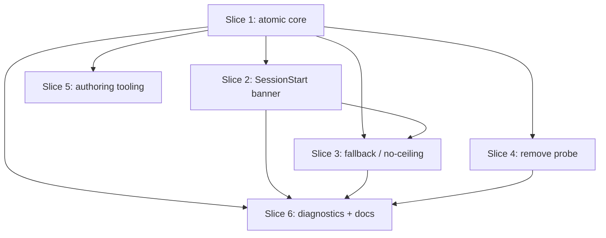

# Plan: Effort-based model routing

**Created**: 2026-06-21
**Branch**: feat/model-complexity-routing
**Status**: approved
**Spec**: [`docs/specs/model-complexity-routing.md`](../docs/specs/model-complexity-routing.md) · **ADR**: [0008](../docs/adr/0008-use-effort-bands-instead-of-model-names-in-agent-frontmatter.md) · **Epic**: #328

## Goal

Replace the vendor-named `model: haiku|sonnet|opus` tier alias in agent frontmatter with a vendor-neutral `effort: low|medium|high` band. An agent declares the reasoning effort its task needs; the PreToolUse hook looks the agent up by `subagent_type`, reads its `effort` band, and maps it to a concrete model — via the **shipped default map** by default, or a **per-environment ladder** (`.claude/model-ladder.json`) when one is present — which it writes to `updatedInput.model`. **The shipped default map equals today's `haiku/sonnet/opus` mapping, so zero-config behavior is unchanged by the migration.** The model the user selected at session start is the fallback when a band cannot be mapped and the reference for flagging upgrades — never a ceiling. The `/v1/models` probe is removed; availability comes from the ladder. Ships as `feat!` with one deprecation release of legacy-tier acceptance.

## Field name decision

The frontmatter key is **`effort`** (matching ADR 0008, the already-written gate test, and Claude Code's reasoning-effort vocabulary). The source spec still says `complexity:` — that is **stale** and is reconciled to `effort:` in Slice 6. A guard test forbids the `complexity:` frontmatter key so the two never diverge again.

## Configuration model

The effort→model map has two layers; **the default layer reproduces today's mapping exactly**, so a user who does nothing sees no behavior change.

1. **Shipped default map** — `knowledge/model-routing.json`, committed, re-keyed band→snapshot:
   `{ "low": "claude-haiku-4-5-20251001", "medium": "claude-sonnet-4-6", "high": "claude-opus-4-8" }`
   (plus legacy `haiku/sonnet/opus` keys retained for the deprecation window). This is the current mapping. It resolves whenever there is no ladder override.
2. **Per-environment ladder** — `.claude/model-ladder.json` (optional, gitignored): an ordered, capability-ascending list of the models that environment has. When present and valid, it **overrides** the default map: effort → `round_half_up(weight·(N−1))` position.

**Resolution precedence:** valid ladder → shipped default map → session-model fallback (only for an unmappable band or an explicit out-of-ladder snapshot). A **malformed** ladder degrades to the shipped default map (not to a no-op), and never aborts dispatch.

**Always writes the model.** Because migrated agents carry `effort:` and no `model:`, the harness has nothing to dispatch with, so the hook always sets `updatedInput.model`. A **bump** is logged only when the resolved model differs from the shipped default for that band (a ladder or fallback changed it) — not on every dispatch.

**Migration guarantee:** with no ladder file, every band resolves to the identical snapshot it did before the rename. Pinned by AC0.

**Authoring the ladder:** hand-write `.claude/model-ladder.json` against the documented schema; `/model-routing-check` prints the effective map and, when no ladder exists, a ready-to-edit starter ladder seeded from the shipped defaults.

## How an effort band reaches dispatch (load-bearing data flow)

This is the seam the whole feature rests on, so it is pinned here:

1. The harness dispatches `Agent(subagent_type: X, …)`. The PreToolUse `Agent` hook (`agent-model-resolve.sh`) receives `tool_input` with `subagent_type` (and, for legacy/downstream agents, possibly `model`).
2. The hook resolves the agent file at `<plugin>/agents/X.md`, reads its `effort:` band from frontmatter. **Name derivation:** `subagent_type` may arrive plugin-qualified (`dev-team:security-review`); strip the `<plugin>:` prefix before mapping to a filename. If no file matches (unknown/renamed type), fail open (pass-through) — never block dispatch.
3. It resolves the band → model via the ladder (resolver lib) and emits `hookSpecificOutput.updatedInput.model = <resolved>`.
4. **Legacy path:** if the agent file declares no `effort` but `tool_input.model` is a tier name (`haiku|sonnet|opus`), the hook maps that tier → band and resolves it, emitting a deprecation marker. This keeps downstream `model:` agents working for one release.
5. The harness's own default subagent model is irrelevant — the hook always sets `updatedInput.model`, so renaming away from `model:` cannot silently strand a dispatch.

The hook's old hardcoded `haiku|sonnet|opus` matcher gate is replaced by "resolve the agent's effort (or legacy tier)".

## Approach stances (high-reversal-cost axes)

- **Replace vs. merge:** **Replace.** `model:` → `effort:`; the `tier_aliases` cascade and the probe are removed. Legacy tier names survive only as a read-time resolver courtesy for one release.
- **Evolution — migrate vs. stub:** **Migrate.** All 33 agents + 10 templates move to `effort:`; no forwarding stubs.
- **Integration — auto-merge vs. direct:** **PR, human merge required** (touches agents/hooks/skills/manifests, not docs-only). `feat!` → major bump.
- **Scope:** The six slices below. Out of scope: pricing/cost-report references to model names (data, not the routing contract).

## Acceptance Criteria

- [ ] AC0 (migration safety): With no `.claude/model-ladder.json`, every effort band resolves to the **exact same snapshot** as the corresponding tier did before the rename (`low→claude-haiku-4-5-20251001`, `medium→claude-sonnet-4-6`, `high→claude-opus-4-8`). A test asserts this snapshot-for-snapshot equivalence.
- [ ] AC1: Every shipped agent and template declares a valid `effort:` band (count verified: 33 agents + 10 templates); no `model:` tier alias and no `complexity:` key remain in shipped agents/templates; `agent_effort_frontmatter_tests.bats` is green.
- [ ] AC2: The hook resolves an agent's `effort` band (looked up by `subagent_type`) to a model. With **no ladder file**, resolution uses the shipped default map (= current mapping). With a **valid ladder**, it maps via `index = round_half_up(weight·(N−1))`, with the spec worked-examples table (N=1,2,3,4) as the binary contract. A **malformed ladder** degrades to the shipped default map and never aborts dispatch.
- [ ] AC3: Legacy `model: haiku|sonnet|opus` agents still resolve (tier→band) for this release and emit a deprecation marker `/agent-audit` surfaces as a warning; release N **warns, never errors** (erroring is deferred to N+1).
- [ ] AC4: A single SessionStart hook captures the session model, persists it (gitignored), and emits a banner enumerating the band→model table, flagging any band above the session model. Degenerate cases are communicative: no-ladder → the shipped default map (low→haiku, medium→sonnet, high→opus) with the ladder path as the override hint; N=1 → single collapsed line; session-at-top → no upgrade flags. Absent session model: reuse last persisted value if present; otherwise emit a one-line note that the session model is unknown so upgrade flags and session fallback are unavailable this session (effort routing still applies via the default map/ladder). The retired `overrides-banner.sh` is removed (no second SessionStart hook).
- [ ] AC5: The hook always writes `updatedInput.model` for an effort-bearing agent (the harness has no `model:` to fall back on). When a band cannot be mapped at all (e.g. an explicit out-of-ladder snapshot), dispatch falls back to the session model; a `high` agent runs above a lower session model (no ceiling). Per-dispatch resolution emits **no user-visible message**; a JSONL line is appended to `.claude/metrics/model-routing.log` **only when the resolved model differs from the shipped default for that band** (ladder override, upgrade, or downgrade). A resolution that equals the shipped default writes the model but logs no bump.
- [ ] AC6: `hooks/lib/model-probe.sh` and all probe tests (`tests/hooks/model_probe_tests.bats`, `tests/commands/init_dev_team_probe_tests.bats`, the curl shim) are deleted; `/init-dev-team` (SKILL + `init-dev-team-linux.sh`) no longer reference the probe.
- [ ] AC7: `/agent-create`, `/agent-add`, `/agent-audit` use the `effort` vocabulary, reject invalid bands, and map a recognized legacy token in the rejection message (e.g. "frontier → high").
- [ ] AC8: `/model-routing-check`, `docs/model-routing.md`, the orchestrator Resolution Procedure, root `CLAUDE.md`, and the **spec** reflect the ladder/effort model; a stale-reference guard (explicit pattern + allowlist) passes; `.gitignore` ignores `.claude/model-ladder.json` and `.claude/session-model` and drops the retired `model-overrides.json` entry.

## Slices

### Slice 1: Atomic core — effort contract, resolver/ladder, dispatch data flow

**Depends-on:** none
**Files:** `plugins/dev-team/agents/*.md`, `plugins/dev-team/templates/agents/*.md`, `plugins/dev-team/hooks/lib/model-resolve.sh`, `plugins/dev-team/hooks/agent-model-resolve.sh`, `plugins/dev-team/knowledge/model-routing.json`, `.gitignore`, `tests/agents/agent_effort_frontmatter_tests.bats`, `tests/hooks/model_resolve_tests.bats`, `tests/hooks/agent_model_resolve_hook_tests.bats`

> Frontmatter migration and resolver land **together** — separating them opens a window where a migrated `effort: high` agent has no resolver support (legacy acceptance maps tiers, not bands). This is one slice by design.

**Behavior:**

```gherkin
Feature: Agents declare effort; the hook resolves it against the ladder

  Scenario: Every shipped agent declares a valid effort band
    Given the set of all shipped agent and template files
    Then every file declares "effort" as one of low, medium, high
    And no file declares a "model" tier alias or a "complexity" key
    And the count of agent files matches the expected roster

  Scenario: The contract test fails on a missing or invalid band
    Given an agent file with no "effort" field, or "effort: mid"
    When the effort-frontmatter gate runs
    Then it fails and names the offending file and value

  Scenario: A high effort band resolves to the top of a three-model ladder
    Given a ladder of three models ordered low-to-high
    And an agent whose effort is "high"
    When that agent is dispatched
    Then the hook rewrites the dispatch model to the top ladder model

  Scenario: Medium rounds half-up on a four-model ladder
    Given a ladder of four models
    And an agent whose effort is "medium"
    When that agent is dispatched
    Then the resolved model is the third model (index 2)

  Scenario: Medium collapses to the top of a two-model ladder
    Given a ladder of two models
    And an agent whose effort is "medium"
    When that agent is dispatched
    Then the resolved model is the second (top) model

  Scenario: A single-model ladder serves every band
    Given a ladder of one model
    When agents of effort low, medium, and high are dispatched
    Then each resolves to that single model

  Scenario: No ladder uses the shipped default map (current mapping preserved)
    Given no ladder file is present
    When agents of effort low, medium, and high are dispatched
    Then each resolves to the shipped default snapshot for its band
    And those snapshots equal the pre-migration haiku, sonnet, and opus models

  Scenario: A malformed ladder degrades to the shipped default map
    Given a ladder file that is not valid JSON
    When an agent is dispatched
    Then the hook resolves via the shipped default map and does not abort the dispatch

  Scenario: A legacy model-tier agent still resolves
    Given a downstream agent whose frontmatter declares "model: sonnet"
    And a three-model ladder
    When it is dispatched
    Then the hook resolves it as effort "medium"
    And emits a deprecation marker the audit can read

  Scenario: A default-mapped dispatch sets the model but logs no bump
    Given no ladder override, so the resolved model equals the band's shipped default
    When the agent is dispatched
    Then the hook sets updatedInput.model to that default snapshot
    And appends no bump line

  Scenario: A plugin-qualified subagent_type resolves to its agent file
    Given a dispatch whose subagent_type is "dev-team:security-review"
    When the hook resolves the agent
    Then it reads the effort band from the security-review agent file

  Scenario: An unknown subagent_type fails open
    Given a dispatch whose subagent_type maps to no agent file
    When the hook runs
    Then it makes no substitution and does not block the dispatch
```

**Steps:**

#### Step 1.1: Lock the contract test (missing + invalid + count)

**Complexity**: standard
**RED**: `agent_effort_frontmatter_tests.bats` fails on the current `model:` tree; extend it to assert the expected file count and to reject a `complexity:` key as well as `model:`.
**GREEN**: No production code — confirm RED.
**REFACTOR**: None needed.
**Files**: `tests/agents/agent_effort_frontmatter_tests.bats`
**Commit**: `test(agents): gate every agent on a valid effort: band`

#### Step 1.2: Migrate all agents and templates

**Complexity**: standard
**RED**: Gate from 1.1 red; add a RED case asserting `test-modernization-review` resolves to `low` (documenting `mid→low`: the file was a typo for the lowest review tier, not "medium").
**GREEN**: Rewrite frontmatter in 33 agents + 10 templates (`haiku→low`, `sonnet→medium`, `opus→high`); fix the broken `mid`. Gate green.
**REFACTOR**: Confirm zero residual `^model:`/`^complexity:` lines.
**Files**: `plugins/dev-team/agents/*.md`, `plugins/dev-team/templates/agents/*.md`
**Commit**: `feat(agents)!: declare effort bands instead of model tiers`

#### Step 1.3: Re-key routing defaults; pin rounding convention

**Complexity**: standard
**RED**: Test that `model-routing.json` exposes `low/medium/high` defaults and retains legacy tier keys; test the documented rounding (`round_half_up`).
**GREEN**: Re-key `model-routing.json` (bands + legacy keys for the window).
**REFACTOR**: None needed.
**Files**: `plugins/dev-team/knowledge/model-routing.json`, `tests/knowledge/model_routing_defaults.bats`
**Commit**: `feat(routing): key model defaults by effort band`

#### Step 1.4: Effort band → ladder position in the resolver

**Complexity**: complex
**RED**: Resolver tests for: **no-ladder → shipped default map** (AC0: low/medium/high resolve to the exact pre-migration haiku/sonnet/opus snapshots); ladder present → high→top, low→bottom, medium half-up (N=2,3,4), N=1-serves-all; malformed-ladder → degrades to default map (uses `MODEL_*_JSON` seams).
**GREEN**: Add the ladder path — `index = round_half_up(weight·(N−1))` reading `.claude/model-ladder.json` — layered **over** the default-map lookup (default map when no/invalid ladder). Replace the `tier_aliases` cascade. State the post-change resolver contract: deny (exit 3) is no longer reachable for band resolution; only exit 4 (missing `model-routing.json`) survives. Remove the now-dead cascade/cycle code.
**REFACTOR**: Delete dead deny/cycle branches; update the exit-code taxonomy comment.
**Files**: `plugins/dev-team/hooks/lib/model-resolve.sh`, `tests/hooks/model_resolve_tests.bats`
**Commit**: `feat(routing)!: resolve effort bands via default map, ladder override`

#### Step 1.5: Hook looks up effort by subagent_type; legacy tier fallback

**Complexity**: complex
**RED**: Hook-level tests: an `effort: high` agent (no `model` in tool_input) with no ladder → `updatedInput.model` = the shipped default (opus snapshot), no bump logged; the same agent with a ladder that changes the result → `updatedInput.model` = ladder model + **exactly one** bump line; a legacy `model: sonnet` dispatch → medium + deprecation marker; a plugin-qualified `subagent_type` (`dev-team:security-review`) resolves to the right file; an unknown `subagent_type` fails open (pass-through); a missing `model-routing.json` (resolver exit 4) → **pass-through, not deny** (fail-open posture).
**GREEN**: Replace the hardcoded matcher allowlist with: strip any `<plugin>:` prefix from `subagent_type`, read `agents/<name>.md` effort band, resolve via the resolver (default map or ladder), and **always set `updatedInput.model`**; else fall back to the legacy `tool_input.model` tier; unreadable/unknown agent → pass-through. **Bump logging owns one site:** the hook compares the resolved model to the band's shipped default and appends exactly one JSONL line iff they differ — the resolver no longer logs bumps (that path is removed with the cascade in 1.4), so there is no double-log. Remove the hook's now-unreachable `deny` branch; map the surviving exit 4 to pass-through.
**REFACTOR**: None needed.
**Files**: `plugins/dev-team/hooks/agent-model-resolve.sh`, `tests/hooks/agent_model_resolve_hook_tests.bats`
**Commit**: `feat(routing)!: resolve agent effort by subagent_type at dispatch`

#### Step 1.6: Gitignore the ladder; retire overrides

**Complexity**: trivial
**RED**: Test asserts `.gitignore` ignores `.claude/model-ladder.json` and no longer needs the `model-overrides.json` entry for this feature.
**GREEN**: Update `.gitignore`.
**REFACTOR**: None needed.
**Files**: `.gitignore`, `tests/repo/*`
**Commit**: `chore(routing): gitignore the model ladder`

### Slice 2: SessionStart banner — capture session model, replace overrides-banner.sh

**Depends-on:** 1
**Files:** `plugins/dev-team/hooks/session-model-banner.sh` (renamed from/replacing `overrides-banner.sh`), `plugins/dev-team/settings.json`, `.gitignore`, `tests/hooks/session_model_banner_tests.bats`

> There is already a SessionStart hook (`overrides-banner.sh`) wired to the retired overrides file. This slice **replaces** it — one SessionStart hook owns the routing banner, not two.

**Behavior:**

```gherkin
Feature: Announce model routing once at session start

  Scenario: Capture and persist the session model
    Given a clean state with no persisted session model
    And a SessionStart payload naming the session model
    When the hook runs
    Then the session model is persisted for later dispatch resolution

  Scenario: Banner lists the band→model table and flags upgrades
    Given a session model below the top of the ladder
    When the hook runs
    Then the banner lists each band's resolved model
    And flags any band whose model is above the session model

  Scenario: Session at the top of the ladder shows no upgrade flags
    Given a session model equal to the top of the ladder
    When the hook runs
    Then no band is flagged as above the session model

  Scenario: Single-model environment collapses the banner
    Given a ladder of one model
    When the hook runs
    Then the banner is a single line noting all bands map to that model

  Scenario: No ladder shows the shipped default map
    Given no ladder file
    When the hook runs
    Then the banner lists the default band→model map (low→haiku, medium→sonnet, high→opus)
    And notes the ladder file path as the way to override it

  Scenario: Absent model with a persisted value reuses it
    Given a previously persisted session model
    And a SessionStart payload with no model field
    When the hook runs
    Then the banner renders using the persisted model

  Scenario: Absent model with nothing persisted is explained
    Given no persisted session model
    And a SessionStart payload with no model field
    When the hook runs
    Then it emits a one-line note that the session model is unknown, so upgrade flags and session fallback are unavailable this session (effort routing still applies via the default map)
    And does not error
```

**Steps:**

#### Step 2.1: Replace overrides-banner.sh; capture + persist the session model

**Complexity**: standard
**RED**: Test feeds SessionStart JSON with `model`; asserts persisted value and that `overrides-banner.sh` no longer exists / is renamed in `settings.json`.
**GREEN**: Rename/replace the hook; read stdin `model`, write `.claude/session-model`; update `settings.json` registration.
**REFACTOR**: None needed.
**Files**: `plugins/dev-team/hooks/session-model-banner.sh`, `plugins/dev-team/settings.json`, `tests/hooks/session_model_banner_tests.bats`
**Commit**: `feat(routing): capture the session model and retire the overrides banner`

#### Step 2.2: Render the banner incl. degenerate + absent-model cases

**Complexity**: complex
**RED**: Tests for upgrade flag, session-at-top (no flags), N=1 collapse, no-ladder default-map line (+ ladder-path hint), absent-model-with-persisted (reuse), absent-model-nothing-persisted (explanatory + no error).
**GREEN**: Compute the table from ladder + defaults; emit `systemMessage`; handle every empty/degenerate case communicatively.
**REFACTOR**: Extract table rendering into a helper.
**Files**: `plugins/dev-team/hooks/session-model-banner.sh`, `tests/hooks/session_model_banner_tests.bats`
**Commit**: `feat(routing): announce band→model routing at session start`

#### Step 2.3: Gitignore the persisted session model

**Complexity**: trivial
**RED**: Test asserts `.gitignore` ignores `.claude/session-model`.
**GREEN**: Add the entry.
**REFACTOR**: None needed.
**Files**: `.gitignore`, `tests/repo/*`
**Commit**: `chore(routing): gitignore the persisted session model`

### Slice 3: Session-model fallback, no ceiling, silent-but-logged

**Depends-on:** 1, 2
**Files:** `plugins/dev-team/hooks/agent-model-resolve.sh`, `plugins/dev-team/hooks/lib/model-resolve.sh`, `tests/hooks/agent_model_resolve_hook_tests.bats`

**Behavior:**

```gherkin
Feature: Fall back to the session model, never cap at it, log silently

  Scenario: With no ladder, a band resolves to the default map (not the session model)
    Given no ladder file and a known persisted session model
    When an agent is dispatched
    Then it resolves to the shipped default snapshot for its band
    And it does not resolve to the session model

  Scenario: An explicit snapshot absent from the ladder falls back to the session model
    Given a ladder that does not contain an agent's explicit model
    When that agent is dispatched
    Then it resolves to the session model

  Scenario: A high agent runs above a lower session model
    Given the session started on the middle model
    And a ladder whose top model is more capable
    When a high-effort agent is dispatched
    Then it resolves to the top model, not the session model

  Scenario: Upgrades and downgrades are logged, dispatch is silent
    Given a dispatch whose resolved model differs from the requested band default
    When the agent is dispatched
    Then no user-visible message is emitted for the dispatch
    And exactly one JSONL line is appended to the bump log with agent, band, session model, and resolved model
```

**Steps:**

#### Step 3.1: Session-model fallback for unmappable bands/snapshots

**Complexity**: complex
**RED**: Tests that no-ladder resolves to the **default map** (not the session model); that an explicit out-of-ladder snapshot → session model; using a stub `.claude/session-model` and a fresh temp bump log per test.
**GREEN**: Resolver/hook reads `.claude/session-model` and substitutes **only** when band mapping yields nothing (explicit out-of-ladder snapshot) — never for the no-ladder case, which uses the default map.
**REFACTOR**: None needed.
**Files**: `plugins/dev-team/hooks/lib/model-resolve.sh`, `plugins/dev-team/hooks/agent-model-resolve.sh`, `tests/hooks/agent_model_resolve_hook_tests.bats`
**Commit**: `feat(routing): fall back to the session model when a band is unmappable`

#### Step 3.2: No ceiling; silent dispatch; log upgrades and downgrades

**Complexity**: standard
**RED**: Test high→top even when session is lower (no user message), and that both upgrade and downgrade append exactly one JSONL line to the bump-log path.
**GREEN**: Ladder mapping wins over the session model when the band maps; record upgrade and downgrade bumps; ensure no `systemMessage` on dispatch.
**REFACTOR**: None needed.
**Files**: `plugins/dev-team/hooks/lib/model-resolve.sh`, `tests/hooks/agent_model_resolve_hook_tests.bats`
**Commit**: `feat(routing): no session-model ceiling; log routing bumps silently`

### Slice 4: Remove the `/v1/models` probe

**Depends-on:** 1
**Files:** `plugins/dev-team/hooks/lib/model-probe.sh`, `plugins/dev-team/skills/init-dev-team/SKILL.md`, `init-dev-team-linux.sh`, `tests/hooks/model_probe_tests.bats`, `tests/commands/init_dev_team_probe_tests.bats`, `tests/hooks/fake-bin/curl`, `tests/hooks/no_probe_refs_tests.bats`

**Behavior:**

```gherkin
Feature: Availability comes from the ladder, not a network probe

  Scenario: The probe and its tests are gone
    Given the plugin source tree
    When it is inspected for the model probe
    Then no probe script, probe command test, or curl shim exists

  Scenario: init-dev-team no longer probes
    Given the /init-dev-team SKILL and the Linux init script
    When they are inspected
    Then neither references the model probe step
```

**Steps:**

#### Step 4.1: Delete the probe and all its tests

**Complexity**: standard
**RED**: New guard test asserts `model-probe.sh`, `tests/hooks/model_probe_tests.bats`, `tests/commands/init_dev_team_probe_tests.bats`, and the curl shim no longer exist and nothing references them.
**GREEN**: Delete those files.
**REFACTOR**: None needed.
**Files**: `plugins/dev-team/hooks/lib/model-probe.sh` (delete), `tests/hooks/model_probe_tests.bats` (delete), `tests/commands/init_dev_team_probe_tests.bats` (delete), `tests/hooks/fake-bin/curl` (delete), `tests/hooks/no_probe_refs_tests.bats` (new)
**Commit**: `feat(routing)!: remove the /v1/models probe`

#### Step 4.2: Strip the probe step from init flows

**Complexity**: standard
**RED**: Guard asserts neither `init-dev-team/SKILL.md` nor `init-dev-team-linux.sh` mentions the probe.
**GREEN**: Remove Step 4.5 from the SKILL and the probe block from the Linux script.
**REFACTOR**: None needed.
**Files**: `plugins/dev-team/skills/init-dev-team/SKILL.md`, `init-dev-team-linux.sh`, `tests/hooks/no_probe_refs_tests.bats`
**Commit**: `docs(init): drop the model-probe step from init-dev-team`

### Slice 5: Authoring tooling — effort vocabulary

**Depends-on:** 1
**Files:** `plugins/dev-team/skills/agent-create/SKILL.md`, `plugins/dev-team/skills/agent-add/SKILL.md`, `plugins/dev-team/skills/agent-audit/SKILL.md`, `tests/commands/agent_create_effort_tests.bats`, `tests/commands/agent_audit_effort_tests.bats`

**Behavior:**

```gherkin
Feature: Author agents in the effort vocabulary

  Scenario: Creating an agent scaffolds an effort band
    Given a request to create an agent at medium effort
    When the agent file is generated
    Then its frontmatter declares "effort: medium"

  Scenario: An invalid band rejection maps a recognized legacy token
    Given a request to create an agent with effort "frontier"
    When validation runs
    Then it is rejected, lists the valid bands, and maps "frontier → high"

  Scenario: Audit warns on a legacy tier name
    Given an agent file that still declares "model: sonnet"
    When /agent-audit runs
    Then it warns the tier name is deprecated and names the band to use
```

**Steps:**

#### Step 5.1: Switch create/add to effort bands with legacy-aware rejection

**Complexity**: standard
**RED**: Tests assert scaffolded frontmatter is `effort: <band>`, invalid bands rejected, and a recognized legacy token is mapped in the message.
**GREEN**: Replace `--tier small|mid|frontier` / `haiku|sonnet|opus` with `low|medium|high`; add the legacy-token mapping to the rejection.
**REFACTOR**: None needed.
**Files**: `plugins/dev-team/skills/agent-create/SKILL.md`, `plugins/dev-team/skills/agent-add/SKILL.md`, `tests/commands/agent_create_effort_tests.bats`
**Commit**: `feat(agent-create): author agents with effort bands`

#### Step 5.2: Audit enforces bands and warns on legacy tiers

**Complexity**: standard
**RED**: Test `/agent-audit` accepts bands and warns on a legacy `model:` tier.
**GREEN**: Update audit valid-values to the bands; add the deprecation warning.
**REFACTOR**: None needed.
**Files**: `plugins/dev-team/skills/agent-audit/SKILL.md`, `tests/commands/agent_audit_effort_tests.bats`
**Commit**: `feat(agent-audit): validate effort bands, warn on legacy tiers`

### Slice 6: Diagnostics + docs + spec reconcile

**Depends-on:** 1, 2, 3, 4
**Files:** `plugins/dev-team/skills/model-routing-check/SKILL.md`, `plugins/dev-team/docs/model-routing.md`, `plugins/dev-team/agents/orchestrator.md`, `plugins/dev-team/CLAUDE.md` (Model Routing section + the `/init-dev-team` probe blurb in the Skills Registry), `CLAUDE.md` (root), `docs/specs/model-complexity-routing.md`, `tests/commands/model_routing_check_tests.bats`, `tests/repo/routing_stale_refs_tests.bats`

**Behavior:**

```gherkin
Feature: Diagnostics and docs reflect the ladder/effort model

  Scenario: model-routing-check shows ladder, bands, session model, fallbacks
    Given a ladder and a persisted session model
    When /model-routing-check runs
    Then it prints the ladder, the band→model table, the session model, recent bumps, and the ladder file path

  Scenario: Canonical docs agree on the effort key with no stale tier contract
    Given the routing doc, orchestrator procedure, CLAUDE.md, and the spec
    When they are inspected
    Then they describe effort bands and the ladder
    And none uses "complexity:" as the frontmatter key
    And none presents "model: <tier>" as the frontmatter contract (allowlisting legitimate model-id mentions)
```

**Steps:**

#### Step 6.1: Update `/model-routing-check`

**Complexity**: standard
**RED**: Tests assert the diagnostic prints the effective band→model table (default map or ladder), session model, fallback/bump counts, and the ladder path; and that when no ladder exists it prints a ready-to-edit starter ladder seeded from the shipped defaults.
**GREEN**: Update the SKILL and its `--dump-map` usage; add the starter-ladder output for the no-ladder case.
**REFACTOR**: None needed.
**Files**: `plugins/dev-team/skills/model-routing-check/SKILL.md`, `tests/commands/model_routing_check_tests.bats`
**Commit**: `feat(model-routing-check): report effective map, session model, starter ladder`

#### Step 6.2: Reconcile docs + orchestrator + CLAUDE.md + spec

**Complexity**: standard
**RED**: Stale-reference guard (file glob covers root **and** plugin `CLAUDE.md`) with an explicit forbidden pattern (`complexity:` key; `model: haiku|sonnet|opus` presented as the frontmatter contract; the retired `/v1/models` probe blurb) and an allowlist for legitimate model-id mentions (routing.json values, cost-report data).
**GREEN**: Rewrite `docs/model-routing.md`, the orchestrator Resolution Procedure, root + plugin `CLAUDE.md` (Model Routing + the `/init-dev-team` probe mention), reconcile the **spec** (`complexity:` → `effort:` **and** correct its "no ladder → no-op → session model" statement to "no ladder → shipped default map"), and correct **ADR 0008**'s matching consequence line.
**REFACTOR**: None needed.
**Files**: `plugins/dev-team/docs/model-routing.md`, `plugins/dev-team/agents/orchestrator.md`, `plugins/dev-team/CLAUDE.md`, `docs/specs/model-complexity-routing.md`, `docs/adr/0008-use-effort-bands-instead-of-model-names-in-agent-frontmatter.md`, `tests/repo/routing_stale_refs_tests.bats`
**Commit**: `docs(routing): document the effort-band + ladder model; reconcile the spec`

#### Step 6.3: Author the model-routing override guide + README TOC entry

**Complexity**: standard
**RED**: A doc-presence/link test asserts `plugins/dev-team/docs/model-routing-overrides.md` exists, documents the `.claude/model-ladder.json` schema, the resolution precedence (default map → ladder → session fallback), worked ladder examples (restricted endpoint, single-model, Bedrock/Vertex), and the migration guarantee; and that the README Documentation TOC links it.
**GREEN**: Write the override guide (operator-facing: how to create/edit the ladder, validate it with `/model-routing-check`, and what each precedence outcome means). Add its row to the README docs TOC.
**REFACTOR**: None needed.
**Files**: `plugins/dev-team/docs/model-routing-overrides.md` (new), `README.md`, `tests/repo/routing_stale_refs_tests.bats`
**Commit**: `docs(routing): add the model-routing override authoring guide`

## Parallelization

Waves are derived by `scripts/plan-waves.sh` — not hand-maintained.



| Wave | Slices (parallel) |
|------|-------------------|
| 1 | Slice 1 |
| 2 | Slice 2, Slice 4, Slice 5 |
| 3 | Slice 3 |
| 4 | Slice 6 |

`plan-waves.sh` reports **no collisions**. (`.gitignore` is touched by Slice 1 and Slice 2, and `model-resolve.sh`/`agent-model-resolve.sh` by Slice 1 and Slice 3 — all in different waves, sequential.)

## Complexity Classification

Per step. Summary: 4 complex (1.4, 1.5, 2.2, 3.1), 2 trivial (1.6, 2.3), the rest standard.

## Pre-PR Quality Gate

- [ ] All bats suites pass
- [ ] `shellcheck` clean on changed shell scripts
- [ ] `/code-review` passes
- [ ] `scripts/ci-local.sh` green
- [ ] Documentation + spec reconciled (Slice 6)
- [ ] Version bumped as `feat!` (major) with migration note

## Risks & Open Questions

- **Hook reads the agent file at dispatch.** New coupling: the PreToolUse hook now resolves `agents/<subagent_type>.md`. Mitigation: path is derived from the hook dir (as existing hooks do); fail-open if the file is unreadable (pass-through), preserving today's safety posture. Pinned by Step 1.5 tests.
- **Deferred — per-dispatch upgrade warning.** Spec open-decision #2. Plan implements banner-only + silent-logged dispatch; revisit if upgrades surprise users.
- **Deferred — 4th band.** Spec open-decision #3; `round_half_up(weight·(N−1))` documented for N≥4.
- **Downstream break.** `model:` agents migrate to `effort:`; one-release legacy acceptance + `/agent-audit` warning + `feat!` + migration note soften it.

## Build Progress

### Slices (grouped by wave)

#### Wave 1

- [ ] Slice 1: Atomic core — effort contract, resolver/ladder, dispatch data flow
  - [x] Step 1.1: Lock the contract test (missing + invalid + count) — RED gate committed
  - [x] Step 1.2: Migrate all agents and templates
  - [x] Step 1.3: Re-key routing defaults; pin rounding convention
  - [ ] Step 1.4: Effort band → ladder position in the resolver
  - [ ] Step 1.5: Hook looks up effort by subagent_type; legacy tier fallback
  - [ ] Step 1.6: Gitignore the ladder; retire overrides

#### Wave 2

- [ ] Slice 2: SessionStart banner — capture session model, replace overrides-banner.sh
  - [ ] Step 2.1: Replace overrides-banner.sh; capture + persist the session model
  - [ ] Step 2.2: Render the banner incl. degenerate + absent-model cases
  - [ ] Step 2.3: Gitignore the persisted session model
- [ ] Slice 4: Remove the `/v1/models` probe
  - [ ] Step 4.1: Delete the probe and all its tests
  - [ ] Step 4.2: Strip the probe step from init flows
- [ ] Slice 5: Authoring tooling — effort vocabulary
  - [ ] Step 5.1: Switch create/add to effort bands with legacy-aware rejection
  - [ ] Step 5.2: Audit enforces bands and warns on legacy tiers

#### Wave 3

- [ ] Slice 3: Session-model fallback, no ceiling, silent-but-logged
  - [ ] Step 3.1: Session-model fallback for unmappable bands/snapshots
  - [ ] Step 3.2: No ceiling; silent dispatch; log upgrades and downgrades

#### Wave 4

- [ ] Slice 6: Diagnostics + docs + spec reconcile
  - [ ] Step 6.1: Update `/model-routing-check`
  - [ ] Step 6.2: Reconcile docs + orchestrator + CLAUDE.md + spec
  - [ ] Step 6.3: Author the model-routing override guide + README TOC entry

### Acceptance Criteria

- [ ] AC0: no-ladder resolves to the exact pre-migration snapshots (migration safety)
- [ ] AC1: agents/templates on `effort:` (count verified); no `model:`/`complexity:`; gate green
- [ ] AC2: effort→ladder (round_half_up); no-ladder + malformed-ladder safe
- [ ] AC3: legacy tier acceptance + audit warning (warns, never errors this release)
- [ ] AC4: single SessionStart hook; capture + banner; degenerate + absent-model cases; overrides-banner.sh retired
- [ ] AC5: session-model fallback; no ceiling; silent dispatch; upgrade+downgrade logged; clean = pass-through
- [ ] AC6: probe + all probe tests deleted; init flows clean
- [ ] AC7: authoring tooling uses effort; legacy-token-aware rejection
- [ ] AC8: diagnostics + docs + spec reconciled; stale-ref guard; gitignore updated

## Plan Review Summary

Five plan-review personas ran. **Iteration 1:** Strategic approved; Acceptance, Design, UX, and Parallelization returned `needs-revision` (8 blockers total). **Iteration 2** (after the atomic-core rewrite): all five **approve**. **Iteration 3** (default-map / migration-safety change): Design **approve**, Acceptance `needs-revision` (the no-ladder→default-map semantics weren't propagated to Slice 2's banner and Slice 3's fallback scenario). **Iteration 4** (propagation fixed): Acceptance **approve**. Final: **approved**.

**Blockers resolved in iteration 2:**

- **Design:** (a) orphaned `overrides-banner.sh` SessionStart hook — now replaced in-place by Slice 2; (b) unspecified effort→dispatch data flow + hardcoded `haiku|sonnet|opus` matcher — now pinned by the "How an effort band reaches dispatch" section and Step 1.5; (c) S1/S2 RED window — frontmatter + resolver merged into the atomic Slice 1.
- **Acceptance:** rounding edge (N=2/N=4) + convention now pinned (`round_half_up`) with scenarios; absent-session-model split into two tested cases; silent-bump negative test, malformed-ladder degrade, and agent-count assertion added.
- **UX:** `complexity:`/`effort:` divergence pinned to `effort:` with a guard + spec reconcile; absent-model branch made deterministic and communicative; degenerate banner copy (N=1, no-ladder, session-at-top) made testable; downgrade logging + legacy-token-aware rejection added.
- **Parallelization:** file-surface honesty fixed (explicit test files, no globs); Wave 2 confirmed independent.

**Residual warnings folded into this revision:**

- New filesystem coupling — the hook now reads `agents/<subagent_type>.md`. Mitigated: plugin-prefix stripping + fail-open on unknown type, pinned by Step 1.5 tests and two scenarios.
- Stale-ref guard scope widened to the **plugin** `CLAUDE.md` (Model Routing section + `/init-dev-team` probe blurb), not only root.
- Absent-model note made recovery-oriented (parity with the no-ladder line).

**Observations (no action required):** `model-routing.json`-missing path (exit 4) covered by a resolver unit test, not a behavior scenario; AC2 references the spec worked-examples table, valid because Slice 6 reconciles the spec while preserving the vocabulary-neutral N=1..4 table.
