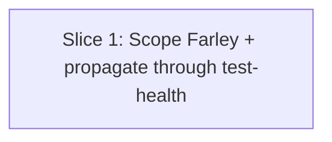

# Plan: Farley Score honors --path / --since scope

**Created**: 2026-07-01
**Branch**: issue-533
**Status**: implemented

## Goal

Make the Farley Score in `/test-design` follow `--path` / `--since` scope and
label the score with the scope it was computed over, then have `/test-health`
pass its `--path` through to `/test-design` explicitly. Unscoped
`/test-design` is unchanged (whole-repo Farley, labelled "all tests"). This
closes #533 — a subtree audit no longer silently inherits a whole-repo score
that contradicts the rest of the report.

## Decision-defaults stance

- **Scope**: touch only the two SKILL files the spec names. `farley-score`
  worker is not edited (it scores whatever file set it receives).
- **Migrate vs edit-stub**: N/A — both target files are canonical, not stubs.
- **Auto-merge**: standard `/pr` auto-merge on green checks. This PR touches
  skills, so it is NOT the "docs-only fast path" from CLAUDE.md — auto-merge
  still gates on the full CI matrix.

## Acceptance Criteria

- [ ] `/test-design` (no scope) → header reads `Farley Score (all tests)`; score covers every test file in the repo.
- [ ] `/test-design --path <dir>` → header reads `Farley Score (under <dir>)`; score covers only test files under `<dir>` or exercising production code under `<dir>`.
- [ ] `/test-design --since <ref>` → header reads `Farley Score (changed since <ref>)`; score covers only tests touched in the diff or covering production files touched in the diff.
- [ ] Empty in-scope test set → Step 3 skipped; report notes `no in-scope test files` instead of a score.
- [ ] `/test-health --path <dir>` invocation string explicitly reads `/test-design --path <dir>` in the skill file.
- [ ] `/test-health` with no `--path` invokes bare `/test-design` (no `--path` flag) — the SKILL file documents both branches explicitly.
- [ ] `/test-design --path <dir> --since <ref>` combined: in-scope set is the intersection (tests under `<dir>` AND changed since `<ref>`); label reads `Farley Score (under <dir>, changed since <ref>)`.
- [ ] `/test-health` Output template renders the Farley Score line with its scope label.
- [ ] `bash scripts/ci-local.sh` passes.

## Slices

### Slice 1: Scope Farley to `--path` / `--since` and propagate through `/test-health`

**Depends-on:** none
**Files:**

- `plugins/dev-team/skills/test-design/SKILL.md`
- `plugins/dev-team/skills/test-health/SKILL.md`
- `tests/docs/test_design_farley_scope_tests.bats` (new)
- `tests/docs/test_health_farley_scope_tests.bats` (new)

**Behavior:**

Verification surface: these scenarios describe the documented contract enforced
against the two SKILL.md files. Because the runtime is the model, verification
is bats string-pinning against SKILL prose (labels, invocation strings,
branch documentation), not runtime execution. Every scenario below must have a
corresponding bats assertion in Step 1.1.

```gherkin
Feature: Farley Score honors --path / --since scope

  Scenario: Unscoped /test-design reports suite-wide Farley labelled "all tests"
    Given the test-design SKILL is invoked with no --path and no --since
    When the Farley Score section is emitted
    Then the score is computed over every test file in the repository
    And the report header reads "Farley Score (all tests)"

  Scenario: /test-design --path reports subtree-scoped Farley labelled "under <path>"
    Given the test-design SKILL is invoked with --path plugins/api
    When the Farley Score section is emitted
    Then the score is computed only over tests under plugins/api or covering production code under plugins/api
    And the report header reads "Farley Score (under plugins/api)"

  Scenario: /test-design --since reports diff-scoped Farley labelled "changed since <ref>"
    Given the test-design SKILL is invoked with --since main
    When the Farley Score section is emitted
    Then the score is computed only over tests touched in the diff or covering production files touched in the diff
    And the report header reads "Farley Score (changed since main)"

  Scenario: /test-design --path and --since together produce the intersection scope
    Given the test-design SKILL is invoked with --path plugins/api and --since main
    When the Farley Score section is emitted
    Then the score is computed only over tests that are both under plugins/api and touched (directly or via covered production code) since main
    And the report header reads "Farley Score (under plugins/api, changed since main)"

  Scenario: Empty in-scope test set skips the Farley step
    Given the resolved in-scope set contains no test files
    When Step 3 runs
    Then no Farley Score is emitted
    And the report notes "no in-scope test files" in place of a score

  Scenario: /test-health --path passes the scope through explicitly
    Given the test-health SKILL is invoked with --path plugins/api
    When Step 6 dispatches /test-design
    Then the invocation string is "/test-design --path plugins/api"
    And the test-health Output block renders the Farley Score line with the scope label

  Scenario: /test-health without --path invokes /test-design without --path
    Given the test-health SKILL is invoked with no --path
    When Step 6 dispatches /test-design
    Then the invocation string is "/test-design" (no --path)
    And the resulting Farley line carries the "all tests" label

  Scenario: /test-health --path with an empty subtree propagates the empty-scope note
    Given the test-health SKILL is invoked with --path plugins/empty-dir
    When Step 6 dispatches /test-design --path plugins/empty-dir and the resolved in-scope set is empty
    Then the test-health Output block's Farley Score line notes "no in-scope test files" instead of a numeric score or label
```

**Steps:**

#### Step 1.1: RED — bats guards pin the new behavioural contract on both SKILL files

**Complexity**: standard
**RED**: Write `tests/docs/test_design_farley_scope_tests.bats` asserting the test-design SKILL

- contains the three scope labels `Farley Score (all tests)`, `Farley Score (under`, and `Farley Score (changed since` in Step 3 or its report template,
- documents combined-scope behaviour — grep for the combined-label form `Farley Score (under <dir>, changed since <ref>)` (or the templated equivalent `under .*, changed since`) and for wording establishing intersection semantics (e.g. `intersection`, `both`, `AND`),
- contains an explicit "empty in-scope set" branch (grep for `no in-scope test files`),
- explicitly documents Step 3 consuming Step 1's already-resolved file set (grep for a phrase like `set resolved in Step 1` / `reuse Step 1` / `already-resolved`),
- no longer contains the leaky phrase "This headline score is independent of `--path` / `--since`".

Write `tests/docs/test_health_farley_scope_tests.bats` asserting the test-health SKILL

- contains the exact invocation string `/test-design --path` for the scoped branch (proves pass-through wiring is documented),
- documents the **unscoped** branch too — grep for a bare `/test-design` dispatch line that does not carry a `--path` token (e.g. `dispatch \`/test-design\`` on its own, matched by an awk/grep rule that rejects `/test-design --path`),
- documents the empty-scope pass-through — grep the test-health SKILL for the literal `no in-scope test files` string (closes Scenario 8 on the test-health side),
- Output block references the scope label (grep for one of the three labels).

Run `bats tests/docs/test_design_farley_scope_tests.bats tests/docs/test_health_farley_scope_tests.bats` — must fail.
**GREEN**: N/A — this step's GREEN is the bats file existing and failing on the current SKILLs.
**REFACTOR**: None needed.
**Files**: `tests/docs/test_design_farley_scope_tests.bats`, `tests/docs/test_health_farley_scope_tests.bats`
**Commit**: `test(test-design): add bats guards for scoped Farley Score (RED) (#533)`

#### Step 1.2: GREEN — edit `test-design/SKILL.md` Step 3 + report header

**Complexity**: standard
**RED**: (already red from Step 1.1)
**GREEN**: Rewrite Step 3 of `plugins/dev-team/skills/test-design/SKILL.md` so the Farley Score is computed over the in-scope test set. **Step 3 consumes the file set already resolved in Step 1 — do not re-implement path/diff matching; there is one scope-resolution authority in this SKILL.**

- No `--path` / no `--since` → whole repo; label `all tests`.
- `--path <dir>` → tests under `<dir>` OR covering production code under `<dir>`; label `under <dir>`.
- `--since <ref>` → tests touched in the diff plus tests covering production files touched in the diff; label `changed since <ref>`.
- Both `--path <dir>` and `--since <ref>` → the **intersection** (tests under `<dir>` AND touched, directly or via covered production code, since `<ref>`); label `under <dir>, changed since <ref>`.
- Empty in-scope test set → skip the step; note `no in-scope test files` in the report.
- Test-file identification continues to use `knowledge/test-file-indicators.md`.

Update the Step 6 report template header from `Farley Score (all existing tests)` to `Farley Score (<scope>)` where `<scope>` is one of the three labels above, and add a one-line legend under the header.

Run `bash scripts/ci-local.sh` — the two new bats files and every existing suite must pass.
**REFACTOR**: If Step 3's prose has grown, tighten to match the surrounding brevity. Keep the section under its current line count.
**Files**: `plugins/dev-team/skills/test-design/SKILL.md`
**Commit**: `fix(test-design): scope Farley Score to --path/--since with explicit label (#533)`

#### Step 1.3: GREEN — pass scope through `/test-health` Step 6 and render it in Output

**Complexity**: standard
**RED**: (already red from Step 1.1's test-health bats)
**GREEN**: Edit `plugins/dev-team/skills/test-health/SKILL.md`:

- In Step 6, make the `/test-design` invocation string explicit for **both** branches: when `--path <dir>` is set on `/test-health`, dispatch `/test-design --path <dir>`; when `--path` is not set, dispatch bare `/test-design` (no scope flag). Document both branches in the skill text so bats can pin each.
- Update the Output block's "Test-design & mutation health" line so the Farley Score is rendered with its scope label (`(all tests)` / `(under <path>)` / `(changed since <ref>)`), consistent with `/test-design`'s new header. When `/test-design` returned the empty-scope note, propagate `no in-scope test files` verbatim into the health report — do not synthesize a number.
- Constraint 4 ("No scoring reinvention") is unchanged — the wording still says *consume, don't restate*. We are propagating the label, not re-deriving the score.

Run `bash scripts/ci-local.sh` again.
**REFACTOR**: None needed.
**Files**: `plugins/dev-team/skills/test-health/SKILL.md`
**Commit**: `fix(test-health): pass --path through to /test-design and render Farley scope label (#533)`

#### Step 1.4: REFACTOR — final sweep + eval check

**Complexity**: trivial
**RED**: N/A
**GREEN**: N/A
**REFACTOR**: Grep the repo for the stale phrase "score always reflects the full suite" / "all existing tests" / "headline score is independent" — replace any residual copies with the new scope-aware phrasing. Run `bash scripts/ci-local.sh` once more and, if the `/agent-eval` fixtures reference Farley behaviour, run them; nothing in `evals/expected/` currently pins Farley labels, so this is a no-op check.
**Files**: potentially docs under `plugins/dev-team/docs/` if a stale reference is found.
**Commit**: `docs(test-design): mop up stale "whole-suite Farley" references (#533)` (only if a stale line is found; otherwise skip the commit).

## Parallelization

Single slice → single wave. Nothing to parallelize.



| Wave | Slices (parallel) |
|------|-------------------|
| 1 | 1 |

## Complexity Classification

Slice 1 is `standard` — behavioral change within existing patterns, no new abstraction, no security surface. Step 1.4 is `trivial` (a grep-based cleanup gated on findings).

## Pre-PR Quality Gate

- [ ] All tests pass (`bash scripts/ci-local.sh`)
- [ ] Type check passes — N/A (no code)
- [ ] Linter passes — covered by `ci-local.sh`
- [ ] `/code-review` passes
- [ ] Documentation updated — the two SKILL files are the documentation

## Risks & Open Questions

- **Risk**: A downstream consumer parses the exact string `Farley Score (all existing tests)`. **Mitigation**: The repo grep run in Step 1.4 catches this. If a hit surfaces, add its file to the plan before landing.
- **Risk**: Stack-aware / test-modernize bats suites assert Farley-related strings. **Mitigation**: Step 1.1 runs the full `ci-local.sh` — any surprise breakage becomes visible before Step 1.2 lands.

## Build Progress

### Slices (grouped by wave)

#### Wave 1

- [x] Slice 1: Scope Farley to --path / --since and propagate through /test-health
  - [x] Step 1.1: RED — bats guards pin the new behavioural contract on both SKILL files
  - [x] Step 1.2: GREEN — edit test-design/SKILL.md Step 3 + report header
  - [x] Step 1.3: GREEN — pass scope through /test-health Step 6 and render it in Output
  - [x] Step 1.4: REFACTOR — final sweep + eval check

### Acceptance Criteria

- [x] `/test-design` (no scope) → header reads `Farley Score (all tests)`; score covers every test file in the repo.
- [x] `/test-design --path <dir>` → header reads `Farley Score (under <dir>)`; score covers only test files under `<dir>` or exercising production code under `<dir>`.
- [x] `/test-design --since <ref>` → header reads `Farley Score (changed since <ref>)`; score covers only tests touched in the diff or covering production files touched in the diff.
- [x] Empty in-scope test set → Step 3 skipped; report notes `no in-scope test files` instead of a score.
- [x] `/test-health --path <dir>` invocation string explicitly reads `/test-design --path <dir>` in the skill file.
- [x] `/test-health` with no `--path` invokes bare `/test-design` (no `--path` flag) — SKILL documents both branches.
- [x] `/test-design --path <dir> --since <ref>` combined: intersection scope; label reads `Farley Score (under <dir>, changed since <ref>)`.
- [x] `/test-health` Output template renders the Farley Score line with its scope label.
- [x] `bash scripts/ci-local.sh` passes (content checks; eslint failure is a pre-existing environment issue on `main`, not caused by this branch).

## Plan Review Summary

Plan tier: **standard** — 1 slice, ≤ 4 files, no `complex` step, no high-reversal-cost decision axis. Reviewers dispatched: Acceptance Test Critic, Design & Architecture Critic. UX Critic skipped (no UI surface). Parallelization Critic skipped (single-slice plan — no waves to parallelize).

- **Acceptance Test Critic**: `approve` after one revision — closed the unscoped `/test-health` → bare `/test-design` blocker and the combined-scope (`--path` + `--since`) blocker with new AC, scenario, and matching bats guard; also folded in the verification-surface preamble and the empty-scope pass-through on the test-health side.
- **Design & Architecture Critic**: `approve` — dependency direction sound (farley-score stays a pure scorer; scope selection lives in the caller); test-health continues to consume rather than re-derive. One warning folded in: Step 3 must reuse Step 1's already-resolved file set (added to Step 1.2 GREEN and pinned by a Step 1.1 bats grep) to prevent scope-resolution drift.

## Slice Review Summary (batched at slice boundary)

- **spec-compliance-review**: `pass` — all 7 spec ACs and 9 plan ACs met, all 8 Gherkin scenarios have bats guards, no scope violations.
- **doc-review**: `warn` — flagged `<dir>` vs `<path>` metavariable drift across the two SKILLs. Fixed (standardised on `<dir>` everywhere).
- **token-efficiency-review**: `warn` — flagged label-form enumeration restated across three sites. Fixed (collapsed the report-header restatement to a single line pointing at Step 3, trimmed hedging in Step 3 and Step 6).

## Final /code-review Summary

- **arch-review**: `pass` — dependency direction preserved (farley-score → test-design → test-health); no layer boundary violation; sibling-pattern consistency verified.
- **claude-setup-review**: `warn` (3 findings) — 2 fixed: added `role: orchestrator` to test-design frontmatter; trimmed unreachable `(changed since <ref>)` label variants from test-health Output block (test-health parses only `--path`). 1 skipped: folded-scalar cosmetic on test-health `description:` — out of scope for #533.
- **test-review**: `warn` (5 findings) — 5 fixed: intersection-semantics grep no longer matches bare English words; unscoped-branch assertion pins branch-specific phrasing; Output-block scope-label check is section-scoped; added negative assertions for the remaining stale whole-suite phrases; added positive assertion pinning "single scope-resolution authority". All four tightened guards verified to fail against origin/main.

**Branch Farley Score**: 8.9 / 10 (Good, borderline Exemplary) — 6 Exemplary, 8 Good, 0 below.
