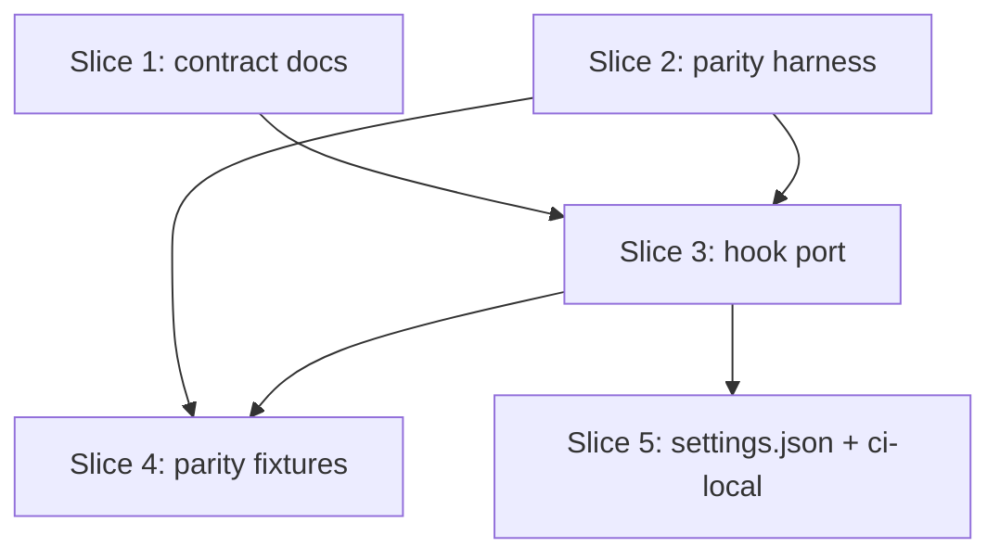

# Plan: Issue #574 — Python hook contract + parity harness + reference port

**Created**: 2026-07-02
**Branch**: issue-574-python-hook-contract
**Status**: approved (non-interactive auto-approval per session-1 authorization)

## Goal

Phase 0 of the bash → python hook migration (#572). Land the byte-compatible
Python-hook contract, the pytest parity harness that gates every subsequent
slice, the per-hook `DEV_TEAM_PY_HOOK_<NAME>` toggle pattern, and the first
reference port (`mutation-testing-smoke-gate.sh` → `.py`). Bash stays
authoritative — the Python port ships alongside with its flag defaulted **off**
so the parity harness carries the correctness burden without changing behavior
in the field.

## Approach stances (high-reversal-cost axes from decision-defaults)

- **Replace-vs-merge**: **merge**. Both `.sh` and `.py` ship; the `.sh` stays
  the default until a release-please cycle proves parity.
- **Migrate-vs-edit-stub**: **migrate** — the `.py` is a full port, not a
  shim. The harness validates byte-equality; parallel-ship guards the field.
- **Auto-merge-vs-direct**: **direct human merge** — code PR per CLAUDE.md.
- **Scope**: strictly the four Phase-0 deliverables; no Phase 1+ hook ports.

## Acceptance Criteria

- [ ] `docs/python-hook-contract.md` exists and covers stdin JSON schema,
      stdout format rules, exit-code semantics (0/1/2/≥3), hook env vars,
      stderr conventions, and Python authoring rules (stdlib-only, 3.8+).
- [ ] `plugins/dev-team/tests/hooks/parity/parity.py::assert_parity` runs
      both implementations against a fixture and asserts byte-equal stdout,
      exit code, normalized stderr, and side-effect tree.
- [ ] `plugins/dev-team/tests/hooks/parity/conftest.py` provides tmpdir
      sandbox isolation with `HOME`, `CLAUDE_PROJECT_DIR`,
      `GIT_CONFIG_GLOBAL=/dev/null`, `GIT_CONFIG_SYSTEM=/dev/null`.
- [ ] `plugins/dev-team/hooks/mutation_testing_smoke_gate.py` implements the
      same contract as its `.sh` sibling.
- [ ] ≥ 5 parity fixtures cover: happy path (Killed>0 pass), whole-scope
      block (missing report), single-file mutate silent-pass, malformed
      JSON advisory, Windows-path `CLAUDE_PROJECT_DIR`.
- [ ] `plugins/dev-team/hooks/settings-toggle.md` documents the
      `DEV_TEAM_PY_HOOK_<NAME>` pattern.
- [ ] `plugins/dev-team/settings.json` respects
      `DEV_TEAM_PY_HOOK_MUTATION_TESTING_SMOKE_GATE` (default off ⇒ bash;
      on ⇒ python) via `sh -c` dispatch.
- [ ] `scripts/ci-local.sh` invokes the new pytest step gated on directory
      presence (backward-compatible).
- [ ] `bash scripts/ci-local.sh` green on this branch.

## Slices

### Slice 1: Contract doc + settings-toggle doc

**Depends-on:** none
**Files:** `docs/python-hook-contract.md`, `plugins/dev-team/hooks/settings-toggle.md`

**Behavior:**

```gherkin
Feature: Python hook authoring contract

  Scenario: contract doc covers every observable channel
    Given a maintainer authoring a new Python hook
    When they open docs/python-hook-contract.md
    Then it names stdin schema, stdout format, exit codes 0/1/2/≥3,
      env vars (CLAUDE_PROJECT_DIR, CLAUDE_TOOL_NAME, CLAUDE_SESSION_ID),
      stderr conventions, and Python authoring rules (stdlib-only, 3.8+)

  Scenario: settings-toggle doc names the env-var pattern
    Given a maintainer switching a hook from bash to python
    When they read plugins/dev-team/hooks/settings-toggle.md
    Then it explains DEV_TEAM_PY_HOOK_<NAME>, its default-off semantics,
      and how settings.json dispatches on it
```

**Steps:**

#### Step 1.1: Author `docs/python-hook-contract.md`

**Complexity**: standard
**RED**: Add a bats/markdown-integrity test asserting the file exists and
contains each required section header (`## stdin`, `## stdout`,
`## Exit codes`, `## Environment variables`, `## stderr`,
`## Python authoring rules`).
**GREEN**: Write the contract doc.
**REFACTOR**: None.
**Files**: `docs/python-hook-contract.md`,
`tests/docs/python_hook_contract_tests.bats`
**Commit**: `docs(hooks): python-hook contract (#574)`

#### Step 1.2: Author `plugins/dev-team/hooks/settings-toggle.md`

**Complexity**: trivial
**RED**: Test asserts file exists and mentions `DEV_TEAM_PY_HOOK_` prefix.
**GREEN**: Write the toggle doc.
**REFACTOR**: None.
**Files**: `plugins/dev-team/hooks/settings-toggle.md`,
`tests/docs/python_hook_contract_tests.bats` (extended)
**Commit**: `docs(hooks): DEV_TEAM_PY_HOOK toggle pattern (#574)`

### Slice 2: Parity harness

**Depends-on:** none
**Files:** `plugins/dev-team/tests/hooks/parity/{__init__.py,conftest.py,parity.py}`

**Behavior:**

```gherkin
Feature: Byte-equal parity between .sh and .py hooks

  Scenario: identical fixture → identical outcome
    Given a fixture with (stdin, env, argv, initial tree)
    When assert_parity dispatches it at hooks/foo.sh and hooks/foo.py
    Then both produce byte-equal stdout, same exit code,
      whitespace-normalized-equal stderr, and identical side-effect tree

  Scenario: sandbox isolation
    Given a fixture running under the harness
    When the hook writes to any path
    Then only tmpdir paths are touched — HOME, CLAUDE_PROJECT_DIR,
      GIT_CONFIG_GLOBAL, GIT_CONFIG_SYSTEM are all tmpdir-scoped

  Scenario: stderr normalization
    Given the .sh writes "2026-07-02T12:00:00Z pid=1234" and
      the .py writes "2026-07-02T12:00:01Z pid=5678"
    When the harness normalizes both
    Then they compare equal (timestamps and pids stripped)
```

**Steps:**

#### Step 2.1: `parity.py` core with pytest self-test

**Complexity**: complex
**RED**: `tests/hooks/parity/test_parity_selftest.py` — a fake `foo.sh`
and `foo.py` that echo `$1` at exit 0; assert_parity passes. A second
fixture where `.py` prints extra content — assert_parity fails.
**GREEN**: Implement `parity.py` with `Fixture` dataclass, `_dispatch_sh`,
`_dispatch_py`, `_normalize_stderr` (strip ISO-8601 + PIDs +
tmpdir prefix), `_tree_snapshot`, `assert_parity`.
**REFACTOR**: Extract sandbox setup into `conftest.py` fixture.
**Files**: `plugins/dev-team/tests/hooks/parity/parity.py`,
`plugins/dev-team/tests/hooks/parity/__init__.py`,
`plugins/dev-team/tests/hooks/parity/conftest.py`,
`plugins/dev-team/tests/hooks/parity/test_parity_selftest.py`
**Commit**: `test(hooks): parity harness core with self-test (#574)`

#### Step 2.2: `--record` mode for regenerating snapshots

**Complexity**: standard
**RED**: Self-test asserts `--record` regenerates `expected.json` from the
`.sh` run when it is missing.
**GREEN**: Add `record_fixture` helper + pytest option `--parity-record`.
**REFACTOR**: None.
**Files**: `plugins/dev-team/tests/hooks/parity/parity.py`,
`plugins/dev-team/tests/hooks/parity/conftest.py`,
`plugins/dev-team/tests/hooks/parity/test_parity_selftest.py`
**Commit**: `test(hooks): parity harness --record mode (#574)`

### Slice 3: Python port of `mutation-testing-smoke-gate.sh`

**Depends-on:** 1, 2
**Files:** `plugins/dev-team/hooks/mutation_testing_smoke_gate.py`

**Behavior:**

```gherkin
Feature: Python port of mutation-testing-smoke-gate

  Scenario: whole-scope run without smoke report → block (exit 2)
    Given a stdin payload with command "dotnet stryker" and cwd having
      no StrykerOutput/smoke/reports/mutation-report.json
    When the .py hook runs
    Then it exits 2 with the BLOCK message referencing Step 1c

  Scenario: whole-scope run with Killed>0 in smoke report → silent pass
    Given a mutation-report.json with a Killed mutant
    When the .py hook runs
    Then it exits 0 with empty stdout

  Scenario: single-file --mutate → silent pass (this is the probe itself)
    Given command "dotnet stryker --mutate src/Foo.cs"
    When the .py hook runs
    Then it exits 0 with empty stdout

  Scenario: MUTATION_SMOKE_GATE_SKIP=1 → audit-logged silent pass
    Given the escape hatch env var is set
    When the .py hook runs on a whole-scope command
    Then it exits 0 and appends one JSONL line (never the raw command,
      only its sha256 first-16) to <cwd>/metrics/gate-bypass.jsonl

  Scenario: malformed JSON report → advisory (exit 0, ADVISORY: on stdout)
    Given a mutation-report.json that is not valid JSON
    When the .py hook runs
    Then it exits 0 with a stdout line starting "ADVISORY:"

  Scenario: missing jq or python3 dependency → advisory
    (In Python, python3 is always present by construction; the .py port
    still gates on `shutil.which("jq")` returning None for the advisory
    to match the .sh contract byte-for-byte.)
```

**Steps:**

#### Step 3.1: Port the hook — argv/stdin parsing + trigger detection

**Complexity**: complex
**RED**: `test_mutation_testing_smoke_gate_selftest.py` — direct unit
tests calling the Python module (not through the parity harness) for
`is_stryker_command`, `extract_mutate_value`, `is_single_file_mutate`.
**GREEN**: Implement the parsing surface using stdlib `shlex`, `re`,
`json`.
**REFACTOR**: None.
**Files**: `plugins/dev-team/hooks/mutation_testing_smoke_gate.py`,
`plugins/dev-team/tests/hooks/test_mutation_testing_smoke_gate.py`
**Commit**: `feat(hooks): python port scaffold for mutation-testing-smoke-gate (#574)`

#### Step 3.2: Port the block-message + report-parsing + escape-hatch

**Complexity**: complex
**RED**: Unit tests for `print_block_message`, `count_mutants`, and the
audit-log helper (asserts sha256 first-16 hashing, ISO-8601-Z timestamp,
directory creation).
**GREEN**: Complete the port. `main()` returns the exit code; a
`__main__` shim calls `sys.exit(main())`.
**REFACTOR**: None.
**Files**: same as 3.1.
**Commit**: `feat(hooks): complete python port of mutation-testing-smoke-gate (#574)`

### Slice 4: Parity fixtures for the reference hook

**Depends-on:** 2, 3
**Files:** `plugins/dev-team/tests/hooks/parity/fixtures/mutation_testing_smoke_gate/`

**Behavior:**

```gherkin
Feature: Reference hook passes parity harness

  Scenario Outline: <fixture>
    Given the (stdin, env, argv, initial-tree) fixture "<fixture>"
    When the parity harness runs .sh and .py against it
    Then assert_parity passes

    Examples:
      | fixture                             |
      | happy_path_killed                   |
      | block_missing_report                |
      | single_file_mutate_probe            |
      | malformed_json_advisory             |
      | windows_path_cwd                    |
      | escape_hatch_skip                   |
```

**Steps:**

#### Step 4.1: Author the six fixtures + test parametrization

**Complexity**: standard
**RED**: `tests/hooks/parity/test_mutation_testing_smoke_gate_parity.py`
parametrized over the six fixtures — assert_parity(...) on each.
**GREEN**: Author the fixture directories (stdin.json + env.json +
initial-tree/ mutation-report.json seeded where relevant).
**REFACTOR**: Factor fixture-loading into a helper if repetitive.
**Files**: `plugins/dev-team/tests/hooks/parity/fixtures/mutation_testing_smoke_gate/**`,
`plugins/dev-team/tests/hooks/parity/test_mutation_testing_smoke_gate_parity.py`
**Commit**: `test(hooks): parity fixtures for mutation-testing-smoke-gate (#574)`

### Slice 5: settings.json toggle + ci-local wiring

**Depends-on:** 3
**Files:** `plugins/dev-team/settings.json`, `scripts/ci-local.sh`

**Behavior:**

```gherkin
Feature: Per-hook bash↔python routing + CI runs parity harness

  Scenario: default env → bash runs
    Given DEV_TEAM_PY_HOOK_MUTATION_TESTING_SMOKE_GATE is unset
    When Claude Code fires the PreToolUse Bash matcher
    Then hooks/mutation-testing-smoke-gate.sh runs

  Scenario: opt-in env → python runs
    Given DEV_TEAM_PY_HOOK_MUTATION_TESTING_SMOKE_GATE=1
    When Claude Code fires the PreToolUse Bash matcher
    Then hooks/mutation_testing_smoke_gate.py runs

  Scenario: ci-local invokes pytest parity when the dir exists
    Given plugins/dev-team/tests/hooks/parity/ exists
    When bash scripts/ci-local.sh runs
    Then the parity pytest suite is one of the checks

  Scenario: ci-local skips pytest parity if the dir is absent (backward-compat)
    Given plugins/dev-team/tests/hooks/parity/ does not exist
    When bash scripts/ci-local.sh runs
    Then no parity check is dispatched and ci-local exits 0
```

**Steps:**

#### Step 5.1: Add `chk_parity` to ci-local (backward-compat)

**Complexity**: standard
**RED**: `tests/scripts/ci_local_parity_registration_tests.bats` — assert
that ci-local.sh contains a `chk_parity` entry AND that when the parity
dir is absent, the check reports skip-with-advisory.
**GREEN**: Add `chk_parity()` function and its `CHECKS` entry; skip
gracefully when the dir is absent.
**REFACTOR**: None.
**Files**: `scripts/ci-local.sh`,
`tests/scripts/ci_local_parity_registration_tests.bats`.
**Commit**: `ci(local): pytest parity harness gate (#574)`

#### Step 5.2: settings.json — env-var dispatch for smoke-gate

**Complexity**: standard
**RED**: `tests/hooks/settings_python_toggle_tests.bats` — parse
settings.json, assert the mutation-testing-smoke-gate PreToolUse entry
uses `sh -c` with a conditional that flips on
`DEV_TEAM_PY_HOOK_MUTATION_TESTING_SMOKE_GATE`.
**GREEN**: Rewrite that entry to `sh -c 'if [ "${DEV_TEAM_PY_HOOK_MUTATION_TESTING_SMOKE_GATE:-0}" = "1" ]; then python3 hooks/mutation_testing_smoke_gate.py; else bash hooks/mutation-testing-smoke-gate.sh; fi'`.
**REFACTOR**: None.
**Files**: `plugins/dev-team/settings.json`,
`tests/hooks/settings_python_toggle_tests.bats`.
**Commit**: `chore(hooks): settings.json dispatches smoke-gate via DEV_TEAM_PY_HOOK toggle (#574)`

## Parallelization

Slice deps: 1: —, 2: —, 3: 1 & 2, 4: 2 & 3, 5: 3.



| Wave | Slices |
| ------ | -------- |
| 1 | 1, 2 |
| 2 | 3 |
| 3 | 4, 5 |

## Complexity Classification

Summarized above per step. Trivial: 1.2. Standard: 1.1, 2.2, 4.1, 5.1, 5.2.
Complex: 2.1, 3.1, 3.2.

## Pre-PR Quality Gate

- [ ] All tests pass (`bash scripts/ci-local.sh`).
- [ ] Type check — n/a (stdlib-only Python; ruff-check will catch obvious).
- [ ] Linter passes.
- [ ] `/code-review` passes.
- [ ] Documentation updated: contract doc, toggle doc, plugin CLAUDE.md
      cross-reference (light touch — link to new docs).

## Skipped (low value)

_None._

## Risks & Open Questions

- **stderr normalization scope**: overly aggressive normalization can hide
  real divergence; the harness strips only ISO-8601 timestamps, PIDs, and
  tmpdir prefixes — nothing else. Documented in Step 2.1.
- **Windows Git Bash `sh -c` semantics**: the settings.json dispatch relies
  on `sh -c` (present on all three platforms including MSYS). Verified
  during the parity harness Windows-path fixture.
- **Existing bats tests for `.sh`**: unchanged; the parity harness is a new
  gate that supplements — not replaces — them until Phase 4 removes bash.

## Approval

Auto-approved (non-interactive) at 2026-07-02 — no human review gate.
Trigger: session-1 autonomous authorization (DEV_TEAM_AUTO_APPROVE
implicit).

## Build Progress

### Wave 1

- [ ] Slice 1: Contract doc + settings-toggle doc
  - [ ] Step 1.1: Author `docs/python-hook-contract.md`
  - [ ] Step 1.2: Author `plugins/dev-team/hooks/settings-toggle.md`
- [ ] Slice 2: Parity harness
  - [ ] Step 2.1: `parity.py` core with pytest self-test
  - [ ] Step 2.2: `--record` mode for regenerating snapshots

### Wave 2

- [ ] Slice 3: Python port of `mutation-testing-smoke-gate.sh`
  - [ ] Step 3.1: Port scaffold — argv/stdin parsing + trigger detection
  - [ ] Step 3.2: Complete port — block message, report parsing, escape hatch

### Wave 3

- [ ] Slice 4: Parity fixtures for the reference hook
  - [ ] Step 4.1: Author six fixtures + parametrized parity test
- [ ] Slice 5: settings.json toggle + ci-local wiring
  - [ ] Step 5.1: `chk_parity` in ci-local (backward-compat)
  - [ ] Step 5.2: settings.json env-var dispatch for smoke-gate
