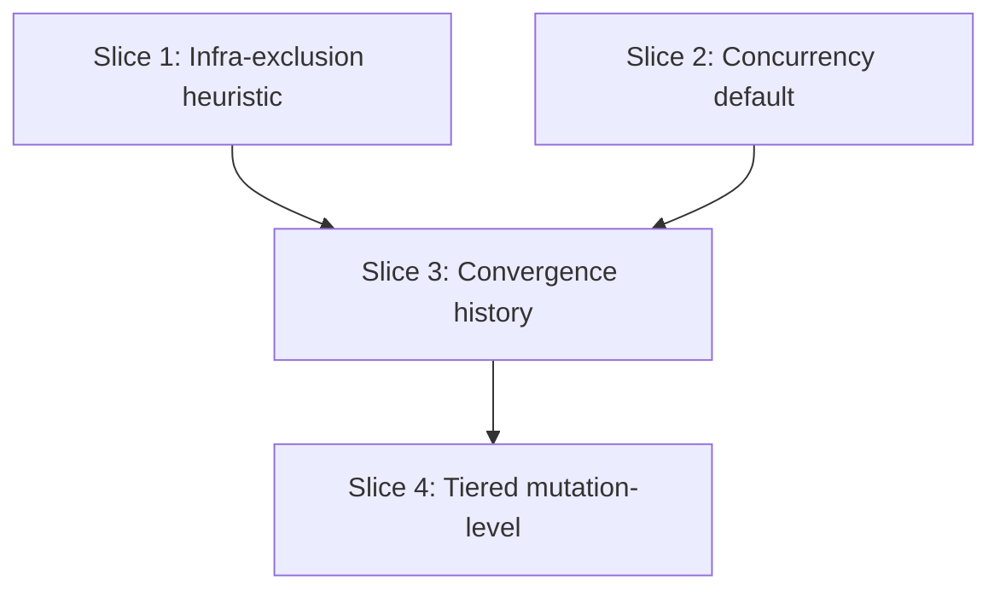

# Plan: Mutation-Kill Slice-Loop Refinements (issue #667)

**Created**: 2026-07-02
**Branch**: mutation-test
**Status**: approved
**Parent issue**: #667
**Slice issues**: Slice 1 → #680, Slice 2 → #681, Slice 3 → #682 (depends on #680, #681), Slice 4 → #683 (depends on #682)

## Goal

Reduce the wall-clock and mutant-budget cost of the `mutation-kill` agent's
`--all` kill loop on multi-file slices, per the real `slice-05-root` drive
recorded in issue #667. Four refinements: persist file-convergence state so a
fresh `--all` invocation shrinks the `--mutate` glob instead of re-testing
converged files; tier Stryker.NET's `mutation-level` (Basic first, Standard
escalation only for files with remaining survivors); broaden the existing
infrastructure-exclusion heuristic so DI/wiring files are caught by signal alone,
not just a filename allowlist; and default Stryker's own `-c` concurrency flag to
`cores − 2` instead of its flat default of 5. Spec:
`docs/specs/mutation-kill-slice-loop-refinements.md`.

**Decision-defaults stance:** Integration axis — lands via PR with auto-merge
**not armed** (touches an agent spec, a reference doc, and a shipped Python
script — explicit human merge required per repo working rules). Scope axis —
touches only the four files named in the spec's architecture section; no
adjacent refactor.

## Acceptance Criteria

- [ ] `mutation-kill.md` documents the persisted convergence-history mechanism
      (file path, entry shape, staleness check, glob-shrinking + skip-log
      behavior) — spec AC 1.
- [ ] `mutation-kill.md` documents Basic → Standard tiering, including the
      CompileError-trap interaction (drop to Basic-only + `EXCLUDED`, not a
      retry) — spec AC 2.
- [ ] `mutation-kill.md`'s infra-exclusion section lists the five new filename
      patterns and states the two numeric signals alone trigger the existing
      batched confirmation — spec AC 3.
- [ ] `csharp_stryker_net_wrapper.py` injects a computed `-c` value unless the
      caller already passed one (via `--stryker-concurrency`,
      `STRYKER_MUTANT_CONCURRENCY`, or pass-through `-c`/`--concurrency`);
      never overrides an explicit value — spec AC 4.
- [ ] `csharp-stryker-net.md` documents tiering, the concurrency default, and
      the convergence-glob template extension with runnable examples — spec
      AC 5.
- [ ] `mutation_kill_agent_tests.bats` gains assertions for all three
      `mutation-kill.md` additions; the file stays under its 500-line gate —
      spec AC 6.
- [ ] All pre-existing bats/pytest assertions for these files continue to pass
      unchanged — spec AC 7.

## Slices

### Slice 1: Broaden infrastructure-exclusion heuristic

**Depends-on:** none
**Files:** `plugins/dev-team/agents/mutation-kill.md`, `tests/agents/mutation_kill_agent_tests.bats`

**Behavior:**

```gherkin
Feature: Infrastructure exclusion detection catches DI-wiring files by signal alone

  Scenario: A DI-wiring file matches a known naming convention
    Given a file scores below 15% with NoCoverage over 50% of effective mutants
    And its filename matches one of the DI-wiring patterns (*Module.cs, *Container.cs, *Registration.cs, *Bootstrap*.cs, *DependencyInjection*.cs)
    When the baseline scan completes
    Then the agent asks the batched confirmation question, naming the matched convention

  Scenario: A DI-wiring file has no filename match but both numeric signals hold
    Given a file scores below 15% with NoCoverage over 50% of effective mutants
    And its filename matches none of the known infrastructure patterns
    When the baseline scan completes
    Then the agent still asks the batched confirmation question, noting no filename convention matched

  Scenario: A file fails the NoCoverage signal only
    Given a file scores below 15% but NoCoverage is exactly 50% of effective mutants
    When the baseline scan completes
    Then the agent does not ask about excluding the file

  Scenario: A file fails the score signal only
    Given a file scores at or above 15% but NoCoverage is over 50% of effective mutants
    When the baseline scan completes
    Then the agent does not ask about excluding the file
```

**Steps:**

#### Step 1.1: Extend the filename allowlist and loosen the trigger gate

**Complexity**: trivial
**RED**: Add bats assertions to `mutation_kill_agent_tests.bats` — new test
`"infrastructure exclusion: DI-wiring patterns and signal-alone trigger"`
asserting: the five new patterns (`*Module.cs`, `*Container.cs`,
`*Registration.cs`, `*Bootstrap*.cs`, `*DependencyInjection*.cs`) are present
in the infra-exclusion section; the section states the two numeric signals
alone are sufficient to trigger the confirmation (no filename match required);
**and** the section explicitly states that failing either numeric signal
alone (score OK but NoCoverage low, or NoCoverage high but score OK) does
**not** trigger the question — the negative case must be textually present,
not merely implied by the absence of a rule. Run bats — new test fails
(patterns/wording/negative-case sentence all absent).
**GREEN**: Update the `## Infrastructure exclusion detection` section in
`mutation-kill.md`: add the five patterns to the existing list; change the
trigger condition prose from "both signals AND a filename match" to "**both**
numeric signals (still AND'd with each other — only the filename requirement
is dropped) trigger the question; a filename match is folded into the
question's wording as a named hint, not a gate; failing either numeric signal
alone never triggers it." State the batched confirmation itemizes each
flagged file individually with its specific trigger reason (named convention,
or "no filename convention matched — score/coverage signal only") rather than
asking one undifferentiated question across a mixed batch.
**REFACTOR**: None needed — prose addition only; confirm the file is still
under the 500-line gate.
**Files**: `plugins/dev-team/agents/mutation-kill.md`, `tests/agents/mutation_kill_agent_tests.bats`
**Commit**: `feat(agents): mutation-kill catches DI-wiring files by signal alone (#667)`

### Slice 2: Concurrency default fix

**Depends-on:** none
**Files:** `plugins/dev-team/skills/mutation-testing/scripts/csharp_stryker_net_wrapper.py`, `tests/scripts/test_csharp_stryker_net_wrapper.py`, `plugins/dev-team/skills/mutation-testing/references/languages/csharp-stryker-net.md`, `tests/skills/mutation_kill_slice_loop_refinements_tests.bats`

**Behavior:**

**Naming note (post-review-1 revision):** the wrapper's own convenience flag is
`--stryker-concurrency` / `STRYKER_MUTANT_CONCURRENCY` — deliberately **not**
`--concurrency`/`-c` and **not** registered with a `-c` short alias. Two
independent reasons: (1) `argparse.parse_known_args` would otherwise consume a
bare `-c` into the wrapper's own namespace, making it structurally impossible
for a caller's pass-through `-c` to ever reach the "already present in
`stryker_args`" detection — Scenario 4 below would be unreachable; (2)
mutation-kill's own pre-existing `--concurrency <n>` flag (worktree fan-out,
default 2, `mutation-kill.md` line ~31) already owns that name for a different
dial at a different layer — reusing it here would let an operator reasonably
assume one flag tunes both.

```gherkin
Feature: Stryker.NET wrapper defaults mutant-testing concurrency to cores minus two

  Scenario: No concurrency flag or env var supplied
    Given the operator invokes the wrapper without --stryker-concurrency and STRYKER_MUTANT_CONCURRENCY unset
    And the operator's pass-through Stryker args contain no -c/--concurrency
    And the machine reports N logical cores
    When the wrapper builds the Stryker command line
    Then it appends "-c <max(1, N-2)>" to the forwarded arguments

  Scenario: Operator supplies an explicit --stryker-concurrency flag
    Given the operator invokes the wrapper with "--stryker-concurrency 8"
    When the wrapper builds the Stryker command line
    Then it forwards "-c 8" and does not add a second concurrency value

  Scenario: STRYKER_MUTANT_CONCURRENCY env var set, no CLI flag
    Given STRYKER_MUTANT_CONCURRENCY=6 is set in the environment and no --stryker-concurrency flag is passed
    When the wrapper builds the Stryker command line
    Then it forwards "-c 6"

  Scenario: Both --stryker-concurrency and STRYKER_MUTANT_CONCURRENCY are set
    Given the operator invokes the wrapper with "--stryker-concurrency 8"
    And STRYKER_MUTANT_CONCURRENCY=6 is also set in the environment
    When the wrapper builds the Stryker command line
    Then it forwards "-c 8" — the CLI flag wins over the env var

  Scenario: Caller already forwards -c via pass-through Stryker args (short form)
    Given the operator's pass-through args already contain "-c 3"
    When the wrapper builds the Stryker command line
    Then it forwards the caller's "-c 3" unchanged and injects nothing

  Scenario: Caller already forwards --concurrency via pass-through Stryker args (long form)
    Given the operator's pass-through args already contain "--concurrency 3"
    When the wrapper builds the Stryker command line
    Then it forwards the caller's "--concurrency 3" unchanged and injects nothing

  Scenario: Pass-through concurrency conflicts with an explicit wrapper-level value
    Given the operator invokes the wrapper with "--stryker-concurrency 8"
    And the operator's pass-through args already contain "-c 3"
    When the wrapper builds the Stryker command line
    Then it forwards the pass-through "-c 3" unchanged
    And it logs a one-line note that the pass-through value overrode "--stryker-concurrency 8"
```

**Steps:**

#### Step 2.1: Inject a computed default concurrency

**Complexity**: standard
**RED**: Add `test_csharp_stryker_net_wrapper.py::TestConcurrencyDefault` with
two cases: (1) mock `os.cpu_count()` to a fixed value, call `main()` with no
`-c`/`--concurrency` in the pass-through args and no `--stryker-concurrency`
flag, capture `stryker_args` via the existing `fake_stryker` fixture pattern,
assert `-c <cpu_count-2>` is present (the injection path); (2) call `main()`
with pass-through `-c 3` already present and no `--stryker-concurrency` flag,
assert `stryker_args` still contains exactly the caller's `-c 3` and nothing
else was appended (the base guard path — this is the direct instantiation of
"never override an explicit caller-supplied `-c`", independent of the
override-logging machinery Step 2.2 adds on top). Also add a case mocking
`os.cpu_count()` to return `None`, asserting the computed default falls back
to `max(1, 2 - 2) == 1` per the GREEN signature's `cpu_count or 2`. Run pytest
— fails (no injection/guard logic yet).
**GREEN**: In `csharp_stryker_net_wrapper.py`, add
`default_concurrency(cpu_count: Optional[int]) -> int` returning
`max(1, (cpu_count or 2) - 2)`; before invoking `run_stryker`, scan
`stryker_args` for `-c`/`--concurrency` and, when absent, append
`["-c", str(default_concurrency(os.cpu_count()))]`.
**REFACTOR**: None needed.
**Files**: `plugins/dev-team/skills/mutation-testing/scripts/csharp_stryker_net_wrapper.py`, `tests/scripts/test_csharp_stryker_net_wrapper.py`
**Commit**: `feat(scripts): stryker.net wrapper defaults concurrency to cores-2 (#667)`

#### Step 2.2: Add the `--stryker-concurrency`/env-var override surface

**Complexity**: trivial
**RED**: Extend the same test class with: a case passing `--stryker-concurrency
8` and asserting `-c 8` is forwarded (no duplicate `-c`); a case setting
`STRYKER_MUTANT_CONCURRENCY=6` in `os.environ` with no CLI flag, asserting
`-c 6`; a case setting **both** the CLI flag (`--stryker-concurrency 8`) and
the env var (`STRYKER_MUTANT_CONCURRENCY=6`), asserting `-c 8` (CLI wins); a
case with pass-through `--concurrency 3` (long form) present, asserting it
forwards unchanged with nothing injected; a case with both an explicit
`--stryker-concurrency 8` and a conflicting pass-through `-c 3`, asserting
the pass-through wins **and** a stderr/log line names the override. Run
pytest — fails (flag/env var/precedence/log-line not wired yet).
**GREEN**: Add `--stryker-concurrency` to `parse_args` with
`STRYKER_MUTANT_CONCURRENCY` env default (CLI wins over env, env wins over
computed default — the existing flag pattern). Wire it into the injection
logic from Step 2.1 so: pass-through `-c`/`--concurrency` (either spelling)
in `stryker_args` always wins over both the explicit flag/env value and the
computed default; when a pass-through value is present **and** an explicit
`--stryker-concurrency`/env value was also given, print one line to stderr
naming which pass-through value overrode which explicit value.
**REFACTOR**: Consolidate the "does stryker_args already specify concurrency"
check into one helper used by both the explicit-value and computed-default
paths.
**Files**: `plugins/dev-team/skills/mutation-testing/scripts/csharp_stryker_net_wrapper.py`, `tests/scripts/test_csharp_stryker_net_wrapper.py`
**Commit**: `feat(scripts): --stryker-concurrency/STRYKER_MUTANT_CONCURRENCY override for wrapper default (#667)`

#### Step 2.3: Document the default in the C# reference

**Complexity**: trivial
**RED**: Add `tests/skills/mutation_kill_slice_loop_refinements_tests.bats` with
a test `"csharp-stryker-net.md documents the wrapper's concurrency default"`
grepping for `cores` / `cpu_count` wording near the wrapper's CLI-flag table,
the `--stryker-concurrency` flag name, and a sentence distinguishing it from
mutation-kill's own `--concurrency` (worktree fan-out). Run bats — fails
(section absent).
**GREEN**: Add a short passage to `csharp-stryker-net.md`'s "Shipped wrapper"
section documenting `--stryker-concurrency`/`STRYKER_MUTANT_CONCURRENCY`, the
override precedence (pass-through > CLI > env > computed default), the
computed-default formula, and one sentence noting this is a distinct dial from
mutation-kill's own `--concurrency` (worktree fan-out) despite the similar
"cores − 2" reasoning. Also note (per Strategic review) that `os.cpu_count()`
reads host/system core count, not a container's cgroup quota — operators on
resource-capped CI runners should pass an explicit value rather than rely on
the computed default.
**REFACTOR**: None needed.
**Files**: `plugins/dev-team/skills/mutation-testing/references/languages/csharp-stryker-net.md`, `tests/skills/mutation_kill_slice_loop_refinements_tests.bats`
**Commit**: `docs(mutation-testing): document wrapper concurrency default (#667)`

### Slice 3: Convergence history across `--all` invocations

**Depends-on:** 1, 2
**Files:** `plugins/dev-team/agents/mutation-kill.md`, `plugins/dev-team/skills/mutation-testing/references/languages/csharp-stryker-net.md`, `tests/agents/mutation_kill_agent_tests.bats`, `tests/skills/mutation_kill_slice_loop_refinements_tests.bats`

**Behavior:**

```gherkin
Feature: Convergence history shrinks the --mutate glob across --all invocations

  Scenario: A file converged in a prior invocation and is unchanged
    Given StrykerOutput/mutation-kill-convergence.json records <file> as "converged" at commit <sha>
    And <file>'s current last-commit SHA still equals <sha>
    When a fresh --all invocation runs its baseline scan
    Then the baseline --mutate glob includes "!<file>"
    And the per-file loop logs "SKIPPED <file> — already converged at <sha>" instead of re-testing it

  Scenario: An excluded file's record is still valid and is unchanged
    Given StrykerOutput/mutation-kill-convergence.json records <file> as "excluded" at commit <sha> with a documented reason
    And <file>'s current last-commit SHA still equals <sha>
    When a fresh --all invocation runs its baseline scan
    Then the baseline --mutate glob includes "!<file>"
    And the per-file loop logs "SKIPPED <file> — excluded: <reason>" instead of re-testing it

  Scenario: A converged or excluded file changed since it was recorded
    Given StrykerOutput/mutation-kill-convergence.json records <file> with a status and commit <sha>
    And <file>'s current last-commit SHA differs from <sha>
    When a fresh --all invocation runs its baseline scan
    Then the stale entry is dropped and <file> is included in scope as normal

  Scenario: A file converges during the current invocation
    Given a file in the current --all run reaches survivors == 0
    When its per-file loop concludes
    Then an entry is written or updated in StrykerOutput/mutation-kill-convergence.json with status "converged" and the current commit SHA

  Scenario: An excluded file is recorded the same way
    Given a file is excluded via infrastructure-exclusion or structural-unkillable detection
    When the exclusion is confirmed
    Then an entry is written to StrykerOutput/mutation-kill-convergence.json with status "excluded" and its documented reason

  Scenario: The baseline scan reports how much re-testing was avoided
    Given N files are skipped via valid convergence-history entries (converged or excluded, combined)
    And M files remain in scope for the baseline scan
    When the baseline scan completes
    Then the agent prints a summary line "convergence: skipped N (already converged/excluded), testing M"
```

**Steps:**

#### Step 3.1: Document the convergence-history entry shape and write trigger

**Complexity**: standard
**RED**: Add bats assertions in `mutation_kill_agent_tests.bats` — new test
`"convergence history: persisted entry shape and write triggers"` grepping for
`mutation-kill-convergence.json`, the entry fields (`file`, `status`, `reason`,
`commit`), and both write triggers (file converges to 0 survivors; file is
excluded). Run bats — fails (section absent).
**GREEN**: Add a `## Convergence history across --all invocations` section to
`mutation-kill.md` describing the persisted file path, entry shape, and the two
write triggers (converged, excluded), each tied to the existing loop-exit and
exclusion-confirmation points already documented elsewhere in the file.
**REFACTOR**: None needed. Checkpoint: confirm the file's current line count
before starting Step 3.2 (interim size check, per design review — the two
largest new sections in this plan land in this slice).
**Files**: `plugins/dev-team/agents/mutation-kill.md`, `tests/agents/mutation_kill_agent_tests.bats`
**Commit**: `feat(agents): mutation-kill persists per-file convergence history (#667)`

#### Step 3.2: Document the staleness check and glob-shrinking read path

**Complexity**: standard
**RED**: Extend the same bats test (or add a sibling) asserting the section
documents: reading the convergence file before the baseline scan, the
commit-SHA staleness check, appending `!<file>` negations to the baseline
`--mutate` glob for **both** still-converged **and** still-excluded entries
(not converged-only), dropping stale entries of either status, the
`SKIPPED <file> — already converged at <sha>` / `SKIPPED <file> — excluded:
<reason>` log-line pair (matching the existing `EXCLUDED <file> — <reason>`
convention's file-first shape), and the run-level `convergence: skipped N,
testing M` summary line. Run bats — fails.
**GREEN**: Extend the same section with the read-path procedure — explicitly
stating both entry statuses shrink the glob identically, only the log-line
reason differs — and the summary line, cross-referencing the existing
`mutation-history.json` reuse rule in `quality-targets-converge/SKILL.md` as
the precedent this mirrors (that rule's own stated rationale: "without that
line, the reuse rule is invisible and the operator can't tell whether ...
evidence actually paid off" — the same justification applies here). Also add
one sentence distinguishing this mechanism from the existing `--since`
incremental-run pattern already documented in `csharp-stryker-net.md`:
`--since` answers "did this source file change vs. a git ref," which cannot
express "this file's mutant set already converged" (a file can be unchanged
since `main` yet never have been scoped by `mutation-kill` at all) — the two
mechanisms are complementary, not redundant, and both can narrow the same
shard config's `mutate` glob simultaneously.
**REFACTOR**: None needed.
**Files**: `plugins/dev-team/agents/mutation-kill.md`, `tests/agents/mutation_kill_agent_tests.bats`
**Commit**: `feat(agents): mutation-kill shrinks --mutate glob from convergence history (#667)`

#### Step 3.3: Extend the C# infra-exclusion glob template

**Complexity**: trivial
**RED**: Add a bats test in `mutation_kill_slice_loop_refinements_tests.bats`
asserting `csharp-stryker-net.md`'s infra-exclusion glob template section also
shows a convergence-derived `!<file>` negation example, distinguishing it from
the permanent infra-exclusion negations. Run bats — fails.
**GREEN**: Extend the "Infrastructure exclusion `mutate` glob template" section
in `csharp-stryker-net.md` with the convergence-negation example and a note
that convergence entries are re-checked (can drop out) while infra-exclusion
entries are permanent.
**REFACTOR**: None needed.
**Files**: `plugins/dev-team/skills/mutation-testing/references/languages/csharp-stryker-net.md`, `tests/skills/mutation_kill_slice_loop_refinements_tests.bats`
**Commit**: `docs(mutation-testing): document convergence-derived glob negations (#667)`

### Slice 4: Tiered mutation-level (Stryker.NET)

**Depends-on:** 3
**Files:** `plugins/dev-team/agents/mutation-kill.md`, `plugins/dev-team/skills/mutation-testing/references/languages/csharp-stryker-net.md`, `tests/agents/mutation_kill_agent_tests.bats`, `tests/skills/mutation_kill_slice_loop_refinements_tests.bats`

**Behavior:**

```gherkin
Feature: Baseline scans run at mutation-level Basic; only survivors escalate to Standard

  Scenario: A file converges fully under Basic
    Given a file's Basic-level rounds reach survivors == 0
    When the file's loop concludes
    Then the file is marked converged and does not receive a Standard-level pass

  Scenario: A file has survivors remaining after Basic converges
    Given a file's Basic-level rounds stop via no-improvement or --max-rounds with survivors > 0
    When the file's loop concludes its Basic phase
    Then the agent logs "ESCALATING <file> — Standard pass: N survivors remaining after Basic"
    And runs one additional Standard-level pass scoped to that file only

  Scenario: A file hits the known Standard-level CompileError trap during escalation
    Given a file's Standard-level escalation produces a mass-CompileError plume matching the documented LINQ/caching trap
    When the trap is detected
    Then the file drops back to Basic-only results, logs an EXCLUDED line, and does not retry Standard
```

**Steps:**

#### Step 4.1: Document the Basic-first baseline and Standard-escalation rule

**Complexity**: standard
**RED**: Add bats assertions — new test `"tiered mutation-level: Basic baseline, Standard escalation on survivors only"` grepping for `mutation-level Basic` (baseline), the escalation condition (survivors remaining after Basic's loop-exit conditions), that fully-converged files skip Standard, and that a file whose Standard pass still ends with survivors gets no convergence-history entry and is re-attempted next invocation. Run bats — fails.
**GREEN**: Add a `## Tiered mutation-level (Stryker.NET only)` section to
`mutation-kill.md`: baseline `--all` scan runs at `--mutation-level Basic`;
files reaching `survivors == 0` are done; files stopping (no-improvement /
`--max-rounds`) with `survivors > 0` log `ESCALATING <file> — Standard pass: N
survivors remaining after Basic` and get one additional `--mutation-level
Standard` pass scoped via `--mutate` to that file only. State explicitly: if
the Standard-level pass itself stops (no-improvement / `--max-rounds`) with
`survivors > 0`, the file is left in scope with **no** convergence-history
entry written (per Slice 3 — only `survivors == 0` or an explicit exclusion
write an entry) — it is simply re-attempted from Basic on the next `--all`
invocation, the same as any other never-converged file today.
**REFACTOR**: None needed.
**Files**: `plugins/dev-team/agents/mutation-kill.md`, `tests/agents/mutation_kill_agent_tests.bats`
**Commit**: `feat(agents): mutation-kill tiers Basic-then-Standard mutation levels (#667)`

#### Step 4.2: Document the CompileError-trap interaction and cross-reference concurrency

**Complexity**: trivial
**RED**: Extend the same bats test asserting the section references the existing CompileError trap (drop to Basic-only + `EXCLUDED` log, not a retry) and cross-references the wrapper's `--stryker-concurrency` cores-2 default, naming it distinctly from mutation-kill's own `--concurrency`. Run bats — fails.
**GREEN**: Extend the section with the CompileError-trap interaction (cross-referencing the existing "Caching / key-building classes under mutation-level: Standard" passage) and add the concurrency cross-reference near the per-language translation table, one sentence noting `--stryker-concurrency` (wrapper, Stryker's own mutant-process count) and `--concurrency` (mutation-kill's worktree fan-out) are different dials despite the shared "cores − 2" heuristic.
**REFACTOR**: None needed.
**Files**: `plugins/dev-team/agents/mutation-kill.md`, `tests/agents/mutation_kill_agent_tests.bats`
**Commit**: `feat(agents): mutation-kill escalation respects the Standard CompileError trap (#667)`

#### Step 4.3: Document the tiering pattern in the C# reference with example commands

**Complexity**: trivial
**RED**: Add a bats test in `mutation_kill_slice_loop_refinements_tests.bats`
asserting `csharp-stryker-net.md` shows both a Basic baseline command and a
Standard escalation command scoped to one file. Run bats — fails.
**GREEN**: Add the example commands to `csharp-stryker-net.md`, near the
existing "Caching / key-building classes under mutation-level: Standard"
passage.
**REFACTOR**: Final pass — re-read `mutation-kill.md` end to end, confirm it
is still under the 500-line gate, and confirm no wording contradicts the
Slice 1–3 additions (e.g. consistent terminology for "converged" and
"excluded" across all new sections).
**Files**: `plugins/dev-team/skills/mutation-testing/references/languages/csharp-stryker-net.md`, `tests/skills/mutation_kill_slice_loop_refinements_tests.bats`
**Commit**: `docs(mutation-testing): document tiered mutation-level example commands (#667)`

## Parallelization



| Wave | Slices (parallel) |
| ------ | ------------------- |
| 1 | 1, 2 |
| 2 | 3 |
| 3 | 4 |

Slices 1 and 2 touch disjoint files (`mutation-kill.md` only vs.
`csharp_stryker_net_wrapper.py` + `test_csharp_stryker_net_wrapper.py` +
`csharp-stryker-net.md`) — no same-wave collision. Slice 3 touches both
`mutation-kill.md` and `csharp-stryker-net.md`, so it depends on both 1 and 2
to avoid a same-file race. Slice 4 touches the same two files again, so it
depends on 3.

## Complexity Classification

See per-step `Complexity` ratings above: 2 `standard` (3.1, 3.2, 2.1, 4.1 — new
mechanism sections/logic), remainder `trivial` (pattern/doc extensions with no
new mechanism).

## Pre-PR Quality Gate

- [ ] All tests pass (`tests/agents/mutation_kill_agent_tests.bats`,
      `tests/scripts/test_csharp_stryker_net_wrapper.py`,
      `tests/skills/mutation_kill_slice_loop_refinements_tests.bats`)
- [ ] Type check passes (n/a — no typed build step for these files beyond
      pytest's own import-time checks)
- [ ] Linter passes (`shellcheck` n/a; Python via repo's standard lint step)
- [ ] `/code-review` passes
- [ ] Documentation updated (`csharp-stryker-net.md`, `mutation-kill.md`)

## Risks & Open Questions

- The convergence-history file lives in the **target repo** (e.g.
  `speedpay-sdk`), not in this plugin's repo — Slice 3's tests can only assert
  the *documented* contract (prose grep), not exercise the file I/O against a
  real target repo. Behavioral verification of the read/write logic happens
  when an operator runs `mutation-kill` against a real downstream repo; this
  plan's tests are a documentation/spec contract, consistent with how the rest
  of `mutation-kill.md` is tested today (bats grep, no executable harness for
  the agent's own runtime behavior).
- Tiering (Slice 4) is scoped to Stryker.NET only, per the spec — pitest's
  mutator-group concept (`DEFAULTS` vs `STRONGER`) is a plausible future
  extension but out of scope here; not tracked as a follow-up issue unless the
  operator asks for one.
- **Plan-review revision 1** (all 5 personas dispatched; Acceptance, Design,
  and UX returned `needs-revision`): fixed a real bug the Design Critic found
  — the wrapper's own concurrency flag is now `--stryker-concurrency` /
  `STRYKER_MUTANT_CONCURRENCY` (not `--concurrency`/`-c`), because
  `argparse.parse_known_args` would otherwise consume a bare `-c` before it
  ever reached the pass-through-detection path, making the
  already-forwards-`-c` scenario unreachable. Also added: the negative-signal
  Gherkin/test case Acceptance flagged as missing from Slice 1; the
  CLI+env-combined and long-form-`--concurrency`-pass-through test cases
  Acceptance flagged as missing from Slice 2; the excluded-entry read-path
  scenario Acceptance flagged as missing from Slice 3; and, from UX's
  warnings, the `SKIPPED`/`EXCLUDED`-consistent log format, the run-level
  convergence summary line, the Standard-escalation log line, and the
  silent-pass-through-override log note. Strategic's two warnings (`--since`
  vs. convergence-history differentiation; `os.cpu_count()` vs. CI cgroup
  quotas) are addressed as documentation additions in Slice 3 Step 3.2 and
  Slice 2 Step 2.3 respectively. Parallelization approved outright (no
  changes needed) but noted, as a non-blocking future-consistency item, that
  `csharp-stryker-net.md`'s infra-exclusion glob template example doesn't
  gain Slice 1's five new filename patterns — left as-is since that template
  is illustrative, not the source of truth for the pattern list (which lives
  in `mutation-kill.md`).
- **Scope note** (Strategic observation, not adopted): Strategic suggested
  splitting Slices 1+2 into an earlier PR ahead of Slices 3+4, since the issue
  itself doesn't require one PR. Not adopted — the repo convention observed
  elsewhere in this codebase's `docs/specs/` history is one PR per issue with
  `Closes #NNN`, and all four items were explicitly scoped together in both
  the issue and the spec's Ambiguity Log. Noted here so the tradeoff is
  visible, not silently decided.

## Plan Review Summary

**Plan tier: complex** (4 slices, 3 waves) — reviewers: Acceptance Test Critic,
Design & Architecture Critic, UX Critic, Strategic Critic, Parallelization
Critic (all 5, per the complex-tier rule).

**Round 1** (all 5 dispatched): Acceptance, Design, and UX returned
`needs-revision`. Design's blocker was real — the wrapper's planned
`--concurrency`/`-c` flag would have collided with Stryker's own pass-through
`-c` spelling under `argparse.parse_known_args`, making the "caller already
forwards `-c`" acceptance scenario structurally unreachable. Strategic and
Parallelization approved with non-blocking observations.

**Revision**: renamed the wrapper's flag to `--stryker-concurrency` /
`STRYKER_MUTANT_CONCURRENCY` (no `-c` alias); added the missing negative-case,
combined-precedence, and excluded-entry-read-path tests Acceptance flagged;
added the log-line/summary-line/itemized-confirmation fixes UX flagged; folded
in Strategic's two documentation asks (`--since` differentiation, CI cgroup
caveat for `os.cpu_count()`).

**Round 2** (Acceptance, Design, UX re-dispatched): Design and UX approved,
confirming the argparse fix is sound and all UX warnings resolved (UX flagged
one new minor log-format inconsistency, fixed inline). Acceptance found one
remaining blocker — Step 2.1's RED never isolated the bare short-form `-c`
pass-through case — fixed directly as an additive test-description change
(not re-reviewed by a third panel, since it is a pure test-coverage addition
with no design or scope change). Two Acceptance warnings addressed in the same
pass: `os.cpu_count() -> None` fallback test, and the post-Standard-escalation
no-entry-written behavior for Slice 4.

**Not re-run**: Strategic and Parallelization approved outright in round 1
with no blockers; their non-blocking observations were folded into the
revision (see Risks & Open Questions) without requiring a second dispatch.

## Build Progress

### Slices (grouped by wave)

#### Wave 1

- [ ] Slice 1: Broaden infrastructure-exclusion heuristic
  - [ ] Step 1.1: Extend the filename allowlist and loosen the trigger gate
- [ ] Slice 2: Concurrency default fix
  - [ ] Step 2.1: Inject a computed default concurrency
  - [ ] Step 2.2: Add the --concurrency/env-var override surface
  - [ ] Step 2.3: Document the default in the C# reference

#### Wave 2

- [ ] Slice 3: Convergence history across --all invocations
  - [ ] Step 3.1: Document the convergence-history entry shape and write trigger
  - [ ] Step 3.2: Document the staleness check and glob-shrinking read path
  - [ ] Step 3.3: Extend the C# infra-exclusion glob template

#### Wave 3

- [ ] Slice 4: Tiered mutation-level (Stryker.NET)
  - [ ] Step 4.1: Document the Basic-first baseline and Standard-escalation rule
  - [ ] Step 4.2: Document the CompileError-trap interaction and cross-reference concurrency
  - [ ] Step 4.3: Document the tiering pattern in the C# reference with example commands
