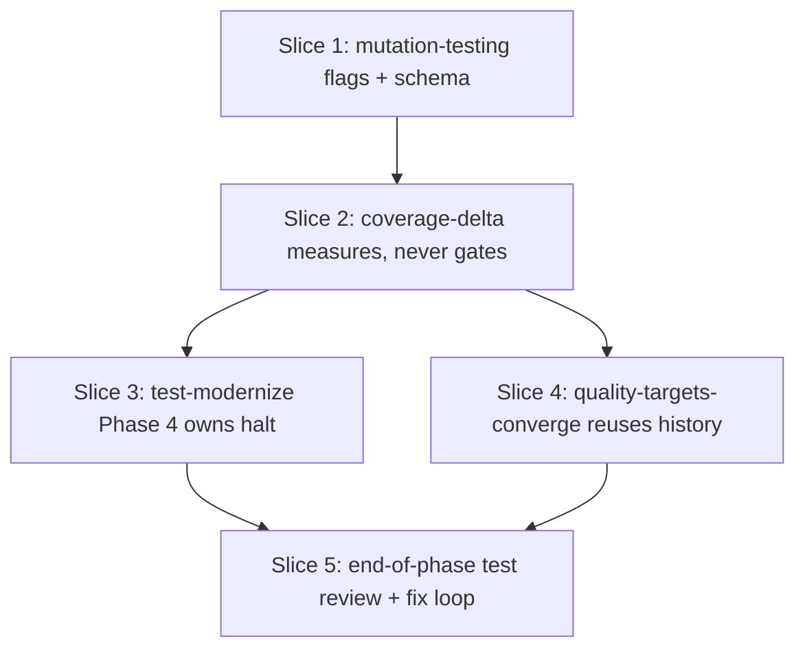

# Plan: Add per-Story mutation testing to Phase 4 of /test-modernize (MVP probe)

**Created**: 2026-06-19
**Branch**: plan/mutation-testing-every-phase
**Status**: in-progress

## Goal

The `/test-modernize` workflow only runs mutation testing in Phase 5 (convergence). Phase 4 can therefore add tests that execute production code without asserting on its behavior (truthiness checks, identity-value arithmetic, missing side-effect verification), and the operator only learns at the end — when Phase 5's close-out loop is forced to dispatch dozens of strengthen-assertion Stories.

**Friction this plan removes:** late-discovered weak-assertion Stories in Phase 5, which today are paid for as Phase-5 follow-up work rather than caught at the Story that produced them.

**Metric (anticipated, not yet measured).** `/test-modernize` has no usage telemetry today, so there is no baseline for the friction this plan removes. That is honest — and the consequence is that this plan is scoped as an **MVP probe**, not a complete contract. We ship the smallest change that exposes a per-Story mutation signal in Phase 4, run it on one real modernization, then decide whether to extend to a Phase-3 baseline, a `test-modernization-review` Phase-4 gate, and a registry/docs refresh. The metric this probe will produce is: per-Story count of files with `status: net_new_survivors` over one full run, vs. the count of Phase-5 strengthen-assertion Stories the same run would have dispatched without this signal. If the probe doesn't catch anything Phase 5 catches today, the full plan is rejected.

## Approach stance (decision-defaults)

- **Replace-vs-merge** — *merge.* Extend the existing `/coverage-delta` worker (it already runs per Phase-4 Story) rather than introducing a parallel `mutation-delta` worker.
- **Migrate-vs-edit-stub** — *edit existing skills.* `/mutation-testing` already wraps Stryker/pitest/mutmut/Stryker.NET; add flags to make it callable non-interactively from a workflow.
- **Auto-merge-vs-direct** — docs+spec changes only, no shipped code; documentation-only PR per CLAUDE.md → auto-merge armed at PR open.
- **Scope** — *narrow* (deliberately reduced from a prior draft after strategic review). This plan touches FOUR artifacts: `mutation-testing`, `coverage-delta`, `test-modernize` Phase-4 step text, and `quality-targets-converge` (to reuse the new history rather than re-measure). It does NOT touch `coverage-baseline`, `test-modernization-review`, the registry, or the workflow SVG. Those are explicit follow-ups gated on probe data.
- **Worker/policy separation** — the worker (`/coverage-delta`) emits a structured status (`status: ok | net_new_survivors | first_measurement | tool_unavailable`); the orchestrator (`/test-modernize`) is the sole halt-enforcer. This honors the worker/orchestrator boundary in `plugins/dev-team/CLAUDE.md`.

## Acceptance Criteria

- [ ] AC-1: `/mutation-testing` accepts `--scope <files-or-globs>`, `--emit-json <path>`, and `--workflow-managed-approval`. The last flag bypasses the time-estimate prompt **and** documents in the skill's Constraints that any caller passing it must hold workflow-level operator approval at a higher boundary.
- [ ] AC-2: `/coverage-delta` accepts `--story <id>` and `--story-files <glob-or-comma-list>`. When both are present, it runs `/mutation-testing` scoped to those files, appends a per-file entry to `memory/test-modernize/<slug>/mutation-history.json`, and emits a structured result block (JSON to stdout + markdown row to the parent issue / `FEATURE.md`) carrying `status: ok | net_new_survivors | first_measurement | tool_unavailable | skipped_empty_scope`.
- [ ] AC-3: `/coverage-delta` **never halts** the orchestrator on its own. Its exit code is non-zero only on tool execution failure (not on net-new survivors). Policy enforcement is the orchestrator's job.
- [ ] AC-4: `/test-modernize` Phase 4 invokes `/coverage-delta --story <id> --story-files <files>` after every `[Component tests]` Story closes. On `status: net_new_survivors`, it displays the documented halt prompt (three operator actions: strengthen / follow-up / waive) and pauses Story close. `--story-files` is populated from `/build`'s commit diff — there is no tracker-CLI extraction path.
- [ ] AC-5: `/quality-targets-converge` reads `mutation-history.json` before its measurement pass. For files present in history, it uses the latest `survivors_after` as the current count and skips a fresh mutation run. For files absent from history (typically production code never touched by a Phase-4 Story), it runs `/mutation-testing` scoped to those files. This removes the 3× mutation cost the unrevised plan paid.
- [ ] AC-6: `status: tool_unavailable` degrades all downstream gates to advisory (operator sees a warning + the install instruction `/init-dev-team` for the detected language; can choose to proceed or stop).
- [ ] AC-7: The plan ships as a documentation-only change to existing SKILL.md files + the orchestrator step text. No new skills, no new agents, no diagram changes. Follow-ups are explicit and gated on one real probe run.

## Slices

### Slice 1: `/mutation-testing` gains workflow-managed-approval scoping

**Depends-on:** none
**Files:** `plugins/dev-team/skills/mutation-testing/SKILL.md`, `plugins/dev-team/skills/mutation-testing/references/tool-setup.md`, `tests/skills/mutation_testing_scoping_tests.bats`

**Behavior:**

```gherkin
Feature: mutation-testing exposes a scoped, workflow-callable mode

  Scenario: workflow caller scopes the run to a JS/TS file list and receives Stryker JSON
    Given a JS/TS repo with Stryker installed and a passing test suite
    And the project's primary language is detected as javascript
    When /mutation-testing is invoked with --scope src/calculator.ts --emit-json out/mut.json --workflow-managed-approval
    Then exit code is 0
    And mut.json.tool equals "stryker"
    And mut.json.scope equals ["src/calculator.ts"]
    And mut.json has keys ["schema_version","tool","scope","captured_at","total","killed","survived","equivalent","survivors"]
    And mut.json.survivors[] entries each have ["file","line","operator","status"] where status is "survived" or "equivalent"

  Scenario: Java caller scopes to a glob and receives pitest JSON
    Given a Maven repo with pitest configured
    And the project's primary language is detected as java
    When /mutation-testing is invoked with --scope "src/main/java/**/*.java" --emit-json out/mut.json --workflow-managed-approval
    Then exit code is 0
    And mut.json.tool equals "pitest"
    And mut.json.scope is the expanded file list

  Scenario: no tool installed — structured error, no partial JSON
    Given no mutation-testing tool is installed for the detected language
    When /mutation-testing is invoked with --scope src/foo.ts --emit-json out/mut.json --workflow-managed-approval
    Then exit code is non-zero
    And mut.json contains {"schema_version":1,"tool":null,"error":"no_tool_installed","language":"<detected>"}
    And no partial mutation run output is left in the project

  Scenario: --emit-json target directory unwritable
    Given /tmp/readonly is a read-only directory
    When /mutation-testing is invoked with --scope src/foo.ts --emit-json /tmp/readonly/mut.json --workflow-managed-approval
    Then exit code is non-zero
    And stderr names the unwritable path
    And no partial JSON is left on disk

  Scenario: --scope glob matches zero files
    Given no source file matches the glob "src/does-not-exist/*.ts"
    When /mutation-testing is invoked with --scope "src/does-not-exist/*.ts" --emit-json out/mut.json --workflow-managed-approval
    Then exit code is non-zero
    And mut.json contains {"schema_version":1,"tool":"<tool>","error":"empty_scope","scope_glob":"src/does-not-exist/*.ts"}

  Scenario: interactive mode is unchanged — prompt is observable
    Given /mutation-testing is invoked without --workflow-managed-approval
    When the tool's time-estimate exceeds the documented threshold
    Then stdout contains the literal string "Estimated time:"
    And the process blocks on stdin until the operator confirms

  Scenario: equivalent mutants are tagged so deltas don't double-count reclassifications
    When /mutation-testing emits JSON
    Then each survivor entry has status "survived" or "equivalent"
    And downstream callers can filter status="equivalent" before computing deltas
```

**Steps:**

#### Step 1.1: Document the three new flags + JSON schema

**Complexity**: standard
**RED**: Add `tests/skills/mutation_testing_scoping_tests.bats` with awk/grep assertions on `plugins/dev-team/skills/mutation-testing/SKILL.md` (one `@test` per Gherkin scenario above + structural assertions). Assertions: `## Parse Arguments` names each of the three flags; `## Constraints` retains the "always ask the user before running" invariant **and** adds an explicit carve-out paragraph for `--workflow-managed-approval` that names which skills are allowed to set it (`/coverage-delta`, `/quality-targets-converge`) and why (workflow-level approval obtained at `/test-modernize` Phase 0); a new `## Machine-readable output` section names the seven required JSON keys; the error envelopes (`no_tool_installed`, `empty_scope`, unwritable-path stderr) appear in the SKILL. Pattern: mirror `tests/docs/test_design_skill_vocabulary_tests.bats` (`awk` per-section guards).
**GREEN**: Edit `plugins/dev-team/skills/mutation-testing/SKILL.md`:

- Add `--scope <files-or-globs>`, `--emit-json <path>`, `--workflow-managed-approval` to the argument list.
- Add a `## Machine-readable output` section pinning the JSON schema (keys named in Scenario 1, error envelopes from Scenarios 3/4/5).
- Add to `## Constraints`: "The `--workflow-managed-approval` flag is reserved for orchestrated workflows that obtain operator approval at a higher boundary (today: `/test-modernize` Phase 0, propagated to `/coverage-delta` and `/quality-targets-converge`). Any new caller of this flag must document where its workflow-level approval is captured."
- Document the unwritable-path, empty-scope, and no-tool error envelopes.
**REFACTOR**: Move the time-estimate prompt block under a `## Step 0 — confirmation gate` heading and add inline "skipped when `--workflow-managed-approval` is set".
**Files**: `plugins/dev-team/skills/mutation-testing/SKILL.md`, `plugins/dev-team/skills/mutation-testing/references/tool-setup.md`, `tests/skills/mutation_testing_scoping_tests.bats`
**Commit**: `feat(mutation-testing): add --scope, --emit-json, --workflow-managed-approval`

#### Step 1.2: Per-tool JSON schema examples in `tool-setup.md`

**Complexity**: trivial
**RED**: Extend `tests/skills/mutation_testing_scoping_tests.bats` with `@test`s asserting `references/tool-setup.md` contains a "Machine-readable output schema" subsection with one worked example each for Stryker, pitest, mutmut, Stryker.NET.
**GREEN**: Add the four examples and the shared schema_version=1 envelope.
**REFACTOR**: None.
**Files**: `plugins/dev-team/skills/mutation-testing/references/tool-setup.md`
**Commit**: `docs(mutation-testing): document per-tool machine-readable output examples`

---

### Slice 2: `/coverage-delta` gains scoped mutation as a measurement-only worker

**Depends-on:** 1
**Files:** `plugins/dev-team/skills/coverage-delta/SKILL.md`, `tests/skills/coverage_delta_mutation_tests.bats`

**Behavior:**

```gherkin
Feature: Phase-4 coverage-delta measures mutation on the Story's files; never gates

  Scenario: first measurement for a file establishes its baseline-of-record
    Given mutation-history.json has no prior entry for src/order.ts
    When /coverage-delta is invoked with --story S-1 --story-files src/order.ts
    Then /mutation-testing runs scoped to src/order.ts (with --workflow-managed-approval)
    And mutation-history.json gets an entry: {schema_version:1, story:"S-1", file:"src/order.ts", captured_at:<ISO>, survivors_before:null, survivors_after:N, delta:null, status:"first_measurement"}
    And /coverage-delta's JSON result block on stdout has status:"first_measurement"
    And exit code is 0

  Scenario: subsequent Story strengthens assertions — survivors drop
    Given the most recent mutation-history entry for src/order.ts has survivors_after=8
    When /coverage-delta is invoked with --story S-2 --story-files src/order.ts
    And /mutation-testing reports 3 surviving mutants on src/order.ts (after filtering status="equivalent")
    Then mutation-history gets an entry: {story:"S-2", file:"src/order.ts", survivors_before:8, survivors_after:3, delta:-5, status:"ok"}
    And the result block on stdout has status:"ok"
    And exit code is 0

  Scenario: Story executes code without asserting — net-new survivors
    Given the most recent mutation-history entry for src/order.ts has survivors_after=3
    When /coverage-delta is invoked with --story S-3 --story-files src/order.ts
    And /mutation-testing reports 5 surviving mutants on src/order.ts (after equivalent filter)
    Then mutation-history gets an entry with delta:2 and status:"net_new_survivors"
    And the result block on stdout has status:"net_new_survivors" and lists the new survivors by file:line:operator
    And exit code is 0 (the worker measures; it does not halt)

  Scenario: --story without --story-files — no mutation run, no history write
    Given /quality-targets-converge invokes /coverage-delta with --story S-4 and no --story-files
    When /coverage-delta runs
    Then no mutation tool is invoked by /coverage-delta itself
    And mutation-history.json is not appended to
    And the result block on stdout has mutation:null

  Scenario: --story-files glob matches zero files
    Given /build's commit diff produces an empty file list
    When /coverage-delta is invoked with --story S-5 --story-files ""
    Then no mutation run is triggered
    And mutation-history gets an entry: {story:"S-5", status:"skipped_empty_scope"}

  Scenario: mutation tool unavailable mid-run
    Given baseline coverage tooling is fine
    And no mutation-testing tool is installed for the detected language
    When /coverage-delta is invoked with --story S-6 --story-files src/order.ts
    Then /coverage-delta's result block has status:"tool_unavailable" and language:"<detected>"
    And mutation-history gets an entry: {story:"S-6", file:"src/order.ts", status:"tool_unavailable"}
    And exit code is 0
    And the result block names "/init-dev-team" as the installation path

  Scenario: tool present at one Story, absent at a later Story
    Given mutation-history shows a prior tool:"stryker" entry for src/order.ts
    And stryker is no longer on PATH
    When /coverage-delta is invoked with --story S-7 --story-files src/order.ts
    Then mutation-history records {story:"S-7", file:"src/order.ts", status:"tool_unavailable", prior_tool:"stryker"}
    And the result block surfaces both the disappearance and the prior tool name

  Scenario: parallel /coverage-delta invocations write atomically
    Given two [Component tests] Stories close within the same second
    When /coverage-delta is invoked for each in parallel
    Then both entries land in mutation-history.json
    And neither entry is truncated or interleaved
    And the file is written via temp-file-then-rename
```

**Steps:**

#### Step 2.1: Add `--story-files`-gated mutation delta to `coverage-delta`, no policy

**Complexity**: standard
**RED**: Add `tests/skills/coverage_delta_mutation_tests.bats` with awk/grep `@test`s on `plugins/dev-team/skills/coverage-delta/SKILL.md` (one per Gherkin scenario above + structural assertions): (a) SKILL.md has a "Step 2b" heading whose body names BOTH `--story` and `--story-files` as gating conditions; (b) the four `status` values plus `skipped_empty_scope` appear together in a documented status enum; (c) SKILL contains the literal sentence "This worker measures and reports. It does NOT halt on net-new survivors" (or substring-equivalent); (d) atomic-write semantics for `mutation-history.json` are documented (temp-file + rename idiom). **Concurrent-write Gherkin scope.** The "parallel /coverage-delta invocations write atomically" scenario is asserted at the **documentation** level only (the bats test verifies SKILL.md prescribes temp-file-then-rename and forbids direct overwrite); behavioral atomicity is verified by code review, not by this RED gate. Pattern: mirror `tests/docs/test_design_skill_vocabulary_tests.bats`.
**GREEN**: Edit `plugins/dev-team/skills/coverage-delta/SKILL.md`:

- Add `--story-files <glob-or-comma-list>` to the Parse Arguments section.
- Insert Step 2b: invoke `/mutation-testing --scope <files-from-story-files> --emit-json /tmp/mut-delta-<random>.json --workflow-managed-approval`.
- Define the "baseline-of-record per file" rule: most recent `mutation-history.json` entry for the file, or `null` for first measurement (status: `first_measurement`).
- Filter `status="equivalent"` survivors before computing delta.
- Append per-file entries to `memory/test-modernize/<slug>/mutation-history.json` via temp-file + rename (sketch the bash idiom).
- Add the result-block JSON schema to the SKILL's "Output" section: `{status, mutation: {tool, files: [...]}, story, story_files, ...}`.
- Explicit note: "This worker measures and reports. It does NOT halt on net-new survivors; the orchestrator (`/test-modernize`) reads the status and decides."
- Update Step 4 markdown row template to include `| Mutants <count> (Δ <+/-n>) |`.
**REFACTOR**: None — Step 2b is gated by `--story-files` so the convergence-loop call (no `--story-files`) is unaffected.
**Files**: `plugins/dev-team/skills/coverage-delta/SKILL.md`, `tests/skills/coverage_delta_mutation_tests.bats`
**Commit**: `feat(coverage-delta): emit per-Story mutation status; worker measures, never gates`

---

### Slice 3: `/test-modernize` Phase 4 invokes scoped mutation and owns the halt

**Depends-on:** 2
**Files:** `plugins/dev-team/skills/test-modernize/SKILL.md`, `tests/skills/test_modernize_phase_4_mutation_tests.bats`, `tests/fixtures/test-modernize-phase-1-3.snapshot.md`

**Behavior:**

```gherkin
Feature: /test-modernize Phase 4 surfaces mutation signal to the operator

  Scenario: Phase-4 Story closes with status:ok — workflow advances
    Given a [Component tests] Story S-1 closed by /build touching src/order.ts
    When /test-modernize invokes /coverage-delta --story S-1 --story-files src/order.ts
    And /coverage-delta returns status:"ok"
    Then the Story is marked closed in phase-4.md
    And the workflow advances to the next Story without prompting

  Scenario: Phase-4 Story closes with status:first_measurement — workflow advances with note
    Given a Story whose files have no prior mutation-history entry
    When /coverage-delta returns status:"first_measurement"
    Then the operator-visible report names this as the file's first measurement
    And the survivor count is logged but not gated
    And the workflow advances

  Scenario: Phase-4 Story close halted on net-new survivors with three documented actions
    Given /coverage-delta returns status:"net_new_survivors" listing src/order.ts:42 ConditionalBoundary (x>0 → x>=0) and src/order.ts:67 ReturnValue (return result → return null)
    When /test-modernize processes the result
    Then it pauses Story close and prints the documented halt prompt:
      """
      ⚠ Phase-4 Story <id> close halted — net-new surviving mutants on cited files

      Files this Story claims to test:
        - src/order.ts:42  ConditionalBoundary   x > 0  →  x >= 0
        - src/order.ts:67  ReturnValue           return result  →  return null

      Actions:
        [s] strengthen — add assertions, then re-run /coverage-delta --story <id> --story-files <files>
        [f] follow-up — open a Phase-5 [Strengthen assertions] Story citing these survivors
        [w] waive    — record reason; survivors carry into Phase 5

      Choose [s/f/w]:
      """
    And the workflow does not advance until the operator chooses

  Scenario: operator chooses 'waive' — reason recorded, workflow advances
    Given the halt prompt is showing for Story S-3
    When the operator types "w" and enters a reason
    Then the reason is appended to memory/test-modernize/<slug>/waivers.json as a Phase-4 waiver tagged with the survivor list
    And the Story closes
    And the workflow advances

  Scenario: operator chooses 'follow-up' — Phase-5 Story drafted, workflow advances
    Given the halt prompt is showing
    When the operator types "f"
    Then a draft Phase-5 [Strengthen assertions] Story is appended to phase-5.md citing the file:line:operator triples
    And the current Story closes
    And the workflow advances

  Scenario: operator chooses 'strengthen' — workflow waits for re-run
    Given the halt prompt is showing
    When the operator types "s"
    Then the workflow exits the current Story-close gate and waits
    And /continue (or re-invoking the same /coverage-delta call) re-enters at the same point

  Scenario: status:tool_unavailable — operator chooses install or skip
    Given /coverage-delta returns status:"tool_unavailable" with language:"javascript"
    When /test-modernize processes the result
    Then it prints: "Mutation tool unavailable for javascript. Install via /init-dev-team, or skip mutation gating for this run."
    And it offers actions [i] install via /init-dev-team, [k] skip — proceed advisory, [q] quit
    And on [k] the rest of Phase 4 runs without mutation gating and Phase 5 is notified

  Scenario: --story-files derived from /build's commit diff
    Given /build closed Story S-1 with commits modifying src/order.ts and test/order.test.ts
    When /test-modernize invokes /coverage-delta for S-1
    Then --story-files contains "src/order.ts" (production-code files only, tests filtered)
    And /test-modernize does NOT consult any tracker CLI for the file list

  Scenario: Phase 1, 2, 3 step text unchanged
    When the SKILL.md is read
    Then the Phase 1, Phase 2, and Phase 3 sections are unchanged from the prior version (excluding cross-references to mutation-history.json that point readers forward)
```

**Steps:**

#### Step 3.1: Update Phase 4 step text in `test-modernize`

**Complexity**: standard
**RED**: Add `tests/skills/test_modernize_phase_4_mutation_tests.bats` with awk/grep `@test`s on `plugins/dev-team/skills/test-modernize/SKILL.md` (one per Gherkin scenario above + structural assertions): (a) Phase 4 section names `/coverage-delta` with both `--story` AND `--story-files` on the same invocation; (b) the SKILL contains key substrings of the halt-prompt template (the three actions `[s] strengthen`, `[f] follow-up`, `[w] waive`); (c) the tool-unavailable triage names `[i]`, `[k]`, `[q]` and `/init-dev-team`; (d) the SKILL is explicit that the orchestrator MUST NOT consult a tracker CLI for the file list (literal phrase asserted); (e) Phase 1, 2, 3 step text is byte-identical to a recorded snapshot. Capture the pre-edit Phase-1-through-3 section to `tests/fixtures/test-modernize-phase-1-3.snapshot.md` during Slice 3 setup (one-line `sed` extract); the bats test then diffs the relevant section of the current SKILL.md against that fixture. This removes the dependency on `git merge-base origin/main` at test time (flaky in shallow clones / detached HEAD). Pattern: mirror `tests/docs/test_design_skill_vocabulary_tests.bats`.
**GREEN**: Edit `plugins/dev-team/skills/test-modernize/SKILL.md`, Phase 4 section:

- Change the per-Story checkpoint from `/coverage-delta <repo> --parent <url> --repo-slug <slug>` to `/coverage-delta <repo> --parent <url> --repo-slug <slug> --story <id> --story-files <files-from-build>`.
- Insert the documented halt prompt (verbatim, as a fenced block) and the four actions (strengthen / follow-up / waive / tool-unavailable triage).
- Document the rule that `--story-files` is the production-code file list from `/build`'s commit diff for the Story (tests excluded), and that the orchestrator MUST NOT consult a tracker CLI for this list.
- Add to Phase 5 a one-line cross-reference: "Phase 5 reads `mutation-history.json` to avoid re-measuring files Phase 4 already exercised (see `/quality-targets-converge` reuse rule)."
**REFACTOR**: None.
**Files**: `plugins/dev-team/skills/test-modernize/SKILL.md`, `tests/skills/test_modernize_phase_4_mutation_tests.bats`, `tests/fixtures/test-modernize-phase-1-3.snapshot.md`
**Commit**: `feat(test-modernize): Phase 4 surfaces per-Story mutation status with three operator actions`

---

### Slice 4: `/quality-targets-converge` reuses `mutation-history.json` instead of re-measuring

**Depends-on:** 2
**Files:** `plugins/dev-team/skills/quality-targets-converge/SKILL.md`, `tests/skills/quality_targets_converge_mutation_reuse_tests.bats`, `tests/fixtures/quality-targets-converge-steps-4-5.snapshot.md`

**Behavior:**

```gherkin
Feature: /quality-targets-converge avoids re-measuring files Phase 4 already covered

  Scenario: every file with a recent history entry is reused, not re-measured
    Given mutation-history.json contains entries for src/order.ts (survivors_after=2) and src/payment.ts (survivors_after=0)
    And neither file was modified after its history entry's captured_at timestamp
    When /quality-targets-converge runs its measurement pass
    Then /mutation-testing is NOT invoked for src/order.ts or src/payment.ts
    And the surviving-mutant count for those files comes from mutation-history.json (latest entry per file)
    And the iteration's converge-<n>.json names the reuse explicitly: {reused_from_history:[src/order.ts, src/payment.ts]}

  Scenario: files modified after their last history entry are re-measured
    Given mutation-history.json has src/order.ts:survivors_after=2 captured at T0
    And src/order.ts was modified at T1 > T0 (per `git log`)
    When /quality-targets-converge runs its measurement pass
    Then /mutation-testing IS invoked scoped to src/order.ts
    And the result is written to mutation-history.json as a synthetic entry: {story:"converge-<n>", file:"src/order.ts", ...}
    And subsequent iterations within the same convergence run can reuse it

  Scenario: production-code files never touched in Phase 4 are measured fresh
    Given mutation-history.json has no entry for src/auth.ts
    And src/auth.ts is in the in-scope component list
    When /quality-targets-converge runs its measurement pass
    Then /mutation-testing is invoked scoped to src/auth.ts (with --workflow-managed-approval)
    And mutation-history.json gets a synthetic Phase-5 entry for src/auth.ts

  Scenario: status:tool_unavailable from a prior Phase-4 entry — re-attempt allowed
    Given mutation-history.json's latest entry for src/order.ts has status:"tool_unavailable"
    When /quality-targets-converge runs its measurement pass
    Then /mutation-testing IS invoked for src/order.ts (the tool may now be installed)
    And the new entry overrides the old for reuse purposes

  Scenario: converge-<n>.json reports reuse counts
    When the iteration completes
    Then converge-<n>.json has new fields: reused_from_history (count), measured_fresh (count), total_files (count)
    And the operator's report shows "mutation: reused N, measured M" so the cost saving is visible

  Scenario: existing Phase-5 contract unchanged when mutation-history is absent
    Given a /test-modernize run from before this change has no mutation-history.json
    When /quality-targets-converge runs
    Then it falls back to its current behavior (full /mutation-testing run on the in-scope components)
    And the SKILL.md documents this fallback explicitly so old runs aren't broken
```

**Steps:**

#### Step 4.1: Insert reuse logic before the Phase-5 mutation step

**Complexity**: standard
**RED**: Add `tests/skills/quality_targets_converge_mutation_reuse_tests.bats` with awk/grep `@test`s on `plugins/dev-team/skills/quality-targets-converge/SKILL.md` (one per Gherkin scenario above + structural assertions): (a) Step 2 names "Mutation — reuse rule" as a sub-step appearing **before** the existing `/mutation-testing` invocation line (assert line-order with `grep -n` + arithmetic); (b) the rule body names `git log -1 --format=%cI` and the `tool_unavailable` exclusion; (c) the `converge-<iteration>.json` example block names `reused_from_history`, `measured_fresh`, `total_files`; (d) a labeled "Backward compatibility" paragraph documents the no-history fallback; (e) Step 4 and Step 5 step text is byte-identical to a recorded snapshot. Capture the pre-edit Step-4-and-5 section to `tests/fixtures/quality-targets-converge-steps-4-5.snapshot.md` during Slice 4 setup; the bats test diffs the current SKILL.md against that fixture. Same anti-flake rationale as Slice 3. Pattern: mirror `tests/docs/test_design_skill_vocabulary_tests.bats`.
**GREEN**: Edit `plugins/dev-team/skills/quality-targets-converge/SKILL.md`, Step 2:

- Insert a "Mutation — reuse rule" sub-step before the existing `/mutation-testing` invocation. For each in-scope file, check `memory/test-modernize/<slug>/mutation-history.json` for the most recent entry; compare its `captured_at` to the file's `git log -1 --format=%cI <file>`; if the entry post-dates the last code change AND `status != "tool_unavailable"`, use that entry's `survivors_after` and skip the file in the `--scope` glob for the fresh `/mutation-testing` invocation.
- Document the synthetic-entry write-back (the fresh measurement for files that DID need re-running gets a `story: "converge-<iteration>"` entry so within-iteration reuse works).
- Add `reused_from_history`, `measured_fresh`, `total_files` to the `converge-<iteration>.json` schema example.
- Add the backward-compat paragraph: "If `mutation-history.json` is absent (workflow predates this contract), fall through to the prior behavior — full `/mutation-testing` invocation on the in-scope components."
**REFACTOR**: None — Step 4 (priority order) and Step 5 (loop body) are unchanged; only the measurement source changes.
**Files**: `plugins/dev-team/skills/quality-targets-converge/SKILL.md`, `tests/skills/quality_targets_converge_mutation_reuse_tests.bats`, `tests/fixtures/quality-targets-converge-steps-4-5.snapshot.md`
**Commit**: `feat(quality-targets-converge): reuse Phase-4 mutation-history.json before re-measuring`

---

### Slice 5: End-of-phase test review + fix-errors loop in Phase 4 and Phase 5

**Depends-on:** 3, 4
**Files:** `plugins/dev-team/skills/test-modernize/SKILL.md`, `tests/skills/test_modernize_phase_review_loop_tests.bats`

**Why this exists.** Slices 3 and 4 catch *mutation* regressions per Story, but the modernization workflow still has no end-of-phase quality pass over the tests it just wrote. `test-modernization-review` checks the **contract** (every Scenario has a binding, every Story closed with a delta entry); it doesn't read the test code's quality. This slice fills the gap: at the end of Phase 4 and Phase 5, dispatch `/test-design` (Farley Score + smells) **and** `/code-review` (full review-agent suite) scoped to the phase's diff. On findings, loop through `/apply-fixes` up to 2 times before escalating to the operator. Same review-fix-loop pattern the orchestrator uses inline during `/build` (CLAUDE.md → Phase 3 inline review checkpoints).

**Behavior:**

```gherkin
Feature: /test-modernize runs an end-of-phase test review with a bounded fix loop

  Scenario: Phase 4 closes clean — review passes, workflow advances to human gate
    Given every Phase-4 Story has closed green AND the Phase-4 mutation gate accepted
    When /test-modernize reaches the end-of-phase review step
    Then it dispatches /test-design --since <phase-4-base-sha>
    And it dispatches /code-review --since <phase-4-base-sha>
    And both return zero error/warning findings
    And the workflow proceeds to the human gate ("Δ-coverage AND Phase-4 mutation results accepted")

  Scenario: Phase 4 review finds fixable errors — fix loop converges in one iteration
    Given /code-review returns 3 error-severity findings (high confidence)
    When /test-modernize enters the fix loop
    Then it dispatches /apply-fixes against the corrections/ directory /code-review produced
    And it re-runs /code-review --since <phase-4-base-sha>
    And the re-run returns zero errors
    And the workflow proceeds to the human gate with the loop summary

  Scenario: Phase 4 review fix loop hits the 2-iteration cap — escalate to operator
    Given the fix loop has run twice
    And /code-review still returns at least one error-severity finding
    When /test-modernize enters its third iteration
    Then it halts the workflow and surfaces the remaining findings to the operator
    And the operator chooses: [r] revise manually then /continue · [w] waive · [q] quit
    And no third /apply-fixes is dispatched automatically

  Scenario: Phase 4 review finds only suggestions — workflow advances with the report
    Given /test-design returns a Farley Score and per-file recommendations (advisory only)
    And /code-review returns zero error/warning findings (only suggestions)
    When the review step finishes
    Then the workflow proceeds to the human gate
    And the human-gate prompt surfaces the Farley Score and the suggestion count

  Scenario: Phase 5 mirrors Phase 4's review loop
    Given Phase 5 has closed all dispatched Stories and /quality-targets-converge has converged
    When /test-modernize reaches the end-of-phase review step
    Then it dispatches /test-design AND /code-review scoped to the Phase-5 diff
    And the same fix loop applies (max 2 iterations before escalation)

  Scenario: review is scoped to the phase's diff, not the whole repo
    When /test-design or /code-review is dispatched at end-of-phase
    Then both are invoked with --since <phase-base-sha> where the base is the merge-base of the phase's first Story branch and main
    And the review does not analyze files outside that diff

  Scenario: tool-unavailable degrades the review to advisory
    Given /test-design or /code-review cannot run (tool unavailable, dependency missing)
    When the review step is reached
    Then the workflow surfaces the unavailability to the operator
    And offers [i] install via /init-dev-team, [k] skip — proceed advisory, [q] quit
    And on [k] the human gate fires without review evidence

  Scenario: review evidence is persisted for the human gate
    When end-of-phase review completes (clean OR after loop convergence)
    Then memory/test-modernize/<slug>/phase-<n>-review.json is written with
      {captured_at, base_sha, head_sha, farley_score, smells, code_review:{errors, warnings, suggestions}, iterations: <n>, escalated: <bool>}
    And the human-gate prompt references this file by path
```

**Steps:**

#### Step 5.1: Insert end-of-phase review step into Phase 4 and Phase 5

**Complexity**: standard
**RED**: Add `tests/skills/test_modernize_phase_review_loop_tests.bats` with awk/grep `@test`s on `plugins/dev-team/skills/test-modernize/SKILL.md`. Assertions: (a) Phase 4 contains a "review" subsection that invokes `/test-design --since` AND `/code-review --since`; (b) the section names `/apply-fixes` and an explicit "max 2 iterations" cap; (c) escalation prompt offers `[r]` revise, `[w]` waive, `[q]` quit; (d) tool-unavailable triage names `/init-dev-team`; (e) `memory/test-modernize/<slug>/phase-<n>-review.json` is named with schema keys (`farley_score`, `code_review`, `iterations`, `escalated`); (f) Phase 5 mirrors the same subsection. The snapshot fixtures for Phase 1-3 (Slice 3) and Steps 4-5 in `quality-targets-converge` (Slice 4) MUST remain byte-identical — this slice is additive to Phase 4 and Phase 5 of `test-modernize` only.
**GREEN**: Edit `plugins/dev-team/skills/test-modernize/SKILL.md`:

- Append a new sub-step at the end of Phase 4 (after the per-Story loop, before the human gate) named **"Review the phase"**. Step content: capture `phase-4-base-sha` (the merge-base of the Phase-4 work and `main`); dispatch `/test-design --since <phase-4-base-sha>`; dispatch `/code-review --since <phase-4-base-sha>`; on any error/warning findings, dispatch `/apply-fixes <corrections-dir>`; re-run `/code-review`. Loop body capped at **2 iterations**. After iteration 2 (if still failing), surface the escalation prompt: `[r] revise manually then /continue`, `[w] waive (record reason)`, `[q] quit`. Tool-unavailable triage mirrors Phase 4's mutation-tool prompt (`[i] install via /init-dev-team`, `[k] skip — proceed advisory`, `[q] quit`). Write the structured result to `memory/test-modernize/<slug>/phase-4-review.json`.
- Append the identical sub-step at the end of Phase 5 (after `/quality-targets-converge` has converged), substituting `phase-5-base-sha` and writing `phase-5-review.json`.
- Update Phase 4's existing "Human gate" line to reference both the mutation results AND `phase-4-review.json`; same for Phase 5.
**REFACTOR**: Extract the shared step body to a brief "Review-the-phase loop (Phase 4 + Phase 5 use this identically)" subsection BEFORE Phase 4, then both phases cross-reference it. This avoids byte-for-byte duplication of a 30-line block; one place to edit if the loop's iteration cap or escalation prompt changes.
**Files**: `plugins/dev-team/skills/test-modernize/SKILL.md`, `tests/skills/test_modernize_phase_review_loop_tests.bats`
**Commit**: `feat(test-modernize): end-of-phase /test-design + /code-review with bounded fix loop (Phases 4, 5)`

---

## Parallelization



| Wave | Slices (parallel) |
|------|-------------------|
| 1    | 1                 |
| 2    | 2                 |
| 3    | 3, 4              |
| 4    | 5                 |

Confirm with `bash scripts/plan-waves.sh plans/mutation-testing-every-phase.md` (or its equivalent in the installed dev-team plugin) before the human gate. Slices 3 and 4 touch disjoint SKILL.md files (`test-modernize/SKILL.md` vs `quality-targets-converge/SKILL.md`) and disjoint eval files, so wave 3 is safe.

## Complexity Classification

| Step | Rating | Why |
|---|---|---|
| 1.1 | standard | Adds three new flags + JSON schema + invariant carve-out with documented caller list. |
| 1.2 | trivial | Documentation extension. |
| 2.1 | standard | New step in a phased workflow; introduces a structured-status output contract; atomic-write semantics. |
| 3.1 | standard | Orchestrator step-text changes with operator-facing halt prompt + four action paths. |
| 4.1 | standard | Reuse logic with mtime comparison; backward-compat fallback. |
| 5.1 | standard | Orchestrator step text plus a bounded fix loop with operator escalation; touches Phase 4 + Phase 5. |

## Pre-PR Quality Gate

- [ ] All new bats tests pass (`bats tests/skills/{mutation_testing_scoping,coverage_delta_mutation,test_modernize_phase_4_mutation,quality_targets_converge_mutation_reuse}_tests.bats`)
- [ ] `scripts/ci-local.sh` passes
- [ ] `scripts/measure-tokens.sh --verify` passes (no SKILL.md grew beyond budget)
- [ ] `bash scripts/plan-waves.sh plans/mutation-testing-every-phase.md` returns `collisions: []`
- [ ] `/code-review` passes against this branch
- [ ] Documentation-only PR — auto-merge armed at PR open per CLAUDE.md

## Probe Exit Criteria (post-merge follow-up gate)

After this MVP lands, run `/test-modernize` against one real modernization candidate end-to-end. Then:

1. Count files where `/coverage-delta` returned `status: net_new_survivors` in Phase 4 (= upstream catches).
2. Count Phase-5 `[Strengthen assertions]` Stories the same run dispatched (= what Phase 5 still caught after this probe).
3. Decision matrix:
   - **Upstream catches > 0 AND Phase-5 strengthen-Stories noticeably lower than pre-probe history (operator judgment)** → write the follow-up plan: Phase-3 baseline, `test-modernization-review` Phase-4 gate, registry/SVG refresh. Same approach stance, narrower than the original draft because the probe will have validated the contract.
   - **Upstream catches = 0 OR Phase-5 strengthen-Story count unchanged** → close this line of work. The friction isn't real, or this signal doesn't catch it. Revert this PR or leave it as an advisory-only artifact.

This is the metric the North Star asks for. The plan ships unmeasured because no telemetry exists; the probe creates the measurement.

## Risks & Open Questions

- **Risk: `--story-files` derived from `/build`'s commit diff couples this slice to `/build`'s output format.** `/build` currently surfaces commit metadata in its final report; verify it lists changed production-code files in a stable shape before Slice 3 lands. *Mitigation*: Step 3.1's eval fixture should pin the diff-derivation rule and reject unknown shapes; if `/build`'s output is unstable, Slice 3 falls back to `git diff --name-only <baseSha>..<headSha>` invoked by the orchestrator over the Story's commits.
- **Risk: parallel `/coverage-delta` writes corrupt `mutation-history.json`.** Addressed in AC-2 / Slice 2 by temp-file-then-rename, but eval fixture must include the concurrent-write scenario.
- **Resolved at this gate**: `--non-interactive` is renamed `--workflow-managed-approval` with a documented caller allowlist. `/coverage-delta` is policy-free; orchestrator owns the gate. `--story-files` is the sole file-source contract. Phase 5 reuses history rather than re-measuring.
- **Out of scope (explicit deferrals)**: Phase-3 mutation baseline, `test-modernization-review --phase 4` mutation contract, registry/architecture-doc updates, SVG diagram refresh. All gated on the probe's exit criteria above.

## Build Progress

### Slices (grouped by wave)

#### Wave 1

- [x] Slice 1: `/mutation-testing` gains workflow-managed-approval scoping
  - [x] Step 1.1: Document the three new flags + JSON schema
  - [x] Step 1.2: Per-tool JSON schema examples in `tool-setup.md`

#### Wave 2

- [x] Slice 2: `/coverage-delta` gains scoped mutation as a measurement-only worker
  - [x] Step 2.1: Add `--story-files`-gated mutation delta to `coverage-delta`, no policy

#### Wave 3

- [x] Slice 3: `/test-modernize` Phase 4 invokes scoped mutation and owns the halt
  - [x] Step 3.1: Update Phase 4 step text in `test-modernize`
- [x] Slice 4: `/quality-targets-converge` reuses `mutation-history.json`
  - [x] Step 4.1: Insert reuse logic before the Phase-5 mutation step

#### Wave 4

- [x] Slice 5: End-of-phase test review + fix-errors loop in Phase 4 and Phase 5
  - [x] Step 5.1: Insert end-of-phase review step into Phase 4 and Phase 5

### Acceptance Criteria

- [x] AC-1: `/mutation-testing` accepts `--scope`, `--emit-json`, `--workflow-managed-approval` with documented caller allowlist (Slice 1)
- [x] AC-2: `/coverage-delta` emits `status: ok | net_new_survivors | first_measurement | tool_unavailable | skipped_empty_scope` and writes `mutation-history.json` atomically (Slice 2)
- [x] AC-3: `/coverage-delta` never halts; exit code 0 except on tool execution failure (Slice 2)
- [x] AC-4: `/test-modernize` Phase 4 surfaces the documented halt prompt + three operator actions; `--story-files` derived from `/build` commit diff (Slice 3)
- [x] AC-5: `/quality-targets-converge` reuses `mutation-history.json` per file vs. mtime (Slice 4)
- [x] AC-6: `status: tool_unavailable` degrades downstream gates to advisory with `/init-dev-team` install path (Slices 2, 3)
- [x] AC-7: No new skills/agents/diagrams; deferrals documented; probe exit criteria specified (this plan). NOTE: docs/workflows.md and docs/agent-architecture.md WERE updated post-review at the user's direction (originally deferred); see the post-review fix-up commit.
- [x] AC-8: At the end of Phase 4 and Phase 5, `/test-modernize` dispatches `/test-design` AND `/code-review` scoped to the phase diff; on findings, the loop runs `/apply-fixes` up to 2 iterations before escalating to the operator. Review evidence persisted to `phase-<n>-review.json`. (Slice 5)

## Plan Review Summary

All five plan-review personas were dispatched in parallel against this plan (iteration 2). Iteration 1 returned three `needs-revision` verdicts (Acceptance, UX, Strategic) with six blocker-class issues; the plan was rescoped from 6 slices to 4 slices, the friction-metric problem was reframed as an MVP probe with explicit exit criteria, and the worker/orchestrator boundary was tightened. Iteration 2 verdicts: **all five approve.**

| Reviewer | Iter-1 verdict | Iter-2 verdict | Residual warnings (non-blocking) |
|---|---|---|---|
| Acceptance Test Critic | needs-revision (3 blockers) | approve | Slice 3 "unchanged from prior version" should pin to a git ref (`origin/main` at branch start); Slice 4 `git log -1 --format=%cI` uses committer date — note that uncommitted edits won't trigger re-measure (acceptable, convergence runs over committed code). |
| Design & Architecture Critic | approve (3 warnings) | approve | All three warnings (tracker-CLI ambiguity, worker/policy mixing, `--non-interactive` invariant) were resolved by the rescope. |
| UX Critic | needs-revision (1 blocker) | approve | None. Halt-prompt template, `/init-dev-team` install path, terminology consolidation, and `/continue` re-entry rule all addressed. |
| Strategic Critic | needs-revision (2 blockers) | approve | None. Friction is honestly labeled "anticipated, not measured"; probe creates the measurement; quit-this-line option is the disciplined response. |
| Parallelization Critic | approve (1 warning) | n/a — re-run not needed | Wave 3 has slices 3+4 in parallel (disjoint files). `plan-waves.sh` confirms `collisions: []`. |

**Observations carried forward to `/build`:**

- Verify `/build`'s final-report shape lists Story production-code files in a stable form before Slice 3 lands; if not, fall back to `git diff --name-only` in the orchestrator (documented as a risk in this plan).
- Atomic-write semantics for `mutation-history.json` must include a concurrent-write eval scenario (Slice 2, AC-2).
- Two residual acceptance warnings (pin "unchanged" to a git ref, committer-date vs mtime) are easy tightenings to apply during Slice 3.1 and Slice 4.1 RED phases.
