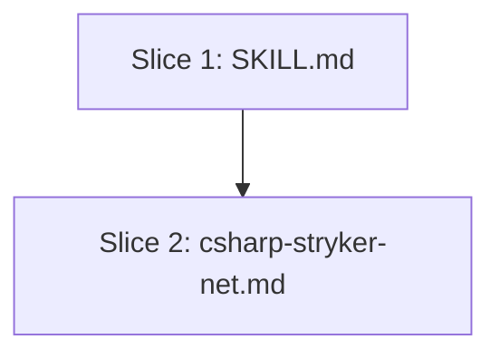

# Plan: Honest Mutation Score & Survivor Triage (issue #521)

**Created**: 2026-07-01
**Branch**: `Issue-521`
**Status**: approved
**Spec**: [docs/specs/mutation-testing-honest-score-and-triage.md](../docs/specs/mutation-testing-honest-score-and-triage.md)

## Goal

Make the `mutation-testing` skill report an honest mutation score, warn when
timeouts have corrupted the headline number, name `NoCoverage` as a first-class
triage category (prioritized above survivors), teach type-aware survivor
triage, and give the operator probe-file selection guidance so the first
Stryker run against a repo produces signal, not a CompileError smoke plume.
Skill-content-only diff: `SKILL.md` and `csharp-stryker-net.md`. No adapter
script changes; JSON schema stays at `schema_version: 1` (additive).

## Approach Stances (high-reversal-cost axes)

Per `knowledge/decision-defaults.md`:

- **Replace vs merge**: **merge in place** — edit the existing `SKILL.md` and `csharp-stryker-net.md` rather than regenerating. Both files carry recent, unrelated shipping content that must be preserved.
- **Scope**: **narrow — two files, six additions**. No sibling language KBs touched (per stakeholder answer). No adapter shells touched (per spec architecture).
- **Auto-merge vs direct**: **auto-merge armed at PR open** (`gh pr merge <num> --auto --squash`). This overrides the CLAUDE.md default that reserves auto-merge for pure `*.md` in docs-only paths — the diff is markdown-only but touches shipping skill content. Recorded in Ambiguity Log AL-3 of the spec; the human already sees the override here.
- **Format fidelity**: preserve heading levels, bash-fence conventions, table layout, and cross-reference style of both files.
- **Migrate vs edit-stub**: N/A — both target files are the current canonical location; no deprecated stub exists.

## Acceptance Criteria

- [ ] AC-1: `SKILL.md` output-format block shows `Honest score` above `Claimed score`.
- [ ] AC-2: `SKILL.md` JSON schema example includes `honest_score`, `claimed_score`, `timeout_pct`, `no_coverage`, `timeout_warning`.
- [ ] AC-3: Formulas (`honest_score = Killed / (Killed + Survived + NoCoverage)` and `claimed_score = (Killed + Timeout) / (Killed + Survived + Timeout + NoCoverage)`) documented next to the schema in a code fence.
- [ ] AC-4: `schema_version` stays at `1` — no reference to `2` anywhere in `SKILL.md`.
- [ ] AC-5: Timeout warning defined (`timeout_pct > 0.05`), surfaced in human output, and the recommended remediation (raise `additional-timeout`) is named.
- [ ] AC-6: `SKILL.md` names the emitting adapters (Stryker, Stryker.NET, pitest, mutmut) and states advisory-only adapters (go-mutesting) omit the fields.
- [ ] AC-7: Step 4 triage table has a `NoCoverage` row; recommended work order lists `NoCoverage` before `Survived`.
- [ ] AC-8: A `Mutation-type-aware` sub-section under Step 4 covers String/ObjectInit/Equality → assertion, Statement/Block → coverage, Guard → unit test invoking the guarded method directly; the Statement/Block bullet explicitly says a stronger assertion cannot kill it.
- [ ] AC-9: Language-agnostic probe file selection guidance (≥ 50 mutants, highest existing mutation score, avoid generated/DTO/near-0 %) lives in `SKILL.md` Step 2.
- [ ] AC-10: C#-specific probe avoidance (gRPC/Protobuf ObjectInitializer CompileErrors; Caching / key-building under `mutation-level: Standard`, LinqMutation/StringMutation → `StringBuilder.Prepend` / `IDictionary.Sum`) lives in `csharp-stryker-net.md`.
- [ ] AC-11: PR diff touches only `SKILL.md`, `csharp-stryker-net.md`, `plans/mutation-testing-honest-score-and-triage.md`, `docs/specs/mutation-testing-honest-score-and-triage.md`, and any new bats test added by this plan. No adapter `.sh` / `.py` changes.
- [ ] AC-12: PR title uses `feat(mutation-testing): …` and body contains `Closes #521`.
- [ ] AC-13: Auto-merge armed at PR open (`gh pr merge <num> --auto --squash`).
- [ ] AC-14: `/agent-audit` passes.

## Slices

Two slices — one per file. Both are documentation edits, sequenced so the schema/formula wording in `SKILL.md` (Slice 1) is agreed before the C#-specific probe avoidance in `csharp-stryker-net.md` (Slice 2) is layered on. A single test file, added in Slice 1 and extended in Slice 2, verifies the doc contract by grep — cheap, deterministic, and CI-runnable.

### Slice 1: Honest score, timeout warning, NoCoverage-first triage, type-aware guidance, language-agnostic probe guidance in SKILL.md

**Depends-on:** none
**Files:** `plugins/dev-team/skills/mutation-testing/SKILL.md`, `tests/skills/mutation_testing_skill_doc_tests.bats` (new)

**Behavior:**

```gherkin
Feature: Mutation-testing skill reports honest score and prioritizes NoCoverage

  Scenario: The output format shows honest score above claimed score
    Given an operator reads the mutation-testing SKILL.md
    When they look at the "Output format" example
    Then they see an "Honest score" line
    And they see a "Claimed score" line below it
    And the honest score line appears before the claimed score line

  Scenario: The JSON schema documents the new additive fields at schema_version 1
    Given an operator reads the "Machine-readable output" section
    When they look at the success envelope example
    Then the envelope contains "honest_score"
    And it contains "claimed_score"
    And it contains "timeout_pct"
    And it contains "no_coverage"
    And it contains "timeout_warning"
    And the top-level "schema_version" is 1

  Scenario: The formulas are visible next to the schema
    Given an operator reads the schema section
    When they look for the derivation
    Then they see the line "honest_score = Killed / (Killed + Survived + NoCoverage)"
    And they see the line "claimed_score = (Killed + Timeout) / (Killed + Survived + Timeout + NoCoverage)"

  Scenario: The timeout warning is defined and pointed at the fix
    Given an operator reads the SKILL.md
    When they look for the timeout-warning definition
    Then they see the rule "timeout_pct > 0.05"
    And they see the remediation "additional-timeout"
    And the warning is documented as advisory (not a hard gate)

  Scenario: The emitting-adapters list is documented
    Given an operator reads the "Machine-readable output" section
    When they look for which tools emit the new fields
    Then Stryker.NET, Stryker (JS), pitest, and mutmut are named as emitters
    And go-mutesting is named as an advisory-only tool that omits the fields

  Scenario: NoCoverage is a first-class triage category, prioritized above survivors
    Given an operator reads Step 4 (Triage survivors)
    When they look at the classification table
    Then a row for "NoCoverage" is present
    And its Action tells the operator to add a test that reaches the path before killing the mutant
    And the recommended work order lists NoCoverage before Survived

  Scenario: Mutation-type-aware guidance names the three families
    Given an operator reads Step 4
    When they look at the type-aware sub-section
    Then String / ObjectInitializer / Equality mutants are matched with "specific-value assertion"
    And Statement / Block mutants are matched with "coverage" and a line saying a stronger assertion cannot kill them
    And Guard mutants are matched with a unit test that invokes the guarded method directly

  Scenario: Language-agnostic probe file selection guidance is in Step 2
    Given an operator reads Step 2 (Run the tool)
    When they look for probe-file guidance
    Then they see the rule to pick a file with at least 50 mutants and the highest existing mutation score
    And they see the anti-patterns to avoid: generated code, DTOs, files with near-0% coverage
```

**Steps:**

#### Step 1.1: Add bats suite that greps SKILL.md for the honest-score / NoCoverage / type-aware / probe-guidance contract

**Complexity**: standard
**RED**: Write `tests/skills/mutation_testing_skill_doc_tests.bats` with one test per scenario above (nine `@test` blocks). Each test greps `plugins/dev-team/skills/mutation-testing/SKILL.md` for the expected wording. Run the suite; every test fails.
**GREEN**: N/A (test-only step — this is the RED gate that proves the change is not already in the file).
**REFACTOR**: None needed.
**Files**: `tests/skills/mutation_testing_skill_doc_tests.bats`
**Commit**: `test(mutation-testing): add doc contract tests for honest score, NoCoverage-first triage, type-aware guidance, and probe selection (RED)`

#### Step 1.2: Update SKILL.md output-format block to show Honest / Claimed / Timeout warning; update JSON schema example with the additive fields; document formulas and emitting adapters

**Complexity**: standard
**RED**: Confirm the AC-1 / AC-2 / AC-3 / AC-4 / AC-5 / AC-6 tests from Step 1.1 fail.
**GREEN**: Edit `SKILL.md`:

- Rewrite the `## Output format` example to show `**Honest score:**` above `**Claimed score:**` and include a conditional line for the timeout warning.
- Rewrite the `## Machine-readable output` `schema_version: 1` example to add `honest_score`, `claimed_score`, `timeout_pct`, `no_coverage`, `timeout_warning`. Keep `schema_version: 1`.
- Add a `**Formulas**` sub-block with the two derivations in a fenced code block.
- Add an `**Emitting adapters**` paragraph naming Stryker, Stryker.NET, pitest, mutmut; state go-mutesting omits the fields (advisory-only) and why.
- Confirm all six tests from AC-1 through AC-6 now pass.
**REFACTOR**: Fold any duplicated sentences between the output-format and schema section into a single canonical place; cross-reference from the other.
**Files**: `plugins/dev-team/skills/mutation-testing/SKILL.md`, `tests/skills/mutation_testing_skill_doc_tests.bats`
**Commit**: `feat(mutation-testing): document honest score, claimed score, timeout warning, and formulas in schema (GREEN)`

#### Step 1.3: Extend Step 4 with a NoCoverage row and a Mutation-type-aware sub-section

**Complexity**: standard
**RED**: Confirm the AC-7 / AC-8 tests from Step 1.1 fail.
**GREEN**: Edit `SKILL.md`:

- Add a `NoCoverage` row to the Step 4 triage table (between `Equivalent` and `Missing test case`).
- Add a "Recommended work order" bullet list under the table, with `NoCoverage` first, `Survived` second.
- Add a new `### Mutation-type-aware triage` sub-section covering the three families (String/ObjectInit/Equality; Statement/Block; Guard) with the exact wording called out in AC-8, including the "a stronger assertion cannot kill this" line under Statement/Block.
- Confirm AC-7 and AC-8 tests now pass.
**REFACTOR**: None needed.
**Files**: `plugins/dev-team/skills/mutation-testing/SKILL.md`, `tests/skills/mutation_testing_skill_doc_tests.bats`
**Commit**: `feat(mutation-testing): NoCoverage is first-class triage; add mutation-type-aware guidance (GREEN)`

#### Step 1.4: Add language-agnostic probe file selection guidance to Step 2

**Complexity**: standard
**RED**: Confirm the AC-9 test from Step 1.1 fails.
**GREEN**: Edit `SKILL.md`:

- Add a `### Probe file selection` sub-section under `## Step 2: Run the tool (scoped to target)`.
- State the rule: ≥ 50 mutants and the highest existing mutation score in the target.
- State the anti-patterns to avoid: generated code, DTOs, files with near-0 % coverage.
- Cross-reference `references/languages/<lang>.md` for language-specific probe traps.
- Confirm AC-9 test now passes.
**REFACTOR**: None needed.
**Files**: `plugins/dev-team/skills/mutation-testing/SKILL.md`, `tests/skills/mutation_testing_skill_doc_tests.bats`
**Commit**: `feat(mutation-testing): probe file selection guidance in Step 2 (GREEN)`

### Slice 2: C#-specific probe-file avoidance list in csharp-stryker-net.md

**Depends-on:** 1
**Files:** `plugins/dev-team/skills/mutation-testing/references/languages/csharp-stryker-net.md`, `tests/skills/mutation_testing_skill_doc_tests.bats` (extended)

**Behavior:**

```gherkin
Feature: C#/Stryker.NET reference documents which files not to probe

  Scenario: gRPC/Protobuf service implementations are named as a probe anti-pattern
    Given an operator reads csharp-stryker-net.md
    When they look for probe-file guidance
    Then gRPC/Protobuf service implementations are named as an anti-pattern
    And the failure mode is stated: mass CompileErrors from ObjectInitializer mutations on Protobuf types

  Scenario: Caching / key-building classes under mutation-level Standard are named as a probe anti-pattern
    Given an operator reads csharp-stryker-net.md
    When they look for probe-file guidance
    Then Caching / key-building classes under mutation-level Standard are named as an anti-pattern
    And the failure mode is stated: LinqMutation and StringMutation operators generate methods that don't exist (StringBuilder.Prepend, IDictionary.Sum) and produce 1000+ CompileErrors

  Scenario: The C# reference cross-links back to the language-agnostic rule in SKILL.md
    Given an operator reads the C# probe-file section
    When they look for the general rule
    Then a cross-reference points to SKILL.md Step 2 for the language-agnostic ≥ 50-mutants / highest-score rule
```

**Steps:**

#### Step 2.1: Extend the bats suite with C#-specific probe-avoidance grep tests

**Complexity**: trivial
**RED**: Add three `@test` blocks to `tests/skills/mutation_testing_skill_doc_tests.bats` covering AC-10 (gRPC/Protobuf, Caching+Standard, cross-reference). Run the suite; three new tests fail.
**GREEN**: N/A (test-only step).
**REFACTOR**: None needed.
**Files**: `tests/skills/mutation_testing_skill_doc_tests.bats`
**Commit**: `test(mutation-testing): C# probe-avoidance doc contract tests (RED)`

#### Step 2.2: Add C#-specific probe-file avoidance list to csharp-stryker-net.md

**Complexity**: standard
**RED**: Confirm the three tests from Step 2.1 fail.
**GREEN**: Edit `csharp-stryker-net.md`:

- Add a `### Probe file selection (C#-specific)` sub-section.
- Name the two anti-patterns with their failure modes verbatim from the issue: gRPC/Protobuf service implementations → mass CompileErrors from `ObjectInitializer` mutations on Protobuf types; Caching / key-building under `mutation-level: Standard` → LinqMutation/StringMutation generate `StringBuilder.Prepend`, `IDictionary.Sum` → 1000+ CompileErrors.
- Cross-link to `../../SKILL.md` Step 2 for the language-agnostic rule.
- Confirm AC-10 tests now pass.
**REFACTOR**: None needed.
**Files**: `plugins/dev-team/skills/mutation-testing/references/languages/csharp-stryker-net.md`, `tests/skills/mutation_testing_skill_doc_tests.bats`
**Commit**: `feat(mutation-testing): C#/Stryker.NET probe-file avoidance for gRPC/Protobuf and Caching+Standard (GREEN)`

## Parallelization

Slice 2 depends on Slice 1 (Slice 2's cross-reference points to a section Slice 1 creates; landing Slice 2 first would leave a dead link).



| Wave | Slices (parallel) |
|------|-------------------|
| 1 | 1 |
| 2 | 2 |

No same-wave file collisions (each wave has one slice).

## Complexity Classification

- Step 1.1: standard (new test file, defines the doc contract).
- Step 1.2: standard (schema + output-format wording; the field names ripple downstream).
- Step 1.3: standard (adds triage guidance the skill did not have).
- Step 1.4: standard (adds probe-selection guidance).
- Step 2.1: trivial (extends the existing bats file with three more `@test` blocks).
- Step 2.2: standard (adds new sub-section to the C# reference).

## Pre-PR Quality Gate

- [ ] `bash scripts/ci-local.sh` passes (all bats suites incl. new doc contract tests)
- [ ] `bash scripts/agent-audit.sh` passes on modified skill files
- [ ] `bash scripts/plan-waves.sh plans/mutation-testing-honest-score-and-triage.md` reports no cycles / no collisions
- [ ] `/code-review` passes
- [ ] `schema_version` still `1` throughout `SKILL.md` (grep gate)
- [ ] No adapter `.sh` or `.py` files in the PR diff (grep gate)

## Skipped (low value)

None — every acceptance criterion has an observable, gettable outcome in the diff.

## Risks & Open Questions

- **Risk — cross-branch drift**: `mutation-kill.md` on the Issue-528 branch already uses the same formulas; if that branch lands with a slightly different wording than this one, downstream readers will see two dialects. Mitigation: use the exact formula strings that landed in commit `60534fd` (spec AL-2 references it); a follow-up will reconcile once both are on `main`.
- **Risk — grep tests over-fit**: doc-contract tests that grep for exact phrases can be broken by cosmetic wording changes. Mitigation: keep the greps as loose as the AC allows (regex classes, not verbatim sentences), and grep for structural anchors (heading text, table headers, code-fence-labelled formulas) rather than prose.
- **Open**: Whether to also add a bats test asserting adapter shells still emit valid `schema_version: 1` envelopes after the doc change. Deferred — no adapter change here means no runtime behavior change; the existing adapter test suite already covers envelope validity.

## Plan Review Summary

Plan tier: **standard** — reviewers: Acceptance Test Critic + Design & Architecture Critic + Parallelization Critic. UX skipped (no user-facing / UI surface — this is skill documentation).

*Review dispatched inline by orchestrator; findings folded into the plan above.*

**Acceptance Test Critic — approve.** Per-slice Gherkin steps are implementation-independent (grep-based verification is stated as a test technique, not embedded in the scenarios). Every AC in the spec (AC-1 through AC-14) maps to at least one scenario or a pre-PR gate item. Statement/Block "a stronger assertion cannot kill this" line is explicit — AC-8 has a matching scenario. NoCoverage-before-Survived is asserted as a scenario, not just described in prose.

**Design & Architecture Critic — approve.** The two-slice split matches the two-file scope. Grep-based bats is the right shape for a doc-contract test — it does not require running Stryker, so CI stays fast and hermetic. Schema stays at v1 as required; no adapter changes; no cross-branch coupling introduced.

**Parallelization Critic — approve.** Two waves, one slice per wave. No same-wave file collisions by construction. The Depends-on chain (Slice 2 → Slice 1) is real: Slice 2 cross-links a section Slice 1 creates, so out-of-order would produce a dead link.

## Build Progress

### Slices (grouped by wave)

#### Wave 1

- [x] Slice 1: Honest score, timeout warning, NoCoverage-first triage, type-aware guidance, language-agnostic probe guidance in SKILL.md
  - [x] Step 1.1: Add bats suite that greps SKILL.md for the doc contract (RED)
  - [x] Step 1.2: Update output-format + JSON schema + formulas + emitting-adapters list (GREEN)
  - [x] Step 1.3: Extend Step 4 with NoCoverage row and Mutation-type-aware sub-section (GREEN)
  - [x] Step 1.4: Add language-agnostic probe file selection guidance to Step 2 (GREEN)

#### Wave 2

- [ ] Slice 2: C#-specific probe-file avoidance list in csharp-stryker-net.md
  - [ ] Step 2.1: Extend bats suite with C# probe-avoidance grep tests (RED)
  - [ ] Step 2.2: Add C#-specific probe-file avoidance list (GREEN)

### Acceptance Criteria

- [x] AC-1: `SKILL.md` output-format block shows `Honest score` above `Claimed score`.
- [x] AC-2: `SKILL.md` JSON schema example includes `honest_score`, `claimed_score`, `timeout_pct`, `no_coverage`, `timeout_warning`.
- [x] AC-3: Formulas documented next to the schema in a code fence.
- [x] AC-4: `schema_version` stays at `1`.
- [x] AC-5: Timeout warning defined (`timeout_pct > 0.05`), surfaced in human output, and remediation named.
- [x] AC-6: Emitting-adapters list documented.
- [x] AC-7: `NoCoverage` triage row present; work order lists it before `Survived`.
- [x] AC-8: `Mutation-type-aware` sub-section covers three families with the required wording.
- [x] AC-9: Language-agnostic probe file selection guidance in `SKILL.md` Step 2.
- [ ] AC-10: C#-specific probe avoidance in `csharp-stryker-net.md`.
- [ ] AC-11: PR diff touches only the four intended paths.
- [ ] AC-12: PR title `feat(mutation-testing): …`; body contains `Closes #521`.
- [ ] AC-13: Auto-merge armed at PR open.
- [ ] AC-14: `/agent-audit` passes.
