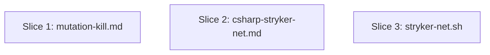

# Plan: .NET Mutation-Testing Improvements

**Created**: 2026-07-01
**Branch**: issue-528
**Status**: approved
**Spec**: docs/specs/mutation-testing-net-improvements.md
**Issue**: #528

## Goal

Land eight improvements from the .NET mutation drive into the plugin: honest/reported score formulas (with NoCoverage in the denominator), NoCoverage-first prioritization, infrastructure-exclusion detection, `--parallel <n>` flag with Agent-tool fan-out, stale-build guard, structurally-untestable pattern catalog (in `mutation-kill.md`); `--since` incremental-run pattern, infrastructure exclusion mutate-glob template, NoCoverage denominator note (in `csharp-stryker-net.md`); env-var-gated `--since` pass-through (in `stryker-net.sh`). Tests updated alongside each behavior change.

## Approach stance (decision-defaults axes)

- **Scope** — touch only the three files named in the spec + their two bats test files. No new files; explicitly not creating `mutation-test-workflow.md` (item-8 rows fold into existing files, per user decision).
- **Integration** — PR + explicit human merge. Diff touches `agents/`, `hooks/`, `tests/` (not `*.md`-only), so the repo working rule requires a human merge; auto-merge is **not** armed.
- **Replace-vs-merge** — all changes are additive edits to existing files. No wholesale replace. Existing shard-aware content and issue-#522 corrections in `csharp-stryker-net.md` are preserved.
- **Format fidelity** — none of the files are structured/lossless assets; markdown edits and bash edits stay in-format.
- **Migrate-vs-edit-stub** — n/a; no deprecated stubs involved.

## Acceptance Criteria

Mirrors `docs/specs/mutation-testing-net-improvements.md` § Acceptance Criteria (18 items). Restated here so `/build` can check them off:

- [ ] AC1: Honest score formula updated to `Killed / (Killed + Survived + NoCoverage)`; reported-score formula also present.
- [ ] AC2: NoCoverage-first prioritization documented in `mutation-kill.md` (≥ 3 mentions).
- [ ] AC3: Infrastructure exclusion detection section present with thresholds (< 15% score, > 50% NoCoverage), file patterns, and `EXCLUDED` log format.
- [ ] AC4: `--parallel <n>` flag added to Invocation and a Parallel-execution section documents Agent-tool fan-out, batching, and mutation-type gating.
- [ ] AC5: "Build first" step precedes the Loop; `--no-build` prohibition documented.
- [ ] AC6: Structurally-untestable patterns catalog covers `#if DEBUG`/`#if RELEASE`, service-locator, and pure DI registration — each with `EXCLUDED` log line.
- [ ] AC7: `--since` incremental-run pattern in `csharp-stryker-net.md` with the verification-config trap called out.
- [ ] AC8: Infrastructure exclusion `mutate` glob template in `csharp-stryker-net.md`.
- [ ] AC9: NoCoverage denominator note in `csharp-stryker-net.md`.
- [ ] AC10: `--since` env-var pass-through in `stryker-net.sh` with the exact guarded block; env var documented in header.
- [ ] AC11: Adapter tests cover all three env-var branches (target-set-CI-unset, target-set-CI-set, target-unset).
- [ ] AC12: Agent tests updated for the new formula regex.
- [ ] AC13: All pre-existing agent-test invariants still pass.
- [ ] AC14: `bash scripts/ci-local.sh` (or the two bats suites) exits 0.
- [ ] AC15: `/agent-audit` passes on the modified agent file.
- [ ] AC16: PR body contains `Closes #528`.
- [ ] AC17: PR title is `feat(mutation-testing): ...`.
- [ ] AC18: Auto-merge NOT armed.

## Slices

### Slice 1: Update `mutation-kill.md` (score formulas, NoCoverage, build-first, infra exclusion, `--parallel`, unkillable patterns)

**Depends-on:** none
**Files:** `plugins/dev-team/agents/mutation-kill.md`, `tests/agents/mutation_kill_agent_tests.bats`

**Behavior:**

```gherkin
Feature: mutation-kill agent honestly scores and prioritizes reduction work

  Scenario: honest score excludes Timeout, includes NoCoverage in denominator
    Given the agent's spec is rendered
    Then the honest_score formula reads "Killed / (Killed + Survived + NoCoverage)"
    And the reported_score formula reads "(Killed + Timeout) / (Killed + Survived + Timeout + NoCoverage)"
    And the spec explains honest_score gates and reported_score exists for HTML-report parity

  Scenario: NoCoverage is prioritized before hard Survived mutations
    Given a baseline report with both NoCoverage and hard Survived mutants
    Then the agent's spec directs the operator to prioritize NoCoverage coverage first
    And documents the rationale that any test reaching the line kills a NoCoverage mutant

  Scenario: build is verified fresh before any mutation run
    When the loop begins
    Then Step 0 requires "dotnet build <SOLUTION> -c Debug --nologo"
    And a failed build stops the run
    And the spec prohibits "--no-build" on the test command during mutation testing

  Scenario: infrastructure files are flagged for exclusion
    Given a file with score < 15% and NoCoverage > 50% of effective mutants
    And its name matches one of Startup.cs, Program.cs, *Filter.cs, *Middleware.cs, *Logger*.cs, *HealthCheck*.cs, *.Designer.cs
    Then the agent asks whether the file is DI registration, exception handlers, or generated code
    And on confirmation the file is added to the mutate exclusion list with a documented reason
    And the exclusion is logged in the "EXCLUDED <file> — <reason>: <mutation types> are equivalent in <test surface>" format

  Scenario: --parallel <n> fans out sub-agents (not worktrees) for Phase 4
    Given --all --parallel <n> is passed
    Then files are sorted by survivor count and capped at 4×n candidates
    And grouped into n batches of up to 4 files each
    And n sub-agents are spawned in parallel via the Agent tool
    And each agent targets mutation types in the priority order
    And 3–4 agents per batch are used for easy types (String/Equality/ObjectInit) and 1–2 for hard types (Statement/Block)

  Scenario: structurally-untestable patterns are cataloged, not attacked
    Then the "Structurally unkillable files" section documents #if DEBUG/#if RELEASE blocks
    And documents the service-locator (HttpContext.RequestServices.GetService<T>()) pattern
    And documents pure DI registration (services.AddX(), builder.Services.AddX())
    And each pattern has an EXCLUDED log line
    And the guidance is to log as technical debt, not to spend rounds attacking them

  Scenario: retired honest_score formula is fully removed (not left dangling)
    Given the previous formula "Killed / (Total - Ignored - CompileError - Timeout)" existed in the file
    When the new formulas land
    Then no occurrence of the retired formula string remains in the file
    And the bats suite asserts the retired formula is absent

  Scenario: pre-existing behavioral invariants survive the edit
    Given the full mutation_kill_agent_tests.bats suite existed before this change
    When all new sections are added
    Then every pre-existing test (frontmatter, 500-line ceiling, priority table,
      duplicate detection, no-improvement exit, revert-on-failure,
      structurally-unkillable exclusion, Go advisory) still passes unmodified

  Scenario: agent-audit passes after the edits
    When /agent-audit runs against the edited mutation-kill.md
    Then structural, frontmatter, and registry checks all pass

  Scenario: --parallel and --concurrency compose predictably
    Given both --parallel and --concurrency are set on the same invocation
    Then the spec states how they compose (outer worktree fan-out × inner Agent-tool fan-out)
    Or the spec states they are mutually exclusive and the agent fails fast
```

**Steps:**

#### Step 1.1: Update the honest-score assertion in the bats suite

**Complexity**: trivial
**RED**: Modify `tests/agents/mutation_kill_agent_tests.bats:27` — change the positive assertion `grep -Eq 'Killed */ *\(Total' "$AGENT"` to `grep -Eq 'Killed */ *\(Killed \+ Survived \+ NoCoverage\)' "$AGENT"`. Add a **negative** assertion in the same `@test`: `! grep -Eq 'Killed */ *\(Total *- *Ignored' "$AGENT"` — the retired formula must be gone, not just supplemented. Run bats — the "defines the honest score formula" test now fails (old formula still in file).
**GREEN**: n/a in this step — this is a pure RED move to lock in the target formula. The GREEN happens in Step 1.2.
**REFACTOR**: None.
**Files**: `tests/agents/mutation_kill_agent_tests.bats`
**Commit**: `test(mutation-kill): assert new honest score formula and absence of retired formula`

#### Step 1.2: Update honest score section + add reported score

**Complexity**: standard
**RED**: The bats test from 1.1 is red.
**GREEN**: Rewrite the "The honest score — hard kills only" section in `plugins/dev-team/agents/mutation-kill.md` to introduce two formulas: `honest_score = Killed / (Killed + Survived + NoCoverage)` (gates), `reported_score = (Killed + Timeout) / (Killed + Survived + Timeout + NoCoverage)` (parity with Stryker HTML). Explain NoCoverage is in Stryker.NET 4.x's denominator. Keep the existing "Timeout inflates score / reported separately" guidance. Bats "defines the honest score formula" test passes; all other existing tests stay green.
**REFACTOR**: Tighten wording; no code-shape refactor.
**Files**: `plugins/dev-team/agents/mutation-kill.md`
**Commit**: `feat(mutation-kill): honest score excludes Timeout; NoCoverage in denominator (matches Stryker.NET 4.x)`

#### Step 1.3: Add NoCoverage-first prioritization bats test + section

**Complexity**: standard
**RED**: Add a bats test `@test "NoCoverage is prioritized before hard Survived mutations"` that asserts `grep -c -i "NoCoverage" "$AGENT"` returns ≥ 3 and that the file contains the phrase "prioritize NoCoverage" (or equivalent). Run bats — new test fails.
**GREEN**: Add a subsection to `mutation-kill.md` right after the score-formulas section explaining NoCoverage as a first-class signal (each NoCoverage→Killed conversion = same score gain as killing a Survivor; any test reaching the line kills it; prioritize before hard Survived). Bats passes.
**REFACTOR**: None.
**Files**: `tests/agents/mutation_kill_agent_tests.bats`, `plugins/dev-team/agents/mutation-kill.md`
**Commit**: `feat(mutation-kill): prioritize NoCoverage coverage before hard Survived mutations`

#### Step 1.4: Add build-first step bats test + Step 0 in Loop

**Complexity**: standard
**RED**: Add a bats test `@test "loop starts with a fresh build; prohibits --no-build"` asserting the file contains `dotnet build` before the loop pseudo-code and contains a "Never use `--no-build`" (or equivalent negated rule). Fails.
**GREEN**: Prepend a "Step 0: Build first" block to the Loop section in `mutation-kill.md`. Include the `dotnet build <SOLUTION> -c Debug --nologo` command, the "stop on build failure" rule, and the "never `--no-build` when running mutation testing" prohibition.
**REFACTOR**: None.
**Files**: `tests/agents/mutation_kill_agent_tests.bats`, `plugins/dev-team/agents/mutation-kill.md`
**Commit**: `feat(mutation-kill): require fresh build before every mutation run (Step 0)`

#### Step 1.5: Add infrastructure exclusion detection bats test + section

**Complexity**: standard
**RED**: Add a bats test asserting `mutation-kill.md` mentions all seven filename patterns (`Startup.cs`, `Program.cs`, `*Filter.cs`, `*Middleware.cs`, `*Logger*.cs`, `*HealthCheck*.cs`, `*.Designer.cs`) and the numeric thresholds `< 15%` and `> 50%`. Fails.
**GREEN**: Insert an "Infrastructure exclusion detection" section between baseline parse and generation loop. Document the thresholds, filename patterns, the yes/no confirmation prompt, and the `EXCLUDED <file> — <reason>: <mutation types> are equivalent in <test surface>` log format.
**REFACTOR**: None.
**Files**: `tests/agents/mutation_kill_agent_tests.bats`, `plugins/dev-team/agents/mutation-kill.md`
**Commit**: `feat(mutation-kill): detect and exclude infrastructure files (Startup/Program/Filter/etc.)`

#### Step 1.6: Add `--parallel <n>` bats test + flag + Parallel-execution section

**Complexity**: complex
**RED**: Add bats test `@test "--parallel <n> is documented as an Invocation flag"` asserting the invocation line contains `--parallel`, a "Parallel execution" heading exists, the section mentions "Agent tool" (not worktrees), and both batch-size numbers (`3-4` for easy types and `1-2` for hard types) appear literally in the section body. Add a second bats test `@test "--parallel and --concurrency interaction rule is specified"` asserting the section defines how the two flags compose (grep for "concurrency" appearing in the Parallel-execution section within, say, 20 lines of "--parallel"). Fails.
**GREEN**: Add `[--parallel <n>]` to the Invocation code block. Add a new "Parallel execution (Phase 4)" section documenting: file sort by survivor count (desc), cap at `4×n` candidates, group into `n` batches of up to 4 files, spawn `n` sub-agents via the Agent tool (not worktrees — test-file writes don't conflict with source-file reads), 3–4 agents per batch for easy types (String/Equality/ObjectInit), 1–2 for hard types (Statement/Block), synthesize and repeat until survivors ≤ threshold. **Interaction rule (default stance):** state that `--concurrency` governs the outer file-level (worktree) fan-out and `--parallel` governs sub-agent fan-out within each worktree's Phase 4 batch — the product is bounded by physical cores minus 2, and the agent fails fast if `concurrency × parallel > cores − 2`. (Alternative: mutually exclusive — if we prefer that stance during implementation, update the scenario/test to match.)
**REFACTOR**: Ensure the Invocation code block still fits under the file's 500-line ceiling; trim redundant wording elsewhere if needed.
**Files**: `tests/agents/mutation_kill_agent_tests.bats`, `plugins/dev-team/agents/mutation-kill.md`
**Commit**: `feat(mutation-kill): add --parallel <n> Agent-tool fan-out for Phase 4`

#### Step 1.7: Add structurally-untestable patterns bats test + expanded section

**Complexity**: standard
**RED**: Add bats test asserting the Structurally-Unkillable section names all three patterns: `#if DEBUG`, service-locator (`HttpContext.RequestServices`), pure DI registration (`services.AddX` or `AddX()`). Fails.
**GREEN**: Expand the existing "Structurally unkillable files" section in `mutation-kill.md` to document all three patterns with `EXCLUDED` log lines and the "log as technical debt, never spend rounds" rule.
**REFACTOR**: None.
**Files**: `tests/agents/mutation_kill_agent_tests.bats`, `plugins/dev-team/agents/mutation-kill.md`
**Commit**: `feat(mutation-kill): catalog #if DEBUG, service-locator, and pure DI as structurally unkillable`

#### Step 1.8: Verify agent-audit, existing invariants, and full bats suite

**Complexity**: trivial
**RED**: n/a (verification step). The "Scenario: pre-existing behavioral invariants survive the edit" and "Scenario: agent-audit passes" are satisfied here.
**GREEN**: Run `bash scripts/ci-local.sh` (or at minimum `bats tests/agents/mutation_kill_agent_tests.bats`) — every pre-existing test passes unmodified (frontmatter, 500-line ceiling, priority table, duplicate detection, no-improvement exit, revert-on-failure, structurally-unkillable exclusion, Go advisory). Run `/agent-audit` on `mutation-kill.md` — structural, frontmatter, and registry checks pass. Confirm the file is still < 500 lines.
**REFACTOR**: If over the 500-line ceiling, tighten wording in the least-critical section.
**Files**: n/a
**Commit**: (no code commit — verification only; part of the previous step's PR)

---

### Slice 2: Update `csharp-stryker-net.md` (`--since`, mutate-glob template, NoCoverage denominator note)

**Depends-on:** none
**Files:** `plugins/dev-team/skills/mutation-testing/references/languages/csharp-stryker-net.md`

**Behavior:**

```gherkin
Feature: Stryker.NET reference documents --since, infra exclusion glob, and NoCoverage denominator

  Scenario: --since incremental-run pattern is documented with the verification trap
    Given the C# reference is rendered
    Then a subsection under "Run (scoped)" shows a dev-shard config with "since": { "enabled": true, "target": "main" }
    And explicitly warns: "--since limits mutations to source files that changed; test-file changes do NOT trigger source mutations"
    And directs verification runs to use a separate config with no "since" block

  Scenario: infrastructure exclusion mutate glob template is provided
    Then the file contains a mutate-glob template with "!**/Startup.cs", "!**/Program.cs", "!**/*ExceptionFilter.cs", "!**/*ExceptionFormatter.cs", "!**/*LoggerService.cs", "!**/*.Designer.cs"

  Scenario: NoCoverage denominator note explains score-drag
    Then the file contains the Stryker.NET score formula "(Killed + Timeout) / (Killed + Survived + Timeout + NoCoverage)"
    And explains that NoCoverage is in the denominator even though those mutants are never tested
    And directs the reader to fix NoCoverage first
```

**Steps:**

#### Step 2.1: Add `--since` incremental-run subsection

**Complexity**: standard
**RED**: Not test-driven at the bats level (no dedicated test suite for this file). Verification is grep-based (AC7). Before editing, run `grep -c -- '--since' plugins/dev-team/skills/mutation-testing/references/languages/csharp-stryker-net.md` — expect 0.
**GREEN**: Add a subsection under `## Run (scoped)` titled "Incremental runs with `--since`". Include:

- A `stryker-config.shard-<name>.json` snippet with `"since": { "enabled": true, "target": "main" }`.
- A `dotnet stryker --config-file stryker-config.shard-webapi.json` example.
- The trap callout: **`--since` limits mutations to source files that changed since the git ref. Test-file changes do NOT trigger source-file mutations. A verification run through a `--since` config silently produces 0 results.** Direct verification runs to a separate config with no `since` block.

Verify: `grep -c -- '--since' <file>` ≥ 3; `grep -c -i "verification" <file>` ≥ 1.
**REFACTOR**: None.
**Files**: `plugins/dev-team/skills/mutation-testing/references/languages/csharp-stryker-net.md`
**Commit**: `feat(mutation-testing): document --since incremental-run pattern with verification-config trap`

#### Step 2.2: Add infrastructure exclusion mutate-glob template

**Complexity**: trivial
**RED**: Grep-baseline: `grep -c '!\*\*/Startup.cs' <file>` → 0.
**GREEN**: Add a subsection with a `stryker-config.shard-webapi.json` example whose `mutate` array includes:
  `"**/MyProject.WebAPI/**/*.cs"`, `"!**/Startup.cs"`, `"!**/Program.cs"`, `"!**/*ExceptionFilter.cs"`, `"!**/*ExceptionFormatter.cs"`, `"!**/*LoggerService.cs"`, `"!**/*.Designer.cs"`.
Verify grep on each pattern returns ≥ 1.
**REFACTOR**: None.
**Files**: `plugins/dev-team/skills/mutation-testing/references/languages/csharp-stryker-net.md`
**Commit**: `feat(mutation-testing): add infrastructure exclusion mutate-glob template for Stryker.NET`

#### Step 2.3: Add NoCoverage denominator note

**Complexity**: trivial
**RED**: `grep -c "NoCoverage" <file>` → baseline (whatever it is; expect low).
**GREEN**: Add a "Score formula and NoCoverage" subsection stating the Stryker.NET score formula `(Killed + Timeout) / (Killed + Survived + Timeout + NoCoverage)` and the "NoCoverage drags the score down; fix NoCoverage first" rationale (referencing the mutation-kill agent's NoCoverage-first guidance for symmetry).
Verify: `grep -c "NoCoverage" <file>` ≥ 3; formula string present.
**REFACTOR**: None.
**Files**: `plugins/dev-team/skills/mutation-testing/references/languages/csharp-stryker-net.md`
**Commit**: `feat(mutation-testing): document NoCoverage in Stryker.NET score denominator`

---

### Slice 3: `--since` env-var pass-through in `stryker-net.sh` adapter

**Depends-on:** none
**Files:** `plugins/dev-team/hooks/mutation-adapters/stryker-net.sh`, `tests/hooks/stryker_net_adapter_tests.bats`, `tests/hooks/fake-bin/dotnet`

**Behavior:**

```gherkin
Feature: stryker-net adapter passes --since only when explicitly opted in and not in CI

  Scenario: STRYKER_SINCE_TARGET set outside CI adds --since to the command
    Given STRYKER_SINCE_TARGET=main
    And CI is not set to "true"
    When stryker_net_run is invoked
    Then the dotnet stryker command line includes "--since:main"

  Scenario: STRYKER_SINCE_TARGET is ignored inside CI
    Given STRYKER_SINCE_TARGET=main
    And CI="true"
    When stryker_net_run is invoked
    Then the dotnet stryker command line does NOT include "--since"

  Scenario: STRYKER_SINCE_TARGET unset preserves baseline behavior
    Given STRYKER_SINCE_TARGET is unset
    When stryker_net_run is invoked
    Then the dotnet stryker command line does NOT include "--since"
    And every other flag from the pre-existing behavior is unchanged
```

**Steps:**

#### Step 3.1: Extend `fake-bin/dotnet` argv-logging + add three adapter tests

**Complexity**: standard
**RED**: **First**, extend `tests/hooks/fake-bin/dotnet` to unconditionally append `"$@"` (one arg per line) to `${DOTNET_ARGV_LOG:-/dev/null}` before its existing branches. This is an unconditional additive change: when `DOTNET_ARGV_LOG` is unset the write is a no-op (redirect to `/dev/null`); when a test sets it, argv lands in the file for that test only. Verify all existing tests using the fake (stryker JS, pitest, mutation-gate, etc.) still pass — none assert on stdout that would collide with the new side-effect. **Then** add three bats tests to `tests/hooks/stryker_net_adapter_tests.bats`:

  1. `stryker_net_run: STRYKER_SINCE_TARGET=main + CI unset → command includes --since:main`
  2. `stryker_net_run: STRYKER_SINCE_TARGET=main + CI=true → command excludes --since`
  3. `stryker_net_run: STRYKER_SINCE_TARGET unset → command excludes --since` (baseline; regardless of CI)

Each test sets `DOTNET_ARGV_LOG=$TMPDIR/argv.log`, invokes `stryker_net_run`, and greps the log. Run bats — all three fail because the adapter has no `--since` handling yet.
**GREEN**: n/a (pure RED — GREEN happens in Step 3.2).
**REFACTOR**: None.
**Files**: `tests/hooks/fake-bin/dotnet`, `tests/hooks/stryker_net_adapter_tests.bats`
**Commit**: `test(stryker-net-adapter): capture dotnet argv in fake-bin; assert --since pass-through permutations`

#### Step 3.2: Add the guarded `--since` block to `stryker_net_run`

**Complexity**: standard
**RED**: The three tests from 3.1 are red.
**GREEN**: In `plugins/dev-team/hooks/mutation-adapters/stryker-net.sh`, after `stryker_args` is finalized and before the `_timeout` call, insert:

```bash
# Dev-only: --since limits mutations to files changed vs the target ref.
# Skipped in CI (full run needed for the gate score).
if [ "${CI:-}" != "true" ] && [ -n "${STRYKER_SINCE_TARGET:-}" ]; then
  stryker_args+=(--since:"$STRYKER_SINCE_TARGET")
fi
```

Also document the env var in the file's header comment, near `STRYKER_NET_REPORT`. Bats: all three tests pass; every pre-existing adapter test still passes.
**REFACTOR**: None.
**Files**: `plugins/dev-team/hooks/mutation-adapters/stryker-net.sh`
**Commit**: `feat(stryker-net-adapter): pass --since:$STRYKER_SINCE_TARGET when set outside CI`

## Parallelization

All three slices are independent — different files, no shared symbols.



| Wave | Slices (parallel) |
|------|-------------------|
| 1 | 1, 2, 3 |

## Complexity Classification

Steps 1.6 (complex — new flag + orchestration section), 1.2/1.3/1.4/1.5/1.7/2.1/3.1/3.2 (standard), 1.1/1.8/2.2/2.3 (trivial).

## Pre-PR Quality Gate

- [ ] All tests pass (`bash scripts/ci-local.sh`)
- [ ] `bats tests/agents/mutation_kill_agent_tests.bats` and `bats tests/hooks/stryker_net_adapter_tests.bats` green
- [ ] `/agent-audit` passes on `mutation-kill.md`
- [ ] `mutation-kill.md` stays under the 500-line ceiling
- [ ] `/code-review` passes (fix loop converges)
- [ ] PR body contains `Closes #528`
- [ ] PR title is `feat(mutation-testing): ...`
- [ ] Auto-merge NOT armed

## Risks & Open Questions

- **Test-argv capture for slice 3.** The existing `tests/hooks/fake-bin/dotnet` may not log argv to a file. If it doesn't, extending it to write argv to `${TMPDIR}/dotnet-argv.log` on invocation is the cleanest way to assert `--since:main` presence/absence — small, isolated change to a test-only fake. If that path proves fragile, fall back to a light shell wrapper that captures argv into a per-test file.
- **Line-ceiling headroom for slice 1.** The agent file is 185 lines today; six new subsections could push it toward the 500-line ceiling. Step 1.6 REFACTOR budget is the escape hatch.
- **Cross-file symmetry.** Slice 2's NoCoverage note (2.3) should cross-reference the agent's NoCoverage guidance (Step 1.3). Both sit in the same commit stream so drift is unlikely, but if slice 2 lands first the reference should point to the "planned" agent section — mitigated by landing both under one PR.

## Build Progress

### Slices (grouped by wave)

#### Wave 1

- [ ] Slice 1: Update `mutation-kill.md` (scores, NoCoverage, build-first, infra exclusion, `--parallel`, unkillable patterns)
  - [ ] Step 1.1: Update honest-score assertion in bats
  - [ ] Step 1.2: Update honest score section + add reported score
  - [ ] Step 1.3: Add NoCoverage-first prioritization test + section
  - [ ] Step 1.4: Add build-first step test + Step 0 in Loop
  - [ ] Step 1.5: Add infrastructure exclusion detection test + section
  - [ ] Step 1.6: Add `--parallel <n>` flag test + Parallel-execution section
  - [ ] Step 1.7: Add structurally-untestable patterns test + expanded section
  - [ ] Step 1.8: Verify agent-audit and full bats suite
- [ ] Slice 2: Update `csharp-stryker-net.md` (`--since`, mutate-glob template, NoCoverage denominator note)
  - [ ] Step 2.1: Add `--since` incremental-run subsection
  - [ ] Step 2.2: Add infrastructure exclusion mutate-glob template
  - [ ] Step 2.3: Add NoCoverage denominator note
- [ ] Slice 3: `--since` env-var pass-through in `stryker-net.sh` adapter
  - [ ] Step 3.1: Add adapter tests for all three env-var branches
  - [ ] Step 3.2: Add the guarded `--since` block to `stryker_net_run`

### Acceptance Criteria

- [ ] AC1: Honest score formula updated
- [ ] AC2: NoCoverage-first prioritization documented (≥ 3 mentions)
- [ ] AC3: Infrastructure exclusion detection section with thresholds + patterns + log format
- [ ] AC4: `--parallel <n>` flag + Parallel-execution section
- [ ] AC5: "Build first" step precedes the Loop
- [ ] AC6: Structurally-untestable patterns catalog (all three)
- [ ] AC7: `--since` incremental-run pattern with verification-config trap
- [ ] AC8: Infrastructure exclusion `mutate` glob template
- [ ] AC9: NoCoverage denominator note
- [ ] AC10: `--since` env-var pass-through in adapter
- [ ] AC11: Adapter tests cover all three env-var branches
- [ ] AC12: Agent tests updated for new formula
- [ ] AC13: Pre-existing agent-test invariants still pass
- [ ] AC14: `bash scripts/ci-local.sh` exits 0
- [ ] AC15: `/agent-audit` passes
- [ ] AC16: PR body contains `Closes #528`
- [ ] AC17: PR title is `feat(mutation-testing): ...`
- [ ] AC18: Auto-merge NOT armed

## Plan Review Summary

Plan tier: **complex** — reviewers: Acceptance, Design, Strategic, Parallelization (UX skipped — no UI surface).

Iteration 1 verdicts:

- **Acceptance Test Critic** — needs-revision. Blockers: AC13 and AC15 had no Gherkin scenarios (fixed by adding "pre-existing invariants survive" and "agent-audit passes" scenarios to Slice 1); Step 1.1/1.2 had no negative assertion that the retired formula was removed (fixed by adding an explicit `! grep` assertion in Step 1.1 and a "retired formula fully removed" scenario). W2 (Slice 3 Scenario 3 `CI` value) addressed by the "regardless of CI" note added to the baseline scenario in Step 3.1.
- **Design & Architecture Critic** — needs-revision (warnings only). Addressed: `--parallel` × `--concurrency` interaction now spelled out in Step 1.6 as "concurrency governs outer worktree fan-out, parallel governs inner sub-agent fan-out, product bounded by cores − 2, fail-fast otherwise" with a matching Gherkin scenario and bats assertion. Fake-bin argv-logging is now a committed design change in Step 3.1 (unconditional additive, no-op when `DOTNET_ARGV_LOG` unset), with `tests/hooks/fake-bin/dotnet` added to Slice 3's files list.
- **Strategic Critic** — approve (2 warnings, both preferences: could split into three PRs; validate parallel-agent conflict handling on next real-world use). Plan intentionally lands as one PR to keep the eight-item drive coherent; noted for follow-up rather than gating.
- **Parallelization Critic** — approve. `plan-waves.sh` reports zero collisions; the only cross-slice touchpoint is a prose cross-reference (NoCoverage in Slices 1 and 2), self-verifiable per file, not a runtime dependency.

Iteration 2 not required (all blockers resolved; remaining warnings are preferences or scoped as follow-up).
