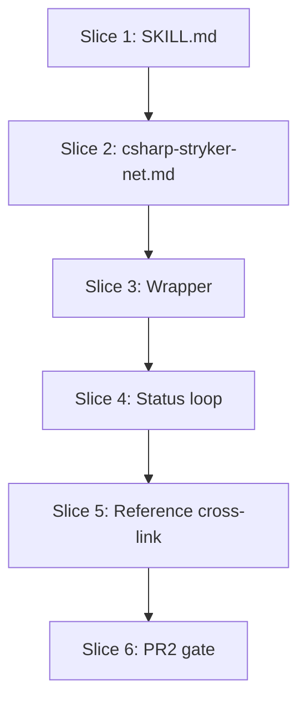

# Plan: Mutation-Testing Silent-Failure Hardening (issues #554, #557, #558, #559)

**Created**: 2026-07-01
**Branch**: more-fixes
**Status**: in-progress
**Spec**: [docs/specs/mutation-testing-net-silent-failure-hardening.md](../docs/specs/mutation-testing-net-silent-failure-hardening.md)

## Approach stance

- **Scope**: single feature, four issues. **Ships as two PRs** (per Strategic Critic): PR1 = Slices 1–2 closes #554, #557; PR2 = Slices 3–6 closes #558, #559. Rationale: the smoke-gate + reference-warning fixes stand alone and address the highest-severity failure mode; the wrapper + status-loop fixes stand alone and depend on PR1 having shipped Step 1c. Splitting keeps each review scoped to one mechanism and matches the repo's one-issue/one-concern PR convention (d277694, b65e90e, ea13f2b).
- **Replace-vs-merge (`csharp-stryker-net.md`)**: **merge** — existing #522/#528/#550 conclusions stay authoritative; add SolutionPath warning, Step 1c link, dots-reporter recommendation, wrapper pointer.
- **Migrate-vs-edit-stub (SKILL.md)**: **edit in place** — Steps 0–5 stay authoritative; Step 1c inserts between 1b and 2; "Long-run inspection" inserts between 2 and 3.
- **Format fidelity**: preserve existing prose structure exactly — same heading depths, table styles, footnote conventions.
- **Auto-merge**: Not applicable — both PRs touch code (shell scripts) or hooks-adjacent surfaces. Human merge required per CLAUDE.md.
- **Script placement (revision 2)**: per Design Critic, executable scripts move from `references/languages/` (markdown-only today) to `plugins/dev-team/skills/mutation-testing/scripts/`, matching the existing `skills/ubiquitous-language/scripts/` precedent. `references/languages/csharp-stryker-net.md` links to them from prose.
- **Enforcement mechanism for Step 1c (revision 2)**: Step 1c is enforced the same way every other SKILL.md step is — the agent follows the workflow. This is the same runbook convention Steps 0/1/2 already use; no new hook is introduced. The Strategic Critic's warning about "provably ignored prose" is addressed by making Step 1c's failure signature explicit and unambiguous (`Killed == 0 && Survived > 0` → halt with specific error message referencing #554/#557), by requiring the parse source to be the tool's report JSON (not stdout heuristics), and by verifying the prose contract via bats doc-shape guards. A future hook-based gate is possible but out of scope; explicitly deferred.
- **Prose vs. code split for red-flag detection**: red-flag identification lives in the status-loop script (code), not the reference (prose). This addresses the "prose is provably ignored" concern for the operational-loop failure modes.

## Goal

Harden the mutation-testing skill's Stryker.NET recipe against three named silent-failure modes: (a) Stryker's mutation-switch runtime failing to observe mutations (#554, #557), (b) operators reinventing `.sln`-hiding trap logic and leaking hidden state on Ctrl-C (#559), and (c) long runs going silent for hours with no error inspection (#558). Ship a workflow-enforced smoke gate, a shipped wrapper script that owns `.sln` hiding + DOTNET_ROOT + safe log redirection, a bash background status loop that greps for known-broken signatures (including a parser-drift catch-all), and a language-agnostic "Long-run inspection" section in SKILL.md.

## Acceptance Criteria

### PR1 (Slices 1–2, closes #554, #557)

- [ ] SKILL.md gains a Step 1c that runs a single-file smoke probe and halts the workflow with a specific error message (naming #554/#557 and a diagnostic checklist) when `Killed == 0 && Survived > 0`.
- [ ] Step 1c explicitly requires parsing `mutation-report.json` for Killed/Survived counts — not stdout, not the ANSI progress reporter.
- [ ] Step 1c defines behavior for a smoke probe returning `Killed == 0 && Survived == 0` (halt with "pick a different probe file" — no mutants means no signal).
- [ ] SKILL.md gains a "Long-run inspection" section between Step 2 and Step 3 covering the three signals (progress, health, error inspection) and the 10-min default cadence.
- [ ] `csharp-stryker-net.md` gains a `SolutionPath` trap warning enumerating the three remediation paths.
- [ ] `csharp-stryker-net.md` xunit.v3 section links to Step 1c rather than duplicating the smoke procedure.
- [ ] `csharp-stryker-net.md` recommends `reporters: ["dots", "json", "html"]` so the status loop's log parsing is deterministic.

### PR2 (Slices 3–6, closes #558, #559)

- [ ] `plugins/dev-team/skills/mutation-testing/scripts/csharp-stryker-net-wrapper.sh` exists, executable, `set -euo pipefail`, `trap restore_sln EXIT INT TERM`.
- [ ] Wrapper pre-builds `${SLN}` and `${SHIM_PROJECT}` (when set) **before** hiding `${SLN}` (order-dependent — building against a hidden .sln fails).
- [ ] Wrapper always hides `${SLN}` after pre-build; restore is idempotent and **refuses (exit 2)** when a stale `${SLN}.stryker-hidden` coexists with a fresh `${SLN}` — never silently clobbers either.
- [ ] Wrapper exports `DOTNET_ROOT` (respecting a pre-set value), forwards `"$@"` to Stryker unchanged, backgrounds Stryker and captures its PID, redirects with `> "$LOGFILE" 2>&1` (or `set -o pipefail`), never bare `| tee`.
- [ ] Wrapper's `restore_sln` trap kills the backgrounded Stryker PID (as well as the status-loop PID) so a `kill -INT` on the wrapper in a CI / backgrounded context does not orphan Stryker.
- [ ] `plugins/dev-team/skills/mutation-testing/scripts/csharp-stryker-net-status-loop.sh` exists, is sourced by the wrapper, and defaults to 600 s (`STATUS_INTERVAL=0` disables).
- [ ] Wrapper passes Stryker's PID as an explicit argument to `status_loop_start` so the loop can detect a dead process via `kill -0 "$STRYKER_PID"` — no `pgrep`-by-name heuristics.
- [ ] Each status tick emits one status line derived from the log/report JSON (not the ANSI progress reporter) and greps for red-flag signatures.
- [ ] Red-flag signatures covered: (i) Killed:0 + Survived>0; (ii) CompileError count > threshold (25 default); (iii) SolutionPath naming a `.sln` outside the configured test-projects; (iv) Stryker PID dead while log open; (v) **parser-drift catch-all** — no recognizable summary line in N consecutive ticks (N=3 default).
- [ ] Red-flag hits emit a distinct `[RED-FLAG]` line naming the failure mode **and** the linked issue (#554, #557, #558 as applicable — all five red-flag lines reference at least one issue).
- [ ] Loop shuts down cleanly (trap kills background PID on wrapper exit).
- [ ] `csharp-stryker-net.md` names both scripts, tells operators to copy **both files together** into their repo's `scripts/`, and warns that copying the wrapper alone hard-fails at `set -e` on the missing `source`.
- [ ] All new shell scripts pass `shellcheck` cleanly.
- [ ] Bats tests cover every scenario listed under each slice.
- [ ] Local gate (`scripts/ci-local.sh`) passes before each push; PR titles conventional (`feat(mutation-testing): ...`).

## Slices

### PR1: closes #554, #557

### Slice 1: SKILL.md — Step 1c smoke gate + Long-run inspection section

**Depends-on:** none
**Files:** `plugins/dev-team/skills/mutation-testing/SKILL.md`, `tests/skills/mutation_testing_silent_failure_doc_tests.bats`

**Behavior:**

```gherkin
Feature: Workflow-enforced smoke gate and long-run inspection guidance in SKILL.md

  Scenario: Step 1c documents the mandatory single-file smoke probe
    Given the mutation-testing SKILL.md
    When an operator reads the skill sequentially
    Then a "Step 1c" section appears between Step 1b and Step 2
    And it instructs the operator to run Stryker against one covered file first

  Scenario: Step 1c specifies parsing mutation-report.json, not stdout
    Given Step 1c in SKILL.md
    When an operator reads the parsing guidance
    Then it explicitly names mutation-report.json as the source of truth for Killed and Survived counts
    And it warns against parsing the ANSI progress reporter or other stdout output

  Scenario: Step 1c halts on the mutation-switch failure signature
    Given the smoke probe reports Killed == 0 and Survived > 0
    When the workflow reaches the decision point
    Then Step 1c specifies the workflow halts before the full run
    And the halt message references issues #554 and #557
    And it enumerates a diagnostic checklist (manual mutation kills the test; SolutionPath review; unintended test-project enumeration)

  Scenario: Step 1c halts on the no-signal probe signature
    Given the smoke probe reports Killed == 0 and Survived == 0
    When the workflow reaches the decision point
    Then Step 1c specifies the workflow halts and instructs picking a different probe file
    And the halt message explains that a probe with no scored mutants provides no configuration signal

  Scenario: Step 1c allows the full run when a killed mutant is observed
    Given the smoke probe reports at least one Killed mutant
    When the workflow reaches the decision point
    Then Step 1c authorizes proceeding to the full run

  Scenario: Long-run inspection section documents the three signals
    Given the SKILL.md workflow
    When an operator reads the section between Step 2 and Step 3
    Then a "Long-run inspection" section exists
    And it names three signals: progress, health, error inspection
    And it documents a 10-minute default cadence
    And it notes language references may add tool-specific red-flag signatures

  Scenario: Long-run inspection section names concrete example implementations
    Given the "Long-run inspection" section in SKILL.md
    When an operator reads it
    Then it names the shipped C# wrapper as a portable-bash example implementation
    And it names an in-session Monitor as an alternative implementation
```

**Steps:**

#### Step 1.1: RED — bats doc-shape tests for Step 1c

**Complexity**: standard
**RED**: Create `tests/skills/mutation_testing_silent_failure_doc_tests.bats` (hermetic setup not required — read-only file inspection). Guards (each using the awk-section-scanning idiom from `mutation_testing_skill_doc_tests.bats`):

- `SKILL: Step 1c smoke gate section exists between Step 1b and Step 2`
- `SKILL: Step 1c names Killed==0 Survived>0 failure signature`
- `SKILL: Step 1c names mutation-report.json as the parse source`
- `SKILL: Step 1c warns against parsing stdout / ANSI progress reporter`
- `SKILL: Step 1c halt message references #554 and #557`
- `SKILL: Step 1c halt message enumerates diagnostic checklist`
- `SKILL: Step 1c defines behavior for Killed==0 Survived==0 (no-signal probe)`
- `SKILL: Step 1c authorizes proceeding when Killed>0`
Run bats — all should fail.
**GREEN**: Insert Step 1c into `plugins/dev-team/skills/mutation-testing/SKILL.md` between Step 1b and Step 2. Prose describes: single-file probe → parse `mutation-report.json` from the probe's `-O` output directory → check `Killed`/`Survived` counts → three-way decision (halt-mutation-switch-broken / halt-no-signal / proceed). Explicit warning that stdout / ANSI progress reporter output must not be used as the parse source (survives-redirection reason).
**REFACTOR**: Cross-reference Step 2 to point at Step 1c ("before running the full scan, complete the Step 1c smoke gate"). Language-agnostic — per-tool commands live in language files.
**Files**: `plugins/dev-team/skills/mutation-testing/SKILL.md`, `tests/skills/mutation_testing_silent_failure_doc_tests.bats`
**Commit**: `feat(mutation-testing): add Step 1c smoke gate to workflow (#554, #557)`

#### Step 1.2: RED — bats doc-shape tests for Long-run inspection section

**Complexity**: standard
**RED**: Extend the bats file:

- `SKILL: Long-run inspection section exists between Step 2 and Step 3`
- `SKILL: Long-run inspection names progress, health, error inspection signals`
- `SKILL: Long-run inspection documents 10-minute default cadence`
- `SKILL: Long-run inspection notes language files may add signatures`
- `SKILL: Long-run inspection names portable bash wrapper as an example`
- `SKILL: Long-run inspection names in-session Monitor as an alternative`
Run bats — new tests fail.
**GREEN**: Insert "Long-run inspection" section between Step 2 and Step 3.
**REFACTOR**: Verify no C#-specific detail leaks; abstractions match neighbors.
**Files**: `plugins/dev-team/skills/mutation-testing/SKILL.md`, `tests/skills/mutation_testing_silent_failure_doc_tests.bats`
**Commit**: `feat(mutation-testing): add Long-run inspection section to SKILL.md (#558)`

### Slice 2: csharp-stryker-net.md — SolutionPath warning, Step 1c link, dots reporter

**Depends-on:** 1
**Files:** `plugins/dev-team/skills/mutation-testing/references/languages/csharp-stryker-net.md`, `tests/skills/mutation_testing_silent_failure_doc_tests.bats`

**Behavior:**

```gherkin
Feature: csharp-stryker-net.md warns about the SolutionPath trap and points to Step 1c

  Scenario: SolutionPath trap warning exists
    Given the csharp-stryker-net.md reference
    When an operator scans the config-authoring guidance
    Then a "SolutionPath trap" warning appears
    And it names the failure mode: Stryker enumerating extra test projects from the solution
    And it enumerates three remediation paths (remove SolutionPath; exclude the main test project; downgrade to xunit.v2)

  Scenario: xunit.v3 section links to Step 1c
    Given the xunit.v3 detection section
    When an operator reads the workflow
    Then the section links to SKILL.md Step 1c for the smoke-probe procedure
    And no smoke procedure is duplicated in the C# reference

  Scenario: Reference recommends the dots reporter
    Given the config-authoring guidance
    When an operator reads the reporter recommendation
    Then it recommends configuring reporters that include "dots"
    And it explains why: ANSI progress reporter does not survive log redirection
```

**Steps:**

#### Step 2.1: RED — bats doc-shape tests for SolutionPath warning + Step 1c link + dots reporter

**Complexity**: standard
**RED**: Extend the bats file:

- `csharp-stryker-net: SolutionPath trap warning exists`
- `csharp-stryker-net: SolutionPath warning enumerates three remediation paths`
- `csharp-stryker-net: xunit.v3 section links to Step 1c`
- `csharp-stryker-net: reporters guidance names "dots"`
Run bats — new tests fail.
**GREEN**: Edit `csharp-stryker-net.md`:

  1. Add "SolutionPath trap" subsection under "Config authoring notes" with the three remediation paths and the plugin's recommendation.
  2. In the xunit.v3 section, replace any smoke sub-prose with a link to SKILL.md's Step 1c anchor.
  3. Recommend `reporters: ["dots", "json", "html"]` with rationale.
**REFACTOR**: No duplicate smoke content; no contradictions with SKILL.md.
**Files**: `plugins/dev-team/skills/mutation-testing/references/languages/csharp-stryker-net.md`, `tests/skills/mutation_testing_silent_failure_doc_tests.bats`
**Commit**: `feat(mutation-testing): SolutionPath warning + Step 1c link + dots reporter (#557)`

#### Step 2.2: PR1 gate + open PR

**Complexity**: trivial
**RED**: N/A — gate step.
**GREEN**: Run `bash scripts/ci-local.sh`; fix any regressions. Push branch, open PR1 titled `feat(mutation-testing): workflow-enforced smoke gate + SolutionPath warning (closes #554, #557)`. PR body uses `Closes #554`, `Closes #557`.
**REFACTOR**: N/A.
**Files**: none (CI + git operations only).
**Commit**: n/a (gate only).

### PR2: closes #558, #559 (built after PR1 merges)

### Slice 3: Wrapper script — csharp-stryker-net-wrapper.sh

**Depends-on:** 2
**Files:** `plugins/dev-team/skills/mutation-testing/scripts/csharp-stryker-net-wrapper.sh`, `tests/skills/mutation_testing_wrapper_tests.bats`

**Behavior:**

```gherkin
Feature: Reference wrapper hides .sln, exports DOTNET_ROOT, restores on any exit, forwards args to Stryker

  Scenario: Wrapper builds .sln and SHIM_PROJECT before hiding .sln
    Given a repository with .sln and SHIM_PROJECT set
    When the wrapper runs
    Then dotnet build is invoked for .sln and for SHIM_PROJECT
    And both build invocations complete before .sln is moved to .sln.stryker-hidden

  Scenario: Wrapper restores .sln on normal exit
    Given a repository with .sln present
    When the wrapper runs and dotnet stryker exits successfully
    Then .sln.stryker-hidden does not exist after the wrapper returns
    And .sln exists at its original path with its original content

  Scenario: Wrapper restores .sln on SIGINT
    Given a repository with .sln present
    When the wrapper is signalled with SIGINT mid-run
    Then .sln.stryker-hidden does not exist
    And .sln exists at its original path

  Scenario: Wrapper restores .sln on SIGTERM
    Given a repository with .sln present
    When the wrapper is signalled with SIGTERM mid-run
    Then .sln.stryker-hidden does not exist
    And .sln exists at its original path

  Scenario: Wrapper restores .sln when Stryker exits non-zero
    Given a repository with .sln present
    And a Stryker command that exits with non-zero status
    When the wrapper runs
    Then .sln.stryker-hidden does not exist after the wrapper returns
    And the wrapper's own exit code is non-zero (propagates Stryker's)

  Scenario: Wrapper refuses when a stale hidden .sln coexists with a fresh .sln
    Given a repository where .sln.stryker-hidden already exists alongside a fresh .sln
    When the wrapper runs
    Then the wrapper exits with code 2 before any build or hide operation
    And the error message names the stale .sln.stryker-hidden path
    And the message instructs manual resolution
    And the fresh .sln is left untouched

  Scenario: Wrapper respects a pre-set DOTNET_ROOT
    Given DOTNET_ROOT is already exported to a custom path
    When the wrapper runs
    Then the wrapper does not overwrite DOTNET_ROOT
    And Stryker is invoked with that DOTNET_ROOT

  Scenario: Wrapper forwards arguments to dotnet stryker
    Given the wrapper is invoked with --mutate "**/Foo.cs" -O StrykerOutput/probe
    When the wrapper reaches the Stryker invocation
    Then dotnet stryker receives --mutate "**/Foo.cs" -O StrykerOutput/probe unchanged

  Scenario: Wrapper source never uses bare | tee for the tool exit path
    Given the wrapper source (static check)
    When the source is linted for pipeline patterns
    Then no bare "| tee " pipeline feeds the tool's exit status

  Scenario: Wrapper captures Stryker's PID for the status loop
    Given the wrapper runs with STATUS_INTERVAL > 0
    When the status loop is started
    Then the wrapper passes Stryker's PID as an argument to status_loop_start
    And the loop uses that PID for liveness checks (no pgrep-by-name)

  Scenario: Wrapper kills backgrounded Stryker on SIGINT / SIGTERM
    Given the wrapper is running with a backgrounded Stryker child (STATUS_INTERVAL=0)
    When the wrapper is signalled with SIGINT (or SIGTERM)
    Then after the wrapper exits the Stryker PID no longer responds to kill -0
    And .sln.stryker-hidden does not exist
    And .sln exists at its original path
```

**Steps:**

#### Step 3.1: RED — bats tests for wrapper contract (STATUS_INTERVAL=0 pins the loop-off path)

**Complexity**: complex
**RED**: Create `tests/skills/mutation_testing_wrapper_tests.bats`. Load hermetic (`load '../lib/hermetic'`, wire setup/teardown). Fixture: temp repo with dummy `.sln`; place a fake `dotnet` shim on PATH that records arg vectors, invocation timestamps, and env into `$RECORD_DIR/`, then exits 0 or non-zero based on env sentinel. **All bats invocations in this step pin `STATUS_INTERVAL=0` so the wrapper runs without sourcing Slice 4's script** — the loop-integration path is exercised in Step 4.2.

Tests:

- `pre-build ordering: build(SLN) and build(SHIM_PROJECT) both invoked before mv of .sln` (record timestamps in `$RECORD_DIR/timeline`, assert build entries precede hide entry).
- `normal exit: .sln restored, .sln.stryker-hidden absent`.
- `SIGINT mid-run: .sln restored` (background wrapper, `kill -INT`, wait, assert filesystem state).
- `SIGTERM mid-run: .sln restored`.
- `Stryker exits non-zero: wrapper propagates exit code, .sln restored`.
- `stale hidden coexisting with fresh .sln: wrapper exits 2 before build, error names both paths, fresh .sln untouched`.
- `pre-set DOTNET_ROOT preserved: fake dotnet records env, wrapper does not overwrite`.
- `args forwarding: wrapper called with --mutate '**/Foo.cs' -O out; fake dotnet's recorded argv matches exactly`.
- `source lint: grep -E "\| tee " wrapper.sh returns no lines that feed the Stryker exit path` (allowed elsewhere in the file if not on the Stryker pipeline; assert the specific Stryker invocation line).
- `SIGINT kills backgrounded Stryker: fake dotnet-stryker records its own PID to $RECORD_DIR/stryker.pid on start; test signals wrapper with SIGINT; after wait, assert kill -0 on the recorded PID fails (or the fake shim exited via the signal path)`.
- `SIGTERM kills backgrounded Stryker: same shape as above with SIGTERM`.
- `shellcheck clean on wrapper.sh`.
Run bats — all fail.

**GREEN**: Create `plugins/dev-team/skills/mutation-testing/scripts/csharp-stryker-net-wrapper.sh`. Key structural properties (implementation details finalized during GREEN):

```bash
#!/usr/bin/env bash
# macOS/Linux only — Windows Git Bash not a target.
set -euo pipefail

# ---- Per-repo edits (header vars) --------------------------------------------
SLN="${SLN:-Foo.sln}"
SHIM_PROJECT="${SHIM_PROJECT:-}"
STRYKER_BIN="${STRYKER_BIN:-dotnet-stryker}"
LOGFILE="${LOGFILE:-StrykerOutput/wrapper.log}"
STATUS_INTERVAL="${STATUS_INTERVAL:-600}"    # seconds; 0 disables
COMPILE_ERROR_THRESHOLD="${COMPILE_ERROR_THRESHOLD:-25}"
# ------------------------------------------------------------------------------

export DOTNET_ROOT="${DOTNET_ROOT:-/opt/homebrew/opt/dotnet/libexec}"
SLN_HIDDEN="${SLN}.stryker-hidden"
STATUS_PID=""
STRYKER_PID=""

restore_sln() {
    if [ -f "$SLN_HIDDEN" ] && [ ! -f "$SLN" ]; then
        mv "$SLN_HIDDEN" "$SLN"
    fi
    # Kill children — order: status loop (spawned by us), then Stryker (backgrounded).
    if [ -n "$STATUS_PID" ] && kill -0 "$STATUS_PID" 2>/dev/null; then
        kill "$STATUS_PID" 2>/dev/null || true
    fi
    if [ -n "$STRYKER_PID" ] && kill -0 "$STRYKER_PID" 2>/dev/null; then
        kill "$STRYKER_PID" 2>/dev/null || true
    fi
}
trap restore_sln EXIT INT TERM

# Refuse to clobber a fresh .sln with a stale hidden one. Happens BEFORE build.
if [ -f "$SLN_HIDDEN" ] && [ -f "$SLN" ]; then
    echo "error: stale $SLN_HIDDEN present alongside fresh $SLN — resolve manually before rerunning" >&2
    exit 2
fi

mkdir -p "$(dirname "$LOGFILE")"

# Pre-build BEFORE hiding — dotnet build against a hidden .sln fails.
dotnet build "$SLN" -c Debug --nologo
if [ -n "$SHIM_PROJECT" ]; then
    dotnet build "$SHIM_PROJECT" -c Debug --nologo
fi

mv "$SLN" "$SLN_HIDDEN"

# Background Stryker so we can hand its PID to the status loop.
# Direct redirect — do NOT pipe to tee (masks Stryker exit; #550).
"$STRYKER_BIN" "$@" >"$LOGFILE" 2>&1 &
STRYKER_PID=$!

if [ "$STATUS_INTERVAL" -gt 0 ]; then
    # shellcheck source=./csharp-stryker-net-status-loop.sh
    . "$(dirname "${BASH_SOURCE[0]}")/csharp-stryker-net-status-loop.sh"
    status_loop_start "$LOGFILE" "$STATUS_INTERVAL" "$COMPILE_ERROR_THRESHOLD" "$STRYKER_PID" &
    STATUS_PID=$!
fi

wait "$STRYKER_PID"
```

**REFACTOR**: `shellcheck` clean; bash 3.2-safe; empty-safe idiom for `${arr[@]+"${arr[@]}"}` if arrays introduced.
**Files**: `plugins/dev-team/skills/mutation-testing/scripts/csharp-stryker-net-wrapper.sh`, `tests/skills/mutation_testing_wrapper_tests.bats`
**Commit**: `feat(mutation-testing): ship csharp-stryker-net-wrapper.sh with .sln trap-restore + PID handoff (#559)`

### Slice 4: Status loop — csharp-stryker-net-status-loop.sh

**Depends-on:** 3
**Files:** `plugins/dev-team/skills/mutation-testing/scripts/csharp-stryker-net-status-loop.sh`, `tests/skills/mutation_testing_status_loop_tests.bats`, `tests/fixtures/stryker-net-logs/*.log`

**Behavior:**

```gherkin
Feature: Status loop emits periodic status + red-flag lines during long Stryker runs

  Scenario: Loop emits one status line per tick
    Given a Stryker log file being appended to
    And STATUS_INTERVAL set to a short test interval
    When the status loop runs for N ticks
    Then N status lines are emitted
    And each line names mutants-tested/total, killed, survived, timeout, elapsed

  Scenario: Loop reads counts from a redirection-safe source
    Given a Stryker log written with the dots reporter (not ANSI progress)
    When the loop parses the log at a tick boundary
    Then mutants-tested is derived from a source that survives log redirection

  Scenario: STATUS_INTERVAL=0 disables the loop
    Given the wrapper is invoked with STATUS_INTERVAL=0
    When the wrapper runs
    Then no status loop background process is started
    And the wrapper still passes through Stryker's exit code

  Scenario: Red flag when Killed:0 with Survived>0 is observed
    Given a Stryker log where the current summary reports Killed: 0 and Survived: 100
    When the loop parses the log at a tick boundary
    Then a "[RED-FLAG] mutation-switch not observing mutations" line is emitted
    And the line references issue #554

  Scenario: Red flag when CompileError count strictly exceeds threshold
    Given a Stryker log where CompileError count is COMPILE_ERROR_THRESHOLD + 1
    When the loop parses the log at a tick boundary
    Then a "[RED-FLAG] CompileError count over threshold" line is emitted
    And the line names the observed count and the threshold

  Scenario: No red flag when CompileError count equals threshold exactly
    Given a Stryker log where CompileError count equals COMPILE_ERROR_THRESHOLD
    When the loop parses the log at a tick boundary
    Then no CompileError red-flag line is emitted

  Scenario: Red flag when SolutionPath enumerates an unexpected .sln
    Given a Stryker log where SolutionPath names a .sln outside the configured test-projects
    When the loop parses the log at a tick boundary
    Then a "[RED-FLAG] SolutionPath trap" line is emitted
    And the line references issue #557

  Scenario: Red flag when Stryker PID is dead and no summary marker present
    Given the Stryker PID handed to the loop no longer responds to kill -0
    And the log does not contain a completion/summary marker
    When the loop parses at a tick boundary
    Then a "[RED-FLAG] Stryker process died" line is emitted
    And the line references issue #558

  Scenario: Parser-drift catch-all red-flag
    Given N consecutive ticks where the log matches no recognizable summary pattern
    When the loop parses the log at each tick boundary
    Then after N consecutive unrecognized ticks a "[RED-FLAG] parser drift" line is emitted
    And the line references issue #558 (long-run inspection integrity)

  Scenario: Loop exits when the parent wrapper exits
    Given the wrapper has started the loop as a background PID
    When the wrapper exits (any signal or normal)
    Then the loop background process is killed within one tick
```

**Steps:**

#### Step 4.1: RED — bats tests for status-loop parsing + red-flag detection

**Complexity**: standard
**RED**: Create `tests/skills/mutation_testing_status_loop_tests.bats`. Source the loop (`. csharp-stryker-net-status-loop.sh`) and call parsing functions directly. Fixtures under `tests/fixtures/stryker-net-logs/`:

- `healthy-dots.log` — dots + summary with Killed>0.
- `mutation-switch-broken.log` — Killed: 0, Survived: 100.
- `compile-error-above.log` — 26 CompileError lines.
- `compile-error-at.log` — 25 CompileError lines exactly.
- `solution-path-trap.log` — SolutionPath naming an unexpected .sln.
- `truncated-dead-process.log` — dots, no summary, no completion marker.
- `unrecognized.log` — arbitrary text matching none of the summary patterns (for drift catch-all).

Tests:

- `emit_status_line` produces one line per fixture with the documented fields.
- `check_red_flags` on `healthy-dots.log` → empty (no red flags).
- `check_red_flags` on `mutation-switch-broken.log` → `[RED-FLAG]` referencing #554.
- `check_red_flags` on `compile-error-above.log` → `[RED-FLAG] CompileError` naming 26 and 25 threshold.
- `check_red_flags` on `compile-error-at.log` → empty (boundary — at threshold does NOT fire).
- `check_red_flags` on `solution-path-trap.log` → `[RED-FLAG]` referencing #557.
- `check_red_flags` on `truncated-dead-process.log` with `kill -0` failing on the passed PID → `[RED-FLAG] Stryker process died` referencing #558.
- `check_red_flags` on `unrecognized.log` for 3 consecutive calls → 3rd call emits `[RED-FLAG] parser drift` referencing #558; 1st and 2nd calls do not.
- `STATUS_INTERVAL=0` via wrapper (regression-guard from Step 3.1) — background PID absent (this remains a wrapper test, verified once wrapper source exists).
- `shellcheck` clean on `status-loop.sh`.
Run bats — all fail.

**GREEN**: Create `plugins/dev-team/skills/mutation-testing/scripts/csharp-stryker-net-status-loop.sh`. Public functions:

- `status_loop_start LOGFILE INTERVAL COMPILE_THRESHOLD STRYKER_PID` — the loop body; sleeps then calls `emit_status_line` + `check_red_flags` each tick; passes STRYKER_PID through to `check_red_flags`.
- `emit_status_line LOGFILE` — parses log tail, prints one status record.
- `check_red_flags LOGFILE STRYKER_PID` — pure function; returns any red-flag lines to stdout; consecutive-unrecognized counter kept in a file under `TMPDIR` keyed by PID so it survives per-tick.
Parse strategy: last `Killed:`/`Survived:`/`Timeout:` block via `grep -E ... | tail -1`; CompileError count via `grep -c`; SolutionPath via `grep -m1 -E "^Property TargetPath="` cross-checked against expected pattern (configurable via env). Drift counter: increment when no summary marker matches; reset when a match is found; fire at 3.
**REFACTOR**: shellcheck clean, bash 3.2-safe. Consider whether the drift counter file needs a cleanup path on loop exit (yes — cleanup in trap).
**Files**: `plugins/dev-team/skills/mutation-testing/scripts/csharp-stryker-net-status-loop.sh`, `tests/skills/mutation_testing_status_loop_tests.bats`, `tests/fixtures/stryker-net-logs/*.log`
**Commit**: `feat(mutation-testing): ship csharp-stryker-net-status-loop.sh with red-flag inspection (#558)`

#### Step 4.2: RED — bats integration test: wrapper + loop end-to-end

**Complexity**: standard
**RED**: Add to `mutation_testing_wrapper_tests.bats` (integration section): wrapper invoked with `STATUS_INTERVAL=1` against a fake dotnet-stryker that writes a scripted log (starts with dots, then transitions to `Killed: 0 / Survived: 100`, then sleeps 3s to give the loop a chance to catch it, then exits 0). Assert `$LOGFILE`'s status/red-flag output (loop writes to stderr — capture) contains at least one `[RED-FLAG]` referencing #554.
Also: `STATUS_INTERVAL=0` case — verify no status loop PID is spawned (grep `ps` output or count background jobs).
Run bats — expected to fail until integration path works.
**GREEN**: No new prod code — verify Slice 3's wrapper wiring functions end-to-end. Adjust fake-dotnet scripting if the timing window is too tight.
**REFACTOR**: Confirm loop's cleanup on wrapper exit is deterministic; no orphan bash processes.
**Files**: `tests/skills/mutation_testing_wrapper_tests.bats`
**Commit**: `test(mutation-testing): wrapper + status-loop end-to-end integration (#558, #559)`

### Slice 5: csharp-stryker-net.md — wrapper + status-loop pointers, copy-both instruction

**Depends-on:** 4
**Files:** `plugins/dev-team/skills/mutation-testing/references/languages/csharp-stryker-net.md`, `tests/skills/mutation_testing_silent_failure_doc_tests.bats`

**Behavior:**

```gherkin
Feature: Reference points at the shipped scripts and warns about copy-both dependency

  Scenario: Reference names both shipped scripts
    Given the csharp-stryker-net.md reference
    When an operator reads the "Shipped wrapper" subsection
    Then it names csharp-stryker-net-wrapper.sh
    And it names csharp-stryker-net-status-loop.sh

  Scenario: Reference warns operators to copy both scripts together
    Given the "Shipped wrapper" subsection
    When an operator reads the copy instructions
    Then it instructs copying BOTH scripts into the repo's scripts/ directory
    And it warns that copying only the wrapper causes set -e to abort on the missing source

  Scenario: Reference documents status-loop cadence and disable knob
    Given the "Shipped wrapper" subsection
    When an operator reads the runtime knobs
    Then it documents STATUS_INTERVAL=600 default (10 minutes)
    And it documents STATUS_INTERVAL=0 as the disable value
```

**Steps:**

#### Step 5.1: RED — bats doc-shape tests for wrapper + copy-both instruction

**Complexity**: trivial
**RED**: Extend the bats file:

- `csharp-stryker-net: names both shipped scripts`
- `csharp-stryker-net: instructs copying both scripts together`
- `csharp-stryker-net: warns about set -e abort on missing source`
- `csharp-stryker-net: documents STATUS_INTERVAL default 600 and disable=0`
Run bats — fail.
**GREEN**: Add a "Shipped wrapper" subsection to `csharp-stryker-net.md` near "Run (scoped)". Name both scripts, instruct copying both to the repo's `scripts/`, warn about `set -e` on missing source, document `STATUS_INTERVAL` semantics.
**REFACTOR**: Verify SKILL.md "Long-run inspection" section and csharp-stryker-net.md's "Shipped wrapper" subsection do not duplicate each other's contract.
**Files**: `plugins/dev-team/skills/mutation-testing/references/languages/csharp-stryker-net.md`, `tests/skills/mutation_testing_silent_failure_doc_tests.bats`
**Commit**: `docs(mutation-testing): shipped-wrapper subsection with copy-both instruction (#558, #559)`

### Slice 6: PR2 gate + open PR

**Depends-on:** 5
**Files:** none

**Behavior:**

```gherkin
Feature: PR2 lands cleanly

  Scenario: Local gate passes end-to-end
    Given the branch with all PR2 slices merged locally
    When scripts/ci-local.sh runs
    Then it exits 0

  Scenario: Knowledge index rebuilt after skill edits
    Given SKILL.md and csharp-stryker-net.md have been edited
    When the operator runs bash plugins/dev-team/hooks/lib/build-knowledge-index.sh
    Then knowledge_index_current.bats passes
```

**Steps:**

#### Step 6.1: PR2 gate + open PR

**Complexity**: trivial
**RED**: N/A.
**GREEN**: `bash plugins/dev-team/hooks/lib/build-knowledge-index.sh`; `bash scripts/ci-local.sh`; push; open PR2 titled `feat(mutation-testing): reference wrapper + status loop for .NET long runs (closes #558, #559)`. PR body uses `Closes #558`, `Closes #559`.
**REFACTOR**: N/A.
**Files**: none.
**Commit**: n/a.

## Parallelization



| Wave | Slices (parallel) |
|------|-------------------|
| 1 | 1 |
| 2 | 2 |
| 3 | 3 |
| 4 | 4 |
| 5 | 5 |
| 6 | 6 |

Fully serial by design — every slice's contract references the prior slice's deliverable. Slice 2 closes at PR1; Slices 3–6 are PR2 work.

## Complexity Classification

Recorded per-step above. Summary: 1× complex (Slice 3.1 — wrapper contract with signal handling under bats), 6× standard (doc-shape + status-loop parser + integration), 3× trivial (PR1 gate, reference cross-link, PR2 gate).

## Pre-PR Quality Gate (each PR)

- [ ] All bats tests pass (`bats tests/`)
- [ ] `shellcheck` clean on all shell scripts (both new + touched)
- [ ] `scripts/ci-local.sh` passes end-to-end
- [ ] `bash plugins/dev-team/hooks/lib/build-knowledge-index.sh` after skill edits (per memory `knowledge_index_rebuild_after_skill_edits`)
- [ ] `/code-review` passes on the diff
- [ ] PR title conventional (`feat(mutation-testing): ...`)
- [ ] PR body uses `Closes #<n>` for each issue the PR closes

## Risks & Open Questions

- **Signal-handling under bats**: SIGINT/SIGTERM restore paths need a fake-dotnet that blocks on a sentinel and the wrapper backgrounded. Mitigation: helper (`wait_for_sentinel_and_signal`) with a short timeout and polling of `.sln.stryker-hidden` filesystem state.
- **Fake dotnet portability**: macOS bash 3.2 vs Linux bash 5. Mitigation: `printf`, `[`, file I/O only — no arrays, no `wait -n`.
- **Idempotency semantic — refuse (resolved)**: refuse-with-exit-2 is the finalized behavior; documented in the wrapper's error text and encoded in the Gherkin.
- **Parser drift lookahead depth**: three consecutive unrecognized ticks before firing the catch-all. Configurable via env if 3 turns out to be noisy in practice.
- **PID handoff robustness**: wrapper backgrounds Stryker then `wait $STRYKER_PID`, so exit status still propagates. Trap-driven cleanup kills the status loop; the loop's cleanup path handles the drift-counter file.
- **Windows Git Bash**: out of scope per spec; wrapper fails loudly on line 1 (missing DOTNET_ROOT path), not silently.
- **Future hook-based enforcement**: Step 1c is prose-enforced today. If operator compliance turns out to be a problem in practice, a follow-up issue can add a hook that verifies a smoke-run report file exists before the full run proceeds. Explicitly deferred.

## Plan Review Summary

**Plan tier**: complex — reviewers dispatched: Acceptance, Design, Strategic, Parallelization. UX skipped (no UI surface).

**Reviewer verdicts (revision 2)**: Acceptance = **approve**; Design = **approve** (one non-blocking warning — backgrounded-Stryker orphan on signal — folded into Slice 3 as revision 3 below); Parallelization = **approve**; Strategic reviewed revision 1 and returned no blockers (all three warnings addressed in revision 2). No further review iteration required.

**Revision 2 → 3 change log** (Design's warning folded in):

- Added AC "Wrapper's `restore_sln` trap kills the backgrounded Stryker PID (as well as the status-loop PID)" — prevents Stryker from being orphaned when the wrapper is `kill -INT`'d in CI/backgrounded contexts.
- Added Slice 3 Gherkin scenario "Wrapper kills backgrounded Stryker on SIGINT / SIGTERM."
- Wrapper's `restore_sln` GREEN code now kills `$STRYKER_PID` after killing `$STATUS_PID`.
- Step 3.1 RED bullets add SIGINT + SIGTERM assertions on the recorded fake-Stryker PID (fake dotnet-stryker writes its PID to `$RECORD_DIR/stryker.pid`; tests assert `kill -0` fails after wrapper exit).

**Revision 1 → 2 change log** (issues resolved from initial reviewer round):

Blockers fixed:

- (Acceptance) Added scenario + AC + bats guard for Step 1c parsing `mutation-report.json`, not stdout — the spec's core determinism requirement.
- (Acceptance) Added pre-build-before-hide scenario, AC, and test step (Step 3.1's timeline assertion).
- (Acceptance) Rewrote stale-hidden-.sln scenario as deterministic refuse-with-exit-2 (matches shipped code + plan's own resolved decision).
- (Design) Wrapper now backgrounds Stryker + captures PID + passes it to `status_loop_start` as 4th arg. Loop uses `kill -0` on the PID for liveness, no `pgrep`-by-name.
- (Parallelization) Slice 3's Step 3.1 explicitly pins `STATUS_INTERVAL=0` for its bats invocations; loop integration is exercised only in Step 4.2 (after Slice 4 exists).

Warnings addressed:

- (Strategic) Split into two PRs — PR1 = Slices 1–2 closes #554/#557; PR2 = Slices 3–6 closes #558/#559.
- (Strategic) Added parser-drift catch-all red-flag (Slice 4).
- (Strategic) Documented Step 1c enforcement mechanism explicitly (Approach stance + Risks) — prose-runbook convention with tight failure signatures; hook-based enforcement deferred as a future issue.
- (Design) Scripts moved from `references/languages/` to `plugins/dev-team/skills/mutation-testing/scripts/` per the existing `skills/ubiquitous-language/scripts/` precedent.
- (Design/Acceptance) Slice 5 dedicated to the copy-both instruction with `set -e` warning + STATUS_INTERVAL docs.
- (Acceptance) Added Killed==0 && Survived==0 (no-signal) scenario.
- (Acceptance) Added CompileError-at-threshold boundary scenario (no fire at ==).
- (Acceptance) Dead-process red-flag scenario now references #558.

Observations acknowledged (no code change):

- Slice 1/2 doc-shape Gherkin describes runtime behavior but tests are static prose checks — consistent with SKILL.md-as-runbook convention. Enforcement discipline is via the workflow itself, same as Steps 0/1/2.
- Long-run inspection "implementation-agnostic" scenario rephrased to name concrete example implementations rather than assert subjective non-mandate.

## Build Progress

### Wave 1

- [x] Slice 1: SKILL.md — Step 1c smoke gate + Long-run inspection section
  - [x] Step 1.1: RED — bats doc-shape tests for Step 1c
  - [x] Step 1.2: RED — bats doc-shape tests for Long-run inspection section

### Wave 2

- [ ] Slice 2: csharp-stryker-net.md — SolutionPath warning, Step 1c link, dots reporter
  - [ ] Step 2.1: RED — bats doc-shape tests for SolutionPath warning + Step 1c link + dots reporter
  - [ ] Step 2.2: PR1 gate + open PR

### Wave 3

- [ ] Slice 3: Wrapper script — csharp-stryker-net-wrapper.sh
  - [ ] Step 3.1: RED — bats tests for wrapper contract (STATUS_INTERVAL=0 pins the loop-off path)

### Wave 4

- [ ] Slice 4: Status loop — csharp-stryker-net-status-loop.sh
  - [ ] Step 4.1: RED — bats tests for status-loop parsing + red-flag detection
  - [ ] Step 4.2: RED — bats integration test: wrapper + loop end-to-end

### Wave 5

- [ ] Slice 5: csharp-stryker-net.md — wrapper + status-loop pointers, copy-both instruction
  - [ ] Step 5.1: RED — bats doc-shape tests for wrapper + copy-both instruction

### Wave 6

- [ ] Slice 6: PR2 gate + open PR
  - [ ] Step 6.1: PR2 gate + open PR
