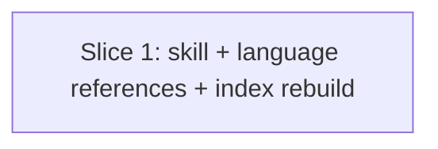

# Plan: mutation-testing — recommend local install with language-specific install commands

**Created**: 2026-07-01
**Branch**: issue-549
**Status**: implemented
**Spec**: [docs/specs/mutation-testing-prefer-local-install.md](../docs/specs/mutation-testing-prefer-local-install.md)
**Issue**: [#549](https://github.com/bdfinst/agentic-dev-team/issues/549)

## Goal

Lift the "prefer a local install" pattern (already applied to the C# / Stryker.NET reference) up to the language-agnostic `SKILL.md` and propagate it to every language reference (JavaScript, Python, Java, Go), so the mutation-testing skill teaches one consistent install narrative across all five language paths. Each language file gains an install-visibility probe one-liner; the Go file explicitly flags its `go install → $GOPATH/bin` `PATH` requirement rather than pretending the install is project-local.

## Approach stance (high-reversal-cost axes)

- **Scope:** minimum viable. Docs-only. No detection-logic changes; no new install helper; no test authoring for wording. Explicit non-goals mirror issue #549.
- **Format fidelity:** edit-in-place. All six existing markdown files are edited; no restructure, no reformat outside the changed sections.
- **Replace-vs-merge:** merge. Every touched section adds or amends a small block; nothing is removed except the specific gaps identified.
- **Auto-merge:** yes, armed at PR-open time — this diff touches only `*.md` files (plus the regenerated knowledge index, which is docs-adjacent metadata), matching the project's docs-only auto-merge rule (`CLAUDE.md`).

## Acceptance Criteria

- [ ] `plugins/dev-team/skills/mutation-testing/SKILL.md` § Step 1 contains the "Prefer a local install" paragraph (wording per issue #549 § 1) before the language-file handoff.
- [ ] `references/languages/csharp-stryker-net.md` § Install / detect leads with `dotnet new tool-manifest && dotnet tool install dotnet-stryker` **and** shows a `dotnet stryker --version` visibility probe. (Verify — already the model; add probe if absent.)
- [ ] `references/languages/javascript-stryker.md` § Install / detect explicitly labels the `npm install --save-dev …` command as local (project-scoped) and shows a `npx stryker --version` visibility probe.
- [ ] `references/languages/python-mutmut.md` § Install / detect leads with venv-scoped `pip install mutmut` **or** `pyproject.toml [project.optional-dependencies] dev`, calls out venv scope explicitly, and shows a `mutmut --version` visibility probe.
- [ ] `references/languages/java-pitest.md` § Install / detect explicitly notes the plugin declaration is project-scoped by design and shows the Maven visibility probe `./mvnw org.pitest:pitest-maven:help -Ddetail=true -Dgoal=mutationCoverage | head -1` (with a Gradle-equivalent note).
- [ ] `references/languages/go-go-mutesting.md` § Install / detect explicitly states `go install …@latest` writes to `$GOPATH/bin` and requires that directory on `PATH`, and shows the visibility probe `command -v go-mutesting || echo "go-mutesting not on PATH — check $GOPATH/bin"`.
- [ ] Knowledge index rebuild (`bash plugins/dev-team/hooks/lib/build-knowledge-index.sh`) produces a clean tree — `knowledge_index_current.bats` passes.
- [ ] Existing `bats tests/skills/mutation-testing/` suite still passes; no test authored for prose wording.
- [ ] PR title uses conventional `docs(mutation-testing): …` prefix and the diff touches only the six markdown files plus (if regenerated) the knowledge index. *(Verified at PR-open time, not via a build step — the pre-PR gate below asserts it.)*

## Slices

### Slice 1: Skill-level "prefer local install" note + per-language install/probe alignment

**Depends-on:** none
**Files:**

- `plugins/dev-team/skills/mutation-testing/SKILL.md`
- `plugins/dev-team/skills/mutation-testing/references/languages/csharp-stryker-net.md`
- `plugins/dev-team/skills/mutation-testing/references/languages/javascript-stryker.md`
- `plugins/dev-team/skills/mutation-testing/references/languages/python-mutmut.md`
- `plugins/dev-team/skills/mutation-testing/references/languages/java-pitest.md`
- `plugins/dev-team/skills/mutation-testing/references/languages/go-go-mutesting.md`
- `plugins/dev-team/knowledge/skill-index.md` *(regenerated, if the index script touches it)*

**Behavior:**

```gherkin
Feature: mutation-testing skill recommends local install with per-language guidance

  Scenario: Skill-level guidance recommends local install before delegating to language files
    Given a user opens plugins/dev-team/skills/mutation-testing/SKILL.md
    When they read "Step 1: Detect or set up tooling"
    Then they see a paragraph recommending a local install over a global one before the language-file handoff
    And the paragraph cites the observed Stryker.NET silent-failure case
    And it points at each language file for the concrete local-install command

  Scenario: Every language reference leads with the local install command
    Given any file under references/languages/ that documents a language mutation tool
    When a user reads its "Install / detect" section
    Then the primary install command shown is project-scoped (dotnet tool manifest, npm --save-dev, venv pip, Maven/Gradle plugin, or the honest go install PATH note)

  Scenario: Every language reference shows a visibility probe
    Given any language reference under references/languages/
    When a user reads its "Install / detect" section
    Then it shows a one-line command that confirms the tool resolves after install
    And the C# reference is the canonical model (dotnet stryker --version)

  Scenario: Go reference flags the $GOPATH/bin PATH requirement explicitly
    Given a user reads references/languages/go-go-mutesting.md § Install / detect
    When the install command runs
    Then the doc states that go install writes to $GOPATH/bin
    And states that $GOPATH/bin must be on PATH
    And the visibility probe short-circuits with an error message when the tool is not resolvable

  Scenario: Prefer-local-install paragraph precedes the language-file handoff sentence
    Given plugins/dev-team/skills/mutation-testing/SKILL.md
    When a reader scans "Step 1: Detect or set up tooling"
    Then the "Prefer a local install" paragraph's line number is lower than the line number of the sentence referencing references/tool-detection.md and the per-language handoff

  Scenario: Prefer-local-install paragraph appears exactly once
    Given plugins/dev-team/skills/mutation-testing/SKILL.md
    When a reader counts occurrences of the paragraph's opening phrase "Prefer a local install"
    Then the count is exactly 1

  Scenario: Knowledge index stays in sync
    Given the six markdown files are in their final, edited state (post steps 1.1–1.6)
    When a contributor runs bash plugins/dev-team/hooks/lib/build-knowledge-index.sh
    Then the script exits 0
    And a subsequent run produces no diff
    And CI's knowledge_index_current.bats passes

  Scenario: Existing skill test suite remains green after docs edits
    Given the six markdown files are in their final, edited state
    When a contributor runs bats plugins/dev-team/tests/skills/mutation-testing/
    Then all existing tests pass
    And no new test has been authored to assert on the inserted prose wording

  Scenario: Non-goals remain non-goals
    Given the diff for this change
    Then references/tool-detection.md is unchanged
    And no new install helper script is added
    And no code or hook files are modified
```

**Steps:**

#### Step 1.1: Add "Prefer a local install" paragraph to SKILL.md Step 1

**Complexity**: trivial
**RED**: `grep -F "Prefer a local install" plugins/dev-team/skills/mutation-testing/SKILL.md` returns nothing today; assert this fails as the "no paragraph yet" baseline.
**GREEN**: Insert the paragraph verbatim from issue #549 § 1 into `SKILL.md` § "Step 1: Detect or set up tooling", positioned before the sentence "Use [`references/tool-detection.md`] … then load the matching `references/languages/<lang>.md` for install and run commands." The paragraph cites the Stryker.NET silent-failure case and points at each language file for the concrete local-install command.
**REFACTOR**: None needed.
**Files**: `plugins/dev-team/skills/mutation-testing/SKILL.md`
**Verify**: All four must hold —

1. `grep -c "Prefer a local install" plugins/dev-team/skills/mutation-testing/SKILL.md` returns exactly `1` (present, and not duplicated).
2. `grep -n "Stryker.NET" plugins/dev-team/skills/mutation-testing/SKILL.md` — at least one hit lands inside the inserted paragraph's line range (the paragraph cites the observed silent-failure case).
3. `grep -n "references/languages/" plugins/dev-team/skills/mutation-testing/SKILL.md` — a reference to the per-language files appears inside the inserted paragraph.
4. Ordering: the line number of `"Prefer a local install"` is **less than** the line number of `"Use \[\`references/tool-detection.md\`\]"` — i.e. paragraph precedes the handoff sentence. Verify with `grep -n` on both strings and compare.
**Commit**: `docs(mutation-testing): add "prefer local install" note to SKILL.md Step 1`

#### Step 1.2: Verify C# reference has the local-install + visibility probe

**Complexity**: trivial
**RED**: Confirm the C# reference already contains `dotnet new tool-manifest` and — if missing — `dotnet stryker --version` as an install-verification probe distinct from its `dotnet --info | grep "Base Path"` runtime probe.
**GREEN**: If the visibility probe line is missing, add a two-line block under § Install / detect: `# Verify the tool resolves before configuring the run.` / `dotnet stryker --version`. If already present, leave the file untouched (verify-only step).
**REFACTOR**: None needed.
**Files**: `plugins/dev-team/skills/mutation-testing/references/languages/csharp-stryker-net.md`
**Verify**: `grep -F "dotnet stryker --version" plugins/dev-team/skills/mutation-testing/references/languages/csharp-stryker-net.md` returns the line.
**Commit**: `docs(mutation-testing): confirm C# reference install-visibility probe present` *(or skip if a no-op verify)*

#### Step 1.3: Align JavaScript / TypeScript reference

**Complexity**: trivial
**RED**: `grep -F "npx stryker --version" plugins/dev-team/skills/mutation-testing/references/languages/javascript-stryker.md` returns nothing.
**GREEN**: Under § Install / detect, add one sentence noting that `npm install --save-dev …` is the local (project-scoped) install path — resolves via `node_modules/.bin` without a global `PATH` edit. Add the visibility-probe block: `npx stryker --version`.
**REFACTOR**: None needed.
**Files**: `plugins/dev-team/skills/mutation-testing/references/languages/javascript-stryker.md`
**Verify**: Both grep patterns above (`--save-dev`, `npx stryker --version`) hit.
**Commit**: `docs(mutation-testing): call out JS Stryker as local install and add version probe`

#### Step 1.4: Align Python reference (venv scope)

**Complexity**: trivial
**RED**: `grep -F "mutmut --version" plugins/dev-team/skills/mutation-testing/references/languages/python-mutmut.md` returns nothing; and today's file doesn't explicitly call out venv scope.
**GREEN**: Under § Install / detect, present two mutually-exclusive local-install variants — (a) `pip install mutmut` inside an active virtual environment, or (b) declaration in `pyproject.toml [project.optional-dependencies] dev`. Add one sentence explicitly calling out that both are scoped to the active virtual environment. Add the visibility-probe block: `mutmut --version`.
**REFACTOR**: None needed.
**Files**: `plugins/dev-team/skills/mutation-testing/references/languages/python-mutmut.md`
**Verify**: `grep -F "mutmut --version"` hits; `grep -iE "virtual environment|venv" plugins/dev-team/skills/mutation-testing/references/languages/python-mutmut.md` returns at least one line in § Install / detect.
**Commit**: `docs(mutation-testing): scope Python mutmut install to venv and add version probe`

#### Step 1.5: Align Java / Kotlin reference (project-scoped plugin)

**Complexity**: trivial
**RED**: `grep -F "pitest-maven:help" plugins/dev-team/skills/mutation-testing/references/languages/java-pitest.md` returns nothing.
**GREEN**: Under § Install / detect, add one sentence noting that the Maven `<plugin>` declaration (and the Gradle `info.solidsoft.pitest` plugin) is project-scoped by design — resolves via the build tool's own dependency resolution, no user-configured `PATH`. Add the Maven visibility-probe block: `./mvnw org.pitest:pitest-maven:help -Ddetail=true -Dgoal=mutationCoverage | head -1`, followed by a one-line note that Gradle users can run `./gradlew tasks --group=pitest` as an equivalent.
**REFACTOR**: None needed.
**Files**: `plugins/dev-team/skills/mutation-testing/references/languages/java-pitest.md`
**Verify**: `grep -F "pitest-maven:help" …` hits; `grep -F "gradlew tasks --group=pitest" …` hits.
**Commit**: `docs(mutation-testing): mark pitest as project-scoped and add help-goal probe`

#### Step 1.6: Align Go reference (explicit `$GOPATH/bin` PATH note)

**Complexity**: trivial
**RED**: `grep -F "\$GOPATH/bin" plugins/dev-team/skills/mutation-testing/references/languages/go-go-mutesting.md` — the file already mentions `$GOPATH/bin` in the detection header; check for a **PATH-requirement statement** and a **visibility probe** — neither is present today.
**GREEN**: Under § Install / detect, add one sentence stating that `go install …@latest` writes to `$GOPATH/bin` and that `$GOPATH/bin` must be on `PATH` for `go-mutesting` to resolve. Add the visibility-probe block: `command -v go-mutesting || echo "go-mutesting not on PATH — check $GOPATH/bin"`.
**REFACTOR**: None needed.
**Files**: `plugins/dev-team/skills/mutation-testing/references/languages/go-go-mutesting.md`
**Verify**: `grep -F "command -v go-mutesting" …` hits; the sentence explicitly names `PATH` and `$GOPATH/bin`.
**Commit**: `docs(mutation-testing): flag go-mutesting PATH requirement and add version probe`

#### Step 1.7: Rebuild the knowledge index

**Complexity**: trivial
**RED**: After steps 1.1–1.6 land, `git status plugins/dev-team/knowledge/` may show a stale index (or not, depending on which fields the build script hashes). Verify by running the build script; if it produces a diff, the index was stale.
**GREEN**: Run `bash plugins/dev-team/hooks/lib/build-knowledge-index.sh`. Commit the regenerated index file(s) if any changed.
**REFACTOR**: None needed.
**Files**: `plugins/dev-team/knowledge/skill-index.md` *(or whatever the build script writes; script is authoritative)*
**Verify**: The build script's exit code is `0` (a non-zero exit — e.g. a missing PyYAML dependency — is a fail regardless of diff state). A second run of `build-knowledge-index.sh` produces no further diff. `bats plugins/dev-team/tests/hooks/knowledge_index_current.bats` passes.
**Commit**: `docs(mutation-testing): rebuild knowledge index after language-reference edits`

#### Step 1.8: Run the existing skill test suite

**Complexity**: trivial
**RED**: Run `bats plugins/dev-team/tests/skills/mutation-testing/`; expect green (no wording tests exist, so the docs edits should not regress structure).
**GREEN**: If any test fails, triage and adjust. **Do not** author new prose tests — that was an explicit non-goal in the spec.
**REFACTOR**: None needed.
**Files**: n/a — verification only.
**Verify**: `bats plugins/dev-team/tests/skills/mutation-testing/` passes.
**Commit**: n/a *(verification step; no commit unless a triage change was needed).*

## Parallelization

Single slice → single wave. No parallelization opportunity.



| Wave | Slices (parallel) |
|------|-------------------|
| 1 | 1 |

*Note: `plan-waves.sh` is a no-op input verification for a single-slice plan; no collisions possible.*

## Complexity Classification

All eight steps rated `trivial`: docs-only edits, single-file changes, no branching logic, no behavioral surface. Per the Complexity table, `/build` will skip inline review and rely on the final `/code-review` pass — consistent with how docs-only PRs are handled in this repo.

## Pre-PR Quality Gate

- [ ] `bats plugins/dev-team/tests/skills/mutation-testing/` passes
- [ ] `bats plugins/dev-team/tests/hooks/knowledge_index_current.bats` passes
- [ ] `scripts/ci-local.sh` passes locally
- [ ] `/code-review` passes (docs-only diff, low signal expected)
- [ ] PR title conforms to `docs(mutation-testing): …` (conventional)
- [ ] Auto-merge armed at PR-open time (`gh pr merge <num> --auto --squash`) — docs-only diff

## Skipped (low value)

*None.* Every acceptance criterion in the spec traces to at least one step above.

## Risks & Open Questions

- **Risk: knowledge-index build script may not touch a file the plan predicts.** If `build-knowledge-index.sh` only reads frontmatter, wording changes may not regenerate anything. Mitigation: step 1.7 is idempotent — a no-op run is a pass. The plan tolerates zero index diff.
- **Risk: C# reference already satisfies its criterion.** Step 1.2 is verify-only in the common case; skipping it is fine if the probe line is already present. This is not a real risk, just noted for clarity — the file will be re-read at build time.
- **Open question: none.** The spec's Ambiguity Log resolved every gap as `inferable`.

## Plan Review Summary

Plan tier: **trivial** — reviewers: **Acceptance Test Critic** (Design, UX, Strategic skipped — docs-only, no user-facing UI, no high-reversal-cost stance; Parallelization skipped — single-slice plan).

**Iterations:** 2 (initial `needs-revision` → revised → `approve`).

**Iteration 1** (`needs-revision`): 1 blocker (Step 1.1 Verify under-specified — didn't check wording fidelity, Stryker.NET citation, per-language pointer, or paragraph-before-handoff ordering), 2 warnings (unfalsifiable "global install fallback" clause; ordering-dependent Given in the index-sync scenario), 3 missing scenarios (AC8 bats-suite coverage, paragraph-ordering constraint, duplicate-insertion negative test), 2 step issues (AC9 traceability, Step 1.7 exit-code check).

**Iteration 2** (`approve`): all eight findings resolved. Step 1.1 Verify now runs four checks (count, citation, pointer, ordering). The unfalsifiable clause was dropped. The index-sync scenario's Given describes the final post-edit state directly. Three new scenarios added — "Existing skill test suite remains green after docs edits", "Prefer-local-install paragraph precedes the language-file handoff sentence", "Prefer-local-install paragraph appears exactly once". AC9 carries an explicit "verified at PR-open time" note; Step 1.7's Verify now asserts exit code 0.

**Remaining non-blocking observation:** the two generic "any file under references/languages/" scenarios could optionally be rewritten as a Scenario Outline with an Examples table naming each of the five language files. Falsifiable as written; deferred as style, not correctness.

## Build Progress

### Wave 1

- [x] Slice 1: Skill-level "prefer local install" note + per-language install/probe alignment
  - [x] Step 1.1: Add "Prefer a local install" paragraph to SKILL.md Step 1
  - [x] Step 1.2: Verify C# reference has the local-install + visibility probe
  - [x] Step 1.3: Align JavaScript / TypeScript reference
  - [x] Step 1.4: Align Python reference (venv scope)
  - [x] Step 1.5: Align Java / Kotlin reference (project-scoped plugin)
  - [x] Step 1.6: Align Go reference (explicit `$GOPATH/bin` PATH note)
  - [x] Step 1.7: Rebuild the knowledge index
  - [x] Step 1.8: Run the existing skill test suite
