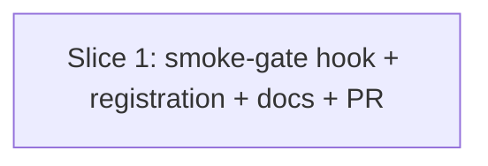

# Plan: Mutation-Testing Smoke Gate Hook (issue #565)

**Created**: 2026-07-02
**Branch**: issue-565-step1c-hook-enforcement
**Status**: approved
**Spec**: [docs/specs/mutation-testing-smoke-gate-hook.md](../docs/specs/mutation-testing-smoke-gate-hook.md)

## Approach stance

- **Scope**: single-issue fix, one hook. Not bundled with #567 (Windows signal-handling verification) or PR #568 (wrapper cross-platform).
- **Replace-vs-merge**: **merge**. Existing Step 1c SKILL.md prose stays (still describes *why* the gate exists and the diagnostic checklist); the hook is the *how*. Existing hooks under `plugins/dev-team/hooks/` unchanged.
- **Migrate-vs-edit-stub**: N/A — this is a new file plus small edits to `settings.json` + two markdown docs.
- **Format fidelity**: match existing PreToolUse hooks (`destructive-guard.sh`, `verify-guard.sh`) — stdin JSON, exit 2 to block with stdout message, exit 0 for silent-pass or advisory. Match `mutation-gate.sh`'s jq/python3 fail-safe pattern (missing dep → advisory, never block).
- **Auto-merge**: touches a shipped hook, `settings.json`, and skill markdown. **NOT** docs-only. Human merge required per CLAUDE.md.
- **Report schema (revision 2)**: parse the mutation-testing-elements schema (`{schemaVersion, mutants[]}` with `.status ∈ {"Killed", "Survived", "Timeout", "NoCoverage", "CompileError"}`) — this is what BOTH Stryker.NET and JS Stryker actually emit. The initial spec's `.killed` / `.survived` flat-count assumption was wrong; verified against `tests/hooks/fixtures/stryker-net/mutation-report-zero-kill.json`.
- **Reuse over reinvention (revision 2)**: cwd extraction via `.cwd` field on the PreToolUse payload with `$PWD` fallback (matches `cost-meter.sh`). Command hashing via shell-native `shasum -a 256 || sha256sum` (matches `hooks/lib/review-gate-hash.sh`) — no `python3 hashlib`.

## Goal

Promote the Step 1c smoke gate from SKILL.md prose (shipped in PR #562) to a Claude Code `PreToolUse` hook that mechanically blocks whole-scope Stryker.NET invocations until a smoke run has landed a `mutation-report.json` at `StrykerOutput/smoke/reports/mutation-report.json` whose `mutants[]` array contains at least one entry with `status="Killed"`. Adds a `MUTATION_SMOKE_GATE_SKIP=1` env-var escape hatch with an audit log. Closes #565.

## Acceptance Criteria

- [ ] `plugins/dev-team/hooks/mutation-testing-smoke-gate.sh` exists, executable, `set -uo pipefail`, header names its purpose + refs #565.
- [ ] Hook registered in `plugins/dev-team/settings.json` under the existing `PreToolUse.Bash` matcher block.
- [ ] Hook silent-passes when the command doesn't reference `dotnet stryker` or the shipped wrapper.
- [ ] Hook silent-passes when the command has a `--mutate` argument whose value is a single-file path (no glob metacharacters `*`, `?`, `[`, and no `;`).
- [ ] Hook **blocks** (exit 2) when the command has a `--mutate` argument whose value contains a semicolon (Stryker.NET's multi-file `--mutate 'a.cs;b.cs'` syntax counts as multi-file, per spec).
- [ ] Hook silent-passes when the smoke report exists AND `mutants[]` contains at least one `.status == "Killed"`.
- [ ] Hook **blocks** (exit 2) with a specific stdout message when no smoke report exists.
- [ ] Hook **blocks** (exit 2) when the report contains mutants but none with `.status == "Killed"` AND at least one with `.status == "Survived"` — message names the observed counts, references #554/#557, points at SKILL.md Step 1c.
- [ ] Hook **blocks** (exit 2) when the report contains no `Killed` and no `Survived` (no scored mutants) — message says "no scored mutants; pick a different probe file."
- [ ] Every block message includes the `dotnet stryker --config-file ... --mutate '<one file>' -O StrykerOutput/smoke` example command.
- [ ] Every block message names `MUTATION_SMOKE_GATE_SKIP=1` as the escape hatch.
- [ ] `MUTATION_SMOKE_GATE_SKIP=1` → hook exits 0 silently AND appends one JSON line to `<cwd>/metrics/gate-bypass.jsonl` (`timestamp`, `hook`, `command_hash` (sha256 first 16 chars via `shasum -a 256 || sha256sum`), `cwd`).
- [ ] Audit line does **NOT** contain the raw command string — privacy invariant (only the sha256 hash is logged).
- [ ] `cwd` is extracted from the PreToolUse JSON payload's `.cwd` field, falling back to `$PWD` when absent (matches `cost-meter.sh` pattern).
- [ ] `metrics/` directory is created if absent; permission failure on write logs to stderr but hook still exits 0 (bypass succeeds).
- [ ] Missing `jq` → advisory (not a block), exit 0 — matches `mutation-gate.sh`.
- [ ] Missing `python3` → advisory, exit 0.
- [ ] Malformed JSON report (invalid syntax) → advisory, exit 0.
- [ ] Valid JSON report missing the `mutants[]` key → advisory, exit 0 (schema drift ≠ block ≠ silent-pass).
- [ ] Stale report (not freshness-checked in v1) — a passing report from an earlier session continues to pass the gate today. This locks in the documented "freshness not checked" v1 decision so a future "helpful" fix doesn't silently change behavior.
- [ ] SKILL.md Step 1c gains a paragraph naming `mutation-testing-smoke-gate.sh`, the fixed report path convention (`-O StrykerOutput/smoke`), and the escape-hatch env var + audit-log path.
- [ ] `csharp-stryker-net.md` gains one sentence cross-referencing the hook alongside the existing Step 1c link.
- [ ] `shellcheck` clean on the new hook.
- [ ] Cross-platform per `feedback_all_scripts_platform_neutral` — no GNU-only flags, no hard-coded macOS paths, bash 3.2-safe.
- [ ] Bats coverage: every scenario in the Gherkin below has a matching test; permission-failure test uses the repo's established `[[ "$(id -u)" -ne 0 ]] || skip "root bypasses directory permissions"` root-safe guard.
- [ ] Local gate (`scripts/ci-local.sh`) passes.
- [ ] PR title conventional: `feat(mutation-testing): pretooluse hook enforces step 1c smoke gate (#565)`.
- [ ] PR body uses `Closes #565`.

## Slices

### Slice 1: Smoke gate hook — trigger, block/pass, escape hatch, registration, docs

**Depends-on:** none
**Files:** `plugins/dev-team/hooks/mutation-testing-smoke-gate.sh`, `plugins/dev-team/settings.json`, `plugins/dev-team/skills/mutation-testing/SKILL.md`, `plugins/dev-team/skills/mutation-testing/references/languages/csharp-stryker-net.md`, `tests/hooks/mutation_testing_smoke_gate.bats`, `tests/hooks/fixtures/stryker-net/*.json` (new fixtures matching real schema)

**Behavior:**

```gherkin
Feature: PreToolUse hook enforces the Step 1c smoke gate on whole-scope Stryker.NET runs
  # All Given clauses assume the hook is registered as a PreToolUse Bash hook.
  # The command referenced in "When" is the value of .tool_input.command in
  # the PreToolUse payload JSON on stdin.

  # ----- Silent-pass paths — hook does not interfere ------------------------

  Scenario: Silent-pass on non-Stryker command
    When the command is `git status`
    Then the hook exits 0 with no stdout

  Scenario: Silent-pass on empty command
    When the command is an empty string
    Then the hook exits 0 with no stdout

  Scenario: Silent-pass on unrelated dotnet command
    When the command is `dotnet build MyProject.sln`
    Then the hook exits 0 with no stdout

  Scenario: Silent-pass on single-file --mutate probe (the smoke run itself)
    When the command is `dotnet stryker --config-file stryker-config.json --mutate 'src/Foo.cs' -O StrykerOutput/smoke`
    Then the hook exits 0 with no stdout
    And the smoke probe is not blocked

  Scenario: Silent-pass on single-file --mutate with double-quoted value
    When the command is `dotnet stryker --mutate "src/Foo.cs"`
    Then the hook exits 0 with no stdout

  Scenario: Silent-pass on wrapper invocation with a single-file --mutate
    When the command is `./scripts/csharp-stryker-net-wrapper.sh --mutate 'src/Foo.cs' -O StrykerOutput/smoke`
    Then the hook exits 0 with no stdout

  # ----- Block paths ---------------------------------------------------------

  Scenario: Block on whole-scope run when no smoke report exists
    Given no file at StrykerOutput/smoke/reports/mutation-report.json
    When the command is `dotnet stryker --config-file stryker-config.json --mutate '**/Validators/**/*.cs'`
    Then the hook exits with code 2
    And stdout names the missing StrykerOutput/smoke/reports/mutation-report.json path
    And stdout includes an example smoke-probe command
    And stdout names MUTATION_SMOKE_GATE_SKIP=1 as the escape hatch

  Scenario: Block on semicolon-separated multi-file --mutate (Stryker.NET multi-file syntax)
    Given no smoke report exists
    When the command is `dotnet stryker --mutate 'src/Foo.cs;src/Bar.cs'`
    Then the hook exits with code 2
    And the block message treats the command as whole-scope

  Scenario: Block when report contains mutants but none Killed and some Survived
    Given StrykerOutput/smoke/reports/mutation-report.json exists with schemaVersion:"1"
    And mutants[] contains 100 entries, all with status "Survived"
    When the command is `dotnet stryker --config-file stryker-config.json`
    Then the hook exits with code 2
    And stdout names the observed counts (Killed=0, Survived=100)
    And stdout references #554 and #557
    And stdout points at SKILL.md Step 1c for the diagnostic checklist

  Scenario: Block when report contains only NoCoverage and CompileError statuses (no scored mutants)
    Given StrykerOutput/smoke/reports/mutation-report.json exists with schemaVersion:"1"
    And mutants[] contains 50 entries with status "NoCoverage" and 20 with status "CompileError"
    And no entries have status "Killed" or "Survived"
    When the command is `dotnet stryker --config-file stryker-config.json`
    Then the hook exits with code 2
    And stdout says the smoke probe produced no scored mutants
    And stdout instructs picking a different probe file

  Scenario: Block when mutants[] is empty
    Given StrykerOutput/smoke/reports/mutation-report.json exists with schemaVersion:"1" and empty mutants[]
    When the command is `dotnet stryker --config-file stryker-config.json`
    Then the hook exits with code 2
    And stdout says the smoke probe produced no scored mutants

  Scenario: Silent-pass when report has at least one Killed mutant
    Given StrykerOutput/smoke/reports/mutation-report.json exists with schemaVersion:"1"
    And mutants[] contains a mix of status values including at least one "Killed"
    When the command is `dotnet stryker --config-file stryker-config.json`
    Then the hook exits 0 with no stdout

  Scenario: Silent-pass locked to today's behavior — stale report is not freshness-checked
    Given StrykerOutput/smoke/reports/mutation-report.json exists with at least one Killed mutant
    And the report file's mtime is 30 days old
    When the command is `dotnet stryker --config-file stryker-config.json`
    Then the hook exits 0 with no stdout
    # v1 does not check freshness — this scenario locks that decision so a future
    # freshness-fix doesn't silently change behavior.

  # ----- Escape hatch --------------------------------------------------------

  Scenario: Escape hatch skips the gate and logs the bypass
    Given MUTATION_SMOKE_GATE_SKIP=1 is set
    And no smoke report exists (the gate would otherwise block)
    When the command is `dotnet stryker --config-file stryker-config.json`
    Then the hook exits 0 with no stdout
    And metrics/gate-bypass.jsonl gains one line with timestamp, hook name, command_hash, cwd

  Scenario: Audit line does NOT contain the raw command string (privacy invariant)
    Given MUTATION_SMOKE_GATE_SKIP=1 is set
    When the hook fires against a command containing a distinctive string like "secret-payload-42"
    Then the appended audit line does not contain "secret-payload-42"
    And the audit line contains a command_hash field (16 hex characters)

  Scenario: cwd is taken from the PreToolUse payload's .cwd field
    Given MUTATION_SMOKE_GATE_SKIP=1 is set
    And the PreToolUse payload's .cwd is a specific directory
    When the hook fires
    Then metrics/gate-bypass.jsonl is written under that payload .cwd path
    And the audit line's cwd field equals the payload .cwd value

  Scenario: cwd falls back to $PWD when the payload has no .cwd field
    Given MUTATION_SMOKE_GATE_SKIP=1 is set
    And the PreToolUse payload has no .cwd field
    When the hook fires with a known $PWD
    Then metrics/gate-bypass.jsonl is written under $PWD/metrics/
    And the audit line's cwd field equals $PWD

  Scenario: Escape hatch tolerates a missing metrics/ directory
    Given MUTATION_SMOKE_GATE_SKIP=1 is set
    And the metrics/ directory does not exist
    When the hook fires
    Then metrics/ is created
    And the bypass line is appended

  Scenario: Escape hatch tolerates a metrics/ permission failure (non-root only)
    Given MUTATION_SMOKE_GATE_SKIP=1 is set
    And metrics/ exists but is chmod 000 (write-denied)
    And the test is running as non-root
    When the hook fires
    Then the hook still exits 0 (bypass succeeds)
    And stderr logs the audit failure

  # ----- Advisories: missing deps, malformed report, schema drift -----------

  Scenario: Missing jq falls back to advisory
    Given jq is not on PATH
    When the command is `dotnet stryker --config-file stryker-config.json`
    Then the hook exits 0 with an ADVISORY prefix on stdout
    And the command is not blocked

  Scenario: Missing python3 falls back to advisory
    Given python3 is not on PATH
    When the command is `dotnet stryker --config-file stryker-config.json`
    Then the hook exits 0 with an ADVISORY prefix on stdout

  Scenario: Malformed report JSON falls back to advisory (not silent-pass)
    Given StrykerOutput/smoke/reports/mutation-report.json is present but contains invalid JSON
    When the command is `dotnet stryker --config-file stryker-config.json`
    Then the hook exits 0 with an ADVISORY prefix on stdout naming the malformed report
    And the command is not blocked
    And the response is distinguishable from a silent-pass (advisory has non-empty stdout)

  Scenario: Schema drift — valid JSON missing the mutants[] key falls back to advisory
    Given StrykerOutput/smoke/reports/mutation-report.json is valid JSON but has no mutants[] key
    When the command is `dotnet stryker --config-file stryker-config.json`
    Then the hook exits 0 with an ADVISORY prefix on stdout
    And the advisory notes the schema is not the mutation-testing-elements shape
    And the command is not blocked

  # ----- Registration + doc-shape (structural lint, not BDD) -----------------

  Scenario: Hook is registered under PreToolUse.Bash in settings.json
    When settings.json is parsed
    Then the PreToolUse.Bash matcher block references hooks/mutation-testing-smoke-gate.sh

  Scenario: SKILL.md Step 1c documents the hook
    When an operator reads Step 1c
    Then it names mutation-testing-smoke-gate.sh as the enforcement mechanism
    And it documents the -O StrykerOutput/smoke path convention
    And it documents MUTATION_SMOKE_GATE_SKIP=1 and metrics/gate-bypass.jsonl

  Scenario: csharp-stryker-net.md cross-references the hook
    When an operator reads the xunit.v3 section that links to Step 1c
    Then it also mentions the smoke-gate hook (name reference is sufficient)
```

**Steps:**

#### Step 1.1: RED — bats scaffolding + hook skeleton (trigger detection, silent-pass paths, semicolon block)

**Complexity**: standard
**RED**: Create `tests/hooks/mutation_testing_smoke_gate.bats` with:

- Test infrastructure: hermetic tempdir; a `_dispatch_hook` helper that composes a PreToolUse JSON payload (`{"tool_input": {"command": "..."}, "cwd": "<hermetic-root>"}`) and pipes it to the hook via stdin; captures stdout, stderr, exit code.
- Fixture-writing helpers that build reports matching the real mutation-testing-elements schema (see `tests/hooks/fixtures/stryker-net/mutation-report-zero-kill.json` for the shape). Two helpers:
  - `_write_report_with_statuses <path> <status1> <status2> ...` — writes `{"schemaVersion": "1", "mutants": [{"id":"1","status":"..."}...]}` for the given status list.
  - `_write_report_raw <path> <literal-json>` — for malformed-JSON and schema-drift tests.

Tests for this step:

- `hook: file exists and is executable`
- `hook: passes shellcheck`
- `hook: silent-pass on empty command`
- `hook: silent-pass on non-Stryker command` (payload: `git status`)
- `hook: silent-pass on unrelated dotnet command` (payload: `dotnet build`)
- `hook: silent-pass on single-file --mutate glob (probe smoke run itself)`
- `hook: silent-pass on --mutate with double-quoted single file`
- `hook: silent-pass on wrapper invocation with single-file --mutate`

(The semicolon-separated multi-file block test lives in Step 1.2, alongside the other block-path tests — Step 1.1's skeleton falls through to a temporary `exit 0` placeholder, which the semicolon-block test would spuriously pass against here.)

Run bats — all fail.

**GREEN**: Create `plugins/dev-team/hooks/mutation-testing-smoke-gate.sh`. Skeleton:

```bash
#!/usr/bin/env bash
# mutation-testing-smoke-gate.sh — PreToolUse hook (#565).
# Enforces SKILL.md Step 1c smoke gate: blocks whole-scope Stryker.NET runs
# until a smoke probe has produced a mutation-report.json with a Killed mutant.
set -uo pipefail

SCRIPT_DIR="$(cd "$(dirname "${BASH_SOURCE[0]}")" && pwd)"

# jq / python3 fail-safes (advisory pattern from mutation-gate.sh).
if ! command -v jq >/dev/null 2>&1; then
    printf 'ADVISORY: mutation-testing-smoke-gate: jq is required but not installed; gate not enforced\n'
    exit 0
fi
if ! command -v python3 >/dev/null 2>&1; then
    printf 'ADVISORY: mutation-testing-smoke-gate: python3 is required but not installed; gate not enforced\n'
    exit 0
fi

INPUT="$(cat)"
COMMAND="$(printf '%s' "$INPUT" | jq -r '.tool_input.command // empty' 2>/dev/null || true)"
[ -n "$COMMAND" ] || exit 0

# Trigger detection.
is_stryker_command() {
    printf '%s' "$1" | grep -qE '(^|[^a-zA-Z0-9])dotnet[[:space:]]+stryker(\b|$)|csharp-stryker-net-wrapper\.sh'
}

# Extract --mutate value (handles --mutate=X, --mutate X, -m X).
# Returns empty when no --mutate present.
extract_mutate_value() {
    printf '%s' "$1" | python3 -c '
import sys, shlex
try:
    tokens = shlex.split(sys.stdin.read())
except ValueError:
    sys.exit(0)  # unbalanced quotes — bail; caller treats as no --mutate
for i, t in enumerate(tokens):
    if t.startswith("--mutate="):
        print(t.split("=", 1)[1]); sys.exit(0)
    if t == "--mutate" or t == "-m":
        if i + 1 < len(tokens):
            print(tokens[i + 1]); sys.exit(0)
' 2>/dev/null || true
}

# Single-file: no glob metacharacters and no semicolon.
is_single_file_mutate() {
    case "$1" in
        "")            return 1 ;;
        *[\*\?\[]* )   return 1 ;;
        *";"*)         return 1 ;;
        *)             return 0 ;;
    esac
}

is_stryker_command "$COMMAND" || exit 0

MUTATE_VALUE="$(extract_mutate_value "$COMMAND")"
is_single_file_mutate "$MUTATE_VALUE" && exit 0

# Whole-scope detected — Step 1.2 adds the report-check + block logic here.
: "placeholder for Step 1.2"
exit 0  # temporary: allow through until Step 1.2 GREEN
```

Note: the skeleton's final "placeholder exit 0" is a temporary state — Step 1.1's tests all fall through to it and would silently pass without the block-path RED tests, so **the semicolon-block test's assertion must include a marker that Step 1.2 will provide** (the block message). To keep Step 1.1's RED honest, the semicolon-block test can be authored to assert exit 2 AND stdout contains the block-message marker — both fail during Step 1.1, both pass after Step 1.2. Alternatively (cleaner), defer the semicolon-block test to Step 1.2. **Adopting the cleaner variant**: Step 1.1's tests cover silent-pass paths only; the semicolon-block test moves to Step 1.2 alongside the report-check tests.

**REFACTOR**: shellcheck clean; bash 3.2-safe.
**Files**: `plugins/dev-team/hooks/mutation-testing-smoke-gate.sh`, `tests/hooks/mutation_testing_smoke_gate.bats`
**Commit**: `feat(mutation-testing): smoke-gate hook skeleton with trigger detection (#565)`

#### Step 1.2: RED — block-on-missing-report + report-schema parsing + block/pass paths

**Complexity**: standard
**RED**: Extend the bats file:

- `hook: block on semicolon-separated multi-file --mutate` — exit 2, block-message shape asserted
- `hook: block on whole-scope run when no report exists` — exit 2; stdout names path
- `hook: block message on missing report includes the example smoke-probe command`
- `hook: block message on missing report includes MUTATION_SMOKE_GATE_SKIP=1`
- `hook: block when report contains only Survived statuses` — fixture written via `_write_report_with_statuses` with 100 × `Survived`; assert exit 2, stdout mentions #554 and #557 and observed count
- `hook: block message on Killed=0 Survived>0 points at SKILL.md Step 1c`
- `hook: block when report contains only NoCoverage + CompileError` — fixture with statuses `NoCoverage`×50, `CompileError`×20; assert exit 2, message says "no scored mutants"
- `hook: block when mutants[] is empty` — fixture with `{"schemaVersion":"1","mutants":[]}`; assert exit 2, message says "no scored mutants"
- `hook: silent-pass when report has at least one Killed mutant` — fixture reuses the existing `tests/hooks/fixtures/stryker-net/mutation-report-zero-kill.json` verbatim (it has `["Killed","Survived"]`, satisfying `killed>=1`)
- `hook: silent-pass on stale report (freshness NOT checked in v1)` — write a valid Killed report, then `touch -t <30 days ago>` its mtime; assert silent-pass. Locks the documented v1 behavior.

Run bats — new tests fail.

**GREEN**: Extend hook. First hoist cwd extraction to run right after `COMMAND` extraction (both the report path AND Step 1.3's audit path resolve against the same `PAYLOAD_CWD` — no split between the two resolution bases):

```bash
# Extract cwd from PreToolUse payload; fall back to $PWD.
PAYLOAD_CWD="$(printf '%s' "$INPUT" | jq -r '.cwd // empty' 2>/dev/null || true)"
: "${PAYLOAD_CWD:=$PWD}"
```

Then replace the Step 1.1 placeholder with report-check logic that resolves against `PAYLOAD_CWD`:

```bash
REPORT_PATH="$PAYLOAD_CWD/StrykerOutput/smoke/reports/mutation-report.json"

if [ ! -f "$REPORT_PATH" ]; then
    print_block_message "no smoke report at $REPORT_PATH"
    exit 2
fi

# Validate JSON first (Step 1.3 handles malformed via advisory).
if ! jq empty "$REPORT_PATH" 2>/dev/null; then
    : "placeholder for Step 1.3 malformed handling"
fi

# Count mutants by status using the real schema.
KILLED="$(jq -r '[.mutants[]? | select(.status=="Killed")] | length' "$REPORT_PATH" 2>/dev/null || echo 0)"
SURVIVED="$(jq -r '[.mutants[]? | select(.status=="Survived")] | length' "$REPORT_PATH" 2>/dev/null || echo 0)"

if [ "$KILLED" -gt 0 ]; then
    exit 0  # silent pass
fi

if [ "$SURVIVED" -gt 0 ]; then
    print_block_message "killed=0 survived=$SURVIVED — mutation-switch not observing mutations (see #554, #557 and SKILL.md Step 1c)"
    exit 2
fi

# No Killed and no Survived — either empty mutants[] or only NoCoverage/CompileError.
print_block_message "no scored mutants in smoke report — pick a different probe file with real test coverage"
exit 2
```

`print_block_message` composes:

```
[BLOCK] mutation-testing-smoke-gate: whole-scope Stryker.NET run detected

<specific-diagnostic-line>

The Step 1c smoke gate (see SKILL.md § Step 1c) requires a single-file
mutation probe with Killed > 0 before authorizing a full run. This
prevents the silent 0.00% failure mode (see #554, #557).

To run the smoke probe:

  dotnet stryker --config-file stryker-config.json \
    --mutate 'path/to/one/covered/file.cs' \
    -O StrykerOutput/smoke

Then re-run this command. To bypass this gate for a legitimate exception,
set MUTATION_SMOKE_GATE_SKIP=1 in the environment (audit-logged).
```

`.mutants[]?` uses jq's optional array iteration so a missing `mutants` key doesn't error (that case falls to Step 1.3's schema-drift advisory).

**REFACTOR**: extract `print_block_message()`; hook stays under ~200 lines. Verify parsing works against `tests/hooks/fixtures/stryker-net/mutation-report-zero-kill.json` directly.
**Files**: `plugins/dev-team/hooks/mutation-testing-smoke-gate.sh`, `tests/hooks/mutation_testing_smoke_gate.bats`
**Commit**: `feat(mutation-testing): smoke-gate parses mutation-testing-elements schema and blocks on failure (#565)`

#### Step 1.3: RED — escape hatch + audit log (shell hash, .cwd extraction) + advisories

**Complexity**: standard
**RED**: Extend the bats file:

- `hook: MUTATION_SMOKE_GATE_SKIP=1 skips silently even when the gate would block`
- `hook: escape hatch appends one line to metrics/gate-bypass.jsonl`
- `hook: audit line contains timestamp, hook name, command_hash, cwd`
- `hook: audit line's command_hash is 16 hex characters`
- `hook: audit line does NOT contain the raw command string (privacy invariant)` — command contains distinctive string `"secret-payload-42"`; assert audit line has no substring match
- `hook: cwd is taken from PreToolUse payload's .cwd field` — payload cwd points at a temp dir; assert metrics/ is created there
- `hook: cwd falls back to $PWD when payload lacks .cwd` — payload omits .cwd; assert metrics/ is at $PWD/metrics/
- `hook: escape hatch creates metrics/ if absent`
- `hook: escape hatch tolerates a chmod 000 metrics/ (non-root only)` — includes the required `[[ "$(id -u)" -ne 0 ]] || skip "root bypasses directory permissions"` root-guard AND `chmod 755 "$D/metrics"` restore in the test teardown so the hermetic-teardown can rm the tempdir
- `hook: missing jq → ADVISORY (exit 0, non-empty stdout, command not blocked)` — use a hermetic PATH override that hides jq: `PATH="$HERMETIC_ROOT/no-jq-bin:/usr/bin:/bin"` where the override dir has no `jq` symlink
- `hook: missing python3 → ADVISORY` — same pattern with python3 hidden
- `hook: malformed report JSON → ADVISORY (exit 0), not silent-pass, not block`
- `hook: advisory on malformed report names the report path`
- `hook: valid JSON missing mutants[] key → ADVISORY (schema drift)`
- `hook: schema-drift advisory does NOT contain the "no scored mutants" phrase` — locks the ordering (schema-drift check MUST fire before the mutant-count block-decision) so a REFACTOR reordering can't silently downgrade drift into "no scored mutants" block

Run bats — new tests fail.

**GREEN**: Extend hook.

Escape hatch + audit log — using shell-native sha256. `PAYLOAD_CWD` was already extracted in Step 1.2; reuse it here (both the audit path and the report path resolve against the same base):

```bash
# Reusing PAYLOAD_CWD from Step 1.2's extraction — do NOT duplicate.
# shellcheck source=./lib/review-gate-hash.sh
# (not sourcing that file — we're reusing its shell-native hashing PATTERN, not the function itself, since review_gate_hash hashes git diff)
_sha256_first_16() {
    printf '%s' "$1" | { shasum -a 256 2>/dev/null || sha256sum 2>/dev/null; } | cut -c1-16
}

_iso_utc_timestamp() {
    # Cross-platform ISO-8601 UTC. GNU date has -u -Iseconds; BSD date on
    # macOS accepts a slightly different form. python3 is our lowest common
    # denominator (we already declared it a dependency above).
    python3 -c 'import datetime; print(datetime.datetime.now(datetime.timezone.utc).isoformat().replace("+00:00","Z"))'
}

log_bypass_audit() {
    local audit_dir="$PAYLOAD_CWD/metrics"
    local audit_file="$audit_dir/gate-bypass.jsonl"
    local command_hash timestamp line
    command_hash="$(_sha256_first_16 "$1")"
    timestamp="$(_iso_utc_timestamp)"
    if ! mkdir -p "$audit_dir" 2>/dev/null; then
        printf 'mutation-testing-smoke-gate: cannot create %s (bypass still succeeds)\n' "$audit_dir" >&2
        return 0
    fi
    line="$(jq -c -n \
        --arg ts "$timestamp" \
        --arg hook "mutation-testing-smoke-gate" \
        --arg hash "$command_hash" \
        --arg cwd "$PAYLOAD_CWD" \
        '{timestamp: $ts, hook: $hook, command_hash: $hash, cwd: $cwd}')"
    if ! printf '%s\n' "$line" >>"$audit_file" 2>/dev/null; then
        printf 'mutation-testing-smoke-gate: cannot write to %s (bypass still succeeds)\n' "$audit_file" >&2
    fi
}

if [ "${MUTATION_SMOKE_GATE_SKIP:-0}" = "1" ]; then
    log_bypass_audit "$COMMAND"
    exit 0
fi
```

Escape hatch check moves to a position BEFORE the report checks but AFTER trigger detection — bypass only fires on commands that would otherwise be gated.

Malformed report + schema-drift advisories — replace the Step 1.2 placeholder:

```bash
if ! jq empty "$REPORT_PATH" 2>/dev/null; then
    printf 'ADVISORY: mutation-testing-smoke-gate: report at %s is not valid JSON — cannot enforce gate; command not blocked\n' "$REPORT_PATH"
    exit 0
fi

# Schema-drift check — real schema has top-level "mutants" array.
if ! jq -e '.mutants' "$REPORT_PATH" >/dev/null 2>&1; then
    printf 'ADVISORY: mutation-testing-smoke-gate: report at %s lacks the mutants[] key — not the mutation-testing-elements shape; cannot enforce gate\n' "$REPORT_PATH"
    exit 0
fi
```

**REFACTOR**: shellcheck clean. Hook stays under ~200 lines. All new dependencies (`shasum` / `sha256sum`) are cross-platform-available.
**Files**: `plugins/dev-team/hooks/mutation-testing-smoke-gate.sh`, `tests/hooks/mutation_testing_smoke_gate.bats`
**Commit**: `feat(mutation-testing): smoke-gate escape hatch + audit log + advisories (#565)`

#### Step 1.4: Register hook + update SKILL.md + csharp-stryker-net.md

**Complexity**: trivial
**RED**: Add source-lint tests:

- `settings.json registers mutation-testing-smoke-gate.sh under PreToolUse.Bash` — jq query
- `SKILL.md Step 1c names the smoke-gate hook`
- `SKILL.md Step 1c documents -O StrykerOutput/smoke path convention`
- `SKILL.md Step 1c documents MUTATION_SMOKE_GATE_SKIP=1 escape hatch`
- `SKILL.md Step 1c documents metrics/gate-bypass.jsonl audit path`
- `csharp-stryker-net.md xunit.v3 section mentions the hook`

Run bats — new tests fail.

**GREEN**:

1. Edit `plugins/dev-team/settings.json` — append `{"type": "command", "command": "bash hooks/mutation-testing-smoke-gate.sh"}` under the existing `PreToolUse.Bash` matcher block.
2. Edit `SKILL.md` Step 1c — append one paragraph documenting the hook, the `-O StrykerOutput/smoke` convention, and `MUTATION_SMOKE_GATE_SKIP=1` + audit log path.
3. Edit `csharp-stryker-net.md` — add one sentence to the xunit.v3 Step 1c link paragraph naming the hook.
4. Run `bash plugins/dev-team/hooks/lib/build-knowledge-index.sh` after skill edits.

**REFACTOR**: `jq . plugins/dev-team/settings.json >/dev/null` confirms JSON validity.
**Files**: `plugins/dev-team/settings.json`, `plugins/dev-team/skills/mutation-testing/SKILL.md`, `plugins/dev-team/skills/mutation-testing/references/languages/csharp-stryker-net.md`, `tests/hooks/mutation_testing_smoke_gate.bats`
**Commit**: `feat(mutation-testing): register smoke-gate hook + document in SKILL.md + reference (#565)`

#### Step 1.5: Local gate + open PR

**Complexity**: trivial
**RED**: N/A — gate step.
**GREEN**: Run all hook + skill bats tests. Run `bash scripts/ci-local.sh`. Push branch, open PR titled `feat(mutation-testing): pretooluse hook enforces step 1c smoke gate (#565)`. PR body uses `Closes #565`.
**REFACTOR**: N/A.
**Files**: none.
**Commit**: n/a.

## Parallelization

Single-slice plan.



| Wave | Slices (parallel) |
|------|-------------------|
| 1 | 1 |

Parallelization Critic skipped — single-slice plan.

## Complexity Classification

- Step 1.1 (skeleton + trigger detection): **standard**
- Step 1.2 (block paths + real-schema parsing): **standard**
- Step 1.3 (escape hatch + audit + advisories + schema-drift): **standard**
- Step 1.4 (registration + docs): **trivial**
- Step 1.5 (PR gate): **trivial**

## Pre-PR Quality Gate

- [ ] All bats tests pass — ~30 tests total across the 4 test-adding steps.
- [ ] `shellcheck` clean on the new hook.
- [ ] `jq . plugins/dev-team/settings.json >/dev/null` — settings.json remains valid JSON.
- [ ] `bash scripts/ci-local.sh` passes.
- [ ] `bash plugins/dev-team/hooks/lib/build-knowledge-index.sh` after SKILL.md edit.
- [ ] `/code-review` passes.
- [ ] PR title conventional; PR body uses `Closes #565`.

## Risks & Open Questions

- **`shlex.split` on obscure shell escaping**: users writing exotic bash (heredocs, eval, dynamic arrays) may bypass trigger detection. Documented in the hook header as a known limitation. Same class of edge case as `destructive-guard.sh`.
- **Report-schema drift**: today Stryker.NET and JS Stryker both emit the mutation-testing-elements schema (`schemaVersion`, `mutants[]` with `.status`). If either tool changes shape, the schema-drift advisory fires and doesn't block — safe degradation.
- **`metrics/gate-bypass.jsonl` growth**: unbounded in v1. If bypass usage becomes noisy, add rotation later.
- **`.cwd` payload extraction**: `.cwd` is a documented field on PreToolUse payloads; the fallback to `$PWD` covers older payload versions or non-CC callers.
- **Cross-platform hash implementations**: `shasum -a 256` (macOS default) OR `sha256sum` (Linux + Windows Git Bash) — the fallback chain matches `hooks/lib/review-gate-hash.sh`.
- **PR #568 (wrapper cross-platform) still open**: hook's wrapper-detection regex uses the stable filename `csharp-stryker-net-wrapper.sh`; no coupling to #568's internals.

## Plan Review Summary

Plan tier: **standard** — 1 slice, 5 files touched (1 new hook + 1 new bats + 1 settings edit + 2 markdown edits + fixture files), 3 `standard` steps + 2 `trivial`, no `complex` step. Reviewers dispatched: **Acceptance Test Critic + Design & Architecture Critic** (per the tier rubric). Parallelization Critic skipped — single-slice. UX Critic skipped — no UI surface.

**Reviewer verdicts (revision 1)**: Design = **approve** with 2 warnings; Acceptance = **needs-revision** with 3 blockers + 4 warnings.

**Reviewer verdicts (revision 2)**: Design = **approve**; Acceptance = **approve** (surfaced 2 residual warnings + 2 observations — all folded into revision 3 below).

**Revision 2 → 3 change log** (residual warnings + observations from Acceptance re-review):

- **W1 fix — Step 1.1 stale semicolon-block test removed.** Line 259's `hook: block on semicolon-separated multi-file --mutate` bullet was left in Step 1.1's RED list after the "Adopting the cleaner variant" declaration; deleted so an implementer following the checklist doesn't try to make an impossible test pass against Step 1.1's temporary `exit 0` placeholder. Explanatory note added.
- **W2 fix — cwd resolution unified.** `PAYLOAD_CWD` extraction hoisted from Step 1.3 into Step 1.2 (right after `COMMAND` extraction). `REPORT_PATH` now resolves as `$PAYLOAD_CWD/StrykerOutput/...` for symmetry with the audit path's `$PAYLOAD_CWD/metrics/...`. Step 1.3's GREEN references the already-extracted variable rather than re-extracting.
- **Obs fix — schema-drift ordering pinned.** Added Step 1.3 bats test: `hook: schema-drift advisory does NOT contain the "no scored mutants" phrase` — locks the ordering (schema-drift check MUST run before the mutant-count block-decision) so REFACTOR can't silently downgrade drift into a "no scored mutants" block.
- **Obs fix — Gherkin typo corrected.** "StrykerOutger" → "StrykerOutput" in the Killed=0 Survived>0 scenario's Given clause.

**Revision 1 → 2 change log** (all 3 blockers + 6 warnings addressed):

Blockers fixed:

- (Acceptance) **Report schema corrected** — the hook now parses `mutants[] | select(.status=="Killed"|"Survived")` from the real mutation-testing-elements schema. Every Gherkin scenario's Given clause was rewritten to reference the real schema (`schemaVersion:"1"`, `mutants[]` with `.status` values). Fixtures reuse the existing `tests/hooks/fixtures/stryker-net/mutation-report-zero-kill.json` where possible, and new fixtures are hand-written to match that shape via a shared `_write_report_with_statuses` helper. Verified against the actual repo fixture.
- (Acceptance) **Semicolon-separated multi-file scenario added** — dedicated Gherkin scenario ("Block on semicolon-separated multi-file `--mutate`") + explicit bats test in Step 1.2. The spec's named ambiguity is now locked into the contract.
- (Acceptance) **Root-safe permission test guard added** — Step 1.3's chmod-000 test uses `[[ "$(id -u)" -ne 0 ]] || skip "root bypasses directory permissions"` and restores chmod 755 for teardown, matching `tests/hooks/artifact_usage_telemetry_tests.bats:185-203`.

Warnings addressed:

- (Design) **Shell-native sha256** — command hashing now uses `shasum -a 256 || sha256sum` (matches `hooks/lib/review-gate-hash.sh`), not `python3 hashlib`. Ambiguity Log citation in the spec was wrong; noted here for correction in a follow-up spec touch.
- (Design) **cwd from payload .cwd field** — hook extracts `.cwd` from the PreToolUse payload via jq, falls back to `$PWD` (matches `cost-meter.sh`). Dedicated Gherkin scenarios + bats tests for both paths.
- (Acceptance) **Privacy negative test** — new scenario + bats test: command contains distinctive `"secret-payload-42"`; audit line asserted to NOT contain that substring.
- (Acceptance) **Concrete Given/When on missing-dep advisories** — both scenarios now include a specific `dotnet stryker --config-file ...` command in the When clause.
- (Acceptance) **Freshness-not-checked scenario** — new "stale report is not freshness-checked" scenario locks the v1 documented behavior with a bats test that touches file mtime 30 days back.
- (Acceptance) **Schema-drift edge case** — new "valid JSON missing mutants[]" scenario + bats test; hook responds with ADVISORY (not block, not silent-pass) via the `.mutants` presence check in Step 1.3's GREEN.

Observations acknowledged (no plan change):

- (Design) The Ambiguity Log citation for `cost-meter.sh`'s hashing is factually wrong (`cost-meter.sh` does no hashing). Noted; corrected in this plan's stance rather than editing the spec.
- (Acceptance) The three doc/registration Gherkin scenarios are structural lint rather than user-observable behavior — grouped in a "Registration + doc-shape (structural lint, not BDD)" subsection.
- (Acceptance) Boilerplate "Given the hook is registered" moved into the Feature-level preamble so individual scenarios don't repeat it.

## Build Progress

### Wave 1

- [ ] Slice 1: Smoke gate hook — trigger, block/pass, escape hatch, registration, docs
  - [ ] Step 1.1: RED — bats scaffolding + hook skeleton (trigger detection, silent-pass paths)
  - [ ] Step 1.2: RED — block-on-missing-report + report-schema parsing + block/pass paths + semicolon multi-file block
  - [ ] Step 1.3: RED — escape hatch + audit log + advisories + schema-drift
  - [ ] Step 1.4: Register hook + update SKILL.md + csharp-stryker-net.md
  - [ ] Step 1.5: Local gate + open PR
