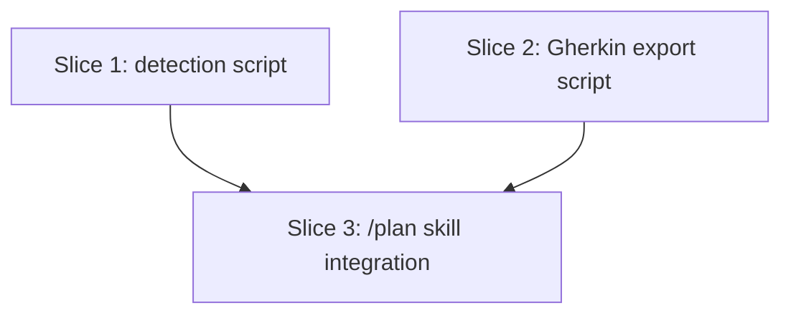

# Plan: `/plan` persists Gherkin to `.feature` files (issue #537)

**Created**: 2026-07-03
**Branch**: Issue-537
**Status**: approved
**Spec**: `docs/specs/plan-gherkin-feature-persistence.md`

## Goal

Make `/plan` detect the target project's BDD convention at plan-creation time (existing `.feature` files > BDD runner dependency in a manifest > no signal), record the persistence decision in the plan file's metadata, and — only after the plan is approved — export each slice's Gherkin block byte-for-byte to `<detected-dir>/<plan-slug>/slice-<N>-<slice-slug>.feature` via a deterministic script. No signal → one interactive prompt (`y`/`n`/`c`), or plan-file-only with a logged skip when non-interactive. Persist-only: no runner wiring, no step stubs, no sync, no retroactive generation.

## Approach stances (decision-defaults axes)

- **Scope**: touch only the two new scripts, `plan/SKILL.md`, `plan-template.md`, their tests, and the one-line `/plan` entry in `skills-registry.md`. No changes to `/build`, `/ship`, `gherkin-derive`, or existing plans.
- **Integration**: land via PR from `Issue-537`. This PR touches code and skills, so **explicit human merge** (repo rule overrides the auto-merge default).
- **Format fidelity**: derived `.feature` files are byte-for-byte copies of the plan's inline Gherkin (human-decided in the spec — no provenance header), enforced by the export script rather than prose.
- **Replace vs. merge**: skill/template edits are additive (merge). On re-export, files under `<dir>/<plan-slug>/` are overwritten by design — that subdirectory is tool-owned, the overwrite is always logged (never silent), and the plan file is the source of truth (stakeholder-ratified in the spec).

## Acceptance Criteria

From the spec (`docs/specs/plan-gherkin-feature-persistence.md`), named for what they assert:

- [ ] **Feature-files-beat-manifest**: a fixture with both `.feature` files and a cucumber-js dependency detects the `.feature` directory, not the manifest default.
- [ ] **Canonical-dir-per-stack**: each manifest signal (cucumber-js, pytest-bdd/behave, Reqnroll/SpecFlow, cucumber-jvm Maven+Gradle, godog) maps to its canonical destination, and the script's mapping stays in sync with `knowledge/test-stack-profiles/bdd-frameworks.md`.
- [ ] **Conservative-on-ambiguity**: multiple unrelated `.feature` roots, manifests with conflicting destinations, or vendored-only `.feature` files all yield `none`; multiple manifests sharing one destination do not.
- [ ] **No-signal-is-none**: a project with no BDD markers reports `signal: none`, `dir: null`.
- [ ] **Prompt-drives-persistence**: `plan/SKILL.md` instructs the one-time interactive prompt (`y = features/<plan-slug>/ | n = plan file only | c = custom path`), echoes the recorded decision, and validates a custom path (repo-relative, not vendored) with re-prompt on invalid input.
- [ ] **Headless-never-blocks**: non-interactive no-signal runs skip the prompt, default to plan-file-only, and log the skip.
- [ ] **Byte-for-byte-fidelity**: exported file content equals the slice's fenced Gherkin block exactly (modulo one trailing newline), no header — asserted by the export script's unit tests.
- [ ] **Post-approval-writes-only**: `/plan` shells to the export script only after the step-6 approval gate, with an explicit constraint-#1 carve-out; drafts never write files.
- [ ] **Overwrite-never-silent**: re-export replaces prior derived files under `<dir>/<plan-slug>/` and reports the overwrite count; a fresh export reports the files written.
- [ ] **Write-failures-surface**: an export that cannot write (path collision with a non-directory, unwritable destination) exits non-zero naming the offending path; `/plan` surfaces the error instead of claiming success.
- [ ] **Detection-failure-falls-back**: a non-zero exit from the detection script is treated as no-signal (prompt or headless skip) with its stderr surfaced; planning never dies mid-run on it.
- [ ] **Decision-recorded-and-honored**: the template metadata block carries `**Gherkin persistence**:`; a re-run that finds an existing plan file at the output path reads that line and honors it without re-prompting; editing the line is the documented way to change the decision.
- [ ] **Repo-gates-green**: `scripts/ci-local.sh` passes — stdlib-only Python 3.8+ scripts, pytest-only tests, no new `.bats`.

## Slices

### Slice 1: BDD convention detection script

**Depends-on:** none
**Files:** `plugins/dev-team/scripts/detect_bdd_convention.py`, `tests/scripts/test_detect_bdd_convention.py`

**Behavior:**

```gherkin
Feature: BDD convention detection
  A deterministic probe of a target project that reports where derived
  .feature files should land, preferring a false negative (no signal)
  over a false positive (wrong directory).

  Scenario: a single root of feature files is detected without any manifest
    Given a project whose only BDD marker is feature files under "specs/features"
    When BDD convention detection runs against the project
    Then the reported signal is "feature-files"
    And the reported destination is "specs/features"

  Scenario: existing feature files outrank a manifest dependency
    Given a project with feature files under "e2e/features"
    And a cucumber-js dependency declared in its package manifest
    When BDD convention detection runs against the project
    Then the reported signal is "feature-files"
    And the reported destination is "e2e/features"

  Scenario Outline: a BDD runner dependency maps to its canonical features directory
    Given a project with no feature files
    And a "<framework>" dependency declared in "<manifest>"
    When BDD convention detection runs against the project
    Then the reported signal is "manifest"
    And the reported destination is "<destination>"

    Examples:
      | framework    | manifest         | destination                        |
      | cucumber-js  | package.json     | features                           |
      | pytest-bdd   | pyproject.toml   | features                           |
      | behave       | requirements.txt | features                           |
      | Reqnroll     | test csproj      | Features under the test project    |
      | cucumber-jvm | pom.xml          | src/test/resources/features        |
      | cucumber-jvm | build.gradle     | src/test/resources/features        |
      | godog        | go.mod           | features                           |

  Scenario: feature files under multiple unrelated roots yield no signal
    Given a project with feature files under both "svc-a/features" and "svc-b/specs"
    When BDD convention detection runs against the project
    Then the reported signal is "none"
    And no destination is reported

  Scenario: feature files inside vendored directories are ignored
    Given a project whose only feature files live under "node_modules"
    When BDD convention detection runs against the project
    Then the reported signal is "none"

  Scenario: manifests with conflicting canonical directories yield no signal
    Given a project declaring both a cucumber-jvm dependency and a cucumber-js dependency
    When BDD convention detection runs against the project
    Then the reported signal is "none"

  Scenario: manifests sharing one canonical directory are not a conflict
    Given a project declaring both a pytest-bdd dependency and a behave dependency
    When BDD convention detection runs against the project
    Then the reported signal is "manifest"
    And the reported destination is "features"

  Scenario: a project with no BDD markers yields no signal
    Given a project with no feature files and no BDD dependency
    When BDD convention detection runs against the project
    Then the reported signal is "none"
    And no destination is reported

  Scenario: a nonexistent target fails loudly
    Given a target path that does not exist
    When BDD convention detection runs against the path
    Then the run exits non-zero
    And the error output names the target path
```

**Steps:**

#### Step 1.1: Feature-file scan with vendored excludes and multi-root conservatism

**Complexity**: standard
**RED**: `tests/scripts/test_detect_bdd_convention.py` — tmp-tree fixtures asserting: a single-root `.feature` scan with no manifest reports `feature-files` + the common directory; `.feature` files only under `node_modules/`/`vendor/`/`dist/`/`build/`/virtualenv/`.git/` report `none`; two unrelated roots report `none`; an empty project reports `none`/`dir: null`.
**GREEN**: implement `detect_bdd_convention.py` (stdlib-only: `pathlib`, `json`, `argparse`) with the `.feature` scan and the result dict `{signal, framework, dir}`.
**REFACTOR**: extract the vendored-exclude set and common-root helper; keep functions importable for tests.
**Files**: `plugins/dev-team/scripts/detect_bdd_convention.py`, `tests/scripts/test_detect_bdd_convention.py`
**Commit**: `feat: add BDD feature-file scan to detect_bdd_convention (#537)`

#### Step 1.2: Manifest detection, canonical mapping, precedence, and conflicts

**Complexity**: standard
**RED**: per-stack fixtures (package.json, pyproject.toml, requirements.txt, csproj, pom.xml, build.gradle, go.mod) asserting each maps to its canonical destination; a fixture with both `.feature` files and a manifest dep asserting feature-files precedence; conflicting-destination manifests assert `none` while same-destination manifests (pytest-bdd + behave) assert `manifest`/`features`; a sync-guard test asserting every framework→destination pair in the script's mapping table also appears in `knowledge/test-stack-profiles/bdd-frameworks.md` (drift guard).
**GREEN**: implement manifest probes and the precedence chain (`feature-files` > `manifest` > `none`) with a table-driven mapping.
**REFACTOR**: keep the mapping one row per stack so adding a stack is one line plus one doc row.
**Files**: `plugins/dev-team/scripts/detect_bdd_convention.py`, `tests/scripts/test_detect_bdd_convention.py`
**Commit**: `feat: manifest signals and precedence in detect_bdd_convention (#537)`

#### Step 1.3: CLI contract — JSON output, exit codes, bad-path handling

**Complexity**: standard
**RED**: subprocess tests asserting: valid target → exit 0 + parseable JSON with exactly `signal`/`framework`/`dir` keys (`none` is a result, not an error); nonexistent target → non-zero exit with stderr naming the target path.
**GREEN**: `main()` with `argparse` (positional target path, default cwd), JSON to stdout.
**REFACTOR**: none expected.
**Files**: `plugins/dev-team/scripts/detect_bdd_convention.py`, `tests/scripts/test_detect_bdd_convention.py`
**Commit**: `feat: JSON CLI contract for detect_bdd_convention (#537)`

### Slice 2: Deterministic Gherkin export script

**Depends-on:** none
**Files:** `plugins/dev-team/scripts/plan_gherkin_export.py`, `tests/scripts/test_plan_gherkin_export.py`, `plugins/dev-team/scripts/lib/plan_parse.py`

**Behavior:**

```gherkin
Feature: Plan Gherkin export
  A deterministic script that reads an approved plan file and writes each
  slice's fenced Gherkin block to the recorded destination, so byte-for-byte
  fidelity is asserted by unit tests instead of trusted to prose.

  Scenario: a plan's slices are exported byte-for-byte
    Given a plan file recording destination "features" and containing two slices with fenced Gherkin blocks
    When the export runs
    Then "features/<plan-slug>/slice-1-<slug>.feature" and "features/<plan-slug>/slice-2-<slug>.feature" exist
    And each file's content equals its slice's fenced Gherkin block exactly, allowing only a trailing newline
    And the output reports the destination and the number of files written

  Scenario: re-export overwrites prior derived files and says so
    Given a destination subdirectory already containing derived .feature files from an earlier export
    When the export runs again
    Then the files are replaced with the current plan's Gherkin
    And the output states how many existing files were overwritten

  Scenario: a plan-file-only decision exports nothing
    Given a plan file whose recorded Gherkin persistence decision is plan-file-only
    When the export runs
    Then no file is written
    And the run exits successfully noting that persistence is plan-file-only

  Scenario: a missing persistence decision exports nothing
    Given a plan file with no recorded Gherkin persistence decision
    When the export runs
    Then no file is written
    And the run exits successfully noting that no decision is recorded

  Scenario: a write failure is surfaced, not swallowed
    Given the destination path collides with an existing non-directory file
    When the export runs
    Then the run exits non-zero
    And the error output names the colliding path

  Scenario: an unreadable plan file fails loudly
    Given a plan file path that does not exist or cannot be read
    When the export runs
    Then the run exits non-zero
    And the error output names the plan file path
```

**Steps:**

#### Step 2.1: Parse plan and export slice Gherkin byte-for-byte

**Complexity**: standard
**RED**: `tests/scripts/test_plan_gherkin_export.py` — fixture plan files asserting: each `### Slice N:` section's fenced ` ```gherkin ` block lands at `<dir>/<plan-slug>/slice-<N>-<slice-slug>.feature`; file content equals the fenced block byte-for-byte modulo one trailing newline (no header added); a summary line reports destination and file count.
**GREEN**: implement `plan_gherkin_export.py` reusing the slice-section parsing conventions of `scripts/lib/plan_parse.py` (extend the lib where sharable rather than duplicating its walker).
**REFACTOR**: hoist any duplicated slice-walking into `scripts/lib/plan_parse.py` helpers.
**Files**: `plugins/dev-team/scripts/plan_gherkin_export.py`, `tests/scripts/test_plan_gherkin_export.py`, `plugins/dev-team/scripts/lib/plan_parse.py`
**Commit**: `feat: add plan_gherkin_export for byte-for-byte .feature persistence (#537)`

#### Step 2.2: Decision parsing, no-op modes, and overwrite reporting

**Complexity**: standard
**RED**: tests asserting: the script reads the `**Gherkin persistence**:` metadata line (destination dir | plan-file-only | custom path); plan-file-only and missing-decision plans write nothing and exit 0 with an explanatory note; re-export over an existing `<dir>/<plan-slug>/` reports the overwrite count — never silent.
**GREEN**: implement decision parsing and the overwrite counter.
**REFACTOR**: none expected.
**Files**: `plugins/dev-team/scripts/plan_gherkin_export.py`, `tests/scripts/test_plan_gherkin_export.py`
**Commit**: `feat: decision-aware no-op modes and overwrite reporting in plan_gherkin_export (#537)`

#### Step 2.3: Failure paths and CLI contract

**Complexity**: standard
**RED**: subprocess tests asserting: destination colliding with a non-directory file → non-zero exit naming the path; unreadable plan file → non-zero exit naming the path; valid runs exit 0.
**GREEN**: `main()` with `argparse` (positional plan-file path), errors to stderr.
**REFACTOR**: none expected.
**Files**: `plugins/dev-team/scripts/plan_gherkin_export.py`, `tests/scripts/test_plan_gherkin_export.py`
**Commit**: `feat: failure-path CLI contract for plan_gherkin_export (#537)`

### Slice 3: `/plan` skill integration — decision recording, prompt, post-approval export

**Depends-on:** 1, 2
**Files:** `plugins/dev-team/skills/plan/SKILL.md`, `plugins/dev-team/skills/plan/references/plan-template.md`, `tests/skills/test_plan_gherkin_persistence.py`, `plugins/dev-team/knowledge/skills-registry.md`

**Behavior:**

```gherkin
Feature: /plan records and honors a Gherkin persistence decision
  The plan file is the authoring surface; derived .feature files are
  written only after approval, by the export script, to the detected or
  chosen destination.

  Scenario: a detected convention is recorded and echoed
    Given the target project has a detectable BDD convention
    When /plan creates the plan file
    Then the plan metadata block records the destination directory as the Gherkin persistence decision
    And the recorded decision is echoed in the run output

  Scenario Outline: no signal on an interactive run prompts the operator once
    Given the target project has no detectable BDD convention
    And the run is interactive
    When /plan creates the plan file and the operator answers "<answer>"
    Then the recorded decision is "<decision>"
    And the recorded decision is echoed in the run output

    Examples:
      | answer | decision                        |
      | y      | features/<plan-slug>/           |
      | n      | plan-file-only                  |
      | c      | the validated operator-supplied path |

  Scenario: an invalid custom path is re-prompted, not accepted
    Given the operator answers "c" with a path that is absolute, outside the repository, or under a vendored directory
    When /plan validates the custom path
    Then the path is rejected with the reason
    And the operator is re-prompted instead of the path being silently recorded
    And the re-prompt accepts "y" or "n" as an escape from retrying a custom path

  Scenario: detection script failure falls back to no-signal
    Given the detection script exits non-zero during plan creation
    When /plan resolves the persistence decision
    Then the failure's error output is surfaced in the run output
    And the run continues on the no-signal path (prompt when interactive, plan-file-only skip when not)

  Scenario: no signal on a non-interactive run never blocks
    Given the target project has no detectable BDD convention
    And the run is non-interactive
    When /plan creates the plan file
    Then no prompt is shown
    And the recorded decision is plan-file-only
    And the skip is logged in the run output

  Scenario: approval triggers the export script
    Given an approved plan whose recorded decision is a destination directory
    When /plan completes the approval step
    Then the export script runs against the plan file
    And its summary (files written or overwritten, destination) is shown to the operator

  Scenario: a plan that never reaches approval writes no files
    Given /plan runs through plan creation and review
    When /plan terminates before the approval gate
    Then no derived .feature file exists in the working tree

  Scenario: a failed export is reported, not claimed as success
    Given the export script exits non-zero after approval
    When /plan reports the outcome
    Then the failure and the script's error output are shown to the operator

  Scenario: re-running /plan honors the recorded decision
    Given a plan file at the resolved output path already records a Gherkin persistence decision
    When /plan re-runs for the same plan
    Then the recorded decision is read from the metadata line before any prompt logic
    And no detection prompt is shown
    And post-approval export overwrites the prior derived files at the recorded destination

  Scenario: changing a recorded decision is documented
    Given an operator wants a different persistence destination for an existing plan
    When they consult plan/SKILL.md
    Then it states that editing the plan's Gherkin persistence metadata line is the supported way to change the decision
```

**Steps:**

#### Step 3.1: Plan template carries the persistence decision

**Complexity**: standard
**RED**: `tests/skills/test_plan_gherkin_persistence.py` — guard asserting `plan-template.md`'s metadata block includes a `**Gherkin persistence**:` line documenting the three value shapes (destination dir | plan-file-only | custom path).
**GREEN**: add the metadata line to `plan-template.md`.
**REFACTOR**: none expected.
**Files**: `plugins/dev-team/skills/plan/references/plan-template.md`, `tests/skills/test_plan_gherkin_persistence.py`
**Commit**: `feat: record Gherkin persistence decision in plan template (#537)`

#### Step 3.2: Plan-creation detection, prompt, validation, fallback, re-run honor

**Complexity**: standard
**RED**: guards asserting `plan/SKILL.md`: invokes `detect_bdd_convention.py` via `${CLAUDE_PLUGIN_ROOT}/scripts/` at plan creation; states the feature-files > manifest > none precedence; treats a non-zero detection exit as no-signal with stderr surfaced; carries the prompt with the accurate hint (`y = features/<plan-slug>/ | n = plan file only | c = custom path`) and per-answer outcomes; requires custom-path validation (repo-relative, not vendored) with re-prompt on invalid input and `y`/`n` accepted at the re-prompt as an escape; echoes the recorded decision; reuses the step-6 non-interactive triad (`--yes` / `DEV_TEAM_AUTO_APPROVE=1` / no TTY) with the logged-skip wording; instructs re-runs to read an existing plan file's `**Gherkin persistence**:` line at the resolved output path before any prompt logic and to honor it; names editing that line as the supported way to change the decision.
**GREEN**: add the detection sub-step to `plan/SKILL.md` (step 2/3 area) writing the decision into the plan metadata.
**REFACTOR**: keep the added prose tight; reference the spec rather than duplicating rationale.
**Files**: `plugins/dev-team/skills/plan/SKILL.md`, `tests/skills/test_plan_gherkin_persistence.py`
**Commit**: `feat: detect BDD convention and record persistence decision in /plan (#537)`

#### Step 3.3: Post-approval export invocation with constraint carve-out

**Complexity**: standard
**RED**: guards asserting `plan/SKILL.md`: the export instruction appears after the step-6 approval gate (ordering check); shells to `plan_gherkin_export.py` rather than hand-copying blocks; shows the script's written/overwritten summary to the operator; surfaces a non-zero export exit as a failure; states that `<dir>/<plan-slug>/` is tool-owned (anything inside is treated as derived and overwritable); orchestrator constraint #1 carries the narrowly-worded derived-`.feature` carve-out (post-approval, via the export script only).
**GREEN**: add the post-approval export sub-step and amend constraint #1.
**REFACTOR**: none expected.
**Files**: `plugins/dev-team/skills/plan/SKILL.md`, `tests/skills/test_plan_gherkin_persistence.py`
**Commit**: `feat: export approved plans' Gherkin via plan_gherkin_export post-approval (#537)`

#### Step 3.4: Doc alignment — skills registry

**Complexity**: trivial
**RED**: guard asserting the `/plan` row in `knowledge/skills-registry.md` mentions `.feature` persistence.
**GREEN**: extend the `/plan` description: "…and persists each slice's Gherkin to `.feature` files when the project has a BDD convention".
**REFACTOR**: none.
**Files**: `plugins/dev-team/knowledge/skills-registry.md`, `tests/skills/test_plan_gherkin_persistence.py`
**Commit**: `docs: note Gherkin .feature persistence in the /plan registry entry (#537)`

## Parallelization

Waves derived by `scripts/plan_waves.py` — do not hand-maintain.



| Wave | Slices (parallel) |
|------|-------------------|
| 1 | 1, 2 |
| 2 | 3 |

## Complexity Classification

| Rating | Criteria | Review depth |
|--------|----------|--------------|
| `trivial` | Single-file rename, config change, typo fix, documentation-only | Skip inline review; covered by final `/code-review` |
| `standard` | New function, test, module, or behavioral change within existing patterns | Spec-compliance + relevant quality agents |
| `complex` | Architectural change, security-sensitive, cross-cutting concern, new abstraction | Full agent suite including opus-tier agents |

Steps 1.1–1.3, 2.1–2.3, and 3.1–3.3 are `standard`; step 3.4 is `trivial`. No `complex` steps.

## Pre-PR Quality Gate

- [ ] All tests pass (`python3 -m pytest tests/scripts/test_detect_bdd_convention.py tests/scripts/test_plan_gherkin_export.py tests/skills/test_plan_gherkin_persistence.py` plus the full suite via `scripts/ci-local.sh`)
- [ ] Type check passes (n/a — no typed toolchain for plugin Python)
- [ ] Linter passes (`scripts/ci-local.sh`; Python is stdlib-only per ADR 0014)
- [ ] `/code-review` passes
- [ ] Documentation updated (skills-registry entry — step 3.4; spec + plan already in-tree)

## Skipped (low value)

None — the spec's Ambiguity Log classified no finding as `LOW_VALUE`.

## Risks & Open Questions

- **Skill-prose behaviors are guard-tested, not executed**: the `/plan` runtime behavior (prompting, invoking the scripts) is LLM-executed prose; content guards pin the instructions, and **both correctness-critical operations (detection, byte-for-byte export) live in deterministic, unit-tested scripts** — the prose only routes between them.
- **Overwrite scope**: `<dir>/<plan-slug>/` is treated as tool-owned; a manually created file inside it will be overwritten (with a logged count). Files outside that subdirectory are never touched. This is stated in the skill prose (step 3.3) rather than detected heuristically.
- **Reqnroll destination when only a manifest exists**: `Features/` under the csproj's directory is the community convention, not a tool-enforced default. Mitigation: the conservative rule already covers doubt (any conflict → `none` → prompt).
- **Cache-vs-repo drift**: the installed plugin cache (9.2.0) lags this repo's `plan/SKILL.md`; edits land in the repo working tree per project memory, and ship with the next release.
- **`plan/SKILL.md` growth**: the file accretes another decision procedure (~160 lines today). Watch during review that the two added sub-steps stay tight; a future extraction into a reference file is available if it keeps growing.

## Plan Review Summary

Plan tier: **standard** — reviewers: Acceptance Test Critic, Design & Architecture Critic, UX Critic (user-facing operator prompt), Parallelization Critic (slice count > 1). Strategic Critic not dispatched (complex tier only). All personas ran at the `medium` band → `claude-sonnet-4-6` → `sonnet` dispatch tier.

**Iteration 1** (2 slices): Parallelization approved; Acceptance (3 blockers), UX (2 blockers), and Design (3 warnings) returned needs-revision. Key revisions: the byte-for-byte export moved from LLM prose into a new deterministic `plan_gherkin_export.py` (Design), the plan restructured to 3 slices with wave-1 parallelism; y/n/c prompt became a Scenario Outline, write-failure/detection-failure/overwrite-logging/custom-path-validation scenarios added (Acceptance + UX); re-run recognition got a concrete mechanism (read the `**Gherkin persistence**:` metadata line at the resolved output path).

**Iteration 2** (re-ran Acceptance, UX, Parallelization on the revised plan): all three **approve**. Non-blocking findings folded in: unreadable-plan-file scenario added; export scenario retitled (script doesn't gate on approval — the skill does); `scripts/lib/plan_parse.py` declared in Slice 2's Files (waves re-derived, still collision-free); invalid-custom-path re-prompt accepts `y`/`n` as an escape.

Carried observations (aware, not actioned): the three invalid-path conditions share one scenario rather than an outline (identical outcome for all three); `plan/SKILL.md` keeps accreting decision procedures (~160 lines) — extraction to a reference file is available if it keeps growing; constraint-#1 carve-out wording must stay narrow (checked at step 3.3's guard).

## Build Progress

### Slices (grouped by wave)

#### Wave 1
- [ ] Slice 1: BDD convention detection script
  - [ ] Step 1.1: Feature-file scan with vendored excludes and multi-root conservatism
  - [ ] Step 1.2: Manifest detection, canonical mapping, precedence, and conflicts
  - [ ] Step 1.3: CLI contract — JSON output, exit codes, bad-path handling
- [ ] Slice 2: Deterministic Gherkin export script
  - [ ] Step 2.1: Parse plan and export slice Gherkin byte-for-byte
  - [ ] Step 2.2: Decision parsing, no-op modes, and overwrite reporting
  - [ ] Step 2.3: Failure paths and CLI contract

#### Wave 2
- [ ] Slice 3: `/plan` skill integration — decision recording, prompt, post-approval export
  - [ ] Step 3.1: Plan template carries the persistence decision
  - [ ] Step 3.2: Plan-creation detection, prompt, validation, fallback, re-run honor
  - [ ] Step 3.3: Post-approval export invocation with constraint carve-out
  - [ ] Step 3.4: Doc alignment — skills registry
