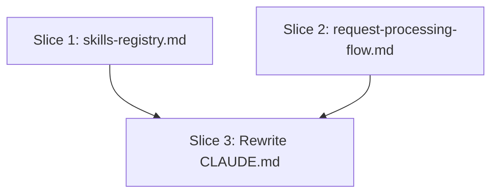

# Plan: Plugin CLAUDE.md Size Reduction

**Created**: 2026-06-26
**Spec**: docs/specs/plugin-claude-md-size-reduction.md
**Branch**: feature/claude-md-reduction
**Status**: implemented

## Goal

Reduce `plugins/dev-team/CLAUDE.md` from 30,232 characters to under 5,000 characters by extracting the four largest sections into two new knowledge files and replacing them with single-line pointers. CLAUDE.md becomes a lean routing index; no information is lost — it moves to independently-loadable artifacts.

## Approach Stances

- **Replace vs. merge for CLAUDE.md**: The CLAUDE.md body is replaced (not merged) with a condensed version. This is the **only** reversible direction: the full content is preserved in the new knowledge files, so the change is recoverable by editing CLAUDE.md back if needed. Wholesale-replace is chosen because merging 30,232 chars of content into a 5,000-char document is not a meaningful merge operation — it's a rewrite.
- **New knowledge files**: Create new files rather than appending to existing ones. The extracted content is cohesive and large enough to warrant its own files following the existing naming convention.
- **Scope**: Touch `plugins/dev-team/CLAUDE.md`, the two new knowledge files, `scripts/check_registry_sync.py`, and their bats tests. No agents, skills, or hooks modified.

## Prerequisites

`scripts/token_efficiency_review.py` and `scripts/claude_setup_review.py` must exist on the branch (or be merged to main via PR #462) before Slice 3 can run its validation gates. Slice 3 explicitly depends on those scripts being available.

## Sections being extracted

| Section | Destination | Estimated chars |
|---|---|---|
| Skills Registry (full command table) | `knowledge/skills-registry.md` | ~5,000 |
| Agent & Skill Registry Quick Reference (inline lists) | removed — pointer to `knowledge/agent-registry.md` already exists | ~3,500 |
| Request Processing Flow (3-phase workflow + skills-by-phase + phase transitions) | `knowledge/request-processing-flow.md` | ~4,000 |
| Multi-Agent Collaboration Protocol | `knowledge/request-processing-flow.md` (same file) | ~1,000 |

## Sections staying in CLAUDE.md (condensed)

`System Overview` (1 sentence), `North Star` (3 sentences), `Architecture` (5 bullets), `Output Guardrails` (3 bullets), `Core Principles` (6 bullets condensed), `Team Organization` (1 pointer), `Agent & Skill Registry` (2 pointer lines), `Skills Registry` (1 pointer), `Request Processing Flow` (1 pointer), `Model Routing` (3 sentences), `Context Management` (2 bullets + 4 operating rules), `Feedback & Learning` (2 sentences), `Human Oversight` (2 sentences), `Quality & Accuracy` (3 sentences), `Performance Metrics` (2 sentences + claims discipline).

## Acceptance Criteria

- [x] `plugins/dev-team/CLAUDE.md` is ≤ 5,000 characters (`len(text) < 5001`)
- [x] `python3 scripts/token_efficiency_review.py --skip-llm --files plugins/dev-team/CLAUDE.md` exits 0 or 2 with no char-limit error finding in output
- [x] `plugins/dev-team/knowledge/skills-registry.md` exists and contains the full skills command table (all 45+ skills, each with file path, role, and description)
- [x] `plugins/dev-team/knowledge/request-processing-flow.md` exists and contains the three-phase workflow description, skills-by-phase table, phase-transition rules, and multi-agent collaboration protocol
- [x] Every skill and knowledge path referenced in the new CLAUDE.md resolves on disk (`python3 scripts/claude_setup_review.py --plugin-root plugins/dev-team --skip-llm` exits 0 or 2 with no path-reference error)
- [x] `scripts/check_registry_sync.py` updated to scan `knowledge/skills-registry.md` as a third skill source; exits 0 with the rewritten CLAUDE.md
- [x] `bash scripts/ci-local.sh` passes

## Slices

### Slice 1: Create knowledge/skills-registry.md

**Depends-on:** none
**Files:** `plugins/dev-team/knowledge/skills-registry.md`, `tests/repo/skills_registry_knowledge_tests.bats`

**Behavior:**

```gherkin
Feature: skills-registry knowledge file

  Scenario: file exists and contains the full command table
    Given the skills-registry.md knowledge file
    When it is read
    Then it contains the /build command entry
    And it contains the /test-modernize command entry
    And it contains file paths and role descriptions for each command

  Scenario: file is referenced by CLAUDE.md
    Given the CLAUDE.md has been updated
    When the Skills Registry section is read
    Then it contains a link to knowledge/skills-registry.md
```

**Steps:**

#### Step 1.1: Create the skills-registry knowledge file

**Complexity**: standard
**RED**: Create `tests/repo/skills_registry_knowledge_tests.bats`. Write two tests: (1) `grep -q "/build" plugins/dev-team/knowledge/skills-registry.md` — fails because file doesn't exist; (2) `grep -q "/test-modernize" plugins/dev-team/knowledge/skills-registry.md` — same. Run tests — both fail.
**GREEN**: Create `plugins/dev-team/knowledge/skills-registry.md` containing the full Skills Registry table extracted verbatim from the current CLAUDE.md `## Skills Registry` section (the complete `| Command | File | Role | What It Does |` table with all 45+ rows).
**REFACTOR**: Add a brief header explaining this file's purpose and a back-reference to CLAUDE.md.
**Files**: `plugins/dev-team/knowledge/skills-registry.md`, `tests/repo/skills_registry_knowledge_tests.bats`
**Commit**: `docs: extract skills registry to knowledge/skills-registry.md`

---

### Slice 2: Create knowledge/request-processing-flow.md

**Depends-on:** none
**Files:** `plugins/dev-team/knowledge/request-processing-flow.md`, `tests/repo/request_processing_flow_knowledge_tests.bats`

**Behavior:**

```gherkin
Feature: request-processing-flow knowledge file

  Scenario: file exists and contains the three-phase workflow
    Given the request-processing-flow.md knowledge file
    When it is read
    Then it describes the Research phase
    And it describes the Plan phase
    And it describes the Implement phase

  Scenario: file contains multi-agent collaboration protocol
    Given the request-processing-flow.md knowledge file
    When it is read
    Then it contains "Sub-Agents as Context Isolation"
    And it contains "Multi-Agent Coordination" steps
```

**Steps:**

#### Step 2.1: Create the request-processing-flow knowledge file

**Complexity**: standard
**RED**: Create `tests/repo/request_processing_flow_knowledge_tests.bats`. Write two tests: (1) `grep -q "Three-Phase Workflow" plugins/dev-team/knowledge/request-processing-flow.md` — fails because file doesn't exist; (2) `grep -q "Sub-Agents as Context Isolation" plugins/dev-team/knowledge/request-processing-flow.md` — same.
**GREEN**: Create `plugins/dev-team/knowledge/request-processing-flow.md` containing: the full `## Request Processing Flow` section content (Three-Phase Workflow, Skills by Phase table, Phase Transitions) and the full `## Multi-Agent Collaboration Protocol` section content (Sub-Agents as Context Isolation, Multi-Agent Coordination steps) — all extracted verbatim from CLAUDE.md.
**REFACTOR**: Add a brief header and back-reference to CLAUDE.md.
**Files**: `plugins/dev-team/knowledge/request-processing-flow.md`, `tests/repo/request_processing_flow_knowledge_tests.bats`
**Commit**: `docs: extract request processing flow and collaboration protocol to knowledge file`

---

### Slice 3: Rewrite CLAUDE.md and update registry sync script

**Depends-on:** 1, 2
**Files:** `plugins/dev-team/CLAUDE.md`, `scripts/check_registry_sync.py`, `tests/repo/claude_md_size_tests.bats`, `tests/repo/registry_sync_tests.bats`

**Behavior:**

```gherkin
Feature: CLAUDE.md size reduction

  Scenario: CLAUDE.md is under 5000 characters
    Given the CLAUDE.md file has been rewritten
    When its character count is measured
    Then len(text) is less than 5001

  Scenario: token efficiency script reports no char-limit error
    Given the CLAUDE.md file has been rewritten
    When token_efficiency_review.py runs with --skip-llm
    Then the output contains no error finding with "char" in the message

  Scenario: all path references in CLAUDE.md resolve on disk
    Given the CLAUDE.md has been rewritten with pointer references
    When claude_setup_review.py runs with --plugin-root plugins/dev-team --skip-llm
    Then it exits 0 or 2 with no path-reference error findings

  Scenario: Skills Registry section is replaced by a pointer
    Given the CLAUDE.md has been rewritten
    When the Skills Registry section is read
    Then it contains a reference to knowledge/skills-registry.md
    And does not contain the full command table

  Scenario: Request Processing Flow section is replaced by a pointer
    Given the CLAUDE.md has been rewritten
    When the Request Processing Flow section is read
    Then it contains a reference to knowledge/request-processing-flow.md
    And does not contain the three-phase workflow prose

  Scenario: registry sync still passes after CLAUDE.md rewrite
    Given the CLAUDE.md has been rewritten and skills-registry.md contains the skill paths
    And check_registry_sync.py has been updated to scan knowledge/skills-registry.md
    When check_registry_sync.py runs
    Then it exits 0

  Scenario: registry sync finds skills in knowledge/skills-registry.md when CLAUDE.md no longer lists them
    Given CLAUDE.md no longer contains the full Skills Registry table
    And knowledge/skills-registry.md contains "skills/build/SKILL.md"
    When check_registry_sync.py runs
    Then "skills/build/SKILL.md" is found in the registered skill set
    And it exits 0
```

**Steps:**

#### Step 3.1: Fix check_registry_sync.py, rewrite CLAUDE.md, and verify size

**Complexity**: complex
**RED**: Write two sets of failing tests:

*Set A — new file `tests/repo/claude_md_size_tests.bats`* (4 tests):

1. `python3 -c "assert len(open('plugins/dev-team/CLAUDE.md').read()) < 5001, 'too large'"` — fails (30,232 chars)
2. `python3 scripts/token_efficiency_review.py --skip-llm --files plugins/dev-team/CLAUDE.md` — exits 1 (char limit error; requires PR #462 merged)
3. `grep -q "knowledge/skills-registry.md" plugins/dev-team/CLAUDE.md` — fails
4. `grep -q "knowledge/request-processing-flow.md" plugins/dev-team/CLAUDE.md` — fails

*Set B — new test in `tests/repo/registry_sync_tests.bats`* (1 test): create a fixture where CLAUDE.md has no skill paths but `knowledge/skills-registry.md` contains `skills/bar/SKILL.md` — assert `check_registry_sync.py` exits 0. Fails because script does not yet scan the knowledge file.

All 5 tests must fail before edits. Paste failing output.

**GREEN** (two changes, order matters — fix script before rewriting CLAUDE.md):

*Change A — `scripts/check_registry_sync.py`*: Add `knowledge/skills-registry.md` as a third scan source. At the skill registration block, replace the two-source union with:

```python
skill_pat = r"skills/[A-Za-z0-9._-]+/SKILL\.md"
claude_md = os.path.join(args.root, PLUGIN, "CLAUDE.md")
skills_registry_md = os.path.join(args.root, PLUGIN, "knowledge", "skills-registry.md")
skill_sources = [doc, read(claude_md)]
if os.path.exists(skills_registry_md):
    skill_sources.append(read(skills_registry_md))
registered_skills = set().union(*[set(re.findall(skill_pat, s)) for s in skill_sources])
```

Update the adjacent comment to mention all three scan surfaces.

*Change B — `plugins/dev-team/CLAUDE.md`*: Rewrite to under 5,000 chars:

- Replace `## Skills Registry` (full table) with: `See [knowledge/skills-registry.md](knowledge/skills-registry.md) for the full command reference.`
- Remove the "Quick Reference" inline agent/skill name lists from `## Agent & Skill Registry` — the section already has a pointer to `knowledge/agent-registry.md`; the inline lists duplicate it
- Replace `## Request Processing Flow` (full content) with: `See [knowledge/request-processing-flow.md](knowledge/request-processing-flow.md) for the three-phase workflow, inline review protocol, phase transitions, and multi-agent collaboration.`
- Remove `## Multi-Agent Collaboration Protocol` section entirely (its content is now in request-processing-flow.md)
- Condense `## Context Management` "Baseline Budget" to a single-line note pointing to `knowledge/agent-registry.md`

**REFACTOR**: Run `python3 scripts/claude_setup_review.py --plugin-root plugins/dev-team --skip-llm` and fix any path-reference errors (requires PR #462 merged). Run `python3 scripts/check_registry_sync.py` — must exit 0.

**Files**: `plugins/dev-team/CLAUDE.md`, `scripts/check_registry_sync.py`, `tests/repo/claude_md_size_tests.bats`, `tests/repo/registry_sync_tests.bats`
**Commit**: `fix: update check_registry_sync to scan skills-registry.md; reduce CLAUDE.md to < 5000 chars`

---

## Parallelization



| Wave | Slices (parallel) |
|------|-------------------|
| 1 | 1, 2 |
| 2 | 3 |

No same-wave file collisions: Slices 1 and 2 create distinct new knowledge files.

## Complexity Classification

| Steps | Rating |
|---|---|
| 1.1 | standard |
| 2.1 | standard |
| 3.1 | complex |

## Pre-PR Quality Gate

- [x] `bash scripts/ci-local.sh` passes
- [x] `python3 scripts/claude_setup_review.py --plugin-root plugins/dev-team --skip-llm` exits 0 or 2 with no error findings
- [x] `python3 scripts/check_registry_sync.py` exits 0
- [x] `python3 -c "assert len(open('plugins/dev-team/CLAUDE.md').read()) < 5001"`

## Risks & Open Questions

- **Context Management Baseline Budget numbers**: The current CLAUDE.md has token budget numbers (e.g., "~800 tokens" for CLAUDE.md itself). After reduction, CLAUDE.md will be much smaller than 800 tokens. These numbers are informational — the "Baseline Budget" sub-section in Context Management will be condensed to a pointer to `knowledge/agent-registry.md`, where accurate per-agent counts already live.
- **Institutional Context note**: The "Institutional Context" sub-section under Agent & Skill Registry describes `REVIEW-CONTEXT.md`. This is kept in the condensed CLAUDE.md since it's a one-paragraph user-facing instruction.

## Plan Review Summary

**Plan tier: complex** — 3 slices, 2 waves, 1 complex step, stance on replace-vs-merge. All 5 reviewers dispatched.
**Iterations:** 2 (first pass: Acceptance needs-revision on 1 blocker; second pass: revised plan presented).

**First-pass blocker addressed:**

- `check_registry_sync.py` hardcodes a scan of CLAUDE.md for `skills/*/SKILL.md` paths. Moving the Skills Registry table to `knowledge/skills-registry.md` would break CI for all 45 user-invocable skills. Fix: Slice 3 now updates the script to also scan `knowledge/skills-registry.md` as a third source. `tests/repo/registry_sync_tests.bats` gets a new fixture test for this.

**Prerequisites added:**

- PR #462 (`scripts/token_efficiency_review.py` and `scripts/claude_setup_review.py`) must be merged before Slice 3's validation gates can run.

**Advisory observations (non-blocking):**

- Acceptance: Tighten Slice 1 bats scenarios to assert specific rows (e.g., `/build`, `skills/build/SKILL.md`, `orchestrator`) not just any occurrence of the command name.
- UX: Verify that agents relying on passive in-context availability of the Skills Registry table will still work after extraction. The load-on-demand pattern should cover this, but it should be validated during implementation.
- Strategic: The removal of the Agent & Skill Registry "Quick Reference" inline name lists is deliberate — those lists duplicate `knowledge/agent-registry.md`. Document the intent in the rewritten CLAUDE.md so future maintainers understand.
- Design: Confirm `claude_setup_review.py` validates the exact pointer reference syntax that will appear in the rewritten CLAUDE.md.

## Build Progress

### Slices (grouped by wave)

#### Wave 1

- [x] Slice 1: Create knowledge/skills-registry.md
  - [x] Step 1.1: Create the skills-registry knowledge file
- [x] Slice 2: Create knowledge/request-processing-flow.md
  - [x] Step 2.1: Create the request-processing-flow knowledge file

#### Wave 2

- [x] Slice 3: Rewrite CLAUDE.md as a routing index
  - [x] Step 3.1: Write size and content tests for the target CLAUDE.md

### Acceptance Criteria

- [x] CLAUDE.md is ≤ 5,000 characters
- [x] token_efficiency_review.py exits 0 or 2 with no char-limit error
- [x] knowledge/skills-registry.md exists with full skills command table
- [x] knowledge/request-processing-flow.md exists with three-phase workflow and collaboration protocol
- [x] claude_setup_review.py exits 0 or 2 with no path-reference errors
- [x] check_registry_sync.py exits 0
- [x] ci-local.sh passes
