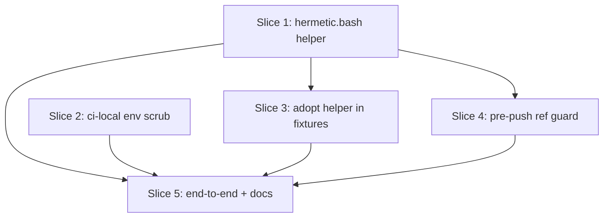

# Plan: Pre-push hook hermetic fixtures (issue #546)

**Created**: 2026-07-01
**Branch**: issue-546
**Status**: in-progress

## Goal

Stop the pre-push hook from silently corrupting local branch refs during real `git push` invocations. Root cause: git exports `GIT_DIR`/`GIT_INDEX_FILE`/`GIT_WORK_TREE`/`GIT_PREFIX`/`GIT_REFLOG_ACTION` into the hook environment, and nothing in the hook chain (`.husky/pre-push` → `scripts/ci-local.sh` → `scripts/run-bats-parallel.sh` → bats fixtures) scrubs them. Fixture bats tests running `git init`/`git commit`/`git push` then target the parent worktree's gitdir instead of their tempdirs. Fix at three defenses in depth: env-scrub in a new shared bats helper (`tests/lib/hermetic.bash`), env-scrub at the top of `scripts/ci-local.sh`, and a post-hook ref-integrity guard in `.husky/pre-push` that refuses the push if any local ref moved. Also standardize fixture tempdirs on a per-worker prefix and add a PWD-guard trap so any future drift fails a test loudly instead of clobbering a worktree.

Approach stance on decision-defaults axes:

- **Replace vs. merge** (`.husky/pre-push`, `scripts/ci-local.sh`, existing bats setups): **merge** — preserve current behavior, add scrub + guard on top; do not rewrite the hook.
- **Scope**: **touch only what was requested** — env scrub, ref guard, shared helper, per-worker tempdirs. `hooksPath = .husky/_` relative-path amplifier is out of scope (confirmed by human at spec time).
- **Auto-merge**: **auto-merge PR gated on green checks** (default `/ship` flow; touches code so still requires explicit human merge per repo rules).

## Acceptance Criteria

- [ ] Running `git push` on any branch leaves every `refs/heads/*` unchanged from its pre-hook value regardless of ci-local pass/fail.
- [ ] With a hostile `GIT_DIR`/`GIT_INDEX_FILE` in the environment, `bash scripts/ci-local.sh` does not mutate the decoy gitdir and its child bats processes see empty git env vars.
- [ ] With a hostile `GIT_DIR`/`GIT_INDEX_FILE` in the environment, a fixture bats test using `hermetic_setup` does not mutate the decoy gitdir; the fixture's git operations target only its tempdir.
- [ ] If a fixture bats test's `PWD` leaves the per-worker tempdir root created by `hermetic_setup`, the test fails loudly.
- [ ] If any `refs/heads/*` changes during `.husky/pre-push` execution, the hook exits non-zero with a diagnostic listing every changed ref and its pre/post SHAs — even if `ci-local.sh` exits zero.
- [ ] Two fixture bats tests running concurrently each get a distinct tempdir root.
- [ ] `bash scripts/ci-local.sh` (direct invocation) continues to pass on a clean tree.
- [ ] End-to-end: running the full test suite under a real `git push` on a scratch branch completes without corrupting any local ref on any worktree.
- [ ] All acceptance criteria are enforced by automated tests that fail without the fix and pass with it.

## Slices

### Slice 1: Shared hermetic bats helper

**Depends-on:** none
**Files:** `tests/lib/hermetic.bash`, `tests/lib/hermetic_tests.bats`

**Behavior:**

```gherkin
Feature: Hermetic bats fixture isolation

  Scenario: git env vars are scrubbed
    Given the calling process has GIT_DIR=/tmp/decoy.git and GIT_INDEX_FILE=/tmp/decoy.idx exported
    When a bats setup() calls hermetic_setup
    Then GIT_DIR, GIT_INDEX_FILE, GIT_WORK_TREE, GIT_PREFIX, and GIT_REFLOG_ACTION are all unset in the test's environment
    And GIT_CONFIG_GLOBAL and GIT_CONFIG_SYSTEM are exported to /dev/null

  Scenario: per-worker tempdir is created and entered
    Given hermetic_setup is called
    When it returns
    Then PWD is a fresh directory under $TMPDIR (or /tmp) whose basename contains "bats-<pid>-"
    And the directory is empty

  Scenario: two concurrent fixtures do not share a tempdir root
    Given two bats workers each call hermetic_setup concurrently
    When both return
    Then their tempdir roots differ
    And neither can list files inside the other's root

  Scenario: git init in the tempdir stays hermetic even with hostile GIT_DIR
    Given /tmp/decoy.git is a real bare git repo at a known HEAD
    And GIT_DIR=/tmp/decoy.git and GIT_INDEX_FILE=/tmp/decoy.idx are exported
    And hermetic_setup was called
    When the test runs "git init -q && git commit --allow-empty -m x"
    Then /tmp/decoy.git is unchanged (HEAD, refs, and objects intact)
    And the fresh commit lives inside the tempdir's .git

  Scenario: PWD drift is caught by hermetic_assert_pwd
    Given hermetic_setup was called and $HERMETIC_ROOT is the recorded root
    When the test cds outside $HERMETIC_ROOT and calls hermetic_assert_pwd
    Then hermetic_assert_pwd fails with a diagnostic naming the drifted PWD and the expected root

  Scenario: fixture-local push to a fixture's own origin still works
    Given hermetic_setup was called establishing $HERMETIC_ROOT
    And $HERMETIC_ROOT/origin.git is a bare repo and $HERMETIC_ROOT/work is a clone of it
    When the test runs "cd $HERMETIC_ROOT/work && git push origin main"
    Then the push succeeds and $HERMETIC_ROOT/origin.git's refs/heads/main matches the pushed commit
```

**Steps:**

#### Step 1.1: Author `hermetic_setup` and `hermetic_assert_pwd` in `tests/lib/hermetic.bash`

**Complexity**: standard
**RED**: In a new bats file `tests/lib/hermetic_tests.bats`, add tests covering scenarios 1, 2, and 4 (env scrub, tempdir shape, hermetic git init under hostile GIT_DIR).
**GREEN**: Create `tests/lib/hermetic.bash` exporting `hermetic_setup` — unsets `GIT_DIR GIT_INDEX_FILE GIT_WORK_TREE GIT_PREFIX GIT_REFLOG_ACTION`, exports `GIT_CONFIG_GLOBAL=/dev/null GIT_CONFIG_SYSTEM=/dev/null`, creates `T="$(mktemp -d -t "bats-$$-XXXX")"`, records it in `HERMETIC_ROOT`, and cds into it. Bash-3.2 safe. Include the copyright/CLAUDE.md convention header used by other repo shell files.
**REFACTOR**: None needed.
**Files**: `tests/lib/hermetic.bash`, `tests/lib/hermetic_tests.bats`
**Commit**: `feat(tests): add tests/lib/hermetic.bash — env scrub + per-worker tempdir`

#### Step 1.2: Add concurrent-safety and PWD-guard tests to the helper

**Complexity**: standard
**RED**: Extend `tests/lib/hermetic_tests.bats` with three cases: (a) two concurrent subshells each call `hermetic_setup` and echo `$HERMETIC_ROOT`, asserting the paths differ; (b) `hermetic_assert_pwd` succeeds when `PWD` is under `$HERMETIC_ROOT`; (c) `hermetic_assert_pwd` fails with a diagnostic when `PWD` is outside `$HERMETIC_ROOT`. Also add a case for the fixture-local-push scenario from the Gherkin above.
**GREEN**: Add an explicit `hermetic_assert_pwd` function to `tests/lib/hermetic.bash` — fails if `$PWD` is not under `$HERMETIC_ROOT`, printing both the drifted PWD and the expected root. **Design decision**: use explicit callable rather than a `DEBUG`/`RETURN` trap. Rationale: `RETURN` fires only on `hermetic_setup` return (not during test body execution), and `DEBUG` traps interact fragilely with `set -e`/pipefail across bash versions and Git Bash on Windows. The explicit-call design is deterministic and matches the existing `|| return 1` convention already used in the repo's bats fixtures; `hermetic_teardown` (called from the fixture's `teardown()` block) invokes `hermetic_assert_pwd` as a matter of course, so any adopting bats file gets automatic drift detection at test-end without relying on trap semantics. Confirm `mktemp -d -t "bats-$$-XXXX"` yields distinct paths under parallel invocation on macOS + Linux + Git Bash.
**REFACTOR**: None needed.
**Files**: `tests/lib/hermetic.bash`, `tests/lib/hermetic_tests.bats`
**Commit**: `feat(tests): hermetic_assert_pwd + parallel-safety for hermetic.bash`

### Slice 2: Env scrub in `scripts/ci-local.sh`

**Depends-on:** none
**Files:** `scripts/ci-local.sh`, `tests/scripts/ci_local_hermetic_tests.bats`

**Behavior:**

```gherkin
Feature: ci-local.sh is hermetic against inherited git env

  Scenario: ci-local scrubs git env vars for its own execution
    Given GIT_DIR=/tmp/decoy.git and GIT_INDEX_FILE=/tmp/decoy.idx are exported
    When scripts/ci-local.sh is invoked with CI_LOCAL_PROBE_ENV=1
    Then it exits 0
    And its stdout matches the empty set (no lines starting with GIT_DIR=, GIT_INDEX_FILE=, GIT_WORK_TREE=, GIT_PREFIX=, or GIT_REFLOG_ACTION=)

  Scenario: ci-local does not clobber a decoy gitdir when invoked with hostile env
    Given /tmp/decoy.git is a fresh bare repo at a known ref
    And GIT_DIR=/tmp/decoy.git and GIT_INDEX_FILE=/tmp/decoy.idx are exported
    When scripts/ci-local.sh is invoked with CI_LOCAL_PROBE_ENV=1
    Then /tmp/decoy.git's HEAD, refs/, and objects/ are byte-identical to the pre-invocation snapshot
```

**Steps:**

#### Step 2.1: Add env-scrub test for `scripts/ci-local.sh`

**Complexity**: standard
**RED**: Author `tests/scripts/ci_local_hermetic_tests.bats` with two `@test` blocks matching the two Slice-2 Gherkin scenarios: (a) env-scrub probe — exports `GIT_DIR=$(mktemp)` and `GIT_INDEX_FILE=$(mktemp)`, invokes `CI_LOCAL_PROBE_ENV=1 bash scripts/ci-local.sh`, and asserts stdout contains no lines starting with `GIT_DIR=`/`GIT_INDEX_FILE=`/`GIT_WORK_TREE=`/`GIT_PREFIX=`/`GIT_REFLOG_ACTION=`; (b) decoy-non-mutation — creates `/tmp/decoy-<mktemp>.git` via `git init --bare`, snapshots its `HEAD`+`refs/`+`objects/` (via a recursive `find | sort | sha256sum`), exports `GIT_DIR=<decoy>`, invokes `CI_LOCAL_PROBE_ENV=1 bash scripts/ci-local.sh`, re-snapshots, asserts the two snapshots match byte-for-byte. Both tests should fail before Step 2.2 lands because ci-local currently neither scrubs nor honors `CI_LOCAL_PROBE_ENV`.
**GREEN**: Not yet — the assertions should fail.
**REFACTOR**: None needed.
**Files**: `tests/scripts/ci_local_hermetic_tests.bats`
**Commit**: `test(ci-local): RED — env scrub not yet in place`

#### Step 2.2: Scrub git env vars in `scripts/ci-local.sh`

**Complexity**: standard
**RED**: (Step 2.1 test still red.)
**GREEN**: Immediately after the shebang/comment block and before `set -uo pipefail` at line 31 (or between `set -uo pipefail` and `cd` at line 33, whichever is safe under `set -u`), add:

```
unset GIT_DIR GIT_INDEX_FILE GIT_WORK_TREE GIT_PREFIX GIT_REFLOG_ACTION
```

Also allow a short-circuit probe: `[ "${CI_LOCAL_PROBE_ENV:-}" = 1 ] && { env | grep '^GIT_' || true; exit 0; }` — placed after the unset so the test can assert scrub happened. Guard the probe behind an env var so it never fires in real runs.
**REFACTOR**: None needed — this is a two-line addition.
**Files**: `scripts/ci-local.sh`
**Commit**: `fix(ci-local): unset git env vars leaked by pre-push hook`

### Slice 3: Adopt hermetic helper in fixture bats tests

**Depends-on:** 1
**Files:** `tests/scripts/progress_guardian_tests.bats`, `tests/scripts/codebase_recon_tests.bats`, `tests/hooks/pre_commit_knowledge_index_tests.bats`, `tests/repo/hermetic_adoption_tests.bats`

**Behavior:**

```gherkin
Feature: Fixture bats setups are hermetic

  Scenario: progress_guardian fixture push does not target parent gitdir
    Given GIT_DIR=<parent-gitdir> is exported (simulating pre-push hook environment)
    When tests/scripts/progress_guardian_tests.bats runs (any test that calls setup_stale_main_repo)
    Then <parent-gitdir>'s refs are unchanged after the suite completes

  Scenario: every fixture-touching bats file sources the shared helper
    Given the shared helper tests/lib/hermetic.bash exists
    When we grep the fixture bats files (progress_guardian, codebase_recon, pre_commit_knowledge_index, and any repo/*.bats doing git ops)
    Then each file loads the helper (load '../lib/hermetic')
    And each setup() calls hermetic_setup before its first git command
```

**Steps:**

#### Step 3.1: Wire helper into `tests/scripts/progress_guardian_tests.bats`

**Complexity**: complex (many setup helpers; largest offender per triage)
**RED**: Add an integration test `tests/scripts/progress_guardian_hermetic_tests.bats` that exports `GIT_DIR=<mktemp bare-repo>`, runs a representative subset of the file's tests via `bats`, and asserts the decoy bare repo's refs are unchanged.
**GREEN**: At the top of `progress_guardian_tests.bats` add `load '../lib/hermetic'`. In `setup()` and in `setup_stale_main_repo`, call `hermetic_setup` before the first `mktemp -d`/`cd`. Replace bare `mktemp -d` with the helper-provided root; every fixture tempdir must be a subdirectory of `$HERMETIC_ROOT` (`T="$HERMETIC_ROOT/work"`, `T="$HERMETIC_ROOT/sibling"`, etc.). This is the largest offender per triage and gets the most rigorous treatment — no ad-hoc `mktemp -d` calls survive in this file. Keep the existing `|| return 1` cd guards (harmless).
**REFACTOR**: Consolidate all `T="$(mktemp -d)"` sites in `setup_stale_main_repo` and every test's setup block onto `$HERMETIC_ROOT/<name>`. Do this in the same commit — no threshold-based defer clause.
**Files**: `tests/scripts/progress_guardian_tests.bats`, `tests/scripts/progress_guardian_hermetic_tests.bats`
**Commit**: `fix(tests): use hermetic helper in progress_guardian fixtures`

#### Step 3.2: Wire helper into `tests/scripts/codebase_recon_tests.bats` and `tests/hooks/pre_commit_knowledge_index_tests.bats`

**Complexity**: standard
**RED**: Extend the hermetic integration test (or add a sibling) to assert the same non-mutation invariant when these two files run under hostile `GIT_DIR`.
**GREEN**: `load '../lib/hermetic'` + `hermetic_setup` in each `setup()`.
**REFACTOR**: None needed.
**Files**: `tests/scripts/codebase_recon_tests.bats`, `tests/hooks/pre_commit_knowledge_index_tests.bats`
**Commit**: `fix(tests): use hermetic helper in codebase_recon and knowledge_index fixtures`

#### Step 3.3: Wire helper into remaining fixture bats files

**Complexity**: standard
**RED**: Add a repo-level bats test at `tests/repo/hermetic_adoption_tests.bats`. The detection query is: "any `.bats` file under `tests/` that (a) calls `mktemp -d` **or** contains any occurrence of `git` (with a trailing space) or `git$` in a shell context, **and** (b) does not `load '../lib/hermetic'` in the file body **or** does not call `hermetic_teardown` from a `teardown()` block". This is broader than the literal `git init`/`git commit`/`git push` grep in the triage — it also catches indirect git usage via sourced helpers and fixture-local functions, and ensures automatic PWD-drift detection is wired (AC4 depends on `hermetic_teardown` running). The test enumerates every offender and prints their paths; assertion is that the offender list is empty.
**GREEN**: Apply the `load '../lib/hermetic'` + `hermetic_setup` pattern to every offender from Step 3.3's detection query. The initial known set (from `grep -l "git init\|git commit\|git push" tests/scripts tests/repo tests/hooks`) is: `tests/repo/eval_semver_classify_tests.bats`, `tests/repo/gate_correlation_tests.bats`, `tests/repo/multiplayer_collision_tests.bats`, `tests/repo/review_gate_hash_tests.bats`, `tests/repo/telemetry_tests.bats`. The broader `mktemp -d`+`git` query may surface additional files — the plan does not enumerate them here (the RED test's failure will); every offender the test names must be fixed before Step 3.3 is complete. If any file legitimately does not need the helper (e.g. tests that only run git as a subject-under-test in a controlled way), whitelist it explicitly in the test with a one-line comment rationale — no silent skips.
**REFACTOR**: None needed.
**Files**: multiple `tests/**/*.bats` (per detection query), `tests/repo/hermetic_adoption_tests.bats`
**Commit**: `fix(tests): adopt hermetic helper across all fixture bats files`

### Slice 4: Post-hook ref-integrity guard in `.husky/pre-push`

**Depends-on:** 1
**Files:** `.husky/pre-push`, `tests/repo/pre_push_ref_guard_tests.bats`

**Behavior:**

```gherkin
Feature: Pre-push hook refuses to complete on ref mutation

  Scenario: refs unchanged during hook — push proceeds
    Given all refs/heads/* are stable during the hook run
    When .husky/pre-push executes ci-local.sh and returns zero
    Then the hook exits zero
    And no diagnostic about ref drift is printed

  Scenario: pushing branch's ref changes during hook — hook refuses
    Given refs/heads/<branch> has SHA A before ci-local.sh runs
    When ci-local.sh (or anything it spawns) rewrites refs/heads/<branch> to SHA B
    Then .husky/pre-push exits non-zero
    And stderr names the changed ref, the pre-hook SHA (A), and the post-hook SHA (B)
    And the diagnostic instructs the developer how to recover (git update-ref from reflog)

  Scenario: unrelated ref changes during hook — hook still refuses
    Given refs/heads/main has SHA X before ci-local.sh runs
    When ci-local.sh (or anything it spawns) rewrites refs/heads/main to SHA Y
    Then .husky/pre-push exits non-zero even if the pushing branch was untouched
    And stderr names refs/heads/main and its pre/post SHAs

  Scenario: ref deleted during hook — hook refuses
    Given refs/heads/feature exists at SHA A before ci-local.sh runs
    When ci-local.sh (or anything it spawns) deletes refs/heads/feature
    Then .husky/pre-push exits non-zero
    And stderr names refs/heads/feature with pre=A and post=<deleted>

  Scenario: ref created during hook — hook refuses
    Given refs/heads/stray does not exist before ci-local.sh runs
    When ci-local.sh (or anything it spawns) creates refs/heads/stray at SHA B
    Then .husky/pre-push exits non-zero
    And stderr names refs/heads/stray with pre=<absent> and post=B

  Scenario: ref-guard exit code actually blocks the remote push
    Given a scratch remote and refs/heads/<branch> drifts during the hook
    When git push triggers .husky/pre-push and the guard exits non-zero
    Then git itself reports the push as rejected
    And the scratch remote's ref for <branch> is NOT updated

  Scenario: hook refuses when ci-local passes but refs drifted
    Given ci-local.sh exits zero
    And any refs/heads/* changed during the hook
    Then .husky/pre-push exits non-zero — the guard runs unconditionally

  Scenario: hook still refuses when ci-local failed and refs also drifted
    Given ci-local.sh exits non-zero
    And any refs/heads/* changed during the hook
    Then .husky/pre-push exits non-zero
    And the diagnostic surfaces both the ci-local failure and the ref drift
```

**Steps:**

#### Step 4.1: RED — write the ref-guard bats test

**Complexity**: standard
**RED**: Author `tests/repo/pre_push_ref_guard_tests.bats`. Each scenario builds a scratch bare repo + worktree in a hermetic tempdir (via `hermetic_setup` — Slice 1's helper), **copies the real `.husky/pre-push` into the scratch repo**, and **shadows `scripts/ci-local.sh` with a per-scenario stub** (via a scratch `scripts/` directory) that induces the specific ref-mutation-or-not the scenario needs (no-op / update-ref / delete-ref / create-ref / exit-non-zero). Feed the hook a realistic stdin (`<local-ref> <local-sha> <remote-ref> <remote-sha>\n`) and assert (a) exit code and (b) diagnostic text on stderr. **Design decision**: test the shipped `.husky/pre-push` verbatim — never a hand-written stand-in — so this test verifies the actual guard, not a reimplementation. The only substitution is `scripts/ci-local.sh`, which is treated as a boundary (its exit code and side effects are what the guard reads).
**GREEN**: Not yet — assertions fail because `.husky/pre-push` does not yet guard.
**REFACTOR**: Factor the "copy hook + stub ci-local + build scratch repo" setup into a bats helper if it's needed by more than one test file.
**Files**: `tests/repo/pre_push_ref_guard_tests.bats`
**Commit**: `test(husky): RED — pre-push ref-integrity guard missing`

#### Step 4.2: GREEN — add the ref-integrity guard

**Complexity**: standard
**RED**: (Step 4.1 test still red.)
**GREEN**: In `.husky/pre-push` (which is `#!/usr/bin/env sh` — **POSIX sh, not bash**; avoid `[[`, arrays, `<()`, and other bash-only syntax): immediately before the `bash scripts/ci-local.sh "$BASE" "$HEAD"` line at ~line 36 (after the existing BASE/HEAD stdin-parsing block, which only reads refs and does not mutate them), capture `PRE_REFS="$(git for-each-ref --format='%(refname) %(objectname)' refs/heads/)"`. Change the ci-local invocation to save the exit code (`bash scripts/ci-local.sh "$BASE" "$HEAD"; CI_EXIT=$?`) rather than `|| exit 1`. Then capture `POST_REFS` the same way. Compare with `printf '%s\n' "$PRE_REFS" | diff - <(printf '%s\n' "$POST_REFS")` — or, since process substitution is bash-only, write both to tempfiles and `diff` them. If different, iterate the diff and print each changed ref: `<refname>: pre=<sha-or-absent> post=<sha-or-absent>`. Handle three cases explicitly: mutation (both SHAs present, different), deletion (post absent), creation (pre absent). Print a recovery hint (`git update-ref <refname> <pre-sha>` — omitted for created refs, which should be `git update-ref -d`). If the diff is non-empty, exit 1 regardless of `CI_EXIT`. If refs are stable and `CI_EXIT` is non-zero, exit `CI_EXIT` (preserve existing behavior). If both stable and passing, continue to the live-eval prompt as before.
**REFACTOR**: None needed — the guard is a discrete block inserted between existing hook steps.
**Files**: `.husky/pre-push`
**Commit**: `fix(husky): refuse push if any local ref changes during hook`

### Slice 5: End-to-end verification and CLAUDE.md note

**Depends-on:** 1, 2, 3, 4
**Files:** `tests/repo/pre_push_end_to_end_tests.bats`, `CLAUDE.md`

**Behavior:**

```gherkin
Feature: End-to-end: real git push does not corrupt refs

  Scenario: full pre-push run on a scratch bare repo leaves refs stable
    Given a scratch bare repo with a worktree, a feature branch with N commits ahead of main, and the repo's real .husky/pre-push installed
    When the test drives a real "git push -u origin <branch>" (letting it fail on the fixture — we assert on ref stability, not push success)
    Then every ref under refs/heads/* on both the bare repo and the worktree matches its pre-push value
    And no logs/HEAD entry contains "Test <test@test.com>" commits authored during the push

  Scenario: reproduction of the original #546 bug (regression backstop)
    Given a scratch bare repo with the fix REVERTED (no scrub in ci-local, no hermetic_setup in fixtures, no ref guard in .husky/pre-push)
    When the same "git push -u origin <branch>" runs
    Then refs are observed to change (corruption reproduces)
    And when the fix is re-applied, the corruption stops
    Note: this scenario documents a manual pre-merge check — not an automated test — since a "revert the fix and re-apply it" test is impractical for CI. Executor runs it once on a scratch branch before merging.

  Scenario: CLAUDE.md documents the hermetic isolation contract
    Given a developer opens CLAUDE.md
    Then they find a note stating that fixture bats tests must source tests/lib/hermetic.bash and call hermetic_setup, and why (linked to issue #546)
```

**Steps:**

#### Step 5.1: End-to-end bats test

**Complexity**: complex
**RED**: Write `tests/repo/pre_push_end_to_end_tests.bats` that stands up a hermetic bare+worktree, copies the repo's `.husky/` and `scripts/` into it (or `git clone --local .` into the tempdir and switch to a scratch branch), then invokes `git push origin <branch>` inside it. Asserts ref stability on both the bare and the worktree.
**GREEN**: This is a validation-only step; there is no additional production change in Step 5.1 itself. RED and GREEN point at the same test file. If any assertion fails after slices 1–4 land, treat the failure as a defect in the originating slice and fix it in that slice's commit history — not as a new ad-hoc patch scoped to Step 5.1. If the failure is legitimately new (e.g. reveals an interaction slices 1–4 did not cover), file a new slice or step rather than patching in place.
**REFACTOR**: If the test setup is heavy, factor a helper into `tests/lib/hermetic.bash` (e.g. `hermetic_scratch_repo`).
**Files**: `tests/repo/pre_push_end_to_end_tests.bats`, possibly `tests/lib/hermetic.bash`
**Commit**: `test(husky): end-to-end pre-push ref-stability guarantee`

#### Step 5.2: Document the hermetic contract

**Complexity**: trivial
**RED**: N/A (documentation).
**GREEN**: Add one paragraph to `CLAUDE.md` (or `plugins/dev-team/CLAUDE.md`, whichever is the appropriate contributor doc) stating: "Every fixture bats file that touches git must `load '../lib/hermetic'` and call `hermetic_setup` in `setup()`. Rationale: issue #546 — git exports `GIT_DIR`/`GIT_INDEX_FILE` into pre-push hooks; fixtures that inherit them corrupt the parent worktree's refs." Reference the triage record.
**REFACTOR**: None needed.
**Files**: `CLAUDE.md` or `plugins/dev-team/CLAUDE.md`
**Commit**: `docs: require hermetic_setup in fixture bats setups`

## Parallelization

Slices 1 and 2 are independent. Slices 3 and 4 both depend on Slice 1's helper (Slice 3 adopts it in fixtures; Slice 4's ref-guard test uses `hermetic_setup` to build its scratch scaffolding). Slice 5 depends on all four.



| Wave | Slices (parallel) |
|------|-------------------|
| 1 | 1, 2 |
| 2 | 3, 4 |
| 3 | 5 |

No same-wave file collisions: Wave 1 — Slice 1 touches only `tests/lib/`, Slice 2 touches only `scripts/ci-local.sh` + `tests/scripts/ci_local_hermetic_tests.bats`. Wave 2 — Slice 3 touches fixture bats files under `tests/scripts/`, `tests/hooks/`, `tests/repo/` (excluding `tests/repo/pre_push_ref_guard_tests.bats`); Slice 4 touches only `.husky/pre-push` and `tests/repo/pre_push_ref_guard_tests.bats`. Confirmed via `plan-waves.sh`.

## Complexity Classification

Summary: 1 trivial (docs), 8 standard, 2 complex (broad fixture edit, end-to-end harness).

## Pre-PR Quality Gate

- [ ] All tests pass (`bash scripts/ci-local.sh`)
- [ ] Shellcheck clean on new/edited shell files
- [ ] `/code-review` passes
- [ ] Documentation updated (`CLAUDE.md` note)
- [ ] End-to-end test demonstrates ref stability under real `git push`

## Risks & Open Questions

- **Risk**: The end-to-end test (Step 5.1) may be slow or hard to make deterministic across macOS/Linux/Git Bash. Mitigation: use a minimal ci-local surrogate (env-check only) for the end-to-end assertion; the full ci-local coverage is already exercised by the direct-invocation path.
- **Risk**: The end-to-end test itself drives a real `git push`, the same class of operation that caused the incident. Mitigation: Step 5.1 depends on slices 1+2+4 landing first (env scrub + ref guard in place), and the test must be run once manually on a scratch branch before it's trusted to run repeatedly in CI. State this in the test's own comments.
- **Risk**: Wiring the hermetic helper into many bats files (Slice 3) may surface fixtures that already relied on inheriting the parent's git config. Mitigation: run each modified file individually after adoption; adjust the helper's config isolation if a specific fixture legitimately needs a real config value.
- **Open question**: Should `hermetic_setup` also isolate `HOME=$T` to prevent inherited `~/.gitconfig` reads? Deferred — `GIT_CONFIG_GLOBAL=/dev/null` already achieves this for git; other tools that read `$HOME` can be addressed if a symptom appears.

## Acceptance-Criteria → Test Traceability

| # | Acceptance Criterion | Enforced by |
|---|---------------------|-------------|
| 1 | `git push` leaves refs unchanged regardless of ci-local pass/fail | Step 4.1 (all ref-guard scenarios) + Step 5.1 (end-to-end) |
| 2 | Hostile `GIT_DIR` → ci-local does not mutate decoy | Step 2.1 (both @test blocks) |
| 3 | Hostile `GIT_DIR` → fixture `hermetic_setup` does not mutate decoy | Step 1.1 (hermetic scenario) + Step 3.1 (progress_guardian hermetic integration test) |
| 4 | PWD drift in a fixture fails loudly | Step 1.2 (hermetic_assert_pwd tests) |
| 5 | Any `refs/heads/*` change during hook → non-zero exit with SHAs | Step 4.1 (mutation + deletion + creation scenarios) + Step 4.2 |
| 6 | Two concurrent fixture bats tests get distinct tempdir roots | Step 1.2 (concurrent-safety test) |
| 7 | `bash scripts/ci-local.sh` direct invocation still passes | Pre-PR quality gate + all-tests-pass verification |
| 8 | Full suite under real `git push` doesn't corrupt any local ref | Step 5.1 (end-to-end) |
| 9 | All ACs enforced by tests that fail without fix / pass with fix | This traceability table + RED-first commits for every GREEN step |
| — | Fixture-local push to fixture's own origin still works | Step 1.1 (fixture-local-push scenario) |

## Build Progress

### Slices (grouped by wave)

#### Wave 1

- [x] Slice 1: Shared hermetic bats helper
  - [x] Step 1.1: Author `hermetic_setup` in `tests/lib/hermetic.bash`
  - [x] Step 1.2: `hermetic_assert_pwd` + parallel-safety
- [x] Slice 2: Env scrub in `scripts/ci-local.sh`
  - [x] Step 2.1: RED env-scrub test for ci-local
  - [x] Step 2.2: Scrub git env vars in ci-local

#### Wave 2

- [x] Slice 3: Adopt hermetic helper in fixture bats tests
  - [x] Step 3.1: `progress_guardian_tests.bats`
  - [x] Step 3.2: `codebase_recon` and `pre_commit_knowledge_index`
  - [x] Step 3.3: Remaining fixture bats files
- [x] Slice 4: Post-hook ref-integrity guard in `.husky/pre-push`
  - [x] Step 4.1: RED ref-guard bats test
  - [x] Step 4.2: GREEN ref-integrity guard

#### Wave 3

- [ ] Slice 5: End-to-end verification and CLAUDE.md note
  - [ ] Step 5.1: End-to-end bats test
  - [ ] Step 5.2: Document the hermetic contract

### Acceptance Criteria

- [ ] `git push` leaves every `refs/heads/*` unchanged regardless of ci-local pass/fail
- [ ] Hostile `GIT_DIR` does not mutate decoy gitdir via `ci-local.sh`; child bats see empty git env
- [ ] Hostile `GIT_DIR` does not mutate decoy gitdir via fixture `hermetic_setup`
- [ ] PWD drift inside a hermetic fixture fails the test loudly
- [ ] Any `refs/heads/*` change during `.husky/pre-push` yields a non-zero exit with pre/post SHAs
- [ ] Two concurrent fixture bats tests get distinct tempdir roots
- [ ] `bash scripts/ci-local.sh` (direct invocation) continues to pass
- [ ] Full test suite under real `git push` does not corrupt any local ref
- [ ] All acceptance criteria enforced by tests that fail without the fix and pass with it

## Plan Review Summary

**Plan tier: complex** — reviewers: Acceptance Test Critic, Design & Architecture Critic, Strategic Critic, Parallelization Critic. UX Critic skipped (no user-facing/UI surface — this is a hook + shell-test change).

**Round 1 verdicts:**

- Acceptance Test Critic: `needs-revision` — 2 blockers (PWD-guard mechanism fork in Step 1.2; ref-guard test fork in Step 4.1) + several warnings.
- Design & Architecture Critic: `needs-revision` — 4 warnings (Slice 3 detection breadth, PWD-guard mechanism, progress_guardian consolidation deferral, POSIX-sh constraint on `.husky/pre-push`).
- Strategic Critic: `approve` — 2 observation-level warnings noted (step-count threshold, self-referential test risk); minimum-viable subset identified (slices 1+2+4).
- Parallelization Critic: `approve` — no collisions, genuine parallelism, no hidden coupling.

**Revisions applied:**

- Step 1.2 committed definitively to explicit `hermetic_assert_pwd` invoked via `hermetic_teardown`, rejecting DEBUG/RETURN traps on bash-3.2 + Git Bash compatibility grounds. Gherkin scenario tightened.
- Step 4.1 committed to testing the shipped `.husky/pre-push` verbatim, shadowing only `scripts/ci-local.sh` via a scratch `scripts/` directory. Slice 4 `Depends-on` updated to `1` (reuses `hermetic_setup` for scratch scaffolding).
- Slice 2 Gherkin + Step 2.1 committed to `CI_LOCAL_PROBE_ENV=1` mechanism upfront with concrete assertions.
- Slice 4 Gherkin expanded: ref deletion, ref creation, and "guard exit code actually blocks the remote push" scenarios added. Step 4.2 handles all three ref-shape cases (mutate/create/delete) and calls out the `#!/usr/bin/env sh` POSIX-sh constraint explicitly (no `[[`, arrays, or process substitution).
- Step 3.3 detection query broadened from literal `git init`/`git commit`/`git push` grep to `mktemp -d` OR any `git` invocation, and also checks `hermetic_teardown` wiring in `teardown()` (residual warning from Acceptance re-review).
- Step 3.1 REFACTOR committed to same-commit consolidation of all `mktemp -d` sites onto `$HERMETIC_ROOT/<name>`. No threshold-based defer.
- Slice 1 Gherkin added fixture-local-push scenario. Decoy-gitdir Given tightened to require pre-existing bare repo.
- Step 5.1 relabeled as validation-only step; defect fixes route back to originating slice.
- Acceptance-Criteria → Test traceability table added.
- Parallelization re-derived: waves = [[1,2],[3,4],[5]], collisions = []. Confirmed via `plan-waves.sh`.

**Round 2 verdicts (after revision):**

- Acceptance Test Critic: `approve` — both blockers resolved with concrete design commitments. One residual observation (also apply `hermetic_teardown` check) — applied in this revision.
- Design & Architecture Critic: `approve` — all four warnings resolved with in-plan commitments (not deferred).
- Strategic Critic: `approve` (from Round 1).
- Parallelization Critic: `approve` (from Round 1).

All reviewers approve.
