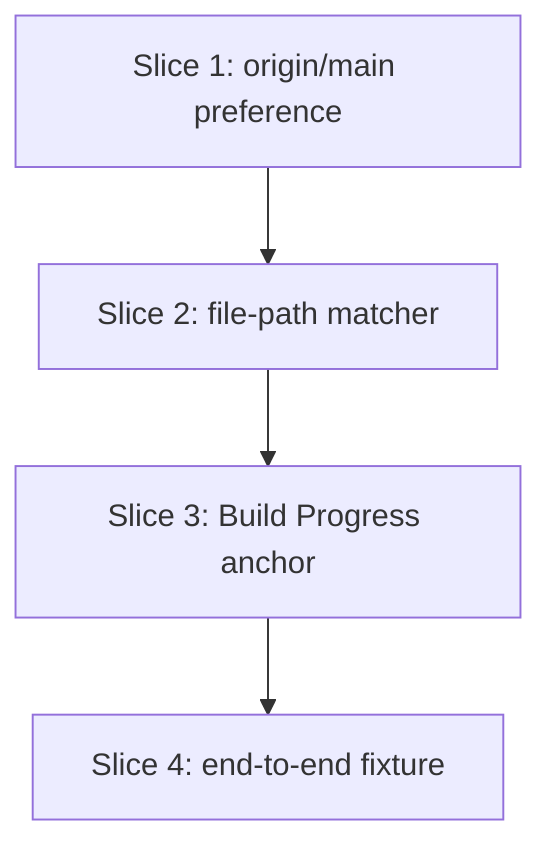

# Plan: progress_guardian — fix three pre-PR gate false positives

**Created**: 2026-06-30
**Branch**: feat/525-guardian-fixes
**Status**: approved
**Spec**: docs/specs/progress-guardian-fixes.md
**Issue**: <https://github.com/bdfinst/agentic-dev-team/issues/525>

## Goal

Fix three independent false-positive bugs in `scripts/progress_guardian.py` that block clean PRs on every Conventional-Commits-following branch with a normal `## Build Progress` + `## Acceptance Criteria` plan layout: (1) prefer `origin/main` over stale local `main`; (2) match commits to slices by declared file path instead of step-header substring; (3) parse only the `## Build Progress` section's checkboxes, not the `## Acceptance Criteria` section's. All three fixes are additive — every existing bats fixture remains green via fallback paths for plans that don't carry the new format conventions.

## Approach stance (high-reversal-cost axes)

- **Scope** — touch only `scripts/progress_guardian.py` and `tests/scripts/progress_guardian_tests.bats`. No refactor of the guardian agent prompt. *Internal* signature changes (passing `plan_text` to `check_commit_discipline`, extracting a `_branch_base_sha` helper) are allowed and expected — they de-risk Slice 1 by ensuring the two callers of base-ref resolution cannot drift. The **public** surface (the three CLI flags, the three exit codes, the JSON shape) is unchanged.
- **Migrate vs. edit stub** — n/a; the script is canonical (not deprecated).
- **Replace vs. merge** — Change 1 is a literal token reorder. Changes 2 and 3 *extend* existing functions with new branches; the old behavior remains the fallback so existing tests stay green. No section is wholesale replaced.
- **Auto-merge** — disabled (`/pr --no-auto-merge`). Touches `scripts/` (the gate logic itself), so CLAUDE.md requires explicit human merge.
- **Format fidelity** — n/a.

## Acceptance Criteria

- [ ] A1: `scripts/progress_guardian.py` contains the literal tuple `("origin/main", "origin/master", "main", "master")` in that order; the prior order is gone. Behavioral check via new bats test: in a tmp repo where local `main` lags `origin/main`, the guardian reports zero out-of-plan files when the branch only touched declared files.
- [ ] A2: New bats test — plan with `## Build Progress` containing `- [x] Slice 1: …` + `**Files:** \`a.py\``; branch has one Conventional Commit`feat(scope): wording` that modified `a.py` — guardian exits 0. Counterpart test: same plan, commit modified `b.py` (not declared) — guardian exits 1 naming the slice. Substring-fallback test: plan with no `**Files:**` line still passes the existing 3.2a test under the old matcher path.
- [ ] A3: New bats test — plan with `## Build Progress` (one `[x]` slice with matching commit) AND `## Acceptance Criteria` (several `[ ]` items) — `--pre-pr` exits 0; AC checkboxes ignored. Counterpart test: same plan, Build Progress slice is `[ ]` — `--pre-pr` exits 1 naming that slice. Fallback test: plan with no `## Build Progress` heading still parses every checkbox in the file (existing test 3.3a stays green).
- [ ] A4: An end-to-end bats fixture (Step 4.1) constructs a tmp repo combining all three patterns — `origin/main` ahead of local `main`, a Conventional Commit subject that does NOT substring-match the slice header, a `**Files:**` line whose declared path the commit modified, AND both `## Build Progress` + `## Acceptance Criteria` sections — and exits 0 with an empty `issues` array. This is the deterministic verification of "all three fixes compose."
- [ ] A5: `bats tests/scripts/progress_guardian_tests.bats` exits 0. Count: 11 pre-existing tests + 8 new tests (Slice 1: 2 scenarios = 2 tests; Slice 2: 4 scenarios = 4 tests; Slice 3: 4 scenarios = 4 tests including the new "Build Progress empty" case; Slice 4: 1 end-to-end test) = 19 total. If any scenario is implemented as a parametrized `@test` instead of a separate one, A5 still requires every scenario to be independently asserted.
- [ ] A6: `bash scripts/ci-local.sh` exits 0; PR title prefix `fix:` for release-please patch bump; PR opened with `--no-auto-merge`.

## Slices

Three independent fixes; each slice has a single TDD step that adds bats regression coverage for the bug, watches it fail, applies the surgical edit, and watches it pass without disturbing the existing fixtures.

### Slice 1: Prefer origin/main over local main in `check_scope`

**Depends-on:** none
**Files:** `scripts/progress_guardian.py`, `tests/scripts/progress_guardian_tests.bats`

**Behavior:**

```gherkin
Feature: progress_guardian uses origin/main when local main has fallen behind

  Scenario: Local main lags origin/main by exactly one commit
    Given a tmp git repo with a single declared plan path "a.py"
    And origin/main is exactly one commit ahead of local main; that single ahead-commit touches "unrelated.py"
    And a branch from origin/main with exactly one commit "feat: do thing" that touches only "a.py"
    When progress_guardian.py runs with --skip-llm against the plan
    Then it exits 0
    And the JSON issues array is empty

  Scenario: Local main equals origin/main (no regression)
    Given a tmp git repo where origin/main and local main both point to the same commit
    And a plan declaring "a.py"
    And a branch with one commit "feat: do thing" that touches only "a.py"
    When progress_guardian.py runs with --skip-llm against the plan
    Then it exits 0
    And the JSON issues array is empty
```

**Steps:**

#### Step 1.1: Reorder the branch tuple and add regression bats coverage

**Complexity**: standard
**RED**: Append a new section "Step 4.1 — Issue #525 regressions: origin/main preference" to `tests/scripts/progress_guardian_tests.bats` with two `@test`s covering the two scenarios above. Setup pattern: create a bare repo (the "remote") in `$T/remote.git`, clone it to `$T/work`, commit + push an initial commit + `unrelated.py` so `origin/main` advances, fetch back to make `origin/main` ahead of local `main`, then branch from `origin/main` and commit `a.py`. Run the guardian against a plan declaring `\`a.py\``. Assertion:`[ "$status" -eq 0 ]` AND `python3 -c "import sys,json; d=json.load(sys.stdin); assert d['issues']==[], d"`. Run`bats`; the lag scenario fails (current tuple-order resolves to stale local`main`, so diff`local-main..HEAD` reports the ahead-commit's `unrelated.py` as out-of-plan).
**GREEN**: Edit `scripts/progress_guardian.py` line 248 — replace the tuple `("main", "master", "origin/main", "origin/master")` with `("origin/main", "origin/master", "main", "master")`. Run`bats tests/scripts/progress_guardian_tests.bats`; the new test passes AND all 11 existing tests stay green (the existing tests create tmp repos without a remote, so iteration order doesn't affect them).
**REFACTOR**: None expected — pure token reorder.
**Files**:`scripts/progress_guardian.py`,`tests/scripts/progress_guardian_tests.bats`
**Commit**: `fix(progress-guardian): prefer origin/main over local main when computing branch base (#525)`

### Slice 2: File-path commit-discipline matcher (with substring fallback)

**Depends-on:** 1
**Files:** `scripts/progress_guardian.py`, `tests/scripts/progress_guardian_tests.bats`

**Behavior:**

```gherkin
Feature: progress_guardian matches commits to slices by declared file path

  Scenario: Conventional Commit on declared file satisfies the matcher
    Given a tmp git repo where origin/main points at an initial commit
    And a plan with one [x] slice declaring **Files:** `a.py`
    And a branch with a single commit "feat(scope): wording unrelated to the slice header" that touched a.py
    When progress_guardian.py runs with --skip-llm
    Then it exits 0
    And the JSON issues array is empty

  Scenario: Commit on declared multi-path matches when any one path was touched
    Given a tmp git repo where origin/main points at an initial commit
    And a plan with one [x] slice declaring **Files:** `a.py`, `b.py`
    And a branch with a single commit "feat: anything" that touched only b.py
    When progress_guardian.py runs with --skip-llm
    Then it exits 0
    And the JSON issues array is empty

  Scenario: Commit modifies only undeclared files
    Given a tmp git repo where origin/main points at an initial commit with zero commits touching a.py or b.py
    And a plan with one [x] slice declaring **Files:** `a.py`
    And a branch with a single commit "feat: anything" that touched only b.py
    When progress_guardian.py runs with --skip-llm
    Then it exits 1
    And the JSON issues array contains exactly one error whose message includes the slice header text

  Scenario: Slice declares no Files line (legacy plan)
    Given a plan with one [x] slice and no **Files:** line
    And a branch with a commit whose subject contains the slice header substring
    When progress_guardian.py runs with --skip-llm
    Then it exits 0
    And the JSON issues array is empty
```

**Steps:**

#### Step 2.1: Implement file-path matcher with substring fallback + regression coverage

**Complexity**: standard
**RED**: Append "Step 4.2 — Issue #525 regressions: file-path matcher" to the bats file with four `@test` blocks covering the four scenarios above. Assertions follow the existing pattern: `[ "$status" -eq <N> ]` plus a Python one-liner against the JSON. Run `bats`; the three new file-path tests fail (today's substring matcher does not match Conventional Commit subjects against the slice header), the fallback test already passes.
**GREEN**: Edit `scripts/progress_guardian.py` with the **minimum** to make the new tests pass:

- Add `_parse_slice_files(plan_text: str, slice_header: str) -> List[str]`: locate the slice's heading line (the line whose text contains `slice_header` after `STEP_PATTERN` match), scan forward to the next `**Files:**` line within the same heading block, and return the backtick-quoted paths. Empty list when not found.
- Extend `check_commit_discipline`'s signature to `(steps, repo_root, plan_text)` and pass `plan_text` from `main`. For each `[x]` step:
  - **File-path path:** if `_parse_slice_files` returns a non-empty list, run `git log --name-only --no-merges <base>..HEAD` (using the same branch-base resolution as `check_scope` — see REFACTOR below) and pass when any commit's file list intersects the declared paths (any-of semantics).
  - **Substring fallback:** when no `**Files:**` line was found, run the existing matcher. **Important alignment fix:** scope the substring fallback to `<base>..HEAD` too (matching what the new file-path path uses), so the two branches use the same commit range and cannot diverge. Existing test 3.2a's tmp repo has the commit as the merge-base-resolution target (no remote, falls through to `--max-parents=0` root), and the commit is on `HEAD`, so `<base>..HEAD` includes it — fallback test stays green.

Run `bats`; all new tests pass AND all 11 existing tests stay green.
**REFACTOR**: Extract `_branch_base_sha(repo_root: str) -> Optional[str]` from `check_scope`'s existing inline loop (lines 246-255). Both `check_scope` and `check_commit_discipline` call it — single source of truth. This is a behavior-preserving structural change, separated from GREEN so a test fails in isolation if the extraction breaks anything. Run `bats` once more; everything stays green.
**Files**: `scripts/progress_guardian.py`, `tests/scripts/progress_guardian_tests.bats`
**Commit**: `fix(progress-guardian): match commits to slices by declared **Files:** path (#525)`

### Slice 3: parse_plan anchored on `## Build Progress`

**Depends-on:** 2
**Files:** `scripts/progress_guardian.py`, `tests/scripts/progress_guardian_tests.bats`

**Behavior:**

```gherkin
Feature: progress_guardian only reads checkboxes from the Build Progress section

  Scenario: Plan has both Build Progress and Acceptance Criteria sections
    Given a plan with "## Build Progress" containing one [x] slice "Slice 1: do thing" with a matching commit
    And the same plan has "## Acceptance Criteria" with three [ ] AC items "A1: foo", "A2: bar", "A3: baz"
    When progress_guardian.py runs with --pre-pr --skip-llm
    Then it exits 0
    And the JSON issues array is empty

  Scenario: Build Progress slice is unchecked while AC items are also unchecked
    Given a plan with "## Build Progress" containing one [ ] slice "Slice 1: do thing"
    And the same plan has "## Acceptance Criteria" with three [ ] AC items "A1: foo", "A2: bar", "A3: baz"
    When progress_guardian.py runs with --pre-pr --skip-llm
    Then it exits 1
    And the JSON issues array contains exactly one error whose message includes "Slice 1: do thing"
    And no issue message mentions "A1:", "A2:", or "A3:"

  Scenario: Build Progress section exists but contains no checkboxes
    Given a plan with "## Build Progress" heading followed only by non-checkbox prose
    And the same plan has "## Acceptance Criteria" with one [ ] AC item "A1: foo"
    When progress_guardian.py runs with --skip-llm
    Then it exits 1
    And the JSON issues array contains an error whose message names the plan file (no checkbox steps found)
    And no issue message mentions "A1:"

  Scenario: Plan has no Build Progress heading (legacy / minimal)
    Given a plan with no "## Build Progress" heading, just bare "- [x] Step 1.1: do thing" lines and a matching commit
    When progress_guardian.py runs with --skip-llm
    Then it exits 0
    And the JSON issues array is empty
```

**Steps:**

#### Step 3.1: Anchor parse_plan on `## Build Progress` with whole-file fallback + regression coverage

**Complexity**: standard
**RED**: Append "Step 4.3 — Issue #525 regressions: Build Progress anchor" to the bats file with four `@test` blocks for the four scenarios above. Run `bats`; the two positive/negative scenarios fail (today's parse_plan reads AC checkboxes and treats them as undone Build Progress steps under `--pre-pr`), the empty-Build-Progress scenario also fails (today's whole-file scan finds the AC checkboxes so it doesn't hit the "no checkboxes" error path), the legacy-fallback test already passes.
**GREEN**: Edit `scripts/progress_guardian.py`:

- Modify `parse_plan` to first scan for a `## Build Progress` heading. If found, restrict checkbox parsing to lines between that heading and the next `##` H2 (or EOF). If not found, fall back to whole-file scanning (current behavior — preserves the 11 existing tests).
- Implement as a one-pass loop with a `in_build_progress: bool` flag that toggles on the heading and off on the next H2.

Run `bats`; all new tests pass AND all 11 existing tests stay green.
**REFACTOR**: Confirm the new `in_build_progress` logic doesn't shadow the existing `parse_plan` error path (no checkboxes found). The fallback path must still return the same error finding for plans that genuinely have no checkboxes anywhere.
**Files**: `scripts/progress_guardian.py`, `tests/scripts/progress_guardian_tests.bats`
**Commit**: `fix(progress-guardian): anchor parse_plan on Build Progress heading, ignore AC checkboxes (#525)`

### Slice 4: Real-world reproduction smoke test

**Depends-on:** 1, 2, 3
**Files:** `tests/scripts/progress_guardian_tests.bats`

**Behavior:**

```gherkin
Feature: The three fixes together resolve the issue #525 reproducer

  Scenario: A plan with Build Progress + AC + Conventional Commits + a fresh branch base passes the pre-PR gate
    Given a tmp git repo where origin/main is exactly one commit ahead of local main; that ahead-commit touched "unrelated.py"
    And a plan with "## Build Progress" containing one [x] slice "Slice 1: do thing" declaring **Files:** `a.py`
    And the same plan has "## Acceptance Criteria" with three [ ] AC items "A1: foo", "A2: bar", "A3: baz"
    And a branch from origin/main with one commit "feat(scope): wording unrelated to the slice header" that touched only "a.py"
    When progress_guardian.py runs with --pre-pr --skip-llm against that plan
    Then it exits 0
    And the JSON issues array is empty
```

**Steps:**

#### Step 4.1: Add an end-to-end bats fixture combining all three patterns

**Complexity**: standard
**RED**: Append "Step 4.4 — Issue #525 end-to-end: realistic plan with all three patterns" to the bats file with one `@test`. The test constructs the exact scenario above: a bare-repo "remote" with one extra commit on `main` touching `unrelated.py`; a clone with `origin/main` ahead of local `main`; a branch from `origin/main`; one commit `feat(scope): wording unrelated to the slice header` touching `a.py`; a plan with `## Build Progress` (one `[x]` slice "Slice 1: do thing" + `**Files:** \`a.py\``) and`## Acceptance Criteria` (three `[ ]` items). Assertion: `[ "$status" -eq 0 ]` AND `python3 -c "import sys,json; d=json.load(sys.stdin); assert d['issues']==[], d"`. Run`bats`; the test fails (any one of the three bugs makes it fail).
**GREEN**: Slices 1, 2, 3 are already in place by the wave structure. Confirm by running the whole bats file; the end-to-end test now passes alongside all 18 prior tests.
**REFACTOR**: None.
**Files**:`tests/scripts/progress_guardian_tests.bats`
**Commit**: `test(progress-guardian): add end-to-end fixture covering all three #525 regressions`

## Parallelization

`plan-waves.sh` derives waves from the `Depends-on:` declarations. Slices 1, 2, and 3 are independent (each edits a different function and adds its own bats section); Slice 4 is the integration check that depends on all three.

**Important parallelization caveat:** Slices 1, 2, and 3 all touch the same two files (`scripts/progress_guardian.py` and `tests/scripts/progress_guardian_tests.bats`). `plan-waves.sh` will report this as a Wave-1 file collision. The fix is to declare a serial dependency chain (1 → 2 → 3 → 4) so each slice's edits land in sequence in the same worktree. The behaviors are still independent — but the file mutations need to serialize.



| Wave | Slices (parallel) |
|------|-------------------|
| 1 | 1 |
| 2 | 2 |
| 3 | 3 |
| 4 | 4 |

Single-slice waves throughout — no concurrency to exploit because every slice mutates the same script. Wall-clock is bounded by sequential execution; that's correct for this plan.

## Complexity Classification

| Step | Rating | Why |
|------|--------|-----|
| 1.1 | standard | Token reorder + new bats fixture exercising remote-vs-local git setup |
| 2.1 | standard | New helper functions + extension to existing function + 3 new bats tests |
| 3.1 | standard | New section-anchor branch in parse_plan + 3 new bats tests |
| 4.1 | standard | End-to-end fixture combining all three patterns |

No `complex` steps. The plan touches one high-reversal-cost axis (Scope — kept to two files, additive only), documented in the Approach stance above.

## Pre-PR Quality Gate

- [ ] `bats tests/scripts/progress_guardian_tests.bats` exits 0
- [ ] `bash scripts/ci-local.sh` exits 0
- [ ] `/code-review` passes on the diff
- [ ] Real-world reproduction documented in PR body (before/after output)
- [ ] PR title is `fix(progress-guardian): correct three pre-PR gate false positives (#525)`
- [ ] PR opened with `--no-auto-merge`

## Risks & Open Questions

- **Risk:** Existing test 3.2a constructs `[x] Step 1.1: add checkbox parser` + commit `feat: add checkbox parser` and asserts exit 0. Under the file-path matcher this plan has no `**Files:**` line, so the fallback substring matcher must fire — and `add checkbox parser` is a substring of `feat: add checkbox parser`. Verified during planning. If the fallback regresses, this test catches it immediately.
- **Risk:** Slice 1's bats test needs to manipulate `origin/main` independently of local `main`. The standard pattern is a sibling bare repo as the "remote" — slower than tmp dirs but deterministic. The existing bats file already uses tmp git repos for every test, so this extends a working pattern.
- **Risk:** Refactoring `check_scope` to extract `_branch_base_sha` in Slice 2 could subtly change `check_scope`'s behavior. Mitigation: run the full existing bats suite after each slice — 3.3d in particular drives the `check_scope` → `llm-skipped` warning path through a committed-diff out-of-plan file, exercising the base-resolution loop. After the extraction, 3.3d must still emit `rule_id == 'llm-skipped'` for the same fixture. The REFACTOR phase of Step 2.1 explicitly runs bats again to catch any regression here.
- **Note (parallelization):** the `Depends-on` chain (Slice 2 → 1, Slice 3 → 2, Slice 4 → 1,2,3) reflects file-mutation serialization in a single worktree, not pure logical coupling. Slice 2 does have a real logical dependency on Slice 1 (Slice 2's REFACTOR consumes Slice 1's branch tuple). Slice 3 is logically independent of Slices 1-2 — its dependency is solely to avoid a same-file collision.
- **Open question:** None — all three high-reversal-cost decisions were resolved in the approach contract before `/specs` ran.

## Build Progress

### Slices (grouped by wave)

#### Wave 1

- [x] Slice 1: Prefer origin/main over local main in `check_scope`
  - [x] Step 1.1: Reorder the branch tuple and add regression bats coverage

#### Wave 2

- [x] Slice 2: File-path commit-discipline matcher (with substring fallback)
  - [x] Step 2.1: Implement file-path matcher with substring fallback + regression coverage

#### Wave 3

- [x] Slice 3: parse_plan anchored on `## Build Progress`
  - [x] Step 3.1: Anchor parse_plan on `## Build Progress` with whole-file fallback + regression coverage

#### Wave 4

- [x] Slice 4: Real-world reproduction smoke test
  - [x] Step 4.1: Add an end-to-end bats fixture combining all three patterns

### Acceptance Criteria

- [x] A1: Stale-main fix (tuple reorder + bats regression)
- [x] A2: File-path commit matcher (with substring fallback + bats regression)
- [x] A3: Build Progress anchor (with whole-file fallback + bats regression)
- [x] A4: End-to-end bats fixture (Slice 4) combines all three patterns and passes
- [x] A5: All 21 bats tests (11 existing + 10 new across 4 slices) green
- [ ] A6: ci-local green, PR title `fix:`, --no-auto-merge

## Plan Review Summary

**Plan tier:** `complex` — reviewers: Acceptance, Design, Strategic, Parallelization (UX skipped — no UI surface). All four approved (Acceptance after one revision iteration; the other three on first pass).

**Iteration 1 changes — Acceptance Critic blockers + Design Critic high-value warning:**

- A4 made deterministic — replaced the manual #524-branch reproduction with an end-to-end bats fixture that constructs the realistic scenario from scratch (Slice 4 Step 4.1).
- Slice 1 scenarios pinned `N = exactly one commit`; assertion specifies `[ "$status" -eq 0 ]` AND `d['issues']==[]`.
- Slice 2 missing-base-state Given added; "via the substring-matcher fallback" implementation leak removed; multi-path any-of scenario added (covers acceptance criterion A2 fully).
- Slice 2 GREEN aligned substring-fallback `git log` range to `<base>..HEAD` so it cannot diverge from the file-path path (Design Critic's only behavioral warning).
- Slice 2 REFACTOR phase now isolates the `_branch_base_sha` extraction from GREEN, so a regression there fails in isolation.
- Slice 3 unchecked-slice scenario now asserts both positive (slice header in error message) and negative (no AC item names in any error message); "parse_plan falls back to whole-file scanning" implementation leak removed; empty-`## Build Progress` scenario added (covers the corner case where the heading exists but contains zero checkboxes).
- A5 count corrected from "15" to "19" (8 new tests, not 4).
- Approach stance clarified — "no signature change" refers to the public CLI surface; internal signatures may change.
- Risks now names 3.3d as the explicit regression for the `_branch_base_sha` extraction.
- Risks annotates Slice 3's `Depends-on: 2` as file-mutation serialization (Parallelization Critic observation).

**Design + Strategic + Parallelization observations (recorded, not actioned):**

- The `Depends-on` chain serializes file mutations in a single worktree — no logical concurrency to exploit. The `## Parallelization` section already documents this honestly.
- Slice 4 adds no new production behavior; it's the compositing smoke test. Strategic Critic confirmed this is the right cut.
- Scope is small (two files) and tightly bounded; no slice can be safely subdivided further.
