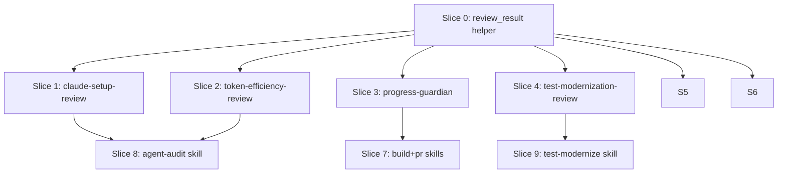

# Plan: Python Agent Harness Pattern

**Created**: 2026-06-26
**Spec**: docs/specs/python-agent-harness-pattern.md
**Closes**: #413, #414, #415, #416, #417, #418
**Branch**: feature/python-agent-harness
**Status**: implemented

## Goal

Extract deterministic enforcement from six markdown agents (orchestrator, progress-guardian, test-modernization-review, claude-setup-review, token-efficiency-review, codebase-recon) into Python scripts under `scripts/`. Calling skills invoke the scripts directly; markdown agents are updated to prose-spec role. The result is a consistent hybrid harness pattern: Python enforces structural invariants, LLM reasons only where genuine judgment is required.

## Approach Stances

- **Replace vs. merge for markdown agents**: Edit in place — preserve existing frontmatter and rationale, add delegation markers, remove executor language. No wholesale replace.
- **Scope**: Touch only the 6 new scripts + shared helper, their bats tests, 6 markdown agents, and the 3 declared calling-skill pairs. Nothing adjacent.
- **Evolution**: Scripts are net-new. Markdown agents are canonical targets; edit in place.
- **Schema version**: Issues reference "schema v0.2" for codebase-recon, but the on-disk schema is `recon-envelope-v1.json` at version `1.0`. Plan validates against v1.0.

## Output Contract (all scripts)

| Exit code | Meaning |
|---|---|
| 0 | All checks pass — no findings |
| 1 | Hard errors — structural violations, actionable by the caller |
| 2 | Warnings only — non-blocking findings, or LLM check skipped due to unavailability |

Argparse invocation errors use Python's default exit 2 to stderr (no JSON on stdout). Callers distinguish invocation errors from warning-only results by checking whether stdout is valid JSON.

**JSON output schema (all scripts):**

```json
{
  "status": "pass|warn|fail|skip",
  "issues": [
    {
      "severity": "error|warning|suggestion",
      "confidence": "high|medium|none",
      "file": "",
      "line": 0,
      "message": "",
      "suggestedFix": ""
    }
  ],
  "summary": ""
}
```

**LLM calling mechanism (all scripts):**

- Scripts call `claude -p <prompt>` directly via `subprocess.run(["claude", "-p", prompt], capture_output=True, text=True)` and parse stdout as the LLM's text response.
- `invoke_claude.sh` is NOT used — its contract checks for file creation, not text capture, making it incompatible with returning verdict text.
- `--skip-llm` flag: all scripts that make LLM calls support this flag; when set, the LLM call is skipped and any findings that would have come from it are replaced with a warning finding: `"LLM check skipped (--skip-llm)"`.
- LLM unavailability (claude not on PATH or exits non-zero): script exits 2 with a warning-severity finding. Never causes exit 1.

**Shared output helper:** `scripts/lib/review_result.py` — a single `build_result(errors, warnings, summary="")` function that constructs the canonical JSON dict and a `main_exit(result)` that serializes to stdout and returns the exit code. All six scripts import it. Pattern is established by `scripts/eval_graders/_common.py`.

## Acceptance Criteria

- [ ] All six Python scripts execute deterministic checks without LLM; LLM called only via direct `claude -p` subprocess after structural checks pass; LLM unavailability causes exit 2, never exit 1
- [ ] All scripts exit 0/1/2 per the output contract; JSON output on stdout conforms to the schema defined above; `--skip-llm` flag supported by all LLM-calling scripts
- [ ] Calling skills (`/build`, `/pr`, `/agent-audit`, `/test-modernize`) invoke the Python scripts directly; no skill dispatches the replaced markdown agents
- [ ] `progress_guardian.py --plan <path>`: parses `[x]`/`[ ]` checkboxes; `--pre-pr` exits 1 if (a) `git status --porcelain` is non-empty, OR (b) any `[x]` step has no `git log --oneline --no-merges HEAD` entry whose subject contains the step header text as a case-insensitive substring
- [ ] `test_modernization_review.py --repo <slug> --phase <N>`: resolves artifacts at `memory/test-modernize/<slug>/phase-<N>.md`; exits 1 with a clear message if the path does not exist; blocks on five structural invariants: unbound Gherkin scenarios (set-diff between `.feature` scenario IDs and `gherkin-bindings.json` keys), missing `reason`/`skip_tag` in `disabled-tests.json`, coverage regression vs `memory/test-modernize/<slug>/phase-3.md` numeric baseline, missing `measured_value` in phase-5 targets, unmet targets without `next_action`
- [ ] `claude_setup_review.py [--plugin-root <path>]`: discovers plugin root from `--plugin-root` flag (default: CWD); prints resolved root to stderr at startup; blocks on missing required fields (`name`/`description`/`effort`), invalid `effort` value, unsupported fields (warning), unresolvable path references (with referencing file + line number), non-kebab-case filenames, `name`/filename stem mismatch, duplicate `name` fields across agent files; LLM quality check fires only when all structural checks pass; LLM findings are warnings only
- [ ] `token_efficiency_review.py [--files <path>...]`: CLAUDE.md >5000 chars = exit 1; CLAUDE.md >200 rules = exit 1, where a "rule" is any top-level bullet (`-`) or numbered list item (`N.`) at indent level 0 in the CLAUDE.md body (excluding frontmatter); file >500 lines = warning (exit 2 when no hard errors); LLM scoped to `.md` files only; LLM findings are warning severity only
- [ ] `codebase_recon.py <repo-root> [--output-dir <path>]`: output defaults to `memory/recon-<slug>/` when `--output-dir` omitted; enforces 7-step ordering via sequential data-passing (steps 1/2/6 delegated to `scripts/lib/deterministic_recon.py`, steps 3/4/5 via `claude -p`, step 7 via `scripts/recon-inventory.sh`); validates output against `plugins/dev-team/knowledge/schemas/recon-envelope-v1.json` before writing; writes JSON and Markdown atomically (tempfile + `os.replace`); fails on non-zero exit from `recon-inventory.sh` with its stderr surfaced
- [ ] `orchestrator.py`: `classify(request)` is an LLM call that returns `{size: trivial|standard|complex}`; classify() failure defaults to full-pipeline branch with a stderr warning; the branch logic (fast-path vs full-pipeline) is deterministic given the classification; phase state persisted to `memory/orchestrator-<phase>.json`; `--resume` skips phases whose state files exist; `--resume` with no prior state exits 1 with message `"No prior phase state found; run without --resume to start a new pipeline"`; plan-review personas dispatched via `asyncio.gather`; each persona dispatch prints one startup line to stderr; wave barrier failure exits 1 printing to stderr: `Resume with: python3 scripts/orchestrator.py --resume`
- [ ] All six markdown agents updated with `> **Implemented by:** scripts/<name>.py` header AND frontmatter field `enforcement: script`; existing executor language removed
- [ ] Each script has a bats test suite in `tests/scripts/` covering at least one test per exit-code scenario (exit 0, 1, 2), including: malformed/missing input, `--skip-llm` behavior, and the specific invariant checks from the above ACs

## Slices

### Slice 0: Shared review output helper

**Depends-on:** none
**Files:** `scripts/lib/review_result.py`, `tests/scripts/review_result_tests.bats`

**Behavior:**

```gherkin
Feature: Shared review output helper

  Scenario: build_result with errors produces status fail and exit 1
    Given a list of error-severity issues and an empty warnings list
    When build_result is called and main_exit returns the exit code
    Then the exit code is 1
    And the JSON status field is "fail"

  Scenario: build_result with warnings only produces status warn and exit 2
    Given an empty errors list and a list of warning-severity issues
    When build_result is called and main_exit returns the exit code
    Then the exit code is 2
    And the JSON status field is "warn"

  Scenario: build_result with no issues produces status pass and exit 0
    Given both errors and warnings lists are empty
    When build_result is called
    Then the exit code is 0
    And the JSON status field is "pass"

  Scenario: JSON output is written to stdout and is valid JSON
    Given a result with one error issue
    When main_exit serializes to stdout
    Then stdout is parseable as JSON
    And it conforms to the shared output schema
```

**Steps:**

#### Step 0.1: Shared output helper

**Complexity**: standard
**RED**: Bats tests: `build_result(errors=[], warnings=[])` → `{"status":"pass",...}`, exit 0; errors → exit 1, `"fail"`; warnings only → exit 2, `"warn"`; stdout is valid JSON
**GREEN**: Implement `build_result(errors, warnings, summary="") -> dict` and `main_exit(result) -> int` in `scripts/lib/review_result.py`; no dependencies beyond stdlib
**REFACTOR**: None needed
**Files**: `scripts/lib/review_result.py`, `tests/scripts/review_result_tests.bats`
**Commit**: `feat: add shared review_result helper to scripts/lib`

---

### Slice 1: claude-setup-review Python validator

**Depends-on:** 0
**Files:** `scripts/claude_setup_review.py`, `tests/scripts/claude_setup_review_tests.bats`, `plugins/dev-team/agents/claude-setup-review.md`

**Behavior:**

```gherkin
Feature: Claude setup review mechanical validation

  Scenario: missing required frontmatter field is a hard error
    Given an agent file is missing the required "description" field
    When the setup review runs against that directory
    Then the exit code is 1
    And the JSON output names the missing field and the file path

  Scenario: invalid effort value is a hard error
    Given an agent file declares effort "ultra"
    When the setup review runs against that directory
    Then the exit code is 1
    And the output identifies the invalid value

  Scenario: plugin-unsupported field produces a warning
    Given an agent file declares a top-level "model" field
    When the setup review runs
    Then the exit code is 2
    And the JSON output categorizes the finding as severity "warning"

  Scenario: non-kebab-case filename is a hard error
    Given an agent file is named "MyAgent.md"
    When the setup review runs against that directory
    Then the exit code is 1

  Scenario: name field and filename stem mismatch is a hard error
    Given an agent file is named "my-agent.md" but declares name "other-agent"
    When the setup review runs
    Then the exit code is 1

  Scenario: unresolvable path reference is a hard error
    Given CLAUDE.md references a skill path that does not exist on disk
    When the setup review runs
    Then the exit code is 1
    And the output includes the referencing file path and line number

  Scenario: duplicate name across agent files is a hard error
    Given two agent files both declare name "my-agent"
    When the setup review runs against both
    Then the exit code is 1
    And the output lists both conflicting file paths

  Scenario: no CLAUDE.md in target path is a hard error
    Given the target path contains no CLAUDE.md file
    When the setup review runs
    Then the exit code is 1
    And the output states "CLAUDE.md not found at <path>"

  Scenario: structurally valid config passes with exit 0
    Given all agent files have valid frontmatter and all referenced paths exist
    When the setup review runs
    Then the exit code is 0

  Scenario: LLM check runs only when structural checks pass
    Given the plugin has no structural errors
    And --skip-llm is not set
    When the setup review runs
    Then a claude -p subprocess is invoked exactly once
    And any findings from it appear as warnings (exit 2 when no errors)

  Scenario: --skip-llm suppresses the LLM call
    Given the plugin has no structural errors
    When the setup review runs with --skip-llm
    Then no claude subprocess is invoked
    And the output contains a warning finding with message "LLM check skipped (--skip-llm)"
```

**Steps:**

#### Step 1.1: Frontmatter field presence and effort validation

**Complexity**: standard
**RED**: Bats tests (fixture temp dirs): missing `name`/`description`/`effort` → exit 1 with field name + path; `effort: ultra` → exit 1; `model:` top-level → exit 2; valid → exit 0
**GREEN**: Implement `check_frontmatter(path)` using PyYAML — required fields, effort set membership `{low,medium,high}`, unsupported field blocklist; import `review_result.build_result`
**REFACTOR**: Extract field constants to module level
**Files**: `scripts/claude_setup_review.py`, `tests/scripts/claude_setup_review_tests.bats`
**Commit**: `feat: add claude_setup_review frontmatter field and effort validation`

#### Step 1.2: Path resolution, naming convention, and root discovery

**Complexity**: standard
**RED**: Bats tests: non-existent skill path in CLAUDE.md → exit 1 with file+line; `MyAgent.md` → exit 1; name/filename mismatch → exit 1; no CLAUDE.md → exit 1; `--plugin-root` flag sets root; CWD used when flag absent; resolved root printed to stderr
**GREEN**: Implement `--plugin-root` CLI flag (default CWD); print resolved root to stderr; `check_path_references(root)` via `Path.exists()` tracking file+line; `check_naming(agents_dir)` via regex `^[a-z0-9]+(-[a-z0-9]+)*\.md$`
**REFACTOR**: None needed
**Files**: `scripts/claude_setup_review.py`, `tests/scripts/claude_setup_review_tests.bats`
**Commit**: `feat: add path resolution, naming checks, and --plugin-root to claude_setup_review`

#### Step 1.3: Duplicate name detection, JSON output, and LLM integration

**Complexity**: standard
**RED**: Bats tests: two agents with same `name` → exit 1 listing both paths; clean config → exit 0 with valid JSON; `--skip-llm` → no subprocess, warning finding; without `--skip-llm` on clean → `claude -p` invoked
**GREEN**: Implement `check_duplicate_names(agents_dir)` via set intersection; conditional LLM call via `subprocess.run(["claude", "-p", prompt], ...)` gated on `not errors`; LLM findings forced to `warning` severity; `--skip-llm` flag
**REFACTOR**: Update `plugins/dev-team/agents/claude-setup-review.md` — add `enforcement: script` to frontmatter and `> **Implemented by:** scripts/claude_setup_review.py` header; remove executor language
**Files**: `scripts/claude_setup_review.py`, `plugins/dev-team/agents/claude-setup-review.md`
**Commit**: `feat: complete claude_setup_review with duplicate detection, LLM, and agent update`

---

### Slice 2: token-efficiency-review Python metrics collector

**Depends-on:** 0
**Files:** `scripts/token_efficiency_review.py`, `tests/scripts/token_efficiency_review_tests.bats`, `plugins/dev-team/agents/token-efficiency-review.md`

**Behavior:**

```gherkin
Feature: Token efficiency metrics collection

  Scenario: CLAUDE.md over 5000 characters is a hard error
    Given a CLAUDE.md file containing 5001 characters
    When the token efficiency review runs against that file
    Then the exit code is 1
    And the JSON output identifies the character count

  Scenario: CLAUDE.md at exactly 5000 characters passes
    Given a CLAUDE.md file containing exactly 5000 characters
    When the token efficiency review runs
    Then the exit code is 0

  Scenario: CLAUDE.md over 200 rules is a hard error
    Given a CLAUDE.md file with 201 top-level bullet items in its body
    When the token efficiency review runs
    Then the exit code is 1

  Scenario: file over 500 lines produces a warning
    Given a file with 501 lines
    When the token efficiency review runs against that file
    Then the exit code is 2
    And the output categorizes the finding as severity "warning"

  Scenario: LLM review is scoped to .md files only
    Given --files includes both a .md and a .py file
    When the token efficiency review runs without --skip-llm
    Then the claude subprocess receives only the .md file content

  Scenario: --skip-llm suppresses the LLM call
    Given the CLAUDE.md is within limits and no hard errors exist
    When the token efficiency review runs with --skip-llm
    Then no claude subprocess is invoked
    And the output contains a warning finding "LLM check skipped (--skip-llm)"

  Scenario: LLM findings are warnings, never errors
    Given the LLM returns a role preamble finding
    When results are assembled
    Then that finding has severity "warning"
    And the exit code is 2 when no metric threshold is breached
```

**Steps:**

#### Step 2.1: CLAUDE.md character and rule count thresholds

**Complexity**: standard
**RED**: Bats tests: 5001-char CLAUDE.md → exit 1; 5000-char → exit 0; 201 top-level bullets → exit 1; 200 → exit 0
**GREEN**: Implement `check_claude_md(path)` — `len(text)` for chars; regex `^[-*]\` or `^\d+\.\` at indent level 0 for rule count; use `review_result.build_result`; accept `--files` flag
**REFACTOR**: None needed
**Files**: `scripts/token_efficiency_review.py`, `tests/scripts/token_efficiency_review_tests.bats`
**Commit**: `feat: add CLAUDE.md char and rule count thresholds to token_efficiency_review`

#### Step 2.2: Per-file line count, measure-tokens.sh, LLM filter, and agent update

**Complexity**: standard
**RED**: Bats tests: 501-line file → exit 2 warning; `measure-tokens.sh` output in JSON; `.py` file excluded from LLM call when mixed with `.md`; `--skip-llm` suppresses call
**GREEN**: Implement `check_line_counts(files)` via `len(lines)`; `measure-tokens.sh` via subprocess; `is_prose_file(p)` → `.md` extension; conditional `claude -p` call on prose candidates; `--skip-llm` flag; LLM findings forced to `warning`
**REFACTOR**: Update `plugins/dev-team/agents/token-efficiency-review.md` — add `enforcement: script` to frontmatter and `> **Implemented by:** scripts/token_efficiency_review.py` header
**Files**: `scripts/token_efficiency_review.py`, `plugins/dev-team/agents/token-efficiency-review.md`
**Commit**: `feat: complete token_efficiency_review with line counts, LLM filter, and agent update`

---

### Slice 3: progress-guardian Python plan validator

**Depends-on:** 0
**Files:** `scripts/progress_guardian.py`, `tests/scripts/progress_guardian_tests.bats`, `plugins/dev-team/agents/progress-guardian.md`

**Behavior:**

```gherkin
Feature: Plan progress validation

  Scenario: completed step without matching commit is a hard error
    Given a plan with one step marked [x] with header text "Add checkbox parser"
    And git log --oneline --no-merges HEAD contains no line matching "add checkbox parser" case-insensitively
    When the progress check runs
    Then the exit code is 1
    And the output names the step header text with missing commit evidence

  Scenario: uncommitted changes at step boundary are a hard error
    Given git status --porcelain returns one or more lines
    When the progress check runs
    Then the exit code is 1

  Scenario: pre-PR gate passes only when all steps done and tree clean
    Given all steps are marked [x] and each has a matching commit
    And git status --porcelain returns no output
    When the progress check runs with --pre-pr
    Then the exit code is 0

  Scenario: pre-PR gate blocks when any step is incomplete
    Given a plan where one step is still marked [ ]
    When the progress check runs with --pre-pr
    Then the exit code is 1

  Scenario: malformed plan file is a hard error
    Given --plan points to a file with no markdown checkboxes
    When the progress check runs
    Then the exit code is 1
    And the output names the file and describes the parse failure

  Scenario: out-of-plan files trigger LLM call for verdict
    Given git diff --name-only base...HEAD includes a file not listed in the plan
    When the progress check runs without --skip-llm
    Then a claude -p subprocess is invoked once with the full list of out-of-plan files
    And the verdict appears in the JSON output as a warning

  Scenario: clean plan with all steps committed passes
    Given all steps are [x] with matching commits and working tree is clean
    When the progress check runs
    Then the exit code is 0
```

**Steps:**

#### Step 3.1: Checkbox state parser

**Complexity**: standard
**RED**: Bats tests using fixture plan files: `[x]` and `[ ]` counts correct; step header text extracted; malformed file (no checkboxes) → exit 1 with file name
**GREEN**: Implement `parse_plan(path)` — regex `^- \[( |x)\] (.+)$` returning `Step(done, header)` list; exit 1 on empty result; use `review_result.build_result`
**REFACTOR**: None needed
**Files**: `scripts/progress_guardian.py`, `tests/scripts/progress_guardian_tests.bats`
**Commit**: `feat: add plan checkbox state parser to progress_guardian`

#### Step 3.2: Git-log cross-reference and uncommitted change check

**Complexity**: standard
**RED**: Bats tests with fixture git repos (init + commits in temp dir): `[x]` step with no matching commit → exit 1 naming step header; staged file → exit 1; clean → exit 0
**GREEN**: Implement `check_commit_discipline(steps)` via `git log --oneline --no-merges HEAD`, case-insensitive substring match on step header; `check_uncommitted()` via `git status --porcelain`; detect and fail gracefully on zero commits (fresh repo → exit 2 warning)
**REFACTOR**: Extract `run_git(args)` subprocess helper
**Files**: `scripts/progress_guardian.py`, `tests/scripts/progress_guardian_tests.bats`
**Commit**: `feat: add git-log cross-reference and uncommitted change check to progress_guardian`

#### Step 3.3: Pre-PR flag, scope creep, and agent update

**Complexity**: standard
**RED**: Bats tests: `--pre-pr` with incomplete step → exit 1; `--pre-pr` all done + clean → exit 0; out-of-plan file in diff → `claude -p` called once with file list; `--skip-llm` suppresses it
**GREEN**: Implement `--pre-pr` flag; `check_scope(plan_files)` via `git diff --name-only base...HEAD` set diff; one `claude -p` call for all out-of-plan files; `--skip-llm` flag
**REFACTOR**: Update `plugins/dev-team/agents/progress-guardian.md` — add `enforcement: script` and `> **Implemented by:**` header
**Files**: `scripts/progress_guardian.py`, `plugins/dev-team/agents/progress-guardian.md`
**Commit**: `feat: complete progress_guardian with pre-PR gate and scope check; update agent`

---

### Slice 4: test-modernization-review Python phase validator

**Depends-on:** 0
**Files:** `scripts/test_modernization_review.py`, `tests/scripts/test_modernization_review_tests.bats`, `plugins/dev-team/agents/test-modernization-review.md`

**Behavior:**

```gherkin
Feature: Test modernization phase gate

  Scenario: artifact path does not exist is a hard error
    Given memory/test-modernize/my-repo/phase-2.md does not exist
    When the phase 2 review runs with --repo my-repo --phase 2
    Then the exit code is 1
    And the output states "phase artifact not found at memory/test-modernize/my-repo/phase-2.md"

  Scenario: phase 2 unbound Gherkin scenario is a hard block
    Given a .feature file contains a scenario ID not present in gherkin-bindings.json
    When the phase 2 review runs
    Then the exit code is 1
    And the output names the unbound scenario ID

  Scenario: phase 2 orphaned binding produces a warning
    Given gherkin-bindings.json contains an ID with no matching scenario
    When the phase 2 review runs with no other errors
    Then the exit code is 2

  Scenario: phase 3 entry missing required field is a hard block
    Given disabled-tests.json contains an entry without a "reason" field
    When the phase 3 review runs
    Then the exit code is 1

  Scenario: phase 4 coverage regression is a hard block
    Given memory/test-modernize/my-repo/phase-3.md baseline is 80%
    And phase-4.md reports 78% coverage
    When the phase 4 review runs
    Then the exit code is 1
    And the output cites the regression delta

  Scenario: phase 5 missing measured_value is a hard block
    Given phase-5.md has a quality target without a "measured_value" field
    When the phase 5 review runs
    Then the exit code is 1

  Scenario: phase 5 unmet target without next_action is a hard block
    Given a quality target is below threshold and has no "next_action" field
    When the phase 5 review runs
    Then the exit code is 1

  Scenario: valid phase artifacts advance with exit 0
    Given all artifacts for the phase satisfy structural invariants
    When the phase review runs
    Then the exit code is 0
```

**Steps:**

#### Step 4.1: Artifact path resolution and phase 2 cross-reference

**Complexity**: standard
**RED**: Bats tests: missing artifact path → exit 1 with path in message; unbound scenario → exit 1 with scenario name; orphaned binding → exit 2
**GREEN**: Implement `--repo`/`--phase` flags; resolve `memory/test-modernize/<slug>/phase-<N>.md`; `validate_phase_2(base)` — parse scenario IDs via regex from `.feature` files, set-diff against `gherkin-bindings.json` keys
**REFACTOR**: Extract `extract_scenario_ids(feature_files)` helper
**Files**: `scripts/test_modernization_review.py`, `tests/scripts/test_modernization_review_tests.bats`
**Commit**: `feat: add artifact resolution and phase 2 cross-reference to test_modernization_review`

#### Step 4.2: Phase 3 schema check and phases 4/5 numeric validators

**Complexity**: standard
**RED**: Bats tests: phase 3 missing `reason`/`skip_tag` → exit 1; phase 4 coverage below baseline → exit 1 with delta; phase 5 missing `measured_value` → exit 1; unmet target without `next_action` → exit 1; valid in all phases → exit 0
**GREEN**: `validate_phase_3(base)` via `json.load` + key check per entry; `validate_phase_4(base)` via regex float parse of coverage values compared to `phase-3.md` baseline; `validate_phase_5(base)` checking all target entries
**REFACTOR**: Extract `parse_coverage_number(text)` helper; update `plugins/dev-team/agents/test-modernization-review.md` — add `enforcement: script` and `> **Implemented by:**` header
**Files**: `scripts/test_modernization_review.py`, `plugins/dev-team/agents/test-modernization-review.md`
**Commit**: `feat: complete test_modernization_review phase validators; update agent`

---

### Slice 5: codebase-recon Python harness

**Depends-on:** 0
**Files:** `scripts/codebase_recon.py`, `tests/scripts/codebase_recon_tests.bats`, `plugins/dev-team/agents/codebase-recon.md`, `requirements-dev.txt`

**Seven steps of the recon procedure:**

| Step | Description | Owner |
|---|---|---|
| 1 | Discover metadata (language, package manager, framework) | `deterministic_recon.py` |
| 2 | Enumerate languages and file counts | `deterministic_recon.py` |
| 3 | Identify entry points | `claude -p` (LLM) |
| 4 | Map architecture (layers, boundaries, patterns) | `claude -p` (LLM) |
| 5 | Scan security surface (auth, crypto, input validation) | `claude -p` (LLM) |
| 6 | Probe git history (churn, contributors, hotspots) | `deterministic_recon.py` / `git log` |
| 7 | Enumerate inventory + emit artifacts | `scripts/recon-inventory.sh` + atomic write |

**Behavior:**

```gherkin
Feature: Codebase reconnaissance harness

  Scenario: deterministic steps complete without LLM
    Given a repository where claude is not on PATH
    When the recon harness runs with --skip-llm
    Then steps 1, 2, and 6 complete via deterministic_recon.py and git commands
    And the harness exits 0 or 1 without hanging or producing auth errors

  Scenario: schema-invalid output is not written
    Given the assembled artifact is missing a required field from recon-envelope-v1.json
    When the harness attempts to write artifacts
    Then no file appears at the output path
    And the exit code is 1

  Scenario: artifacts are written atomically
    Given a schema-valid recon result
    When the harness writes the JSON and Markdown artifacts
    Then both files appear at their final paths via tempfile + os.replace
    And no partial file is observable during the operation

  Scenario: recon-inventory.sh failure aborts the harness
    Given recon-inventory.sh exits non-zero
    When the harness reaches step 7
    Then the exit code is 1 with recon-inventory.sh stderr surfaced
    And no artifacts are written to the output path

  Scenario: recon-inventory.sh writes partial output before failing
    Given recon-inventory.sh exits 2 and writes to stdout before exiting
    When the harness reaches step 7
    Then no artifact file is written to disk
    And the exit code is 1

  Scenario: step ordering is enforced by data dependencies
    Given the harness is invoked for a repository
    When it executes all seven steps
    Then each step function receives the prior step's return value as an explicit argument
```

**Steps:**

#### Step 5.1: Add jsonschema to requirements-dev.txt and harness skeleton

**Complexity**: complex
**RED**: Bats test: `python3 -c "import jsonschema"` exits 0 after install; harness skeleton executes steps in declared order; skipping step N breaks step N+1 (structural test via argument passing)
**GREEN**: Add `jsonschema>=4.0  # scripts/codebase_recon.py schema validation` to `requirements-dev.txt`; implement `run(root, output_dir)` with sequential function calls — each returns typed result consumed by next; stubs for LLM steps
**REFACTOR**: Align data structures with `scripts/lib/deterministic_recon.py`'s `build_recon()` output
**Files**: `scripts/codebase_recon.py`, `tests/scripts/codebase_recon_tests.bats`, `requirements-dev.txt`
**Commit**: `feat: add jsonschema dep; add codebase_recon harness skeleton with step ordering`

#### Step 5.2: Deterministic steps wrapping deterministic_recon.py and inventory

**Complexity**: complex
**RED**: Bats tests: steps 1/2/6 produce expected output for a fixture repo with `--skip-llm`; `recon-inventory.sh` non-zero exit → harness exit 1 with stderr; partial stdout from failing script not written to disk
**GREEN**: Steps 1/2/6 delegate to `scripts/lib/deterministic_recon.py` via import; step 7 via `subprocess.run(["bash", "scripts/recon-inventory.sh"])` with exit-code check; `--skip-llm` stubs steps 3/4/5
**REFACTOR**: None needed
**Files**: `scripts/codebase_recon.py`, `tests/scripts/codebase_recon_tests.bats`
**Commit**: `feat: implement deterministic recon steps 1/2/6/7 in codebase_recon harness`

#### Step 5.3: Schema validation, atomic write, and agent update

**Complexity**: complex
**RED**: Bats tests: artifact missing required field → exit 1, no file on disk; valid artifact → JSON + MD written atomically (check temp pattern); `--output-dir` omitted → defaults to `memory/recon-<slug>/`
**GREEN**: `validate_schema(artifact)` via `jsonschema.validate` against `plugins/dev-team/knowledge/schemas/recon-envelope-v1.json`; `write_atomically(path, data)` via `tempfile.NamedTemporaryFile` + `os.replace`; resolve output path
**REFACTOR**: Update `plugins/dev-team/agents/codebase-recon.md` — add `enforcement: script` and `> **Implemented by:**` header
**Files**: `scripts/codebase_recon.py`, `plugins/dev-team/agents/codebase-recon.md`
**Commit**: `feat: add schema validation and atomic write to codebase_recon; update agent`

---

### Slice 6: orchestrator Python dispatcher

**Depends-on:** 0
**Files:** `scripts/orchestrator.py`, `tests/scripts/orchestrator_tests.bats`, `tests/scripts/test_orchestrator.py`, `plugins/dev-team/agents/orchestrator.md`

**Behavior:**

```gherkin
Feature: Orchestrator phase dispatcher

  Scenario: classify() failure defaults to full-pipeline branch
    Given claude is not on PATH or exits non-zero
    When orchestrator runs
    Then it proceeds with the full-pipeline branch
    And a warning is printed to stderr: "LLM classify failed; defaulting to full pipeline"

  Scenario: trivial classification takes the fast path
    Given classify() returns size="trivial"
    When the orchestrator runs
    Then the three-phase pipeline is not executed
    And no plan-review persona dispatch occurs

  Scenario: --resume with prior research state skips research phase
    Given memory/orchestrator-research.json exists from a prior run
    When orchestrator runs with --resume
    Then the research phase function is not called
    And execution enters the plan phase

  Scenario: --resume with no prior state exits 1 with clear message
    Given no memory/orchestrator-*.json files exist
    When orchestrator runs with --resume
    Then the exit code is 1
    And stderr contains "No prior phase state found; run without --resume"

  Scenario: phase state written on phase completion
    Given the orchestrator completes the research phase
    When it transitions to the plan phase
    Then memory/orchestrator-research.json exists and contains the phase result

  Scenario: personas dispatched concurrently and stderr progress lines emitted
    Given a plan with two available plan-review personas
    When the orchestrator enters the plan review phase
    Then one startup line per persona is printed to stderr before gather returns
    And results are aggregated before the human gate proceeds

  Scenario: wave barrier failure exits 1 with resume command
    Given a build wave where one slice fails
    When the orchestrator processes that wave
    Then the exit code is 1
    And stderr contains "Resume with: python3 scripts/orchestrator.py --resume"
    And no subsequent wave starts
```

**Steps:**

#### Step 6.1: Task classification and fast-path branch

**Complexity**: complex
**RED**: Bats tests + pytest: `classify()` returning "trivial" → fast path taken, no persona dispatch; classify() failure → full-pipeline default + stderr warning; `--skip-llm` → classifies as "standard" (safe default)
**GREEN**: Implement `classify(request)` via `subprocess.run(["claude", "-p", prompt], ...)` parsing JSON response; branch on `task.size == "trivial"` → `fast_path()` stub vs `full_pipeline()` stub; `--skip-llm` defaults to "standard"
**REFACTOR**: None needed
**Files**: `scripts/orchestrator.py`, `tests/scripts/orchestrator_tests.bats`, `tests/scripts/test_orchestrator.py`
**Commit**: `feat: add task classification and fast-path branch to orchestrator`

#### Step 6.2: Phase state machine and --resume flag

**Complexity**: complex
**RED**: Bats + pytest: completed research → `memory/orchestrator-research.json` exists; `--resume` with state file → research skipped; `--resume` no state → exit 1 with message
**GREEN**: Implement `write_progress(phase, result)` → `memory/orchestrator-<phase>.json`; `read_progress(phase)` → result or None; `--resume` reads state before each phase; no-state error path
**REFACTOR**: Extract `phase_state_path(phase)` helper
**Files**: `scripts/orchestrator.py`, `tests/scripts/orchestrator_tests.bats`, `tests/scripts/test_orchestrator.py`
**Commit**: `feat: add phase state persistence and --resume to orchestrator`

#### Step 6.3: Concurrent persona dispatch and wave barrier

**Complexity**: complex
**RED**: Pytest: N personas → N gather tasks; one startup line per persona to stderr; wave slice failure → WaveError with slice name + resume command; subsequent wave not started; bats test: stderr contains "Resume with:" on failure
**GREEN**: Implement `asyncio.gather(*[dispatch(p, plan) for p in personas])` with stderr startup per persona; `reconcile(results, wave)` raises `WaveError` on failure; `WaveError` caught in main, prints resume command, exits 1
**REFACTOR**: Update `plugins/dev-team/agents/orchestrator.md` — add `enforcement: script` and `> **Implemented by:**` header
**Files**: `scripts/orchestrator.py`, `plugins/dev-team/agents/orchestrator.md`
**Commit**: `feat: add concurrent persona dispatch and wave barrier to orchestrator; update agent`

---

### Slice 7: /build and /pr skill integration

**Depends-on:** 3
**Files:** `plugins/dev-team/skills/build/SKILL.md`, `plugins/dev-team/skills/pr/SKILL.md`, `tests/scripts/build_pr_integration_tests.bats`

**Behavior:**

```gherkin
Feature: build and pr skills invoke progress_guardian.py directly

  Scenario: /build step-boundary reference names progress_guardian.py
    Given the build skill file is read
    When its step-boundary check text is inspected
    Then the string "scripts/progress_guardian.py" appears in the body
    And the string "progress-guardian" does not appear as a dispatch target

  Scenario: /pr preflight reference names progress_guardian.py --pre-pr
    Given the pr skill file is read
    When its preflight check text is inspected
    Then the string "scripts/progress_guardian.py --pre-pr" appears in the body
    And the string "progress-guardian" does not appear as a dispatch target
```

**Steps:**

#### Step 7.1: Update /build and /pr skills

**Complexity**: standard
**RED**: Bats tests: grep `skills/build/SKILL.md` for `scripts/progress_guardian.py` → found; grep for `progress-guardian` as dispatch target → not found; same for `skills/pr/SKILL.md` with `--pre-pr`
**GREEN**: Edit `skills/build/SKILL.md` step-boundary prose to reference `python3 scripts/progress_guardian.py --plan <path>`; edit `skills/pr/SKILL.md` preflight to reference `python3 scripts/progress_guardian.py --pre-pr`
**REFACTOR**: None needed
**Files**: `plugins/dev-team/skills/build/SKILL.md`, `plugins/dev-team/skills/pr/SKILL.md`, `tests/scripts/build_pr_integration_tests.bats`
**Commit**: `feat: update /build and /pr skills to invoke progress_guardian.py directly`

---

### Slice 8: /agent-audit skill integration

**Depends-on:** 1, 2
**Files:** `plugins/dev-team/skills/agent-audit/SKILL.md`, `tests/scripts/agent_audit_integration_tests.bats`

**Behavior:**

```gherkin
Feature: agent-audit skill invokes review scripts directly

  Scenario: /agent-audit structural phase names both review scripts
    Given the agent-audit skill file is read
    When its structural validation text is inspected
    Then "scripts/claude_setup_review.py" appears in the body
    And "scripts/token_efficiency_review.py" appears in the body
    And neither "claude-setup-review" nor "token-efficiency-review" appears as a dispatch target
```

**Steps:**

#### Step 8.1: Update /agent-audit skill

**Complexity**: standard
**RED**: Bats test: grep `skills/agent-audit/SKILL.md` for both script paths → found; grep for agent dispatch targets → not found
**GREEN**: Edit `skills/agent-audit/SKILL.md` structural validation prose to reference both `python3 scripts/claude_setup_review.py` and `python3 scripts/token_efficiency_review.py`
**REFACTOR**: None needed
**Files**: `plugins/dev-team/skills/agent-audit/SKILL.md`, `tests/scripts/agent_audit_integration_tests.bats`
**Commit**: `feat: update /agent-audit skill to invoke review scripts directly`

---

### Slice 9: /test-modernize skill integration

**Depends-on:** 4
**Files:** `plugins/dev-team/skills/test-modernize/SKILL.md`, `tests/scripts/test_modernize_integration_tests.bats`

**Behavior:**

```gherkin
Feature: test-modernize skill invokes phase validator directly

  Scenario: /test-modernize phase gate names test_modernization_review.py
    Given the test-modernize skill file is read
    When its phase boundary check text is inspected
    Then "scripts/test_modernization_review.py" appears with --repo and --phase arguments
    And "test-modernization-review" does not appear as a dispatch target
```

**Steps:**

#### Step 9.1: Update /test-modernize skill

**Complexity**: standard
**RED**: Bats test: grep `skills/test-modernize/SKILL.md` for `test_modernization_review.py` with `--repo` and `--phase` → found; grep for agent dispatch target → not found
**GREEN**: Edit `skills/test-modernize/SKILL.md` phase-boundary prose to reference `python3 scripts/test_modernization_review.py --repo <slug> --phase <N>`
**REFACTOR**: None needed
**Files**: `plugins/dev-team/skills/test-modernize/SKILL.md`, `tests/scripts/test_modernize_integration_tests.bats`
**Commit**: `feat: update /test-modernize skill to invoke test_modernization_review.py directly`

---

## Parallelization



| Wave | Slices (parallel) |
|------|-------------------|
| 1 | 0 |
| 2 | 1, 2, 3, 4, 5, 6 |
| 3 | 7, 8, 9 |

No same-wave file collisions in any wave. `requirements-dev.txt` is touched only by slice 5 (wave 2). `tests/scripts/skill_python_integration_tests.bats` is touched by slices 7, 8, and 9 (all wave 3 — no collision since they are in separate worktrees).

**Note on `skill_python_integration_tests.bats`:** Slices 7, 8, and 9 all append tests to this file. Since they are in the same wave and touch the same file, they must be re-waved — move 8 and 9 to wave 4, or split the test file. **Resolution:** each skill-integration slice uses its own dedicated test file:

- Slice 7: `tests/scripts/build_pr_integration_tests.bats`
- Slice 8: `tests/scripts/agent_audit_integration_tests.bats`
- Slice 9: `tests/scripts/test_modernize_integration_tests.bats`

Updated Files declarations (reflected in Build Progress):

- Slice 7: `plugins/dev-team/skills/build/SKILL.md`, `plugins/dev-team/skills/pr/SKILL.md`, `tests/scripts/build_pr_integration_tests.bats`
- Slice 8: `plugins/dev-team/skills/agent-audit/SKILL.md`, `tests/scripts/agent_audit_integration_tests.bats`
- Slice 9: `plugins/dev-team/skills/test-modernize/SKILL.md`, `tests/scripts/test_modernize_integration_tests.bats`

## Complexity Classification

| Steps | Rating |
|---|---|
| 0.1 | standard |
| 1.1–1.3 | standard |
| 2.1–2.2 | standard |
| 3.1–3.3 | standard |
| 4.1–4.2 | standard |
| 5.1–5.3 | complex |
| 6.1–6.3 | complex |
| 7.1, 8.1, 9.1 | standard |

## Pre-PR Quality Gate

- [ ] All bats tests pass (`bash scripts/ci-local.sh`)
- [ ] `python3 -m pytest tests/scripts/test_orchestrator.py` passes
- [ ] `python3 -m py_compile` passes on all six new Python scripts and `scripts/lib/review_result.py`
- [ ] `shellcheck` passes on all new/modified shell scripts
- [ ] `/code-review` passes
- [ ] All six agent markdown files updated with `enforcement: script` and `> **Implemented by:**` header
- [ ] `jsonschema>=4.0` present in `requirements-dev.txt`

## Risks & Open Questions

- **Schema version**: Issues reference "v0.2" but on-disk schema is `recon-envelope-v1.json` at version `1.0`. Plan uses v1.0. Confirm before Step 5.3.
- **orchestrator asyncio in bats**: Pure concurrency verification (wall-clock overlap) is not practical in bats. `tests/scripts/test_orchestrator.py` covers WaveError and gather semantics at the unit level. Bats covers CLI interface (stderr output, exit codes). This is intentional dual-coverage.
- **`/agent-audit` skill path**: Confirm `skills/agent-audit/SKILL.md` is the correct path (not `agent_audit`) before Step 8.1.
- **`/test-modernize` skill path**: Confirm `skills/test-modernize/SKILL.md` before Step 9.1.
- **codebase_recon.py ownership of recon envelope**: `codebase_recon.py` becomes the canonical producer of the recon envelope; `agents/codebase-recon.md` is the prose spec for it. The security-assessment plugin consumes the envelope via the schema — no schema change is made here. If a future change needs a schema version bump, that is a separate concern.

## Plan Review Summary

**Plan tier: complex** — 10 slices, 3 waves, max-wave-width 6, 2 complex-rated step groups, stance on replace-vs-merge decision axis.
**Reviewers dispatched:** all 5 (Acceptance, Design, Strategic, Parallelization, UX).
**Iterations:** 2 (first pass → needs-revision on all four non-strategic reviewers; second pass → all approve).

### First-pass blockers addressed

| Reviewer | Blocker | Resolution |
|---|---|---|
| Design | `jsonschema` missing from requirements-dev.txt/CI | Step 5.1 adds `jsonschema>=4.0` to requirements-dev.txt; Slice 5 Files includes it |
| Design | `invoke_claude.sh` contract incompatible with LLM text capture | All scripts use `subprocess.run(["claude", "-p", prompt], capture_output=True, text=True)` directly; invoke_claude.sh explicitly excluded |
| Acceptance | AC2 schema unnamed | JSON schema named and defined inline in Output Contract section |
| Acceptance | AC5 --repo slug resolution undefined | Explicitly resolves to `memory/test-modernize/<slug>/phase-<N>.md`; exit 1 if missing |
| Acceptance | AC7 "rules" undefined | Defined as top-level bullets/numbered items at indent level 0, excluding frontmatter |
| Acceptance | AC8 schema file unlinked | Named as `plugins/dev-team/knowledge/schemas/recon-envelope-v1.json` |
| Acceptance | AC9 "deterministically" contradicts LLM classify() | Removed; classify() failure defaults to full-pipeline; branch logic is deterministic given classification |
| Acceptance | LLM invocation untestable | `--skip-llm` flag added to all LLM-calling scripts; bats tests verify no subprocess when set |
| Acceptance | Step-to-commit matching undefined | `git log --oneline --no-merges HEAD`, case-insensitive substring on step header text |
| Parallelization | `requirements-dev.txt` not in Slice 5 Files | Added |

### Structural improvements from non-blocker findings

- **Shared output helper** (Design warning): Slice 0 adds `scripts/lib/review_result.py` with `build_result()` + `main_exit()`; all scripts import it
- **Split Wave 2 monolithic slice** (Strategic warning): original wave-2 slice split into Slices 7/8/9 — independent per-skill updates, fully parallel in Wave 3
- **Delegation markers** (Strategic warning): AC10 now requires both `enforcement: script` frontmatter field AND `> **Implemented by:**` header
- **LLM calling mechanism**: explicit `claude -p` subprocess with text capture; `--skip-llm` flag for testability
- **Root discovery spec** (UX warning): `--plugin-root` flag with CWD default + startup line to stderr
- **Invocation consistency** (UX warning): `token_efficiency_review.py` uses `--files` named flag
- **Async progress indication** (UX warning): one startup line per persona to stderr
- **Exit code contract** (UX warning): fully named with caller disambiguation guidance
- **Resume command spec** (UX warning): exact stderr string `"Resume with: python3 scripts/orchestrator.py --resume"` specified

### Remaining advisory warnings (non-blocking)

| Reviewer | Warning | Disposition |
|---|---|---|
| Acceptance | Commit-match heuristic brittle for free-form step headers | Advisory — document expected convention in implementation; `--override` flag candidate for follow-up |
| Acceptance | LLM step failure in codebase_recon (steps 3–5) — abort vs partial envelope unspecified | Resolution in Step 5.2: LLM unavailability → exit 2 (same contract as other scripts); partial envelopes are schema-invalid and blocked by Step 5.3 validation |
| Design | `--skip-llm` finding has no stable `rule_id` | Advisory — add `rule_id: "llm-skipped"` in Slice 0 implementation; bats tests assert on field, not message text |
| Design | `invoke_claude.sh` continues to exist without contract annotation | Advisory — add comment block to invoke_claude.sh in Step 5.1 clarifying file-existence-only contract |
| UX | Bats test for exact resume string not specified in plan | Covered by Step 6.3 bats test: `[[ "$stderr" == *"Resume with:"* ]]` — add this explicitly to step description during implementation |
| UX | Exit code 2 discriminator (warnings vs LLM-skipped) not documented | Advisory — `status` field in JSON body discriminates; add a one-line note to Slice 0 step |
| Strategic | Schema v1.0 backward-compat not addressed | Advisory — no schema change is made; downstream consumer (security-assessment) reads v1.0 artifacts produced by the same recon-inventory.sh; no regression risk |

## Build Progress

### Slices (grouped by wave)

#### Wave 1

- [x] Slice 0: Shared review output helper
  - [x] Step 0.1: Shared output helper

#### Wave 2

- [x] Slice 1: claude-setup-review Python validator
  - [x] Step 1.1: Frontmatter field presence and effort validation
  - [x] Step 1.2: Path resolution, naming convention, and root discovery
  - [x] Step 1.3: Duplicate name detection, JSON output, and LLM integration
- [x] Slice 2: token-efficiency-review Python metrics collector
  - [x] Step 2.1: CLAUDE.md character and rule count thresholds
  - [x] Step 2.2: Per-file line count, measure-tokens.sh, LLM filter, and agent update
- [x] Slice 3: progress-guardian Python plan validator
  - [x] Step 3.1: Checkbox state parser
  - [x] Step 3.2: Git-log cross-reference and uncommitted change check
  - [x] Step 3.3: Pre-PR flag, scope creep, and agent update
- [x] Slice 4: test-modernization-review Python phase validator
  - [x] Step 4.1: Artifact path resolution and phase 2 cross-reference
  - [x] Step 4.2: Phase 3 schema check and phases 4/5 numeric validators
- [x] Slice 5: codebase-recon Python harness
  - [x] Step 5.1: Add jsonschema to requirements-dev.txt and harness skeleton
  - [x] Step 5.2: Deterministic steps wrapping deterministic_recon.py and inventory
  - [x] Step 5.3: Schema validation, atomic write, and agent update
- [x] Slice 6: orchestrator Python dispatcher
  - [x] Step 6.1: Task classification and fast-path branch
  - [x] Step 6.2: Phase state machine and --resume flag
  - [x] Step 6.3: Concurrent persona dispatch and wave barrier

#### Wave 3

- [x] Slice 7: /build and /pr skill integration
  - [x] Step 7.1: Update /build and /pr skills
- [x] Slice 8: /agent-audit skill integration
  - [x] Step 8.1: Update /agent-audit skill
- [x] Slice 9: /test-modernize skill integration
  - [x] Step 9.1: Update /test-modernize skill

### Acceptance Criteria

- [ ] All six Python scripts execute deterministic checks without LLM; LLM called only via direct `claude -p` subprocess after structural checks pass; LLM unavailability causes exit 2, never exit 1
- [ ] All scripts exit 0/1/2 per the output contract; JSON output conforms to the defined schema; `--skip-llm` flag supported by all LLM-calling scripts
- [ ] Calling skills invoke the Python scripts directly; no skill dispatches the replaced markdown agents
- [ ] `progress_guardian.py` parses checkboxes and git log; `--pre-pr` blocks on incomplete steps or uncommitted changes
- [ ] `test_modernization_review.py` resolves artifacts by slug path; blocks on all five structural invariants
- [ ] `claude_setup_review.py` discovers root via `--plugin-root`; blocks on structural violations; LLM fires only when structural checks pass
- [ ] `token_efficiency_review.py` blocks on metric thresholds; LLM scoped to `.md` files; LLM findings are warnings only
- [ ] `codebase_recon.py` enforces 7-step ordering; validates against recon-envelope-v1.json; writes atomically; fails on non-zero recon-inventory.sh
- [ ] `orchestrator.py` branches on classify() output (failure defaults to full-pipeline); persists phase state; `--resume` supported; personas dispatched concurrently with stderr progress; wave barrier exits 1 with resume command
- [ ] All six markdown agents updated with `enforcement: script` frontmatter field and `> **Implemented by:**` header
- [ ] Each script has a bats test suite covering exit 0/1/2 scenarios; orchestrator also has pytest suite for asyncio behavior
