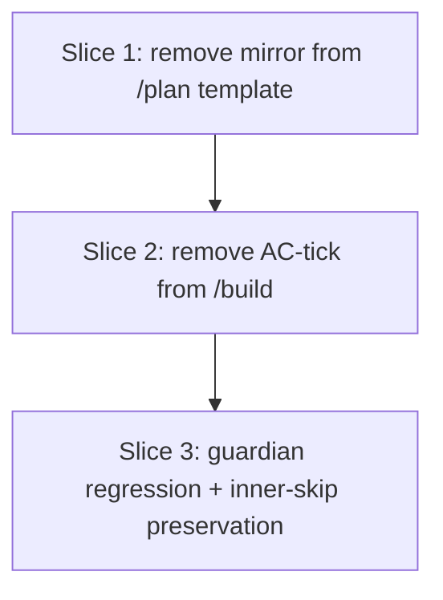

# Plan: remove the AC mirror from `/plan`'s Build Progress template

**Created**: 2026-07-01
**Branch**: feat/526-remove-ac-mirror
**Status**: implemented
**Spec**: docs/specs/remove-ac-mirror.md
**Issue**: <https://github.com/bdfinst/agentic-dev-team/issues/526>

## Goal

Remove the duplicative `### Acceptance Criteria` subsection from `/plan`'s Build Progress template so future plans don't render an operator-tickable checkbox list of ACs alongside real work-tracking checkboxes. Update `/build`'s "mark step done" instructions to stop trying to tick items in that (no-longer-generated) subsection. Add a regression bats guard against re-addition. Keep the top-level `## Acceptance Criteria` section as the single home for ACs, and keep the #525 guardian's `in_acceptance` inner-skip as belt-and-suspenders for legacy plans on branches that still carry the old shape.

## Approach stance (high-reversal-cost axes)

- **Scope** — three files edited (two SKILL.md files + one new bats). No new modules, no design invention. Rejected options 2/3/4 from #526 in the approach contract.
- **Migrate vs. edit stub** — n/a; `/plan` and `/build` are canonical skills, no stubs.
- **Replace vs. merge** — removing an existing subsection from a template + deleting one instruction line + adding a new regression file. Purely subtractive on the template surface; additive on the test surface.
- **Auto-merge** — disabled (`/pr --no-auto-merge`). Touches skills. `Closes #526` in the PR body.
- **Format fidelity** — n/a.

## Acceptance Criteria

- [ ] A1: `plan/SKILL.md`'s template block no longer contains `### Acceptance Criteria`. Top-level `## Acceptance Criteria` heading elsewhere in the file MUST still appear (grep count ≥ 1).
- [ ] A2: `plan/SKILL.md` Step 4 prose no longer instructs the reader to "populate the `## Build Progress` section by copying ... criteria from `## Acceptance Criteria`". Wording drops the criteria-copy language.
- [ ] A3: `build/SKILL.md` no longer contains the sub-bullet ticking items in the Build Progress `### Acceptance Criteria` subsection. Grep returns 0 for the phrase.
- [ ] A4: `tests/repo/plan-template-tests.bats` exists with a `@test` that fails if the AC mirror re-appears in `plan/SKILL.md`'s Build Progress template block.
- [ ] A5: `bats tests/scripts/progress_guardian_tests.bats` (all 22 tests from #525) continues to exit 0 — the guardian's inner-skip is preserved and remains a no-op fallthrough on plans without the mirror.
- [ ] A6: `bash scripts/ci-local.sh` exits 0; PR title prefix `fix(plan):`; opened with `--no-auto-merge`; body uses `Closes #526`.

## Slices

Three sequential slices, each editing a distinct target. Each slice extends the shared `tests/repo/plan-template-tests.bats` fixture, so the chain serializes via `Depends-on`.

### Slice 1: Remove the AC mirror from `/plan`'s template + update Step 4 prose

**Depends-on:** none
**Files:** `plugins/dev-team/skills/plan/SKILL.md`, `tests/repo/plan-template-tests.bats`

**Behavior:**

```gherkin
Feature: /plan's template renders only slice/step checkboxes in Build Progress

  Scenario: The template's Build Progress block has no Acceptance Criteria subheading
    Given the skill file "plugins/dev-team/skills/plan/SKILL.md"
    When the fenced template block containing "## Build Progress" is read
    Then it does not contain a "### Acceptance Criteria" subheading
    And the placeholder bullets that mirrored top-level ACs are absent

  Scenario: The top-level Acceptance Criteria heading is preserved
    Given the same skill file
    When the whole file is scanned
    Then "## Acceptance Criteria" appears at least once (as the top-level template section, not the removed inner mirror)

  Scenario: Step 4 prose no longer describes populating the mirror
    Given the same skill file
    When Step 4 is read
    Then it does not instruct copying "criteria from ## Acceptance Criteria" into Build Progress
    And it still instructs copying slice + step titles from ## Slices
```

**Steps:**

#### Step 1.1: Remove the mirror block + update Step 4 prose + regression bats

**Complexity**: standard
**RED**: Create `tests/repo/plan-template-tests.bats` with three `@test` blocks: (a) grep count of `### Acceptance Criteria` in `plan/SKILL.md` is 0; (b) `## Acceptance Criteria` count ≥ 1 (top-level section still there); (c) Step 4 prose does not contain the literal phrase `criteria from ## Acceptance Criteria`. Run `bats`; (a) and (c) fail on the current file state.
**GREEN**: Edit `plugins/dev-team/skills/plan/SKILL.md`:

- Remove lines 215-219 (the `### Acceptance Criteria` subheading + example bullets) from inside the Build Progress template block.
- Update Step 4's prose (line 224) to remove the phrase `and criteria from ## Acceptance Criteria`, keeping the rest of the sentence about copying slice/step titles.

Run `bats`; all three assertions pass.
**REFACTOR**: Verify no stray mentions of the mirror elsewhere in the file. None expected.
**Files**: `plugins/dev-team/skills/plan/SKILL.md`, `tests/repo/plan-template-tests.bats`
**Commit**: `fix(plan): remove AC mirror from Build Progress template (#526)`

### Slice 2: Remove `/build`'s AC-tick instruction

**Depends-on:** 1
**Files:** `plugins/dev-team/skills/build/SKILL.md`, `tests/repo/plan-template-tests.bats`

**Behavior:**

```gherkin
Feature: /build no longer auto-ticks AC checkboxes

  Scenario: /build's step-done instructions no longer reference the Build Progress AC subsection
    Given the skill file "plugins/dev-team/skills/build/SKILL.md"
    When the file is scanned
    Then it does not contain the phrase "Build Progress `### Acceptance Criteria`"
    And it still contains the pre-existing step-done instructions for slice/step checkboxes
    And it still contains the pre-implementation "verify acceptance criteria (gate)" step (that's AC-quality review, not mirror-tick)
```

**Steps:**

#### Step 2.1: Remove line 119's AC-tick instruction + regression bats

**Complexity**: trivial
**RED**: Extend `tests/repo/plan-template-tests.bats` with three `@test` blocks: (a) grep count of `Build Progress \`### Acceptance Criteria\`` in `build/SKILL.md` is 0; (b) an anchor grep proving the surrounding step-done section still exists (grep for the slice-tick instruction such as `Change \`- [ ] Slice N` or the header `Mark step done`); (c) grep for`Verify acceptance criteria (gate)` returns ≥ 1 (the pre-implementation AC-quality gate is preserved). Run `bats`; (a) fails.
**GREEN**: Edit`plugins/dev-team/skills/build/SKILL.md` line 119 — delete the sub-bullet that says: `For each acceptance criterion verified by this step, change ... in the Build Progress ### Acceptance Criteria subsection.` Preserve the surrounding sub-bullets for slice/step ticks and the plan-status update. Run `bats`; all three pass.
**REFACTOR**: None. Single-line deletion.
**Files**:`plugins/dev-team/skills/build/SKILL.md`,`tests/repo/plan-template-tests.bats`
**Commit**: `fix(build): stop ticking Build Progress AC mirror (#526)`

### Slice 3: Belt-and-suspenders — assert guardian tests still green

**Depends-on:** 2
**Files:** `tests/repo/plan-template-tests.bats`

**Behavior:**

```gherkin
Feature: Legacy plans with the AC mirror still work — the guardian's #525 inner-skip is preserved

  Scenario: The full progress_guardian bats suite passes end-to-end
    Given the previous slices' edits have landed
    When "bats tests/scripts/progress_guardian_tests.bats" is run
    Then it exits 0
    And every one of the 22 tests reports "ok"

  Scenario: The guardian's parse_plan inner-skip logic is present
    Given the guardian script "scripts/progress_guardian.py"
    When the parse_plan function body is scanned
    Then it contains "in_acceptance" as a state variable
    And it contains a check for "### Acceptance Criteria" as a subsection skip trigger
```

**Steps:**

#### Step 3.1: Add cross-suite regression assertion + inner-skip preservation check

**Complexity**: trivial
**RED**: Extend `tests/repo/plan-template-tests.bats` with two `@test` blocks: (a) a `@test` that runs the guardian suite via `bats tests/scripts/progress_guardian_tests.bats --tap` and asserts the `^ok` count is ≥ 22; (b) grep `scripts/progress_guardian.py` for both `in_acceptance` (state variable) and `### Acceptance Criteria` (the H3 the skip triggers on) — belt-and-suspenders against future accidental removal. Run `bats`; both pass immediately (this slice adds assertions of already-preserved behavior; no code change needed).
**GREEN**: Verify all three slices compose. No source change.
**REFACTOR**: None.
**Files**: `tests/repo/plan-template-tests.bats`
**Commit**: `test(plan): lock in guardian inner-skip preservation + full-suite green (#526)`

## Parallelization

All three slices touch a shared `tests/repo/plan-template-tests.bats` file, so serializing via `Depends-on` avoids the same-file-collision blocker. Each slice touches a distinct SKILL.md (or none in Slice 3).



| Wave | Slices (parallel) |
|------|-------------------|
| 1 | 1 |
| 2 | 2 |
| 3 | 3 |

## Complexity Classification

| Step | Rating | Why |
|------|--------|-----|
| 1.1 | standard | Two edits (template + prose) + 3 bats assertions |
| 2.1 | trivial | Single-line deletion + 3 bats assertions |
| 3.1 | trivial | Cross-suite regression + inner-skip grep — no source edit |

No `complex` steps.

## Pre-PR Quality Gate

- [ ] `bats tests/repo/plan-template-tests.bats` exits 0
- [ ] `bats tests/scripts/progress_guardian_tests.bats` exits 0 (all 22 #525 tests still green)
- [ ] `bash scripts/ci-local.sh` exits 0
- [ ] `/code-review` passes on the diff
- [ ] PR title `fix(plan): remove AC mirror from Build Progress template (#526)`
- [ ] PR body contains `Closes #526`
- [ ] PR opened with `--no-auto-merge`

## Risks & Open Questions

- **Risk:** `/build`'s Step 5 "mark step done" description enumerates sub-bullets — removing the AC-tick line must not accidentally break the flow of the surrounding text. **Mitigation:** the regression bats in Slice 2 asserts the slice-tick instruction is preserved; a botched delete that removes too much fails there loudly.
- **Risk:** Removing the mirror from the template does not retroactively remove it from existing plans on `main`. Plans that were authored before this PR still have the mirror. **Mitigation:** the #525 guardian inner-skip continues to handle them silently; Slice 3 asserts that inner-skip is preserved.
- **Risk:** Downstream tooling might scan for the AC subsection in Build Progress. **Verification during spec-writing:** `grep -rn '### Acceptance Criteria' plugins/ scripts/ hooks/` returned only the skill-file template blocks themselves and the guardian's inner-skip regex — no code parses the subsection. Safe.
- **Open question:** None — all decisions resolved in the spec's Ambiguity Log.

## Build Progress

### Slices (grouped by wave)

#### Wave 1

- [x] Slice 1: Remove the AC mirror from `/plan`'s template + update Step 4 prose
  - [x] Step 1.1: Remove the mirror block + update Step 4 prose + regression bats

#### Wave 2

- [x] Slice 2: Remove `/build`'s AC-tick instruction
  - [x] Step 2.1: Remove line 119's AC-tick instruction + regression bats

#### Wave 3

- [x] Slice 3: Belt-and-suspenders — assert guardian tests still green
  - [x] Step 3.1: Add cross-suite regression assertion + inner-skip preservation check
