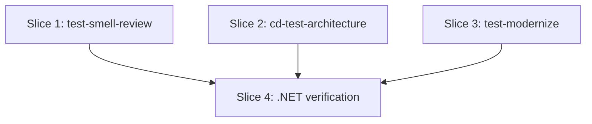

# Plan: Stack-aware reference loading in test-smell-review, cd-test-architecture, and test-modernize

**Created**: 2026-06-30
**Branch**: feat/524-stack-aware-skill-loading
**Status**: implemented
**Spec**: docs/specs/stack-aware-reference-loading.md
**Issue**: <https://github.com/bdfinst/agentic-dev-team/issues/524>

## Goal

Wire stack detection into three test-strategy skills/agents — `agents/test-smell-review.md`, `skills/cd-test-architecture/SKILL.md`, `skills/test-modernize/SKILL.md` — using the manifest-based detection pattern that `skills/test-design-advisor/SKILL.md:31, 62` already proves. Each skill/agent detects independently, looks up `knowledge/test-stack-profiles/<stack>.md`, and cites the profile (and its referenced files) by knowledge path in stack-specific output. Skill/agent prose stays language-agnostic — no language names appear in body text. `/test-modernize` adds a `--stack <id>` passthrough to `/cd-test-architecture` so the orchestrated flow does not double-scan; both skills work standalone when the flag is absent.

## Approach stance (high-reversal-cost axes)

- **Scope** — touch only the three named files plus three per-target bats test files and a small .NET fixture. The knowledge tree, `test-design-advisor`, and any new shared helper are explicitly out of scope (rejected in the approach contract).
- **Migrate vs. edit stub** — n/a; no deprecated stubs in this change.
- **Replace vs. merge** — edits append/extend within each file's existing structure; no section is wholesale replaced.
- **Auto-merge** — disabled (`/pr --no-auto-merge`). The repo rule in `CLAUDE.md` requires explicit human merge for any PR that touches agents, skills, or hooks.
- **Format fidelity** — n/a; no structured assets.

## Acceptance Criteria

The six manifest → stack mappings inherited from `test-design-advisor/SKILL.md:31` (the source of truth) are:

1. `package.json` → `node` (refined to `react` / `vue` via dependency)
2. `*.csproj` / `*.sln` → `dotnet`
3. `pom.xml` / `build.gradle*` → `spring-boot` (or fallback)
4. `go.mod` → `go`
5. `pyproject.toml` / `requirements.txt` → `django` (or fallback)
6. `templates/*.html` + htmx in `package.json` → `ssr-htmx`

The required fallback phrase (equivalent to `test-design-advisor/SKILL.md:62`): *"produce stack-agnostic guidance and name the missing profile in the report"* (or recognisably equivalent — see assertion grep below).

- [ ] A1: `test-smell-review` agent documents manifest-based stack detection and names `knowledge/test-stack-profiles/<stack>.md` as a load-on-match source. Required positive greps: `test-stack-profiles`; each of `package.json`, `\.csproj`, `pom.xml|build.gradle`, `go.mod`, `pyproject.toml|requirements.txt` (the six manifests above); `name the missing profile` (the fallback phrase); `test-design-advisor` (the pattern cross-reference). Required negative-grep: the four banned tokens `csharp|dotnet|HttpClient|HttpMessageHandler` MUST match zero times against the **body-only** view of the file (frontmatter and fenced code blocks stripped — implementation in Step 1.1 RED).
- [ ] A2: `cd-test-architecture` skill accepts optional `--stack <id>`, documents detection + the fallback phrase, and cites the loaded profile in the *Target architecture* table. Required positive greps mirror A1's manifest + fallback + cross-reference list, plus `--stack` appearing in the Parse Arguments block (positional check: same `--stack` token within 30 lines of the `Parse Arguments` heading). Same body-only negative-grep.
- [ ] A3: `test-modernize` skill detects once in Step 0, records the stack in `phase-0.md`, and forwards `--stack <id>` to `/cd-test-architecture` in Phase 1. Required positive greps: same six manifest tokens + fallback phrase + cross-reference; argument-hint contains `[--stack <id>]`; the literal token `--stack` appears **within 10 lines** of the literal token `Invoke /cd-test-architecture` (positional check enforces the passthrough lands in the Phase-1 invocation, not just anywhere in the file). Same body-only negative-grep.
- [ ] A4: For each of the three edited files, the bats positive-grep set in A1/A2/A3 is identical (modulo the file-specific positional checks). The PR description shows a three-column side-by-side excerpt of the detection note from each edited file plus `test-design-advisor/SKILL.md:31` so a human can confirm wording parity at a glance.
- [ ] A5: Manual verification on a .NET fixture. Definition of "outbound HTTP code path triggers the citation": the fixture contains at least one class whose **constructor accepts `HttpClient` as a parameter**. Given that property, the `/cd-test-architecture` report MUST cite both `knowledge/test-stack-profiles/dotnet.md` AND `knowledge/references/csharp-http-client-testing.md` (verification: grep the report excerpt embedded in the PR body for both literal paths; exit 0). The `/test-smell-review` finding on `SampleClientTests.cs` (which contains a `Mock<HttpClient>` smell) MUST cite `knowledge/references/csharp-http-client-testing.md` (same grep test). Step 4.2 also auto-asserts `docs/pr-bodies/524.md` exists and contains an `## Evidence` heading — see Step 4.2 RED.
- [ ] A6: `/agent-audit` passes; `scripts/ci-local.sh` passes; PR title prefix `feat:` for release-please; opened with `--no-auto-merge`.

## Slices

A slice is a vertically deliverable increment. Each slice carries the Gherkin scenario(s) that define its behavior, followed by the TDD steps that satisfy them. Steps are numbered `<slice>.<step>` (1.1, 1.2, 2.1, …).

For this plan, the "test" in RED→GREEN→REFACTOR is a **deterministic grep/structural assertion** captured in a **per-target bats test file** (one per slice — no shared file, so same-wave parallel slices have disjoint file sets). The Gherkin scenarios are implementation-independent behavior statements about the three edited files; each scenario maps to one bats assertion.

### Slice 1: Wire stack detection into `test-smell-review`

**Depends-on:** none
**Files:** `plugins/dev-team/agents/test-smell-review.md`, `tests/bats/stack-aware-test-smell-review.bats`

**Behavior:**

```gherkin
Feature: test-smell-review detects stack from manifests and cites the matching profile by knowledge path

  Scenario: Stack-aware section is present in the agent body
    Given the agent file "plugins/dev-team/agents/test-smell-review.md"
    When the file is read
    Then its Knowledge Files section names "knowledge/test-stack-profiles/<stack>.md" as a load-on-match source
    And its Detect section (or a sibling note) describes manifest-based detection in one sentence
    And it references "skills/test-design-advisor/SKILL.md" as the pattern source

  Scenario: Agent prose stays language-agnostic
    Given the agent file "plugins/dev-team/agents/test-smell-review.md"
    When the file body (excluding frontmatter and fenced code blocks) is scanned
    Then it contains no occurrences of "csharp", "dotnet", "HttpClient", or "HttpMessageHandler"

  Scenario: Manifest list mirrors test-design-advisor
    Given the agent file "plugins/dev-team/agents/test-smell-review.md"
    When the manifest list near the detection note is read
    Then it names "package.json", "*.csproj", "pom.xml/build.gradle", "go.mod", and "pyproject.toml/requirements.txt" (in any order)

  Scenario: Missing-profile fallback documented
    Given the agent file "plugins/dev-team/agents/test-smell-review.md"
    When the detection note is read
    Then it states that an unmatched stack produces stack-agnostic output and names the missing profile in the report
```

**Steps:**

#### Step 1.1: Add per-target bats file with the full assertion set for `test-smell-review`

**Complexity**: standard
**RED**: Create `tests/bats/stack-aware-test-smell-review.bats` with the following `@test` blocks. The "body-only view" used by the negative-grep is produced by a `body_only()` bash helper at the top of the file: `awk '/^---$/{f=!f; next} f{next} /^```/{c=!c; next} !c{print}'` over the file under test (strips YAML frontmatter delimited by `---` and triple-backtick fences). Each banned-token grep is then `body_only <file> | grep -Eci '<token>'` and is asserted to equal `0`. Assertions:

1. `grep -c 'test-stack-profiles' plugins/dev-team/agents/test-smell-review.md` ≥ 1
2. `grep -c 'test-design-advisor' plugins/dev-team/agents/test-smell-review.md` ≥ 1 (pattern cross-reference)
3. Each of the six manifest tokens appears at least once: `package.json`, `\.csproj`, `pom.xml|build.gradle`, `go.mod`, `pyproject.toml|requirements.txt`, and `package.json.*htmx|htmx.*package.json` (the ssr-htmx trigger). The htmx assertion may be a single grep for `htmx` since the only place htmx appears in the new prose is the SSR refinement note.
4. `grep -c 'name the missing profile' plugins/dev-team/agents/test-smell-review.md` ≥ 1
5. Body-only negative-grep: `body_only … | grep -Eci 'C#|\.NET|csharp|dotnet|HttpClient|HttpMessageHandler'` equals `0`.

Run `bats tests/bats/stack-aware-test-smell-review.bats`; all assertions fail (file has no detection note yet).
**GREEN**: Edit `plugins/dev-team/agents/test-smell-review.md` — add a new bullet under "Knowledge Files" naming `knowledge/test-stack-profiles/<stack>.md` (load-on-match), and add a one-line cross-reference note in the "Detect" section pointing at the manifest-based detection pattern `test-design-advisor/SKILL.md:31, 62` uses, with the six-manifest list and missing-profile fallback wording. No language-specific prose. Run `bats`; all assertions pass.
**REFACTOR**: Re-read the edited section; confirm wording is symmetric with `test-design-advisor`. None expected.
**Files**: `plugins/dev-team/agents/test-smell-review.md`, `tests/bats/stack-aware-test-smell-review.bats`
**Commit**: `feat(test-smell-review): detect stack from manifests, cite profile by knowledge path (#524)`

### Slice 2: Wire stack detection + `--stack` into `cd-test-architecture`

**Depends-on:** none
**Files:** `plugins/dev-team/skills/cd-test-architecture/SKILL.md`, `tests/bats/stack-aware-cd-test-architecture.bats`

**Behavior:**

```gherkin
Feature: cd-test-architecture accepts --stack, detects from manifests by default, and cites the matching profile in its output

  Scenario: --stack flag documented in Parse Arguments
    Given the skill file "plugins/dev-team/skills/cd-test-architecture/SKILL.md"
    When the Parse Arguments section is read
    Then it documents an optional "--stack <id>" flag with default "detect from manifests"

  Scenario: Detection step documented
    Given the skill file
    When the Steps section is read
    Then there is a "Detect stack" step (Step 0 or 1.5) describing manifest-based detection
    And it states that the matching "knowledge/test-stack-profiles/<stack>.md" is loaded
    And it includes the "name the missing profile" fallback equivalent to "test-design-advisor/SKILL.md:62"

  Scenario: Output table requires citation
    Given the skill file
    When the "Target architecture (per component)" output schema is read
    Then it states the loaded profile must be cited in the Double or Test type column when a profile matched

  Scenario: --stack override bypasses manifest detection
    Given the skill file
    When the "Detect stack" step is read
    Then it states that --stack takes precedence over manifest detection when present

  Scenario: Missing-profile fallback documented
    Given the skill file
    When the "Detect stack" step is read
    Then it states that an unmatched stack produces stack-agnostic output and names the missing profile in the report

  Scenario: Skill prose stays language-agnostic
    Given the skill file
    When the body (excluding frontmatter and fenced code blocks) is scanned
    Then it contains no occurrences of "csharp", "dotnet", "HttpClient", or "HttpMessageHandler"
```

**Steps:**

#### Step 2.1: Add per-target bats file with the full assertion set for `cd-test-architecture`

**Complexity**: standard
**RED**: Create `tests/bats/stack-aware-cd-test-architecture.bats` re-using the `body_only()` helper shape from Slice 1. Assertions:

1. The six manifest tokens + `test-stack-profiles` + `test-design-advisor` + `name the missing profile` each appear ≥ 1 (same positive set as Slice 1).
2. Positional: `--stack` appears within 30 lines of the heading `## Parse Arguments` (use `awk '/## Parse Arguments/,/^## /'` to slice the section then `grep`).
3. Override-takes-precedence phrase present: `grep -Ei 'takes precedence|overrides|skips detection' …` within the *Detect stack* step block.
4. Citation requirement: the *Target architecture (per component)* output schema sentence contains the literal `cite` (and the loaded profile path token `test-stack-profiles`). This is a prose-structure assertion; behavioral verification of the conditional is deferred to Slice 4's manual run — see plan note above.
5. Body-only negative-grep == 0 (same four tokens, same `body_only()` filter).

Run `bats`; all assertions fail.
**GREEN**: Edit `plugins/dev-team/skills/cd-test-architecture/SKILL.md` — (a) extend "Parse Arguments" with `--stack <id>` (default: detect from manifests); (b) add a "Step 0 — Detect stack" subsection before existing Step 1, mirroring `test-design-advisor/SKILL.md:31, 62` (six-manifest list + missing-profile fallback + the "`--stack` takes precedence over detection when present" override note); (c) extend the *Target architecture (per component)* schema sentence to require the loaded profile be cited in the column. Run `bats`; all assertions pass.
**REFACTOR**: Verify step numbering still flows (Step 0 is new; Step 1 onwards unchanged). None expected.
**Files**: `plugins/dev-team/skills/cd-test-architecture/SKILL.md`, `tests/bats/stack-aware-cd-test-architecture.bats`
**Commit**: `feat(cd-test-architecture): detect stack from manifests, accept --stack, cite profile in target architecture (#524)`

### Slice 3: Wire `--stack` passthrough into `test-modernize`

**Depends-on:** none
**Files:** `plugins/dev-team/skills/test-modernize/SKILL.md`, `tests/bats/stack-aware-test-modernize.bats`

Slice 3 is authored against the `--stack <id>` argument contract Slice 2's Gherkin defines, not against Slice 2's file content. The bats assertion greps `test-modernize/SKILL.md` for the literal token `--stack`, which has no runtime dependency on `cd-test-architecture/SKILL.md`. Parallelization Critic flagged this dependency as over-conservative; removing it widens Wave 1 to three slices. If Slice 2's `--stack` syntax changes during implementation, Slice 3 must reconcile before merge — this is captured in Risks & Open Questions.

**Behavior:**

```gherkin
Feature: test-modernize detects stack once in Step 0 and forwards --stack to /cd-test-architecture in Phase 1

  Scenario: Step 0 records stack detection
    Given the skill file "plugins/dev-team/skills/test-modernize/SKILL.md"
    When the "Approach contract" (Step 0) section is read
    Then it documents manifest-based stack detection
    And it states the detected stack is recorded in "memory/test-modernize/<slug>/phase-0.md"

  Scenario: Phase 1 forwards the detected stack to /cd-test-architecture
    Given the skill file
    When the Phase-1 invocation of "/cd-test-architecture" is read
    Then the argument list includes "--stack <stack>" alongside the existing --ci / --external-tests passthroughs
    And the "--stack" token appears within 10 lines of "Invoke /cd-test-architecture" (positional check)

  Scenario: argument-hint documents --stack
    Given the skill file
    When the frontmatter argument-hint is read
    Then it includes "[--stack <id>]" as an optional flag

  Scenario: Missing-profile fallback documented
    Given the skill file
    When the Step-0 detection substep is read
    Then it states that an unmatched stack falls through to stack-agnostic output
    And it names the missing profile in "memory/test-modernize/<slug>/phase-0.md"

  Scenario: Skill prose stays language-agnostic
    Given the skill file
    When the body (excluding frontmatter and fenced code blocks) is scanned
    Then it contains no occurrences of "csharp", "dotnet", "HttpClient", or "HttpMessageHandler"
```

**Steps:**

#### Step 3.1: Add per-target bats file with the full assertion set for `test-modernize`

**Complexity**: standard
**RED**: Create `tests/bats/stack-aware-test-modernize.bats` re-using the `body_only()` helper shape from Slice 1. Assertions:

1. Same six-manifest + `test-stack-profiles` + `test-design-advisor` + `name the missing profile` positive set as Slices 1 and 2.
2. argument-hint check: the frontmatter `argument-hint:` line (between the file's first two `---` markers) contains `[--stack <id>]`. Use `awk '/^---$/{f=!f; next} f' file | grep -E 'argument-hint:.*\[--stack'`.
3. **Positional** Phase-1 passthrough check: `awk` over the file to find the line containing `Invoke /cd-test-architecture`, take the 10 lines surrounding it, then `grep -c '--stack'` must be ≥ 1. This catches the case where `--stack` appears in the file but NOT in the Phase-1 invocation line (which was the warning from the acceptance review).
4. Body-only negative-grep == 0 (same four tokens).

Run `bats`; all assertions fail.
**GREEN**: Edit `plugins/dev-team/skills/test-modernize/SKILL.md` — (a) add a Step-0 substep "Detect stack" with the same six-manifest list + fallback wording; (b) update the existing Phase-1 step `Invoke /cd-test-architecture <repo-path> [--ci ...] [--external-tests ...]` line to include `[--stack <stack>]`; (c) update the frontmatter `argument-hint` to add `[--stack <id>]`. Run `bats`; all assertions pass.
**REFACTOR**: Confirm the existing "Approach contract" enumeration absorbs the new substep without re-numbering the others. None expected.
**Files**: `plugins/dev-team/skills/test-modernize/SKILL.md`, `tests/bats/stack-aware-test-modernize.bats`
**Commit**: `feat(test-modernize): detect stack once and forward --stack to /cd-test-architecture (#524)`

### Slice 4: Manual verification on a .NET fixture

**Depends-on:** 1, 2, 3
**Files:** `evals/fixtures/dotnet-http-smoke/Sample.csproj`, `evals/fixtures/dotnet-http-smoke/SampleClient.cs`, `evals/fixtures/dotnet-http-smoke/SampleClientTests.cs`, `docs/pr-bodies/524.md`, `tests/bats/stack-aware-dotnet-fixture.bats`

**Behavior:**

```gherkin
Feature: The wired skills produce stack-specific output when run against a .NET fixture

  Scenario: /cd-test-architecture cites the .NET profile and HTTP-client reference
    Given a minimal .NET fixture under "evals/fixtures/dotnet-http-smoke/" containing a .csproj plus a stub outbound HTTP client
    When the operator runs "/cd-test-architecture evals/fixtures/dotnet-http-smoke/"
    Then the produced report cites "knowledge/test-stack-profiles/dotnet.md"
    And it cites "knowledge/references/csharp-http-client-testing.md" for the outbound HTTP code path

  Scenario: /test-smell-review cites the HTTP-client reference on a deliberate smell
    Given the fixture contains a test that mocks HttpClient directly (a smell catalogued at csharp-http-client-testing.md:189)
    When the operator runs "/test-smell-review" on that test
    Then the finding cites "knowledge/references/csharp-http-client-testing.md" by path

  Scenario: PR carries both report excerpts as evidence
    Given the verification has been performed
    When the PR is opened
    Then its description embeds excerpts from both reports under an "Evidence" heading
```

**Steps:**

#### Step 4.1: Add the .NET smoke fixture

**Complexity**: standard
**RED**: Create `tests/bats/stack-aware-dotnet-fixture.bats` asserting that `evals/fixtures/dotnet-http-smoke/` contains a `*.csproj` and at least one `*Tests.cs` file with a `Mock<HttpClient>` line (the deliberate smell). Run `bats`; fails.
**GREEN**: Create `evals/fixtures/dotnet-http-smoke/Sample.csproj` (minimal SDK-style csproj, no dependencies that need restore), a `SampleClient.cs` stub class with a constructor taking `HttpClient`, and `SampleClientTests.cs` with a deliberate `var mock = new Mock<HttpClient>();` smell. Run `bats`; passes.
**REFACTOR**: Confirm the fixture is small enough that humans can read it in one screen. None expected.
**Files**: `evals/fixtures/dotnet-http-smoke/Sample.csproj`, `evals/fixtures/dotnet-http-smoke/SampleClient.cs`, `evals/fixtures/dotnet-http-smoke/SampleClientTests.cs`, `tests/bats/stack-aware-dotnet-fixture.bats`
**Commit**: `test(stack-aware): add .NET smoke fixture for manual verification (#524)`

#### Step 4.2: Capture verification evidence in the PR body draft

**Complexity**: standard
**RED**: Extend `tests/bats/stack-aware-dotnet-fixture.bats` with three new structural assertions: (a) `docs/pr-bodies/524.md` exists; (b) it contains an `## Evidence` heading (`grep -c '^## Evidence' docs/pr-bodies/524.md` ≥ 1); (c) the file contains both literal paths `knowledge/test-stack-profiles/dotnet.md` AND `knowledge/references/csharp-http-client-testing.md` (verifies the operator pasted the citation lines, not just an empty heading). Run `bats`; all three fail.
**GREEN**: Run `/cd-test-architecture evals/fixtures/dotnet-http-smoke/` and `/test-smell-review` against the fixture's test file. Create `docs/pr-bodies/524.md` with an `## Evidence` heading containing two fenced-block excerpts (one per skill invocation) — the excerpts must include the citation lines that name the two knowledge paths. Run `bats`; all three pass. The bats assertions guarantee the file is non-empty and contains the required citations; whether the LLM output was actually correct is the human-merge reviewer's call (deliberate trade-off — automated structural coverage with an explicit operator-judgment gate on content).
**REFACTOR**: None.
**Files**: `docs/pr-bodies/524.md`, `tests/bats/stack-aware-dotnet-fixture.bats`
**Commit**: `docs(stack-aware): capture .NET smoke verification evidence for #524`

## Parallelization

`plan-waves.sh` derives waves from the `Depends-on:` declarations above. The Mermaid DAG and wave table below are populated from its output:



| Wave | Slices (parallel) |
|------|-------------------|
| 1 | 1, 2, 3 |
| 2 | 4 |

Wave 1 slices touch disjoint files: Slice 1 → `agents/test-smell-review.md` + `tests/bats/stack-aware-test-smell-review.bats`; Slice 2 → `skills/cd-test-architecture/SKILL.md` + `tests/bats/stack-aware-cd-test-architecture.bats`; Slice 3 → `skills/test-modernize/SKILL.md` + `tests/bats/stack-aware-test-modernize.bats`. No same-wave collision.

## Complexity Classification

| Step | Rating | Why |
|------|--------|-----|
| 1.1 | standard | Markdown edit + bats assertion set (pattern from `test-design-advisor`) |
| 2.1 | standard | Same shape as 1.1; new step in skill + `--stack` flag |
| 3.1 | standard | Markdown edit + bats assertion set; positional Phase-1 invocation check |
| 4.1 | standard | New fixture files (csproj + C# stubs) |
| 4.2 | standard | Operator-run skills + structural bats assertions on PR-body draft |

No `complex` steps. The plan touches one high-reversal-cost axis (Scope — kept to the three target files plus per-target tests and a small fixture, additive only), documented in the Approach stance above.

## Pre-PR Quality Gate

- [ ] `bats tests/bats/stack-aware-*.bats` exits 0
- [ ] `bash scripts/ci-local.sh` exits 0 (runs shellcheck, the rest of bats, the agent-audit suite)
- [ ] `/code-review` passes on the diff
- [ ] `/agent-audit` reports no regressions on the three edited files
- [ ] Manual verification evidence (Slice 4) embedded in PR body
- [ ] PR title is `feat: wire stack-aware reference loading into test-smell-review, cd-test-architecture, and test-modernize (#524)`
- [ ] PR opened with `--no-auto-merge`

## Risks & Open Questions

- **Risk:** The negative-grep token list (`csharp|dotnet|HttpClient|HttpMessageHandler`) is hard-coded in three bats files; if the banned-token list expands in the future, three files must be kept in sync. **Mitigation:** the list lives in a single bash variable at the top of each bats file with a comment pointing at the others; the cost of duplication (three lines) is below the cost of a shared helper. If a fourth target skill ever adopts the pattern, extract `BANNED_TOKENS` and `body_only()` into `tests/bats/_helpers/stack-aware.bash` and source it.
- **Risk:** A future linter could scan plan/spec files for the same banned tokens and trip on this plan. **Mitigation:** the negative-grep targets only the three edited skill/agent files, not `tests/`, `docs/`, `evals/`, or `plans/`. The bats assertions hard-code the three file paths.
- **Risk:** Slice 3 is parallel with Slice 2 (Wave 1) under the argument-contract dependency the Parallelization Critic recommended. If Slice 2's `--stack` syntax changes during implementation, Slice 3's positional Phase-1 assertion may need reconciliation before the wave's bats suite is green together. **Mitigation:** the contract is one token (`--stack`) defined in this plan; any deviation is caught when both bats suites run as part of the pre-PR gate.
- **Open question:** None — all four high-reversal-cost axes were resolved in the approach contract before `/specs` ran.

## Build Progress

### Slices (grouped by wave)

#### Wave 1

- [x] Slice 1: Wire stack detection into `test-smell-review`
  - [x] Step 1.1: Add per-target bats file with the full assertion set for `test-smell-review`
- [x] Slice 2: Wire stack detection + `--stack` into `cd-test-architecture`
  - [x] Step 2.1: Add per-target bats file with the full assertion set for `cd-test-architecture`
- [x] Slice 3: Wire `--stack` passthrough into `test-modernize`
  - [x] Step 3.1: Add per-target bats file with the full assertion set for `test-modernize`

#### Wave 2

- [x] Slice 4: Manual verification on a .NET fixture
  - [x] Step 4.1: Add the .NET smoke fixture
  - [x] Step 4.2: Capture verification evidence in the PR body draft

### Acceptance Criteria

- [x] A1: test-smell-review wired (Knowledge Files + Detect cross-ref + negative-grep clean + fallback wording)
- [x] A2: cd-test-architecture wired (`--stack` flag + Step 0 detection + cite-in-output + negative-grep clean)
- [x] A3: test-modernize wired (Step-0 detect + Phase-1 `--stack` passthrough + argument-hint + negative-grep clean)
- [x] A4: Pattern parity with test-design-advisor (PR description side-by-side)
- [x] A5: Manual .NET verification (two report excerpts in PR body)
- [x] A6: CI/eval pass (agent-audit, ci-local, release-please-ready title, `--no-auto-merge`)

## Plan Review Summary

**Plan tier:** `complex` — reviewers: Acceptance, Design, Strategic, Parallelization (UX skipped — no UI surface). All four returned `approve` after one revision iteration.

**Iteration 1 changes (Acceptance Critic blockers, resolved):**

- A4 made binary-verifiable: enumerated the six manifest → stack mappings and the verbatim fallback phrase; bats greps anchor on `name the missing profile`.
- A5 trigger defined concretely: "fixture contains a class whose constructor accepts `HttpClient` as a parameter"; bats checks both literal knowledge paths land in the PR-body draft.
- Missing scenarios added: `--stack override bypasses manifest detection` (Slice 2) and `Missing-profile fallback documented` (Slices 2 and 3).
- Step 1.1 RED now defines the `body_only()` `awk` helper that strips frontmatter and fences before the negative-grep.
- Step 3.1 assertion is positional (10-line window around `Invoke /cd-test-architecture`), not whole-file.
- Step 4.2 RED upgraded to deterministic bats assertions (file exists, `## Evidence` heading, both citations present).

**Parallelization Critic warning (acted on):**

- Slice 3's `Depends-on: 2` dropped; it depends only on the argument-contract Slice 2 declares, not on the file content. Wave 1 widened from 2 to 3 slices.

**Strategic + Design + Acceptance observations (all `[observation]`, not actioned):**

- Manual A5 verification lives outside the automated gate by design (LLM-invocable skill ⇒ human-eyes content review).
- `docs/pr-bodies/524.md` is a one-off PR-body draft, not a recurring directory pattern; revisit if a second PR adopts it.
- The banned-token list is duplicated across three bats files with a documented mitigation; extract to `tests/bats/_helpers/stack-aware.bash` when a fourth target adopts the pattern (captured in Risks).
- The spec's "not duplicated" wording at line 39 is slightly out of sync with the "each agent detects independently" decision (spec line 125); cosmetic — no behavioral impact on this plan.
- Frontmatter `version:` field — confirmed at planning time: none of the three target files carry one today; no bump needed for this PR.
