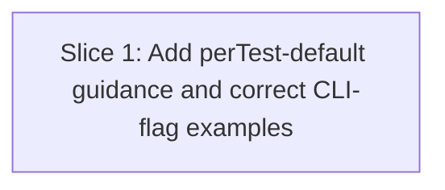

# Plan: Stryker.NET — default `coverage-analysis: perTest` for xunit.v2-shim projects (issue #669)

**Created**: 2026-07-02
**Branch**: `docs/issue-669-stryker-net-pertest-default` (to be created from `origin/main`; current session branch `mutation` mirrors `main` exactly — confirm branching at the human gate before `/build`)
**Status**: approved
**Spec**: [docs/specs/stryker-net-pertest-coverage-analysis-default.md](../docs/specs/stryker-net-pertest-coverage-analysis-default.md)

## Goal

Add guidance to the `csharp-stryker-net` skill reference recommending
`"coverage-analysis": "perTest"` as the default `stryker-config.json` setting for
xunit.v2 / xunit.v2-shim Stryker.NET projects, citing the #669 experiment that
validated it produces identical mutation-kill counts to a full-suite `"off"`
baseline (including through reflection and Autofac DI-resolution coverage paths)
at roughly 5-6x the speed. The xunit.v3/MTP-runner `"off"` mandate is untouched.
While in the file, correct the two existing CLI examples that show
`--coverage-analysis perTest` as a working command-line flag — the issue confirms
Stryker.NET 4.15.0 accepts this only via the `stryker-config.json` key. Documentation-only
diff; PR closes #669 and arms auto-merge at open time.

## Approach Stances (high-reversal-cost axes)

Per `knowledge/decision-defaults.md`, the task touches these axes:

- **Auto-merge vs direct**: **auto-merge armed at PR open** (`gh pr merge <num> --auto --rebase` — per this repo's rebase-only merge ruleset, not squash). Justification: diff is markdown-only in a single reference file; the repo `CLAUDE.md` documentation-only working rule applies verbatim.
- **Scope**: **narrow — one file, two additions** (new section + two CLI-example corrections). No adapter/runtime code touched (out of scope per spec — issue #669 confirms `--coverage-analysis` has no CLI flag in Stryker.NET 4.15.0 in general via `--help`, but the experiment did not specifically re-run the adapters' exact invocation shape — `--coverage-analysis perTest` combined with `--config-file`/`--mutate`/`--output`/`--since`. Treating the flag's presence there as harmless is an inference, not a re-verified fact; if a future run ever shows Stryker rejecting that combination, file a follow-up issue rather than assuming this plan already covers it).
- **Replace vs merge**: **merge in place** — insert a new subsection, edit two existing command blocks. Not a rewrite.
- **Format fidelity**: preserve the file's existing heading style, bash/JSON fence conventions, and cross-reference format (matches the precedent in `plans/stryker-net-workflow-corrections.md`, issue #522).

## Acceptance Criteria

Mirrors the spec's Acceptance Criteria, condensed for build tracking:

- [ ] New section recommends `"coverage-analysis": "perTest"` as default for xunit.v2 / xunit.v2-shim projects, citing issue #669's experiment result (identical Killed counts, ~5-6x speedup)
- [ ] New section explicitly states the recommendation does not apply to xunit.v3/MTP-runner projects, cross-referencing the existing "xunit.v3 detection" section's `"off"` mandate (no restatement)
- [ ] Both existing CLI examples showing `--coverage-analysis perTest` no longer present it as a working CLI flag; a note states Stryker.NET 4.15.0 accepts this only via the `stryker-config.json` key
- [ ] No code, agent, skill, or hook file is modified — only `csharp-stryker-net.md` plus this change's own spec/plan/check artifacts (`docs/specs/`, `plans/`)
- [ ] `/agent-audit` passes on the modified file
- [ ] PR body contains `Closes #669`; PR title is `docs(mutation-testing): default coverage-analysis to perTest for xunit.v2-shim Stryker.NET projects`
- [ ] `gh pr merge <num> --auto --rebase` armed at PR open

## Slices

### Slice 1: Add perTest-default guidance and correct the CLI-flag examples

**Depends-on:** none
**Files:** `plugins/dev-team/skills/mutation-testing/references/languages/csharp-stryker-net.md`

**Behavior:**

```gherkin
Feature: Stryker.NET reference recommends perTest for xunit.v2-shim projects and stops misdescribing coverage-analysis as a CLI flag

  Scenario: A developer on an xunit.v2 / xunit.v2-shim project is pointed to perTest
    Given a Stryker.NET project that is not on xunit.v3 / the MTP runner
    When a developer reads the C# / Stryker.NET reference for coverage-analysis guidance
    Then the reference recommends setting `"coverage-analysis": "perTest"` in stryker-config.json as the default
    And it cites issue #669's experiment result — identical Killed counts across both validation rounds and ~5-6x wall-clock speedup
    And it names the two risks the experiment checked (reflection via MethodInfo.Invoke; Autofac container.Resolve<T>) and states both checked out clean

  Scenario: The perTest recommendation does not apply to xunit.v3 / MTP-runner projects
    Given a developer reads the new perTest-default section
    When they check whether it applies to their project
    Then the section states explicitly that xunit.v3 / MTP-runner projects are excluded
    And it cross-references the existing "xunit.v3 detection" section's `"coverage-analysis": "off"` mandate rather than restating it

  Scenario: The CLI examples no longer imply --coverage-analysis is a working flag
    Given a developer reads the "Single file in --scope" and "Full scan — no shard configs" run examples
    When they look for how to set coverage-analysis
    Then neither fenced command block contains `--coverage-analysis perTest` as a CLI argument
    And a note states Stryker.NET 4.15.0 accepts `coverage-analysis` only via the `stryker-config.json` key, not as a CLI flag

  Scenario: No code, agent, skill, or hook file changes
    Given the PR diff for this change
    When a reviewer inspects the changed files
    Then `csharp-stryker-net.md` is the only file under `plugins/dev-team/` that is modified
    And any other changed files are limited to this change's own `docs/specs/` and `plans/` artifacts

  Scenario: PR opens with auto-merge armed and passing structural gates
    Given Steps 1.1 and 1.2 are complete and /agent-audit is green on the modified file
    When the branch is pushed and a PR is opened
    Then the PR title is exactly the conventional-commit string specified in this plan
    And the PR body contains `Closes #669`
    And `gh pr merge <num> --auto --rebase` has been run, and `gh pr view <num> --json autoMergeRequest` shows a non-null `autoMergeRequest`
```

**Steps:**

#### Step 1.1: Add the "Default coverage-analysis: perTest" section

**Complexity**: standard
**RED**: Structural check (grep-based; see Verification below) fails until the file contains all of:

  1. `"coverage-analysis": "perTest"` inside a subsection distinct from the xunit.v3 mandate.
  2. A linked issue citation matching the file's existing convention (lines 70/89, e.g. `[#554](...)`/`[#557](...)`): `[#669](https://github.com/bdfinst/agentic-dev-team/issues/669)` — bare `#669` text does not satisfy this.
  3. The phrase `xunit.v2` (or `xunit.v2-shim`).
  4. At least one of the five class names from the experiment (`DataFormatter`, `SystemConstants`, `RequestContext`, `PublicApiAttribute`, `ComponentModule`) **and** a phrase asserting parity (`identical` or `same Killed count`) tied to the #669 citation — not just the bare keywords.
  5. A mention of both `MethodInfo.Invoke` and `Autofac`/`container.Resolve`, **and** a phrase confirming both risk checks passed (e.g. `checked out clean`, `no false negatives`) — not just the bare terms.
  6. A `5-6x` (or `5–6x`) speedup figure.
  7. An explicit statement that the recommendation excludes xunit.v3 / MTP-runner projects.
  8. Positional ordering: the byte offset of `## xunit.v3 detection` < the offset of the new `##` heading < the offset of `## Pre-run: build first` (confirms placement, not just presence).
  9. The new section's text contains a cross-reference to the xunit.v3 section — either the literal heading string `xunit.v3 detection` (case-insensitive) or a markdown link/anchor to it — so the exclusion in item 7 points back to that section rather than merely asserting exclusion in the abstract.
**GREEN**: Insert a new "## Default `coverage-analysis: perTest` for xunit.v2 / non-MTP projects" section immediately after "## xunit.v3 detection (do this before configuring runs)" and before "## Pre-run: build first". Content: the recommendation, the linked `[#669](...)` citation naming the specific classes and the "identical Killed counts" result, both risk checks and their "checked out clean" outcome, the speedup figures, and a one-line exclusion cross-referencing the xunit.v3 section by heading name (no restatement of its steps).
**REFACTOR**: Confirm the new section does not duplicate the xunit.v3 mandate's four numbered steps — it should read as a sibling branch, not an extension.
**Files**: `plugins/dev-team/skills/mutation-testing/references/languages/csharp-stryker-net.md`
**Commit**: `docs(mutation-testing): recommend coverage-analysis perTest default for xunit.v2-shim Stryker.NET projects`

#### Step 1.2: Correct the two CLI examples that misdescribe `--coverage-analysis` as a flag

**Complexity**: trivial
**RED**: Extend the structural check to require zero occurrences of `--coverage-analysis` inside any fenced ```bash block in the file, and at least one prose note (outside a command block) stating the setting is config-file-only in Stryker.NET 4.15.0.
**GREEN**: Remove `--coverage-analysis perTest \` from the "Single file in `--scope`" command block and `--coverage-analysis perTest` from the "Full scan — no shard configs" command block. Add a short note near the first occurrence (or inline in the new Step 1.1 section) stating the CLI form is a no-op in Stryker.NET 4.15.0 and the setting belongs in `stryker-config.json`, linking back to the new perTest-default section.
**REFACTOR**: None expected.
**Files**: `plugins/dev-team/skills/mutation-testing/references/languages/csharp-stryker-net.md`
**Commit**: `docs(mutation-testing): stop showing coverage-analysis as a Stryker.NET CLI flag`

#### Step 1.3: Run /agent-audit and open the PR with auto-merge armed

**Complexity**: standard
**RED**: `/agent-audit` on the modified file must be green. `gh pr view` must show `Closes #669` and the conventional-commit title. `git diff --name-only origin/main...HEAD` must output only `csharp-stryker-net.md` plus paths under `docs/specs/` and/or `plans/` — no `plugins/dev-team/{agents,skills,hooks}` path other than the target reference file, and nothing under `plugins/dev-team/hooks/mutation_adapters/` (confirms no code/agent/skill/hook file outside the target doc was touched; matches the #522 precedent's convention of shipping spec+plan alongside the doc fix). `gh pr view <num> --json autoMergeRequest` must return a non-null `autoMergeRequest` (confirms auto-merge was actually armed, not just attempted).
**GREEN**: Run `/agent-audit`. Push branch, open PR with title `docs(mutation-testing): default coverage-analysis to perTest for xunit.v2-shim Stryker.NET projects` and body containing `Closes #669`. Arm auto-merge: `gh pr merge <num> --auto --rebase`.
**REFACTOR**: None.
**Files**: none (CI + PR)
**Commit**: n/a (PR-level action)

### Verification harness for this slice

No runtime code path exists to exercise — this is a documentation change. "RED" means a structural check on the reference file (grep-based), run before and after each step. The assertions in each step's RED, plus the top-level Acceptance Criteria, are the check; no bats/pytest suite needs updating (matches the precedent in `plans/stryker-net-workflow-corrections.md`, issue #522).

## Parallelization

Single slice, single wave. Nothing to parallelize.



| Wave | Slices (parallel) |
|------|-------------------|
| 1 | 1 |

Parallelization Critic skipped — single-slice plan.

## Complexity Classification

Per-step ratings above. Plan tier: **standard** (single slice, one file, but touches an auto-merge stance and a scope stance explicitly — classifying up from `trivial` on the tie-break, consistent with the #522 precedent).

## Pre-PR Quality Gate

- [ ] All tests pass (repo test suite unaffected; no test files touched)
- [ ] Lint passes (`ci-local.sh` markdown lint on the changed file)
- [ ] `/agent-audit` passes
- [ ] Structural check (grep assertions from Slice 1 steps) exits 0
- [ ] Documentation updated — the change *is* the documentation

## Skipped (low value)

None. Both findings (perTest-default guidance, CLI-flag correction) deliver observable-through-grep signal and are required by the spec's acceptance criteria.

## Risks & Open Questions

- **Working branch.** Current session branch `mutation` has zero divergence from `main` (0 ahead / 0 behind, only 1 commit behind `origin/main`). Before `/build`, cut a fresh branch from `origin/main` — do not commit this doc change directly to `mutation`. **Confirm branching at the human gate.**
- **Merge strategy note.** This repo's ruleset requires rebase-merge (squash/merge-commit are blocked by signed-commit + no-force-push rules) — the #522 precedent plan used `--squash`, which would fail here; this plan uses `--rebase` per the top-level `CLAUDE.md`.
- **Section placement.** Placing the new section directly after "xunit.v3 detection" assumes a reader scans coverage-analysis guidance top-down from that point. Low risk — matches the spec's architecture note.
- **File-size trend.** `csharp-stryker-net.md` is already 368 lines — 4-5x longer than its sibling per-language references (`javascript-stryker.md` 71, `java-pitest.md` 77, `python-mutmut.md` 66, `go-go-mutesting.md` 95 lines) and already carries a dozen-plus distinct responsibilities. This plan adds one more top-level section; post-change size stays well under the repo's 500-line file-length ceiling, so not a blocker, but treat this file as approaching a natural split point — a future issue splitting it (e.g. a dedicated coverage-analysis or troubleshooting sub-doc) should be filed once it nears ~450 lines rather than continuing to concatenate indefinitely.
- **Adapter invocation shape unverified.** The "harmless no-op" scope-exclusion for `stryker_net.py`'s existing `--coverage-analysis perTest` CLI arg (the sole Stryker.NET adapter — the legacy bash `stryker-net.sh` no longer exists post-ADR-0015) rests on #669's general `--help`-confirmed finding, not on re-running the adapter's exact invocation combination (`--coverage-analysis perTest` alongside `--config-file`/`--mutate`/`--output`/`--since`). Treat as a documented assumption, not a re-verified fact — file a follow-up issue if this combination is ever observed to behave differently.

## Build Progress

### Slices (grouped by wave)

#### Wave 1

- [ ] Slice 1: Add perTest-default guidance and correct the CLI-flag examples
  - [x] Step 1.1: Add the "Default coverage-analysis: perTest" section
  - [ ] Step 1.2: Correct the two CLI examples that misdescribe `--coverage-analysis` as a flag
  - [ ] Step 1.3: Run /agent-audit and open the PR with auto-merge armed

### Acceptance Criteria

- [ ] New section recommends `"coverage-analysis": "perTest"` as default for xunit.v2 / xunit.v2-shim projects, citing issue #669's experiment result (identical Killed counts, ~5-6x speedup)
- [ ] New section explicitly states the recommendation does not apply to xunit.v3/MTP-runner projects, cross-referencing the existing "xunit.v3 detection" section's `"off"` mandate (no restatement)
- [ ] Both existing CLI examples showing `--coverage-analysis perTest` no longer present it as a working CLI flag; a note states Stryker.NET 4.15.0 accepts this only via the `stryker-config.json` key
- [ ] No code, agent, skill, or hook file is modified — only `csharp-stryker-net.md` plus this change's own spec/plan/check artifacts (`docs/specs/`, `plans/`)
- [ ] `/agent-audit` passes on the modified file
- [ ] PR body contains `Closes #669`; PR title is `docs(mutation-testing): default coverage-analysis to perTest for xunit.v2-shim Stryker.NET projects`
- [ ] `gh pr merge <num> --auto --rebase` armed at PR open

## Plan Review Summary

Plan tier: **standard** — reviewers: Acceptance Test Critic, Design & Architecture Critic (UX skipped — no user-facing surface; Parallelization Critic skipped — single-slice plan).

Iterations: 1. Acceptance Test Critic returned `needs-revision` (2 blockers); Design & Architecture Critic returned `needs-revision` (3 warnings, no blockers). Resolved in this revision:

1. **Evidentiary specificity gap** (Acceptance Critic, blocker) — Step 1.1's original RED only greped for keyword neighbors (`#669`, `xunit.v2`, `MethodInfo.Invoke`/`Autofac`, `5-6x`) without requiring the doc actually state the parity result or the risk-check outcome, so a GREEN could satisfy every RED assertion while contradicting the acceptance criterion. Resolution: RED now requires a named class from the experiment plus a parity phrase (`identical`/`same Killed count`), and a "checked out clean"/"no false negatives" phrase tied to the reflection/Autofac mention.
2. **Missing scope check** (Acceptance Critic, blocker) — no step verified AC4 ("no file other than `csharp-stryker-net.md` is modified") despite its own Gherkin scenario. Resolution: Step 1.3's RED now includes `git diff --name-only origin/main...HEAD` asserting a single-file diff.
3. **Auto-merge-armed not confirmed** (Acceptance Critic, step issue) — Step 1.3 RED asserted the PR's title/body but never confirmed the GREEN's auto-merge action took effect. Resolution: added a `gh pr view --json autoMergeRequest` non-null check, and a matching Gherkin scenario ("PR opens with auto-merge armed and passing structural gates") covering AC5-7, which previously had no scenario coverage.
4. **Section-placement not mechanically checked** (Acceptance Critic, step issue) — the spec's explicit ordering constraint (new section between "xunit.v3 detection" and "Pre-run: build first") was only enforced by the subjective REFACTOR note. Resolution: RED now includes a byte-offset ordering check.
5. **Issue-citation convention** (Design Critic, warning) — the file's existing convention links issue references (`[#554](...)`, `[#557](...)`); the original RED accepted bare `#669` text, which could silently break that convention. Resolution: RED now requires the linked form.
6. **"Harmless no-op" claim overgeneralized** (Design Critic, warning) — the out-of-scope justification for not touching the adapters generalized #669's general `--help` finding to the adapters' exact invocation combination, which the experiment didn't specifically re-test. Resolution: softened the Approach Stances scope bullet and added a Risks entry framing this as a documented assumption, not a re-verified fact.
7. **File-size trend unacknowledged** (Design Critic, warning) — the target file is already the largest and most multi-responsibility doc in its sibling family; adding another section without comment risked normalizing unbounded growth. Resolution: added a Risks entry naming the trend and a future split threshold (~450 lines), without blocking this change (post-change size stays under the repo's 500-line ceiling).

Design Critic's positive observations (no revision needed): section placement and heading-inline-code style match the file's existing conventions; Step 1.2's CLI-vs-config-key correction mirrors the file's own established `-O` vs `--report-file-name` pattern; the plan correctly diverges from the #522 precedent's now-invalid `--squash` merge command in favor of `--rebase`; the spec's `build_knowledge_index.py` rebuild-not-needed claim was independently re-verified against the indexer source.
