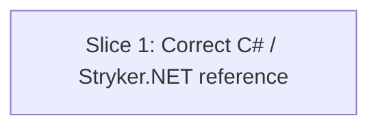

# Plan: Stryker.NET Workflow Corrections (issue #522)

**Created**: 2026-07-01
**Branch**: `fix/issue-522-stryker-net-workflow-corrections` (to be created from `main`; current session is on an unrelated branch — the human gate should confirm branching before `/build`)
**Status**: in-progress
**Spec**: [docs/specs/stryker-net-workflow-corrections.md](../docs/specs/stryker-net-workflow-corrections.md)

## Goal

Correct the seven concrete errors in `plugins/dev-team/skills/mutation-testing/references/languages/csharp-stryker-net.md` catalogued in issue #522 (xunit.v3 silent perTest fallback, missing `DOTNET_ROOT` on Homebrew installs, `--report-file-name` mislabeled as a CLI flag, `-V trace` on the probe, non-existent `--dry-run`, unknown-config-key hard failure, stale-binary phantom timeouts). A developer following the corrected reference reaches a working Stryker.NET run without hitting any of these traps. Documentation-only diff; PR closes #522 and arms auto-merge at open time.

## Approach Stances (high-reversal-cost axes)

Per `knowledge/decision-defaults.md`, the task touches these axes:

- **Auto-merge vs direct**: **auto-merge armed at PR open** (`gh pr merge <num> --auto --squash`). Justification: diff is markdown-only in a single reference file — the repo CLAUDE.md's documentation-only working rule applies verbatim. Required checks still gate the merge.
- **Scope**: **narrow — one file, seven corrections**. No adapter/runtime change (deferred as a separate issue per Ambiguity Log in the spec). No sibling language KBs touched.
- **Replace vs merge**: **merge in place** (edit the existing file, preserve shard-aware section). Not a rewrite.
- **Format fidelity**: preserve the existing document's heading style, bash fence conventions, and cross-reference format.

## Acceptance Criteria

Mirrors the spec's Acceptance Criteria, condensed for build tracking:

- [x] xunit.v3 detection block added: `grep -rl "xunit.v3" tests/`, `"coverage-analysis": "off"`, `xunit.runner.json` with `"testTimeout": 5000`, `<CopyToOutputDirectory>PreserveNewest</CopyToOutputDirectory>`, `additional-timeout: 30000`, and the "fake 100% score" failure-mode note
- [x] `DOTNET_ROOT` export prefaces every Stryker run command; `dotnet --info | grep "Base Path"` confirmation shown
- [x] Probe command drops `-V trace`; `grep -E "Killed:|Survived:|Timeout:|mutation score"` summary extractor shown; at most one labeled "debug-only" mention of `-V trace` outside any run block
- [x] Named runs use `-O StrykerOutput/<name>`; every remaining occurrence of `report-file-name` is inside a "config file key" explanation, never in a command block
- [x] `grep -c -- "--dry-run"` on the file returns `0`
- [x] Unknown-config-key warning present (rejection since v1.x, `"_note"`/`"//"` comment workarounds hard-fail)
- [x] Each run/timing block either (a) contains `dotnet build <solution> -c Debug --nologo` before its `time dotnet test` / `dotnet stryker` line, or (b) is immediately preceded by a prose bullet naming the required build step
- [x] Existing shard-aware content preserved (`stryker-pipeline.py`, `stryker-setup.py`, "Finding the relevant shard config" bash helper); shard run commands updated with the `DOTNET_ROOT` + `-O` patterns
- [ ] `/agent-audit` passes on the modified file
- [ ] PR body contains `Closes #522`; PR title is `docs(mutation-testing): correct Stryker.NET reference for xunit.v3, DOTNET_ROOT, CLI flags, verbosity`
- [ ] `gh pr merge <num> --auto --squash` armed at PR open

## Slices

### Slice 1: Correct the C# / Stryker.NET language reference

**Depends-on:** none
**Files:** `plugins/dev-team/skills/mutation-testing/references/languages/csharp-stryker-net.md`

**Behavior:**

```gherkin
Feature: Stryker.NET reference gives correct, runnable instructions

  Scenario: xunit.v3 test project is detected and steered to coverage-analysis off
    Given a test project whose .csproj references xunit.v3
    When a developer follows the C# / Stryker.NET reference
    Then the reference tells them to run `grep -rl "xunit.v3" tests/ --include="*.csproj"`
    And instructs them to set `"coverage-analysis": "off"` in stryker-config.json
    And instructs them to create xunit.runner.json with `"testTimeout": 5000`
    And instructs them to add `<CopyToOutputDirectory>PreserveNewest</CopyToOutputDirectory>` to the test csproj
    And instructs them to set `additional-timeout: 30000`
    And explains the "all timeouts / fake 100% score" failure mode `perTest` would otherwise cause

  Scenario: A Homebrew-installed .NET runtime is discoverable via DOTNET_ROOT
    Given the developer installed .NET via Homebrew on macOS
    When they read any run command in the reference
    Then the command is preceded by `export DOTNET_ROOT="${DOTNET_ROOT:-/opt/homebrew/opt/dotnet/libexec}"`
    And the reference shows `dotnet --info | grep "Base Path"` as the confirmation step

  Scenario: The probe command uses default verbosity
    Given the developer wants to probe Stryker.NET against a single file
    When they read the probe command
    Then the probe command does NOT contain `-V trace`
    And a `grep -E "Killed:|Survived:|Timeout:|mutation score"` summary extractor is shown for any verbosity
    And if `-V trace` is mentioned at all, it is a single labeled "debug-only" note outside any command block

  Scenario: The output directory is set via -O, not via --report-file-name
    Given the developer wants to name a Stryker output directory
    When they read a named-run command
    Then the command uses `-O StrykerOutput/<name>`
    And `--report-file-name` does not appear as a CLI flag in any command block
    And a note explains `report-file-name` is a config-file key that renames HTML/JSON files within the output directory

  Scenario: No --dry-run references remain
    Given a developer greps the reference for `--dry-run`
    When the grep runs
    Then it returns zero matches

  Scenario: Unknown config keys are called out as a hard failure
    Given the developer is authoring `stryker-config.json`
    When they read the config authoring guidance
    Then the reference warns that Stryker.NET has rejected unknown keys since v1.x
    And explicitly names `"_note"` and `"//"` comment workarounds as hard-fail patterns
    And directs the developer to git commit messages or a nearby README for config intent

  Scenario: A dotnet build precedes any timing or Stryker invocation
    Given the developer wants to time the baseline test suite or run Stryker
    When they follow the reference
    Then each `time dotnet test` / `dotnet stryker` block either
      (a) contains `dotnet build <solution> -c Debug --nologo` before the test/stryker line, or
      (b) is immediately preceded by a prose bullet naming the required build step
    And subsequent `dotnet test` calls include `--no-build` so they reuse the freshly-built binaries

  Scenario: Shard-aware execution content is preserved
    Given the developer is working on a large C# repo with shard configs
    When they consult the reference
    Then `stryker-pipeline.py`, `stryker-setup.py`, and the "Finding the relevant shard config for a given file" bash helper are still present
    And the shard-run commands include the same `DOTNET_ROOT` export and `-O` output-directory pattern as the non-shard commands
```

**Steps:**

#### Step 1.1: Add xunit.v3 detection subsection

**Complexity**: standard
**RED**: Add a check (bats or grep-based; see Verification below) that fails until the reference contains: `grep -rl "xunit.v3"`, `"coverage-analysis": "off"`, `xunit.runner.json`, `"testTimeout": 5000`, `PreserveNewest`, `additional-timeout: 30000`, and the "fake 100% score" phrase.
**GREEN**: Insert an "xunit.v3 detection" subsection before the "Run (scoped)" heading with the detection command, the four required config additions, and the failure-mode explanation from issue #522, item 1.
**REFACTOR**: Ensure the new subsection cross-references the existing timeout guidance in `SKILL.md` Step 1b (the `additional-timeout` here is a *layered* cap on top of the per-mutant `timeout`).
**Files**: `plugins/dev-team/skills/mutation-testing/references/languages/csharp-stryker-net.md`
**Commit**: `docs(mutation-testing): detect xunit.v3 and pin coverage-analysis off in Stryker.NET reference`

#### Step 1.2: Add DOTNET_ROOT export and Base Path confirmation to every run command

**Complexity**: standard
**RED**: Extend the verification check so it fails unless every `dotnet stryker` command block in the file is preceded (in-block) by `export DOTNET_ROOT="${DOTNET_ROOT:-/opt/homebrew/opt/dotnet/libexec}"`, and the file contains one `dotnet --info | grep "Base Path"` example.
**GREEN**: Edit each run command block (scoped run, shard sequential run, whole-repo fallback, and any probe examples introduced later) to prepend `export DOTNET_ROOT="${DOTNET_ROOT:-/opt/homebrew/opt/dotnet/libexec}"`. Keep the existing `dotnet stryker` invocation form — do NOT introduce a `$STRYKER` alias (bare `dotnet stryker` resolves via PATH once `DOTNET_ROOT` is exported, and matches sibling KBs' style). Add a one-line "Confirm the local path" example using `dotnet --info | grep "Base Path"`.
**REFACTOR**: If any two adjacent run blocks now share identical export preambles, extract them to a shared "Environment" preamble near the top of the file and reference it from the run blocks.
**Files**: `plugins/dev-team/skills/mutation-testing/references/languages/csharp-stryker-net.md`
**Commit**: `docs(mutation-testing): require DOTNET_ROOT export for Homebrew .NET installs in Stryker.NET runs`

#### Step 1.3: Correct -O vs --report-file-name and clarify the config key

**Complexity**: standard
**RED**: Extend the verification check to require: (a) every named run command uses `-O StrykerOutput/<name>` (regex captures at least one `-O StrykerOutput/`); (b) `--report-file-name` never appears in a fenced ```bash block outside a comment; (c) prose explains `report-file-name` is a config-file key that renames HTML/JSON files within the output directory.
**GREEN**: Replace any `--report-file-name "..."` CLI usage in command blocks with `-O StrykerOutput/<name>`. Add a short note above/below the run examples explaining the config-file-key distinction.
**REFACTOR**: Consolidate any duplicated command examples that only differ in output name into a single example plus a "for a named run, use `-O StrykerOutput/<name>`" line.
**Files**: `plugins/dev-team/skills/mutation-testing/references/languages/csharp-stryker-net.md`
**Commit**: `docs(mutation-testing): use -O for output directory; document --report-file-name as config-file key only`

#### Step 1.4: Drop -V trace from the probe and add the summary extractor

**Complexity**: standard
**RED**: Extend the verification check to require: (a) any `dotnet stryker -m "**/ProbeFile.cs"` example does NOT contain `-V trace`; (b) the file contains `grep -E "Killed:|Survived:|Timeout:|mutation score"`; (c) any remaining `-V trace` mention is inside a paragraph or comment (not a fenced command block), and there is at most one such mention.
**GREEN**: Update the probe example to drop `-V trace`. Add the `grep -E "..."` summary extractor as a companion snippet. Add a single-sentence "Use `-V trace` only when actively debugging a Stryker startup problem" note *outside* the run block.
**REFACTOR**: None expected.
**Files**: `plugins/dev-team/skills/mutation-testing/references/languages/csharp-stryker-net.md`
**Commit**: `docs(mutation-testing): drop -V trace from Stryker.NET probe; add default-verbosity summary extractor`

#### Step 1.5: Remove --dry-run references

**Complexity**: trivial
**RED**: Extend the verification check to require `grep -c -- "--dry-run"` on the file to return `0`.
**GREEN**: Remove any `--dry-run` occurrences. (Spot check: current file appears clean, but the check enforces the invariant.)
**REFACTOR**: None.
**Files**: `plugins/dev-team/skills/mutation-testing/references/languages/csharp-stryker-net.md`
**Commit**: `docs(mutation-testing): remove non-existent --dry-run references from Stryker.NET reference`

#### Step 1.6: Add unknown-config-key warning

**Complexity**: standard
**RED**: Extend the verification check to require the file mentions "unknown key" (or "unknown keys"), calls out the `"_note"` and `"//"` comment patterns as hard-failures, and points readers at git commit messages or a README for config intent.
**GREEN**: Add a short "Config authoring notes" paragraph in the config-file section (near the timeout config or above the run commands) capturing the Stryker.NET-since-v1.x behavior and the workaround guidance.
**REFACTOR**: None.
**Files**: `plugins/dev-team/skills/mutation-testing/references/languages/csharp-stryker-net.md`
**Commit**: `docs(mutation-testing): warn that Stryker.NET rejects unknown config keys and inline comments`

#### Step 1.7: Precede every timing/run block with dotnet build

**Complexity**: standard
**RED**: Extend the verification check to require: for every fenced ```bash block that contains `time dotnet test` or `dotnet stryker`, either the same block or the immediately preceding prose paragraph contains `dotnet build` with `-c Debug --nologo`, and any subsequent `dotnet test` in the same block includes the `--no-build` flag.
**GREEN**: Add `dotnet build <solution> -c Debug --nologo` before each `time dotnet test` example and any Stryker run that reads test binaries. Where inserting into an existing block would balloon it, use a "Pre-run" prose bullet above the block instead.
**REFACTOR**: Check the shard-aware section for the same treatment; add the pre-build step to the shard examples too (per the "shard-aware content is preserved AND corrected" scenario).
**Files**: `plugins/dev-team/skills/mutation-testing/references/languages/csharp-stryker-net.md`
**Commit**: `docs(mutation-testing): require dotnet build before Stryker.NET timing and runs`

#### Step 1.8: Run /agent-audit and open the PR with auto-merge armed

**Complexity**: standard
**RED**: `/agent-audit` on the modified file must be green. `gh pr view` must show `Closes #522` and the conventional-commit title.
**GREEN**: Run `/agent-audit`. Push branch, open PR with title `docs(mutation-testing): correct Stryker.NET reference for xunit.v3, DOTNET_ROOT, CLI flags, verbosity` and body containing `Closes #522`. Arm auto-merge: `gh pr merge <num> --auto --squash`.
**REFACTOR**: None.
**Files**: none (CI + PR)
**Commit**: n/a (PR-level action)

### Verification harness for this slice

Because there is no runtime code path to exercise, "RED" here means a **structural check on the reference file** that a developer can run before and after the edit — `grep` and simple bash. The seven grep-shaped assertions in the criteria list above are the check. Bundle them as a one-off script (kept in the branch under `plans/checks/stryker-net-ref-check.sh`, or inlined into the commit body) so each step's RED can fail concretely. This is a documentation change — no bats/pytest suite needs updating.

## Parallelization

Single slice, single wave. Nothing to parallelize.



| Wave | Slices (parallel) |
|------|-------------------|
| 1 | 1 |

Parallelization Critic skipped — single-slice plan.

## Complexity Classification

Per-step ratings above. Plan tier: **standard** (single slice, one file, but touches an auto-merge stance and requires seven independent structural edits — classifying up from `trivial` on the tie-break).

## Pre-PR Quality Gate

- [ ] All tests pass (repo test suite unaffected; no test files touched)
- [ ] Lint passes (`ci-local.sh` markdown lint on the changed file)
- [ ] `/agent-audit` passes
- [ ] Structural check script (seven grep assertions from Slice 1) exits 0
- [ ] Documentation updated — the change *is* the documentation

## Skipped (low value)

None. Every item in issue #522 delivers observable-through-grep signal.

## Risks & Open Questions

- **Working branch.** The current session is on `fix/issue-532-demote-test-design-advisor`. Before `/build`, cut a fresh branch from `origin/main` — the repo working rule bars committing to `main` and mixing #532 and #522 in one branch would produce a poisoned PR. **Confirm branching at the human gate.**
- **`--report-file-name` current state.** The existing file may not currently contain the mislabeled flag; the issue lists it as a correction to guidance the user has seen elsewhere. Steps 1.3 and 1.5 remain — they add the clarification and enforce the invariant even when the file was already clean, and they're cheap.
- **Config-authoring section placement (Step 1.6).** The current file has no dedicated config-authoring section; placing the unknown-key warning near the existing timeout config keeps related config guidance together. Not a hard decision.

## Build Progress

### Slices (grouped by wave)

#### Wave 1

- [ ] Slice 1: Correct the C# / Stryker.NET language reference
  - [x] Step 1.1: Add xunit.v3 detection subsection
  - [x] Step 1.2: Add DOTNET_ROOT export and Base Path confirmation to every run command
  - [x] Step 1.3: Correct -O vs --report-file-name and clarify the config key
  - [x] Step 1.4: Drop -V trace from the probe and add the summary extractor
  - [x] Step 1.5: Remove --dry-run references
  - [x] Step 1.6: Add unknown-config-key warning
  - [x] Step 1.7: Precede every timing/run block with dotnet build
  - [ ] Step 1.8: Run /agent-audit and open the PR with auto-merge armed

### Acceptance Criteria

- [x] xunit.v3 detection block added: `grep -rl "xunit.v3" tests/`, `"coverage-analysis": "off"`, `xunit.runner.json` with `"testTimeout": 5000`, `<CopyToOutputDirectory>PreserveNewest</CopyToOutputDirectory>`, `additional-timeout: 30000`, and the "fake 100% score" failure-mode note
- [x] `DOTNET_ROOT` export prefaces every Stryker run command; `dotnet --info | grep "Base Path"` confirmation shown
- [x] Probe command drops `-V trace`; `grep -E "Killed:|Survived:|Timeout:|mutation score"` summary extractor shown; at most one labeled "debug-only" mention of `-V trace` outside any run block
- [x] Named runs use `-O StrykerOutput/<name>`; every remaining occurrence of `report-file-name` is inside a "config file key" explanation, never in a command block
- [x] `grep -c -- "--dry-run"` on the file returns `0`
- [x] Unknown-config-key warning present (rejection since v1.x, `"_note"`/`"//"` comment workarounds hard-fail)
- [x] Each run/timing block either (a) contains `dotnet build <solution> -c Debug --nologo` before its `time dotnet test` / `dotnet stryker` line, or (b) is immediately preceded by a prose bullet naming the required build step
- [x] Existing shard-aware content preserved (`stryker-pipeline.py`, `stryker-setup.py`, "Finding the relevant shard config" bash helper); shard run commands updated with the `DOTNET_ROOT` + `-O` patterns
- [ ] `/agent-audit` passes on the modified file
- [ ] PR body contains `Closes #522`; PR title is `docs(mutation-testing): correct Stryker.NET reference for xunit.v3, DOTNET_ROOT, CLI flags, verbosity`
- [ ] `gh pr merge <num> --auto --squash` armed at PR open

## Plan Review Summary

Plan tier: **standard** — reviewers: Acceptance Test Critic, Design & Architecture Critic (UX skipped — no user-facing surface; Parallelization Critic skipped — single-slice plan).

Iterations: 1. Both reviewers returned no blockers; two warnings surfaced by both, resolved in this revision:

1. **`dotnet build` precedes-run criterion** (Acceptance Critic, warning) — original Gherkin and top-level AC captured only the in-block form, but Step 1.7 GREEN sanctioned an "adjacent prose bullet" alternative. Resolution: both the top-level Acceptance Criteria bullet, the mirrored Build Progress AC list, and the Gherkin scenario now state the two accepted forms (in-block or adjacent-prose bullet) explicitly; Step 1.7 RED wording is aligned.
2. **`$STRYKER` alias untraceable** (Acceptance Critic + Design Critic, warning) — Step 1.2 GREEN originally introduced a `STRYKER="${HOME}/.dotnet/tools/dotnet-stryker"` alias with no matching AC or Gherkin, and Step 1.7 RED then assumed it. Design Critic noted the alias has no precedent in this file or sibling KBs (`javascript-stryker.md`, `java-pitest.md`) and is unnecessary once `DOTNET_ROOT` is exported. Resolution: **alias removed** — Step 1.2 GREEN now keeps the existing bare `dotnet stryker` invocation form; Step 1.7 RED's `(via $STRYKER)` parenthetical is dropped.

Additional observations (informational, no revision required):

- Design Critic: placement in the language KB (not `SKILL.md`) is correct per `SKILL.md`'s own routing rule; auto-merge stance and `docs:` PR title (no release-please version bump) are correctly derived from repo CLAUDE.md and match the shipped-code-vs-docs distinction.
- Design Critic: shard-aware content preservation is treated as a first-class REFACTOR concern in Step 1.7 — avoids the parallel-path drift risk.
- Acceptance Critic: grep-shaped RED checks are a fitting TDD adaptation for a documentation-only diff; the "verification harness" is one evolving bash snippet across steps rather than a persisted test file, which is appropriate scope.
