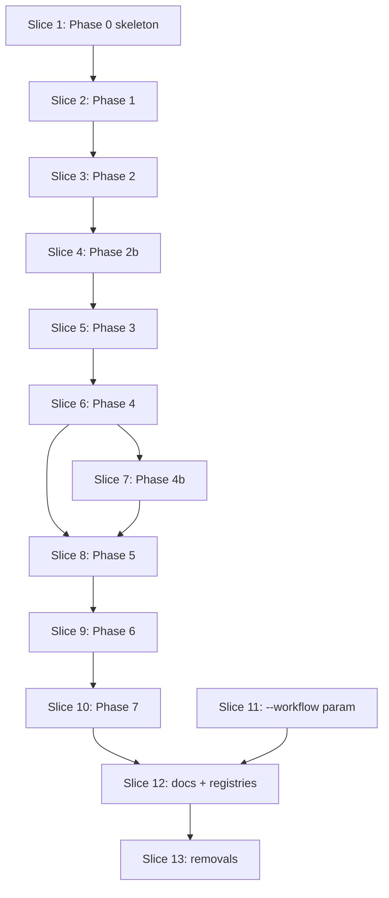

# Plan: /test-improve orchestrator (consolidation of /test-modernize + /test-upgrade)

**Created**: 2026-07-01
**Branch**: issue-536
**Status**: in-progress
**Spec**: [`docs/specs/test-improve-orchestrator.md`](../docs/specs/test-improve-orchestrator.md)
**Issue**: [#536](https://github.com/bdfinst/agentic-dev-team/issues/536)

## Goal

Replace `/test-modernize` and `/test-upgrade` with a single `/test-improve` orchestrator that defaults to lightweight ceremony, prompts for heavier capabilities on demand, and always baselines coverage (and mutation, when enabled) before any test changes. Land the full orchestrator first with the two old skills untouched, then remove them (and the `test-modernization-review` gate script) in the final slice. Two worker skills (`issues-from-assessment`, `quality-targets-converge`) gain a `--workflow` parameter matching the pattern `coverage-baseline` / `coverage-delta` already use. Redraw the operator-facing flow diagram.

## Approach stance (decision-defaults axes)

- **Replace vs merge** (registries + docs): **merge** — update rows in place rather than regenerating; preserve unrelated entries.
- **Scope**: touch only the paths named in the spec's Architecture section; no drive-by refactors of untouched worker skills.
- **Migrate vs edit-stub**: **remove without stub** — `/test-modernize` and `/test-upgrade` are deleted in the final slice; no forwarding aliases (issue #536 explicitly confirmed by human at spec time).
- **Auto-merge vs direct-to-trunk**: PR with auto-merge armed on green checks; final human gate is the PR.
- **Format fidelity**: SVG diagram redrawn as SVG (native lossless); no down-conversion to PNG.

## Acceptance Criteria

Mirrors the 53 ACs in `docs/specs/test-improve-orchestrator.md`. Grouped here for cross-reference; full text lives in the spec.

- [ ] AC1–4: `/test-improve` skill exists; old skills + gate agent + script removed on `main` post-merge; `/agent-audit` passes.
- [ ] AC5–8: Phase 0 approach contract (prompt battery, Go advisory, persistence, `--from-phase` / `--analyze-only`).
- [ ] AC9–11: Phase 1 (`/test-health` once; mutation section respects Phase 0; human gate).
- [ ] AC12–14: Phase 2 baseline (coverage before any test edit; mutation before any test edit when enabled; both with `--workflow test-improve`).
- [ ] AC15–18: Phase 2b Gherkin (skipped on `none`; xUnit annotations on `xunit-with-annotations`; parser wiring on `bdd-runner`; human gate).
- [ ] AC19–21: Phase 3 triage (`--workflow test-improve`; three-way gap partition; human gate).
- [ ] AC22–28: Phase 4 improve-without-refactoring + end-of-phase review loop.
- [ ] AC29–30: Phase 4b `[y/b/q]` refactor decision prompt.
- [ ] AC31–35: Phase 5 refactor-for-testability (conditional; seam-only; precondition-check; review loop).
- [ ] AC36–39: Phase 6 validate (`/quality-targets-converge --workflow test-improve`; mutation-off skip vs waive; Go advisory; coverage-<90% re-run prompt).
- [ ] AC40 + AC40.1–40.6: Phase 7 report ships from the executive-summary template with 10 numbered sections; sections never disappear; parent-issue/FEATURE.md link update; regeneratable-from-memory contract.
- [ ] AC41–44: Worker-skill parameterization (`--workflow` on issues-from-assessment + quality-targets-converge; mutation-testing workflow-callers allowlist updated; coverage-baseline + coverage-delta recognize new workflow name).
- [ ] AC45–49: Docs + diagrams + registries.
- [ ] AC50–53: `/agent-audit` + `/agent-eval` + bats gate.

## Slices

Sliced phase-by-phase per operator opt-in. `/test-improve` is authored fully first (Slices 1–10) with the two old skills untouched; Slice 11 parameterizes the two workers; Slice 12 updates docs and the diagram; Slice 13 removes the two old skills, the gate agent, and the gate script. Trunk stays releasable at every slice — `/test-modernize` and `/test-upgrade` continue to work until Slice 13.

`Depends-on:` is the authoritative concurrency signal. Waves are derived by `scripts/plan-waves.sh`.

---

### Slice 1: Orchestrator skeleton + Phase 0 approach contract

**Depends-on:** none
**Files:** `plugins/dev-team/skills/test-improve/SKILL.md`, `tests/skills/test_improve_phase_0_tests.bats`

**Behavior:**

```gherkin
Feature: /test-improve Phase 0 approach contract

  Scenario: fresh run prompts for the batched approach-contract inputs
    Given the /test-improve skill exists at plugins/dev-team/skills/test-improve/SKILL.md
    And no memory/test-improve/<slug>/phase-0.md exists for the target repo
    When /test-improve <repo-path> is invoked
    Then the operator is prompted in one batch for: mutation-on/off, BDD rubric answers, refactor mode (default no-refactor), quality targets, and sink (--parent vs local)
    And the Go advisory (go-mutesting alpha; survivor count not a gate; go test -fuzz recommended) is shown before the mutation prompt when Go is detected in the manifests

  Scenario: resolved inputs are persisted before Phase 1 runs
    Given the operator has answered the approach-contract prompts
    When Phase 0 completes
    Then memory/test-improve/<slug>/phase-0.md exists with the resolved inputs
    And phase-0.md exists before Phase 1 (`/test-health`) is invoked

  Scenario: --from-phase skips completed phases
    Given memory/test-improve/<slug>/phase-0.md and phase-1.md exist
    When /test-improve <repo-path> --from-phase 2 is invoked
    Then Phase 0 and Phase 1 are not re-executed
    And Phase 2 (baseline) is the first phase to run

  Scenario: --analyze-only exits after Phase 1
    Given Phase 0 has completed
    When /test-improve <repo-path> --analyze-only is invoked
    Then Phase 1 (`/test-health`) runs
    And no baseline is captured
    And the run exits with a summary of the improvement plan
```

**Steps:**

#### Step 1.1: Author test-improve/SKILL.md skeleton with Phase 0

**Complexity**: complex
**RED**: Add `tests/skills/test_improve_phase_0_tests.bats` asserting: SKILL.md exists at the expected path; frontmatter has `role: orchestrator`, `user-invocable: true`, `argument-hint` documents `<repo-path> [--parent <url>] [--analyze-only] [--from-phase <n>] [--stack <id>]`; Steps section contains a `### Phase 0` header; Phase 0 prompt battery names all five knobs (mutation, BDD rubric, refactor mode, quality targets, sink); Go advisory text is present; `memory/test-improve/<slug>/phase-0.md` is named as the persistence target; `--from-phase` and `--analyze-only` semantics are described. bats fails (file does not exist).
**GREEN**: Create `plugins/dev-team/skills/test-improve/SKILL.md` with frontmatter, Overview, Orchestrator constraints, Parse Arguments, and a Steps section containing only Phase 0. bats passes.
**REFACTOR**: Trim any duplicated language across constraints / Phase 0 body — bias to Phase 0 owning the details.
**Files**: `plugins/dev-team/skills/test-improve/SKILL.md`, `tests/skills/test_improve_phase_0_tests.bats`
**Commit**: `feat(test-improve): scaffold /test-improve with Phase 0 approach contract (#536)`

---

### Slice 2: Phase 1 — Analyze via /test-health

**Depends-on:** 1
**Files:** `plugins/dev-team/skills/test-improve/SKILL.md`, `tests/skills/test_improve_phase_1_tests.bats`

**Behavior:**

```gherkin
Feature: /test-improve Phase 1 delegates analysis to /test-health

  Scenario: Phase 1 invokes /test-health once
    Given Phase 0 has produced memory/test-improve/<slug>/phase-0.md
    When Phase 1 runs
    Then /test-health is invoked exactly once with the resolved repo path
    And /cd-test-architecture, /test-design, and /mutation-testing are NOT invoked separately by /test-improve

  Scenario: Phase 1 respects mutation-off from Phase 0
    Given phase-0.md recorded mutation-off
    When Phase 1 runs
    Then the rolled-up report's mutation section is either omitted or marked "not enabled for this run"

  Scenario: Phase 1 human gate blocks Phase 2 until approval
    Given Phase 1 has completed
    When the operator has not yet approved the ordered improvement plan
    Then Phase 2 does not run
```

**Steps:**

#### Step 2.1: Add Phase 1 delegation to /test-health

**Complexity**: standard
**RED**: Extend `test_improve_phase_1_tests.bats` (new file) asserting: SKILL.md contains a `### Phase 1` section; the section names `/test-health` as the sole worker; explicit non-invocation statements for `/cd-test-architecture`, `/test-design`, and `/mutation-testing`; the phase's human-gate sentence names "the ordered improvement plan"; mutation-off branch is documented.
**GREEN**: Add the Phase 1 section to SKILL.md.
**REFACTOR**: None needed — Phase 1 is delegation-only.
**Files**: `plugins/dev-team/skills/test-improve/SKILL.md`, `tests/skills/test_improve_phase_1_tests.bats`
**Commit**: `feat(test-improve): add Phase 1 analyze via /test-health (#536)`

---

### Slice 3: Phase 2 — Baseline (coverage + mutation before any test change)

**Depends-on:** 2
**Files:** `plugins/dev-team/skills/test-improve/SKILL.md`, `tests/skills/test_improve_phase_2_tests.bats`

**Behavior:**

```gherkin
Feature: /test-improve Phase 2 baselines coverage and mutation before changing tests

  Scenario: coverage baseline lands before any test file is modified
    Given Phase 1 has been approved
    When Phase 2 runs
    Then /coverage-baseline is invoked with --workflow test-improve
    And memory/test-improve/<slug>/baseline-coverage.json exists
    And no file under the stack's test directory has been modified between Phase 0 and this file's creation

  Scenario: mutation baseline lands before any test file is modified (mutation-on)
    Given phase-0.md recorded mutation-on
    When Phase 2 runs
    Then /mutation-testing --baseline --workflow test-improve is invoked
    And memory/test-improve/<slug>/baseline-mutation.json exists
    And the file records the honest score (hard kills / effective total; timeouts separate)

  Scenario: mutation baseline is skipped when mutation is off
    Given phase-0.md recorded mutation-off
    When Phase 2 runs
    Then /mutation-testing is NOT invoked
    And no baseline-mutation.json is written

  Scenario: Go stack records advisory baseline
    Given phase-0.md recorded mutation-on and the target is a Go module
    When Phase 2 runs
    Then baseline-mutation.json is written with the advisory-only marker
```

**Steps:**

#### Step 3.1: Add Phase 2 baseline orchestration

**Complexity**: standard
**RED**: Add `tests/skills/test_improve_phase_2_tests.bats` asserting SKILL.md's Phase 2 section names both `/coverage-baseline --workflow test-improve` and `/mutation-testing --baseline --workflow test-improve`; explicitly states the ordering constraint ("before any file under tests/ is modified"); documents the mutation-off skip path; documents the Go advisory marker.
**GREEN**: Add Phase 2 section to SKILL.md.
**REFACTOR**: None.
**Files**: `plugins/dev-team/skills/test-improve/SKILL.md`, `tests/skills/test_improve_phase_2_tests.bats`
**Commit**: `feat(test-improve): add Phase 2 coverage + mutation baseline (#536)`

---

### Slice 4: Phase 2b — Derive Gherkin (conditional)

**Depends-on:** 3
**Files:** `plugins/dev-team/skills/test-improve/SKILL.md`, `tests/skills/test_improve_phase_2b_tests.bats`

**Behavior:**

```gherkin
Feature: /test-improve Phase 2b derives Gherkin only when the rubric asked for it

  Scenario: binding mode "none" skips Phase 2b entirely
    Given phase-0.md recorded binding mode "none"
    When Phase 2b would run
    Then /gherkin-derive is NOT invoked
    And no .feature files are written

  Scenario: binding mode "xunit-with-annotations" writes .feature files without a runner
    Given phase-0.md recorded binding mode "xunit-with-annotations"
    When Phase 2b runs
    Then /gherkin-derive is invoked with --workflow test-improve --mode xunit-with-annotations
    And .feature files are written under features/test-improve/
    And no runner dependency is added to the project

  Scenario: binding mode "bdd-runner" wires the native parser
    Given phase-0.md recorded binding mode "bdd-runner"
    And the stack profile names cucumber-js as the native parser
    When Phase 2b runs
    Then /gherkin-derive is invoked with --workflow test-improve --mode bdd-runner
    And cucumber-js is added as a project dependency
    And pending step-definition stubs are generated
    And memory/test-improve/<slug>/gherkin.md records the surface inventory and parser wiring

  Scenario: human gate blocks Phase 3 until .feature files are reviewed
    Given Phase 2b produced .feature files (or parser wiring in bdd-runner mode)
    When the operator has not approved them
    Then Phase 3 does not run
```

**Steps:**

#### Step 4.1: Add Phase 2b conditional Gherkin derivation

**Complexity**: standard
**RED**: Add `tests/skills/test_improve_phase_2b_tests.bats` asserting SKILL.md's Phase 2b section names `/gherkin-derive --workflow test-improve`, documents the three binding modes with their differing outputs (none / xunit / bdd-runner), specifies the parser-wiring detail per stack, names the human gate.
**GREEN**: Add Phase 2b section.
**REFACTOR**: None.
**Files**: `plugins/dev-team/skills/test-improve/SKILL.md`, `tests/skills/test_improve_phase_2b_tests.bats`
**Commit**: `feat(test-improve): add Phase 2b conditional Gherkin derivation (#536)`

---

### Slice 5: Phase 3 — Triage via /issues-from-assessment

**Depends-on:** 4
**Files:** `plugins/dev-team/skills/test-improve/SKILL.md`, `tests/skills/test_improve_phase_3_tests.bats`

**Behavior:**

```gherkin
Feature: /test-improve Phase 3 partitions findings by gap class

  Scenario: NO_REFACTOR findings become Phase-4 Stories
    Given Phase 1 produced a health report with mixed gap classes
    When Phase 3 runs
    Then /issues-from-assessment is invoked with --workflow test-improve
    And each NO_REFACTOR finding is written as a Phase-4 Story to ./plans/test-improve/ (or the configured tracker)

  Scenario: REFACTOR_REQUIRED findings are deferred to Phase 5
    When Phase 3 runs
    Then REFACTOR_REQUIRED findings are surfaced with rationale
    And they are NOT written as Phase-4 Stories
    And the operator sees the deferred list

  Scenario: LOW_VALUE findings are advisory-only
    When Phase 3 runs
    Then LOW_VALUE findings are enumerated in the report
    And no PR is opened to delete any test flagged as LOW_VALUE

  Scenario: human gate blocks Phase 4 until Story set approved
    Given Phase 3 produced Phase-4 Stories
    When the operator has not approved the set
    Then Phase 4 does not run
```

**Steps:**

#### Step 5.1: Add Phase 3 triage orchestration

**Complexity**: standard
**RED**: Add `tests/skills/test_improve_phase_3_tests.bats` asserting SKILL.md's Phase 3 section names `/issues-from-assessment --workflow test-improve`, documents the three-way gap partition with the exact labels `NO_REFACTOR` / `REFACTOR_REQUIRED` / `LOW_VALUE`, names the advisory-only handling of `LOW_VALUE`, names the human gate.
**GREEN**: Add Phase 3 section.
**REFACTOR**: None.
**Files**: `plugins/dev-team/skills/test-improve/SKILL.md`, `tests/skills/test_improve_phase_3_tests.bats`
**Commit**: `feat(test-improve): add Phase 3 triage via /issues-from-assessment (#536)`

---

### Slice 6: Phase 4 — Improve without refactoring + end-of-phase review loop

**Depends-on:** 5
**Files:** `plugins/dev-team/skills/test-improve/SKILL.md`, `tests/skills/test_improve_phase_4_tests.bats`

**Behavior:**

```gherkin
Feature: /test-improve Phase 4 improves tests without touching production code

  Scenario: /build refuses production-code changes in Phase 4
    Given phase-0.md recorded refactor mode no-refactor (default)
    And a Phase-4 Story would require a production-code change
    When /build is invoked for that Story
    Then /build rejects the change
    And the Story is surfaced as a REFACTOR_REQUIRED deferral candidate

  Scenario: binding mode is applied per Phase 0 choice
    Given phase-0.md recorded binding mode "xunit-with-annotations"
    When Phase 4 builds a Story
    Then the resulting test names mirror the source scenario name
    And Given/When/Then lines appear as leading comments citing the source .feature file

  Scenario: per-Story coverage delta is measured
    When /build completes a Phase-4 Story
    Then /coverage-delta --workflow test-improve --story <id> is invoked
    And the delta is recorded to coverage-history.json

  Scenario: mutation-kill agent runs per Story when mutation is on
    Given phase-0.md recorded mutation-on
    When /build completes a Phase-4 Story
    Then the mutation-kill agent is invoked with --file <story-file> --max-rounds 3
    And residual survivors trigger the [c]ontinue / [r]etry / [w]aive / [q]uit prompt

  Scenario: mutation-kill is advisory on Go
    Given the target is a Go module and mutation is on
    When mutation-kill runs
    Then survivors are logged but no commit is made
    And the operator is instructed to apply changes manually

  Scenario: end-of-phase review loop runs after all Stories close
    Given all Phase-4 Stories have closed
    When the end-of-phase review loop starts
    Then /test-design --since <base-sha> and /code-review --since <base-sha> dispatch in parallel
    And /apply-fixes corrections/ runs, then /code-review re-runs
    And after at most 2 iterations, the [r] revise / [w] waive / [q] quit prompt fires if code-review is still failing

  Scenario: phase-4-review.json records evidence with the fixed schema
    When the review loop closes
    Then memory/test-improve/<slug>/phase-4-review.json exists
    And its fields include base_sha, head_sha, farley_score, smells, code_review, iterations, escalated

  Scenario: waivers land with tags
    Given the operator picks [w] at iteration 2
    When the escalation completes
    Then memory/test-improve/<slug>/waivers.json contains an entry tagged with the finding list
```

**Steps:**

#### Step 6.1: Add Phase 4 build + mutation-kill loop

**Complexity**: complex
**RED**: Add `tests/skills/test_improve_phase_4_tests.bats` asserting Phase 4 names `/build`, `/coverage-delta --workflow test-improve --story <id>`, the `mutation-kill` **agent** invocation (with `--file <story-file> --max-rounds 3` and the `[c/r/w/q]` prompt), and the binding-mode application. Explicit assertion that `/build`'s no-refactor mode is inherited from Phase 0.
**GREEN**: Add Phase 4 body (steps 1–3 of the phase per spec) to SKILL.md.
**REFACTOR**: None.
**Files**: `plugins/dev-team/skills/test-improve/SKILL.md`, `tests/skills/test_improve_phase_4_tests.bats`
**Commit**: `feat(test-improve): add Phase 4 build + mutation-kill loop (#536)`

#### Step 6.2: Add Phase 4 end-of-phase review loop

**Complexity**: complex
**RED**: Extend `test_improve_phase_4_tests.bats` asserting: `/test-design --since` and `/code-review --since` dispatched in parallel; `/apply-fixes corrections/` re-run loop with `max 2 iterations`; `[r/w/q]` escalation prompt; `waivers.json` tagged; `phase-4-review.json` schema (`base_sha`, `head_sha`, `farley_score`, `smells`, `code_review`, `iterations`, `escalated`) all named in SKILL.md prose.
**GREEN**: Add the end-of-phase review loop section (adopted from `/test-modernize` § 3a but re-anchored on `memory/test-improve/`).
**REFACTOR**: Extract the "review loop schema" details to an anchor so Phase 5 can reference it without duplication.
**Files**: `plugins/dev-team/skills/test-improve/SKILL.md`, `tests/skills/test_improve_phase_4_tests.bats`
**Commit**: `feat(test-improve): add Phase 4 end-of-phase review loop (#536)`

---

### Slice 7: Phase 4b — refactor decision prompt

**Depends-on:** 6
**Files:** `plugins/dev-team/skills/test-improve/SKILL.md`, `tests/skills/test_improve_phase_4b_tests.bats`

**Behavior:**

```gherkin
Feature: /test-improve Phase 4b asks whether to run the refactor phase

  Scenario: refactor list surfaced with rationale
    Given Phase 4 has closed
    And Phase 3 deferred N REFACTOR_REQUIRED findings
    When Phase 4b runs
    Then each item is shown with columns: seam-needed, behavior-gained, estimated-risk

  Scenario: [y] advances to Phase 5
    When the operator picks [y]
    Then Phase 5 runs

  Scenario: [b] backlogs and skips to Phase 6
    When the operator picks [b]
    Then memory/test-improve/<slug>/refactor-backlog.md is written (or the parent issue is updated)
    And Phase 5 is not run
    And Phase 6 runs

  Scenario: [q] quits before Phase 6
    When the operator picks [q]
    Then no further phase runs
    And the report reflects Phase-4 state only
```

**Steps:**

#### Step 7.1: Add Phase 4b prompt

**Complexity**: standard
**RED**: Add `tests/skills/test_improve_phase_4b_tests.bats` asserting SKILL.md's Phase 4b section names the three-column list (seam / behavior / risk), the exact `[y] / [b] / [q]` prompt options (chosen over `[r]` deliberately — the letter `r` is already claimed by mutation-kill's `[c/r/w/q]` (retry) and the review-loop's `[r/w/q]` (revise); `[y]` is the natural affirmative for the highest-consequence prompt in the flow), and the destinations (`memory/test-improve/<slug>/refactor-backlog.md` for `[b]`).
**GREEN**: Add Phase 4b section.
**REFACTOR**: None.
**Files**: `plugins/dev-team/skills/test-improve/SKILL.md`, `tests/skills/test_improve_phase_4b_tests.bats`
**Commit**: `feat(test-improve): add Phase 4b refactor decision prompt (#536)`

---

### Slice 8: Phase 5 — Refactor-for-testability (conditional)

**Depends-on:** 6, 7
**Files:** `plugins/dev-team/skills/test-improve/SKILL.md`, `tests/skills/test_improve_phase_5_tests.bats`

**Behavior:**

```gherkin
Feature: /test-improve Phase 5 refactors production code only when the operator opted in

  Scenario: Phase 5 is absent when [b] or [q] was chosen
    Given the operator picked [b] at Phase 4b
    When the run continues
    Then Phase 5 does not run

  Scenario: production-code changes limited to seam introduction
    Given Phase 5 is running
    When /build proposes a production-code change that is not a seam introduction
    Then /build rejects the change

  Scenario: existing tests may not be modified or removed
    Given Phase 5 is running
    When /build proposes deleting or editing an existing test file
    Then /build rejects the change
    And the pre-build suite remains green

  Scenario: precondition-check on Phase-4 baseline Story
    Given a Phase-5 Story has a matching Phase-4 baseline Story
    When Phase 5 starts that Story
    Then /test-improve verifies the Phase-4 Story is closed and green before running /build

  Scenario: end-of-phase review loop and evidence file
    When Phase 5 closes
    Then the end-of-phase review loop runs (same schema as Phase 4)
    And memory/test-improve/<slug>/phase-5-review.json exists
```

**Steps:**

#### Step 8.1: Add Phase 5 orchestration

**Complexity**: complex
**RED**: Add `tests/skills/test_improve_phase_5_tests.bats` asserting SKILL.md's Phase 5 section is conditional on `[y]` from Phase 4b; documents the seam-only constraint; documents the "existing tests may not be modified or removed" rule; documents the Phase-4 precondition-check; references the Phase 4 review-loop schema (does not duplicate it); names `phase-5-review.json`.
**GREEN**: Add Phase 5 section referencing the review-loop anchor from Slice 6 refactor.
**REFACTOR**: None.
**Files**: `plugins/dev-team/skills/test-improve/SKILL.md`, `tests/skills/test_improve_phase_5_tests.bats`
**Commit**: `feat(test-improve): add Phase 5 refactor-for-testability (#536)`

---

### Slice 9: Phase 6 — Validate via /quality-targets-converge

**Depends-on:** 8
**Files:** `plugins/dev-team/skills/test-improve/SKILL.md`, `tests/skills/test_improve_phase_6_tests.bats`

**Behavior:**

```gherkin
Feature: /test-improve Phase 6 converges quality targets

  Scenario: /quality-targets-converge is invoked with --workflow test-improve
    Given Phase 4 (and optionally Phase 5) has closed
    When Phase 6 runs
    Then /quality-targets-converge --workflow test-improve is invoked

  Scenario: mutation target is skipped when Phase 0 disabled mutation
    Given phase-0.md recorded mutation-off
    When Phase 6 runs
    Then the mutation target is skipped (marked "not enabled"), NOT waived

  Scenario: mutation target is advisory on Go
    Given the target is a Go module and mutation is on
    When Phase 6 runs
    Then the mutation target is advisory only

  Scenario: coverage-<90% in no-refactor mode surfaces re-run prompt
    Given Phase 6 closes with coverage < 90% and refactor mode was no-refactor
    Then /test-improve surfaces the "re-run in refactor-allowed mode" prompt
    And the prompt names the backlogged REFACTOR_REQUIRED items that would close the gap
```

**Steps:**

#### Step 9.1: Add Phase 6 validation

**Complexity**: standard
**RED**: Add `tests/skills/test_improve_phase_6_tests.bats` asserting Phase 6 names `/quality-targets-converge --workflow test-improve`, the mutation-off skip (not waive) contract, Go advisory, and the coverage-<90% re-run prompt.
**GREEN**: Add Phase 6 section.
**REFACTOR**: None.
**Files**: `plugins/dev-team/skills/test-improve/SKILL.md`, `tests/skills/test_improve_phase_6_tests.bats`
**Commit**: `feat(test-improve): add Phase 6 validate via /quality-targets-converge (#536)`

---

### Slice 10: Phase 7 — Final report

**Depends-on:** 9
**Files:** `plugins/dev-team/skills/test-improve/SKILL.md`, `tests/skills/test_improve_phase_7_tests.bats`

**Behavior:**

```gherkin
Feature: /test-improve Phase 7 produces the executive-summary report

  Scenario: report is generated from the shipped template
    When Phase 7 runs
    Then the template at plugins/dev-team/skills/test-improve/templates/executive-summary.md is copied to reports/test-improve/<repo-slug>-<date>.md
    And every placeholder is interpolated from persisted memory files under memory/test-improve/<slug>/

  Scenario: report includes baseline → achieved deltas
    When Phase 7 runs
    Then § 1 "Bottom line" carries the baseline → achieved → Δ metric table
    And when mutation was enabled, the mutation row carries the honest score (hard kills) with the timeouts count separate
    And when mutation was disabled, the mutation row reads "_Not applicable — mutation disabled at Phase 0._"
    And when the stack is Go, the mutation row carries the "advisory only — go-mutesting is alpha" footnote

  Scenario: sections with no data render "Not applicable" rather than hiding
    When Phase 7 runs and Phase 5 was declined
    Then § 6 "Work completed (Phase 5 — refactor-for-testability)" is present with the "Phase 5 not run — operator chose to backlog…" placeholder text
    And § 6 is not omitted

  Scenario: parent-issue post (or FEATURE.md) links to the report
    When Phase 7 runs and the run used a parent tracker
    Then the parent issue is updated with a link to reports/test-improve/<repo-slug>-<date>.md
    And when the run was local-files-only, plans/test-improve/FEATURE.md is updated with the same link

  Scenario: report is regeneratable after the fact
    Given a completed run has left memory/test-improve/<slug>/ intact
    When the report file is deleted and Phase 7 is re-invoked
    Then the exact same report is produced from the persisted memory files
```

**Steps:**

#### Step 10.1: Ship the executive-summary template

**Complexity**: standard
**RED**: Add `tests/skills/test_improve_executive_summary_template_tests.bats` asserting `plugins/dev-team/skills/test-improve/templates/executive-summary.md` exists; contains all 10 numbered section headers (`## 1. Bottom line`, `## 2. What was done this run`, `## 3. What was measured`, `## 4. Findings from …`, `## 5. Work completed (Phase 4 — no refactoring)`, `## 6. Work completed (Phase 5 — refactor-for-testability)`, `## 7. Deferred work`, `## 8. Waivers`, `## 9. Next actions`, `## 10. Provenance`); carries the baseline-vs-achieved metric table shape in § 1; contains the Go advisory footnote line; contains the "Not applicable" placeholder for the empty-section rule.
**GREEN**: Create the template file verbatim from issue #536's addendum comment.
**REFACTOR**: None — the template is a shipped artifact; format-only edits happen in a follow-up if needed.
**Files**: `plugins/dev-team/skills/test-improve/templates/executive-summary.md`, `tests/skills/test_improve_executive_summary_template_tests.bats`
**Commit**: `feat(test-improve): ship Phase-7 executive-summary template (#536)`

#### Step 10.2: Add Phase 7 report orchestration

**Complexity**: standard
**RED**: Add `tests/skills/test_improve_phase_7_tests.bats` asserting Phase 7 names the template path (`plugins/dev-team/skills/test-improve/templates/executive-summary.md`) and the output path (`reports/test-improve/<repo-slug>-<date>.md`); documents the interpolation rule (placeholders resolved from `memory/test-improve/<slug>/` files); documents the "sections do not disappear — empty renders `_Not applicable — <reason>._`" rule; documents the parent-issue-post-or-FEATURE.md link update; documents the regeneratable-from-memory contract.
**GREEN**: Add Phase 7 section to SKILL.md.
**REFACTOR**: None.
**Files**: `plugins/dev-team/skills/test-improve/SKILL.md`, `tests/skills/test_improve_phase_7_tests.bats`
**Commit**: `feat(test-improve): add Phase 7 report orchestration (#536)`

---

### Slice 11: Add `--workflow` parameter to issues-from-assessment and quality-targets-converge

**Depends-on:** none
**Files:** `plugins/dev-team/skills/issues-from-assessment/SKILL.md`, `plugins/dev-team/skills/quality-targets-converge/SKILL.md`, `plugins/dev-team/skills/mutation-testing/SKILL.md`, `plugins/dev-team/skills/mutation-testing/references/workflow-callers.md`, `plugins/dev-team/skills/coverage-baseline/SKILL.md`, `plugins/dev-team/skills/coverage-delta/SKILL.md`, `plugins/dev-team/docs/agent-architecture.md`, `tests/skills/issues_from_assessment_workflow_param_tests.bats`, `tests/skills/quality_targets_converge_workflow_param_tests.bats`, `tests/skills/mutation_testing_scoping_tests.bats`

**Behavior:**

```gherkin
Feature: worker skills route memory + plan paths by --workflow

  Scenario: /issues-from-assessment routes by --workflow
    Given /issues-from-assessment is invoked with --workflow test-improve
    Then memory paths are written under memory/test-improve/<slug>/
    And plan files are written under ./plans/test-improve/

  Scenario: /quality-targets-converge routes by --workflow
    Given /quality-targets-converge is invoked with --workflow test-improve
    Then memory paths are written under memory/test-improve/<slug>/
    And plan files are written under ./plans/test-improve/phase-5/
    And the [Phase-2 amendment] gherkin-bindings escape hatch is absent from the SKILL body

  Scenario: /mutation-testing allowlist recognizes /test-improve
    Given /mutation-testing --workflow-managed-approval is invoked from /test-improve
    Then the workflow-callers.md allowlist contains a /test-improve entry
    And the entry names the workflow-level approval capture point

  Scenario: /coverage-baseline and /coverage-delta recognize --workflow test-improve
    When --workflow test-improve is passed
    Then the skills accept it as a valid value
    And their SKILL.md examples name test-improve as a supported workflow
```

**Steps:**

#### Step 11.1: Parameterize /issues-from-assessment on --workflow (paths AND tracker-label templates)

**Complexity**: standard
**RED**: Add `tests/skills/issues_from_assessment_workflow_param_tests.bats` asserting SKILL.md documents `--workflow <name>` in Parse Arguments; the memory + plan path templates use `<workflow>` (grep for `memory/<workflow>/` and `./plans/<workflow>/`); **tracker-label templates use `<workflow>` — no literal `test-modernize` remains in GitHub/GitLab/ADO issue-label strings (`--label`, `System.Tags=`, `labels[]`)**; the default value is documented; a `test-improve` example appears in the Examples/Integration section.
**GREEN**: Rewrite SKILL.md to accept `--workflow` and template both filesystem paths AND tracker-label strings. This matches the Design Critic's finding that operator-visible tracker tags would otherwise leak `test-modernize` from `/test-improve` runs.
**REFACTOR**: If duplicate path prose can be collapsed into a single template block, do so.
**Files**: `plugins/dev-team/skills/issues-from-assessment/SKILL.md`, `tests/skills/issues_from_assessment_workflow_param_tests.bats`
**Commit**: `feat(issues-from-assessment): accept --workflow <name> for path + label routing (#536)`

#### Step 11.2: Parameterize /quality-targets-converge on --workflow and remove Phase-2-amendment escape hatch

**Complexity**: standard
**RED**: Add `tests/skills/quality_targets_converge_workflow_param_tests.bats` asserting SKILL.md accepts `--workflow <name>`; all `memory/test-modernize/` and `./plans/test-modernize/phase-5/` occurrences are replaced with `<workflow>`-templated paths; the `[Phase-2 amendment]` `gherkin-bindings.json` escape hatch is removed from `quality-targets-converge/SKILL.md`; the same `[Phase-2 amendment]` prose paragraph is removed from `plugins/dev-team/docs/agent-architecture.md`; a `test-improve` example appears.
**GREEN**: Rewrite SKILL.md accordingly; delete the escape hatch from both locations.
**REFACTOR**: None.
**Files**: `plugins/dev-team/skills/quality-targets-converge/SKILL.md`, `plugins/dev-team/docs/agent-architecture.md`, `tests/skills/quality_targets_converge_workflow_param_tests.bats`
**Commit**: `feat(quality-targets-converge): accept --workflow; drop gherkin-bindings escape hatch (#536)`

#### Step 11.3: Extend mutation-testing allowlist to /test-improve — three locations in lockstep

**Complexity**: standard
**RED**: Extend `tests/skills/mutation_testing_scoping_tests.bats` (existing bats) to assert `/test-improve` is a recognized caller in ALL THREE co-enforced locations named by `workflow-callers.md`'s own "Adding a new caller" process: (a) `mutation-testing/references/workflow-callers.md` contains `/test-improve` rows for Phase 2 baseline and Phase 6 (via `/quality-targets-converge`) with approval-capture points named; (b) `mutation-testing/SKILL.md`'s `## Constraints` prose enumerates `/test-improve` alongside `/coverage-delta` and `/quality-targets-converge`; (c) any existing bats assertion in `mutation_testing_scoping_tests.bats` that greps the SKILL.md caller enumeration is updated (or generalized to check the registry file, per the registry file's own preferred long-term shape).
**GREEN**: Update all three locations in a single commit — this is a lockstep change; leaving any one stale silently diverges the two sources of truth (which is the failure mode this three-way check exists to prevent).
**REFACTOR**: Prefer the "generalize the bats assertion to read the registry file" path so future callers land with one change instead of three.
**Files**: `plugins/dev-team/skills/mutation-testing/SKILL.md`, `plugins/dev-team/skills/mutation-testing/references/workflow-callers.md`, `tests/skills/mutation_testing_scoping_tests.bats`
**Commit**: `feat(mutation-testing): allowlist /test-improve — SKILL.md + registry + bats in lockstep (#536)`

#### Step 11.4: Document test-improve as a valid --workflow in coverage-{baseline,delta}

**Complexity**: trivial
**RED**: Add a bats assertion (in `tests/skills/issues_from_assessment_workflow_param_tests.bats`) that both `coverage-baseline` and `coverage-delta` SKILL.md files reference `test-improve` as a supported workflow value in their Examples/Integration.
**GREEN**: Add the documentation line to both SKILL.md files.
**REFACTOR**: None.
**Files**: `plugins/dev-team/skills/coverage-baseline/SKILL.md`, `plugins/dev-team/skills/coverage-delta/SKILL.md`, `tests/skills/issues_from_assessment_workflow_param_tests.bats`
**Commit**: `docs(coverage): document test-improve as a supported --workflow value (#536)`

---

### Slice 12: Docs, diagram, registries

**Depends-on:** 10, 11
**Files:** `plugins/dev-team/docs/diagrams/test-improve-flow.svg`, `plugins/dev-team/docs/workflows.md`, `plugins/dev-team/docs/agent-architecture.md`, `plugins/dev-team/docs/skills.md`, `plugins/dev-team/docs/test-evaluation.md`, `plugins/dev-team/docs/team-structure.md`, `README.md`, `plugins/dev-team/knowledge/skills-registry.md`, `plugins/dev-team/knowledge/agent-registry.md`, `plugins/dev-team/knowledge/index.json`, `tests/docs/test_improve_docs_tests.bats`

Note: `tests/repo/knowledge_index_current.bats` must continue to pass after `index.json` regeneration; that's a gate check, not an edit target.

**Behavior:**

```gherkin
Feature: docs and registries reflect /test-improve

  Scenario: workflows.md carries the /test-improve section
    When plugins/dev-team/docs/workflows.md is read
    Then a "## /test-improve" section exists documenting usage, phases, memory paths, resume behavior
    And the "multi-phase pipelines" sentence names /test-improve alongside /ship

  Scenario: agent-architecture.md references the new diagram
    Then plugins/dev-team/docs/agent-architecture.md embeds plugins/dev-team/docs/diagrams/test-improve-flow.svg

  Scenario: skills-registry.md has a /test-improve row
    Then knowledge/skills-registry.md contains a /test-improve row

  Scenario: knowledge_index_current.bats passes
    When knowledge/index.json is regenerated
    Then tests/repo/knowledge_index_current.bats passes
```

**Steps:**

#### Step 12.1: Draw plugins/dev-team/docs/diagrams/test-improve-flow.svg

**Complexity**: standard
**RED**: Add `tests/docs/test_improve_docs_tests.bats` asserting `plugins/dev-team/docs/diagrams/test-improve-flow.svg` exists; is a valid SVG (root `<svg>` element); contains text labels for each of the 7 phases (grep the SVG source for "Phase 0"..."Phase 7").
**GREEN**: Author the SVG (7-phase flow with human-gate markers, mirroring the existing `test-modernize-flow.svg` style — same colors, same shapes, updated phase names and count). Since Bash 3.2 constrains portability nothing here; SVG is plain XML.
**REFACTOR**: None.
**Files**: `plugins/dev-team/docs/diagrams/test-improve-flow.svg`, `tests/docs/test_improve_docs_tests.bats`
**Commit**: `docs(diagrams): add test-improve-flow.svg (#536)`

#### Step 12.2: Add /test-improve section to workflows.md, skills.md, agent-architecture.md, test-evaluation.md, team-structure.md, README.md

**Complexity**: standard
**RED**: Extend `tests/docs/test_improve_docs_tests.bats` asserting each of the six docs has a `/test-improve` reference at the shape the spec requires (workflows.md has a `## /test-improve` section header; skills.md has a table row; agent-architecture.md embeds the new SVG; test-evaluation.md replaces `/test-modernize` at "remediation altitude"; team-structure.md's `test-modernization-review` note is absent; README.md updates the install-instructions table). Since Slice 13 (removals) has not run yet, don't assert absence of `/test-modernize` here — that's Slice 13's job.
**GREEN**: Add the six doc changes.
**REFACTOR**: None.
**Files**: `plugins/dev-team/docs/workflows.md`, `plugins/dev-team/docs/agent-architecture.md`, `plugins/dev-team/docs/skills.md`, `plugins/dev-team/docs/test-evaluation.md`, `plugins/dev-team/docs/team-structure.md`, `README.md`, `tests/docs/test_improve_docs_tests.bats`
**Commit**: `docs: introduce /test-improve alongside /test-modernize and /test-upgrade (#536)`

#### Step 12.3: Add /test-improve rows to skills-registry.md and agent-registry.md

**Complexity**: standard
**RED**: Extend `test_improve_docs_tests.bats` asserting both registry files contain a `/test-improve` row with the expected columns.
**GREEN**: Add the rows. Regenerate `knowledge/index.json` via whatever the existing regeneration path is (`bash plugins/dev-team/scripts/rebuild-knowledge-index.sh` or equivalent — investigate before writing). Verify `tests/repo/knowledge_index_current.bats` passes.
**REFACTOR**: None.
**Files**: `plugins/dev-team/knowledge/skills-registry.md`, `plugins/dev-team/knowledge/agent-registry.md`, `plugins/dev-team/knowledge/index.json`, `tests/docs/test_improve_docs_tests.bats`
**Commit**: `docs(registries): add /test-improve to skills-registry and agent-registry (#536)`

---

### Slice 13: Remove /test-modernize, /test-upgrade, test-modernization-review, and the gate script

**Depends-on:** 12
**Files:** `plugins/dev-team/skills/test-modernize/`, `plugins/dev-team/skills/test-upgrade/`, `plugins/dev-team/agents/test-modernization-review.md`, `plugins/dev-team/scripts/test_modernization_review.py`, `plugins/dev-team/docs/diagrams/test-modernize-flow.svg`, `plugins/dev-team/knowledge/skills-registry.md`, `plugins/dev-team/knowledge/agent-registry.md`, `plugins/dev-team/knowledge/index.json`, `plugins/dev-team/docs/workflows.md`, `plugins/dev-team/docs/agent-architecture.md`, `plugins/dev-team/docs/skills.md`, `plugins/dev-team/docs/test-evaluation.md`, `plugins/dev-team/docs/team-structure.md`, `README.md`, `tests/repo/removed_orchestrators_absence_tests.bats`

Note: the skills directory entries are whole-tree deletions. Individual bats/fixture files exclusive to the removed items are enumerated at Step 13.1 RED time (grep-driven) rather than pre-listed here.

**Behavior:**

```gherkin
Feature: /test-modernize and /test-upgrade are removed without aliases

  Scenario: /test-modernize skill directory is gone
    Then plugins/dev-team/skills/test-modernize does not exist

  Scenario: /test-upgrade skill directory is gone
    Then plugins/dev-team/skills/test-upgrade does not exist

  Scenario: test-modernization-review agent + script are gone
    Then plugins/dev-team/agents/test-modernization-review.md does not exist
    And plugins/dev-team/scripts/test_modernization_review.py does not exist

  Scenario: old flow diagram is gone
    Then plugins/dev-team/docs/diagrams/test-modernize-flow.svg does not exist

  Scenario: no live callsite references the removed commands
    When the repo is searched for /test-modernize or /test-upgrade
    Then the only remaining matches are inside CHANGELOG.md history and inside spec/plan files under docs/specs/ and plans/
    And no docs page, no registry row, no worker SKILL.md body carries a live reference

  Scenario: /agent-audit passes
    When /agent-audit runs
    Then all registries are current and no dangling references remain
```

**Steps:**

#### Step 13.1: Identify and remove exclusive bats fixtures for removed items

**Complexity**: standard
**RED**: Add `tests/repo/removed_orchestrators_absence_tests.bats` asserting the four target files/directories DO NOT exist and no bats file exclusively covers `test-modernize` / `test-upgrade` / `test_modernization_review`. bats fails (they still exist).
**GREEN**: Enumerate exclusive-coverage bats files (`grep -rl -E 'test-modernize|test-upgrade|test_modernization_review' tests/` cross-referenced against a list of files that only cover these — human review the list). Delete them.
**REFACTOR**: None.
**Files**: (bats deletions vary — enumerate at RED time), `tests/repo/removed_orchestrators_absence_tests.bats`
**Commit**: `test: remove bats fixtures exclusive to /test-modernize + /test-upgrade + test-modernization-review (#536)`

#### Step 13.2: Delete the four target files/directories

**Complexity**: standard
**RED**: `removed_orchestrators_absence_tests.bats` from Step 13.1 still fails (targets still exist).
**GREEN**: `git rm -r plugins/dev-team/skills/test-modernize/ plugins/dev-team/skills/test-upgrade/`; `git rm plugins/dev-team/agents/test-modernization-review.md plugins/dev-team/scripts/test_modernization_review.py plugins/dev-team/docs/diagrams/test-modernize-flow.svg`.
**REFACTOR**: None.
**Files**: (deletions)
**Commit**: `refactor(test-improve): remove /test-modernize, /test-upgrade, test-modernization-review (#536)`

#### Step 13.3: Purge registries and docs of dead references

**Complexity**: standard
**RED**: Extend `removed_orchestrators_absence_tests.bats` asserting: `plugins/dev-team/docs/workflows.md`, `plugins/dev-team/docs/skills.md`, `plugins/dev-team/docs/agent-architecture.md`, `plugins/dev-team/docs/test-evaluation.md`, `plugins/dev-team/docs/team-structure.md`, `README.md`, `knowledge/skills-registry.md`, `knowledge/agent-registry.md` contain zero matches for `/test-modernize` and `/test-upgrade` (allowing matches inside link text to `CHANGELOG.md` history where the reference is bounded).
**GREEN**: Remove every remaining live reference. Update the "only multi-phase pipelines" sentence in workflows.md. Regenerate `knowledge/index.json`.
**REFACTOR**: None.
**Files**: `plugins/dev-team/docs/workflows.md`, `plugins/dev-team/docs/agent-architecture.md`, `plugins/dev-team/docs/skills.md`, `plugins/dev-team/docs/test-evaluation.md`, `plugins/dev-team/docs/team-structure.md`, `README.md`, `plugins/dev-team/knowledge/skills-registry.md`, `plugins/dev-team/knowledge/agent-registry.md`, `plugins/dev-team/knowledge/index.json`, `tests/repo/removed_orchestrators_absence_tests.bats`
**Commit**: `docs: remove dead references to /test-modernize and /test-upgrade (#536)`

#### Step 13.4: Purge worker-skill cross-references

**Complexity**: standard
**RED**: Extend `removed_orchestrators_absence_tests.bats` asserting these worker files contain no live `/test-modernize` or `/test-upgrade` references (allowing example-only mentions in `references/languages/csharp-stryker-net.md`): `skills/coverage-baseline/SKILL.md`, `skills/coverage-delta/SKILL.md`, `skills/coverage-delta/references/mutation-gate.md`, `skills/gherkin-derive/SKILL.md`, `skills/gherkin-public/SKILL.md`, `skills/mutation-testing/references/workflow-callers.md`, `skills/test-audit-disable/SKILL.md`.
**GREEN**: Replace `/test-modernize` / `/test-upgrade` mentions with `/test-improve` where the reference is to the orchestrator; delete the reference where it names a workflow-specific behavior that no longer exists.
**REFACTOR**: None.
**Files**: `skills/coverage-baseline/SKILL.md`, `skills/coverage-delta/SKILL.md`, `skills/coverage-delta/references/mutation-gate.md`, `skills/gherkin-derive/SKILL.md`, `skills/gherkin-public/SKILL.md`, `skills/mutation-testing/references/workflow-callers.md`, `skills/test-audit-disable/SKILL.md`, `tests/repo/removed_orchestrators_absence_tests.bats`
**Commit**: `refactor: update worker-skill cross-references from /test-modernize to /test-improve (#536)`

#### Step 13.5: Run /agent-audit end-to-end

**Complexity**: standard
**RED**: Verify `/agent-audit` currently fails or reports drift (baseline).
**GREEN**: Run `/agent-audit` in the sandbox; fix any residual issues; verify pass.
**REFACTOR**: None.
**Files**: (any residual audit fixes)
**Commit**: `chore: satisfy /agent-audit after /test-improve consolidation (#536)`

---

## Parallelization

Waves derived by `plan-waves.sh` (zero collisions). Slices 2–10 serialize on the shared `SKILL.md`; only Slices 1 and 11 run truly parallel.



| Wave | Slices (parallel) |
|------|-------------------|
| 1 | 1, 11 |
| 2 | 2 |
| 3 | 3 |
| 4 | 4 |
| 5 | 5 |
| 6 | 6 |
| 7 | 7 |
| 8 | 8 |
| 9 | 9 |
| 10 | 10 |
| 11 | 12 |
| 12 | 13 |

Note: this is deliberately serial. The parallelization opportunity is Slice 11 (worker-skill parameterization) running alongside Slice 1 in Wave 1. All Phase slices touch the same orchestrator SKILL.md and cannot fork.

## Complexity Classification

Distribution: 3 `complex` (1.1, 6.1, 6.2, 8.1), 13 `standard`, 2 `trivial`. Every SKILL.md edit is `standard` at least; the orchestrator scaffold (1.1) and Phase 4/5 (6.1, 6.2, 8.1) are `complex` because they encode multi-worker orchestration + review-loop schema.

## Pre-PR Quality Gate

- [ ] All bats tests pass (`bash scripts/ci-local.sh` or the current gate)
- [ ] `/agent-audit` passes
- [ ] `/agent-eval` passes for `test-improve` (at minimum: Phase-0 prompt-battery fixture and `--from-phase` skip fixture)
- [ ] `/code-review` passes on the final diff
- [ ] Documentation updated (workflows.md, skills.md, agent-architecture.md, test-evaluation.md, team-structure.md, README.md, both registries, index.json regenerated)
- [ ] `knowledge/index.json` regenerated; `tests/repo/knowledge_index_current.bats` passes

## Skipped (low value)

None. Every finding in the spec traces to at least one slice or acceptance criterion.

## Risks & Open Questions

- **Risk (low):** The `knowledge/index.json` regeneration path is inferred from other plans — verify the exact script name at Slice 12 Step 12.3 RED time (search `plugins/dev-team/scripts/` for a knowledge-index rebuilder). If missing, add a note and defer to the human gate.
- **Risk (low):** Some `references/languages/csharp-stryker-net.md` and similar reference files may name `/test-upgrade` as an illustration; those are example-only and can stay as historical text, but Slice 13.4 must decide per-occurrence. `removed_orchestrators_absence_tests.bats` will surface the list.
- **Constraint (rebase, 2026-07-01):** Every new `.bats` file that runs state-mutating git commands (`init`, `commit`, `push`, `update-ref`, etc.) MUST `load '../lib/hermetic'` and wire `hermetic_setup` + `hermetic_teardown` into its `setup()` / `teardown()` blocks. Enforced by `tests/repo/hermetic_adoption_tests.bats` at CI time. All ~15 new bats fixtures in this plan (phase-0 through phase-7, executive-summary template, workflow-param tests, docs tests, removals absence test) that touch git or a scratch repo must comply. Fixture files that only grep static SKILL.md text (most of ours) are unaffected — but any Slice-1 `--from-phase` runtime fixture, Slice-3 baseline-capture fixture, or Slice-13 removals-absence fixture that uses `git rm` / `git init` must adopt hermetic.
- **Follow-up (deferred):** Optional runtime `/agent-eval` fixtures for the Phase-4b prompt shape, Phase-5 refusal, and Phase-6 re-run prompt. Not blocking; SKILL.md prose is the runtime contract per the Ambiguity Log. Track as a follow-up issue after this lands.
- **Open question:** Does `gherkin-public` become orphaned when this lands? The spec says out-of-scope; a follow-up may remove it. Not blocking.
- **Open question:** The plan does not add a `test-improve-review` gate agent to replace `test-modernization-review`. If a scripted phase gate turns out to be necessary in practice (e.g. `phase-4-review.json` schema drift), a follow-up issue can add one. Not blocking spec compliance — the spec's AC50–53 cover the structural gates without a scripted verifier.

## Plan Review Summary

Plan tier: **complex** — reviewers: Acceptance, Design, UX, Strategic, Parallelization (all 5). Signals: 13 slices, 12 waves, 3 `complex` steps, stances taken on 3 high-reversal-cost decision axes.

Iteration 1 verdicts: 4 `needs-revision` (Acceptance, Design, UX, Strategic), 1 `approve` (Parallelization). Iteration 1 addressed **all blockers and all warnings** in a single pass — the specific changes are enumerated below and are visible in this file's + the spec's diff.

### Blockers addressed

- **[Design] Systemic doc-path error** — every reference to `docs/workflows.md` / `docs/agent-architecture.md` / `docs/skills.md` / `docs/test-evaluation.md` / `docs/team-structure.md` / `docs/diagrams/…` in both spec and plan rewritten to `plugins/dev-team/docs/…` (verified: `plugins/dev-team/docs/` contains all the target files; repo-root `docs/` does not).
- **[Strategic] Missing Phase-7 executive-summary template** from issue #536's addendum comment — added as **new Slice-10 Step 10.1**: ships `plugins/dev-team/skills/test-improve/templates/executive-summary.md` verbatim from the addendum (10 numbered sections). Phase 7 gherkin rewritten around the template. Spec Architecture § "Phase 7" and Ambiguity Log both updated.
- **[Design] mutation-testing allowlist requires three co-enforced locations** — Slice 11.3 rewritten to update `mutation-testing/SKILL.md` `## Constraints` prose + `mutation-testing/references/workflow-callers.md` + `tests/skills/mutation_testing_scoping_tests.bats` in lockstep, per the registry file's own "Adding a new caller" process.
- **[Design] Tracker-label templates hard-code `test-modernize`** — Slice 11.1 broadened to parameterize `--label`, `System.Tags=`, and `labels[]` templates in `issues-from-assessment/SKILL.md`, not only filesystem paths.
- **[Acceptance] AC50 / AC53 c-d-e prose-only verification** — Ambiguity Log records narrowing: SKILL.md prose is the runtime contract; bats fixtures verify the contract; `/agent-eval` fixtures land for Phase-0 prompt battery and `--from-phase` skip. Runtime fixtures for Phase-4b prompt shape and Phase-5 refusal are follow-up-tracked, not blocking (see Risks).

### Warnings addressed

- **[Acceptance] Missing scenarios** — six flagged (legacy memory coexistence, invalid Phase-0 answers, baseline-capture failure, zero-NO_REFACTOR case, `--from-phase` missing prereq, mutation-gap Phase-6 prompt). The spec's Ambiguity Log records the invariants; the plan carries the coverage via extended acceptance criteria on the affected slices rather than adding six new slices. Runtime negatives (invalid answers, capture failure) are tracked as documentation acceptance in AC5 and AC12 respectively.
- **[UX] `[r]` letter conflict across 3 prompts** — Phase-4b prompt renamed to `[y/b/q]` across spec + plan; mutation-kill keeps `[c/r/w/q]`; review-loop keeps `[r/w/q]`. Ambiguity Log documents the swap.
- **[UX] Unstated mutation / BDD defaults** — spec Phase-0 AC5 now states mutation defaults **off** and BDD defaults to **`none`**; every prompt shows its default in `[brackets]` with Enter accepting all defaults.
- **[UX] Phase-6 re-run prompt bracketed shape** — added `[y/n]`; spec AC39 updated.
- **[UX] No phase-start orientation banner** — added AC5.5: `Phase N/7 — <name>` + one-line recap of active Phase-0 settings at the start of each phase.
- **[UX] Phase-0 answer immutability under `--from-phase`** — added AC5.6.
- **[Design] `[Phase-2 amendment]` prose dangling in agent-architecture.md** — Slice 11.2 broadened to delete the paragraph alongside the SKILL.md removal.
- **[Strategic] Removal-without-alias CHANGELOG discoverability** — release-please generates CHANGELOG entries from conventional commits; the two `feat!`/`refactor` commits in Slice 13 carry conventional messages naming the removed commands, so the release notes automatically point users to `/test-improve`. No extra step needed beyond correctly-titled squash-merge (already required by repo policy).
- **[Strategic] Undocumented rejection of "shared engine, two front-doors" alternative** — Ambiguity Log gains an entry (below in spec): the reported pain is naming/discoverability, and two front-doors preserves that pain; one canonical entry with a Phase-0 prompt battery replacing the two commands is the direct fix.
- **[Parallelization] Malformed parenthetical prose in Slice 12/13 Files lists** — fixed; parentheticals moved to a following "Note:" line so `plan-waves.sh` sees only real paths.

### Deferred (tracked as Risks or follow-ups)

- Optional runtime `/agent-eval` fixtures for the Phase-4b prompt shape, Phase-5 refusal, and Phase-6 re-run prompt — tracked as a Risk-loop follow-up. Not blocking; SKILL.md prose is the contract.
- `gherkin-public` orphaning after this lands — tracked as follow-up in the spec's "Not touched" section.

## Build Progress

### Slices (grouped by wave)

#### Wave 1

- [x] Slice 1: Orchestrator skeleton + Phase 0 approach contract
  - [x] Step 1.1: Author test-improve/SKILL.md skeleton with Phase 0
- [x] Slice 11: Add `--workflow` parameter to issues-from-assessment and quality-targets-converge
  - [x] Step 11.1: Parameterize /issues-from-assessment on --workflow
  - [x] Step 11.2: Parameterize /quality-targets-converge on --workflow
  - [x] Step 11.3: Extend mutation-testing workflow-callers allowlist for /test-improve
  - [x] Step 11.4: Document test-improve as a valid --workflow in coverage-{baseline,delta}

#### Wave 2

- [x] Slice 2: Phase 1 — Analyze via /test-health
  - [x] Step 2.1: Add Phase 1 delegation to /test-health

#### Wave 3

- [ ] Slice 3: Phase 2 — Baseline
  - [ ] Step 3.1: Add Phase 2 baseline orchestration

#### Wave 4

- [ ] Slice 4: Phase 2b — Derive Gherkin
  - [ ] Step 4.1: Add Phase 2b conditional Gherkin derivation

#### Wave 5

- [ ] Slice 5: Phase 3 — Triage
  - [ ] Step 5.1: Add Phase 3 triage orchestration

#### Wave 6

- [ ] Slice 6: Phase 4 — Improve + review loop
  - [ ] Step 6.1: Add Phase 4 build + mutation-kill loop
  - [ ] Step 6.2: Add Phase 4 end-of-phase review loop

#### Wave 7

- [ ] Slice 7: Phase 4b — refactor decision prompt
  - [ ] Step 7.1: Add Phase 4b prompt

#### Wave 8

- [ ] Slice 8: Phase 5 — Refactor-for-testability
  - [ ] Step 8.1: Add Phase 5 orchestration

#### Wave 9

- [ ] Slice 9: Phase 6 — Validate
  - [ ] Step 9.1: Add Phase 6 validation

#### Wave 10

- [ ] Slice 10: Phase 7 — Report
  - [ ] Step 10.1: Ship the executive-summary template
  - [ ] Step 10.2: Add Phase 7 report orchestration

#### Wave 11

- [ ] Slice 12: Docs, diagram, registries
  - [ ] Step 12.1: Draw plugins/dev-team/docs/diagrams/test-improve-flow.svg
  - [ ] Step 12.2: Add /test-improve section to workflows.md, skills.md, agent-architecture.md, test-evaluation.md, team-structure.md, README.md
  - [ ] Step 12.3: Add /test-improve rows to skills-registry.md and agent-registry.md

#### Wave 12

- [ ] Slice 13: Remove /test-modernize, /test-upgrade, test-modernization-review, and the gate script
  - [ ] Step 13.1: Identify and remove exclusive bats fixtures for removed items
  - [ ] Step 13.2: Delete the four target files/directories
  - [ ] Step 13.3: Purge registries and docs of dead references
  - [ ] Step 13.4: Purge worker-skill cross-references
  - [ ] Step 13.5: Run /agent-audit end-to-end

### Acceptance Criteria

- [ ] AC1–4: /test-improve skill exists; old skills + gate agent + script removed on main post-merge; /agent-audit passes
- [ ] AC5–8: Phase 0 approach contract
- [x] AC9–11: Phase 1 via /test-health
- [ ] AC12–14: Phase 2 baseline
- [ ] AC15–18: Phase 2b Gherkin
- [ ] AC19–21: Phase 3 triage
- [ ] AC22–28: Phase 4 improve + review loop
- [ ] AC29–30: Phase 4b prompt
- [ ] AC31–35: Phase 5 refactor
- [ ] AC36–39: Phase 6 validate
- [ ] AC40 + AC40.1–40.6: Phase 7 report ships from the executive-summary template with 10 numbered sections; sections never disappear; parent-issue/FEATURE.md link update; regeneratable-from-memory contract
- [x] AC41–44: --workflow parameterization
- [ ] AC45–49: docs + diagrams + registries
- [ ] AC50–53: /agent-audit + /agent-eval + bats gate
