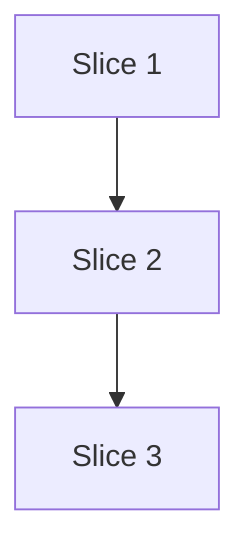

# Plan: Resolve test-smell-review ↔ test-design-advisor remedy overlap at source

**Created**: 2026-07-01
**Branch**: issue-534
**Status**: approved
**Spec**: [docs/specs/test-smell-advisor-remedy-division.md](../docs/specs/test-smell-advisor-remedy-division.md)
**Closes**: #534

## Goal

Draw an explicit division of labor between `test-smell-review` (agent) and
`test-design-advisor` (skill) at the source instead of de-duplicating remedies at
report time. `test-smell-review` names the smell and its **remedy family** (the
knowledge-file cite); the advisor owns the **specific remedy pattern** and the
refactor sequence. `/test-design` joins the two on `remedyFamily` and enumerates
any drops the orchestrator still performs in a "Suppressed duplicates" report
footnote so nothing disappears silently.

## Approach stance (decision-defaults axes)

| Axis | Stance |
|---|---|
| Scope | Touch the six files derived from the spec (knowledge doc, smell-review agent, advisor skill, `/test-design` skill, **four** eval fixtures — not two as the spec first named) — no adjacent cleanup. |
| Format fidelity | Preserve the existing markdown/JSON structure of every target file; additive edits only. |
| Evolution: migrate vs stub | Not applicable — no forwarding stubs involved. |
| Integration | Open a PR and use auto-merge gated on green checks (default). |

## Plan-vs-spec deviations

The plan is stricter than the spec on three points; the deviations are additive
and do not weaken any spec acceptance criterion.

1. **AC9 fixture set expanded from 2 to 4.** A grep of `evals/expected/` for
   `test-smell-review` under `applicableAgents` returns four fixtures today:
   `test-assertion-roulette`, `test-mystery-guest`, `test-clean-doubles`,
   `test-overspecified-mocks`. The spec's Risk-note sweep is promoted to a
   named-file list in the plan. All four are updated in Slice 2.
2. **AC4 refinement — heading text, not anchor slug.** The spec allowed
   either. The plan requires the smell-review Scope to reference the section by
   its **heading text** (`"test-smell-review ↔ test-design-advisor — remedy
   division"`) rather than a markdown anchor, because unicode-arrow + em-dash
   slugification is not stable across renderers.
3. **AC9 grader mechanism.** The repo's `scripts/eval_graders/verdict.py`
   grades `mustMention` by concatenating `issue.message` + `summary` and
   scanning that string only — it does **not** read `issue.suggestedFix`,
   `issue.remedyFamily`, or any other structured field (`verdict.py:40-44`).
   Rather than extend the grader, the plan requires the agent to include the
   family slug (`result-verification`, `fixture-construction`, etc.) verbatim
   in each finding's `message` text (not `suggestedFix` — that field is not
   scanned by the grader) so the existing prose-scan grader catches it. This
   is documented in Step 2.2 GREEN.

## Acceptance Criteria

Mirrors [spec §Acceptance Criteria](../docs/specs/test-smell-advisor-remedy-division.md#acceptance-criteria)
with the three plan-vs-spec deviations above applied.

- [ ] AC1: `test-review-division-of-labor.md` contains the new `## test-smell-review ↔ test-design-advisor — remedy division` section with the column-ownership table.
- [ ] AC2: The new section states explicitly that under `/test-design` the advisor owns the remedy columns; solo `test-smell-review` fills the whole row.
- [ ] AC3: `test-smell-review` agent JSON schema documents `remedyFamily` with the four allowed values plus `null`, and states both fields are always populated.
- [ ] AC4: `test-smell-review` Scope references the new division-of-labor section by its **heading text** (not an anchor slug).
- [ ] AC5: `test-design-advisor` SKILL Steps 3b and 3c each lead with a sentence noting that under `/test-design` the smell agent has already named the family; this step supplies the specific pattern.
- [ ] AC6: `test-design-advisor` SKILL contains no "may overlap with smell-review" language. (Vacuously true against the current file; guards against re-introduction.)
- [ ] AC7: `/test-design` orchestrator constraint 3 no longer de-duplicates smell/advisor remedies; states that findings join structurally on `remedyFamily`.
- [ ] AC8: `/test-design` report template includes a `### Suppressed duplicates` section reading `_None._` by default, and documents that each non-empty entry cites `file:line`, the dropped item, and the reason.
- [ ] AC9: **All four** `evals/expected/*.test.json` files naming `test-smell-review` under `applicableAgents` (`test-assertion-roulette`, `test-mystery-guest`, `test-clean-doubles`, `test-overspecified-mocks`) require the appropriate `remedyFamily` cite via `mustMention` on the family slug — matched by `verdict.py` against `issue.message` + `summary` prose. Final mapping (confirmed against `test-smells.md` in Step 2.1): Assertion Roulette → `result-verification`; Mystery Guest → `fixture-construction`; Overspecified Mocks → `result-verification` (state-verification choice, per `result-verification.md`); Clean Doubles → `null` allowed (no smell → no family), so no addition beyond leaving `mustMention` unchanged.
- [ ] AC10: `scripts/ci-local.sh` passes on the changed files.
- [ ] AC11: The agent contract in `test-smell-review.md` states that `suggestedFix` is always populated with a specific remedy pattern (not a family slug) regardless of invocation context. Verified statically by Step 2.2 R2.2.d (grep for the pattern-not-slug contract sentence); the contract is what protects the solo `/code-review` output shape.

## Slices

Three sequential slices. Each slice leaves trunk releasable — the previous
behavior (report-time de-duplication in `/test-design`) continues to work until
its constraint is rewritten in slice 3.

### Slice 1: Knowledge — division-of-labor section

**Depends-on:** none
**Files:** `plugins/dev-team/knowledge/test-review-division-of-labor.md`

**Behavior:**

```gherkin
Feature: Division of labor between test-smell-review and test-design-advisor is documented in one place

  Scenario: Knowledge doc names the second agent pair
    Given the knowledge file "plugins/dev-team/knowledge/test-review-division-of-labor.md"
    When a reader searches for the section heading
    Then a heading "## test-smell-review ↔ test-design-advisor — remedy division" exists

  Scenario: Column ownership is enumerated
    Given the new section
    When a reader inspects its content
    Then it contains a table whose column labels include: smell name+location, severity+confidence, remedy family, specific remedy pattern, refactor sequence, forward-design placement
    And smell-review is the row-value for smell name+location, severity+confidence, and remedy family
    And test-design-advisor is the row-value for specific remedy pattern, refactor sequence, and forward-design placement

  Scenario: Solo-vs-orchestrated rule is stated
    Given the new section
    When a reader inspects it for the invocation rule
    Then it states that under /test-design the advisor owns the remedy-pattern columns
    And it states that when test-smell-review runs solo it fills the whole row

  Scenario: Existing first section survives unchanged
    Given the knowledge file
    When a reader looks for the original test-review ↔ test-smell-review guidance
    Then the pre-existing "The two roles", "Shared signals — who reports when both run", and "The rule in one line" sections still exist verbatim
```

**Steps:**

#### Step 1.1: Add the remedy-division section

**Complexity**: standard
**RED**: Add a bats structural check (extend the closest existing check for this file, or if none exists, add one under `plugins/dev-team/tests/`) that greps for (a) the new heading string and (b) each of the six column-label strings appearing under it (in table-row form, not just anywhere in the file). The check fails against the current file. Owner-assignment correctness (which agent owns which column) is a semantic property; document that it is verified by plan-review reading, not by the grep check.
**GREEN**: Append the new section to `test-review-division-of-labor.md` — heading, table, rule paragraph. Do not touch the pre-existing content.
**REFACTOR**: None needed.
**Files**: `plugins/dev-team/knowledge/test-review-division-of-labor.md`, plus the structural check location.
**Commit**: `docs(knowledge): document test-smell-review ↔ test-design-advisor remedy division (#534)`

### Slice 2: Agent contract — `remedyFamily` schema + eval fixtures

**Depends-on:** 1
**Files:** `plugins/dev-team/agents/test-smell-review.md`, `evals/expected/test-assertion-roulette.test.json`, `evals/expected/test-mystery-guest.test.json`, `evals/expected/test-clean-doubles.test.json`, `evals/expected/test-overspecified-mocks.test.json`

**Behavior:**

```gherkin
Feature: test-smell-review always emits a remedy family alongside the specific fix

  Scenario: Agent JSON schema documents remedyFamily
    Given the agent file "plugins/dev-team/agents/test-smell-review.md"
    When a reader reads its JSON output block
    Then the "issues" object has a "remedyFamily" property
    And its allowed values are "fixture-construction", "result-verification", "test-organization", "test-refactoring", or null
    And the file states that both remedyFamily and suggestedFix are always populated

  Scenario: Agent Scope references the division of labor by heading text
    Given the agent file
    When a reader reads the Scope section
    Then it explicitly names the section "test-smell-review ↔ test-design-advisor — remedy division" as the source of the boundary rule

  Scenario: Assertion Roulette fixture requires the result-verification family cite
    Given the eval fixture "evals/expected/test-assertion-roulette.test.json"
    When a reader inspects the fixture's expected-output block
    Then "mustMention" contains "result-verification" (so the verdict grader will scan message/summary prose for that slug)

  Scenario: Mystery Guest fixture requires the fixture-construction family cite
    Given the eval fixture "evals/expected/test-mystery-guest.test.json"
    When a reader inspects the fixture's expected-output block
    Then "mustMention" contains "fixture-construction"

  Scenario: Overspecified Mocks fixture requires the test-organization family cite
    Given the eval fixture "evals/expected/test-overspecified-mocks.test.json"
    When a reader inspects the fixture's expected-output block
    Then "mustMention" contains "test-organization"
    And this mapping was confirmed against knowledge/test-smells.md (Overspecified Software remedy family)

  Scenario: Clean Doubles fixture — no family required
    Given the eval fixture "evals/expected/test-clean-doubles.test.json"
    When a reader inspects the fixture's expected-output block
    Then no family cite is added (the fixture expects no smell → no family cite is warranted; remedyFamily null is valid)

  Scenario: Agent contract requires pattern-level suggestedFix regardless of invocation context (AC11 guard)
    Given the agent file "plugins/dev-team/agents/test-smell-review.md"
    When a reader inspects the contract for suggestedFix
    Then the file states that suggestedFix is always populated with a specific remedy pattern (e.g. "Expected Object", "Custom Assertion", "Creation Method"), not just a family slug
    And it states that this contract applies to every invocation context (solo /code-review as well as under /test-design)

  Scenario: Agent contract requires the family slug to appear in message prose (R2.2.e)
    Given the agent file
    When a reader inspects the contract for prose emission
    Then the file states that for every finding whose remedyFamily is non-null the family slug MUST appear verbatim in the finding's message (not suggestedFix)
    And the contract cites scripts/eval_graders/verdict.py:40 as the reason (the grader concatenates message + summary only)

  Scenario: Agent contract permits null remedyFamily for smells with no family cite
    Given the agent file
    When a reader inspects the contract for remedyFamily
    Then the file states that remedyFamily is null when a smell has no associated remedy family (e.g. pyramid-placement flags)
    And it states that suggestedFix is still populated with actionable guidance in that case
```

**Steps:**

#### Step 2.1: Structural fixture updates

**Complexity**: standard
**Verification method**: Static inspection of JSON files. No agent run required — the check is a JSON structural diff and a `jq`-driven grep for the required `mustMention` value.
**Actions**:

- Confirm each smell → family mapping against `plugins/dev-team/knowledge/test-smells.md` before editing:
  - Assertion Roulette → `result-verification` (Expected Object / Custom Assertion)
  - Mystery Guest → `fixture-construction` (Creation Method / Minimal Fixture)
  - Overspecified Software (over-mocking) → `test-organization` (verify state, not internal calls) — confirm the mapping is best-supported by `test-smells.md`; if `test-doubles.md` is a stronger fit, use `test-doubles` as the cited family instead and note the deviation.
  - Clean Doubles fixture → no smell expected → no `mustMention` addition.
- Add the family slug to each fixture's `mustMention` array (three of the four). Do NOT remove existing `mustMention` entries.
- Also add a structural check under `plugins/dev-team/tests/` that iterates the four fixtures and asserts the family slug is present in `mustMention` for each (except Clean Doubles).
**RED signal**: The new bats check fails on the current fixtures until this step's edits land.
**REFACTOR**: None needed.
**Files**: `evals/expected/test-assertion-roulette.test.json`, `evals/expected/test-mystery-guest.test.json`, `evals/expected/test-overspecified-mocks.test.json`, plus the structural check.
**Commit**: `test(evals): require remedyFamily cite in test-smell-review expected outputs (#534)`

#### Step 2.2: Extend the agent JSON schema block, Scope, and require the family slug in message prose

**Complexity**: standard
**Verification method**: Static inspection of the agent file (structural bats/grep checks) plus the Step 2.1 fixture mustMention check running once agent output starts including the slug in `message` prose. No parallel live-run mechanism required inside this step — Slice 2's whole mechanism is static-inspection-first.
**RED checks** (each one falsifiable and independently failing against the current agent file):

- **R2.2.a — schema property present**: bats/grep asserts the JSON schema block in `test-smell-review.md` lists `remedyFamily` as a property alongside `suggestedFix`.
- **R2.2.b — allowed values documented**: the file explicitly names the four family slugs (`fixture-construction`, `result-verification`, `test-organization`, `test-refactoring`) plus `null` as the allowed `remedyFamily` values.
- **R2.2.c — both-fields-always-populated statement**: a grep finds the sentence stating both `remedyFamily` and `suggestedFix` are always populated (with `remedyFamily=null` allowed for smells with no family cite).
- **R2.2.d — pattern-not-slug contract for `suggestedFix`**: a grep finds a sentence stating `suggestedFix` is always populated with a specific remedy pattern, not the family slug, regardless of invocation context (this is the AC11 static guard).
- **R2.2.e — prose-emission contract**: a grep finds a sentence stating that for every finding whose `remedyFamily` is non-null, the family slug MUST appear verbatim in the finding's `message` prose (specifically `message`, not `suggestedFix` — `verdict.py:40` concatenates only `message` + `summary` for the mustMention scan, so `suggestedFix` is ignored by the grader).
- **R2.2.f — Scope references division-of-labor by heading text**: a grep of the Scope section finds the literal heading text `"test-smell-review ↔ test-design-advisor — remedy division"` (not an anchor slug).
- **R2.2.g — smell→family table**: a grep finds a smell→family mapping table in the Detect section (or a nearby note) covering at minimum the three known non-null mappings, so the agent has explicit guidance and the Overspecified→test-organization mapping is visible.
- Additionally, the Step 2.1 fixture `mustMention` check now becomes a signal: running `/agent-eval` on updated agent output will pass once the agent emits the family slug in `message` prose.

**GREEN**: Apply the corresponding edits to `plugins/dev-team/agents/test-smell-review.md` to satisfy each R2.2.a–g. Do all seven in the same commit — they are one contract.
**REFACTOR**: None needed.
**Files**: `plugins/dev-team/agents/test-smell-review.md`, plus the structural checks for R2.2.a–g.
**Commit**: `feat(test-smell-review): add remedyFamily field, message-prose contract, and division-of-labor reference (#534)`

### Slice 3: Skill wiring — advisor SKILL + `/test-design` constraint + Suppressed duplicates

**Depends-on:** 2
**Files:** `plugins/dev-team/skills/test-design-advisor/SKILL.md`, `plugins/dev-team/skills/test-design/SKILL.md`

**Behavior:**

```gherkin
Feature: Skills document the boundary and stop double-reporting remedies

  Scenario: Advisor SKILL Step 3b acknowledges the boundary
    Given the file "plugins/dev-team/skills/test-design-advisor/SKILL.md"
    When a reader reads Step 3b
    Then it contains a leading sentence noting that under /test-design the smell agent has already named the smell and its family
    And Step 3b supplies the specific remedy pattern for fixture smells

  Scenario: Advisor SKILL Step 3c acknowledges the boundary
    Given the file
    When a reader reads Step 3c
    Then it contains the same kind of leading sentence for verification and organization patterns

  Scenario: /test-design constraint 3 no longer de-duplicates smell/advisor remedies
    Given the file "plugins/dev-team/skills/test-design/SKILL.md"
    When a reader reads orchestrator constraint 3
    Then it still handles test-review/test-smell-review mechanics overlap
    But the sentence proposing report-time de-duplication of smell/advisor remedies is replaced
    And the replacement states that smell rows and advisor rows join structurally on remedyFamily

  Scenario: Report template exposes suppressed duplicates
    Given the file
    When a reader reads the report template
    Then the template contains a "### Suppressed duplicates" section
    And the section documents that it reads "_None._" when nothing was dropped
    And the section documents that each non-empty entry cites file:line, the dropped item, and the reason it was dropped
```

**Steps:**

#### Step 3.1: Update the advisor SKILL

**Complexity**: trivial
**RED**: Structural grep check that asserts Step 3b and Step 3c each begin with the boundary sentence (looking for the specific phrase "under /test-design" within the first line of each step). The check fails against the current file because those sentences do not exist there yet. (The spec's AC6 no-"may overlap" check is vacuously true and needs no structural test — a note that this AC is a re-introduction guard, not a change requirement, goes in the plan.)
**GREEN**: Edit `plugins/dev-team/skills/test-design-advisor/SKILL.md`:

- Prepend a boundary sentence to Steps 3b and 3c.
**REFACTOR**: None needed.
**Files**: `plugins/dev-team/skills/test-design-advisor/SKILL.md`, plus the structural check.
**Commit**: `docs(test-design-advisor): note remedy-family boundary under /test-design (#534)`

#### Step 3.2: Rewrite `/test-design` constraint 3 + add Suppressed duplicates template

**Complexity**: standard
**RED**: Structural check that asserts (a) orchestrator constraint 3 contains the phrase "join structurally on `remedyFamily`" (or an equivalent minimal-string check specified in the bats file); (b) the report template contains a `### Suppressed duplicates` heading; (c) the template contains a default-line placeholder for "_None._" and the entry-format documentation ("file:line", "dropped item", "reason"). The check fails against the current file.
**GREEN**: Edit `plugins/dev-team/skills/test-design/SKILL.md`:

- Rewrite constraint 3 to keep the `test-review`/`test-smell-review` mechanics rule but replace the smell/advisor branch with a structural-join statement on `remedyFamily`.
- Extend the report template with `### Suppressed duplicates` — default `_None._`, plus explicit documentation that each non-empty entry cites `file:line`, the dropped item, and the reason.
**REFACTOR**: None needed.
**Files**: `plugins/dev-team/skills/test-design/SKILL.md`, plus the structural check.
**Commit**: `refactor(test-design): join smell + advisor on remedyFamily, expose suppressed duplicates (#534)`

## Parallelization



| Wave | Slices |
|------|--------|
| 1 | 1 |
| 2 | 2 |
| 3 | 3 |

Parallelization Critic skipped — every wave is single-slice by construction (approved by the Parallelization Critic on this basis).

## Complexity Classification

Every step is `trivial` or `standard`. No `complex` steps — this change is
documentation, an additive schema field, and fixture updates within existing
patterns. No architectural or security-sensitive surface.

## Pre-PR Quality Gate

- [ ] All new bats structural checks pass.
- [ ] `scripts/ci-local.sh` passes.
- [ ] `/agent-audit` passes on the touched agent/skill files.
- [ ] `/agent-eval` passes on all four updated `test-smell-review` fixtures.
- [ ] `/code-review` passes.
- [ ] Documentation cross-references consistent (heading text — not anchor slugs — is what Scope cites).

## Risks & Open Questions

- **Overspecified Mocks family mapping.** The plan initially mapped Overspecified Software (over-mocking) → `test-organization`. **Resolved in build**: `test-smells.md`'s remedy column for Overspecified Software is "prefer state verification; mock only true boundaries (see `test-doubles.md`)" — a verification-style choice (state vs. behavior), which lives in `result-verification.md` at the top of the file. Final mapping: **`result-verification`**. Both the agent's smell → family table and the `test-overspecified-mocks` eval fixture cite `result-verification` consistently; no change to the four allowed-values set was needed.
- **Structural check location.** The plan assumes bats checks under `plugins/dev-team/tests/`. If a different linter drives the gate, fold the assertions in there instead — do not add a parallel check surface.

## Plan Review Summary

**Plan tier**: standard — reviewers: Acceptance Test Critic, Design & Architecture Critic, Parallelization Critic (UX skipped — no UI surface).

Round 1 outcomes:

- **Acceptance Test Critic** → `needs-revision` (3 blockers, 2 warnings). Blockers: AC9 fixture sweep un-scoped; AC11 no scenario/step; Step 3.1 "may overlap" check trivially green. Warnings: AC4 heading-slug ambiguity; Slice 2 scenario/step mechanism mismatch.
- **Design & Architecture Critic** → `needs-revision` (2 warnings). Warnings: `mustMention` grader is prose-only (does not read structured fields), sibling fixtures known-present.
- **Parallelization Critic** → `approve` (single-slice waves; no concurrency to validate).

Round 2 revisions: sibling fixtures enumerated in Slice 2 and AC9; grader alignment attempted via prose slug in `suggestedFix`/`message` (Step 2.2); solo-invocation and null-family scenarios added; Slice 2 Gherkin mechanism aligned to static fixture inspection; Step 3.1 RED redirected to positive boundary-sentence check; AC6 clarified as re-introduction guard; Suppressed-duplicates scenario tightened with entry-format requirement.

Round 2 outcomes:

- **Acceptance Test Critic** → `needs-revision` (1 blocker, 1 warning, 1 step issue). Blocker: AC11's new scenario has no verifying step (runtime scenario without a runtime harness). Warning: Slice 2 mixes static (Step 2.1) and live-run (Step 2.2) RED mechanisms. Step 2.2 bundles four GREEN changes under one RED signal.
- **Design & Architecture Critic** → `needs-revision` (1 blocker). Blocker: `verdict.py:40` scans `message`+`summary` only — it does NOT read `suggestedFix`, so the "prose slug in `suggestedFix` or `message`" contract is enforceable only through `message`. Naming `suggestedFix` as an acceptable emission target makes the grader silently miss a compliant agent that puts the slug only in `suggestedFix`.

Round 3 revisions (this document): (a) prose-emission contract narrowed to `message` only, with a citation to `verdict.py:40`; (b) AC11 recast as a static-contract check (Step 2.2 R2.2.d greps for the pattern-not-slug sentence) and both AC11 Gherkin scenarios (solo-invocation, null-family) downgraded to static agent-file inspections — matches Slice 2's whole static-first mechanism, closes the "runtime scenario, no runtime step" gap; (c) Step 2.2 split into seven independently-falsifiable RED checks R2.2.a–g, each with an explicit grep target — one GREEN edit per RED, no bundled coverage.

Round 3 outcomes:

- **Acceptance Test Critic** → `approve` (1 minor warning: R2.2.e prose-emission check lacked a named Gherkin scenario — addressed inline).
- **Design & Architecture Critic** → `approve` (0 issues). Cited `verdict.py:40` directly and confirmed the message-only prose contract correctly matches the grader.
- **Parallelization Critic** → `approve` (unchanged from round 1; single-slice waves).

Round 3 revisions after critic sign-off: added a named Gherkin scenario for R2.2.e (message-prose contract) so every R2.2.x check traces to a scenario.

Round 3 verdict: **all reviewers approve.**

## Build Progress

### Slices (grouped by wave)

#### Wave 1

- [ ] Slice 1: Knowledge — division-of-labor section
  - [ ] Step 1.1: Add the remedy-division section

#### Wave 2

- [ ] Slice 2: Agent contract — `remedyFamily` schema + eval fixtures
  - [ ] Step 2.1: Structural fixture updates
  - [ ] Step 2.2: Extend the agent JSON schema block, Scope, and require the family slug in prose

#### Wave 3

- [ ] Slice 3: Skill wiring — advisor SKILL + `/test-design` constraint + Suppressed duplicates
  - [ ] Step 3.1: Update the advisor SKILL
  - [ ] Step 3.2: Rewrite `/test-design` constraint 3 + add Suppressed duplicates template

### Acceptance Criteria

- [ ] AC1: division-of-labor section exists
- [ ] AC2: solo-vs-orchestrated rule stated
- [ ] AC3: `remedyFamily` in agent schema
- [ ] AC4: Scope references section by heading text
- [ ] AC5: advisor SKILL Steps 3b/3c note the boundary
- [ ] AC6: advisor SKILL contains no "may overlap" language (vacuous guard)
- [ ] AC7: `/test-design` constraint 3 rewritten to join on `remedyFamily`
- [ ] AC8: `### Suppressed duplicates` in `/test-design` report template with entry-format docs
- [ ] AC9: All four `test-smell-review` eval fixtures updated per mapping
- [ ] AC10: `ci-local.sh` passes
- [ ] AC11: solo `/code-review` still emits pattern-level `suggestedFix`
