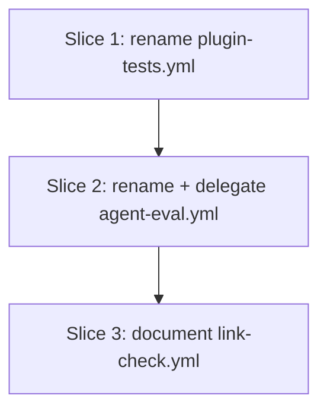

# Plan: rename Tests/Eval workflows and route eval structural-gate through ci-local.sh

**Created**: 2026-07-01
**Branch**: feat/531-workflow-rename
**Status**: implemented
**Spec**: docs/specs/workflow-audit-fixes.md
**Issue**: <https://github.com/bdfinst/agentic-dev-team/issues/531>

## Goal

Rename two GitHub Actions workflows (`Tests` → `Plugin tests`, `Eval` → `Agent eval`) so PR checks self-locate to their source file, delegate two direct commands in `agent-eval.yml`'s `structural-gate` through `bash scripts/ci-local.sh --only=...` to match the pattern `plugin-tests.yml` already uses (removes silent-drift risk on a `scripts/eval_grade.py` rename), and add a comment to `link-check.yml` documenting why its `chk_nav_integrity` is a CI-only superset of the local one. Zero behavioral change; branch-protection contexts (job names, triggers) untouched.

## Approach stance (high-reversal-cost axes)

- **Scope** — touch only `.github/workflows/plugin-tests.yml`, `.github/workflows/agent-eval.yml`, `.github/workflows/link-check.yml`, plus the plan/spec artifacts. No new files, no other workflow touched.
- **Migrate vs. edit stub** — n/a.
- **Replace vs. merge** — pure additive/rename edits within existing files.
- **Auto-merge** — disabled (`/pr --no-auto-merge`). Touches `.github/workflows/`.
- **Format fidelity** — n/a.

## Acceptance Criteria

- [ ] A1: `plugin-tests.yml` renamed — `grep -c '^name: Plugin tests$'` = 1; `grep -c '^name: Tests$'` = 0.
- [ ] A2: `agent-eval.yml` renamed — `grep -c '^name: Agent eval$'` = 1; `grep -c '^name: Eval$'` = 0.
- [ ] A3: `agent-eval.yml`'s structural-gate delegates two steps through `--only` — exactly one step contains `--only=chk_eval_corpus`, exactly one contains `--only=chk_citation_lint`; zero remaining occurrences of `scripts/eval_grade.py --check-corpus` or `scripts/citation_lint.py --all` as direct commands within the `structural-gate` job. The bats-specific step is preserved unchanged.
- [ ] A4: `link-check.yml` comment block references `chk_nav_integrity`, `mkdocs`, and `lychee` — three greps ≥ 1 each.
- [ ] A5: No job-name, trigger, or dependency changes — diff scan returns no touched `name:` other than the two workflow-level renames, no touched `push:`/`pull_request:`/`workflow_dispatch:`.
- [ ] A6: `bash scripts/ci-local.sh --only=chk_eval_corpus,chk_citation_lint` exits 0 locally — proves the delegation runs correctly.
- [ ] A7: `bash scripts/ci-local.sh` exits 0; PR title prefix `chore(ci):`; opened with `--no-auto-merge`.

## Slices

Three independent slices, each editing a distinct workflow file — no file collisions, safe to parallelize by `plan-waves.sh`. Each has a single TDD step: grep-based bats fixture asserting the target state, then the edit.

### Slice 1: Rename `plugin-tests.yml`

**Depends-on:** none
**Files:** `.github/workflows/plugin-tests.yml`, `tests/repo/workflow-audit-531.bats`

**Behavior:**

```gherkin
Feature: plugin-tests.yml declares itself with a discoverable name

  Scenario: Workflow-level name is "Plugin tests"
    Given the workflow file "plugin-tests.yml"
    When the top-level `name:` field is read
    Then it equals "Plugin tests"
    And no lingering `name: Tests` line remains
```

**Steps:**

#### Step 1.1: Rename `plugin-tests.yml` + add regression bats

**Complexity**: trivial
**RED**: Create `tests/repo/workflow-audit-531.bats` with `@test` blocks asserting `grep -c '^name: Plugin tests$'` = 1 and `grep -c '^name: Tests$'` = 0 on `.github/workflows/plugin-tests.yml`. Run `bats tests/repo/workflow-audit-531.bats`; both fail (current state is `name: Tests`).
**GREEN**: Edit `.github/workflows/plugin-tests.yml` line 1: `name: Tests` → `name: Plugin tests`. Run `bats`; both assertions pass.
**REFACTOR**: None — single-token change.
**Files**: `.github/workflows/plugin-tests.yml`, `tests/repo/workflow-audit-531.bats`
**Commit**: `chore(ci): rename plugin-tests workflow from Tests to Plugin tests (#531)`

### Slice 2: Rename `agent-eval.yml` + delegate structural-gate through `--only`

**Depends-on:** 1
**Files:** `.github/workflows/agent-eval.yml`, `tests/repo/workflow-audit-531.bats`

**Behavior:**

```gherkin
Feature: agent-eval.yml declares itself with a discoverable name and delegates to ci-local.sh

  Scenario: Workflow-level name is "Agent eval"
    Given the workflow file "agent-eval.yml"
    When the top-level `name:` field is read
    Then it equals "Agent eval"
    And no lingering `name: Eval` line remains

  Scenario: structural-gate delegates through ci-local.sh --only
    Given the workflow file "agent-eval.yml"
    When the "structural-gate" job body is scanned
    Then exactly one `run:` step contains "--only=chk_eval_corpus"
    And exactly one `run:` step contains "--only=chk_citation_lint"
    And no `run:` step contains "scripts/eval_grade.py --check-corpus" as a direct command
    And no `run:` step contains "scripts/citation_lint.py --all" as a direct command
    And the bats-specific step (running `eval_grader_tests.bats` and friends) is preserved unchanged
```

**Steps:**

#### Step 2.1: Rename `agent-eval.yml` + delegate two steps + regression bats

**Complexity**: standard
**RED**: Extend `tests/repo/workflow-audit-531.bats` with (a) two `@test` blocks for the name rename (mirroring Slice 1), (b) two `@test` blocks asserting `--only=chk_eval_corpus` and `--only=chk_citation_lint` each appear exactly once inside the `structural-gate` job section, (c) two `@test` blocks asserting `scripts/eval_grade.py --check-corpus` and `scripts/citation_lint.py --all` do NOT appear as direct commands within `structural-gate` (they may still appear elsewhere, e.g. inside `ci-local.sh` itself which is fine — the scoping helper below extracts the job block). Job-block extraction helper: `awk '/^  structural-gate:/,/^  [a-z_-]+:$/'` with a guard that drops the terminating heading line. Also assert the bats-step (`eval_grader_tests.bats`) is preserved. Run `bats`; the new assertions fail.
**GREEN**: Edit `.github/workflows/agent-eval.yml`: (a) line 1 `name: Eval` → `name: Agent eval`; (b) in `structural-gate`, replace the "Eval corpus integrity check" step's `run:` with `bash scripts/ci-local.sh --only=chk_eval_corpus`; (c) replace the "Citation drift lint (advisory)" step's `run:` with `bash scripts/ci-local.sh --only=chk_citation_lint`. Preserve step names, `if:` conditions, and the intervening bats step unchanged. Run `bats`; all assertions pass.
**REFACTOR**: None expected. The delegation preserves the step's `name:` (workflow-visible label) — no reason to change it.
**Files**: `.github/workflows/agent-eval.yml`, `tests/repo/workflow-audit-531.bats`
**Commit**: `chore(ci): rename agent-eval workflow and delegate structural-gate through ci-local.sh --only (#531)`

### Slice 3: Document local/CI split in `link-check.yml`

**Depends-on:** 2
**Files:** `.github/workflows/link-check.yml`, `tests/repo/workflow-audit-531.bats`

**Behavior:**

```gherkin
Feature: link-check.yml documents its intentional local/CI split

  Scenario: A comment block near the top explains the split
    Given the workflow file "link-check.yml"
    When the file's leading comment lines (before `jobs:`) are read
    Then they name `chk_nav_integrity` (the local counterpart)
    And they mention `mkdocs` as a CI-only tool
    And they mention `lychee` as a CI-only tool
```

**Steps:**

#### Step 3.1: Add local/CI split comment + regression bats

**Complexity**: trivial
**RED (honest — lock-in rather than TDD-first)**: Extend `tests/repo/workflow-audit-531.bats` with `@test` blocks asserting `chk_nav_integrity`, `mkdocs`, and `lychee` each appear at least once in `.github/workflows/link-check.yml`, AND a `531-3.1d` block requiring the top-level `# Relationship to the local gate` comment header (added by this slice). The three token-presence assertions were already green against the pre-existing file — those tokens appear inline in step comments and action names. They land as regression lock-in against a future removal of `mkdocs`/`lychee` from CI. Only 3.1d (the comment-header assertion) is a true RED-first driver: it fails until this slice's edit lands.
**GREEN**: Edit `.github/workflows/link-check.yml`: add a `#`-prefixed comment block near the top (above `jobs:`) explaining that this workflow is a CI-only superset of `chk_nav_integrity` in `scripts/ci-local.sh`, and that `mkdocs build` + `lychee` stay CI-only so they don't become local prereqs. Run `bats`; all assertions pass.
**REFACTOR**: None.
**Files**: `.github/workflows/link-check.yml`, `tests/repo/workflow-audit-531.bats`
**Commit**: `docs(ci): document intentional local/CI split for chk_nav_integrity (#531)`

## Parallelization

`plan-waves.sh` derives waves from `Depends-on:` declarations. All three slices touch distinct workflow files, so they're independent in terms of behavior — but they all mutate `tests/repo/workflow-audit-531.bats` (each slice extends it with its own assertions). To avoid a same-wave file collision, serialize the chain via `Depends-on`: Slice 2 → 1, Slice 3 → 2.



| Wave | Slices (parallel) |
|------|-------------------|
| 1 | 1 |
| 2 | 2 |
| 3 | 3 |

## Complexity Classification

| Step | Rating | Why |
|------|--------|-----|
| 1.1 | trivial | Single-token rename + 2 bats assertions |
| 2.1 | standard | Rename + two step-body swaps + 6 bats assertions with awk-scoped extraction |
| 3.1 | trivial | Comment addition + 3 bats greps |

No `complex` steps.

## Pre-PR Quality Gate

- [ ] `bats tests/repo/workflow-audit-531.bats` exits 0
- [ ] `bash scripts/ci-local.sh` exits 0
- [ ] `bash scripts/ci-local.sh --only=chk_eval_corpus,chk_citation_lint` exits 0 (A6 dry-run)
- [ ] `/code-review` passes on the diff
- [ ] PR title is `chore(ci): rename Tests/Eval workflows and delegate eval structural-gate through ci-local.sh (#531)`
- [ ] PR opened with `--no-auto-merge`

## Risks & Open Questions

- **Risk:** The `structural-gate` bats extraction (Slice 2) uses `awk` to scope grep to the job block. If YAML indentation shifts (e.g. someone re-indents the file to 4-space), the awk pattern breaks. **Mitigation:** the pattern `awk '/^  structural-gate:/,/^  [a-z_-]+:$/'` anchors on GitHub Actions' canonical 2-space indent, matching what the file uses today. If the file is ever re-indented, the bats test fails loudly (not silently) — pointing directly at the assumption.
- **Risk:** Branch protection rules on the repo may reference workflow names *as well as* job names (e.g. required check `Tests / Plugin content & hooks` in the ruleset). Verified during spec-writing: `agent-eval.yml`'s `semver-contract` job header comment already documents that "Job name is a REQUIRED status-check context" — the ruleset is on job names, not workflow prefixes. **Mitigation:** if this turns out to be wrong at merge time, revert this PR (safe rename) and reopen with a `renovate-require-tests` update.
- **Open question:** None — all decisions locked in the spec's Ambiguity Log.

## Build Progress

### Slices (grouped by wave)

#### Wave 1

- [x] Slice 1: Rename `plugin-tests.yml`
  - [x] Step 1.1: Rename `plugin-tests.yml` + add regression bats

#### Wave 2

- [x] Slice 2: Rename `agent-eval.yml` + delegate structural-gate through `--only`
  - [x] Step 2.1: Rename `agent-eval.yml` + delegate two steps + regression bats

#### Wave 3

- [x] Slice 3: Document local/CI split in `link-check.yml`
  - [x] Step 3.1: Add local/CI split comment + regression bats

### Acceptance Criteria

- [x] A1: plugin-tests renamed
- [x] A2: agent-eval renamed
- [x] A3: structural-gate delegates two steps through --only
- [x] A4: link-check.yml documents local/CI split
- [x] A5: No job-name, trigger, or dependency changes
- [x] A6: Local --only dry-run exits 0
- [x] A7: ci-local green, PR title chore(ci):, --no-auto-merge
