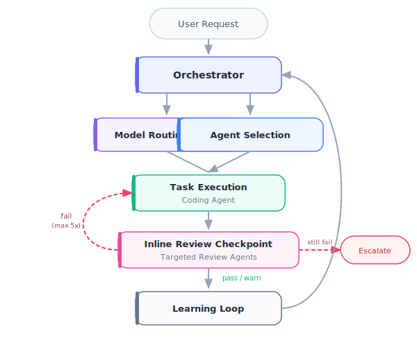

# Architecture

> **Reading order**: Start with the System Overview flowchart, then read Context Management to understand how agents are loaded and unloaded, followed by Quality Assurance for the validation sequence during Phase 3.

## System Overview

The Orchestrator receives every request, classifies it by type and complexity, selects agents, assigns models, and coordinates delivery. During Phase 3 (Implement), review agents check coding agent output at each discrete unit-of-work checkpoint. Findings feed back as structured corrections (max 2 cycles before human escalation). After each task, the learning loop captures metrics and evaluates whether configuration updates are needed.

## Model Routing

The Orchestrator is the **authoritative source for model selection**. Individual agent `model:` frontmatter is a fallback for direct invocation only. When the orchestrator spawns an agent via the Agent tool, it passes model explicitly from the routing table.

| Model | Assigned to |
| --- | --- |
| `haiku` | naming-review, complexity-review, claude-setup-review, token-efficiency-review, performance-review |
| `sonnet` | spec-compliance-review, test-review, structure-review, js-fp-review, concurrency-review, a11y-review, svelte-review, doc-review, refactoring-review, progress-guardian, data-flow-tracer, orchestrator, qa-engineer, tech-writer, software-engineer (default) |
| `opus` | security-review, domain-review, arch-review, architect, software-engineer (architectural changes) |

Full routing table: `agents/orchestrator.md` → Model Routing Table section.

## Review-Fix Loop

Both inline review checkpoints (Phase 3) and `/code-review` use the same review-fix loop:

1. Orchestrator selects targeted review agents based on what changed (JS/TS → js-fp-review + complexity-review; API surface → security-review; Dockerfile → docker-image-audit; etc.)
2. Agents run in parallel as sub-agents with orchestrator-assigned models
3. Issues are classified by actionability:
   - **Actionable**: error/warning severity with high/medium confidence → auto-fix
   - **Human-required**: confidence `none` → report only, escalate
   - **Suggestions**: logged, do not trigger the fix loop
4. Actionable issues are auto-fixed (file-by-file, top-to-bottom by line number)
5. Only agents that reported actionable issues are re-run against the modified files
6. Loop repeats up to **5 iterations** until zero actionable issues remain
7. If the loop doesn't converge (same issues persist, or iteration limit reached) → escalate to human with all fix attempts and remaining issues
8. Final gate: `/code-review` before commit (auto-scopes to uncommitted changes, runs its own fix loop)

## Context Management

The Orchestrator manages context utilization using two operational skills.

### Loading Protocol

[Context Loading Protocol](../skills/context-loading-protocol/SKILL.md) controls what gets loaded and when:

1. **Classify** the task (simple, standard, multi-agent, complex)
2. **Select** the minimum set of agents and skills required
3. **Load in phases**: primary agent first, supporting agents as their phase begins
4. **Unload** previous-phase agents via summarization before loading next-phase agents

### Summarization

[Context Summarization](../skills/context-summarization/SKILL.md) controls when to compress:

| Utilization | Action |
| --- | --- |
| < 40% | Normal operation |
| 40-50% | Prepare for summarization |
| 50-60% | Summarize older conversation turns |
| 60-75% | Aggressive summarization |
| 75%+ | Write summary to `memory/`, start new conversation |

Utilization is estimated via proxy signals (tool call volume, message count, accumulated file reads) as described in the Context Loading Protocol. Summaries follow a structured template and are stored in `memory/` for cross-session continuity.

### Token Budgets

| Component | ~Tokens |
| --- | --- |
| CLAUDE.md (always loaded) | ~800 |
| Single team agent | 290-560 |
| Single skill | 420-1,020 |
| All team agents (no skills) | ~3,590 |
| All review agents | ~3,100 (sub-agents, not loaded in parent context) |
| Knowledge files | ~3,450 (loaded on demand by agents) |
| Subagent prompt templates | ~1,800 (loaded by orchestrator when dispatching) |
| Full load (all team agents + all skills) | ~18,100 |

A typical task loads 1 agent + 1-2 skills: roughly 1,000-2,000 tokens of configuration overhead. Review agents and plan review personas run as isolated sub-agents — their context burden does not accumulate in the parent.

## Plan Review Personas

Before the human reviews a plan (Phase 2), four critical review personas run **in parallel** as sub-agents. Each challenges the plan from a distinct perspective:

| Persona | Template | Model | What It Challenges |
| --- | --- | --- | --- |
| Acceptance Test Critic | `prompts/plan-review-acceptance.md` | sonnet | Criteria verifiability, BDD scenario completeness, error path coverage, TDD step traceability |
| Design & Architecture Critic | `prompts/plan-review-design.md` | sonnet | Dependency direction, abstraction quality, structural risks, pattern consistency |
| UX Critic | `prompts/plan-review-ux.md` | sonnet | User journey, error experience, cognitive load, accessibility (self-skips for non-UI plans) |
| Strategic Critic | `prompts/plan-review-strategic.md` | sonnet | Problem-solution fit, scope assessment, risk analysis, opportunity cost |

Each reviewer returns a structured `approve` or `needs-revision` verdict. If any reviewer flags blockers, the plan is revised before the human sees it (max 2 iterations). Warnings from all four are aggregated into a Plan Review Summary appended to the plan file.

This gate catches problems when they cost minutes to fix (in a plan), not hours (in code).

## Quality Assurance

Validation happens in this sequence during Phase 3:

| Order | Layer | Who | When |
| --- | --- | --- | --- |
| 1 | Self-validation | Active agent | Before delivering any unit of work |
| 2 | Inline review checkpoint | Targeted review agents | After each discrete unit of work |
| 3 | Review feedback correction | Coding agent | Up to 2 correction cycles per checkpoint |
| 4 | Final code review | `/code-review` | Before committing; auto-scopes to uncommitted changes, runs full agent suite with fix loop |
| 5 | Documentation review | Tech-writer | After code review passes; verifies docs reflect current behavior |
| 6 | Peer validation | QA agent | After implementation, before phase delivery |
| 7 | Human gate | User | At each phase transition (Research, Plan, Implement) |
| 8 | Post-hoc monitoring | Orchestrator | During learning loop after task completion |

Every agent applies the [Quality Gate Pipeline](../skills/quality-gate-pipeline/SKILL.md) before output. This includes self-validation (Phase 1: factual accuracy, instruction fidelity, consistency, confidence scoring), verification evidence (Phase 2), and review-correction loops (Phase 3).

Quality gates by task type:

| Task Type | Required Gates |
| --- | --- |
| Code implementation | Self-validation + QA review |
| Architecture design | Self-validation + human approval |
| Documentation | Self-validation + terminology check |
| Bug fix | Self-validation + regression test |
| Data analysis | Self-validation + statistical validation |

## Human Oversight

Agents operate autonomously within boundaries. The [Human Oversight Protocol](../skills/human-oversight-protocol/SKILL.md) defines three levels of human involvement:

| Level | When | Example |
| --- | --- | --- |
| **Autonomous** | Routine work within scope | Writing a unit test |
| **Notify** | Significant but within scope | Choosing between two valid patterns |
| **Approve** | High-impact or outside scope | Database schema change, production deploy |

Intervention commands (`override`, `pause`, `stop`) give humans immediate control when needed.

## Governance

[Governance & Compliance](../skills/governance-compliance/SKILL.md) defines audit and ethics requirements:

- All task completions logged to `metrics/` (JSONL format)
- All configuration changes logged to `metrics/config-changelog.jsonl`
- Conversation summaries stored in `memory/` for cross-session continuity
- Significant routing and architectural decisions logged to `memory/decisions.md`
- Sensitive data (credentials, PII) never stored in metrics or memory files
- All agent decisions must be explainable on request

### Pre-Execution Hook Pipeline

A `PreToolUse` hook (`pre-tool-guard.sh`) intercepts every Write and Edit call before execution:

| Action | Trigger | Behavior |
| --- | --- | --- |
| Block | Path matches `blocked_paths` in `guards.json` | Exit 2 — write cancelled, message shown |
| Warn | Path matches `warn_paths` in `guards.json` | Exit 0 — write proceeds, warning shown |
| Allow | No match | Exit 0 — write proceeds silently |

Default blocked patterns: `.env`, `*.pem`, `*.key`, `*.p12`, `*.pfx`, `*credential*`, `*secret*`, `*.token`. Configurable via `.claude/hooks/guards.json`.

### Destructive Command Guard

A second `PreToolUse` hook (`hooks/destructive-guard.sh`) monitors Bash tool calls for destructive commands: file deletion (`rm -rf`), database drops (`DROP TABLE`), git destruction (`force-push`, `reset --hard`), process killing, and permission escalation. Patterns are configurable via `hooks/destructive-commands.json`, which also includes a `safe_allowlist` for routine operations like `rm -rf node_modules`.

By default, destructive commands produce a **warning** (exit 0). When `/careful` mode is active, they are **blocked** (exit 2).

### Freeze Mode

The `pre-tool-guard.sh` hook also enforces freeze mode. When `/freeze <glob>` is invoked, it writes a state file (`hooks/freeze-state.json`) that restricts Write/Edit operations to files matching the allowed pattern. This prevents accidental edits outside the scope of a debugging session. `/unfreeze` removes the restriction. `/guard <glob>` activates both careful mode and freeze mode together.

### Decision Log

Agents append to `memory/decisions.md` when making non-obvious decisions during task execution. The log persists across session resets, giving future phases visibility into prior reasoning without re-reading full conversation history.

## Feedback Loop

[Feedback & Learning](../skills/feedback-learning/SKILL.md) enables continuous improvement:

1. User provides feedback via keywords (`amend`, `learn`, `remember`, `forget`)
2. Changes are previewed, applied, and logged with full audit trail
3. The Orchestrator monitors for recurring patterns (3+ occurrences)
4. System-initiated changes are proposed to the user with rationale

## Multi-LLM Routing

Tasks can be routed to different LLMs based on complexity and cost:

| Criteria | Claude | Gemini |
| --- | --- | --- |
| Task complexity | Complex tasks | Simple, high-volume |
| Cost sensitivity | Premium | Cost-optimized |
| Context requirements | Large context | Standard context |
| Precision requirements | Critical components | Standard components |

## Performance Targets

| Metric | Target |
| --- | --- |
| Efficiency gains | 10-15% over manual workflows |
| Structured data accuracy | > 95% |
| Hallucination rate | < 5% |
| Conversation-long accuracy | > 95% |
| First-pass acceptance | > 80% |
