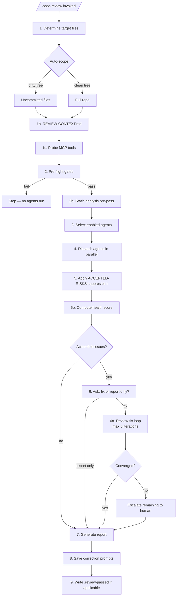

# Code Review Process

How `/code-review` (and its alias `/review`) works end-to-end: from invocation to final report, including the auto-fix loop and the artifacts it produces.

> **Authoritative source**: the command spec at [`commands/code-review.md`](../commands/code-review.md). This document is a reader-friendly walkthrough that links to the spec, rubric, template, and output format for details.

## What it does

`/code-review` is an **orchestrator-only** workflow. It does not review code itself — it dispatches a suite of focused review agents in parallel, aggregates their structured findings, optionally auto-fixes actionable issues in a bounded loop, and produces a health-scored report.

It follows the [Minimum CD agent configuration](https://migration.minimumcd.org/docs/agentic-cd/agent-configuration/) pattern: delegate all semantic analysis, minimize context passed to each agent, run cheap deterministic checks before spending tokens on AI, and return structured results.

## Invocation

```bash
/code-review                    # auto-scope
/code-review --path src/auth    # targeted directory
/code-review --since main       # everything changed since ref
/code-review --all              # full repository
/code-review --agent test-review  # single agent (delegates to /review-agent)
/code-review --json             # machine-readable output (CI)
/code-review --background       # drift review (no gates, structural agents only)
/code-review --force --reason "release freeze"  # skip gates, logged
```

See the [command spec](../commands/code-review.md#parse-arguments) for the full argument list.

## Pipeline



### 1. Determine target files

File scope is resolved with this priority: `--path` → `--since` → `--all` → **auto-scope**.

Auto-scope (the default) runs `git diff --name-only` plus `git diff --cached --name-only`. If either shows changes, only those files are reviewed. If the working tree is clean, the full repository is reviewed.

| File count (full-repo mode) | Behavior |
|-----------------------------|----------|
| ≤ 200 | Proceed |
| 201–500 | Warn, proceed |
| > 500 | Warn and request confirmation |

### 1b. Institutional context

If `REVIEW-CONTEXT.md` exists at the repo root, its contents are read and passed to every agent as "Institutional context provided for this review". This is where a team records domain knowledge, related services, known quirks, or architectural history that agents cannot discover from code alone. The file is optional.

### 1c. Optional MCP tools

The orchestrator probes for enhanced analysis tools (RoslynMCP, code knowledge graph, documentation MCP, Semgrep) and records availability. Agents fall back to Glob/Grep/Read when a tool is unavailable — all agents work without them. Tool availability appears in the final report.

### 2. Pre-flight gates (fail fast, fail cheap)

Deterministic checks run before any AI agent is invoked. Cheaper checks block expensive ones.

| # | Gate | Tool | Stops on |
|---|------|------|----------|
| 1 | Lint | `npx eslint` (or project's lint) | errors |
| 2 | Type check | `npx tsc --noEmit` (if `tsconfig.json` exists) | errors |
| 3 | Secret scan | grep for common secret patterns | any match |
| 4 | Semgrep SAST | `semgrep scan --config auto` | ERROR-severity findings |
| 5 | Pipeline-red check | `gh run list` on current branch | failing CI (warn only) |

Missing tools are skipped silently. Gate failures stop the pipeline — no agents run. `--force --reason "<text>"` skips all gates and logs an entry to `metrics/override-audit.jsonl`. `--background` skips gates entirely.

### 2b. Static analysis pre-pass

If static analysis tools are available (Semgrep, ESLint, TypeScript, pylint), they run against the target files and collect structured findings. Results are **deduplicated across tools** and injected into each agent's prompt as pre-confirmed context:

> "These issues were detected by static analysis tools. Do not re-report them. Focus on semantic and architectural concerns."

Unlike pre-flight gates, the pre-pass never stops the pipeline — its purpose is to give agents a head start. If Semgrep already ran in gate 4, findings are reused rather than re-collected. See [`skills/static-analysis-integration/SKILL.md`](../skills/static-analysis-integration/SKILL.md) for detection, execution, and deduplication rules.

### 3. Select enabled agents

All review agents in `agents/*.md` that declare a `Model tier:` are enabled by default. Four language-agnostic agents always run regardless of tech stack:

- `doc-review` — README, API docs, inline comments, ADRs
- `arch-review` — layer boundaries, dependency direction, pattern consistency
- `claude-setup-review` — CLAUDE.md completeness and accuracy
- `token-efficiency-review` — CLAUDE.md and rule verbosity

A project-local `review-config.json` can disable specific agents. `--background` mode restricts the run to `doc-review`, `arch-review`, `naming-review`, and `structure-review`.

### 4. Dispatch agents in parallel

Each enabled agent is spawned as a sub-agent via the Agent tool, all in a single message for maximum parallelism. Each sub-agent:

- Runs in isolation (context is **not** shared with the parent)
- Receives only the files matching its declared scope (e.g., `js-fp-review` gets JS/TS only)
- Receives the minimum context its `Context needs` field requires

| `Context needs` | Input | When to use |
|-----------------|-------|-------------|
| `diff-only` | Git diff output only | Pattern-matching agents (naming, FP) |
| `full-file` | Complete file contents | Agents needing function-level context |
| `project-structure` | Full files + directory tree | Agents reasoning about architecture |

When the target is the full repository (`--all`, `--path`, or clean auto-scope), agents always receive full files regardless of `Context needs`.

**Model routing** is orchestrator-controlled, not agent-controlled:

| Tier | Model | Assigned to |
|------|-------|-------------|
| small | Haiku | naming, complexity, claude-setup, token-efficiency, performance |
| mid | Sonnet | spec-compliance, test, structure, js-fp, concurrency, a11y, svelte, doc, refactoring, progress-guardian, data-flow-tracer |
| frontier | Opus | security, domain, arch |

Each agent returns a JSON result: `{agentName, status, modelTier, issues[], summary}`. See [`commands/code-review/output-format.md`](../commands/code-review/output-format.md).

### 5. Aggregate results

**5a. ACCEPTED-RISKS suppression.** If `ACCEPTED-RISKS.md` exists at the repo root, its YAML rules are applied in declaration order. The first matching rule suppresses a finding and emits a one-line audit entry. Expired rules become inert and emit a WARN. Broad rules (wildcard `rule_id` or multi-file globs) emit an informational notice. Schema-invalid rules fail the run. Suppressed findings bypass the fix loop and appear in a dedicated report section grouped by rule id. See [`knowledge/accepted-risks-schema.md`](../knowledge/accepted-risks-schema.md).

**5b. Health scoring** per [`knowledge/review-rubric.md`](../knowledge/review-rubric.md):

| Score | Condition |
|-------|-----------|
| 🟢 HEALTHY | 0 fail AND ≤ 2 warn |
| 🟠 NEEDS ATTENTION | 1–2 fail OR 3+ warn |
| 🔴 CRITICAL | 3+ fail OR any `security-review` fail |

**Actionability classification** determines what the fix loop touches:

| Severity | Confidence | Actionable | Behavior |
|----------|------------|------------|----------|
| error / warning | high / medium | Yes | Auto-apply in fix loop |
| error / warning | none | No | Report only — human judgment |
| suggestion | any | No | Report only — do not trigger loop |

### 6. Fix or report only?

If there are zero actionable issues, skip to report generation. Otherwise the orchestrator presents a summary and asks the user:

> **"Fix these issues automatically, or save as report only?"**

- **Fix** → enter the review-fix loop
- **Report only** → skip to report generation with all findings intact

**Exception — non-interactive mode**: when `/code-review` runs inside `/build` (as an inline checkpoint or final gate), the prompt is skipped and the fix loop runs automatically. The orchestrator's Phase 3 approval already served as the human gate.

### 6a. Review-fix loop

```
iteration = 1
while actionable_issues > 0 and iteration ≤ 5:
    1. Apply fixes (file-by-file, top-to-bottom by line number)
    2. Run tests; if tests fail, revert the last fix and mark it human-required
    3. Re-run only the agents that reported actionable issues, against only the modified files
    4. Re-aggregate: merge new results with carry-forward passes
    5. iteration += 1
```

**Exit conditions**:

| Condition | Outcome |
|-----------|---------|
| Zero actionable issues | Converged → generate report |
| Iteration limit (5) reached | Escalate remaining issues to human |
| Same issues persist after fix attempt | Not converging → exit and escalate |
| Test failure after fix + revert | Mark issue human-required, continue |

The final report includes a loop table showing iterations, issues fixed, and agents re-run.

### 7. Generate report

Output format depends on the `--json` flag:

- **JSON** — a single aggregated object with overall status, per-agent results, totals, fix summary, and token estimate. Consumable by CI.
- **Prose** — a markdown report following [`knowledge/review-template.md`](../knowledge/review-template.md): summary table, pre-flight status, institutional context, issues by file (sorted by severity), loop iteration table, recommendations, tool availability.

Remaining issues (not auto-fixed) are tagged `[confidence: none]`, `[auto-fix failed — human review required]`, or `[suggestion]`.

### 8. Correction prompts

For every unfixed actionable issue — plus suggestions worth addressing — a correction prompt JSON is written to `corrections/`. Each prompt includes priority, confidence, category, instruction, context, affected files, and `autoFixResult`. These can be addressed manually or with [`/apply-fixes`](../commands/apply-fixes.md).

### 9. Pre-commit gate file

When the review was auto-scoped to uncommitted changes and the final status is `pass` or `warn`, the orchestrator writes `.review-passed` — a SHA-256 hash of the reviewed file list:

```bash
git diff --cached --name-only | sort | shasum -a 256 | cut -d' ' -f1 > .review-passed
```

The pre-commit hook reads this file to verify the staged files match what was actually reviewed. If the review failed, `.review-passed` is **not** written, and commits are blocked until the review is re-run and passes.

## Artifacts

| Artifact | When | Purpose |
|----------|------|---------|
| Stdout report (markdown or JSON) | Every run | Human or CI consumption |
| `corrections/*.json` | When unfixed actionable or suggestion issues remain | Feeds `/apply-fixes` |
| `.review-passed` | Auto-scoped clean/warn runs | Gates the pre-commit hook |
| `metrics/override-audit.jsonl` | `--force --reason ...` | Audit trail for skipped gates |

## Customization points

| File | Location | Effect |
|------|----------|--------|
| `review-config.json` | Project root | Disables specific agents per project |
| `REVIEW-CONTEXT.md` | Project root | Injects institutional knowledge into every agent's prompt |
| `ACCEPTED-RISKS.md` | Project root | Suppresses known findings with audit trail and expiry |

All three are optional and project-local — they are not part of the plugin.

## Relationship to other workflows

- **Inline review checkpoints** (Phase 3 of `/build`) use the same review-fix loop mechanics, but the orchestrator selects a **targeted** subset of agents based on what changed in the unit of work. `/code-review` is the **final gate** before commit and runs the full enabled suite.
- **[`/review-agent`](../commands/review-agent.md)** runs a single agent — used for targeted checks and as the worker for inline checkpoints.
- **[`/apply-fixes`](../commands/apply-fixes.md)** consumes the `corrections/` directory produced here.
- **[`/pr`](../commands/pr.md)** runs `/code-review` as part of its pre-PR quality gate.

## References

- [Command spec](../commands/code-review.md) — operational detail for the orchestrator
- [Output format](../commands/code-review/output-format.md) — per-agent JSON, aggregated JSON, correction prompts
- [Report template](../knowledge/review-template.md) — prose report structure
- [Scoring rubric](../knowledge/review-rubric.md) — health scoring and severity mapping
- [Agent catalog](agent_info.md) — list of review agents and what each checks
- [Architecture](agent-architecture.md) — where `/code-review` fits in the three-phase workflow
