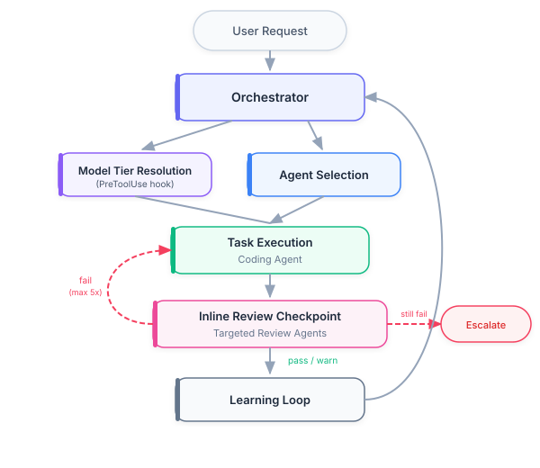
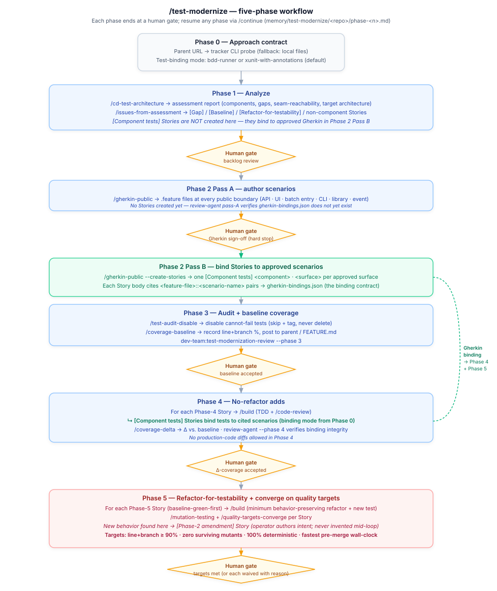

# Architecture

> **Reading order**: Start with the System Overview flowchart, then read Context Management to understand how agents are loaded and unloaded, followed by Quality Assurance for the validation sequence during Phase 3.

## System Overview

The Orchestrator receives every request, classifies it by type and complexity, selects agents, assigns models, and coordinates delivery. During Phase 3 (Implement), review agents check coding agent output at each discrete unit-of-work checkpoint. Findings feed back as structured corrections (max 2 cycles before human escalation). After each task, the learning loop captures metrics and evaluates whether configuration updates are needed.

## Model Routing

Each agent declares an effort band (`effort: low|medium|high`) in its frontmatter. Band-to-model resolution is **enforced by a PreToolUse hook** (`hooks/agent-model-resolve.sh`, registered in `settings.json` under `matcher: "Agent"`) backed by the resolver helper `hooks/lib/model-resolve.sh`: it reads the band by `subagent_type` and maps it via the shipped default map in `knowledge/model-routing.json` or, when present, a per-environment ladder `.claude/model-ladder.json` (gitignored, hand-written for restricted endpoints). The session model captured at SessionStart is the fallback for an unmappable model, never a ceiling. See `agents/orchestrator.md` → Resolution Procedure for the full algorithm, `docs/model-routing.md` for the contract and `docs/model-routing-overrides.md` for ladder authoring, and `/model-routing-check` for a read-only diagnostic.

## Knowledge Index

`knowledge/index.json` is a deterministic, checked-in catalog of every H2/H3 section across `knowledge/**.md` and `skills/**/SKILL.md`. Each entry has a one-sentence summary and a slugified GitHub-style anchor. Agents that reference knowledge files cite an anchor (e.g. `knowledge/owasp-detection.md#a03-injection`) and read only the relevant section via `offset`/`limit`. Four freshness gates keep the index current: (1) PostToolUse hook auto-regen on save, (2) pre-commit sibling hook blocks stale commits, (3) `tests/repo/knowledge_index_current.bats` runs in CI, (4) `tests/agents/agent_knowledge_anchor_tests.bats` validates every reference resolves. See `agents/orchestrator.md` → Knowledge index — consumer usage pattern for the canonical lookup flow, and `hooks/lib/build-knowledge-index.sh --check` for ad-hoc verification.

## Review-Fix Loop

Both inline review checkpoints (Phase 3) and `/code-review` use the same review-fix loop: targeted agents run in parallel, actionable issues (error/warning severity with high/medium confidence) are auto-fixed, and only the agents that reported issues are re-run against the modified files. The loop converges in up to 5 iterations or escalates to a human. `/code-review` is the final gate before commit.

For the full pipeline — targeting, pre-flight gates, static analysis pre-pass, ACCEPTED-RISKS suppression, fix-loop exit conditions, report generation, and the `.review-passed` gate file — see [Code Review Process](code-review-process.md).

## Test modernization workflow

`/test-modernize` is a long-running orchestrator that sequences a five-phase remediation of a legacy repository's tests. Like `/ship`, it delegates each phase to the owning worker and stops at every human gate; unlike `/ship`, the deliverable is not a single PR but a tracker-managed backlog plus the gradual convergence of four quality targets: ≥ 90% line+branch coverage, zero surviving mutants, 100% determinism, and the fastest achievable pre-merge wall-clock with no off-machine dependencies (the *airplane test*).

The five phases:

1. **Analyze** — `/cd-test-architecture` produces the assessment; `/issues-from-assessment` converts it into a parent + Phase-tagged child issues via the tracker CLI that matches the parent URL host (`gh` for `github.com`, `az boards` for `dev.azure.com`, `glab` for GitLab, `acli` for `*.atlassian.net`). When no parent URL is given, or the matching CLI is not installed, the worker informs the operator and falls back to local plan files under `./plans/test-modernize/`.
2. **Specify public interface** — `/gherkin-public` runs in two passes around the human gate. Pass A writes `.feature` files at every public boundary (API endpoint, UI flow, batch-job entry point, CLI command, library export, event type) and stops. The human gate here is a hard stop — no Stories bind to un-reviewed scenarios. After the operator signs off, Pass B creates one `[Component tests] <component> · <surface>` Story per approved (component, surface), each Story body citing the specific `<feature-file>::<scenario-name>` pairs it must satisfy. The scenario → Story-id map (`gherkin-bindings.json`) becomes the binding contract Phases 4 + 5 consume.
3. **Audit + baseline coverage** — `/test-audit-disable` disables every test that cannot fail (skip + tag with reason; never deletes — Phase 4 repairs them); `/coverage-baseline` records line+branch percentages after the audit as the floor every later phase must improve on.
4. **No-refactor adds** — for each Phase-4 Story (in dependency order), `/build` drives RED-GREEN-REFACTOR with inline `/code-review`. For `[Component tests]` Stories, `/build` binds tests to the scenarios cited in the Story body using the binding mode chosen in Phase 0 (`bdd-runner` or `xunit-with-annotations`); for `[Baseline]` Stories, tests lock in current behavior at existing seams (no Gherkin binding needed). After every Story closes, `/coverage-delta` posts Δ vs. baseline AND runs **scoped mutation testing** on the Story's `--story-files` (production-code files derived from `/build`'s commit diff — tests filtered; tracker CLIs not consulted), emitting a structured status (`ok | net_new_survivors | first_measurement | tool_unavailable | skipped_empty_scope`). On `net_new_survivors` the orchestrator pauses Story close with a halt prompt offering three operator actions (`[s]` strengthen, `[f]` drafts a Phase-5 `[Strengthen assertions]` Story, `[w]` waive). At end-of-phase, an additional review loop dispatches `/test-design` + `/code-review` scoped to the phase diff and runs `/apply-fixes` for up to 2 iterations before operator escalation; evidence is persisted to `phase-4-review.json`. Production code MUST NOT change in Phase 4.
5. **Refactor-for-testability + converge** — for each Phase-5 Story (predecessor: its `[Baseline]` Story must be green first), `/build` lands the minimum behavior-preserving refactor plus the test that needed the new seam. Phase-5 `[Component tests]` Stories also bind to approved Scenarios. `/quality-targets-converge` runs after every Story; it **reuses Phase-4's `mutation-history.json`** for files whose last commit pre-dates the recorded entry — only stale or absent files are measured fresh — then the loop picks the largest gap to the four targets and dispatches the smallest action to close it. When the action is "add a component test for a new behavior", the loop opens a `[Phase-2 amendment]` Story rather than inventing a Scenario — the operator remains the only author of intent. Same end-of-phase review loop fires (`/test-design` + `/code-review` + `/apply-fixes`, max 2 iterations) writing `phase-5-review.json` before the human gate. Targets are met or each remaining gap is explicitly waived with a recorded reason.

Between phases, `dev-team:test-modernization-review` reads the just-completed phase's deliverable from `memory/test-modernize/<repo>/phase-<n>.md` and either approves the advance or returns blocker findings. This agent is **outside the standard review-dispatch fan-out** — it gates process, not code. In Phases 2 and 4 it also verifies **Gherkin binding integrity**: every approved Scenario has a `[Component tests]` Story citing it, and every submitted test in those Stories cites the Scenario it exists to satisfy (drift in either direction is a blocker).

`/continue` resumes the workflow from any phase boundary by scanning `memory/test-modernize/<repo>/phase-<n>.md`; `/test-modernize <repo> --from-phase <n>` does the same explicitly.

For how `/test-modernize` composes with the rest of the test-evaluation tools, see [Test Evaluation and Architecture](test-evaluation.md).

## Context Management

The Orchestrator manages context utilization using two operational skills.

### Loading Protocol

[Context Loading Protocol](../skills/context-loading-protocol/SKILL.md) controls what gets loaded and when:

1. **Classify** the task (simple, standard, multi-agent, complex)
2. **Select** the minimum set of agents and skills required
3. **Load in phases**: primary agent first, supporting agents as their phase begins
4. **Unload** previous-phase agents via summarization before loading next-phase agents

### Summarization

[Context Summarization](../skills/context-summarization/SKILL.md) controls when to compress:

| Utilization | Action |
| --- | --- |
| < 40% | Normal operation |
| 40-50% | Prepare for summarization |
| 50-60% | Summarize older conversation turns |
| 60-75% | Aggressive summarization |
| 75%+ | Write summary to `memory/`, start new conversation |

Utilization is estimated via proxy signals (tool call volume, message count, accumulated file reads) as described in the Context Loading Protocol. Summaries follow a structured template and are stored in `memory/` for cross-session continuity.

### Token Budgets

| Component | ~Tokens |
| --- | --- |
| CLAUDE.md (always loaded) | ~800 |
| Single team agent | 290-560 |
| Single skill | 420-1,020 |
| All team agents (no skills) | ~3,590 |
| All review agents | ~3,100 (sub-agents, not loaded in parent context) |
| Knowledge files | ~3,450 (loaded on demand by agents) |
| Subagent prompt templates | ~1,800 (loaded by orchestrator when dispatching) |
| Full load (all team agents + all skills) | ~18,100 |

A typical task loads 1 agent + 1-2 skills: roughly 1,000-2,000 tokens of configuration overhead. Review agents and plan review personas run as isolated sub-agents — their context burden does not accumulate in the parent.

## Plan Review Personas

Before the human reviews a plan (Phase 2), four critical review personas run **in parallel** as sub-agents. Each challenges the plan from a distinct perspective:

| Persona | Template | Model | What It Challenges |
| --- | --- | --- | --- |
| Acceptance Test Critic | `prompts/plan-review-acceptance.md` | sonnet | Per-slice Gherkin quality (determinism, isolation, completeness), criteria verifiability, error-path coverage, TDD step traceability |
| Design & Architecture Critic | `prompts/plan-review-design.md` | sonnet | Dependency direction, abstraction quality, structural risks, pattern consistency |
| Parallelization Critic | `prompts/plan-review-parallelization.md` | sonnet | Same-wave independence: file-overlap collisions (plan-waves.sh), disjoint-file behavioral coupling, residual cycles |
| Strategic Critic | `prompts/plan-review-strategic.md` | sonnet | Problem-solution fit, scope assessment, risk analysis, opportunity cost |
| UX Critic | `prompts/plan-review-ux.md` | sonnet | User journey, error experience, cognitive load, accessibility (self-skips for non-UI plans) |

Each reviewer returns a structured `approve` or `needs-revision` verdict. If any reviewer flags blockers, the plan is revised before the human sees it (max 2 iterations). Warnings from all four are aggregated into a Plan Review Summary appended to the plan file.

This gate catches problems when they cost minutes to fix (in a plan), not hours (in code).

## Quality Assurance

Validation happens in this sequence during Phase 3:

| Order | Layer | Who | When |
| --- | --- | --- | --- |
| 1 | Self-validation | Active agent | Before delivering any unit of work |
| 2 | Inline review checkpoint | Targeted review agents | After each discrete unit of work |
| 3 | Review feedback correction | Coding agent | Up to 2 correction cycles per checkpoint |
| 4 | Final code review | `/code-review` | Before committing; auto-scopes to uncommitted changes, runs full agent suite with fix loop |
| 5 | Documentation review | Tech-writer | After code review passes; verifies docs reflect current behavior |
| 6 | Peer validation | QA agent | After implementation, before phase delivery |
| 7 | Human gate | User | At each phase transition (Research, Plan, Implement) |
| 8 | Post-hoc monitoring | Orchestrator | During learning loop after task completion |

Every agent applies the [Quality Gate Pipeline](../skills/quality-gate-pipeline/SKILL.md) before output. This includes self-validation (Phase 1: factual accuracy, instruction fidelity, consistency, confidence scoring), verification evidence (Phase 2), and review-correction loops (Phase 3).

Quality gates by task type:

| Task Type | Required Gates |
| --- | --- |
| Code implementation | Self-validation + QA review |
| Architecture design | Self-validation + human approval |
| Documentation | Self-validation + terminology check |
| Bug fix | Self-validation + regression test |
| Data analysis | Self-validation + statistical validation |

## Human Oversight

Agents operate autonomously within boundaries. The [Human Oversight Protocol](../skills/human-oversight-protocol/SKILL.md) defines three levels of human involvement:

| Level | When | Example |
| --- | --- | --- |
| **Autonomous** | Routine work within scope | Writing a unit test |
| **Notify** | Significant but within scope | Choosing between two valid patterns |
| **Approve** | High-impact or outside scope | Database schema change, production deploy |

Intervention commands (`override`, `pause`, `stop`) give humans immediate control when needed.

## Governance

[Governance & Compliance](../skills/governance-compliance/SKILL.md) defines audit and ethics requirements:

- All task completions logged to `metrics/` (JSONL format)
- All configuration changes logged to `metrics/config-changelog.jsonl`
- Conversation summaries stored in `memory/` for cross-session continuity
- Significant routing and architectural decisions logged to `memory/decisions.md`
- Sensitive data (credentials, PII) never stored in metrics or memory files
- All agent decisions must be explainable on request

### Pre-Execution Hook Pipeline

A `PreToolUse` hook (`pre-tool-guard.sh`) intercepts every Write and Edit call before execution:

| Action | Trigger | Behavior |
| --- | --- | --- |
| Block | Path matches `blocked_paths` in `guards.json` | Exit 2 — write cancelled, message shown |
| Warn | Path matches `warn_paths` in `guards.json` | Exit 0 — write proceeds, warning shown |
| Allow | No match | Exit 0 — write proceeds silently |

Default blocked patterns: `.env`, `*.pem`, `*.key`, `*.p12`, `*.pfx`, `*credential*`, `*secret*`, `*.token`. Configurable via `.claude/hooks/guards.json`.

### Destructive Command Guard

A second `PreToolUse` hook (`hooks/destructive-guard.sh`) monitors Bash tool calls for destructive commands: file deletion (`rm -rf`), database drops (`DROP TABLE`), git destruction (`force-push`, `reset --hard`), process killing, and permission escalation. Patterns are configurable via `hooks/destructive-commands.json`, which also includes a `safe_allowlist` for routine operations like `rm -rf node_modules`.

By default, destructive commands produce a **warning** (exit 0). When `/careful` mode is active, they are **blocked** (exit 2).

### CodeGraph Nudge

A `PreToolUse` hook (`hooks/codegraph-nudge.sh`) registered on `Read`, `Grep`, and `Glob` recommends `codegraph_*` MCP tools over multi-file exploration when the project has a CodeGraph index (`.codegraph/` in cwd). The hook is silent for single-file Read calls, for Grep with a regular-file `path`, for Glob with a literal `pattern`, and when a `codegraph_*` MCP tool has been used earlier in the current turn (tracked via a sentinel written by a companion `PostToolUse` hook on `mcp__codegraph__.*`). Warns to stderr by default; blocks (`exit 2`) under `/careful`. Fail-open posture throughout — any internal error exits 0. See `docs/codegraph-nudge.md` for the full mechanism.

### Freeze Mode

The `pre-tool-guard.sh` hook also enforces freeze mode. When `/freeze <glob>` is invoked, it writes a state file (`hooks/freeze-state.json`) that restricts Write/Edit operations to files matching the allowed pattern. This prevents accidental edits outside the scope of a debugging session. `/unfreeze` removes the restriction. `/guard <glob>` activates both careful mode and freeze mode together.

### Decision Log

Agents append to `memory/decisions.md` when making non-obvious decisions during task execution. The log persists across session resets, giving future phases visibility into prior reasoning without re-reading full conversation history.

## Feedback Loop

[Feedback & Learning](../skills/feedback-learning/SKILL.md) enables continuous improvement:

1. User provides feedback via keywords (`amend`, `learn`, `remember`, `forget`)
2. Changes are previewed, applied, and logged with full audit trail
3. The Orchestrator monitors for recurring patterns (3+ occurrences)
4. System-initiated changes are proposed to the user with rationale

## Performance Targets

Two metrics are instrumented today: token budgets (measured by `scripts/measure-tokens.sh`) and per-agent detection accuracy (measured by `/agent-eval` against `evals/expected/*.json`). Other goals — efficiency gains, hallucination rate, extraction accuracy, first-pass acceptance — are aspirational and have **no sensor in this repo**, so no numeric target is published until an instrument exists. See the *Claims discipline* section of [`CLAUDE.md`](../CLAUDE.md) for the full instrumented-vs-aspirational breakdown.
