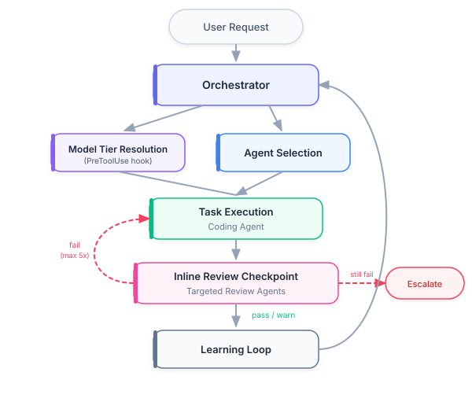
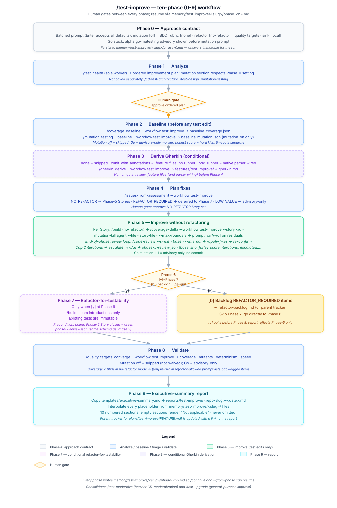

# Architecture

> **Reading order**: Start with the System overview flowchart. Then read Context management to understand how agents are loaded and unloaded. Then read Quality assurance for the validation sequence during Phase 3.

**On this page:** [System overview](#system-overview) · [Three-phase workflow](#three-phase-workflow) · [Model routing](#model-routing) · [Knowledge index](#knowledge-index) · [Review-fix loop](#review-fix-loop) · [Test improvement workflow](#test-improvement-workflow-test-improve) · [Context management](#context-management) · [Plan review personas](#plan-review-personas) · [Quality assurance](#quality-assurance) · [Human oversight](#human-oversight) · [Governance](#governance) · [Feedback loop](#feedback-loop) · [Performance targets](#performance-targets)

## System overview



The Orchestrator receives every request, classifies it by type and complexity, selects agents, assigns models, and coordinates delivery. During Phase 3 (Implement), review agents check coding agent output at each discrete unit-of-work checkpoint. Findings feed back as structured corrections (max 2 cycles before human escalation). After each task, the learning loop captures metrics and evaluates whether configuration updates are needed.

## Three-phase workflow

Feature work flows through three phases — **Research → Plan → Implement** — with a human gate between each.

- **Research** turns a request into approved specs plus a design doc. `/specs` produces Intent, Architecture, and Acceptance Criteria.
- **Plan** decomposes the specs into vertical slices, authors each slice's Gherkin scenarios, and lays out the TDD steps. Up to five critic personas challenge the plan before the human approves it (Acceptance, Design, UX, Strategic, Parallelization). The set scales to plan tier.
- **Implement** runs the per-behavior build loop. The sole build cadence is Code-First Small Batches (IMPLEMENT → TEST → REFACTOR). The loop includes a three-stage inline review (spec-compliance, quality agents, and browser verification for UI changes) and a `/code-review` gate. Implement then opens the PR and feeds the learning loop.


## Model routing

Each agent declares `model:` (an alias, a full model ID, or `inherit`) and `effort:` (`low|medium|high|xhigh|max`) directly in its frontmatter. This is the native Claude Code sub-agent contract, and the harness resolves it before dispatch. There is no plugin-side resolution hook, routing map, or per-environment ladder file. ADR 0026 retired that machinery once the native fields were confirmed to already provide it. See `agents/orchestrator.md` → Model/Effort Resolution.

## Knowledge index

`knowledge/index.json` is a deterministic, checked-in catalog of every H2/H3 section across `knowledge/**.md` and `skills/**/SKILL.md`. Each entry has a one-sentence summary and a slugified GitHub-style anchor. Agents that reference knowledge files cite an anchor (for example `knowledge/owasp-detection.md#a03-injection`). They read only the relevant section via `offset`/`limit`.

Four freshness gates keep the index current:

1. A PostToolUse hook regenerates the index on save.
2. A pre-commit sibling hook blocks stale commits.
3. `tests/repo/test_knowledge_index_current.py` runs in CI.
4. `tests/agents/test_agent_knowledge_anchor.py` validates that every reference resolves.

See `agents/orchestrator.md` → Knowledge index — consumer usage pattern for the canonical lookup flow. See `hooks/lib/build_knowledge_index.py --check` for ad-hoc verification.

## Review-fix loop

Both inline review checkpoints (Phase 3) and `/code-review` use the same review-fix loop. Targeted agents run in parallel. The loop auto-fixes actionable issues (error/warning severity with high/medium confidence). It re-runs only the agents that reported issues against the modified files. The loop converges in up to 5 iterations or escalates to a human. `/code-review` is the final gate before commit.

For the full pipeline, see [Code review process](code-review-process.md). It covers targeting, pre-flight gates, the static analysis pre-pass, ACCEPTED-RISKS suppression, fix-loop exit conditions, report generation, and the `.pr-review-passed` gate file.

## Test improvement workflow (`/test-improve`)

`/test-improve` is the **consolidated** analyze-then-improve orchestrator for legacy or in-flight test suites. It defaults to lightweight ceremony and prompts for heavier capabilities on demand. It always baselines coverage (and mutation, when enabled) before any test change.



It runs ten phases (0-9) with a human gate between each. Every phase writes a progress file at `.claude/memory/test-improve/<slug>/phase-<n>.md` so `/continue` (and `--from-phase`) can resume. The full phase-by-phase reference (gates, arguments, and the flow diagram) lives on its own page: **[test-improve.md](test-improve.md)**.

## Context management

The Orchestrator manages context utilization using two operational skills.

### Loading protocol

[Context Loading Protocol](https://github.com/bdfinst/agentic-dev-team/blob/main/plugins/dev-team/skills/context-loading-protocol/SKILL.md) controls what the Orchestrator loads and when:

1. **Classify** the task (simple, standard, multi-agent, complex).
2. **Select** the minimum set of agents and skills required.
3. **Load in phases**: primary agent first, supporting agents as their phase begins.
4. **Unload** previous-phase agents via summarization before loading next-phase agents.

### Summarization

[Handoff](https://github.com/bdfinst/agentic-dev-team/blob/main/plugins/dev-team/skills/handoff/SKILL.md) (continue mode) controls when to compress:

| Utilization | Action |
| --- | --- |
| < 40% | Normal operation |
| 40-50% | Prepare for summarization |
| 50-60% | Summarize older conversation turns |
| 60-75% | Aggressive summarization |
| 75%+ | Write summary to `.claude/memory/`, start new conversation |

The Context Loading Protocol describes how to estimate utilization from proxy signals (tool call volume, message count, accumulated file reads). Summaries follow a structured template. The Orchestrator stores them in `.claude/memory/` for cross-session continuity.

### Token budgets

| Component | ~Tokens |
| --- | --- |
| CLAUDE.md (always loaded) | ~800 |
| Single team agent | 290-560 |
| Single skill | 420-1,020 |
| All team agents (no skills) | ~3,590 |
| All review agents | ~3,100 (sub-agents, not loaded in parent context) |
| Knowledge files | ~3,450 (loaded on demand by agents) |
| Plan review persona agents | ~1,800 (loaded by orchestrator when dispatching) |
| Full load (all team agents + all skills) | ~18,100 |

A typical task loads 1 agent + 1-2 skills, which is roughly 1,000-2,000 tokens of configuration overhead. Review agents and plan review personas run as isolated sub-agents. Their context burden does not accumulate in the parent.

### Subagent status checks

A subagent's progress or status reaches a *live* orchestrating agent's context only as its structured summary output. This is the verdict/findings contract the `Agent` tool already returns. It never arrives as a raw transcript read.

Pulling a running subagent's full transcript into the orchestrator's working context is the failure mode that Martin Fowler's ["The Orchestrator's Tax"](https://martinfowler.com/articles/orchestrator-tax.html) warns about. Unlike a one-time token bill, that transcript persists and degrades every subsequent turn. The `Agent` tool's contract already prevents this. It returns only final text/schema output, not a transcript, so the failure cannot occur through the standard dispatch path. This subsection states the rule explicitly for future tool and skill authors.

**Offline-resume exception.** The `Workflow` tool's resume mechanism legitimately reads `journal.jsonl` / `agent-<id>.jsonl` transcript files to reconstruct cached results for continuation. That is an *offline* diagnostic read, not a feed into a live orchestrator's context, and is fine. The constraint targets a raw-transcript read that flows back into an *active* orchestrating agent's working context.

## Plan review personas

Before the human reviews a plan (Phase 2), a tier-scaled set of critical review personas runs **in parallel** as sub-agents. The reviewer set scales to a **plan tier** (`trivial`/`standard`/`complex`). The tier derives from slice count, file count, per-step complexity, and whether the plan takes a stance on any high-reversal-cost decision axis. A one-function plan therefore does not pay a complex feature's review ceremony.

- `trivial` runs the Acceptance Test Critic alone.
- `standard` adds the Design & Architecture Critic. It also adds the UX Critic for user-facing plans and the Parallelization Critic when the slice count > 1.
- `complex` runs all five.

The Acceptance Test Critic always runs. The Parallelization Critic runs only when slice count > 1. Each persona challenges the plan from a distinct perspective:

| Persona | Agent | What It Challenges |
| --- | --- | --- |
| Acceptance Test Critic | `agents/plan-review-acceptance.md` | Per-slice Gherkin quality (determinism, isolation, completeness), criteria verifiability, error-path coverage, TDD step traceability |
| Design & Architecture Critic | `agents/plan-review-design.md` | Dependency direction, abstraction quality, structural risks, pattern consistency |
| Parallelization Critic | `agents/plan-review-parallelization.md` | Same-wave independence: file-overlap collisions (plan_waves.py), disjoint-file behavioral coupling, residual cycles |
| Strategic Critic | `agents/plan-review-strategic.md` | Problem-solution fit, scope assessment, risk analysis, opportunity cost |
| UX Critic | `agents/plan-review-ux.md` | User journey, error experience, cognitive load, accessibility (self-skips for non-UI plans) |

Each persona is a registered agent, dispatched by `subagent_type` like any other agent. `/plan` step 5b no longer needs a dispatch-time `model:` override. The harness reads each persona's own `model:`/`effort:` frontmatter natively.

Each reviewer returns a structured `approve` or `needs-revision` verdict. If any reviewer flags blockers, the Orchestrator revises the plan before the human sees it (max 2 iterations). The Orchestrator aggregates warnings from the dispatched reviewers into a Plan Review Summary appended to the plan file. The summary also records the chosen tier and reviewer set, so the scaling decision is auditable.

This gate catches problems when they cost minutes to fix (in a plan), not hours (in code).

## Quality assurance

Validation happens in this sequence during Phase 3:

| Order | Layer | Who | When |
| --- | --- | --- | --- |
| 1 | Self-validation | Active agent | Before delivering any unit of work |
| 2 | Inline review checkpoint | Targeted review agents | After each discrete unit of work |
| 3 | Review feedback correction | Coding agent | Up to 2 correction cycles per checkpoint |
| 4 | Final code review | `/code-review` | Before committing; auto-scopes to uncommitted changes, runs full agent suite with fix loop |
| 5 | Documentation review | Tech-writer | After code review passes; verifies docs reflect current behavior |
| 6 | Peer validation | QA agent | After implementation, before phase delivery |
| 7 | Human gate | User | At each phase transition (Research, Plan, Implement) |
| 8 | Post-hoc monitoring | Orchestrator | During learning loop after task completion |

Every agent applies the [Quality Gate Pipeline](https://github.com/bdfinst/agentic-dev-team/blob/main/plugins/dev-team/skills/quality-gate-pipeline/SKILL.md) before output. The pipeline includes self-validation (Phase 1: factual accuracy, instruction fidelity, consistency, confidence scoring), verification evidence (Phase 2), and review-correction loops (Phase 3).

Quality gates by task type:

| Task Type | Required Gates |
| --- | --- |
| Code implementation | Self-validation + QA review |
| Architecture design | Self-validation + human approval |
| Documentation | Self-validation + terminology check |
| Bug fix | Self-validation + regression test |
| Data analysis | Self-validation + statistical validation |

## Human oversight

Agents operate autonomously within boundaries. The [Human Oversight Protocol](https://github.com/bdfinst/agentic-dev-team/blob/main/plugins/dev-team/skills/human-oversight-protocol/SKILL.md) defines three levels of human involvement:

| Level | When | Example |
| --- | --- | --- |
| **Autonomous** | Routine work within scope | Writing a unit test |
| **Notify** | Significant but within scope | Choosing between two valid patterns |
| **Approve** | High-impact or outside scope | Database schema change, production deploy |

Intervention commands (`override`, `pause`, `stop`) give humans immediate control when needed.

## Governance

[Governance & Compliance](https://github.com/bdfinst/agentic-dev-team/blob/main/plugins/dev-team/skills/governance-compliance/SKILL.md) defines audit and ethics requirements:

- Agents log all task completions to `.claude/metrics/` (JSONL format).
- Agents log all configuration changes to `.claude/metrics/config-changelog.jsonl`.
- Agents store conversation summaries in `.claude/memory/` for cross-session continuity.
- Agents log significant routing and architectural decisions to `.claude/memory/decisions.md`.
- Agents never store sensitive data (credentials, PII) in metrics or memory files.
- All agent decisions must be explainable on request.

### Pre-execution hook pipeline

A `PreToolUse` hook (`hooks/pre_tool_guard.py`) intercepts every Write and Edit call before execution:

| Action | Trigger | Behavior |
| --- | --- | --- |
| Block | Path matches `blocked_paths` in `guards.json` | Exit 2 — write cancelled, message shown |
| Warn | Path matches `warn_paths` in `guards.json` | Exit 0 — write proceeds, warning shown |
| Allow | No match | Exit 0 — write proceeds silently |

Default blocked patterns: `.env`, `*.pem`, `*.key`, `*.p12`, `*.pfx`, `*credential*`, `*secret*`, `*.token`. Configurable via `.claude/hooks/guards.json`.

### Destructive command guard

A second `PreToolUse` hook (`hooks/destructive_guard.py`) monitors Bash tool calls for destructive commands. These include file deletion (`rm -rf`), database drops (`DROP TABLE`), git destruction (`force-push`, `reset --hard`), process killing, and permission escalation. You can configure patterns in `hooks/destructive-commands.json`. That file also includes a `safe_allowlist` for routine operations like `rm -rf node_modules`.

By default, destructive commands produce a **warning** (exit 0). When `/careful` mode is active, the hook **blocks** them (exit 2).

### Pre-PR review gate

A `PreToolUse` hook on `gh pr create` (`hooks/pre_pr_review.py`, #1886) blocks opening the PR (exit 2) unless two conditions hold. First, `.claude/memory/.pr-review-passed` must carry a hash matching the branch's current diff against its base. Second, genuine review-agent dispatch evidence must corroborate the hash.

`git commit` is no longer gated. A branch may accumulate any number of local commits without triggering a review-agent panel. The hard block fires once, against the branch's full diff, at PR-creation time. (`hooks/pre_commit_review.py`, the former commit-time gate, is now a documented no-op.)

When the review was auto-scoped to uncommitted changes and passed, `/code-review` writes `.pr-review-passed` in step 9 ([Code review process → Pre-PR gate file](code-review-process.md#9-pre-pr-gate-file)). That file is bound to the branch-diff hash this gate reads.

**Known residual gap (#1886 follow-up):** `agent_dispatch_ledger.py` still stamps dispatch evidence with the staged-diff hash, not the branch-diff hash. The hashes therefore line up automatically only in the common single-commit-then-PR shape. A branch with multiple separate review-and-commit cycles needs a fresh `/code-review` run against its current diff right before `gh pr create`. Otherwise it falls back to the audited `PR_GATE_BYPASS_REASON` escape hatch below.

**Reasoned bypass.** Setting a non-empty `PR_GATE_BYPASS_REASON` env var allows `gh pr create` through even without a passing gate. `gh` has no `--no-verify`-shaped flag to key a bypass off, so the env var alone is both the trigger and the reason. When the variable is present, the hook logs the bypass unconditionally to `.claude/metrics/gate-bypass-audit.jsonl` (#709/#1886). The log records the timestamp, branch, reason, and branch-diff file count:

```bash
PR_GATE_BYPASS_REASON="hotfix, review to follow" gh pr create ...
```

### Code-intelligence nudge

A `PreToolUse` hook (`hooks/code_intelligence_nudge.py`) is registered on `Read`, `Grep`, and `Glob`. It detects which of CodeGraph (`.codegraph/`), Repowise (`.repowise/`), and Graphify (`graphify-out/graph.json`) are present in the project. It recommends whichever are present and not yet used this turn over multi-file exploration.

- With one tool present, the hook composes a single-tool message.
- With two or more present, it composes a combined, precedence-ordered message (Graphify, then Repowise, then CodeGraph).

The hook is silent in these cases:

- Single-file Read calls.
- Grep with a regular-file `path`.
- Glob with a literal `pattern`.
- Any tool already used earlier in the current turn. A sentinel accumulating `tools_used` tracks this. A companion `PostToolUse` hook on `mcp__codegraph__.*` and `mcp__plugin_repowise_repowise__.*` writes the sentinel.

The hook warns to stderr by default and blocks (`exit 2`) under `/careful`. It fails open throughout: any internal error, or a missing or malformed detection or sentinel surface, exits 0. See `docs/code-intelligence-nudge.md` for the full mechanism.

### Context management

The plugin no longer enforces a context ceiling with a hook ([ADR 0043](https://github.com/bdfinst/agentic-dev-team/blob/main/docs/adr/0043-replace-the-context-ceiling-guard-with-harness-autocompact.md)). `/setup` writes the harness's own `CLAUDE_AUTOCOMPACT_PCT_OVERRIDE` (default 40) into each repo's `.claude/settings.json`. The harness compacts at that percentage of its window. Two `SessionStart` hooks support it:

- `autocompact_setup_nudge.py` (advisory) recommends `/setup` when the key is missing.
- `post_compact_state_reinject.py` (matcher `compact`) re-injects the active `/build` phase, step, and plan progress.

`/handoff` is a manual tool. See [Context management](https://github.com/bdfinst/agentic-dev-team/blob/main/plugins/dev-team/docs/context-management.md) and [Context Loading Protocol → Why 40%](https://github.com/bdfinst/agentic-dev-team/blob/main/plugins/dev-team/skills/context-loading-protocol/SKILL.md#why-40).

### Freeze mode

The `hooks/pre_tool_guard.py` hook also enforces freeze mode. When you invoke `/freeze <glob>`, the `/freeze` skill writes a state file (`.claude/hooks/freeze-state.json`, resolved per invoking repo via `hooks/lib/artifact_paths.py`, issue #1890). The hook reads that file and restricts Write/Edit operations to files matching the allowed pattern. This prevents accidental edits outside the scope of a debugging session.

The state file is repo-scoped rather than relative to the hook's own shared install directory. One session's freeze therefore can never scope-lock a different, concurrently-running session's edits.

`/unfreeze` removes the restriction. `/guard <glob>` activates both careful mode and freeze mode together.

### Decision log

Agents append to `.claude/memory/decisions.md` when they make non-obvious decisions during task execution. The log persists across session resets. It gives future phases visibility into prior reasoning without re-reading the full conversation history.

## Feedback loop

[Feedback & Learning](https://github.com/bdfinst/agentic-dev-team/blob/main/plugins/dev-team/skills/feedback-learning/SKILL.md) enables continuous improvement:

1. The user provides feedback via keywords (`amend`, `learn`, `remember`, `forget`).
2. The system previews, applies, and logs changes with a full audit trail.
3. The Orchestrator monitors for recurring patterns (3+ occurrences).
4. The system proposes system-initiated changes to the user with rationale.

## Performance targets

Two metrics are instrumented today: token budgets (measured by `scripts/measure_tokens.py`) and per-agent detection accuracy (measured by `/agent-eval` against `evals/expected/*.json`). Other goals are aspirational and have **no sensor in this repo**. These goals are efficiency gains, hallucination rate, extraction accuracy, and first-pass acceptance. So the repo publishes no numeric target until an instrument exists. See the *Claims discipline* section of [`CLAUDE.md`](https://github.com/bdfinst/agentic-dev-team/blob/main/plugins/dev-team/CLAUDE.md) for the full instrumented-vs-aspirational breakdown.
