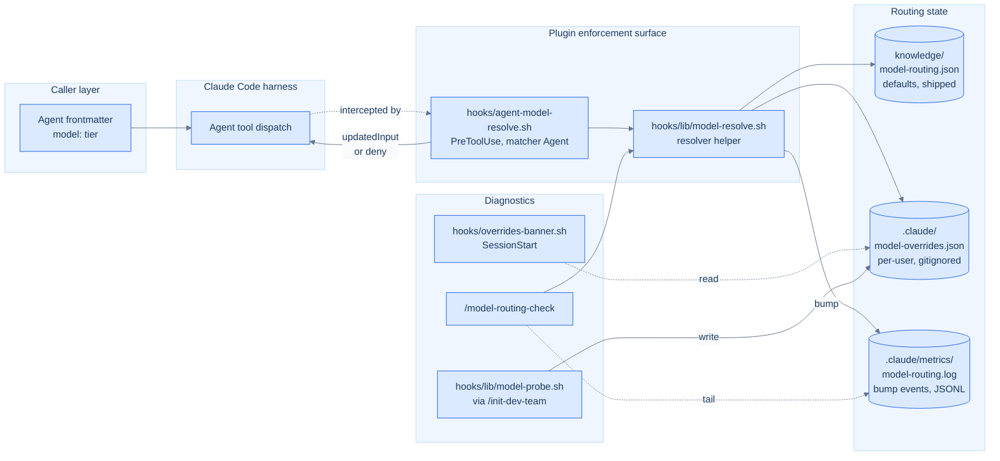
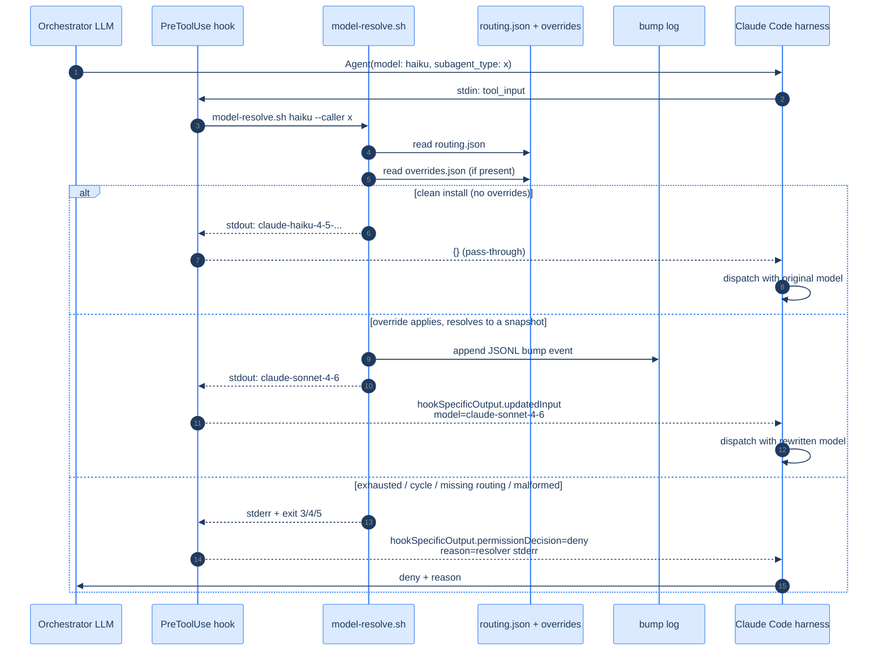

# Model Routing

Environment-aware tier-to-snapshot resolution for the dev-team plugin.
Same code works on a personal Anthropic API key, a corporate proxy with a
restricted model allowlist, and Bedrock or Vertex deployments — with zero
environment-specific config in the repo.

For the design rationale see
[ADR 0004 — Pre-dispatch model tier resolution enforced by a PreToolUse hook](../../../docs/adr/0004-pre-dispatch-model-resolution.md).

## Architecture at a glance



The hook is the only file the harness touches at dispatch time. Everything else is either input (routing.json, overrides.json), output (bump log), or read-only diagnostics.

## Dispatch flow



The deny branch is the only path that surfaces to the LLM — pass-through and bump are invisible to the calling agent (bump is logged to disk for `/model-routing-check`).

## Contract

Each agent's `model:` frontmatter declares a tier alias: `haiku`, `sonnet`, or
`opus`. The PreToolUse hook `hooks/agent-model-resolve.sh`, registered in
`settings.json` under `matcher: "Agent"`, intercepts every sub-agent dispatch
and resolves the tier to a concrete Anthropic snapshot ID before the harness
sees the call.

Resolution inputs:

- `knowledge/model-routing.json` (shipped with the plugin): the single source
  of truth for default tier → snapshot mappings.
- `.claude/model-overrides.json` (per-user, gitignored): optional alias map
  populated by the opt-in `/init-dev-team` probe or hand-written for
  restricted endpoints.

The bump log `.claude/metrics/model-routing.log` records one JSONL event per
resolver invocation where the resolved tier differs from the requested one.
The diagnostic command `/model-routing-check` prints the effective state and
recent bumps; it is read-only.

Exit-code taxonomy on the resolver helper `hooks/lib/model-resolve.sh`:

| Code | Meaning |
| ---- | ------- |
| 0    | Resolved successfully |
| 2    | Unknown tier or missing argument |
| 3    | Exhausted alias chain or cycle detected |
| 4    | `knowledge/model-routing.json` missing |
| 5    | Override file is not valid JSON |

The PreToolUse hook maps codes 3, 4, and 5 to `permissionDecision: "deny"`
with `permissionDecisionReason` containing the resolver's stderr.

## When the fallback fires

The fallback fires in three observable ways.

**Silent bump.** When `.claude/model-overrides.json` maps a tier to another
tier (for example, `{"tier_aliases": {"haiku": "sonnet"}}`), the resolver
walks the alias chain and serves the substituted snapshot. The original
dispatch sees a rewritten `tool_input.model`; the bump log records the
event with the originally-requested tier and the final served tier.

**Refused dispatch.** When the cascade terminates at the sentinel
`"unavailable"` or detects a cycle, the resolver exits 3 and the hook emits
`permissionDecision: "deny"`. The dispatch never reaches the harness; the
calling agent sees a deny reason explaining the routing state.

**Probe-time override write.** The opt-in `/init-dev-team` probe queries
`$ANTHROPIC_BASE_URL/v1/models`. If a default tier's snapshot is missing
from the response, the probe writes `.claude/model-overrides.json` so all
future dispatches transparently route around the missing tier.

## Interpreting the override file

The schema:

```json
{
  "tier_aliases":     { "haiku": "sonnet" },
  "generated_at":     "2026-06-01T12:00:00Z",
  "available_models": ["claude-sonnet-4-6", "claude-opus-4-8"],
  "reason":           "haiku snapshot not in /v1/models response"
}
```

`tier_aliases` is the only field the resolver reads. The other fields are
metadata: `generated_at` is an ISO-8601 timestamp set by the probe;
`available_models` is the verbatim `data[].id` list returned by the probe
endpoint; `reason` is a human-readable summary of why the alias was added.

Sentinel values for `tier_aliases` targets:

- Another tier name (`"haiku"`, `"sonnet"`, `"opus"`) — chains to that tier.
- The literal string `"unavailable"` — refuses dispatch when reached.
- Any other value — treated as `"unavailable"` (refuses dispatch).

The resolver follows alias chains up to 3 hops (haiku → sonnet → opus is the
longest legitimate chain). Cycles are detected and reported via exit 3.

To revert: delete the file. Default routing resumes immediately.

## Adding a new tier

When Anthropic ships a new tier (for example, a hypothetical `nano`):

1. Add the key to `knowledge/model-routing.json`:

   ```json
   { "haiku": "...", "sonnet": "...", "opus": "...", "nano": "claude-nano-X-Y" }
   ```

2. Add the new alias to the `_is_valid_tier` allowlist in
   `hooks/lib/model-resolve.sh` and update the cascade order in `_MAX_HOPS`
   commentary if the new tier sits below `haiku`.

3. Update the agent frontmatter conventions in
   `agents/orchestrator.md` § Tier guidance.

4. Bump the bats fixtures in `tests/knowledge/model_routing_defaults.bats`
   and `tests/hooks/model_resolve_tests.bats`.

5. Document the new tier in this file (§ Contract).

Removing a tier follows the inverse procedure.

## Troubleshooting: Bedrock

AWS Bedrock exposes Claude models under a different API shape than
`api.anthropic.com`. The probe in `/init-dev-team` recognises Bedrock hosts
(`*.amazonaws.com`) by hostname and skips the `/v1/models` request — the
shape would not match anyway.

For Bedrock users:

- The resolver still enforces tier → snapshot resolution; it just relies on
  the default `knowledge/model-routing.json` mappings rather than a probe
  result.
- If the default snapshot IDs are not available in your Bedrock deployment,
  hand-write `.claude/model-overrides.json` (see § Hand-writing the override
  file).
- `/model-routing-check` shows the probe applicability line as
  `non-Anthropic endpoint (probe skipped)`.

## Troubleshooting: Vertex

Google Cloud Vertex AI exposes Claude models under
`*.googleapis.com` hosts. The same gating logic applies: the probe is
auto-skipped, and the resolver falls back to the defaults plus any
hand-written overrides.

For Vertex users, the workflow is identical to Bedrock — hand-write the
override file if a default tier's snapshot is not available.

## Troubleshooting: corporate proxy

Corporate proxies typically present as `https://proxy.example.com` (or a
private IP). The probe's auto-skip allowlist matches `api.anthropic.com` and
`*.anthropic.com`; any other host is treated as non-Anthropic and the probe
is skipped.

Two sub-cases.

**Proxy speaks the Anthropic API shape.** Some corporate proxies forward to
Anthropic and return the same `/v1/models` shape. Force the probe to run by
setting `MODEL_PROBE_FORCE=1` before running `/init-dev-team`:

```bash
MODEL_PROBE_FORCE=1 ANTHROPIC_BASE_URL=https://proxy.corp.example.com claude /init-dev-team
```

The probe writes `.claude/model-overrides.json` with the available-model
diff just like on `api.anthropic.com`.

**Proxy speaks a different shape (Bedrock-style, etc.).** Hand-write the
override file (next section).

If the probe fails (timeout, 5xx, malformed JSON), `/init-dev-team` exit
status is unaffected — the resolver still works with whatever defaults or
hand-written overrides are in place. The probe is a convenience, not a gate.

## Hand-writing the override file

Create `.claude/model-overrides.json` with at minimum the `tier_aliases`
field:

```json
{
  "tier_aliases": {
    "haiku": "sonnet"
  }
}
```

Optional fields (`generated_at`, `available_models`, `reason`) are not read
by the resolver — they exist only to make probe-generated files
human-readable. You may include or omit them.

To verify the file is picked up:

1. Run `/model-routing-check`. The `Overrides:` section should show your
   file's contents.
2. Trigger any sub-agent dispatch. The bump log
   (`.claude/metrics/model-routing.log`) should append a JSONL line.

To restore default routing, delete the file. There is no "disable" flag —
absence of the file is the disabled state.

## Environment variables

**User-facing**:

- `ANTHROPIC_BASE_URL` — standard Claude Code variable. The probe checks
  its host against the Anthropic-shape allowlist.
- `MODEL_PROBE_TIMEOUT` — seconds before the probe gives up (default `5`).
  Raise on slow networks.
- `MODEL_BUMP_TAIL` — how many bump events `/model-routing-check` prints
  (default `10`).
- `MODEL_PROBE_FORCE` — set to `1` to bypass the host allowlist and force
  the probe to run. For corporate-proxy users on Anthropic-shape proxies
  outside `*.anthropic.com`.

**Test-only injection seams** — do not set these in normal use:

- `MODEL_ROUTING_JSON` — override the path to the shipped routing defaults.
- `MODEL_OVERRIDES_JSON` — override the override-cache path.
- `MODEL_BUMP_LOG` — override the bump-log path.

These exist so bats tests can isolate filesystem state without touching the
real `.claude/` directory. Setting them at runtime is not supported.
