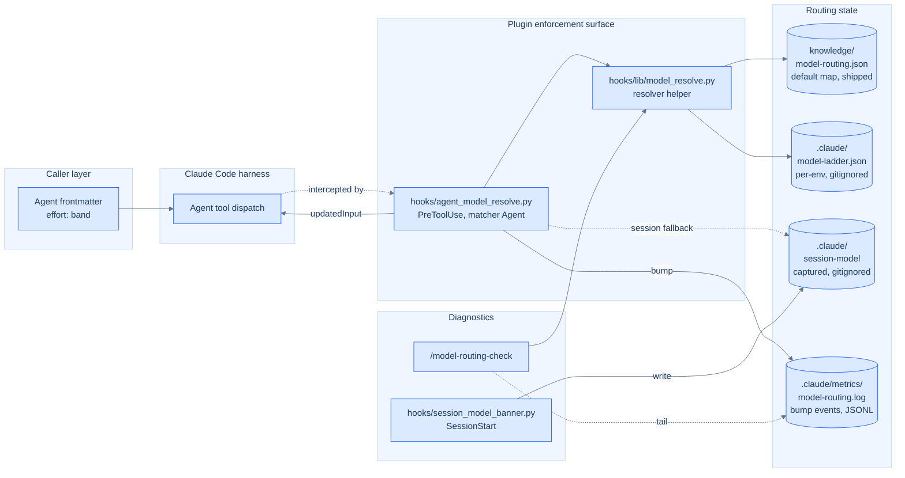
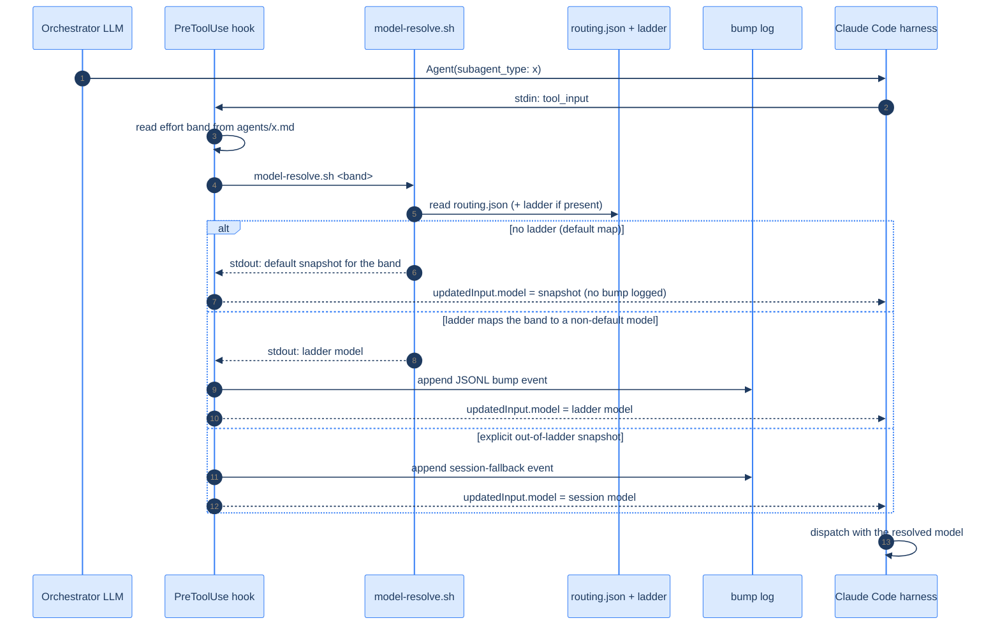

# Model Routing

Effort-band → model resolution for the dev-team plugin. An agent declares the
reasoning **effort** its task needs (`effort: low|medium|high`); the plugin
maps that band to a concrete model at dispatch. The same code works on a
personal Anthropic API key, a corporate proxy with a restricted model
allowlist, and Bedrock or Vertex deployments — with zero environment-specific
config in the repo.

For the design rationale see
[ADR 0008 — Use effort bands instead of model names in agent frontmatter](../../../docs/adr/0008-use-effort-bands-instead-of-model-names-in-agent-frontmatter.md),
which amends [ADR 0004 — Pre-dispatch model resolution enforced by a PreToolUse hook](../../../docs/adr/0004-pre-dispatch-model-resolution.md).
For operator-facing ladder authoring, see [model-routing-overrides.md](model-routing-overrides.md).

## Architecture at a glance



The hook is the only file the harness touches at dispatch time. Everything
else is either input (routing.json, ladder), context (session-model), output
(bump log), or read-only diagnostics.

## Dispatch flow



There is no deny branch. The hook **always** rewrites `tool_input.model` for
an effort-bearing agent (migrated agents carry no `model:` of their own) and
**fails open** (pass-through) on any error — a missing routing.json or an
unreadable agent file never blocks dispatch. Per-dispatch resolution is
silent; bumps are logged to disk for `/model-routing-check`.

## Contract

Each agent declares `effort: low|medium|high` in its YAML frontmatter. The
PreToolUse hook `hooks/agent_model_resolve.py`, registered in `settings.json`
under `matcher: "Agent"`, intercepts every sub-agent dispatch, strips any
`<plugin>:` prefix from `subagent_type`, reads the agent's effort band, and
resolves it to a concrete model before the harness sees the call.

Resolution inputs:

- `knowledge/model-routing.json` (shipped): the band → snapshot **default
  map** (`low/medium/high`) plus legacy `haiku/sonnet/opus` keys retained for
  the deprecation window, and the pinned ladder `rounding` convention. The
  default map equals the pre-migration tier mapping, so zero-config behavior
  is unchanged.
- `.claude/model-ladder.json` (per-environment, gitignored): an optional,
  capability-ascending JSON array of the models that environment has. When
  present and valid it **overrides** the default map.
- `.claude/session-model` (captured at session start, gitignored): the model
  the session began on. Used as the fallback when a requested explicit
  snapshot is unavailable, and as the reference for the SessionStart banner's
  upgrade flags. Never a ceiling.

### Resolution precedence

1. **Valid ladder** → `index = round_half_up(weight·(N−1))` with weights
   `low=0`, `medium=0.5`, `high=1`, indexing into the ladder array.
2. **Shipped default map** → `routing.json[band]` (used when there is no
   ladder, or the ladder is malformed/empty — a bad ladder never aborts
   dispatch).
3. **Session-model fallback** → only for an explicit snapshot a present ladder
   does not contain (the requested model is unavailable in this environment).

Worked examples (`round_half_up`, so N=4 medium lands on index 2):

| Ladder | low | medium | high |
| --- | --- | --- | --- |
| `[haiku, sonnet, opus]` (N=3) | haiku | sonnet | opus |
| `[sonnet, opus]` (N=2) | sonnet | opus | opus |
| `[sonnet]` (N=1) | sonnet | sonnet | sonnet |
| `[haiku, sonnet, opus, ultra]` (N=4) | haiku | opus | ultra |

The N=3 case reproduces today's haiku/sonnet/opus mapping exactly.

### Exit-code taxonomy

The resolver helper `hooks/lib/model_resolve.py`:

| Code | Meaning |
| ---- | ------- |
| 0    | Resolved successfully |
| 2    | Unknown band/tier or missing argument (caller error) |
| 4    | `knowledge/model-routing.json` missing |

The legacy deny-relevant codes (3 exhausted/cycle, 5 malformed overrides) are
no longer reachable: a band always resolves once routing.json is present, and a
bad ladder degrades to the default map. The hook maps any non-zero resolver
exit to **pass-through** (fail-open), never deny.

## Legacy tier acceptance (deprecation window)

An agent that still declares a legacy `model: haiku|sonnet|opus` (or passes one
as `tool_input.model`) resolves tier → band (`haiku→low`, `sonnet→medium`,
`opus→high`) for this release and is logged with `reason=legacy-tier`.
`/agent-audit` warns on the deprecated tier and names the band to use. This
release **warns, never errors**; the next major removes legacy acceptance.

## The bump log

`.claude/metrics/model-routing.log` records one JSONL event per dispatch where
the resolved model differs from the band's shipped default (a ladder override,
upgrade, or downgrade), always for a legacy-tier dispatch, and for a
session-model fallback. A resolution equal to the default rewrites the model
but logs nothing. Schema:

```json
{"ts": "2026-06-21T12:00:00Z", "band": "high", "served": "claude-sonnet-4-6", "reason": "effort", "caller": "security-review", "session": "claude-opus-4-8"}
```

`/model-routing-check` tails this log (read-only). `reason` is one of
`effort` (ladder bump), `legacy-tier`, or `session-fallback`.

## Authoring a ladder (restricted endpoints)

When an environment (Bedrock, Vertex, a corporate proxy) offers only a subset
of models, hand-write `.claude/model-ladder.json` as a capability-ascending
array of the model IDs that environment has:

```json
["claude-sonnet-4-6", "claude-opus-4-8"]
```

With this ladder, `low` → sonnet, `medium`/`high` → opus. Verify with
`/model-routing-check` — its "Effective band → model map" reflects the ladder,
and when no ladder exists it prints a ready-to-edit starter seeded from the
defaults. Delete the file to restore the shipped default map. There is no
"disable" flag — absence of the ladder is the disabled state. For the full
schema and more worked ladders, see
[model-routing-overrides.md](model-routing-overrides.md).

## Adding a new effort band

The three bands (`low/medium/high`) and their weights are the single source of
truth. If a fourth band is ever warranted (e.g. a common 4+ model ladder), add
it in lockstep:

1. Extend `ALLOWED_BANDS` in `tests/agents/agent_effort_frontmatter_tests.bats`
   and the weight table in `hooks/lib/model_resolve.py` (`_band_weight` and
   `normalize_band` — `hooks/agent_model_resolve.py` calls the latter
   directly rather than keeping its own copy).
2. Add the band key to `knowledge/model-routing.json`.
3. Update the band → model dump in `_dump_map`, this file, and the spec.

## Environment variables

**User-facing**:

- `ANTHROPIC_BASE_URL` — standard Claude Code variable (Bedrock/Vertex/proxy
  detection is no longer needed for routing; the ladder is endpoint-agnostic).
- `MODEL_BUMP_TAIL` — how many bump events `/model-routing-check` prints
  (default `10`).

**Test-only injection seams** — do not set these in normal use:

- `MODEL_ROUTING_JSON` — path to the shipped routing defaults.
- `MODEL_LADDER_JSON` — path to the per-environment ladder.
- `SESSION_MODEL_FILE` — path to the captured session model.
- `MODEL_BUMP_LOG` — path to the bump log.
- `MODEL_AGENTS_DIR` — path to the agents directory the hook reads.

These exist so bats tests can isolate filesystem state without touching the
real `.claude/` directory. Setting them at runtime is not supported.

## Calibration floors

`knowledge/calibration-floors.json` is a separate policy table from the
routing files above — it does not affect model selection. It declares, per
eval-graded review agent or advisory skill, a `riskClass`
(`high|standard|advisory`) and a `floor`: the minimum acceptable eval pass
rate (0-1) for that target. `high` (`security-review`, `concurrency-review`,
`arch-review`, `domain-review`) is floor `1.0`; the remaining review agents
are `standard` at `0.9`; low-effort/lexical review agents and advisory-only
skills (e.g. `test-design-advisor`) are `advisory` at `0.8`.

This is slice 1 of epic #879 (band calibration): a pure policy artifact plus
its guard test, `tests/repo/test_calibration_floors_sync.py`
(`scripts/check_calibration_floors_sync.py`), which keeps the table in sync
with the fixture-bearing `applicableAgents`/`applicableSkills` names declared
across `evals/expected/*.json` and with the agents/skills present on disk.

## Band calibration (`/agent-eval --calibrate`)

Slice 3 of epic #879 (issue #882) wires the floors above into an actual
check: `/agent-eval --calibrate [--agent <name>]` (dispatched through
`scripts/agent_calibrate.py`) walks a target's declared `effort:` band
against the cheapest band whose eval fixtures (quarantined pairs excluded)
clear its calibration floor, resolving each band via `hooks/lib/
model_resolve.py` exactly as a real dispatch would. It reports one of
`aligned | downgrade-available | upgrade-required | floor-failure |
uncalibratable` per target, prints a cost preflight before any dispatch, and
refuses `--in-session` (calibration must grade what's on disk). Output lands
at `.claude/evals/reports/<timestamp>-calibration.md` (per-band pass rates
and, on drift, a ready-to-apply `effort:` diff) and
`.claude/evals/calibration-records.json` (one record per target — the input
the staleness check below consumes). This run never edits any file
under `plugins/dev-team/agents/` or `plugins/dev-team/skills/` — report-only,
always. See [agent-eval's SKILL.md](../skills/agent-eval/SKILL.md#calibration-mode)
for the full procedure.

## Recalibration staleness advisory (`/model-routing-check`)

Slice 4 of epic #879 (issue #883) is the recalibration trigger: routing-map
edits and model releases invalidate a target's last calibration, and this
surfaces that drift instead of leaving it silent. `/model-routing-check`'s
fifth section reads `knowledge/calibration-floors.json` for the target
universe and `.claude/evals/calibration-records.json` for each target's last
calibration record (both written by slice 1 `#880` and slice 3 `#882`
respectively), and recomputes the current content hash of
`knowledge/model-routing.json` + `.claude/model-ladder.json` using the exact
same `routing_hash()` construction `scripts/agent_calibrate.py` used to stamp
the record. Three states per target:

- **`calibration-current`** — the record's `routing_hash` matches the
  current hash. Nothing to do.
- **`calibration-stale`** — the routing map or ladder changed since the
  target was last calibrated (hash drift). Flagged with a pointer to
  `/agent-eval --calibrate --agent <target>`.
- **`never-calibrated`** — the target has a floors entry but no calibration
  record yet. Listed with the same pointer.

**This is advisory only — it never blocks dispatch.** Even when every
calibration record is stale (or none exist at all), `hooks/
agent_model_resolve.py`'s dispatch behavior is completely unchanged; the
advisory is a read-only diagnostic, matching the model-resolution hook's
fail-open contract. See [model-routing-check's SKILL.md](
../skills/model-routing-check/SKILL.md) for the exec block and the
`CALIBRATION_FLOORS_JSON`/`CALIBRATION_RECORDS_JSON` test-only injection
seams.
