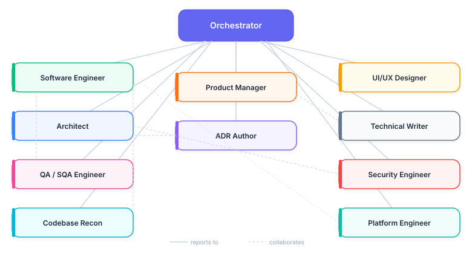
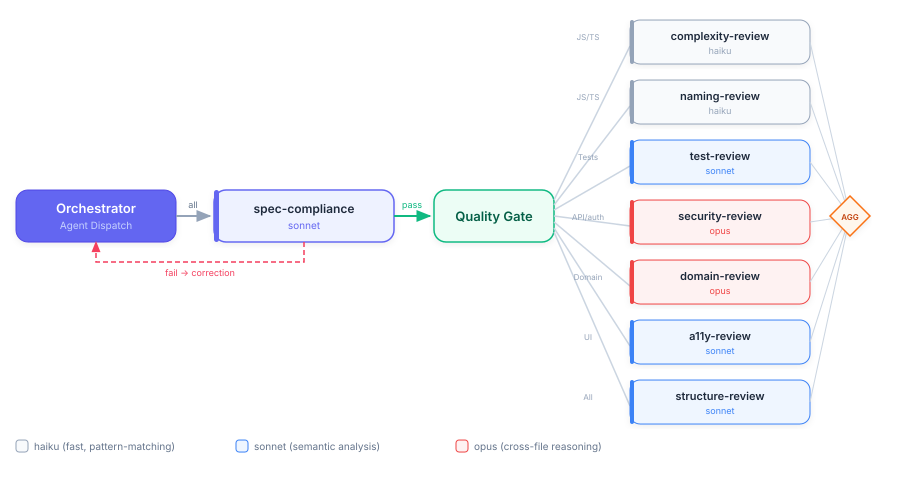

# Team organization

This document is a visual index of the agent team. For behavioral details of each agent, see [Agents](agent_info.md). For orchestration mechanics, see [Architecture](agent-architecture.md).

## Team agents

The Orchestrator sits at the root and routes every request to one or more of the ten team agents based on task classification. Only the Orchestrator spans phases. The other agents load on demand when their phase begins. Summarization unloads them before the next phase starts. Full roster: [Agents → Team Agents](agent_info.md#team-agents).

## Review agent dispatch (Phase 3 inline checkpoints)

The Orchestrator selects review agents based on what changed in each unit of work. Language-agnostic agents (doc-review, arch-review) always run. Language-specific agents run only when matching file types are present. `claude-setup-review`, `token-efficiency-review`, and `ai-provenance-review` are not in this fan-out (#1733). Their findings are properties of the whole repository, not any single unit of work. They run instead in the whole-tree `/repo-review` command. You can also run `claude-setup-review` on demand with `/claude-setup-review`. Full list of review agents and their scopes: [Agents → Review Agents](agent_info.md#review-agents).

## Special-purpose review agents

`progress-guardian` is a process gate-keeper, not a code reviewer. It is not in the standard review-dispatch fan-out above. It tracks plan-step completion and commit discipline. Its owning orchestrator invokes it, never `/code-review`.

`/test-improve` does **not** use a separate phase-gate agent. Its per-phase progress files under `.claude/memory/test-improve/<slug>/phase-<n>.md` and its end-of-phase review loop (Phase 5 and Phase 7) carry the equivalent evidence contract.
