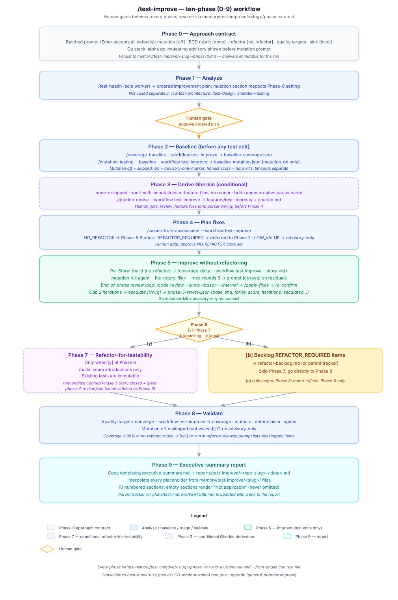

# `/test-improve`

**File:** [`skills/test-improve/SKILL.md`](../skills/test-improve/SKILL.md)
**Role:** orchestrator.

`/test-improve` is the **consolidated** analyze-then-improve orchestrator for
legacy or in-flight test suites, and one of the plugin's two multi-phase
pipelines with inter-phase human gates (the other is [`/ship`](workflows.md#ship)).
It defaults to lightweight ceremony, prompts for heavier capabilities
(Gherkin extraction, mutation testing, refactor-for-testability) only on
demand, and always baselines coverage (and mutation, when enabled) before any
test change.

This page is the canonical phase reference. For where `/test-improve` sits
among the plugin's other commands see [workflows.md](workflows.md); for how it
fits the wider agent architecture see
[agent-architecture.md](agent-architecture.md#test-improvement-workflow-test-improve).

## Phases

Each phase writes a progress file to
`memory/test-improve/<slug>/phase-<n>.md` so `/continue` (and `--from-phase`)
can resume.

- **Phase 0 — Approach contract.** Batched prompt (Enter accepts all
  defaults): mutation mode `[kill-loop]` (`off` / `kill-loop` /
  `baseline+kill-loop`), BDD rubric `[none]`, refactor `[no-refactor]`,
  quality targets, sink (`--parent <url>` vs local files), and the all-or-none
  code-lookup install (explicit `y`/`n`, not part of Enter-accepts-all). An
  Enter-through run now performs the mutant-kill loop by default. Go stack shows
  the alpha go-mutesting advisory before the mutation prompt. Answers are
  immutable for the run.
- **Phase 1 — Analyze.** Delegate to `/test-health` (sole worker). No
  separate calls to `/cd-test-architecture`, `/test-design`,
  `/mutation-testing`. Mutation section respects Phase-0 setting. A
  separate, direct classification pass persists a before-snapshot of test
  counts by MinimumCD type to `test-counts-before.json`.
- **Phase 2 — Baseline (before any test edit).**
  `/coverage-baseline --workflow test-improve` unconditionally;
  `/mutation-testing --baseline --workflow test-improve` only in
  `baseline+kill-loop` mode (`off` and `kill-loop` take no baseline).
  Go = advisory-only marker. Honest score = hard kills, timeouts separate.
- **Phase 2b — Derive Gherkin (conditional).** `none` skips entirely;
  `xunit-with-annotations` writes `.feature` files without a runner;
  `bdd-runner` wires the native parser.
- **Phase 3 — Triage.** `/issues-from-assessment --workflow test-improve`
  partitions findings into `NO_REFACTOR` (Phase-4 Stories) /
  `REFACTOR_REQUIRED` (deferred to Phase 5) / `LOW_VALUE` (advisory-only).
- **Phase 4 — Improve without refactoring.** Per Story: `/build`
  (no-refactor) → `/coverage-delta --workflow test-improve --story <id>` →
  `mutation-kill` agent (`--file <story-file> --max-rounds 3`, `[c/r/w/q]` on
  residuals). End-of-phase review loop runs `/test-design --since` and
  `/code-review --since` in parallel, `/apply-fixes` then re-run, cap 2
  iterations, `[r/w/q]` escalation. Evidence in `phase-4-review.json`.
- **Phase 4b — Refactor decision prompt.** `[y] enter Phase 5 / [b] backlog
  and skip to Phase 6 / [q] quit`. The letter `y` is deliberately chosen over
  `r`, which is already claimed by mutation-kill's `[c/r/w/q]` (retry) and the
  review loop's `[r/w/q]` (revise).
- **Phase 5 — Refactor-for-testability (conditional).** Only when `[y]`.
  Seam-only production-code changes; existing tests are immutable. Each Story
  precondition-checks the paired Phase-4 baseline is closed and green. Same
  end-of-phase review loop; evidence in `phase-5-review.json`.
- **Phase 6 — Validate.** `/quality-targets-converge --workflow test-improve
  --refactor-mode <value>` — threading Phase 0's `no-refactor`/
  `refactor-allowed` value keeps the coverage-gap dispatch table from
  proposing a `[Refactor-for-testability]` Story once no-refactor was
  already chosen at Phase 4b; it writes a `refactor-backlog.md` entry
  instead. Mutation off = skipped (not waived). Go = advisory-only.
  Coverage < 90% in no-refactor mode → `[y/n]` re-run-in-refactor-allowed
  prompt lists backlogged items and records `coverage_reprompt_fired: true`
  in `phase-6.md` (so Phase 7's close-out prompt below doesn't re-ask). The
  identical classification pass from Phase 1 recounts test-by-type into
  `test-counts-after.json`. `/handoff` is suggested here, and after Phase 1
  and the Phase 4/5 review loops — the context-heaviest boundaries.
- **Phase 7 — Executive-summary report.** Interpolates the shipped
  [`templates/executive-summary.md`](../skills/test-improve/templates/executive-summary.md)
  from `memory/test-improve/<slug>/` files to
  `reports/test-improve/<repo-slug>-<date>.md`. 10 numbered sections;
  empty sections render "Not applicable" (never omitted). § 1 includes a
  "Tests by type" table (Baseline/Achieved/Δ per MinimumCD type). § 7
  foregrounds a seam-needed/behavior-gained/estimated-risk table sourced
  from `refactor-backlog.md`. Parent tracker (or
  `plans/test-improve/FEATURE.md`) is updated with a link to the report.
  Report is regeneratable from memory. After Phase 7, if
  `refactor-backlog.md` has entries and Phase 6's re-run prompt never fired
  this run, a close-out `[y/n]` prompt asks whether to re-run with
  refactor-allowed mode.

## Arguments

`/test-improve <repo-path> [--parent <url>] [--analyze-only] [--from-phase <n>] [--stack <id>]`

| Flag | Behavior |
| --- | --- |
| `<repo-path>` | Positional. Path to the repository to improve (required). |
| `--parent <url>` | Post progress and Stories to this tracker issue URL instead of local plan files. |
| `--analyze-only` | Run Phase 0–1 only; skip improvement phases. |
| `--from-phase <n>` | Resume from phase `n` (requires existing `memory/test-improve/<slug>/` files). |
| `--stack <id>` | Override auto-detected stack identifier (e.g. `go`, `python`, `java`). |

`/continue` resumes any phase from `memory/test-improve/<slug>/phase-<n>.md`;
`--from-phase <n>` does the same explicitly and never re-prompts Phase 0.
`--analyze-only` runs Phase 0 + Phase 1 and exits before baseline capture.
