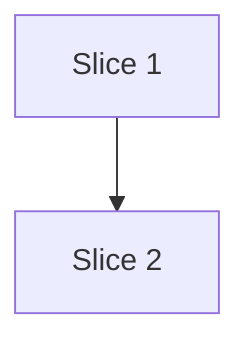

# Plan File Template

Use this structure when writing the plan file (step 3 of `SKILL.md`).

````markdown
# Plan: <Task Title>

**Created**: <date>
**Branch**: <current branch>
**Status**: draft

## Goal

<One paragraph describing what this plan achieves and why.>

## Acceptance Criteria

- [ ] <Criterion 1 — observable, testable>
- [ ] <Criterion 2>
- [ ] <Criterion 3>

## Slices

A slice is a vertically deliverable increment. Each slice carries the Gherkin
scenario(s) that define its behavior, followed by the TDD steps that satisfy them.
Steps are numbered `<slice>.<step>` (1.1, 1.2, 2.1, …).

### Slice 1: <Slice Name>

**Depends-on:** none
**Files:** `path/to/file.ts`, `path/to/file.test.ts`

**Behavior:**

```gherkin
Feature: <feature name>

  Scenario: <happy path>
    Given <precondition>
    When <action>
    Then <observable outcome>

  Scenario: <negative / edge / error case>
    Given <precondition>
    When <action>
    Then <observable outcome>
```

**Steps:**

#### Step 1.1: <Description>

**Complexity**: <trivial | standard | complex>
**RED**: Write test for <scenario / behavior>
**GREEN**: Implement <minimal code to pass>
**REFACTOR**: <What to clean up, or "None needed">
**Files**: `path/to/file.ts`, `path/to/file.test.ts`
**Commit**: `<draft commit message>`

#### Step 1.2: <Description>

...

### Slice 2: <Slice Name>

**Depends-on:** 1
**Files:** `path/to/other.ts`

**Behavior:**

```gherkin
...
```

**Steps:**

#### Step 2.1: <Description>

...

## Parallelization

Each slice declares `Depends-on` (slice ids it must follow, or `none`). The build
**waves** are derived from those declarations by `scripts/plan_waves.py` — do not
hand-maintain them. Independent slices in the same wave can be built concurrently
(`/build` dispatches them to isolated worktrees).



| Wave | Slices (parallel) |
|------|-------------------|
| 1 | 1 |
| 2 | 2 |

If `scripts/plan_waves.py` reports a cycle, a missing `Depends-on`, an unknown reference,
or a **same-wave file collision** (two slices in one wave declaring the same file),
fix the plan before the human gate — those break safe concurrent delivery.

## Complexity Classification

Each step must include a complexity rating that controls review depth during `/build`:

| Rating | Criteria | Review depth |
|--------|----------|--------------|
| `trivial` | Single-file rename, config change, typo fix, documentation-only | Skip inline review; covered by final `/code-review` |
| `standard` | New function, test, module, or behavioral change within existing patterns | Spec-compliance + relevant quality agents |
| `complex` | Architectural change, security-sensitive, cross-cutting concern, new abstraction | Full agent suite including opus-tier agents |

When in doubt, classify up (standard rather than trivial, complex rather than standard).

## Pre-PR Quality Gate

- [ ] All tests pass
- [ ] Type check passes (if applicable)
- [ ] Linter passes
- [ ] `/code-review` passes
- [ ] Documentation updated (if applicable)

## Skipped (low value)

Findings classified `LOW_VALUE` — feasible but no signal (no branching logic, no
observable outcome, coverage already provided by a higher-layer test). These are
**skipped, not deferred**: they never appear in a slice or a work stream. Omit this
section when there are none.

| Finding | Rationale (one line) |
|---|---|
| <finding> | <why it delivers no signal> |

## Risks & Open Questions

- <Risk or question, with mitigation or who should answer>

## Build Progress

This section is the machine-parseable recovery handle. `/build` updates checkboxes here via Edit tool so progress survives a `/clear` or session restart. `/continue` reads this section to determine the resume point.

### Slices (grouped by wave)

#### Wave 1
- [ ] Slice 1: <title>
  - [ ] Step 1.1: <title>
  - [ ] Step 1.2: <title>

#### Wave 2
- [ ] Slice 2: <title>
  - [ ] Step 2.1: <title>
````
